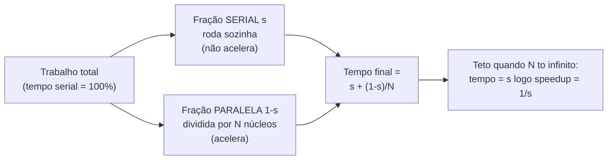
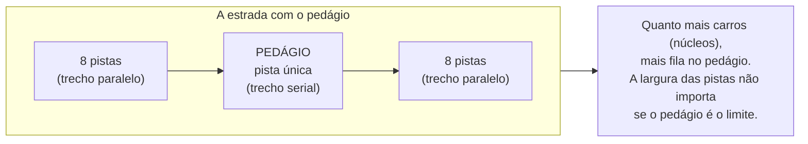
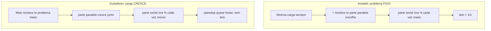
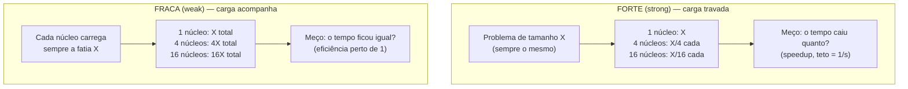
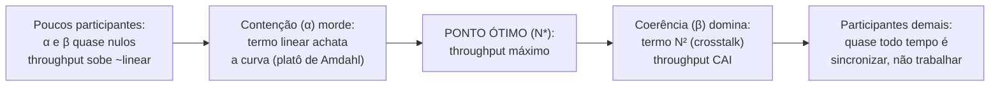

# As leis da escala: Amdahl e Gustafson

> [!abstract] Resumo em uma linha
> Dobrar os núcleos não dobra a velocidade: a parte serial impõe um teto (Amdahl), mas se você crescer o problema junto com a máquina, o ganho volta a escalar quase linear (Gustafson).

A pergunta parece ingênua, mas separa quem entende de escala de quem só compra hardware: **se eu dobrar os núcleos, dobro a velocidade?** A resposta honesta é não. Quase nunca. Há um teto, e ele tem nome.

Esta nota é o fecho conceitual do galho. Ela explica por que [[15 - Paralelismo de dados|dividir o trabalho]] entre N núcleos rende menos do que a aritmética promete, e por que adicionar núcleos pode, em algum ponto, **piorar** o desempenho. É o tipo de raciocínio que um senior puxa antes de escrever a primeira linha de código paralelo.

## Speedup e eficiência: medindo o ganho

Antes das leis, dois números.

**Aceleração (speedup)** é o quanto ficou mais rápido:

```
speedup = tempo_serial / tempo_paralelo
```

Se a versão de um núcleo leva 100 segundos e a de 4 núcleos leva 40, o speedup é 2,5×. Não 4×. Já tem dinheiro escapando.

**Eficiência** é o speedup dividido pelos núcleos:

```
eficiência = speedup / núcleos
```

No exemplo, 2,5 / 4 = 0,625, ou 62,5%. Cada núcleo está entregando só 62% do que entregaria sozinho. Os outros 38% viraram fumaça: coordenação, espera, briga por memória.

O ideal é o **speedup linear**: N núcleos rendem N× mais, eficiência de 100%. Ele existe nos slides. Na vida real, raríssimo — e quando aparece, geralmente é problema mal medido (cache esquentando, baseline ruim) ou uma carga *embaraçosamente paralela* sem nenhuma costura entre as partes.

> [!question] Por que o ideal quase nunca acontece?
> Porque todo programa real tem um pedaço que **precisa** rodar sozinho: ler o arquivo de entrada, somar os resultados parciais no fim, escrever no banco. Esse pedaço não acelera por mais núcleos que você jogue nele. Foi exatamente isso que Gene Amdahl formalizou em 1967.

## A lei de Amdahl: o teto do problema fixo

A intuição é uma frase que todo gerente de projeto deveria ter tatuada:

> [!quote] A analogia das nove mulheres
> Nove mulheres não fazem um bebê em um mês. A gestação é **serial** — você não a paraleliza adicionando "recursos". Todo programa tem sua gestação: a parte que só anda em fila indiana.

Formalmente: se uma fração `s` do trabalho é **serial** (não paralelizável) e o resto `(1-s)` é perfeitamente paralelizável, o speedup máximo com N núcleos é:

```
speedup(N) = 1 / ( s + (1 - s) / N )
```

E o golpe de misericórdia: quando N tende ao infinito, o termo `(1-s)/N` some, e o speedup tende a:

```
speedup_máximo = 1 / s
```

Leia de novo. Se 5% do seu programa é serial, o speedup máximo é `1 / 0,05 = 20×`. **Vinte.** Não importa se você tem 16, 1.000 ou um milhão de núcleos. O teto é vinte, porque aqueles 5% continuam rodando em série enquanto o resto já terminou e fica olhando.

### A tabela que dói

Veja o teto se fechando conforme a fração serial cresce. Linhas são a fração serial `s`; colunas são o número de núcleos N.

| Fração serial `s` | N=2 | N=4 | N=8 | N=16 | N=∞ (teto) |
|---|---|---|---|---|---|
| 1% (0,01) | 1,98× | 3,88× | 7,48× | 13,9× | **100×** |
| 5% (0,05) | 1,90× | 3,48× | 5,93× | 9,14× | **20×** |
| 10% (0,10) | 1,82× | 3,08× | 4,71× | 6,40× | **10×** |
| 25% (0,25) | 1,60× | 2,29× | 2,91× | 3,37× | **4×** |

Os números contam uma história brutal. Com 10% serial, mesmo 16 núcleos te dão só 6,4× — e o céu, com infinitos núcleos, é apenas 10×. Com 25% serial, você bate em 4× e acabou: jogar hardware vira queimar dinheiro.

> [!warning] A parte serial domina, e domina cedo
> O retorno marginal de cada núcleo adicional despenca rápido. Do núcleo 8 ao 16 (com s=5%) você ganha de 5,93× para 9,14× — pagou o dobro de máquina para um ganho de 1,5×. A parte serial é o pedágio que toda viagem paga, e ele não tem pista expressa.



Leitura do diagrama: o trabalho se parte em dois fluxos. A fração paralela encolhe à medida que você divide por N — pode quase zerar. Mas a fração serial fica parada, intacta, e é ela quem define o piso do tempo final. Por isso o teto do speedup é exatamente o inverso da fração serial.

### O gargalo serial, visto de outro jeito



Leitura do diagrama: você pode alargar as pistas para 8, 80 ou 800 faixas, mas se no meio existe um pedágio de pista única, todo mundo afunila ali. Esse pedágio é a fração serial. Aumentar os núcleos é alargar as pistas; o tempo de travessia é refém do pedágio.

## A lei de Gustafson: o contraponto da carga crescente

Em 1988, John Gustafson e Edwin Barsis publicaram *Reevaluating Amdahl's Law* com uma observação simples e libertadora: **na prática, ninguém compra um supercomputador para rodar o mesmo probleminha mais rápido.** Você compra para resolver um problema *maior* — uma malha mais fina, mais dados, mais resolução, mais usuários.

Essa mudança de pergunta muda tudo.

Amdahl pergunta: *"dado um problema de tamanho fixo, quanto mais rápido fico com N núcleos?"* (escalabilidade forte). Gustafson pergunta: *"dado N núcleos, quão grande é o problema que resolvo no mesmo tempo?"* (escalabilidade fraca).

A premissa de Gustafson: conforme você adiciona núcleos, a **parte paralela cresce com o problema**, enquanto a parte serial (ler config, inicializar, agregar) tende a ficar mais ou menos constante. Resultado: a fração serial **encolhe relativamente** à medida que o trabalho total cresce. O *scaled speedup* então escala quase linearmente com N — sem teto fixo.



Leitura do diagrama: as duas leis não brigam — elas respondem perguntas diferentes. Em Amdahl a carga é congelada, então a fatia serial fica cada vez mais visível conforme você acelera o resto. Em Gustafson a carga acompanha a máquina, então a fatia serial é diluída num bolo cada vez maior e some na proporção.

> [!tip] A reconciliação que impressiona em entrevista
> "Amdahl e Gustafson não se contradizem; eles assumem coisas diferentes sobre o que acontece com o tamanho do problema." Amdahl descreve **strong scaling** (problema fixo, mais núcleos). Gustafson descreve **weak scaling** (problema cresce com os núcleos). Renderização de cena fixa, processamento de batch de tamanho fechado: pensamento Amdahl. Simulação científica, treino de modelo onde você sempre quer mais dados: pensamento Gustafson.

## Escalabilidade forte × fraca: formalizando os dois eixos

Em HPC, essas duas perguntas têm nome próprio e regras de medição próprias. Não são jargão acadêmico — são as duas formas honestas de plotar "será que escala?".

**Escalabilidade forte (strong scaling).** Você congela o tamanho do problema e vai jogando mais núcleos. A pergunta é "quão mais rápido?". A métrica é o speedup `tempo(1) / tempo(N)`. É governada por Amdahl, e bate no teto `1/s`. Strong scaling é difícil: quanto mais núcleos, menos trabalho sobra por núcleo, e o overhead de coordenação domina mais cedo.

**Escalabilidade fraca (weak scaling).** Você cresce o problema *na mesma proporção* dos núcleos — cada núcleo carrega sempre a mesma fatia de trabalho. A pergunta é "consigo manter o tempo constante?". A métrica é a eficiência `tempo(1, carga_1) / tempo(N, carga_N)`: idealmente fica perto de 1. É governada por Gustafson, e por isso parece "sem teto". Weak scaling é mais fácil de sustentar porque a fração serial fica diluída num bolo cada vez maior.

| Aspecto | Escalabilidade forte | Escalabilidade fraca |
|---|---|---|
| Tamanho do problema | **Fixo** | **Cresce com N** |
| Trabalho por núcleo | Diminui com N | **Constante** |
| Pergunta | "Quão mais rápido fico?" | "Mantenho o tempo?" |
| Métrica | speedup = `t(1)/t(N)` | eficiência = `t(1)/t(N)` na carga escalada |
| Lei que governa | **Amdahl** (teto `1/s`) | **Gustafson** (quase linear) |
| Limite prático | Overhead domina cedo | Memória/comunicação por nó |
| Caso típico | Renderizar 1 frame mais rápido | Simulação com malha mais fina |



Leitura do diagrama: na escala forte o bolo é o mesmo e você fatia mais fino — o sucesso é o relógio cair. Na escala fraca o bolo cresce junto com a cozinha e cada cozinheiro faz sempre uma fatia — o sucesso é o relógio *não subir*. São dois experimentos diferentes; medir um e reportar como o outro é o erro clássico de benchmark de paralelismo.

Como se mede na prática: para **strong scaling**, você roda o *mesmo* dataset em 1, 2, 4, 8... nós e plota o speedup; a curva descola da reta ideal exatamente onde a fração serial e o overhead começam a pesar. Para **weak scaling**, você roda em 1, 2, 4, 8... nós *multiplicando o dataset pelo mesmo fator* e plota a eficiência; idealmente uma reta horizontal em 1,0 — qualquer queda denuncia comunicação ou memória que não acompanharam o crescimento. A pegadinha de honestidade: nunca compare o speedup de strong scaling de um sistema com a eficiência de weak scaling de outro e diga que um "escala melhor". São réguas diferentes.

## A Lei Universal de Escalabilidade: por que mais núcleos podem PIORAR

Amdahl e Gustafson assumem que a parte paralela é *perfeitamente* paralelizável — divide-se em N e pronto. A realidade cobra dois impostos, e Neil Gunther os formalizou na **Lei Universal de Escalabilidade (USL)**, apresentada em 1993 e tratável como uma generalização de Amdahl. A capacidade relativa de um sistema com N participantes (núcleos, threads, nós) é:

```
C(N) = N / ( 1 + α(N - 1) + β·N(N - 1) )
```

Há dois coeficientes, e cada um conta uma física diferente:

- **α — contenção (contention).** É a fração serial de Amdahl com outro nome: o trecho que serializa porque só um por vez pode entrar (lock, recurso compartilhado). O termo `α(N-1)` cresce *linear* em N. Sozinho, ele faz a curva **saturar** num platô — exatamente o teto de Amdahl.
- **β — coerência (coherency).** É o custo de manter todos os participantes *de acordo*: sincronizar estado, invalidar caches, trocar mensagens ponto a ponto. Aqui está a sacada: coordenar N participantes exige ~`N²` interações (cada um precisa "conversar" com os outros). O termo `β·N(N-1)` cresce **quadrático**. É o *crosstalk*: conversa cruzada que ninguém pediu.

O termo linear (α) achata a curva; o termo quadrático (β) a **derruba**. Quando β é maior que zero, existe um número de participantes onde o throughput é máximo — e adicionar mais um faz o throughput **cair**. A curva não satura: ela tem corcova.



Leitura do diagrama: a curva da USL nasce subindo quase reta (linear ideal), depois a contenção a achata num joelho (era até onde Amdahl enxergava), atinge um pico em N\* e então a coerência quadrática puxa para baixo. Passou de N\*, cada participante extra gasta mais tempo se coordenando com os outros do que produzindo. O retorno fica **negativo**.

> [!danger] Mais núcleos podem deixar mais lento — e a USL prevê isso
> Não é hipótese de slide. Subir o `parallelism` de um serviço com forte contenção de lock costuma derrubar o throughput: as threads passam a viver na fila do mutex e a trocar invalidações de cache. A USL transforma esse fenômeno em número: ajuste a curva a algumas medições reais, estime α e β, e ela te diz onde está o N\* — o ponto além do qual comprar máquina é *queimar* dinheiro, não só desperdiçá-lo.

### A tabela da corcova

Pegue um sistema com contenção `α = 2%` e coerência `β = 0,05%` e rode `C(N) = N / (1 + α(N-1) + β·N(N-1))`. Veja a capacidade subir, empacar e cair:

| N (participantes) | Capacidade `C(N)` | Leitura |
|---|---|---|
| 1 | 1,0× | baseline |
| 4 | 3,8× | ainda sobe quase linear |
| 16 | 11,3× | a contenção (α) já achata |
| **48** | **~15,7×** | **o pico — ponto ótimo N\*** |
| 64 | ~15,0× | passou do ótimo: coerência (β) morde |
| 128 | ~11,0× | **cair de verdade** — o termo N² domina |

Os números saem da fórmula com esses α e β; o formato é o que importa: a curva tem corcova, com pico perto de N=48. Dobrar de 64 para 128 participantes aqui não dá mais throughput — dá *menos* (de ~15× para ~11×). É a diferença entre a fantasia linear ("128 núcleos, 128×"), o realismo de Amdahl ("satura num platô") e a verdade da USL ("sobe, atinge o pico, e desce"). Quem só conhece Amdahl espera platô; quem conhece USL sabe procurar o N\* e parar antes da descida.

## Contenção de recurso compartilhado: o pedágio que serializa

A contenção (o α da USL) não é abstrata — ela tem endereço físico no hardware. Todo recurso que mais de um núcleo precisa tocar vira um ponto de serialização:

- **Linha de cache.** Quando dois núcleos escrevem variáveis que caem na mesma linha de cache, o protocolo de coerência fica invalidando uma na cara da outra — o [[04 - Atomicidade, visibilidade e ordenação|false sharing]]. Nenhum lock no código, mas o hardware serializa mesmo assim.
- **Barramento de memória.** A largura de banda para a RAM é finita e compartilhada. A partir de certo número de núcleos famintos por dados, eles disputam o mesmo cano e esperam em fila.
- **Lock / mutex.** Toda [[05 - Exclusão mútua - locks, mutexes e monitores|região crítica]] é serial por definição: um por vez. Quanto mais threads, mais longa a fila no mutex. O lock é o pedágio explícito.

É a mesma história da estrada com pedágio, agora com nome de hardware. O **ponto de inflexão** é onde adicionar paralelismo deixa de ajudar: o trabalho útil por núcleo encolheu tanto que o tempo gasto disputando o recurso compartilhado passa a dominar. Daí em diante, a curva de throughput vira para baixo — e a saída raramente é mais threads. É *reduzir a contenção*: particionar o estado (sharding de locks), usar estruturas lock-free, dar a cada thread sua própria cópia (padding contra false sharing) ou simplesmente rodar com menos threads.

> [!warning] O ponto de inflexão chega antes do que parece
> Um pool com 64 threads brigando por um único lock global pode ser *mais lento* que 8 threads. As 56 extras não trabalham — fazem fila e geram tráfego de coerência. Medir a contenção (tempo em lock-wait, taxa de cache miss) revela isso; a aritmética ingênua de "mais threads, mais rápido" esconde.

Repare em como as três leis se encaixam num só mapa mental. O lock e o barramento são o **α** da USL (a fração serial de Amdahl, a contenção que achata a curva). O tráfego de coerência de cache — cada núcleo invalidando a linha do outro no false sharing — é o **β** (o crosstalk quadrático que derruba a curva). E o número de threads em voo disputando esses recursos é o **L** da lei de Little. Não são três fenômenos: são três lentes sobre o mesmo gargalo compartilhado.

> [!tip] A reconciliação das três leis em uma frase
> Amdahl te diz que existe um teto; Gustafson, que o teto depende de o problema crescer ou não; a USL, que antes mesmo do teto há um *pico*, depois do qual o sistema piora. Amdahl é o caso da USL com `β = 0` (só contenção, satura). Quem cita as três em sequência mostra que entende não só o limite, mas a *forma* da curva inteira.

## A lei de Little: dimensionando pools

Tem uma terceira lei que vive na mesma vizinhança e cai direto no dia a dia de quem dimensiona [[02 - Processos e threads|pools de threads]]. A **lei de Little** (John Little, 1961) diz, para qualquer sistema de filas estável:

```
L = λ × W
```

- `L` = número médio de itens dentro do sistema (em voo)
- `λ` = taxa de chegada (ex: requisições por segundo)
- `W` = tempo médio que cada item passa no sistema (latência)

A beleza é que ela não assume *nada* sobre a distribuição das chegadas — vale para qualquer sistema estacionário. E ela responde a pergunta prática "de quantas threads eu preciso?".

> [!example] Dimensionando um pool com Little
> Seu serviço recebe `λ = 500` req/s e cada requisição leva `W = 0,2 s` para ser atendida. Então `L = 500 × 0,2 = 100`. Você precisa de **100 unidades de concorrência simultâneas** ([[02 - Processos e threads|threads]]/conexões/workers) só para acompanhar a demanda média — e ainda uma folga em cima, porque a ocupação real oscila em torno da média, não fica colada nela.

O número é uma régua dos dois lados:

- **Sub-dimensionar** o pool (digamos, 30 threads para esse caso) significa que `L` desejado (100) não cabe. O excedente *enfileira*: as requisições esperam por uma thread livre, o `W` efetivo sobe (espera na fila + serviço), a latência percebida explode. Pior: pela própria lei de Little, com `W` maior você precisaria de ainda mais threads — espiral.
- **Super-dimensionar** (2000 threads) não acelera nada além de 100: a demanda média não pede mais que isso. As 1900 threads ociosas custam memória de pilha, pressão no scheduler e — pela USL — geram contenção e coerência que *baixam* o throughput. Mais não é melhor; mais é pior depois do ponto certo.

O alvo é `L` mais uma folga calibrada para os picos (não para a média). E o `W` precisa ser o real, medido com o recurso a jusante sob carga — não o do happy path.

> [!info] A armadilha do "mais threads vai mais rápido"
> A reação instintiva de "boto 2000 threads e voa" ignora que, se a latência por item é alta porque o banco a jusante está saturado, mais threads só engordam a fila e aumentam o próprio `W`. Latência é um *multiplicador* da concorrência: um pico de `W` de 2× dobra o `L` necessário sem que `λ` mude nada. Little força os três números a serem pensados juntos — é o oposto de chutar um número redondo de threads.

Isso conversa direto com [[03-Dominios/Ciência/Redes e Protocolos/12 - Latência, throughput e os números|os números de latência]]: throughput (`λ`) e latência (`W`) não são independentes quando o pool satura. Se `L` (capacidade) é fixo e a latência `W` sobe, o `λ` que você sustenta despenca. É a mesma física vista de outro eixo, e é a base de cálculo para os [[17 - Padrões de concorrência|padrões de pool e backpressure]] — o pool com tamanho-de-Little é o que dá ao backpressure um número concreto para defender.

## A lição de design

Tudo isso converge num punhado de regras que valem mais que qualquer framework:

1. **Perfile antes de paralelizar.** Meça quanto do tempo é inerentemente serial (contenção, α) *e* quanto é coordenação (coerência, β) — antes de tocar em `parallelism`. Esses dois números, não o palpite, definem se vale e até onde.
2. **Otimizar o serial pode render mais que adicionar núcleos.** Cortar a fração serial de 10% para 2% sobe o teto de 10× para 50×. Nenhuma quantidade de hardware faz isso — só refatorar o gargalo serial faz. Às vezes o melhor "paralelismo" é apertar o trecho que serializa.
3. **Some o overhead na conta — e saiba que ele pode virar negativo.** Sincronização e contenção transformam "paralelizável" em serial disfarçado (α); a coerência cresce em `N²` (β). Por isso o speedup real fica abaixo da fórmula e, passado o ponto ótimo da USL, *desce*. Conheça o seu N\*.
4. **Saiba qual pergunta você está fazendo.** Problema fixo que precisa ser mais rápido (strong scaling)? Amdahl manda. Pode crescer o problema com a máquina (weak scaling)? Gustafson te dá esperança.
5. **Dimensione pools por Little, não por número redondo.** `L = λ × W` te dá o tamanho; sub-dimensionar enfileira, super-dimensionar contende.
6. **Meça, não chute.** Toda fração serial, todo overhead, toda latência, todo N\* é empírico. As leis dão o esqueleto do raciocínio; o profiler dá os números.

> [!summary] A frase para guardar
> Paralelismo não é mágica de hardware; é gestão de gargalos. A pergunta de senior nunca é "quantos núcleos?", e sim "qual é a minha contenção, qual é minha coerência, e o problema é fixo ou cresce?". Meça, não chute.

Para o panorama de onde isso tudo começou — por que concorrência é difícil de raciocinar — volte ao [[01 - Concorrência e paralelismo - o que é e por que é difícil|começo do galho]].

## Em entrevista

A few sentences to deploy when scaling comes up. Amdahl's law sets a hard ceiling on speedup: if a fraction `s` of the work is serial, the maximum speedup is `1/s`, no matter how many cores you add — five percent serial caps you at twenty times. Gustafson's law is the counterpoint: in practice we scale the problem size with the hardware, so the serial fraction shrinks relatively and the scaled speedup grows almost linearly. They don't contradict each other — Amdahl assumes a fixed problem (strong scaling) and Gustafson assumes a growing problem (weak scaling); strong scaling keeps the workload fixed and asks how much faster, while weak scaling grows the workload with the cores and asks whether the time stays flat. Real speedup also falls below both because synchronization and memory contention add overhead the clean formulas ignore. Gunther's Universal Scalability Law captures this with two coefficients — contention (linear, the Amdahl ceiling) and coherency or crosstalk (quadratic, the cost of keeping N participants in sync) — and the quadratic term means throughput doesn't just plateau, it peaks at an optimal point and then *decreases*, so past N\* adding cores actively hurts. For sizing thread and connection pools I lean on Little's law, `L = λ × W`: concurrency in flight equals arrival rate times latency, so under-sizing queues and over-sizing wastes and contends. The senior move is to profile the serial fraction and the contention before adding cores, because optimizing the serial part often beats buying hardware.

### Vocabulário

- aceleração / speedup
- eficiência / efficiency
- lei de Amdahl / Amdahl's law
- lei de Gustafson / Gustafson's law
- lei universal de escalabilidade / Universal Scalability Law (USL)
- fração serial / serial fraction
- sobrecarga / overhead
- coerência (crosstalk) / coherency (crosstalk)
- lei de Little / Little's law
- escalabilidade forte / strong scaling
- escalabilidade fraca / weak scaling
- ponto de retorno negativo / point of negative returns
- teto / ceiling (upper bound)
- contenção / contention

> [!info] Lastro
> Fontes verificadas:
> - Gustafson, J. L. & Barsis, E. — *Reevaluating Amdahl's Law* (1988), origem da lei de Gustafson e do scaled speedup.
> - Gunther, N. — *Universal Scalability Law* (apresentada no CMG 1993): `C(N) = N / (1 + α(N-1) + β·N(N-1))`, com α = contenção (linear) e β = coerência/crosstalk (quadrático), generalizando Amdahl e prevendo o ponto de retorno negativo.
> - SPE BoK / WSO2 — explicações da USL e dos coeficientes de concorrência, contenção e coerência.
> - PDC/KTH — *Scalability: strong and weak scaling* (strong scaling governado por Amdahl, weak scaling por Gustafson).
> - Oregon State University — *Speedups and Amdahl's Law* (handout com a fórmula `1/(s+(1-s)/N)` e o limite `1/s`).
> - Little, J. D. C. (1961) e literatura de tuning de pools (Java thread pool / Little's law): `L = λ × W` para dimensionar concorrência em voo.

## Veja também

- [[01 - Concorrência e paralelismo - o que é e por que é difícil]]
- [[02 - Processos e threads]]
- [[05 - Exclusão mútua - locks, mutexes e monitores]]
- [[15 - Paralelismo de dados]]
- [[17 - Padrões de concorrência]]
- [[18 - Concorrência em entrevista]]
- [[03-Dominios/Ciência/Redes e Protocolos/12 - Latência, throughput e os números|os números de latência]]
- [[03-Dominios/Ciência/Concorrência e Paralelismo/index|Concorrência e Paralelismo]]
