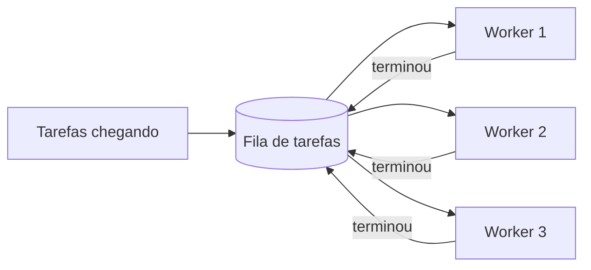
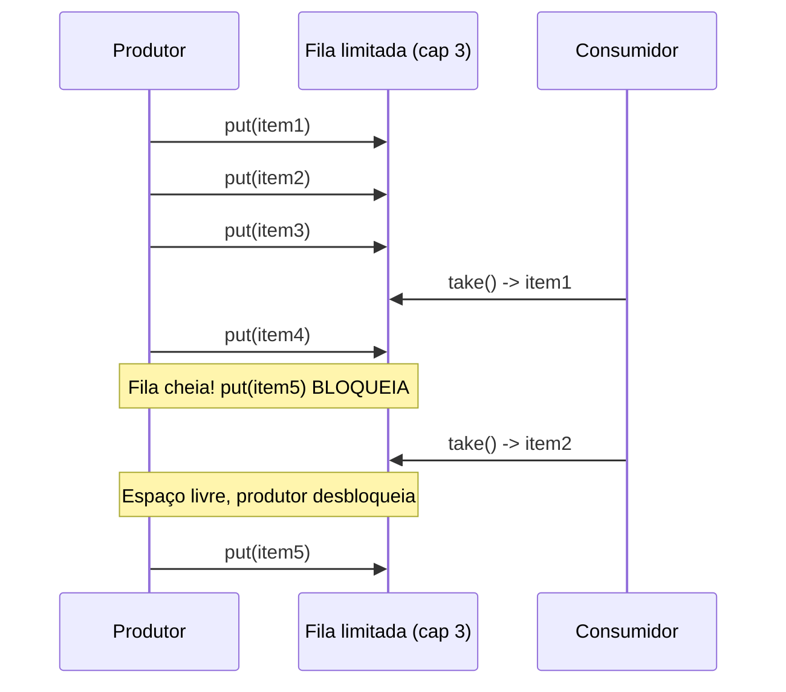
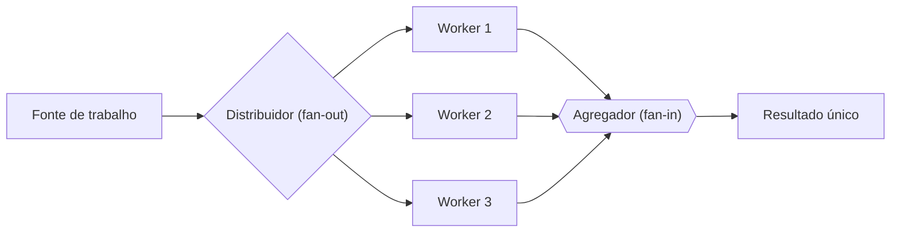
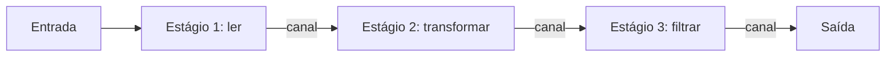
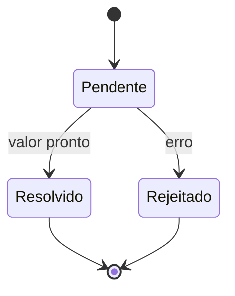
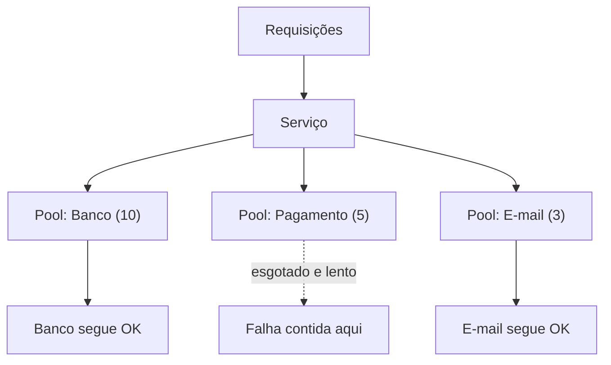

# Padrões de concorrência

> [!abstract] Resumo em uma linha
> Concorrência madura não se improvisa thread a thread: você monta o sistema com um vocabulário pequeno de receitas — pool de workers, produtor-consumidor, fan-out/fan-in, pipeline, futures, bulkhead — e combina essas peças como uma linha de montagem.

Pense numa central de atendimento. Ninguém contrata um atendente novo a cada ligação e o demite quando desliga — isso seria absurdo. Você mantém um grupo fixo de atendentes (os workers), as chamadas entram numa fila, e cada atendente pega a próxima quando fica livre. Quando a fila enche demais, a central avisa "todos ocupados, aguarde" em vez de aceitar infinitas chamadas e derreter.

Essa cena já contém quase tudo que importa: trabalho reaproveitado, fila como amortecedor, e um sinal de "chega" quando o sistema satura. Os padrões deste capítulo são variações sobre esse mesmo bom senso. Eles são o vocabulário de design da concorrência — receitas testadas que você reconhece, nomeia e encaixa, em vez de reinventar locks e threads soltas a cada problema.

> [!info] Por que pensar em padrões?
> Threads, locks, canais e átomos (vistos nas notas anteriores deste galho) são os tijolos. Padrões são as paredes prontas. Um engenheiro sênior não pensa "vou criar 50 threads"; pensa "isso é um pipeline de três estágios alimentado por um pool de workers com backpressure". O nome carrega a solução inteira — e o trade-off junto.

---

## Thread pool / worker pool

**O problema.** Criar e destruir uma thread custa caro: alocação de stack, registro no escalonador do SO, troca de contexto. Se cada tarefa curta exige uma thread nova, o overhead de gerenciamento domina o trabalho útil. E se as tarefas chegam mais rápido do que terminam, você cria threads sem limite até esgotar memória.

**Como funciona.** Você mantém um conjunto fixo (ou elástico, com mínimo e máximo) de N threads vivas, esperando trabalho. As tarefas entram numa fila compartilhada; cada worker, ao ficar livre, pega a próxima e a executa. Terminou? Volta pra fila buscar outra. As threads nunca morrem entre tarefas — só o trabalho circula. É o modelo "replicated workers" ou "worker-crew".

Acima, o esqueleto de um pool. Leitura do diagrama: as tarefas não tocam os workers diretamente — elas entram na fila, e os três workers competem por elas. A seta de volta "terminou" mostra o reaproveitamento: o worker não some, ele retorna pra pegar a próxima. O número de workers é fixo; a fila absorve picos.

> [!tip] Quanto custa não ter pool?
> Em servidores web, criar uma thread por requisição funciona até a carga crescer. Aí o custo de criação e o consumo de memória por stack viram o gargalo. O pool resolve os dois: amortiza a criação e limita o paralelismo, evitando exaustão de recursos e troca de contexto excessiva.

**Dimensionar o pool** é a pergunta de entrevista mais comum aqui. A regra de bolso depende da natureza do trabalho:

- **CPU-bound** (cálculo puro): aproximadamente um worker por núcleo. Mais threads que núcleos só adiciona troca de contexto sem ganho — o CPU já está saturado.
- **I/O-bound** (espera em rede, disco, banco): muito mais workers que núcleos. Enquanto um worker espera o disco, o núcleo fica ocioso e pode rodar outro. O número ideal sai da **Lei de Little** (vista em `[[16 - As leis da escala - Amdahl e Gustafson]]`): se você quer manter L tarefas em voo e cada uma dura W segundos, o throughput é L dividido por W; inverta a conta pra achar quantos workers sustentam a vazão desejada.

A fórmula clássica de Brian Goetz: número de threads ≈ núcleos × (1 + tempo de espera / tempo de computação). Para trabalho 90% em espera, isso dá dez vezes os núcleos.

> [!warning] Pool mal dimensionado mata
> Pool pequeno demais para carga I/O-bound: workers ociosos esperando e fila estourando. Pool grande demais para carga CPU-bound: troca de contexto come o ganho. E cuidado com pools que compartilham recursos limitados (conexões de banco) — o pool de threads pode ser maior que o pool de conexões, e aí as threads brigam por conexão.

---

## Produtor-consumidor

**O problema.** Você tem código que gera dados (lê arquivos, recebe eventos, parseia requisições) e código que os processa, e os dois rodam em ritmos diferentes. Acoplar os dois diretamente força um a esperar o outro o tempo todo. E se o produtor for mais rápido, ele afoga o consumidor.

**Como funciona.** Você coloca uma **fila limitada** entre eles. O produtor empurra itens na fila; o consumidor puxa quando pode. A fila desacopla os ritmos: picos do produtor são absorvidos pelo buffer, e o consumidor processa no seu tempo. Já vimos a mecânica de bloqueio disso em `[[06 - Semáforos e coordenação]]` — aqui o foco é o padrão de design, não a primitiva.

O detalhe crucial é o **limite** da fila. Fila ilimitada é uma bomba-relógio: se o produtor é cronicamente mais rápido, a fila cresce até estourar a memória. A fila limitada cria **backpressure** (contrapressão): quando ela enche, o produtor *bloqueia* ou recebe um "não aceito agora". O sistema empurra a pressão de volta pra origem em vez de acumular silenciosamente.

Leitura do diagrama: a fila tem capacidade 3. O produtor enche até o limite, e o quinto `put` bloqueia — não há espaço. Só quando o consumidor faz um `take` e libera um slot é que o produtor anda. Esse bloqueio *é* a contrapressão em ação: o produtor é forçado a desacelerar até o ritmo do consumidor.

> [!note] Produtor-consumidor é o tijolo dos outros padrões
> Quase todo padrão deste capítulo tem produtor-consumidor escondido dentro. O pool de workers é um produtor-consumidor onde N consumidores dividem a fila. O pipeline é uma cadeia de produtor-consumidores. Domine este, e os outros viram composição.

---

## Fan-out / fan-in (scatter-gather)

**O problema.** Você tem uma pilha de trabalho independente — mil URLs pra buscar, mil registros pra validar — e quer processá-los em paralelo, mas no fim precisa juntar os resultados num lugar só.

**Como funciona.** Em dois movimentos. O **fan-out** espalha: um distribuidor manda pedaços do trabalho pra N workers que rodam concorrentemente. O **fan-in** recolhe: os resultados de todos os workers convergem num único canal de saída, pra serem agregados. Combinados, é o que se chama **scatter-gather** — espalhar e recolher.

Leitura do diagrama: o distribuidor é o fan-out — uma origem, vários destinos. O agregador é o fan-in — vários origens, um destino. O fan-in é essencialmente multiplexação: combina vários fluxos num só. Note que os workers no meio não conversam entre si; cada um é independente, o que torna o padrão fácil de paralelizar sem locks.

Em linguagens com canais, fan-out/fan-in é quase a definição idiomática de `[[12 - Troca de mensagens e CSP]]`: você lança N goroutines lendo do mesmo canal de entrada (fan-out) e escrevendo num canal de saída comum (fan-in). Em ambientes com futures, o fan-in vira um "aguarde todos" sobre uma lista de promessas.

> [!example] A analogia da cozinha
> Picar os legumes em paralelo (fan-out: vários cozinheiros, uma tábua cada) e depois montar tudo num prato só (fan-in). O ganho vem do fan-out; a correção vem do fan-in saber esperar todos terminarem antes de servir.

**Quando usar.** Tarefas homogêneas, independentes e em volume — agregação de dados, processamento em lote, consultar várias réplicas e pegar a primeira resposta. É a base do `[[15 - Paralelismo de dados]]`.

---

## Pipeline

**O problema.** Seu processamento tem etapas naturais em sequência: ler, transformar, filtrar, gravar. Fazer tudo numa thread serializa — cada item passa por todas as etapas antes do próximo começar. Mas as etapas são independentes entre itens diferentes.

**Como funciona.** Você quebra o trabalho em **estágios encadeados**, cada um concorrente, ligados por canais. O estágio 1 lê do input, processa, e empurra pro canal que alimenta o estágio 2; e assim por diante. Como cada estágio roda em sua própria thread/goroutine, eles trabalham *ao mesmo tempo* em itens diferentes — enquanto o estágio 3 processa o item A, o estágio 2 já mexe no item B e o estágio 1 já leu o item C.

Leitura do diagrama: os canais entre estágios são as esteiras da linha de montagem. Cada estágio é uma estação de trabalho concorrente. O throughput não é a soma dos tempos — é ditado pelo estágio mais lento (o gargalo), porque os outros ficam esperando por ele. Otimizar pipeline = achar e aliviar o estágio gargalo (às vezes pondo um pool de workers só nele).

O **throughput vem da sobreposição**: depois que o pipeline "enche" (todos os estágios ocupados), você completa um item por vez de gargalo, não por vez de soma-de-todos. É exatamente como uma linha de montagem de carros — não se monta um carro inteiro antes de começar o próximo.

> [!tip] Backpressure de graça com canais sem buffer
> Num pipeline ligado por canais sem buffer, a contrapressão é automática. Se o estágio 3 está lento, seu canal de entrada enche; isso bloqueia o estágio 2 ao tentar enviar; que por sua vez bloqueia o estágio 1. A pressão sobe a cadeia até a fonte naturalmente, sem acúmulo de memória. Os canais "seguram" o ritmo do estágio mais lento.

**Cuidado com o desligamento.** Pipelines precisam de uma disciplina de encerramento: cada estágio fecha seu canal de saída quando termina de enviar, e os estágios à jusante param de receber quando o canal fecha. Sem isso, você vaza goroutines bloqueadas esperando dados que nunca virão. (A página oficial de pipelines do Go trata cancelamento como cidadão de primeira classe justamente por isso.)

---

## Futures / promises

**O problema.** Você dispara uma operação demorada (uma chamada de rede, um cálculo pesado) e quer continuar fazendo outra coisa, mas vai precisar do resultado *depois*. Como representar "um valor que ainda não existe"?

**Como funciona.** O future (ou promise) é um objeto que funciona como um *vale*: você recebe ele imediatamente, e ele promete entregar o resultado quando estiver pronto. Você pode passá-lo adiante, encadear operações sobre ele ("quando chegar, faça X"), ou bloquear esperando o valor só no momento em que realmente precisa.

A grande virtude é a **composição**. Em vez de callbacks aninhados (o "callback hell"), você encadeia: `buscaUsuario().then(carregaPerfil).then(renderiza)`. Cada passo recebe o resultado do anterior quando ele materializa. Vários futures em paralelo viram um fan-in: "aguarde todos estes e me dê a lista". Isso é o açúcar sintático que torna a assincronia do `[[14 - Loop de eventos e assincronia]]` legível — `async/await` é, por baixo, manipulação de futures.

> [!note] Future, promise: qual a diferença?
> A nomenclatura varia. Numa convenção comum, o *future* é o lado leitor (quem espera o valor) e a *promise* é o lado escritor (quem cumpre o valor). Em outras linguagens os termos se misturam. O conceito é o mesmo: um placeholder para um resultado futuro, com estado pendente → resolvido (ou rejeitado).

Leitura do diagrama: o future nasce pendente. Ele transita uma única vez — pra resolvido (sucesso, com valor) ou rejeitado (falha, com erro). É um estado terminal: uma vez resolvido, não muda. Quem encadeou um `.then` é notificado na transição. Esse modelo de transição única é o que torna futures componíveis sem corrida — não há estado "meio pronto".

---

## Imutabilidade + troca atômica (read-copy-update)

**O problema.** Você tem uma estrutura lida por muitas threads e escrita raramente — uma tabela de configuração, um cache, uma tabela de rotas. Proteger toda leitura com lock é caro: os leitores não conflitam entre si, mas o lock os serializa mesmo assim.

**Como funciona.** Leitores acessam a estrutura *sem trava nenhuma*. Quem escreve não modifica o objeto existente — ele cria uma **nova versão** completa (ou copia e altera) e, no fim, troca o ponteiro com uma única operação atômica. Leitores que pegaram o ponteiro antigo continuam vendo a versão antiga, consistente, até soltarem; novos leitores veem a nova. Ninguém nunca vê um estado parcial.

Isso casa duas ideias já vistas: a `[[08 - Imutabilidade e estado]]` (a versão antiga nunca muda, então é seguro lê-la sem lock) e as `[[08 - Operações atômicas e lock-free]]` (a troca do ponteiro é um compare-and-swap, atômica). O nome canônico no kernel Linux é RCU — *read-copy-update*.

> [!warning] O custo escondido: quando liberar o velho?
> O calcanhar do RCU é saber quando a versão antiga pode ser destruída — só depois que o último leitor que a pegou terminou. Isso exige um mecanismo de "período de graça" (grace period). É barato pra ler, mas a recuperação de memória da versão antiga é a parte difícil. Vale a pena quando leituras dominam esmagadoramente as escritas.

---

## Bulkhead / isolamento de recursos

**O problema.** Seu serviço chama três dependências: banco, API de pagamento, serviço de e-mail. Todos os chamadas compartilham o mesmo pool de threads. Um dia a API de pagamento fica lenta; suas threads ficam todas presas esperando pagamento; e agora *nada* funciona — nem o banco, nem o e-mail. Uma falha isolada derrubou o sistema inteiro.

**Como funciona.** O nome vem da construção naval: o casco é dividido em compartimentos estanques (bulkheads), de modo que um vazamento num compartimento não afunda o navio. Em software, você **particiona os recursos por dependência**: cada dependência ganha seu próprio pool de threads (ou conexões, ou semáforo). Se a API de pagamento engasga, ela só esgota *o próprio* pool; o banco e o e-mail seguem com seus recursos intactos.

Leitura do diagrama: cada dependência tem seu próprio pool dimensionado. Quando o pool de Pagamento esgota e trava, a falha fica *contida* naquele compartimento (linha pontilhada). Os pools de Banco e E-mail nem percebem — continuam servindo. Sem bulkhead, todos compartilhariam um pool só, e o engasgo de um contaminaria tudo.

A implementação mais comum é exatamente isolamento por pool de threads, e bibliotecas de resiliência (como Resilience4j no mundo Java) oferecem o bulkhead pronto. Esse padrão é peça central da `[[03-Dominios/Ciência/Redes e Protocolos/14 - Resiliência de rede|Resiliência de rede]]`, onde anda de mãos dadas com circuit breaker e timeout: o bulkhead contém o estrago, o circuit breaker para de tentar, o timeout evita esperar pra sempre.

> [!tip] Por que isolar evita falhas em cascata
> Falha em cascata é o efeito dominó: um recurso compartilhado satura, todos os caminhos que dependem dele travam, e o travamento se propaga. O bulkhead quebra a cadeia ao garantir que nenhuma dependência possa consumir mais recursos do que sua cota. A falha fica visível e localizada — mais fácil de diagnosticar, também.

---

## Double buffering / copy-on-write

**O problema.** Você tem leitores que precisam ver um estado sempre consistente, e um escritor que monta a próxima versão aos poucos. Se os leitores enxergam o buffer enquanto ele é montado, veem dados pela metade — uma tela meio desenhada, uma tabela meio atualizada.

**Como funciona.** Você mantém **dois buffers**: o "front" (que os leitores veem) e o "back" (onde o escritor trabalha). O escritor monta a nova versão inteira no back, sem pressa, sem que ninguém olhe. Quando termina, faz a **troca** (swap) — uma operação atômica que faz o back virar front. A partir desse instante, leitores veem a versão nova, completa; nunca uma intermediária. É o mesmo princípio do RCU, aplicado a renderização gráfica e estruturas de leitura quente.

> [!example] A tela do videogame
> Double buffering nasceu em gráficos: você desenha o próximo quadro inteiro num buffer escondido e troca com o visível no exato momento do refresh. O jogador nunca vê o quadro sendo pintado — só quadros completos. Sem isso, aparece "tearing" (rasgo): metade de um quadro, metade do anterior.

Copy-on-write é a variante "preguiçosa": você só copia quando alguém vai escrever, compartilhando a versão única enquanto todos só leem. Leitores nunca veem estado parcial porque o escritor opera sobre a cópia, e a troca é atômica.

---

## Map-reduce / scatter

Quando o trabalho é "aplique a mesma função a um monte de dados e depois combine os resultados", o padrão tem nome próprio: **map-reduce**. O *map* é um fan-out de uma transformação independente sobre cada pedaço; o *reduce* é o fan-in que agrega (soma, conta, junta). É a forma de larga escala do fan-out/fan-in, e o coração do `[[15 - Paralelismo de dados]]` — onde o assunto é tratado a fundo, inclusive a relação com SIMD e GPUs. Aqui basta reconhecê-lo como caso particular de scatter-gather aplicado a transformações de dados.

---

## Thread confinement / thread-local

**O problema.** Compartilhar estado mutável entre threads é a fonte de quase todo bug de concorrência — as `[[03 - Estado compartilhado e race conditions]]` vivem disso. E se a melhor proteção fosse simplesmente *não compartilhar*?

**Como funciona.** O padrão mais seguro de todos: confine cada dado a uma única thread. Se só uma thread toca um dado, não há corrida possível — não precisa de lock, átomo, nada. A variante explícita é o **thread-local storage**: cada thread tem sua própria cópia de uma variável, isolada das outras. Geradores de números aleatórios, buffers de formatação, contextos de transação são candidatos clássicos.

> [!note] A ausência de bug por construção
> Confinamento não *resolve* a corrida — ele a torna impossível. É a diferença entre trancar a casa e não ter nada que possa ser roubado. Quando o design permite, confinar é sempre preferível a sincronizar: sem lock, sem contenção, sem deadlock, sem o custo de coerência de cache. Linguagens como Go ("não comunique compartilhando memória; compartilhe memória comunicando") e Rust (ownership) elevam isso a princípio de design.

O custo é que confinamento pede disciplina: passar dados *entre* threads agora vira troca de mensagens (cópia ou transferência de posse), não acesso compartilhado. Mas essa troca é justamente o `[[12 - Troca de mensagens e CSP]]` — confinamento e mensagens são as duas faces da mesma moeda.

---

## Tabela: padrão → problema → quando usar

| Padrão | Problema que resolve | Quando usar |
|---|---|---|
| Pool de workers | Overhead de criar threads; paralelismo ilimitado | Muitas tarefas curtas; servidores; limitar concorrência |
| Produtor-consumidor | Acoplar ritmos diferentes de geração e consumo | Geração e processamento em velocidades distintas |
| Fan-out / fan-in | Paralelizar trabalho independente e agregar | Lote de tarefas homogêneas; consultar N fontes |
| Pipeline | Etapas sequenciais que poderiam sobrepor-se | Processamento em estágios; streams; ETL |
| Futures / promises | Representar e compor resultados futuros | Assincronia; encadear chamadas de rede |
| RCU / troca atômica | Leituras frequentes, escritas raras, sem travar leitor | Config, cache, tabelas de rota lidas a quente |
| Bulkhead | Falha de uma dependência derruba tudo | Múltiplas dependências; isolamento de falha |
| Double buffering / COW | Leitores não podem ver estado parcial | Render; estruturas atualizadas em bloco |
| Map-reduce | Transformar muitos dados e combinar | Processamento de dados em escala |
| Confinamento | Bugs de estado compartilhado | Sempre que o dado puder ser exclusivo de uma thread |

---

## Como os padrões se combinam

Padrões isolados são exercício de livro. Sistemas reais os **compõem**. Um pipeline de ingestão típico costura quase tudo deste capítulo:

Leitura do diagrama: é um **pipeline** (três estágios) onde cada estágio é um **pool de workers** dimensionado pra sua carga — o parse tem 4, a gravação só 2, porque o banco aguenta menos escrita concorrente. As **filas** entre estágios são produtor-consumidor com **backpressure**: se a gravação atrasa, a pressão sobe a cadeia. O estágio de enriquecer faz **fan-out** pra APIs externas, cada uma atrás de seu **bulkhead**, pra que uma API lenta não trave o pipeline inteiro.

Repare como os trade-offs se acumulam: o estágio gargalo (gravação) define o throughput; o bulkhead protege contra a dependência mais frágil; a fila absorve picos mas tem que ser limitada pra não estourar memória. Projetar concorrência é escolher qual receita resolve cada junta e como elas conversam.

> [!info] O padrão é uma linguagem
> Quando você diz "pipeline de N estágios com pools por estágio e backpressure via filas limitadas", você comprimiu um diagrama de arquitetura inteiro numa frase. É por isso que vale conhecer o vocabulário: ele é a forma de pensar e de comunicar concorrência em alto nível, antes de escrever uma linha de lock. Para o mundo Java em particular, veja `[[03-Dominios/Tecnologia/Java/Concorrência e paralelismo/index|Concorrência (Java)]]`, onde esses padrões aparecem com `ExecutorService`, `CompletableFuture` e afins.

---

## Em entrevista

Interviewers rarely ask "what is a thread pool" in isolation; they ask you to *design* a concurrent system, and the patterns are your vocabulary. Lead with the pattern name, then the trade-off: "I'd use a worker pool here to bound concurrency and amortize thread creation — sized to cores for CPU work, higher for I/O." When they mention a slow dependency taking down the service, the magic word is **bulkhead**: isolate resources per dependency so one failure can't exhaust the shared pool. If they describe staged processing, say **pipeline** and immediately note the bottleneck stage dictates throughput and that bounded queues give you **backpressure** for free. For "fetch from many sources and combine," reach for **fan-out/fan-in**. And the strongest senior signal: when asked how to avoid a race, ask first whether the data needs sharing at all — **confinement** beats locking when the design allows it. Always name the failure mode the pattern prevents, not just the pattern.

### Vocabulário PT → EN

- pool de threads / pool de workers → thread pool / worker pool
- produtor-consumidor → producer-consumer
- fan-out / fan-in → fan-out / fan-in
- scatter-gather → scatter-gather
- pipeline → pipeline
- futuro / promessa → future / promise
- bulkhead (anteparo) → bulkhead
- confinamento → confinement / thread confinement
- contrapressão → backpressure
- falha em cascata → cascading failure
- troca atômica de ponteiro → atomic pointer swap
- período de graça → grace period

> [!info] Lastro
> Fontes verificadas via WebSearch (2026-06):
> - [Thread pool — Wikipedia](https://en.wikipedia.org/wiki/Thread_pool) — modelo replicated-workers, amortização de criação, parâmetros do pool.
> - [Go Concurrency Patterns: Pipelines and cancellation — go.dev](https://go.dev/blog/pipelines) — estágios ligados por canais, fechamento de canais, cancelamento.
> - [Bulkhead Pattern — Azure Architecture Center, Microsoft Learn](https://learn.microsoft.com/en-us/azure/architecture/patterns/bulkhead) — isolamento de recursos por dependência, prevenção de falha em cascata.
> - [Go Concurrency Patterns: Worker Pool, Fan-In/Fan-Out & Pipeline — Medium (Serif Colakel)](https://medium.com/@serifcolakel/go-concurrency-patterns-worker-pool-fan-in-fan-out-pipeline-e8ebfeb1373b) — fan-out/fan-in como multiplexação, composição com pool.

---

## Veja também

- `[[06 - Semáforos e coordenação]]` — a primitiva por trás de filas limitadas e produtor-consumidor.
- `[[08 - Operações atômicas e lock-free]]` — o compare-and-swap por trás da troca atômica de ponteiro.
- `[[12 - Troca de mensagens e CSP]]` — canais como base de fan-out/fan-in, pipeline e confinamento.
- `[[14 - Loop de eventos e assincronia]]` — onde futures/promises ganham sentido.
- `[[15 - Paralelismo de dados]]` — map-reduce e scatter em escala.
- `[[16 - As leis da escala - Amdahl e Gustafson]]` — Lei de Little e o dimensionamento de pools.
- `[[03 - Estado compartilhado e race conditions]]` — o problema que o confinamento elimina por construção.
- `[[18 - Concorrência em entrevista]]` — onde todos esses padrões viram respostas.
- `[[03-Dominios/Ciência/Concorrência e Paralelismo/index|Concorrência e Paralelismo]]` — o índice do galho.
