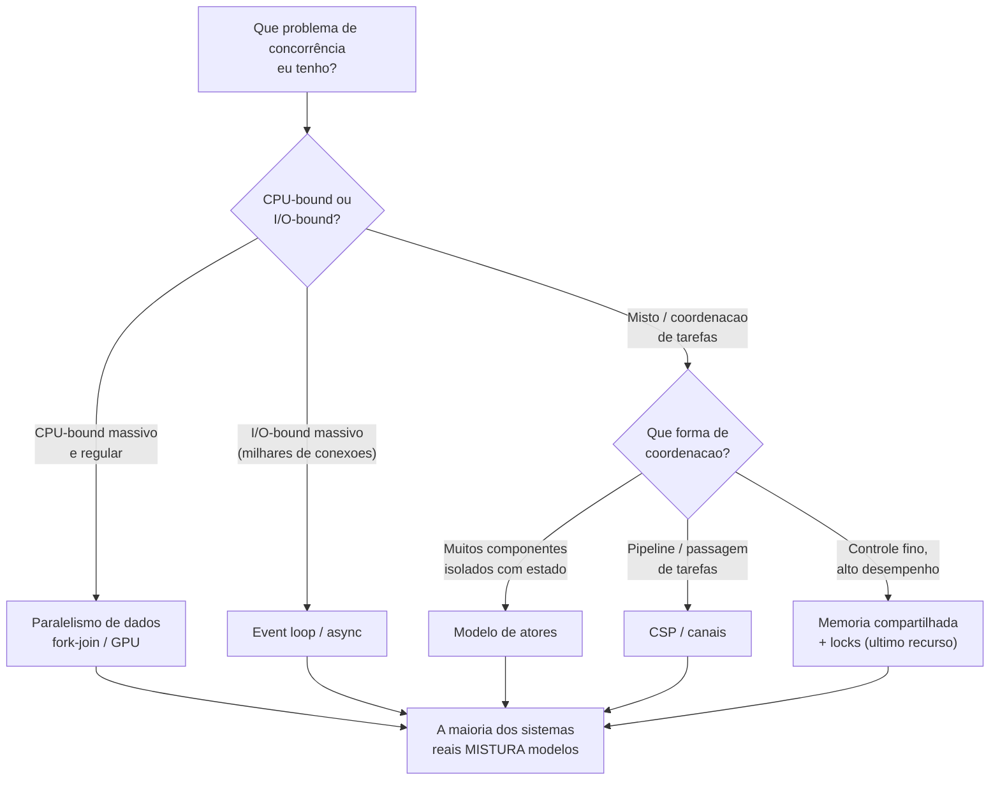
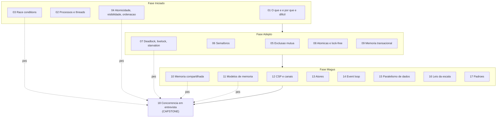

# Concorrência em entrevista

> [!tip] Resumo em uma linha
> Em concorrência, o senior não recita APIs: ele reconhece o perigo antes de cair nele, escolhe o MODELO certo pro problema e raciocina sobre trade-offs — e a melhor trava costuma ser não precisar de trava.

Esta é a nota CAPSTONE do galho. As 17 notas anteriores carregam o lastro: aqui a gente costura tudo em um mapa de decisão e um roteiro de entrevista. Comece pela tese de `[[01 - Concorrência e paralelismo - o que é e por que é difícil]]` — concorrência é estrutura (lidar com muitas coisas ao mesmo tempo), paralelismo é desempenho (fazer muitas coisas ao mesmo tempo). Confundir os dois é o primeiro erro de entrevista.

## 1. A tese

Concorrência é o terreno onde mais se erra em produção e, justamente por isso, onde o nível senior se distingue. Um bug de concorrência não estoura no seu teste: ele dorme por meses e acorda às 3h da manhã em produção, sob carga, sem stack trace decente. O entrevistador sabe disso. Ele não está testando se você decorou `synchronized` ou `Lock`; está testando se você pensa como alguém que já levou um deadlock na cara.

O que ele quer ver, em três movimentos:

1. **Reconhecer os perigos universais** — race condition, visibilidade, deadlock — *antes* de escrever o código que cai neles.
2. **Escolher o MODELO certo pro problema** — memória compartilhada, CSP, atores, event loop, paralelismo de dados — em vez de aplicar o único que você conhece a tudo.
3. **Raciocinar sobre trade-offs** — toda escolha de concorrência paga um preço (latência, throughput, complexidade, falibilidade), e você sabe qual.

> [!note] O que NÃO impressiona
> Listar primitivas de cor. "Eu uso `ConcurrentHashMap`" não é uma resposta — é o fim de uma resposta cujo começo ("preciso de estado compartilhado entre threads, leitura dominante, e quero evitar lock global") você pulou. O começo é o que vale pontos.

## 2. Os perigos, em uma frase cada (checklist mental)

Antes de propor qualquer solução, passe esta lista de baixo pra cima na cabeça. Reconhecer o perigo é metade da resposta.

- **Race condition** — o resultado depende de QUEM chega primeiro, e a ordem não é garantida; `count++` parece uma operação mas são três (ler, somar, escrever). Veja `[[03 - Estado compartilhado e race conditions]]`.
- **Os três problemas** — uma operação pode não ser **atômica** (interrompida no meio), uma escrita pode não ter **visibilidade** (outra thread não enxerga), e operações podem ser **reordenadas** (compilador/CPU mudam a ordem). Veja `[[04 - Atomicidade, visibilidade e ordenação]]`.
- **Deadlock** — duas threads esperando uma à outra para sempre; **livelock** — ambas cedem educadamente e nenhuma avança; **starvation** — uma thread nunca ganha o recurso. Veja `[[07 - Deadlock, livelock e starvation]]`.
- **Não-determinismo** — por que testes não pegam: o bug só aparece com um *interleaving* específico que talvez o seu teste nunca produza. Passar 10 mil vezes não prova ausência de race; prova que você teve sorte 10 mil vezes.

> [!warning] A regra de ouro do checklist
> Se a sua resposta começa com "eu compartilho esse estado entre as threads e...", pare. Pergunte-se primeiro: *eu preciso compartilhar?* Imutabilidade e confinamento (`[[17 - Padrões de concorrência]]`) eliminam a classe inteira de bugs sem uma única trava.

## 3. A tabela comparativa dos 5 modelos

Este é o coração da nota — o análogo de "escolhendo a estrutura certa" do galho de Estruturas de Dados. Não existe modelo "melhor"; existe o modelo certo para a forma do problema.

| Modelo | Como coordena | Estado compartilhado? | Como evita race | Brilha em | Linguagem canônica | Nota |
|---|---|---|---|---|---|---|
| **Memória compartilhada + locks** | Threads leem/escrevem a mesma memória; travas serializam o acesso | Sim, explícito | Exclusão mútua (lock/mutex/monitor) | Controle fino, baixa latência, alto desempenho com poucas threads | Java, C++ | `[[10 - Memória compartilhada com threads e locks]]` |
| **CSP / canais** | Tarefas trocam mensagens por canais; o canal sincroniza | Não — passa-se o dado pelo canal | Não há estado a corromper; o canal serializa | Pipelines, coordenação de tarefas, fan-in/fan-out | Go | `[[12 - Troca de mensagens e CSP]]` |
| **Atores** | Cada ator tem estado privado e processa mensagens da sua mailbox, uma por vez | Não — cada ator é um silo | Estado nunca é compartilhado; uma mensagem por vez | Muitos componentes isolados com estado, tolerância a falhas | Erlang / Elixir | `[[13 - O modelo de atores]]` |
| **Event loop / async** | Uma thread despacha callbacks/tarefas conforme eventos chegam | Não (single-thread no loop) | Sem concorrência real no loop — não há race interna | I/O-bound massivo, milhares de conexões | JavaScript, Python (asyncio) | `[[14 - Loop de eventos e assincronia]]` |
| **Paralelismo de dados** | Mesma operação aplicada a fatias dos dados em paralelo | Compartilha leitura, particiona escrita | Particionamento — cada worker escreve no seu pedaço | CPU-bound massivo e regular (numérico, GPU) | fork-join, CUDA/SIMD | `[[15 - Paralelismo de dados]]` |

> [!tip] O fio que une a tabela
> Olhe a coluna "como evita race". Quatro dos cinco modelos evitam race **não compartilhando** — canais, mailboxes, single-thread, partição. Só o primeiro compartilha e paga com travas. Isso não é coincidência: é a lição central do galho. Compartilhar estado mutável é a raiz; os outros modelos são estratégias diferentes para evitar a raiz.

As primitivas que sustentam esses modelos vêm das notas da fase Adepto: locks e monitores em `[[05 - Exclusão mútua - locks, mutexes e monitores]]`, semáforos em `[[06 - Semáforos e coordenação]]`, CAS e lock-free em `[[08 - Operações atômicas e lock-free]]`, e a abordagem otimista de `[[09 - Memória transacional e otimismo]]`.

## 4. Como cada linguagem escolheu

Cada linguagem grande fez uma aposta sobre concorrência e desenhou tudo em volta dela. Saber qual aposta cada uma fez é saber prever os trade-offs.

- **Java** — memória compartilhada + threads + locks como base, com o Java Memory Model (`[[11 - Modelos de memória e consistência]]`) definindo as regras de visibilidade. O Project Loom (virtual threads) trouxe milhões de threads baratas, aproximando o estilo "thread por requisição" do throughput de async sem reescrever o código.
- **Go** — goroutines (threads verdes baratas) + channels; o lema "*don't communicate by sharing memory; share memory by communicating*" é CSP encarnado. Concorrência é cidadã de primeira classe da sintaxe (`go`, `select`).
- **Erlang / Elixir** — atores ("processos") leves e isolados, com **supervisão**: quando um ator falha, um supervisor o reinicia. A filosofia "*let it crash*" troca o esforço de blindar cada operação por arquitetura resiliente.
- **JavaScript** — event loop single-thread por design; nunca há duas linhas de JS rodando ao mesmo tempo no mesmo loop, então a maioria dos bugs de race some — em troca de você nunca poder **bloquear o loop**.
- **Python** — o GIL (Global Interpreter Lock) serializa o bytecode, então threads não dão paralelismo de CPU; a saída é `asyncio` (event loop) para I/O e `multiprocessing` para CPU-bound. (Vale citar que o Python 3.13+ introduziu um modo experimental *free-threaded* sem GIL, ainda em adoção.)
- **Rust** — "fearless concurrency": o sistema de *ownership*, com os traços `Send` e `Sync`, faz o **compilador barrar data races em tempo de compilação**. Código que compartilharia estado de forma insegura simplesmente não compila — o erro vira de produção para build.

> [!info] Por que essa lista importa em entrevista
> Quando o entrevistador diz "como você faria isso em X", a resposta certa muitas vezes é "em X o idioma é Y". "Em Go eu usaria um channel, não um mutex" mostra que você pensa na *linguagem*, não traduz Java literalmente para tudo.

## 5. Escolher o modelo por problema — o roteiro

Antes de codar, classifique o problema. O diagrama abaixo é o roteiro mental que você pode até verbalizar na entrevista ("primeiro eu pergunto se isso é CPU-bound ou I/O-bound...").

Leitura do diagrama: comece pela natureza da carga (CPU ou I/O), depois pela forma da coordenação, e deixe a memória compartilhada como ÚLTIMA opção — ela é a mais poderosa e a mais perigosa.

A regra que fecha o diagrama: **a maioria dos sistemas reais mistura modelos** — um servidor web pode ter um event loop na borda, um pool de workers paralelos no meio, e atores para o estado de sessão. E, acima de tudo: **a melhor trava é não precisar de trava**. Imutabilidade (dados que não mudam não correm) e confinamento (estado que vive em uma só thread) eliminam a corrida na origem. Travar é o que você faz quando não pôde evitar compartilhar.

> [!example] Frase de ouro pra esse momento
> "Antes de escolher uma primitiva, eu classifico a carga e pergunto se preciso compartilhar estado. Se não preciso, o problema de concorrência praticamente desaparece."

## 6. How to explain in English

Um monólogo-mestre para a entrevista. Primeira pessoa, filosofia técnica genérica — postura, não relato de projeto.

> When I approach a concurrency problem, my very first instinct is to *avoid sharing*. Shared mutable state is the root of most concurrency bugs — the moment two threads can touch the same memory and at least one writes, I have a potential race. So before I reach for any lock, I ask whether the state needs to be shared at all. Immutability and confinement do the heavy lifting for free: data that never changes can't race, and state that lives on a single thread doesn't need protection. The best lock is the lock you didn't have to take.

> When sharing is genuinely unavoidable, I pick the model for the shape of the problem rather than forcing the one model I happen to know. For fine-grained CPU work where latency matters, threads and locks give me the most control. For I/O-bound work with thousands of connections, an event loop scales far better than a thread per request, because most of those threads would just be sleeping on I/O. And when I want strong isolation between stateful components, I reach for message passing or actors — each unit owns its state, talks only through messages, and a failure stays contained.

> I also respect the memory model, because visibility and ordering bugs are silent. A write on one thread may simply never become visible to another, or the compiler and CPU may reorder operations in ways that break my assumptions. I don't try to outsmart this with clever tricks; I lean on established primitives that establish a happens-before relationship — a lock, a `volatile` field, an atomic. If I can't point to the happens-before edge, I assume the code is broken even if it passes every test.

> Finally, I design for failure and I measure. More cores are not free: Amdahl's law says the serial fraction of a program caps the speedup no matter how many cores I throw at it, so I profile before I parallelize. And because races don't show up reliably in tests — they depend on a specific interleaving that may never occur on my machine — I treat concurrency code as something to reason about formally, not just test empirically. Correct by construction beats correct by luck.

Sobre a estrutura desta nota: ela amarra o galho inteiro. A tese e o checklist vêm da fase Iniciado (`[[01 - Concorrência e paralelismo - o que é e por que é difícil]]`, `[[02 - Processos e threads]]`, `[[03 - Estado compartilhado e race conditions]]`, `[[04 - Atomicidade, visibilidade e ordenação]]`). A tabela de modelos sintetiza as notas de modelos da fase Magus (`[[10 - Memória compartilhada com threads e locks]]` até `[[15 - Paralelismo de dados]]`), apoiadas pelas primitivas da fase Adepto (`[[05 - Exclusão mútua - locks, mutexes e monitores]]` até `[[09 - Memória transacional e otimismo]]`). As leis de escala (`[[16 - As leis da escala - Amdahl e Gustafson]]`) e os padrões (`[[17 - Padrões de concorrência]]`) fecham o raciocínio de trade-off.

## 7. Frases úteis em entrevista

Frases prontas em inglês, calibradas para soltar no momento certo:

- "Shared mutable state is the root of most concurrency bugs — my first move is to avoid sharing entirely."
- "I'd reach for an actor or message-passing model here to get isolation without locks."
- "This is I/O-bound, so an event loop scales better than a thread per request — most threads would just be sleeping."
- "Don't communicate by sharing memory; share memory by communicating."
- "I'd establish a happens-before edge with a lock or a `volatile` write — visibility bugs are silent and won't show up in testing."
- "Amdahl's law caps the speedup; past a point the serial fraction dominates and extra cores buy me almost nothing."
- "There are four Coffman conditions for deadlock — break any one of them and deadlock becomes impossible."
- "I enforce a global lock ordering to prevent circular wait."
- "`count++` isn't atomic — it's a read, an add, and a write, and any of them can interleave."
- "Passing a stress test doesn't prove the code is race-free; it proves I got a lucky interleaving."

## 8. Vocabulário PT→EN consolidado

| Português | English |
|---|---|
| concorrência | concurrency |
| paralelismo | parallelism |
| condição de corrida | race condition |
| atomicidade | atomicity |
| visibilidade | visibility |
| ordenação / reordenação | ordering / reordering |
| exclusão mútua | mutual exclusion |
| trava / lock / mutex | lock / mutex |
| semáforo | semaphore |
| monitor | monitor |
| variável de condição | condition variable |
| deadlock (impasse) | deadlock |
| livelock | livelock |
| inanição | starvation |
| comparar-e-trocar | compare-and-swap (CAS) |
| sem travas / sem espera | lock-free / wait-free |
| acontece-antes | happens-before |
| modelo de memória | memory model |
| barreira de memória | memory barrier / fence |
| troca de mensagens | message passing |
| canal | channel |
| goroutine | goroutine |
| ator | actor |
| caixa de correio | mailbox |
| supervisão | supervision |
| laço de eventos | event loop |
| microtarefa | microtask |
| trava global do interpretador | Global Interpreter Lock (GIL) |
| divisão-e-junção | fork-join |
| roubo de trabalho | work-stealing |
| pool de trabalho | work pool / thread pool |
| contrapressão | backpressure |
| lei de Amdahl | Amdahl's law |
| lei de Gustafson | Gustafson's law |
| confinamento | confinement |
| imutabilidade | immutability |
| condições de Coffman | Coffman conditions |

## 9. Armadilhas consolidadas

Cada uma é uma frase e um link para a nota-dona que destrincha o porquê.

- **`count++` não é atômico** — três operações disfarçadas de uma; veja `[[03 - Estado compartilhado e race conditions]]`.
- **Esquecer visibilidade / `volatile`** — uma escrita pode nunca ser vista por outra thread sem uma aresta happens-before; veja `[[04 - Atomicidade, visibilidade e ordenação]]` e `[[11 - Modelos de memória e consistência]]`.
- **Adquirir locks em ordens diferentes** — receita exata de deadlock por espera circular; veja `[[07 - Deadlock, livelock e starvation]]`.
- **Bloquear o event loop** — uma operação síncrona pesada congela todas as conexões; veja `[[14 - Loop de eventos e assincronia]]`.
- **Over-sincronizar e matar o paralelismo** — um lock grosso demais transforma código paralelo em serial; veja `[[05 - Exclusão mútua - locks, mutexes e monitores]]` e `[[16 - As leis da escala - Amdahl e Gustafson]]`.
- **Achar que mais núcleos = proporcionalmente mais rápido** — a fração serial domina (Amdahl); veja `[[16 - As leis da escala - Amdahl e Gustafson]]`.
- **Escrever lock-free artesanal sem necessidade** — CAS manual é fácil de errar e raramente justificado; prefira primitivas prontas; veja `[[08 - Operações atômicas e lock-free]]`.
- **Double-checked locking sem `volatile`** — o clássico bug de reordenação: sem `volatile`, outra thread vê o objeto meio-construído; veja `[[11 - Modelos de memória e consistência]]`.

## 10. Recursos

Verificados antes de listar:

- **"Java Concurrency in Practice"** — Brian Goetz et al. A bíblia do JMM e da concorrência em Java; visibilidade, publicação segura, padrões.
- **"The Art of Multiprocessor Programming"** — Maurice Herlihy & Nir Shavit. A teoria de lock-free, wait-free e algoritmos concorrentes.
- **"Designing Data-Intensive Applications"** — Martin Kleppmann. Concorrência e consistência no nível de sistemas distribuídos.
- **"Seven Concurrency Models in Seven Weeks: When Threads Unravel"** — Paul Butcher (Pragmatic Bookshelf). Passeio pelos modelos: threads e locks, programação funcional, atores, CSP, paralelismo de dados, lambda architecture — exatamente o eixo desta nota.
- **"Concurrency is not Parallelism"** — palestra do Rob Pike (Heroku Waza); o melhor enunciado da distinção que abre o galho. Disponível em go.dev/blog/waza-talk.

## Em entrevista

1. **Distinga concorrência de paralelismo logo de cara.** "Concorrência é lidar com muitas coisas; paralelismo é fazer muitas coisas." Cita o Rob Pike e ganha credibilidade. Veja `[[01 - Concorrência e paralelismo - o que é e por que é difícil]]`.
2. **Reconheça o perigo antes de codar.** Diga em voz alta "aqui há estado compartilhado, então pode haver race" — o entrevistador quer ver o radar ligado.
3. **Escolha o modelo, não a primitiva.** Classifique CPU-bound vs I/O-bound e proponha event loop, atores, CSP ou locks conforme a forma — não despeje `synchronized` em tudo.
4. **Prefira não compartilhar.** "A melhor trava é não precisar de trava" — imutabilidade e confinamento. Isso separa o senior do pleno.
5. **Cite o memory model.** "Eu estabeleceria um happens-before com lock ou `volatile`" mostra que você entende que visibilidade é silenciosa.
6. **Lembre Amdahl.** Quando pedirem "escale isso", diga que a fração serial limita o ganho — mostra maturidade sobre custos.
7. **Saiba que testes não pegam races.** "Passar no teste é sorte de interleaving, não prova." É uma frase que cala a sala.
8. **Tenha as quatro condições de Coffman na ponta da língua.** Quebrar uma elimina o deadlock — exclusão mútua, posse-e-espera, não-preempção, espera circular.

> [!info] Lastro
> Esta nota é um CAPSTONE: ela sintetiza as notas 01–17 do galho, que carregam o lastro técnico de cada afirmação. As opiniões em primeira pessoa da seção 6 são postura técnica genérica do autor, NÃO relatos de projetos, clientes ou experiências específicas. Foram confirmados via busca apenas os recursos da seção 10 — a afirmação sobre Rust ("fearless concurrency" via ownership + `Send`/`Sync` barrando data races em tempo de compilação), a existência de "Seven Concurrency Models in Seven Weeks" (Butcher, Pragmatic) e a palestra "Concurrency is not Parallelism" de Rob Pike (Heroku Waza).

## Mapa do galho

Leitura do diagrama: as 18 notas em três fases (Iniciado, Adepto, Magus) reconvergem aqui no capstone. As setas tracejadas marcam as notas de maior peso para entrevista — as que você revisa primeiro na véspera.

## Veja também

- `[[03-Dominios/Ciência/Concorrência e Paralelismo/index|Concorrência e Paralelismo]]` — o índice do galho
- `[[03 - Estado compartilhado e race conditions]]` — a raiz do mal
- `[[04 - Atomicidade, visibilidade e ordenação]]` — os três problemas
- `[[07 - Deadlock, livelock e starvation]]` — os impasses
- `[[10 - Memória compartilhada com threads e locks]]` — o modelo clássico
- `[[11 - Modelos de memória e consistência]]` — por que visibilidade é silenciosa
- `[[16 - As leis da escala - Amdahl e Gustafson]]` — o teto do paralelismo
- `[[03-Dominios/Tecnologia/Java/Concorrência e paralelismo/index|Concorrência (Java)]]` — o aprofundamento prático em Java
