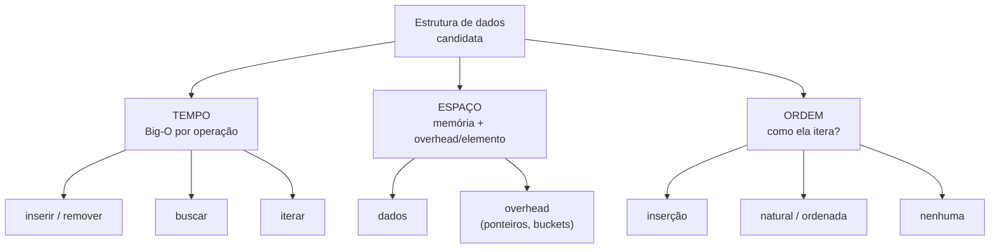
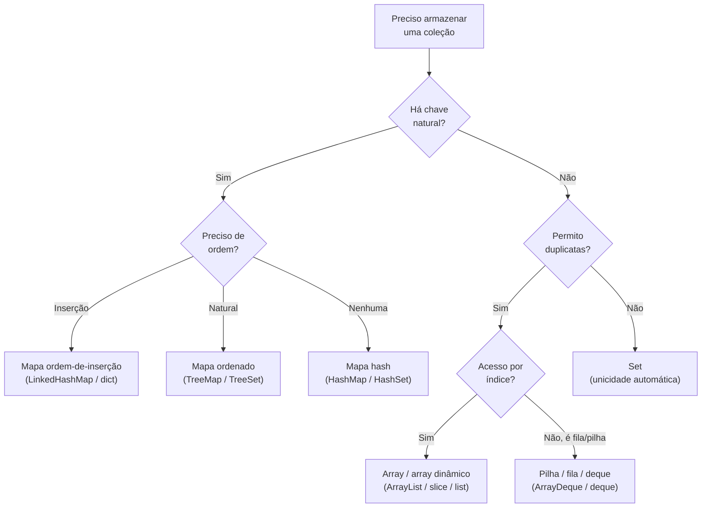
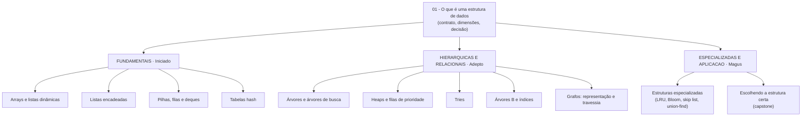

# O que é uma estrutura de dados

Você já decidiu, hoje, qual estrutura de dados usar — provavelmente sem perceber.

Toda vez que você escolhe entre uma lista e um dicionário, entre um array e um set, você está respondendo a uma pergunta de engenharia: *como esses dados vão ser acessados, e qual organização paga menos por esse acesso?*

Esta é a nota de abertura do galho. Ela não ensina nenhuma estrutura específica — ensina a **forma de pensar** que sustenta todas as outras. O contrato, as três dimensões de comparação, o Big-O mínimo para ler o resto, e um framework de decisão para nunca mais escolher uma estrutura "no chute".

> [!abstract] TL;DR
> Uma estrutura de dados é uma coleção com um **contrato de operações** (inserir, remover, buscar, iterar) e **complexidades conhecidas** para cada uma. Comparam-se por **três dimensões**: tempo (Big-O), espaço (memória + overhead) e ordem (inserção / natural / nenhuma). Em entrevista, a pergunta nunca é "o que é um hashmap" — é "qual estrutura para X, e por quê" — e a resposta é sempre um **trade-off**. As linguagens não são neutras: o default que cada uma te entrega (o Collections Framework do Java, o minimalismo do JS, as baterias inclusas do Python, o ascetismo do Go) empurra você para idiomas diferentes. A habilidade senior é conhecer o default *e* saber quando abandoná-lo.

## O que é, de fato

Comece pela definição que cabe numa frase.

Uma **estrutura de dados** é uma forma de organizar dados em memória de modo que um conjunto de operações sobre eles tenha um custo previsível.

Repare nas duas metades dessa frase, porque cada uma carrega um conceito central.

A primeira metade — "uma forma de organizar dados" — é o **contrato de operações**. Toda estrutura promete um conjunto de coisas que você pode fazer com ela:

- **inserir** um elemento;
- **remover** um elemento;
- **buscar** um elemento (por chave, por valor, por posição);
- **iterar** sobre os elementos.

A segunda metade — "custo previsível" — são as **complexidades conhecidas**. Para cada operação do contrato, a estrutura tem um custo característico, expresso em Big-O. Um array entrega busca por índice em O(1) mas inserção no meio em O(n). Uma tabela hash entrega busca por chave em O(1) amortizado mas perde a ordem. Esses custos não são detalhes de implementação — eles *são* a identidade da estrutura.

> [!tip] A definição operacional
> Quando alguém te pergunta "o que é uma estrutura de dados X", a melhor resposta não é decorar a anatomia interna. É enunciar **o contrato** (o que ela deixa você fazer) e **as complexidades** (o que cada operação custa). Com isso você já consegue raciocinar sobre quando usá-la — que é o que realmente importa.

### Por que isso domina entrevistas

Aqui está o ponto que separa quem decorou de quem entendeu.

Em entrevista técnica, a pergunta quase nunca é descritiva ("explique como funciona um hashmap"). Ela é **situacional**: "você precisa retornar os 10 produtos mais vendidos de um stream de eventos — que estrutura você usa?"

A resposta certa não é uma estrutura. É um **trade-off articulado**: "um heap de tamanho fixo 10, porque transforma um sort O(n log n) em uma passada O(n log k), e k é pequeno e constante."

Quem decorou estruturas trava nessa pergunta. Quem entendeu o contrato e os custos navega por ela. O galho inteiro existe para te treinar nesse segundo modo.

## As três dimensões de comparação

Toda comparação entre estruturas se reduz a três eixos. Memorize estes três — eles são o sistema de coordenadas de tudo que vem depois.

**Tempo.** A complexidade Big-O de cada operação do contrato. É o eixo mais óbvio e o mais cobrado. Mas atenção: "tempo O(1)" não significa "rápido em segundos" — significa "não cresce com o tamanho da coleção". Uma operação O(1) com constante alta pode perder, na prática, para uma O(log n) com constante baixa em coleções pequenas.

**Espaço.** Quanta memória a estrutura consome — não só pelos dados, mas pelo **overhead por elemento**. Uma lista encadeada paga ponteiros extras por nó. Uma tabela hash paga buckets vazios para manter o load factor baixo. Esse overhead é invisível no Big-O (todos são O(n) de espaço) mas pode ser a diferença entre caber e não caber na RAM.

**Ordem.** A estrutura preserva alguma ordem? Há três respostas possíveis:

- **ordem de inserção** — itera na ordem em que você inseriu (array, `LinkedHashMap`, `dict` do Python);
- **ordem natural** — itera ordenado por comparação (`TreeMap`, `TreeSet`, heap parcialmente);
- **nenhuma ordem** — itera numa ordem arbitrária e instável (`HashMap`, `HashSet`).

A ordem é o eixo mais esquecido pelos juniores e o mais valioso em entrevista. "Preciso de ordem?" frequentemente decide a estrutura sozinha.

O diagrama abaixo posiciona esses três eixos como as perguntas que você faz a qualquer estrutura antes de adotá-la.



Leitura do diagrama: para qualquer estrutura candidata, você a interroga nos três eixos — quanto custa cada operação (tempo), quanta memória ela cobra além dos dados (espaço), e em que ordem ela devolve os elementos (ordem). Comparar estruturas é comparar as respostas que cada uma dá a essas três perguntas.

## Big-O em uma página

O galho inteiro fala em Big-O, então você precisa do mínimo para ler o resto. Apenas o mínimo — a teoria completa (análise assintótica, recorrências, classes de complexidade) vive em [[Algoritmos]].

Big-O descreve **como o custo de uma operação cresce conforme a entrada cresce**. Ele ignora constantes e termos menores, porque o que importa em escala é o formato da curva, não o coeficiente.

As cinco curvas que você vai encontrar neste galho, da melhor para a pior:

- **O(1) — constante.** O custo não muda com o tamanho. Buscar por índice num array, buscar por chave numa tabela hash. É o ideal.
- **O(log n) — logarítmica.** O custo cresce devagar; dobrar a entrada adiciona um passo. Busca em árvore balanceada, busca binária. Excelente.
- **O(n) — linear.** O custo cresce na mesma proporção da entrada. Percorrer uma lista, busca linear. Aceitável e muitas vezes inevitável.
- **O(n log n) — linearítmica.** O melhor que um sort por comparação consegue. Ordenar uma coleção.
- **O(n²) — quadrática.** O custo explode; dobrar a entrada quadruplica o trabalho. Comparar todos os pares. Evite em coleções grandes.

Três distinções que aparecem o tempo todo:

> [!tip] Amortizado, pior caso, caso médio
> **Amortizado** — o custo médio por operação ao longo de muitas operações, mesmo que algumas individuais sejam caras. `add` num array dinâmico é O(1) amortizado: quase sempre O(1), mas paga O(n) ocasional quando precisa redimensionar e copiar. Diluído, sai O(1).
>
> **Pior caso vs. caso médio** — a tabela hash é O(1) no caso médio, mas O(n) no pior caso (todas as chaves colidindo no mesmo bucket). Em entrevista, sempre cite os dois: "O(1) amortizado, O(n) no pior caso durante o rehash, mas isso é raro."

Com isso você lê qualquer tabela de complexidade do galho. O resto da teoria fica em [[Algoritmos]].

## O framework de decisão

Agora o coração da nota: como escolher uma estrutura sem chutar.

Antes de escrever uma linha de código, responda a seis perguntas. Elas filtram o espaço de estruturas de dezenas para uma ou duas candidatas.

**1. Qual é o padrão de acesso dominante?**
A pergunta-mãe. Você vai sobretudo *buscar por chave*? *iterar em sequência*? *pegar o top-K*? *fazer range queries*? Identifique a operação que roda no hot path — ela manda na escolha. Otimize para o acesso dominante, não para o raro.

**2. Há uma chave natural?**
Se cada elemento tem uma chave única e natural (um CPF, um ID, um e-mail), você quer um mapa — hash ou árvore. Se não há chave, e os elementos importam por posição ou só por presença, você quer um array, uma lista ou um set.

**3. Você precisa de ordem?**
- ordem de inserção → `LinkedHashMap` (Java), `dict` (Python ≥ 3.7), `Map` (JS);
- ordem natural / ordenada → `TreeMap` / `TreeSet`;
- nenhuma ordem → `HashMap` / `HashSet` (o mais barato).

Não pague por ordem que você não usa.

**4. O tamanho é conhecido e fixo?**
Tamanho fixo e conhecido → um array cru vence (zero overhead, máxima localidade de cache). Tamanho dinâmico → array dinâmico (`ArrayList`, `slice`, `list`) ou mapa.

**5. Há concorrência?**
Acesso de múltiplas threads muda tudo. As estruturas comuns *não* são thread-safe. Em Java, troque por `ConcurrentHashMap`, `CopyOnWriteArrayList`. Ignorar isso gera bugs que só aparecem em produção sob carga.

**6. Você precisa de duplicatas?**
Duplicatas permitidas → lista. Duplicatas proibidas (unicidade automática) → set. Esta é a pergunta mais rápida e a mais frequentemente ignorada.

O diagrama abaixo encadeia essas perguntas como um fluxo de decisão até uma família de estruturas.



Leitura do diagrama: a primeira bifurcação é "há chave natural?". Com chave, a próxima pergunta é sobre ordem, que escolhe entre mapa de inserção, mapa ordenado e mapa hash. Sem chave, você decide entre permitir duplicatas (array, ou pilha/fila conforme o padrão de acesso) ou não (set). Concorrência e tamanho fixo são modificadores que se aplicam por cima da família escolhida.

> [!warning] O erro do júnior e o erro do senior
> O **júnior** escolhe a estrutura que conhece — geralmente uma lista — para tudo, e descobre o problema em produção.
>
> O **senior** às vezes erra para o outro lado: alcança uma skip list, um bloom filter ou um trie quando um `HashMap` resolveria. Complexidade tem custo de manutenção. A maturidade é escolher a estrutura *mais simples que satisfaz o contrato*, não a mais sofisticada que você conhece.

## Implementações comparadas: Java · TypeScript · Python · Go

Aqui está a tese desta seção, e ela vale para o galho inteiro: **a biblioteca padrão de cada linguagem não é neutra**. O conjunto de estruturas que vêm "de fábrica" molda qual estrutura você alcança primeiro — e, por consequência, como você pensa o problema.

Quatro filosofias bem diferentes. Vamos a cada uma.

### Java — o Collections Framework e "programe para a interface"

Java aposta numa **hierarquia de interfaces** rica e formal. Antes de qualquer implementação, há um contrato:

- `List` — coleção ordenada, indexável, com duplicatas;
- `Set` — coleção sem duplicatas;
- `Map` — associação chave-valor;
- `Queue` / `Deque` — coleções com semântica de ponta (FIFO / dupla-ponta).

E, *abaixo* de cada interface, várias implementações concorrentes: `ArrayList` e `LinkedList` implementam `List`; `HashMap`, `LinkedHashMap` e `TreeMap` implementam `Map`.

A consequência cultural é o mantra **"program to the interface, not the implementation"**: você declara variáveis pelo tipo da interface e só decide a implementação no `new`.

```java
// Programe para a interface: o tipo declarado é a interface,
// a implementação é uma decisão localizada no construtor.
Map<String, Integer> estoque = new HashMap<>();      // sem ordem, O(1)
Map<String, Integer> ordenado = new TreeMap<>();     // ordem natural, O(log n)
List<String> nomes = new ArrayList<>();              // indexável, cache-friendly

// Trocar a implementação não toca no resto do código:
// basta mudar o lado direito do '='.
```

O preço da elegância em Java é o **autoboxing**. Generics em Java não funcionam com primitivos — `List<int>` não existe, só `List<Integer>`. Cada `int` colocado numa coleção vira um objeto `Integer` (boxing): mais memória (um `Integer` é um objeto no heap, ~16 bytes, contra 4 de um `int`) e mais indireção (cada acesso desreferencia um ponteiro).

```java
// Cada autoboxing aloca um objeto Integer no heap.
List<Integer> numeros = new ArrayList<>();
numeros.add(42);          // int 42 -> Integer.valueOf(42) (boxing)
int x = numeros.get(0);   // Integer -> int (unboxing)

// Em código numérico de alta performance, prefira arrays primitivos
// ou bibliotecas especializadas (Eclipse Collections, fastutil) que
// evitam o boxing.
int[] cru = new int[1000]; // zero overhead de boxing, máxima localidade
```

> [!example] O default do Java te empurra para
> Pensar em **contratos primeiro**. Você raciocina "preciso de um `Map`" antes de "preciso de um `HashMap`". Isso é ótimo para design e testabilidade — mas você paga em verbosidade e no custo do autoboxing quando o domínio é numérico.

### TypeScript / JavaScript — o conjunto mínimo built-in

JavaScript fica no extremo oposto do Java: a linguagem entrega **pouquíssimas** estruturas nativas, e você constrói ou importa o resto.

O kit de fábrica:

- `Array` — lista dinâmica, indexável, ordenada;
- `Object` — mapa com chaves string/symbol, otimizado pela engine;
- `Map` — mapa de propósito geral, aceita qualquer tipo de chave, preserva ordem de inserção;
- `Set` — coleção sem duplicatas;
- `WeakMap` / `WeakSet` — variantes com chaves de referência fraca (não impedem garbage collection), úteis para metadados e caches que não devem causar memory leak.

Não há heap, nem árvore balanceada, nem deque nativos. Precisou de um heap? Você implementa ou puxa de um pacote npm.

O trade-off mais cobrado em entrevista de JS é **`Map` vs. `Object`**:

```typescript
// Object: shape fixo, chaves conhecidas em tempo de escrita.
// A V8 cria uma "hidden class" otimizada -> acesso muito rápido.
const config = { host: "localhost", port: 5432 };

// Map: chaves dinâmicas, de qualquer tipo, ordem de inserção garantida,
// .size em O(1), e não herda chaves do prototype (sem '__proto__' surpresa).
const cache = new Map<string, User>();
cache.set("u1", user);
cache.get("u1");
cache.has("u1");
cache.size;          // O(1) — em Object exige Object.keys(o).length, O(n)

// Set: deduplicação idiomática
const unicos = new Set([1, 2, 2, 3]); // {1, 2, 3}
```

A regra prática: **`Object` para shapes fixos e conhecidos** (registros, configs), **`Map` para coleções dinâmicas** (chaves que entram e saem em runtime, chaves não-string, necessidade de ordem ou de `.size`).

> [!example] O default do JS te empurra para
> **Monomorfismo.** A V8 otimiza objetos que mantêm sempre a mesma "forma" (hidden class) — sempre os mesmos campos, na mesma ordem, com os mesmos tipos. Misturar tipos num array (`[1, "a", {}]`) ou adicionar campos a objetos depois da criação faz a engine cair para um caminho lento (polimórfico ou megamórfico). O idioma performático em JS é manter arrays densos e homogêneos e objetos com shape estável.

### Python — baterias inclusas

Python é o oposto cultural do Go: a filosofia é **"batteries included"**. A linguagem entrega estruturas ricas como primitivos da própria sintaxe, e a stdlib cobre quase todo o resto.

Os built-ins, com sintaxe literal dedicada:

- `list` — array dinâmico (`[1, 2, 3]`);
- `dict` — tabela hash, **ordem de inserção garantida desde 3.7** (`{"a": 1}`);
- `set` — conjunto sem duplicatas (`{1, 2, 3}`);
- `tuple` — sequência imutável (`(1, 2)`), hasheável, usável como chave de `dict`.

E o módulo `collections` mais a stdlib completam o arsenal:

```python
from collections import deque, Counter, defaultdict, OrderedDict
import heapq
import bisect

# deque: fila/pilha/deque com O(1) nas duas pontas (list é O(n) no início)
fila = deque([1, 2, 3])
fila.appendleft(0)   # O(1)
fila.popleft()       # O(1)

# Counter: contagem de frequência em uma linha
freq = Counter("abracadabra")   # {'a': 5, 'b': 2, 'r': 2, ...}
freq.most_common(2)             # [('a', 5), ('b', 2)]

# defaultdict: sem KeyError; cria o valor default na primeira chave nova
grafo = defaultdict(list)
grafo[1].append(2)   # cria a lista vazia automaticamente

# heapq: heap binário (min-heap) operando sobre uma list comum
h = []
heapq.heappush(h, 5)
heapq.heappush(h, 1)
heapq.heappop(h)     # 1

# bisect: busca binária / inserção mantendo a list ordenada (O(log n) p/ achar)
ordenada = [1, 3, 5, 7]
bisect.insort(ordenada, 4)   # [1, 3, 4, 5, 7]
```

Note que `Counter`, `defaultdict` e `most_common` resolvem em uma linha problemas que em outras linguagens custam um loop e várias condicionais. Combinado com a tipagem dinâmica (sem boxing visível, sem declaração de tipo), Python otimiza para **velocidade de quem escreve**.

> [!example] O default do Python te empurra para
> Alcançar o **built-in expressivo** antes de pensar em performance. `Counter` para contar, `defaultdict` para agrupar, `heapq` para top-K. Isso torna o código curto e legível — ao custo de o desempenho bruto ficar atrás de Java e Go, e de o overhead de memória de cada objeto Python ser alto (tudo é objeto, com refcount e cabeçalho).

### Go — minimalismo deliberado

Go é o ascetismo levado a sério. A linguagem te dá **três** estruturas embutidas e, por design, espera que você construa o resto à mão.

Os built-in:

- `array` — tamanho fixo, parte do tipo (`[5]int`);
- `slice` — view dinâmica sobre um array (`[]int`), o "array dinâmico" do Go;
- `map` — tabela hash (`map[string]int`).

A stdlib adiciona pouco, e de forma low-level, no pacote `container`:

- `container/heap` — *não* é um heap pronto: é uma **interface** de operações de heap que você implementa para o seu tipo;
- `container/list` — lista duplamente encadeada;
- `container/ring` — lista circular.

```go
// Built-in: slice e map cobrem a maioria dos casos.
nomes := []string{"Ana", "Bruno"}   // slice
nomes = append(nomes, "Carla")      // crescimento amortizado O(1)

estoque := map[string]int{}          // map (hash)
estoque["café"] = 10
v, ok := estoque["café"]             // o idioma comma-ok: v=10, ok=true

// container/heap NÃO é um heap pronto — você implementa heap.Interface.
type IntHeap []int
func (h IntHeap) Len() int            { return len(h) }
func (h IntHeap) Less(i, j int) bool  { return h[i] < h[j] }
func (h IntHeap) Swap(i, j int)       { h[i], h[j] = h[j], h[i] }
func (h *IntHeap) Push(x any)         { *h = append(*h, x.(int)) }
func (h *IntHeap) Pop() any {
    old := *h
    n := len(old)
    x := old[n-1]
    *h = old[:n-1]
    return x
}
```

Duas particularidades do Go importam para estruturas de dados.

A primeira: **generics só chegaram no Go 1.18, em março de 2022** — mais de doze anos depois do lançamento da linguagem. Antes disso, estruturas genéricas exigiam `interface{}` (hoje `any`) com type assertions, ou geração de código. Por isso a cultura Go é construir estruturas concretas à mão. Hoje dá para escrever uma `Stack[T]` genérica, mas o hábito comunitário de "escreva o que precisa, sem abstração prematura" permanece.

A segunda: **semântica de valor vs. ponteiro**. Em Go, atribuir ou passar uma struct **copia** o valor. Slices e maps são exceções (carregam uma referência interna), mas uma struct comum é copiada. Isso afeta diretamente estruturas de dados: um nó de árvore passado por valor é duplicado; para mutar o original, você passa `*Node`.

```go
type Node struct {
    val  int
    next *Node   // ponteiro: senão a struct se conteria recursivamente (impossível)
}

// Passar por valor COPIA a struct inteira:
func incValor(n Node)  { n.val++ }   // mutação perdida — operou na cópia
// Passar por ponteiro muta o original:
func incPtr(n *Node)   { n.val++ }   // muta o nó real
```

> [!example] O default do Go te empurra para
> **Construir à mão e pensar em alocação.** Com só slice e map prontos, você implementa pilhas, filas e árvores explicitamente — o que te força a entender a estrutura. E a semântica de valor te obriga a decidir conscientemente entre copiar e referenciar, o que paga em performance previsível e zero surpresa de GC.

### O ponto senior

Junte as quatro filosofias e a lição emerge.

Cada linguagem tem um **default cultural** que molda seu primeiro instinto:

- Java te faz pensar em **contratos** (a interface antes da implementação);
- JavaScript te dá **o mínimo** e confia que você importe ou construa o resto;
- Python te entrega **expressividade pronta** (o built-in que resolve em uma linha);
- Go te força a **construir à mão** e a pensar em alocação e cópia.

A habilidade que separa o senior não é decorar a stdlib de uma linguagem. É **conhecer o default *e* saber quando abandoná-lo**: trocar o `ArrayList` por um array primitivo quando o boxing dói; preferir `Object` a `Map` quando o shape é fixo; alcançar `heapq` em vez de ordenar a coleção inteira; passar `*Node` em vez de `Node` quando você precisa mutar.

O default existe para o caso comum. Saber sair dele é o que você demonstra em entrevista.

## Mapa do galho

Esta nota é a porta de entrada. Daqui o galho se ramifica em três famílias, organizadas pelas três fases de aprendizado.



Leitura do diagrama: tudo parte desta nota de fundamentos. As **fundamentais** (fase Iniciado) são os blocos com que você passa 90% do tempo. As **hierárquicas e relacionais** (Adepto) cobrem árvores, heaps e grafos — onde a ordem e a estrutura de relações entram. As **especializadas** (Magus) e o capstone de decisão fecham o galho com as estruturas que demonstram senioridade. Cada nota traz a comparação Java/TS/Python/Go.

## Em entrevista

A pergunta sobre estruturas de dados é, no fundo, uma pergunta sobre **trade-offs**. Nunca recite definições; mostre que você raciocina sobre custo.

> "The structure I choose depends on the dominant access pattern. If I need constant-time lookup by a unique key, I reach for a hash map — `HashMap` in Java, `dict` in Python, `Map` in JavaScript. If I also need the keys ordered, or range queries, I trade O(1) for O(log n) and use a `TreeMap`."

> "For a top-K problem I use a fixed-size heap of size k — that turns an O(n log n) sort into an O(n log k) pass, which matters when n is large and k is small."

> "And I try to reach for the simplest structure that satisfies the contract. Reaching for a trie or a bloom filter when a hash map would do is its own mistake — complexity has a maintenance cost."

Frases para pivotar um trade-off:

- "I'd trade a bit of memory for faster lookups here."
- "It depends on whether reads or writes dominate."
- "This is O(1) amortized — worst case is O(n) during a rehash, but that's rare."
- "I'd profile before optimizing, but my first instinct is..."

Vocabulário essencial:

- contrato de operações → operation contract
- complexidade de tempo / espaço → time / space complexity
- amortizado → amortized
- pior caso / caso médio → worst case / average case
- padrão de acesso → access pattern
- ordem de inserção / natural → insertion order / natural order
- chave natural → natural key
- localidade de cache → cache locality
- autoboxing → autoboxing
- programar para a interface → program to the interface

## Referências

- [The Go Programming Language — Go 1.18 is released](https://go.dev/blog/go1.18) — generics chegaram no Go 1.18 (lançado em 15 de março de 2022).
- [Python `dict` — Built-in Types (docs)](https://docs.python.org/3/library/stdtypes.html#dict) e [What's New in Python 3.7](https://docs.python.org/3/whatsnew/3.7.html) — ordem de inserção garantida na especificação da linguagem desde 3.7.
- [Java Collections Framework — package summary](https://docs.oracle.com/en/java/javase/21/docs/api/java.base/java/util/package-summary.html) — interfaces e implementações.
- [Java `HashMap` (Java 8+)](https://docs.oracle.com/en/java/javase/21/docs/api/java.base/java/util/HashMap.html) — load factor default 0.75; treeify de bucket em Red-Black tree a partir de 8 entradas (TREEIFY_THRESHOLD) desde Java 8.
- [Go `container/heap`, `container/list`, `container/ring`](https://pkg.go.dev/container) — pacotes da stdlib; `container/heap` é uma interface, não um heap pronto.
- [MDN — `Map`](https://developer.mozilla.org/en-US/docs/Web/JavaScript/Reference/Global_Objects/Map) e [`WeakMap`](https://developer.mozilla.org/en-US/docs/Web/JavaScript/Reference/Global_Objects/WeakMap) — o conjunto built-in de JS.
- [Big-O Cheat Sheet](https://www.bigocheatsheet.com/) — referência rápida de complexidades por estrutura.

> [!note] Lastro
> As afirmações de versão verificadas em fonte primária: **Go generics no 1.18 (mar/2022)**, **Python dict ordenado por especificação desde 3.7**, **HashMap do Java com load factor 0.75 e treeify em 8 desde Java 8**. As caracterizações de "filosofia de stdlib" e o comportamento de hidden classes da V8 são síntese pedagógica sobre comportamento bem documentado, não citações literais de uma fonte única.

## Veja também

- [[02 - Arrays e listas dinâmicas]] — o primeiro bloco fundamental, e o array dinâmico em detalhe.
- [[05 - Tabelas hash]] — a estrutura mais cobrada; hashing, colisões, o contrato hashCode/equals.
- [[13 - Escolhendo a estrutura certa]] — o capstone: tabela comparativa completa, patterns de entrevista e armadilhas.
- [[Algoritmos]] — a teoria de complexidade (Big-O, recorrências) e os algoritmos que operam sobre estas estruturas.
- [[Dicionário de Ciência da Computação]] — verbetes dos termos deste galho.
