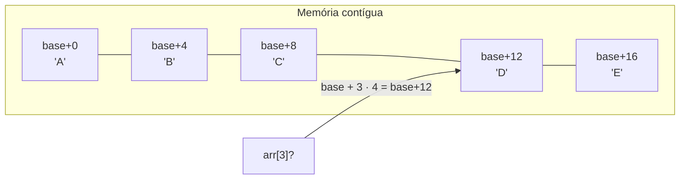
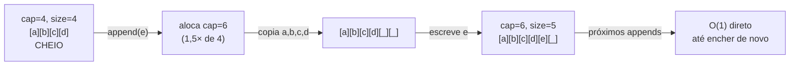
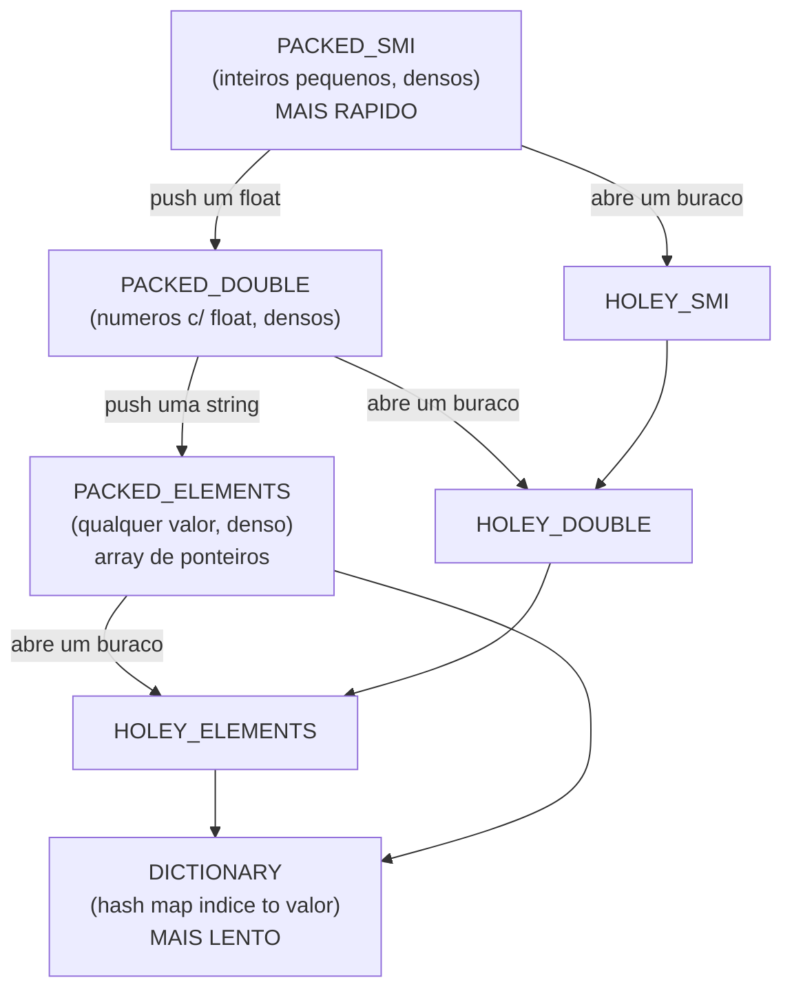
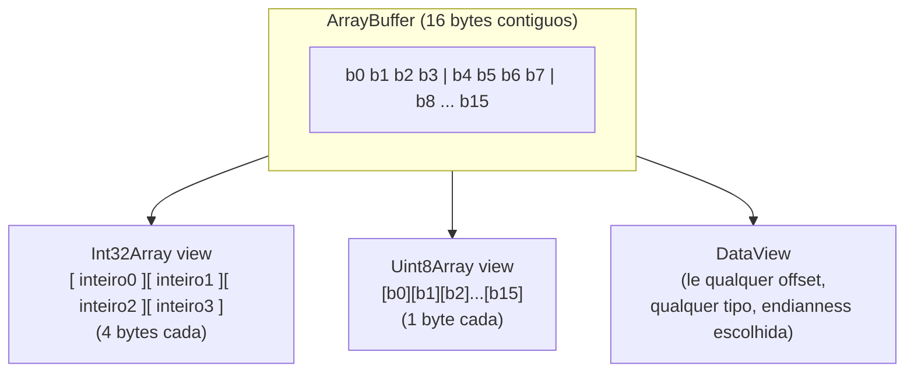
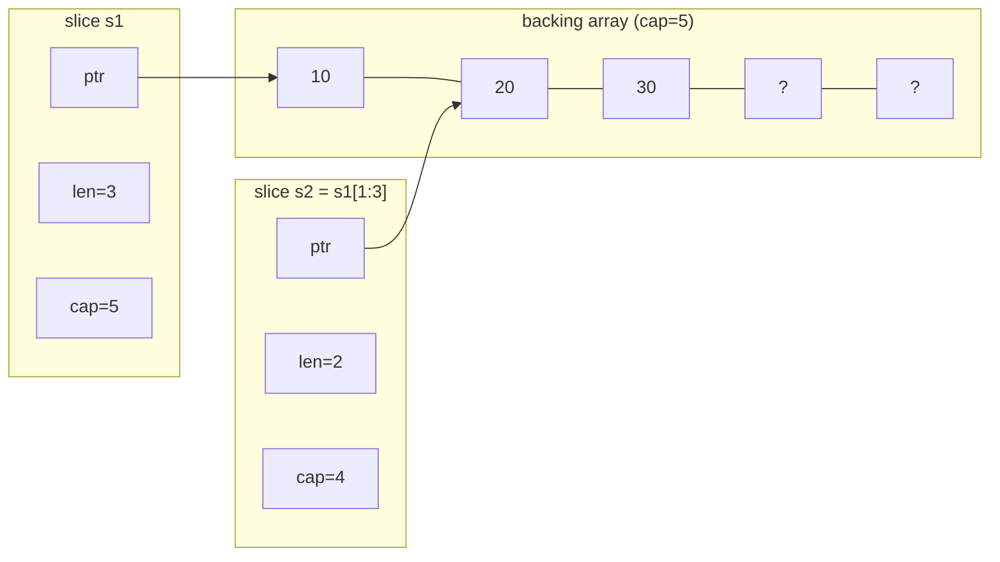
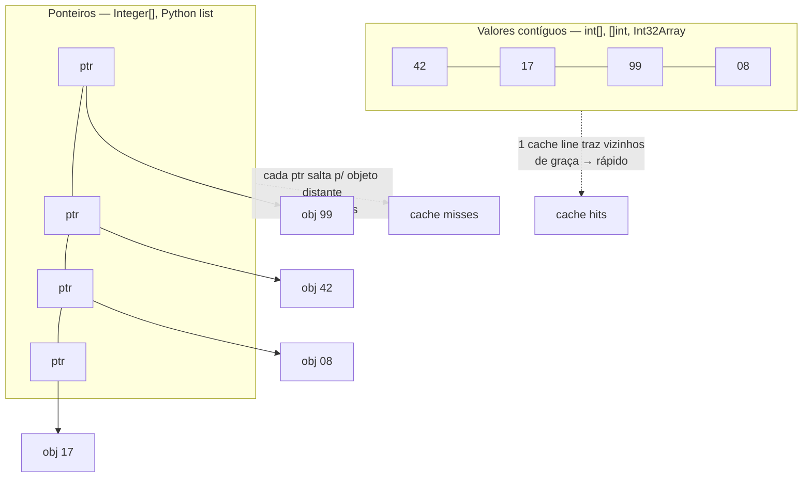

# Arrays e listas dinâmicas

O array é a estrutura mais antiga e mais simples que existe — e, justamente por isso, a mais subestimada.

Quase toda outra estrutura de dados é construída sobre ele por baixo. A tabela hash guarda seus buckets num array. O heap é um array. O `ArrayList`, a `list` do Python, a slice do Go — todos são, no fundo, um array que cresceu sozinho.

Esta é a primeira estrutura concreta do galho. Depois de [[01 - O que é uma estrutura de dados|entender o que é uma estrutura de dados]] de forma abstrata, aqui você desce ao nível da memória: o que é um array de verdade, por que o acesso por índice é O(1), e como quatro linguagens — Java, TypeScript, Python e Go — pegam o mesmo conceito e o implementam de quatro jeitos radicalmente diferentes.

> [!abstract] TL;DR
> Um **array** é uma região **contígua** de memória com tamanho fixo. O acesso por índice é O(1) porque o endereço se calcula direto: `base + i · tamanho`. Por estarem juntos na memória, arrays têm **localidade de cache** excelente — a razão real de eles ganharem de estruturas "teoricamente melhores". Inserir/remover no meio é O(n) (precisa deslocar). Uma **lista dinâmica** (`ArrayList`, `list`, slice) embrulha um array interno e cresce copiando para um array maior — `append` é O(1) **amortizado**. O fator de crescimento é um trade-off (tempo × memória desperdiçada): Java cresce **1,5×**, Python ~1,125× mais constante, Go dobra até 256 elementos e depois suaviza. O grande insight senior: o mesmo "array" tem **quatro modelos de memória** distintos — valores contíguos (`int[]` do Java, `[]int` do Go, typed arrays do JS) versus ponteiros espalhados (`Integer[]` do Java, `list` do Python). E a slice do Go tem o twist que define a linguagem: um header `(ptr, len, cap)`.

## O que é um array, de fato

Comece pela imagem mental certa, porque ela explica tudo o que vem depois.

Um array é um **bloco único e contíguo de memória**, dividido em células de tamanho igual.

"Contíguo" é a palavra-chave. As células não estão espalhadas — estão grudadas, uma do lado da outra, na mesma vizinhança da memória. Um `int[5]` em Java é um bloco de 20 bytes seguidos (5 inteiros de 4 bytes), não cinco inteiros perdidos em lugares aleatórios.

Esse layout tem três consequências diretas, e cada uma é uma propriedade que você vai citar em entrevista.

### Acesso por índice é O(1)

Por que ler `arr[i]` custa o mesmo, não importa se `i` é 0 ou 1 milhão?

Porque o computador não *procura* a posição `i` — ele a **calcula**:

```
endereço = endereço_base + i · tamanho_do_elemento
```

Se o array começa no endereço `1000` e cada elemento ocupa 4 bytes, então `arr[3]` está em `1000 + 3·4 = 1012`. Uma multiplicação e uma soma. Constante. Não há varredura, não há comparação — só aritmética de ponteiro.

Esse é o superpoder do array, e a razão de ele ser a fundação de tantas outras estruturas: **acesso aleatório verdadeiramente O(1)**.

A imagem abaixo mostra esse cálculo acontecendo.



Leitura do diagrama: para achar `arr[3]`, o sistema não percorre as células — ele aplica `base + 3 · tamanho` e salta direto para a célula que contém `'D'`. O índice vira aritmética, e por isso o custo independe da posição.

### Localidade de cache: a vantagem invisível

Aqui está a propriedade que os livros de Big-O escondem, mas que decide o desempenho real.

A CPU não lê a memória byte a byte. Ela lê em blocos chamados **cache lines** (tipicamente 64 bytes) e os guarda numa memória ultrarrápida (o cache L1/L2).

Quando você lê `arr[0]`, a CPU traz para o cache não só `arr[0]`, mas toda a vizinhança — `arr[1]`, `arr[2]`, ... — de graça, no mesmo movimento.

Resultado: iterar um array sequencialmente é absurdamente rápido. Os próximos elementos já estão no cache quando você chega neles.

> [!tip] Por que isso vence o Big-O
> Uma lista encadeada e um array têm a mesma complexidade de iteração: O(n). Mas percorrer 10.000 inteiros num array pode ser **ordens de magnitude** mais rápido, porque os elementos estão grudados (cache hits) enquanto os nós da lista estão espalhados pela memória (cache misses, cada um custando uma ida cara à RAM). Big-O conta operações; localidade de cache decide quanto cada operação realmente custa. Voltamos a isso em [[03 - Listas encadeadas]].

### Tamanho fixo e o custo do meio

A terceira consequência do bloco contíguo é uma limitação.

Como o array é um bloco alocado de uma vez, ele tem **tamanho fixo**. Um `int[10]` não cresce — não há garantia de que a memória logo depois dele esteja livre. Para "crescer", a única saída é alocar um bloco maior e copiar tudo.

E inserir ou remover **no meio** é O(n).

Por quê? Porque o array não pode ter buracos — ele é contíguo por definição. Se você insere na posição 2 de um array de 10 elementos, os 8 elementos à direita precisam **deslocar** uma casa para abrir espaço. Remover é o mesmo ao contrário: todos à direita deslocam para tampar o buraco.

> [!summary] As três propriedades, em uma frase
> Array = bloco contíguo → acesso por índice O(1) (aritmética) + localidade de cache excelente (vizinhos juntos) − tamanho fixo e inserção/remoção no meio O(n) (deslocamento).

## Array dinâmico: o array que cresce sozinho

O tamanho fixo do array é um incômodo. Na prática, raramente sabemos de antemão quantos elementos virão.

A solução é o **array dinâmico** (ou lista dinâmica): uma estrutura que **embrulha** um array interno e o gerencia para você.

A ideia é simples. A lista guarda dois números:

- **tamanho** (`size`/`len`) — quantos elementos você realmente colocou;
- **capacidade** (`capacity`/`cap`) — quantos cabem no array interno antes de precisar crescer.

Enquanto `size < capacity`, adicionar no fim é só escrever na próxima célula livre: O(1). Quando o array enche (`size == capacity`), a lista faz o **resize**: aloca um array maior, copia tudo, e descarta o antigo.



Leitura do diagrama: quando o array interno enche, o `append` paga uma vez o custo O(n) de alocar um array maior e copiar tudo; depois disso, os próximos `append` voltam a ser O(1) baratos até a capacidade esgotar de novo. O custo da cópia se dilui sobre muitos appends.

### Por que `append` é O(1) *amortizado*

Essa palavra — **amortizado** — é um sinal de senioridade em entrevista. Vale entender de verdade.

Cada `append` individual é O(1)... exceto os raros que disparam um resize, que são O(n).

A mágica está na frequência. Como a capacidade **dobra** (ou cresce por um fator), os resizes ficam cada vez mais espaçados: você copia 4, depois 8, depois 16, depois 32...

Some o custo total de inserir n elementos: as cópias somam `4 + 8 + 16 + ... + n`, uma série geométrica que converge para **~2n**. Distribuído pelos n appends, dá custo constante por operação.

> [!note] Amortizado ≠ caso médio
> "Amortizado O(1)" não é uma probabilidade — é uma **garantia sobre uma sequência**. Qualquer sequência de n appends custa O(n) no total, logo O(1) por operação na média da sequência. Um único append pode ser O(n) (azarado, caiu no resize), mas a soma é sempre limitada. Frase de entrevista: *"append is amortized O(1) — individual inserts can be O(n) during a resize, but any sequence of n appends totals O(n)."*

### O trade-off do fator de crescimento

Por que dobrar? Por que não crescer de 1 em 1, ou de 1000 em 1000?

É um trade-off entre **tempo** e **memória desperdiçada**.

- **Fator pequeno** (ex: +1 a cada vez) → quase nenhum desperdício de memória, mas resize a cada append → custo total O(n²). Péssimo.
- **Fator grande** (ex: 2×) → resizes raros, ótimo tempo amortizado, mas pode desperdiçar até ~50% da memória logo após um resize (você dobrou, mas só usou uma célula a mais).

Cada linguagem escolhe um ponto diferente nessa curva — e é exatamente aí que as implementações divergem. Java escolhe 1,5×. Go dobra (e depois suaviza). Python cresce devagar, ~1,125×. Veremos cada uma a seguir.

> [!info] Por que o meio continua O(n)
> O array dinâmico só otimiza o crescimento **pelo fim**. Inserir ou remover no **meio** continua O(n), porque o array interno ainda é contíguo — os elementos à direita continuam tendo que deslocar. Lista dinâmica resolve o "tamanho fixo", não o "custo do meio". Para inserção/remoção barata no meio (com referência), é território de [[03 - Listas encadeadas]].

## Implementações comparadas: Java · TypeScript · Python · Go

Agora a parte que separa quem sabe "array" de quem sabe *como o array vive* em cada linguagem.

O conceito é o mesmo nas quatro. Mas a representação na memória é tão diferente que muda performance, pegadinhas e idiomas. A pergunta central que vamos perseguir é uma só:

*Os elementos estão guardados como valores contíguos, ou como ponteiros para objetos espalhados?*

### Java: `int[]` contíguo vs `Integer[]` de referências

Java tem uma divisão brutal que outras linguagens escondem: **primitivos vs objetos**.

Um `int[]` é um array de **valores**: cada célula contém os 4 bytes do inteiro, em sequência, contíguos. É o array "puro" do conceito — máxima localidade de cache, zero indireção.

```java
int[] numeros = new int[5];   // 20 bytes contíguos de valores
numeros[3] = 42;              // escreve direto na célula
int x = numeros[3];           // lê o valor, sem indireção
```

Já um `Integer[]` (ou qualquer `Object[]`) é um array de **referências**: cada célula contém um **ponteiro** para um objeto `Integer` que vive em outro lugar do heap. Os valores estão espalhados; o array só guarda os endereços.

```java
Integer[] caixa = new Integer[5];  // 5 ponteiros contíguos...
caixa[3] = 42;                     // autoboxing: cria new Integer(42) no heap
                                   // ...mas o objeto 42 está longe, espalhado
```

Isso é o **boxing**, e o custo é duplo: memória (cada `Integer` tem overhead de objeto, ~16 bytes contra 4 de um `int`) e cache (seguir o ponteiro para um objeto distante = cache miss).

> [!warning] Arrays em Java são covariantes
> `Integer[]` é um subtipo de `Object[]` — isso se chama **covariância de arrays**, e é uma decisão de design controversa. Ela permite código que compila mas explode em runtime:
> ```java
> Object[] arr = new Integer[3];   // compila: covariância
> arr[0] = "uma string";           // ArrayStoreException em runtime!
> ```
> O array carrega seu tipo real e checa cada escrita, lançando `ArrayStoreException` se você tentar guardar o tipo errado. Generics (`List<Integer>`) são **invariantes** justamente para fechar esse buraco em tempo de compilação.

O array dinâmico de Java é o **`ArrayList`**, que embrulha um `Object[] elementData` interno.

Seu crescimento é **1,5×**, não 2×. No método `grow()`, a nova capacidade é `oldCapacity + (oldCapacity >> 1)` — o `>> 1` é divisão por 2 via bit shift, então 1,5×. A cópia usa `Arrays.copyOf`, que por baixo chama `System.arraycopy` (memória em bloco, nativo).

```java
List<String> lista = new ArrayList<>();   // cap inicial 10 no 1º add
lista.add("Ana");                          // O(1) amortizado
lista.get(0);                              // O(1)
lista.add(1, "x");                         // O(n): desloca à direita
lista.remove(0);                           // O(n): desloca à esquerda
((ArrayList<String>) lista).ensureCapacity(1000); // pré-aloca, evita resizes
```

Sequência de capacidades partindo de 10: 10 → 15 → 22 → 33 → 49... (cada uma é 1,5× a anterior, arredondado). Note que `ArrayList` sempre guarda `Object`, então `ArrayList<Integer>` **sempre faz boxing** — não existe `ArrayList` de primitivos (é onde bibliotecas como Eclipse Collections ou `IntStream` entram).

#### Os ancestrais: `Vector` e `Stack` (e por que você os evita)

Antes do `ArrayList` (Java 1.2) existia o **`Vector`** (Java 1.0), e em cima dele a **`Stack`**. Os dois ainda estão na stdlib — você vai topar com eles em código antigo —, mas o conselho moderno é simples: não use.

A diferença não é o crescimento; é a **sincronização**. Cada método de `Vector` é `synchronized`. Isso soa seguro, mas é o pior dos mundos:

- Você paga o custo do lock **em toda chamada**, mesmo num programa de uma thread só.
- E mesmo assim a thread-safety é uma ilusão para operações compostas. `if (v.isEmpty()) v.add(x)` são **dois** métodos sincronizados — entre um e outro, outra thread pode agir. O lock por método não protege a sequência.

`Stack` herda de `Vector` e ainda erra a topologia: como subclasse de uma lista, ela expõe `get(i)`/`insertElementAt`, deixando você espetar o meio de uma pilha. O substituto idiomático é `Deque`/`ArrayDeque`.

> [!note] A regra
> Precisa de uma lista sem concorrência? Use `ArrayList`. Precisa de uma pilha? Use `ArrayDeque`. `Vector` e `Stack` ficaram para trás por sincronizar à força (caro) e mesmo assim não resolver concorrência de verdade (compostas continuam inseguras).

#### Quando você de fato precisa de concorrência

Se múltiplas threads compartilham a lista, há duas rotas idiomáticas — e elas trocam custo de forma oposta.

**`Collections.synchronizedList(list)`** embrulha a lista num wrapper que sincroniza cada método. É o `Vector` feito à mão, com a mesma pegadinha: **a iteração não é atômica**. Você precisa sincronizar o `for` manualmente, `synchronized (lista) { for (...) }`, ou leva um `ConcurrentModificationException`.

**`CopyOnWriteArrayList`** vira o trade-off do avesso. Toda **escrita** (`add`, `set`, `remove`) tira um lock e **copia o array inteiro** para um novo, aplicando a mudança na cópia e trocando a referência. Escrever é O(n) e caríssimo. Em troca, **leitura é livre de lock** e o iterador é um **snapshot**: ele segura a referência do array no instante em que foi criado, e esse array nunca muda. Logo, iterar nunca lança `ConcurrentModificationException` — e nunca enxerga escritas posteriores.

```java
// Leituras dominam, escritas raras — ex: lista de listeners
List<Listener> ouvintes = new CopyOnWriteArrayList<>();
ouvintes.add(novo);            // O(n): copia o array todo
for (Listener l : ouvintes) {  // iterador snapshot, sem lock, sem CME
    l.notificar();             // escritas concorrentes não afetam esta volta
}
```

A regra de bolso: `CopyOnWriteArrayList` só compensa quando **leituras superam escritas em ordens de magnitude** (configuração lida o tempo todo, mudada raramente). Para muitas escritas, o custo de copiar o array a cada uma destrói tudo.

#### Iteradores fail-fast e `ConcurrentModificationException`

Vale entender o mecanismo, porque a exceção engana o nome. Os iteradores de `ArrayList` (e da maioria das coleções `java.util`) são **fail-fast**: eles guardam um contador `modCount` e o conferem a cada `next()`. Se a lista foi **estruturalmente modificada** (add/remove) por qualquer caminho que não seja o próprio iterador, o contador diverge e ele lança `ConcurrentModificationException` na hora.

```java
for (String s : lista) {
    if (s.equals("x")) lista.remove(s); // CME: modificou por fora do iterador
}
// Forma correta: o remove do próprio iterador
Iterator<String> it = lista.iterator();
while (it.hasNext()) {
    if (it.next().equals("x")) it.remove(); // ok, mantém modCount em sincronia
}
```

> [!warning] "Concurrent" no nome, mas dispara numa thread só
> `ConcurrentModificationException` **não** significa "duas threads". O caso mais comum é numa **única thread**: mutar a lista enquanto a percorre num for-each. É uma rede de segurança best-effort contra um bug de iteração, não uma garantia de concorrência. `CopyOnWriteArrayList`, com seu iterador snapshot, é justamente a coleção que **não** lança CME.

#### A caixa de ferramentas `java.util.Arrays`

Arrays crus (`int[]`, `String[]`) não têm métodos — são quase um tipo primitivo. A funcionalidade mora na classe utilitária `java.util.Arrays`, que vale conhecer:

- **`Arrays.sort(arr)`** — para **primitivos**, um Dual-Pivot Quicksort (desde Java 7), in-place e cache-friendly. Para **objetos**, um **TimSort** (merge sort adaptativo, estável, ótimo em dados quase-ordenados). A escolha não é arbitrária: primitivos não têm noção de "igualdade estável" para preservar, então a velocidade in-place do quicksort vence; objetos podem ter ordem de chegada significativa, e estabilidade importa.
- **`Arrays.binarySearch(arr, chave)`** — busca O(log n) num array **já ordenado**; resultado indefinido se não estiver.
- **`Arrays.fill`, `Arrays.equals`, `Arrays.copyOf`, `Arrays.stream`** — preencher, comparar elemento a elemento, copiar com novo tamanho, e abrir um `Stream`.

```java
int[] a = {5, 3, 8, 1};
Arrays.sort(a);                    // Dual-Pivot Quicksort → [1, 3, 5, 8]
int i = Arrays.binarySearch(a, 8); // 3 (array já ordenado)
int[] b = Arrays.copyOf(a, 6);     // [1,3,5,8,0,0] — cresce com zeros
boolean ok = Arrays.equals(a, b);  // false (tamanhos diferentes)
```

#### Multidimensional = array de arrays (não é uma matriz contígua)

Aqui mora uma confusão que custa performance. Em Java, `int[][]` **não** é uma matriz contígua em row-major. É um **array de arrays**: o array externo guarda **referências** para arrays-linha, cada um alocado independentemente e possivelmente espalhado pelo heap.

Duas consequências:

- As linhas podem ter tamanhos diferentes — isso é o **array irregular (jagged)**: `m[0]` pode ter 3 elementos e `m[1]` ter 10.
- Percorrer `m[i][j]` envolve **duas indireções** (segue o ponteiro da linha, depois indexa), e linhas distantes na memória custam cache misses. Uma matriz pesada de verdade é mais rápida como um `int[]` **achatado** com índice `i·colunas + j` — aí você tem contiguidade real.

```java
int[][] jagged = new int[3][];   // 3 referências, nenhuma linha ainda
jagged[0] = new int[]{1, 2};     // linha 0: 2 elementos
jagged[1] = new int[]{3, 4, 5};  // linha 1: 3 elementos (irregular!)

// Matriz "de verdade" achatada: contígua, row-major manual
int linhas = 3, cols = 4;
int[] flat = new int[linhas * cols];
flat[i * cols + j] = 42;         // índice manual, uma só indireção
```

#### Bounds checking: a JVM te protege (e custa um pouco)

Toda leitura ou escrita num array Java é **checada**: se o índice cai fora de `[0, length)`, a JVM lança `ArrayIndexOutOfBoundsException` em vez de ler memória alheia (como faria C). É uma garantia de segurança de memória que você paga com uma comparação por acesso — mas o JIT costuma **eliminar** essa checagem (bounds-check elimination) quando consegue provar que o índice é seguro, por exemplo num `for` clássico de 0 a `length-1`. Voltaremos a esse custo na seção transversal.

### TypeScript / JavaScript: o array que finge ser array

Em JS, `Array` é, tecnicamente, um **objeto** — um caso especial de objeto com chaves numéricas e uma propriedade `length`. Isso soa como um desastre de performance. E seria, se a engine fosse ingênua.

A V8 (Chrome, Node, Deno) não é ingênua. Ela classifica cada array por **elements kind** e escolhe a representação interna conforme o conteúdo.

Os tipos formam uma **treliça (lattice)**, do mais rápido ao mais lento:

- `PACKED_SMI_ELEMENTS` — só inteiros pequenos (Smi, *small integer*), densos. O backing store é contíguo, valores crus. O mais rápido.
- `PACKED_DOUBLE_ELEMENTS` — só números (com floats), densos. Ainda contíguo.
- `PACKED_ELEMENTS` — valores arbitrários (strings, objetos), densos. Array de ponteiros.
- As variantes `HOLEY_*` — versões "furadas" dos acima.
- `DICTIONARY_ELEMENTS` — o modo lento: vira um hash map de índice → valor.

Duas regras governam isso, e ambas são pegadinhas de performance.

**Regra 1 — packed vs holey.** Um array é *packed* (denso) se todas as posições de 0 a `length-1` estão preenchidas. Basta criar um "buraco" — `arr[100] = 1` num array de 3 elementos, ou `delete arr[1]` — para ele virar *holey*. E aqui está o veneno: **uma vez holey, sempre holey**. A V8 não promove de volta, mesmo que você preencha os buracos depois. Arrays holey são mais lentos porque toda iteração precisa checar se cada posição existe.

**Regra 2 — transições só descem.** A treliça é uma via de mão única. Adicione um float a um array de Smis e ele vira DOUBLE para sempre — mesmo que você sobrescreva o float com um inteiro depois. Misture tipos e ele cai para PACKED_ELEMENTS (ponteiros). Nunca sobe.

A imagem abaixo desenha essa treliça e a regra do mão-única.



Leitura do diagrama: todas as setas apontam para baixo e para a direita — a V8 nunca promove de volta. Misturar tipos te empurra na horizontal (SMI → DOUBLE → ELEMENTS); abrir um buraco te empurra na vertical (PACKED → HOLEY); o fundo do poço é DICTIONARY, onde o array vira um hash map e perde toda a vantagem de contiguidade. O caminho ideal é ficar parado no topo-esquerdo.

```typescript
const a = [1, 2, 3];      // PACKED_SMI: backing store contíguo, rápido
a.push(4.5);              // vira PACKED_DOUBLE (irreversível)
a.push("x");              // vira PACKED_ELEMENTS: array de ponteiros
const b = [1, 2, 3];
b[100] = 1;               // vira HOLEY: 97 buracos, iteração mais lenta p/ sempre
```

#### O precipício do array holey, em código

A teoria fica abstrata; o veneno é concreto. O modo de criar um buraco mais traiçoeiro é alocar por tamanho ou pular índices:

```typescript
// RUIM: nasce holey
const a = new Array(10_000);  // 10k buracos → HOLEY desde o berço
for (let i = 0; i < a.length; i++) a[i] = i; // preencher NÃO promove de volta

// BOM: nasce e cresce packed
const b: number[] = [];
for (let i = 0; i < 10_000; i++) b.push(i);  // PACKED_SMI o tempo todo
```

Os dois terminam "cheios", mas `a` carrega a marca HOLEY para sempre: cada acesso da V8 inclui uma checagem de "essa posição existe?", e o loop perde otimizações de hot-path. Em microbenchmarks essa diferença chega a **vários múltiplos** num laço quente. A regra prática: **nunca pré-aloque com `new Array(n)`** se vai preencher por índice — comece com `[]` e use `push`.

#### `delete arr[i]` abre buraco — não é "remover"

Outro caminho silencioso para HOLEY:

```typescript
const arr = [10, 20, 30, 40];
delete arr[1];     // arr é [10, <hole>, 30, 40], length AINDA é 4
arr.length;        // 4 (!) — não removeu, esburacou
arr[1];            // undefined

arr.splice(1, 1);  // a forma certa de remover: [10, 30, 40], length 3
```

`delete` apaga a *propriedade* de índice 1, deixando um buraco e degradando o array para holey de forma permanente. Para remover de verdade, `splice` (que paga O(n) de deslocamento, mas mantém o array denso) ou `filter` (que gera um novo array packed).

#### Tabela de complexidade dos métodos

Útil ter na ponta da língua — a assimetria fim vs início/meio é a mesma do array dinâmico clássico:

| Método | Complexidade | Por quê |
| --- | --- | --- |
| `push` / `pop` | O(1) amortizado | escreve/lê no fim |
| `unshift` / `shift` | O(n) | desloca todos os elementos |
| `splice(i, ...)` | O(n) | desloca a partir de `i` |
| `indexOf` / `includes` / `find` | O(n) | varredura linear por valor |
| `at(i)` / `arr[i]` | O(1) | acesso por índice |
| `slice(a, b)` | O(b−a) | copia o intervalo (novo array) |
| `concat` / spread `[...a]` | O(n) | copia tudo |

```typescript
const arr = [1, 2, 3];
arr.push(4);     // O(1) amortizado — escreve no fim
arr.pop();       // O(1)
arr.unshift(0);  // O(n) — desloca TODOS à direita para abrir o índice 0
arr.shift();     // O(n) — desloca todos à esquerda
```

#### Typed arrays e `ArrayBuffer`: contiguidade de verdade

Quando você precisa de números contíguos garantidos (processamento numérico, dados binários, performance crua), os arrays comuns não bastam — você quer **typed arrays**. Eles são contíguos **por especificação**: sem elements kinds, sem holey, sem ponteiros. São o `int[]` do mundo JS.

O modelo tem duas camadas, e entender a separação é o ponto:

- **`ArrayBuffer`** — um bloco de bytes **contíguo e de tamanho fixo** na heap. Bytes crus, sem interpretação. Você não lê dele diretamente.
- **Views** — interpretam esses bytes num formato. `Int32Array` lê de 4 em 4 bytes como inteiros com sinal; `Float64Array` de 8 em 8 como doubles; `Uint8Array` byte a byte. A view não copia nada — ela é uma janela sobre o buffer.

```typescript
const buf = new ArrayBuffer(16);     // 16 bytes contíguos, crus
const i32 = new Int32Array(buf);     // view: 4 inteiros de 4 bytes
i32[0] = 42;                         // escreve sem boxing, sem indireção
const u8 = new Uint8Array(buf);      // OUTRA view, MESMOS bytes
u8[0];                               // 42 (em little-endian) — zero-cópia
```

Várias views podem compartilhar o **mesmo** `ArrayBuffer` — é literalmente o mesmo bloco visto de ângulos diferentes (o paralelo com a slice do Go é forte). O diagrama abaixo desenha isso.



Leitura do diagrama: o `ArrayBuffer` é a memória; as views são lentes sobre ela. `Int32Array` agrupa os 16 bytes em 4 inteiros; `Uint8Array` enxerga os mesmos bytes como 16 valores; o **`DataView`** é a lente flexível para dados de formato misto — ele lê um inteiro de 16 bits aqui e um float de 32 ali, com endianness que você escolhe (ideal para parsear formatos binários de arquivo/rede). Nenhuma view duplica os bytes; escrever por uma muda o que as outras enxergam.

> [!tip] Quando alcançar typed arrays
> Loops numéricos pesados, manipulação de bytes (imagens, áudio, WebGL, protocolos de rede), ou qualquer caso onde a contiguidade e a ausência de boxing pagam. Para dados de **formato heterogêneo** num mesmo buffer, use `DataView`; para um único tipo numérico, a typed array correspondente é mais rápida.

A lição geral do JS: para a V8 te dar o array rápido (contíguo), mantenha o array comum **denso e homogêneo** — ou, quando os números são o que importa, pule para typed arrays e fixe a contiguidade na marra.

### Python: `list` é um array de ponteiros, sempre

Python tem o modelo mais uniforme — e mais caro — dos quatro.

Uma `list` do Python é um array dinâmico, sim. Mas é um array de **`PyObject*`**: ponteiros. Nunca valores crus. Em Python, *tudo é objeto*, inclusive os inteiros.

Isso significa que `[1, 2, 3]` **não** guarda os bytes 1, 2 e 3. Guarda três ponteiros, cada um apontando para um objeto inteiro (`PyLongObject`) que vive em outro lugar do heap.

```python
nums = [1, 2, 3]   # array contíguo de 3 ponteiros...
                   # ...para 3 objetos int espalhados pelo heap
```

A consequência é localidade de cache pobre: o array de ponteiros é contíguo, mas seguir cada ponteiro é um salto para um objeto distante. É o mesmo problema do `Integer[]` do Java, só que aqui é o **default e o único jeito** — não há `list` de primitivos.

O crescimento da `list` é mais conservador que o de Java ou Go. Em `list_resize` (`listobject.c`), a fórmula de over-allocation é:

```c
new_allocated = ((size_t)newsize + (newsize >> 3) + (newsize < 9 ? 3 : 6)) & ~(size_t)3;
```

Ou seja: `newsize + newsize/8 + constante`, arredondado para múltiplo de 4. Isso dá um fator de crescimento de aproximadamente **1,125×** mais um termo constante — bem menos agressivo que o 1,5× de Java ou o 2× de Go. A sequência de capacidades resultante é: 0, 4, 8, 16, 24, 32, 40, 52, 64, 76...

```python
nums = []
for i in range(100):
    nums.append(i)   # O(1) amortizado; resizes seguindo a sequência acima
nums[3]              # O(1)
nums.insert(0, -1)   # O(n): desloca todos os ponteiros à direita
nums.pop()           # O(1): remove do fim
nums.pop(0)          # O(n): remove do início, desloca todos
```

#### Por que CPython *não pode* guardar inteiros crus

Não é preguiça de implementação — é uma amarra do C API. A estrutura `PyListObject` é literalmente `PyObject **ob_item`: um vetor de ponteiros. E `PyList_GET_ITEM(list, i)` é uma **macro** que devolve esse ponteiro direto, exposta a milhares de extensões C que dependem dela.

Para guardar inteiros desboxados, CPython teria que quebrar esse contrato. O PyPy consegue (ele detecta listas só-de-inteiros e usa um array C de `long`), mas o CPython está preso ao layout de ponteiros por compatibilidade. É por isso que `[1, 2, 3]` carrega o overhead de três objetos `PyLongObject` mesmo para três números minúsculos.

#### Detalhes idiomáticos que mudam o custo

- **Slicing copia.** `nums[1:4]` cria uma **nova lista** (cópia rasa: novos slots, mas apontando para os mesmos objetos). `nums[:]` é o idioma clássico de copiar a lista inteira. Isso é O(k) no tamanho da fatia, não O(1) como a slice "janela" do Go — em Python, fatiar duplica o array de ponteiros.
- **List comprehension** (`[x*2 for x in nums]`) é o jeito idiomático e mais rápido de construir uma lista derivada; o interpretador tem bytecode dedicado para ela, batendo um `for` com `append` manual.
- **Indexação negativa.** `nums[-1]` é o último elemento, `nums[-2]` o penúltimo — açúcar que vira `len + índice` por baixo. Acesso ainda O(1).

```python
nums = [10, 20, 30, 40]
nums[-1]                 # 40 — indexação negativa, O(1)
fatia = nums[1:3]        # NOVA lista [20, 30] — copia os slots
dobro = [x*2 for x in nums]  # list comprehension: [20,40,60,80]
```

> [!info] Quando você precisa de números contíguos em Python
> A `list` nunca te dá valores contíguos. Há três saídas, em ordem crescente de seriedade:
> - O módulo **`array`** da stdlib: `array('i', [1,2,3])` é um array de inteiros C de verdade — typed, contíguo, sem boxing. Útil quando você só quer densidade, sem dependências.
> - **`bytearray`** e **`memoryview`**: `bytearray` é uma sequência mutável de bytes contíguos; `memoryview(obj)` te dá uma **janela zero-cópia** sobre os bytes de outro objeto (um buffer, um `bytearray`, um `ndarray`), parente direto do `DataView`/typed array do JS.
> - **NumPy**: `np.array([1,2,3])` é um **`ndarray`** — um segmento contíguo de memória de um único `dtype`, com **strides** (os passos em bytes para andar em cada dimensão). É o que dá a NumPy localidade de cache real e **vetorização** (operar o array todo em C, sem o loop Python). As fatias do NumPy, ao contrário das da `list`, são **views zero-cópia** strided, não cópias.
>
> O custo "tudo-é-objeto" da `list` é exatamente o motivo de loops numéricos em Python puro serem lentos e de NumPy existir.

### Go: array é valor, slice é um header de 3 palavras

Go faz uma distinção que nenhuma das outras faz tão explicitamente: **array vs slice**.

Um **array** em Go é um **tipo valor**, e seu tamanho faz parte do tipo. `[3]int` e `[4]int` são tipos *diferentes*. E porque é valor, ele é **copiado** ao ser atribuído ou passado para uma função:

```go
a := [3]int{1, 2, 3}
b := a          // CÓPIA completa dos 3 inteiros
b[0] = 99       // não afeta a — são blocos independentes
func f(arr [3]int) { ... }  // recebe uma CÓPIA do array inteiro
```

Justamente por isso arrays de tamanho fixo são raros em Go idiomático. O que você usa o tempo todo é a **slice**.

Uma slice **não** é um array. É um **header de 3 palavras** que aponta para um array de fundo (*backing array*):

- **ptr** — ponteiro para o início dos dados no backing array;
- **len** — quantos elementos a slice expõe;
- **cap** — quantos cabem do ptr até o fim do backing array.



Leitura do diagrama: `s1` e `s2` são dois headers diferentes, mas seus ponteiros entram no **mesmo** backing array — `s2` começa uma casa adiante. Escrever em `s2[0]` muda o que `s1[1]` enxerga: elas compartilham os dados. Esse compartilhamento é a fonte de poder e de bugs das slices.

O `append` faz a slice crescer. Desde **Go 1.18**, a fórmula mudou: em vez do antigo "dobra até 1024, depois 1,25×", a função `nextslicecap` (em `runtime/slice.go`) suaviza a curva — **dobra a capacidade até 256 elementos**, e a partir daí aplica `newcap += (newcap + 3·256) >> 2` iterativamente, dando um fator que desce gradualmente de 2× rumo a ~1,25× conforme a slice cresce.

```go
s := make([]int, 0, 4)  // len=0, cap=4 — pré-aloca o backing, evita resizes
s = append(s, 1, 2, 3)  // len=3, cap=4: cabe, sem realocar
s = append(s, 4, 5)     // estourou cap 4 → dobra para 8, copia, REALOCA
```

`make([]T, len, cap)` é o jeito de pré-alocar: `len` é quantos elementos já existem (zerados), `cap` é quanto cabe antes do primeiro resize. Saber a contagem e passar `cap` é o equivalente Go do `ensureCapacity`.

#### `nil slice` vs `empty slice`: parecidas, não idênticas

Há dois jeitos de ter uma slice "vazia", e a diferença aparece em casos sutis:

```go
var s1 []int      // nil slice: ptr=nil, len=0, cap=0
s2 := []int{}     // empty slice: ptr aponta p/ array vazio, len=0, cap=0
```

Para o uso normal elas são intercambiáveis — `len`, `cap`, `range` e `append` se comportam igual nas duas (você pode dar `append` numa slice nil sem problema; ela vira não-nil). A divergência mora em dois lugares: `s1 == nil` é `true` e `s2 == nil` é `false`; e ao serializar para JSON, a nil vira `null` enquanto a empty vira `[]`. O estilo idiomático recomendado pela comunidade é **preferir nil** para "nenhum elemento".

#### A pegadinha do retorno de `append`

A mais comum de todas em Go: `append` **devolve uma nova slice header** e você precisa reatribuir. Se ele realocou, a slice antiga continua apontando para o backing array velho.

```go
s := make([]int, 0, 2)
append(s, 1)         // ERRADO: descarta o retorno, s não muda
s = append(s, 1)     // CERTO: reatribui o header devolvido
```

Pior: dentro de uma função, se você dá `append` num parâmetro slice e ele **realoca**, o chamador **não vê** a mudança — porque a slice é passada por valor (o header é copiado). Se *não* realocou, escritas nos elementos existentes aparecem, mas o novo elemento não. O padrão seguro é devolver a slice: `func add(s []int, x int) []int { return append(s, x) }`.

#### `copy` e a expressão de três índices

> [!danger] A pegadinha do aliasing
> Porque slices compartilham backing arrays, `append` esconde uma armadilha. Se há espaço (`len < cap`), `append` escreve **no mesmo backing array** — e silenciosamente sobrescreve o vizinho:
> ```go
> base := []int{1, 2, 3, 4, 5}
> a := base[0:2]          // len=2, cap=5 (vê até o fim do backing)
> a = append(a, 99)       // cap sobrava → escreve em base[2]!
> // base agora é [1, 2, 99, 4, 5] — mutou "de longe"
> ```
> Se **não** há espaço (`len == cap`), `append` realoca para um novo backing array — e aí as slices **silenciosamente se desconectam**: a partir desse append elas não compartilham mais nada. O mesmo `append` ora muta o vizinho, ora não — dependendo da capacidade. Esse é o bug de slice clássico de Go.

A defesa contra aliasing acidental é a **expressão de slice completa (de três índices)** `s[a:b:c]`. O terceiro índice limita o `cap`: a slice resultante tem `len = b−a` e `cap = c−a`. Cravando `cap` no tamanho exato, você força o próximo `append` a **realocar** em vez de pisar no vizinho.

E `copy(dst, src)` faz uma cópia explícita e segura quando você quer independência real. Ele copia `min(len(dst), len(src))` elementos e **devolve quantos copiou** — por isso `dst` precisa ter `len` suficiente (não basta `cap`):

```go
a := base[0:2:2]        // cap forçado a 2 → append SEMPRE realoca, não toca base
b := make([]int, len(src))
n := copy(b, src)       // b é independente de src; n = nº de elementos copiados
```

#### Slices multidimensionais: também não são contíguas

Como em Java, `[][]int` em Go é uma **slice de slices** — cada linha é uma slice independente, com seu próprio backing array, possivelmente espalhada pela memória. Não é uma matriz contígua.

```go
grid := make([][]int, linhas)
for i := range grid {
    grid[i] = make([]int, cols)  // cada linha alocada à parte
}
```

Quando a contiguidade importa (matrizes numéricas, cache), o idioma é o mesmo do Java: um `[]int` **achatado** indexado por `i*cols + j`. Uma alocação, um bloco contíguo, zero indireção de linha.

#### Bounds checking e panics

Como Java e Python, Go **checa os limites**: indexar fora de `[0, len)` dispara um **`panic` em runtime** (`index out of range`), não uma leitura de memória inválida. O compilador insere essas checagens, mas otimiza com **BCE (bounds-check elimination)** quando consegue provar que o índice é seguro — um motivo para preferir slices locais a globais em hot paths, já que slices de pacote são menos amigáveis à BCE.

#### Arrays são comparáveis; slices não

Um detalhe que aparece em entrevista de Go: **arrays** (`[3]int`) são **comparáveis** com `==` e podem ser **chaves de map** — porque têm tamanho fixo e valor bem definido. **Slices não são comparáveis** (só contra `nil`) e **não podem** ser chaves de map, porque carregam um ponteiro mutável para dados compartilhados. É um dos poucos lugares onde o array de tamanho fixo, raro no Go idiomático, ganha utilidade real.

```go
type Ponto [2]int
m := map[Ponto]string{{1, 2}: "a"}  // array como chave: OK
// chave de slice → erro de compilação: "invalid map key type []int"
```

### A síntese senior: quatro modelos de memória

Recapitule o que viu, porque é exatamente o tipo de comparação que impressiona em entrevista internacional.

O mesmo conceito — "array" — se materializa em **dois modelos fundamentais de memória**:

- **Valores contíguos** (rápido, cache-friendly): `int[]` do Java, `[]int` do Go, typed arrays (`Int32Array`) e arrays PACKED_SMI do JS. Os dados estão na linha, grudados.
- **Ponteiros espalhados** (flexível, cache-hostil): `Integer[]`/`Object[]` do Java, `list` do Python (sempre), arrays PACKED_ELEMENTS do JS. O array guarda endereços; os objetos vivem longe.

A imagem abaixo contrasta os dois.



Leitura do diagrama: no modelo de valores, ler uma célula traz as vizinhas no mesmo cache line — iteração voa. No modelo de ponteiros, o array de endereços é contíguo, mas cada acesso segue um ponteiro para um objeto espalhado, e cada salto é um cache miss. É a mesma estrutura lógica com desempenho de RAM completamente diferente.

E sobre tudo isso paira o twist do Go: a **slice é um header `(ptr, len, cap)`**, um valor pequeno que aponta para os dados. É o que permite passar slices baratas por valor (copia 3 palavras, não os dados) e o que cria toda a semântica de aliasing. Nenhuma das outras três linguagens expõe a estrutura interna do array dinâmico tão diretamente quanto Go.

> [!quote] A resposta de uma frase
> *"It's the same array concept with four memory models. Java splits primitives from objects — `int[]` is contiguous values, `Integer[]` is boxed pointers. Python's `list` is always an array of pointers, never raw values. JavaScript's V8 picks a representation by elements kind — packed-Smi arrays are contiguous, holey or mixed arrays fall back to slower stores. And Go's slice is a three-word header over a backing array, which is fast to pass but creates aliasing gotchas with append."*

## Temas transversais: o que as quatro têm (e não têm) em comum

Recuando das particularidades, três eixos atravessam as quatro linguagens e rendem boas respostas comparativas.

### Bounds checking: três protegem, uma cala

Indexe fora dos limites e veja a divergência:

- **Java** lança `ArrayIndexOutOfBoundsException`.
- **Python** lança `IndexError`.
- **Go** dispara um `panic` (`index out of range`).
- **JavaScript** **não reclama**: `arr[999]` num array de 3 simplesmente devolve `undefined`, e `arr[999] = 1` cria um buraco (esburaca o array).

Os três primeiros compram segurança de memória ao custo de uma comparação por acesso — e os três têm compiladores/JITs que **eliminam** essa checagem (bounds-check elimination) quando provam o índice seguro, tipicamente num `for` de 0 a `length-1`. O JS troca a checagem pela semântica permissiva de objeto, que é justamente a porta de entrada dos arrays holey.

### Localidade de cache: a métrica que o Big-O esconde

O fio que costura toda a comparação. Os modelos de **valores contíguos** (`int[]`, `[]int`, typed arrays, NumPy `ndarray`, PACKED_SMI) ganham um presente do hardware: ler um elemento traz os vizinhos no mesmo cache line, então iterar **voa**. Os modelos de **ponteiros** (`Integer[]`, `list` do Python, PACKED_ELEMENTS) têm o array de endereços contíguo, mas cada acesso salta para um objeto espalhado — cache miss atrás de cache miss.

É por isso que, na prática, um array de valores pode bater por **ordens de magnitude** uma estrutura com Big-O igual ou melhor. O Big-O conta operações; a localidade decide o custo de cada uma. É exatamente o contraste que volta em [[03 - Listas encadeadas]], onde cada nó é um salto de ponteiro.

### Invalidação ao mutar durante a iteração

Mutar a coleção enquanto a percorre é um campo minado universal, com defesas diferentes:

- **Java** te avisa: `ConcurrentModificationException` via iterador fail-fast (use `it.remove()`).
- **Go** não avisa, mas `range` **fixa `len` no início** do loop — appends durante a volta não aparecem nela, e a slice pode realocar por baixo.
- **Python** silenciosamente **pula elementos** se você remover durante o `for` (os índices deslizam); o idioma é iterar sobre uma cópia (`for x in lista[:]`) ou construir uma lista nova.
- **JavaScript** também escorrega: remover durante um `for` clássico bagunça os índices; `forEach` ignora elementos adicionados depois.

A lição transversal: **não mute enquanto itera**. Filtre para uma estrutura nova, ou use o removedor do próprio iterador onde existe.

### Imutabilidade: opções desiguais

Quando você quer uma sequência que não muda, o suporte varia bastante:

- **Java** — `List.of(...)` e `List.copyOf(...)` devolvem listas imutáveis (lançam em qualquer mutação). `Arrays.asList` é só de tamanho fixo, não imutável.
- **JavaScript** — `Object.freeze(arr)` congela em runtime; em TypeScript, `as const` e `readonly T[]` dão imutabilidade em tempo de compilação.
- **Python** — a **tupla** (`(1, 2, 3)`) é a sequência imutável nativa; útil inclusive como chave de dict, onde a `list` não serve.
- **Go** — **não tem** slice imutável nem `const` para slices/arrays (só para tipos primitivos). A imutabilidade é por convenção ou por bibliotecas externas de read-only — uma lacuna reconhecida da linguagem.

## Padrões em entrevista: arrays são o palco

Reconhecer que um problema "é de array" é metade da solução. Três técnicas aparecem o tempo todo sobre arrays, e o enunciado costuma sinalizar qual usar.

### Two pointers (dois ponteiros)

Dois índices percorrem o array — das pontas para o meio, ou um rápido e um lento. Transforma muitos problemas O(n²) em O(n).

*Sinais no enunciado:* array **ordenado**, "par com soma X", "remover duplicatas in-place", "inverter", "é palíndromo".

```java
// Par com soma alvo em array ordenado — O(n), O(1) espaço
int i = 0, j = arr.length - 1;
while (i < j) {
    int soma = arr[i] + arr[j];
    if (soma == alvo) return new int[]{i, j};
    if (soma < alvo) i++;   // precisa de mais → avança o esquerdo
    else j--;               // precisa de menos → recua o direito
}
```

### Sliding window (janela deslizante)

Uma janela contígua de tamanho fixo ou variável desliza pelo array, mantendo um agregado (soma, contagem, máximo) sem recomputar do zero.

*Sinais no enunciado:* "subarray/substring contíguo", "janela de tamanho k", "maior/menor subarray que satisfaz...".

```java
// Maior soma de subarray de tamanho k — O(n)
int soma = 0, melhor = Integer.MIN_VALUE;
for (int fim = 0; fim < arr.length; fim++) {
    soma += arr[fim];                 // entra à direita
    if (fim >= k) soma -= arr[fim - k]; // sai à esquerda
    if (fim >= k - 1) melhor = Math.max(melhor, soma);
}
```

### Prefix sum (soma de prefixos)

Pré-computa um array de somas acumuladas para responder "soma do intervalo [i, j]" em O(1) cada, após O(n) de preparo.

*Sinais no enunciado:* "soma de um intervalo", "subarray com soma igual a X" (prefix sum + HashMap), "muitas range queries".

```java
// pre[i] = soma de arr[0..i-1]; soma de [i,j] = pre[j+1] - pre[i]
int[] pre = new int[arr.length + 1];
for (int i = 0; i < arr.length; i++) pre[i + 1] = pre[i] + arr[i];
int somaIntervalo = pre[j + 1] - pre[i];  // O(1) por consulta
```

> [!tip] O reflexo de entrevista
> Viu "array ordenado" + "par/triplo"? Pense **two pointers**. Viu "subarray/substring contíguo"? Pense **sliding window**. Viu "soma de intervalo" ou "subarray com soma X"? Pense **prefix sum** (com HashMap se a soma for arbitrária). Esses três cobrem uma fatia enorme dos problemas de array do NeetCode.

## Quando usar (e quando não)

Use array ou lista dinâmica quando:

- **O acesso por índice domina** — você lê por posição com frequência.
- **A iteração sequencial é frequente** — a localidade de cache te dá performance que o Big-O não mostra.
- **O crescimento é pelo fim** — `append`/`push` é o padrão de escrita.
- **O tamanho é previsível** — e aí você pode pré-alocar (`ensureCapacity`, `make([]T, 0, n)`) e evitar resizes.

Evite (ou pense duas vezes) quando:

- **Inserção/remoção no meio é frequente** — é O(n); considere [[03 - Listas encadeadas]] se você tiver referência ao ponto, ou uma estrutura diferente.
- **Você busca por chave, não por posição** — lookup por valor é O(n) num array; isso é trabalho de [[05 - Tabelas hash]].
- **Inserções no início são frequentes** — `unshift`/`insert(0)` é O(n); um deque resolve.

> [!summary] A regra prática
> No dia a dia de backend, array dinâmico (`ArrayList`, `list`, slice) é a estrutura **default** para sequências. Ela ganha por localidade de cache mesmo em cenários onde a teoria favoreceria outra coisa. Só abandone o array dinâmico quando o perfil de acesso for claramente outro: lookup por chave (→ hash), inserção no meio com referência (→ lista encadeada), prioridade (→ heap).

## Em entrevista

Falar de arrays com fluência em inglês é mostrar que você entende o nível da memória, não só a API.

> "An array is a contiguous block of memory with fixed size. Random access is O(1) because the address is computed directly — base plus index times element size — not searched. That contiguity also gives excellent cache locality, which is often the real reason arrays outperform structures with better Big-O on paper.
>
> Insertion or removal in the middle is O(n), because you have to shift elements to keep it contiguous. To get around the fixed size, we use a dynamic array — `ArrayList` in Java, `list` in Python, a slice in Go. It wraps an internal array and grows by reallocating and copying, which makes append amortized O(1): any sequence of n appends totals O(n), even though an individual append can be O(n) during a resize.
>
> The growth factor is a time-versus-memory trade-off. Java grows the backing array by 1.5×, Go doubles up to 256 elements and then tapers, Python grows more conservatively, around 1.125× plus a constant.
>
> What's interesting is how differently languages lay this out in memory. Java's `int[]` stores contiguous values, but `Integer[]` stores boxed pointers — same with Python's list, which is always an array of pointers. Go's slice is a three-word header over a backing array, which is why two slices can alias the same storage and an append can silently mutate — or un-share — a neighbor."

### Frases úteis

- "Append is amortized O(1) — resizes happen, but they're rare and the total cost is linear."
- "I'd pre-size the list if I know the count, to avoid intermediate reallocations."
- "Random access is O(1), but inserting in the middle is O(n) — I'd reach for a different structure if that's the hot path."
- "In Go I have to watch for slice aliasing — append can mutate the backing array shared with another slice."
- "For tight numeric loops in Python I'd use NumPy, because a plain list is an array of pointers, not contiguous values."

### Vocabulário-chave

- array contíguo → contiguous array
- lista dinâmica / array dinâmico → dynamic array / growable array
- acesso aleatório → random access
- localidade de cache → cache locality
- linha de cache → cache line
- redimensionar / realocar → resize / reallocate
- amortizado → amortized
- fator de crescimento → growth factor
- deslocar (elementos) → shift (elements)
- boxing / autoboxing → boxing / autoboxing
- ponteiro / referência → pointer / reference
- backing array (array de fundo) → backing array
- cabeçalho da slice → slice header
- aliasing (compartilhamento) → aliasing
- pré-alocar / pré-dimensionar → pre-allocate / pre-size

## Referências

- [Elements kinds in V8 · v8.dev](https://v8.dev/blog/elements-kinds) — packed/holey, a treliça de elements kinds, transições só descendentes, dictionary mode.
- [cpython/Objects/listobject.c · GitHub](https://github.com/python/cpython/blob/main/Objects/listobject.c) — `list_resize` e a fórmula de over-allocation `(newsize + (newsize >> 3) + ...) & ~3` (~1,125× + constante).
- [runtime: make slice growth formula a bit smoother · golang/go@2dda92f](https://github.com/golang/go/commit/2dda92ff6f9f07eeb110ecbf0fc2d7a0ddd27f9d) — mudança de Go 1.18: threshold 256, fórmula `nextslicecap`.
- [go/src/runtime/slice.go · GitHub](https://github.com/golang/go/blob/master/src/runtime/slice.go) — `growslice`/`nextslicecap`, header da slice.
- [Go: How slices grow · Graham King](https://darkcoding.net/software/go-how-slices-grow/) — crescimento de slice e aliasing explicados.
- [ArrayList.grow — formula `oldCapacity + (oldCapacity >> 1)`](https://medium.com/@ashutosh-ceg/day-12-arraylist-initial-capacity-growth-rate-trick-question-2e2ff73e7f11) — crescimento 1,5× do `ArrayList` (verificável também no fonte do OpenJDK `ArrayList.java`).
- [CopyOnWriteArrayList (Java SE 21) · Oracle docs](https://docs.oracle.com/en/java/javase/21/docs/api/java.base/java/util/concurrent/CopyOnWriteArrayList.html) — iterador snapshot, custo de escrita (cópia do array a cada mutação), uso quando leituras dominam.
- [Vector (Java) · Oracle docs](https://docs.oracle.com/en/java/javase/22/docs/api/java.base/java/util/Vector.html) — iteradores fail-fast e `ConcurrentModificationException`; status legado e sincronização por método.
- [Jagged Arrays in Java · Baeldung](https://www.baeldung.com/java-jagged-arrays) — `int[][]` como array de arrays (irregular, não contíguo).
- [Java Arrays.sort explained](https://medium.com/@AlexanderObregon/javas-arrays-sort-explained-d7a2d48f1cc0) — Dual-Pivot Quicksort para primitivos, TimSort para objetos.
- [JavaScript typed arrays · MDN](https://developer.mozilla.org/en-US/docs/Web/JavaScript/Guide/Typed_arrays) — `ArrayBuffer` contíguo, views (`Int32Array`, `Uint8Array`), `DataView` para formato misto.
- [Sparse Arrays and JS performance / packed vs holey](https://medium.com/@gursewaksingh3789/packed-vs-holey-arrays-in-v8-whats-the-deal-fb4073cae4ac) — `delete arr[i]` esburaca, "holey para sempre", impacto no hot path.
- [Time complexity of JS array methods](https://www.mbloging.com/post/understanding-time-complexity-of-array-operations-in-javascript) — `splice`/`shift`/`unshift` O(n), `push`/`pop` O(1), `indexOf` O(n).
- [The N-dimensional array (ndarray) · NumPy docs](https://numpy.org/doc/stable/reference/arrays.ndarray.html) — segmento contíguo + strides + dtype; views strided (slicing zero-cópia).
- [CPython não pode guardar inteiros desboxados · Victor Stinner](https://vstinner.github.io/c-api-abstract-pyobject.html) — `PyList_GET_ITEM` como macro força o layout de `PyObject*`.
- [Empty vs nil slice in Go · gosamples.dev](https://gosamples.dev/empty-vs-nil-slice/) — nil vs empty, comportamento de `==`/JSON.
- [Go slice gotchas · Redowan](https://rednafi.com/go/slice-gotchas/) — retorno de `append`, aliasing, três índices.
- [BCE (Bounds Check Elimination) · Go 101](https://go101.org/optimizations/5-bce.html) — checagem de limites, panic e eliminação pelo compilador.
- [Map Keys · Boldly Go](https://boldlygo.tech/archive/2023-05-11-map-keys/) — arrays comparáveis (chave de map), slices não.
- [Immutability across languages](https://medium.com/@mate.subicz/typescript-object-immutability-as-const-vs-object-freeze-vs-deepfreeze-vs-immer-vs-enum-680f6f71bf84) — `Object.freeze`/`as const`; Go sem slice imutável nativo.
- [Big-O Cheat Sheet](https://bigocheatsheet.com/) — complexidades de array e lista dinâmica.
- [Visualgo — Arrays](https://visualgo.net/) — visualização interativa.

> [!info] Lastro
> Os quatro comportamentos centrais foram verificados em fonte primária: V8 elements kinds (blog oficial do V8), crescimento da `list` (CPython `listobject.c`), crescimento e aliasing de slice (commit e `slice.go` do Go), crescimento 1,5× do `ArrayList` (fórmula `oldCapacity + (oldCapacity >> 1)` do OpenJDK). A fórmula exata de over-allocation do CPython e o threshold 256 do Go 1.18 vêm do código-fonte citado; valores como cache line de 64 bytes e overhead de ~16 bytes por `Integer` são típicos de JVMs HotSpot de 64 bits e podem variar por plataforma/configuração.
>
> Os acréscimos desta segunda passada também foram lastreados: o iterador snapshot e o custo de cópia por escrita do `CopyOnWriteArrayList` vêm da Javadoc oficial; o caráter fail-fast e legado de `Vector`/`Stack`, idem; a escolha Dual-Pivot Quicksort (primitivos) vs TimSort (objetos) do `Arrays.sort` e o `int[][]` como array de arrays irregular são comportamento documentado da plataforma; `ArrayBuffer`/`DataView`/typed arrays vêm da MDN; o "holey para sempre" e a tabela de complexidade dos métodos JS de fontes alinhadas ao guia de elements kinds do V8; o `ndarray` contíguo/strided e o slicing zero-cópia da documentação da NumPy; a impossibilidade de inteiros desboxados em CPython da macro `PyList_GET_ITEM`; nil vs empty slice, o retorno de `append`, a expressão de três índices, BCE e a comparabilidade de arrays (chave de map) vs slices de fontes da comunidade Go consistentes com a especificação. Os ganhos de performance citados como "ordens de magnitude" / "vários múltiplos" (holey, cache locality) são qualitativos e dependem de workload, engine e hardware — a direção é robusta, o número exato não.

## Veja também

- [[01 - O que é uma estrutura de dados]] — a nota de abertura: contrato, três dimensões, Big-O mínimo.
- [[03 - Listas encadeadas]] — o contraponto do array: nós espalhados por ponteiros, inserção O(1) com referência, mas cache-hostil.
- [[05 - Tabelas hash]] — quando a busca é por chave e não por posição.
- [[Dicionário de Fundamentos]] — verbetes de amortizado, localidade de cache, boxing, slice.
