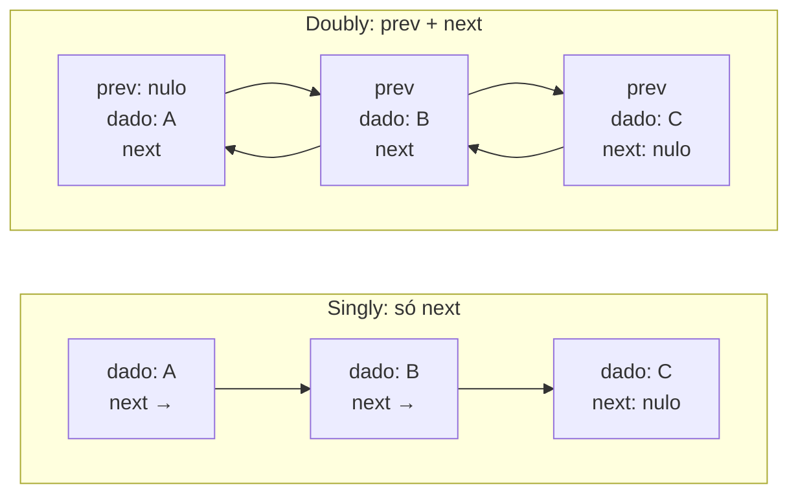
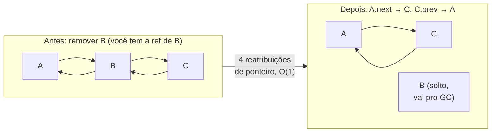
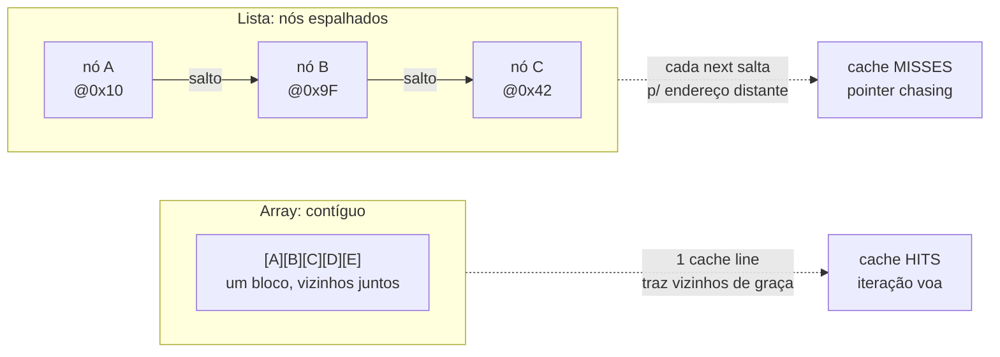
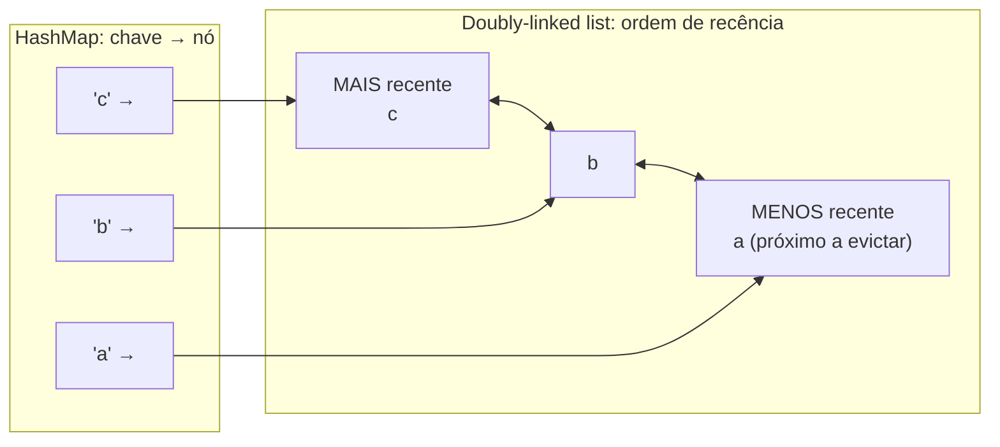

# Listas encadeadas

Se o [[02 - Arrays e listas dinâmicas|array]] é o bloco contíguo onde tudo mora junto, a lista encadeada é o oposto exato: nós soltos, cada um num canto da memória, amarrados uns aos outros por ponteiros.

É a estrutura que todo curso de algoritmos ensina logo depois do array — e é, ao mesmo tempo, a estrutura que você quase nunca usa de propósito em código de produção. Esse paradoxo é o coração desta nota. A lista encadeada é teoricamente elegante (inserção e remoção O(1)!) e praticamente derrotada (a cache odeia ela). Entender *por que* as duas coisas são verdadeiras ao mesmo tempo é o que separa decorar Big-O de entender desempenho real.

Vamos descer ao nó: o que é um ponteiro de verdade, por que a inserção barata exige uma referência que você raramente tem, por que percorrer uma lista é lento mesmo sendo O(n), e como Java, TypeScript, Python e Go lidam com — ou escondem — essa estrutura.

> [!abstract] TL;DR
> Uma **lista encadeada** é uma sequência de **nós** espalhados pela memória, cada um com o dado e um (ou dois) **ponteiros** para os vizinhos. **Singly** = só `next`; **doubly** = `next` + `prev`; **circular** = o último aponta de volta pro primeiro. O trade-off contra o array é nítido: inserir/remover é **O(1) — mas só se você já tem a referência ao nó**; acesso por índice e busca por valor são **O(n)** (não há aritmética de endereço, você anda nó a nó). E a sentença prática: na imensa maioria dos casos, o **array vence mesmo nos cenários "favoráveis" à lista**, porque seguir ponteiros (*pointer chasing*) gera **cache misses** enquanto o array vizinho voa em cache hits. A lista só ganha quando você insere/remove com frequência **tendo o nó na mão** (ex.: o nó do meio de um [[12 - Estruturas especializadas|LRU cache]]). Nos quatro idiomas: Java tem `LinkedList` (doubly, implementa `List` **e** `Deque`) que você quase sempre troca por `ArrayList`/`ArrayDeque`; JS **não tem** lista encadeada nativa (você constrói com objetos); Python esconde uma **doubly-linked list de blocos** dentro de `collections.deque`; Go tem `container/list` (doubly, ring-based, elementos `any` → boxing). Síntese senior: a lista encadeada clássica é hoje sobretudo uma estrutura de **ensino e LeetCode** — as stdlibs a escondem dentro de deques e preferem layouts de bloco amigáveis à cache.

## O que é: nó, ponteiro e os três sabores

Comece pela peça atômica. Uma lista encadeada não tem um bloco; ela tem **nós**.

Um **nó** é um pequeno objeto com duas responsabilidades: guardar o **dado** e guardar uma **referência** (ponteiro) para o próximo nó. Um ponteiro, aqui, é literalmente um endereço de memória — "o próximo nó está lá em `0x7f3a...`".

A lista em si guarda só uma referência ao **primeiro** nó (o `head`). A partir dele, você segue a cadeia de `next` em `next` até bater num ponteiro nulo (`null`/`nil`/`None`), que marca o fim.

Daí o nome: os nós estão **encadeados**. Nenhum sabe seu índice; nenhum está perto do outro na memória; o único jeito de chegar no quinto nó é partir do primeiro e dar quatro saltos.

Existem três variações, conforme quantos e quais ponteiros cada nó carrega.

### Singly linked (simplesmente encadeada)

Cada nó aponta **só para o próximo**. É a forma mais enxuta: um ponteiro por nó. Você percorre numa direção só — do `head` para o fim, nunca de volta.

### Doubly linked (duplamente encadeada)

Cada nó aponta para o **próximo e o anterior** (`next` + `prev`). Você percorre nas duas direções e — crucialmente — pode **remover um nó em O(1) tendo só ele na mão**, porque consegue alcançar o vizinho de trás para religá-lo. É o sabor que as stdlibs usam: `java.util.LinkedList`, `collections.deque`, `container/list` são todas doubly.

### Circular (circular)

O último nó, em vez de apontar para nulo, aponta **de volta** para o primeiro — a lista vira um anel. Útil para buffers circulares, round-robin de tarefas, e é exatamente o truque que Go usa internamente em `container/list`. Pode ser circular singly ou circular doubly.

O diagrama abaixo contrasta o nó singly com o doubly.



Leitura do diagrama: na lista *singly* (em cima), as setas só vão para a frente — chegou num nó, você não tem como voltar; o último carrega `next` nulo como marca de fim. Na *doubly* (embaixo), cada nó tem setas nos dois sentidos, então de qualquer nó você alcança tanto o vizinho da frente quanto o de trás. Esse ponteiro extra `prev` é o que paga a remoção O(1) — e custa memória.

> [!info] O nó é um objeto à parte — esse é o ponto
> Diferente do array, onde o elemento `i` é só uma fatia do bloco contíguo, aqui **cada nó é uma alocação separada no heap**. O array guarda `[A][B][C]` grudados; a lista guarda três objetos-nó possivelmente a quilômetros um do outro na memória, cada um com o overhead de um objeto inteiro mais o(s) ponteiro(s). Guarde essa imagem: ela explica tanto o custo de memória quanto o desastre de cache que vem adiante.

## Operações e complexidade: o trade-off contra o array

Aqui está a tabela que toda entrevista cobra, e logo abaixo o *porquê* de cada linha — que é o que importa.

| Operação | Array / `ArrayList` | Lista encadeada |
| --- | --- | --- |
| Acesso por índice (`get(i)`) | **O(1)** (aritmética) | **O(n)** (anda nó a nó) |
| Busca por valor | O(n) | O(n) |
| Inserir/remover no **início** | O(n) (desloca tudo) | **O(1)** |
| Inserir/remover no **fim** | O(1) amortizado | **O(1)** (com ref ao `tail`) |
| Inserir/remover no **meio, com referência ao nó** | O(n) (desloca) | **O(1)** |
| Inserir/remover no **meio, por índice** | O(n) (desloca) | O(n) (acha) **+** O(1) |
| Memória por elemento | baixa (só o valor) | alta (valor + 1–2 ponteiros + header de objeto) |

Duas linhas são o coração da história, e elas se contradizem de propósito.

**Acesso por índice é O(n).** O array calcula `base + i · tamanho` e salta direto — é o que [[02 - Arrays e listas dinâmicas#Acesso por índice é O(1)|vimos na nota de arrays]]. A lista **não pode** fazer isso: os nós não estão contíguos, não há "base + offset". Para chegar em `lista.get(5)`, ela parte do `head` e segue `next` cinco vezes. É uma caminhada linear. Esse é o calcanhar de Aquiles da estrutura.

**Inserir/remover é O(1) — com um asterisco gigante.** Se você **já tem a referência ao nó** onde quer mexer, inserir ou remover é só religar alguns ponteiros: trabalho constante, não importa o tamanho da lista. Nenhum deslocamento, ao contrário do array, que precisa empurrar todos os vizinhos.

O asterisco é o seguinte: **"ter a referência ao nó" é raro**. Se o pedido vem como "remova o elemento no índice 5" ou "remova o elemento de valor X", você primeiro paga O(n) para *achar* o nó — e aí o ganho evaporou. A inserção O(1) só é real quando você já está com o nó na mão: durante uma iteração com cursor (um `ListIterator`), ou quando outra estrutura te entrega o nó (o caso do LRU, adiante).

O diagrama mostra a religação que torna a remoção O(1) numa doubly linked.



Leitura do diagrama: para remover `B`, basta fazer `A.next` apontar para `C` e `C.prev` apontar para `A` — quatro reatribuições de ponteiro, custo constante, sem tocar em mais nenhum nó. `B` fica órfão e o garbage collector o recolhe. Compare com o array: remover o elemento do meio obrigaria a **deslocar** todos os vizinhos da direita para tampar o buraco, O(n). A lista vence essa operação específica — *se* você tinha `B` na mão.

> [!summary] O trade-off em uma frase
> A lista encadeada troca **acesso barato** (O(1) no array) por **mutação estrutural barata** (O(1) na ponta certa). Você só lucra se o seu padrão de uso for dominado por inserção/remoção **com a referência ao nó** e quase nunca por acesso aleatório. Na prática, esse padrão é raro — e é por isso que a próxima seção é a mais importante da nota.

## A realidade da cache: por que o array quase sempre ganha

Aqui está a parte que o Big-O não conta e que decide o desempenho real — a mesma lição que abrimos em [[02 - Arrays e listas dinâmicas#Localidade de cache: a vantagem invisível|arrays]], agora vista do lado perdedor.

Lembre como a CPU lê memória: não byte a byte, mas em **cache lines** de ~64 bytes, que ela guarda numa memória ultrarrápida (L1/L2). Quando você lê um endereço, a vizinhança inteira vem junto, de graça.

No **array**, isso é um presente: os elementos estão grudados, então ler `arr[0]` já traz `arr[1]`, `arr[2]`... para o cache. Iterar voa — quase tudo é *cache hit*.

Na **lista encadeada**, isso é uma maldição. Os nós estão **espalhados** pelo heap (cada um foi alocado em momentos diferentes, em lugares diferentes). Ler o nó A não traz o nó B para o cache, porque B está longe. Cada salto de `next` é um pulo para um endereço imprevisível — e provavelmente um **cache miss**, uma ida cara à RAM principal (dezenas a centenas de vezes mais lenta que o L1).

Esse fenômeno tem nome: **pointer chasing** (perseguição de ponteiros). Você fica correndo atrás de endereços, e o processador não consegue prever onde o próximo nó está, então o *prefetcher* dele fica inútil.

O diagrama contrasta os dois padrões de memória.



Leitura do diagrama: o array é um bloco — ler uma célula traz as vizinhas no mesmo cache line, e a iteração é uma sequência de acertos de cache. A lista é uma caça ao tesouro: cada nó vive num endereço imprevisível, e seguir `next` é um salto que o cache não anteviu, gerando um miss atrás do outro. Mesma complexidade O(n) na iteração; custo real em ordens de magnitude diferente.

> [!tip] O resultado prático que surpreende juniores
> Percorrer 10.000 inteiros num `ArrayList` pode ser **ordens de magnitude** mais rápido que num `LinkedList`, apesar de ambos serem O(n). O Big-O conta o **número** de operações; a localidade de cache decide **quanto cada operação custa**. Por isso a regra de bolso de backend: comece sempre com o array dinâmico. A lista encadeada só entra em cena quando o profiling prova que o gargalo é deslocamento de array (`System.arraycopy`) E você tem a referência direta aos nós que mexe.

> [!warning] lastro de honestidade
> "Ordens de magnitude" é a faixa típica reportada em microbenchmarks de iteração/travessia com elementos pequenos; o multiplicador exato depende de tamanho do elemento, padrão de acesso, hardware e quão fragmentado o heap está. O ponto qualitativo — pointer chasing custa cache misses, contiguidade não — é robusto e independente de hardware; o **número** específico não é uma constante universal. Não cravo um "X vezes mais rápido" porque seria fabricar precisão.

E há o segundo custo, mais direto: **memória e pressão de GC**. Cada nó é um objeto separado, com header de objeto + o(s) ponteiro(s) + o dado (ou um ponteiro para ele). Onde o array guarda só os valores grudados, a lista paga overhead por elemento *e* gera N alocações independentes — mais trabalho para o alocador e mais objetos para o garbage collector rastrear. Voltamos a esses números na seção de Java.

## Implementações comparadas: Java · TypeScript · Python · Go

O conceito é o mesmo nos quatro. O que muda — e muito — é se a linguagem te entrega uma lista encadeada pronta, se ela a esconde dentro de outra estrutura, ou se você precisa construí-la na mão. A pergunta que perseguimos: *onde a lista encadeada de verdade vive em cada stdlib?*

### Java: `LinkedList` existe, e você quase sempre não a quer

Java é o único dos quatro com uma lista encadeada de propósito geral na biblioteca padrão: **`java.util.LinkedList`**. Ela é **doubly-linked** e, curiosamente, implementa **duas** interfaces ao mesmo tempo — `List` (acesso por índice, como `ArrayList`) **e** `Deque` (inserção/remoção nas duas pontas, como `ArrayDeque`).

```java
LinkedList<String> lista = new LinkedList<>();
lista.addFirst("A");      // O(1) — insere na cabeça
lista.addLast("B");       // O(1) — insere na cauda (tem ref ao tail)
lista.removeFirst();      // O(1)
lista.get(5);             // O(n) — percorre do head, nó a nó
lista.peek();             // como Deque: espia a cabeça
```

Por dentro, cada elemento é um nó privado:

```java
private static class Node<E> {
    E item;
    Node<E> next;
    Node<E> prev;
    Node(Node<E> prev, E element, Node<E> next) { /* ... */ }
}
```

São **três referências por nó** (`item`, `next`, `prev`) mais o header do objeto. Numa JVM de 64 bits com *compressed oops*, isso dá da ordem de **~24 bytes só para o objeto-nó** (header de 16 bytes + 3 referências de ~4 bytes ≈ 28, arredondado para alinhamento) — e isso **antes** do próprio dado. Se o dado for um `Integer` (não há `LinkedList` de primitivos — sempre boxing), some o objeto `Integer` à parte, chegando a **~40 bytes por elemento** contra os ~4–8 bytes/elemento de um `ArrayList`. Cada nó é uma alocação separada: máxima pressão de GC e máximo espalhamento na memória.

> [!warning] Por que `ArrayList` / `ArrayDeque` quase sempre vencem
> A documentação e o consenso da comunidade Java são raros em serem tão categóricos: **prefira `ArrayList` a `LinkedList` quase sempre**, e **`ArrayDeque` a `LinkedList`** quando você quer uma fila ou pilha. Razões: (1) localidade de cache — a travessia de `ArrayList` é muito mais rápida; (2) memória — `LinkedList` paga ~5× o overhead por elemento; (3) o `get(i)` de `LinkedList` é O(n), uma armadilha de desempenho fácil de cair. O `LinkedList` só justifica quando você insere/remove no meio **via iterador** com muita frequência — e mesmo aí o ganho costuma ser comido pela cache.

O único lugar onde `LinkedList` entrega seu O(1) prometido é via **`ListIterator`**: um cursor que percorre a lista e, *na posição atual*, insere ou remove em O(1) sem reposicionar — porque o iterador **tem a referência ao nó corrente**. É a materialização do asterisco da seção anterior.

```java
ListIterator<String> it = lista.listIterator();
while (it.hasNext()) {
    String s = it.next();
    if (s.startsWith("rm")) it.remove();   // O(1): o cursor tem o nó na mão
    if (s.equals("x")) it.add("novo");     // O(1): insere na posição do cursor
}
```

Como os iteradores de `java.util`, ele é **fail-fast**: se a lista for modificada estruturalmente por fora do iterador durante a iteração, ele lança `ConcurrentModificationException` (o mesmo mecanismo de `modCount` [[02 - Arrays e listas dinâmicas#Iteradores fail-fast e `ConcurrentModificationException`|visto em arrays]]).

### TypeScript / JavaScript: não existe — você constrói

JS **não tem** lista encadeada na linguagem nem na stdlib. O `Array` cobre o papel de lista dinâmica (com toda a [[02 - Arrays e listas dinâmicas#TypeScript / JavaScript: o array que finge ser array|maquinaria de elements kinds da V8]]), e quando você quer uma lista encadeada, **constrói com objetos e referências** — um nó é só um objeto `{ valor, next }`, e o `next` é uma referência a outro objeto.

```typescript
class No<T> {
  constructor(
    public valor: T,
    public next: No<T> | null = null,
    public prev: No<T> | null = null,
  ) {}
}

class ListaDuplamente<T> {
  private head: No<T> | null = null;
  private tail: No<T> | null = null;
  private _tamanho = 0;

  pushFront(valor: T): No<T> {
    const no = new No(valor, this.head, null);
    if (this.head) this.head.prev = no;
    this.head = no;
    this.tail ??= no;
    this._tamanho++;
    return no;            // devolve a ref → habilita remove O(1)
  }

  remove(no: No<T>): void {     // O(1): você passou o nó
    if (no.prev) no.prev.next = no.next; else this.head = no.next;
    if (no.next) no.next.prev = no.prev; else this.tail = no.prev;
    this._tamanho--;
  }

  get tamanho(): number { return this._tamanho; }
}
```

A implicação de **GC** é o ponto sensível: cada nó é um objeto separado na heap da V8, com o overhead de objeto (cabeçalho, *hidden class*) e espalhado pela memória. O coletor geracional da V8 rastreia cada um; uma lista grande é muito mais cara em alocação e coleta do que um único `Array` denso, que é um bloco que o GC vê como um objeto só. Some o pointer chasing entre objetos distantes e você tem o pior dos mundos para iteração.

> [!note] Quando você de fato usaria uma lista encadeada em JS
> Raramente. O `Array` ganha em quase tudo: `push`/`pop` O(1) amortizado, acesso O(1), e contiguidade. Você só constrói uma lista encadeada quando precisa de **remoção O(1) de um nó interior cuja referência você já guarda** — o caso clássico é um **LRU cache** (próxima seção), onde o `Map` te entrega o nó direto. Fora desse padrão, alcançar uma lista encadeada em JS costuma ser premature optimization que sai pela culatra na cache.

### Python: a lista encadeada mora dentro do `deque` (e é de blocos)

Python também **não tem** uma lista encadeada clássica de propósito geral exposta. A `list` é um [[02 - Arrays e listas dinâmicas#Python: `list` é um array de ponteiros, sempre|array de ponteiros]]. Mas a stdlib esconde uma lista encadeada de implementação muito mais inteligente que a ingênua: **`collections.deque`**.

Um `deque` (double-ended queue) dá O(1) garantido nas **duas pontas** — `append`/`appendleft`/`pop`/`popleft` — exatamente o que a `list` não dá no início (`list.pop(0)` é O(n)). E por dentro ele **é** uma doubly-linked list — mas com um twist que conserta o problema da cache.

> [!info] O `deque` é uma lista encadeada **de blocos**, não de elementos
> Em vez de um nó por elemento, o `deque` do CPython é uma **doubly-linked list de blocos**, e cada bloco é um **array de tamanho fixo de 64 ponteiros** para objetos. Os blocos estão encadeados (cada um com `leftlink`/`rightlink`); dentro de cada bloco, os elementos são contíguos. É um **híbrido** deliberado: o encadeamento entre blocos dá O(1) nas pontas sem realocar o array inteiro (ao contrário da `list`), enquanto o array dentro de cada bloco recupera **localidade de cache** dentro do bloco e dilui o overhead de ponteiros (um par de links a cada 64 elementos, não a cada 1). Bônus: como os blocos nunca são realocados, o desempenho é mais previsível — `deque` evita o `realloc()` que a `list` faz ao crescer.

```python
from collections import deque

fila = deque()
fila.append(1)        # O(1) no fim
fila.appendleft(0)    # O(1) no início  ← a list não consegue isso barato
fila.pop()            # O(1) no fim
fila.popleft()        # O(1) no início
fila[len(fila)//2]    # O(n)! acesso ao MEIO percorre os blocos
```

O preço do design de blocos: o `deque` **não** dá O(1) no meio arbitrário. Indexar uma posição central percorre a lista de blocos — é O(n). O `deque` é otimizado para as pontas, não para acesso aleatório nem inserção no meio. Para o miolo, a `list` (acesso O(1)) ainda vence; para as pontas, o `deque` vence com folga. (Detalhe de fila/pilha vive em [[04 - Pilhas, filas e deques]].)

Se você quer uma lista encadeada *clássica* em Python, constrói na mão com uma classe `Node`:

```python
class No:
    __slots__ = ("valor", "prox", "ant")   # __slots__ corta o overhead de __dict__
    def __init__(self, valor, prox=None, ant=None):
        self.valor, self.prox, self.ant = valor, prox, ant
```

…mas isso é raro em Python idiomático. O custo "tudo-é-objeto" torna cada nó ainda mais pesado, e o que você quase sempre quer — fila/pilha eficiente — já está pronto e otimizado no `deque`.

### Go: `container/list`, doubly e ring-based, com custo de boxing

Go traz **`container/list`** na stdlib: uma **doubly-linked list** de propósito geral. O detalhe de implementação elegante é que, internamente, ela é um **ring (anel)**: existe um nó-sentinela `root`, e `&l.root` serve ao mesmo tempo de `next` do último elemento e `prev` do primeiro. Isso elimina os casos especiais de "lista vazia" e "inserir na ponta" — não há ponteiros nulos para tratar, a lista vazia é só o sentinela apontando para si mesmo.

```go
import "container/list"

l := list.New()
e4 := l.PushBack(4)     // devolve *list.Element
e1 := l.PushFront(1)    // O(1)
l.InsertBefore(3, e4)   // O(1): você tem o *Element e4 na mão
l.Remove(e1)            // O(1): passou o *Element
for e := l.Front(); e != nil; e = e.Next() {
    _ = e.Value          // Value é do tipo any
}
```

O custo que aparece em entrevista de Go: o campo `Value` de cada `Element` é do tipo **`any`** (alias de `interface{}`). Guardar um `int` ali faz **boxing** — o valor é embrulhado na interface, o que pode alocar e perde a tipagem estática (você lê de volta com type assertion). É um resquício pré-genéricos (Go 1.18): `container/list` nunca foi atualizada para usar type parameters, então continua `any`-based. Por isso, e pelo pointer chasing usual, ela é pouco usada no Go idiomático — *slices* cobrem a maioria dos casos.

Quando você quer uma lista encadeada **tipada** e sem boxing, constrói com structs e ponteiros:

```go
type No[T any] struct {
    valor T
    next  *No[T]
    prev  *No[T]
}

type Lista[T any] struct {
    head, tail *No[T]
    tamanho    int
}

func (l *Lista[T]) PushBack(v T) *No[T] {
    no := &No[T]{valor: v, prev: l.tail}
    if l.tail != nil { l.tail.next = no } else { l.head = no }
    l.tail = no
    l.tamanho++
    return no                 // devolve o *No → remove O(1)
}
```

Note a escolha **valor vs ponteiro** do nó: aqui os nós são `*No[T]` (ponteiros), porque a lista precisa religar referências compartilhadas — um nó por valor seria copiado a cada passagem. E o `nil` é o terminador natural: `tail.next == nil` marca o fim, `head.prev == nil` marca o começo (na versão sem sentinela). Generics (1.18+) deixam construir a versão tipada sem o boxing do `container/list`.

### A síntese senior: a lista clássica é estrutura de ensino

Recapitule, porque é exatamente o tipo de comparação que impressiona.

A lista encadeada *pura* — um nó por elemento, ponteiros soltos — é hoje, na prática, sobretudo uma estrutura de **ensino** (ela ilustra ponteiros e recursão lindamente) e de **LeetCode** (reverter lista, detectar ciclo com lebre-e-tartaruga, mesclar listas ordenadas). Em código de produção, ela quase nunca é a escolha consciente.

As stdlibs maduras **escondem** o encadeamento dentro de estruturas mais úteis e o reprojetam para a cache: Python coloca a doubly-linked list dentro do `deque` e a faz de **blocos**; Java mantém `LinkedList` mas empurra você para `ArrayDeque`; Go oferece `container/list` mas o Go idiomático usa *slices*. O fio comum é a fuga do pointer chasing — sempre que possível, troca-se "ponteiros espalhados" por "blocos contíguos".

> [!quote] A resposta de uma frase
> *"The classic linked list is mostly a teaching and interview structure. In real code, standard libraries hide it: Python's `deque` is a doubly-linked list of fixed-size blocks for cache locality; Java has `LinkedList` but everyone reaches for `ArrayDeque`; Go has `container/list` but idiomatic Go uses slices. A pure linked list only wins when you insert and remove with a direct node reference and rarely access by index — pointer chasing kills it everywhere else."*

## Usos reais: onde a lista encadeada de fato ganha

Apesar de tudo, há lugares onde o encadeamento é a peça certa — sempre os mesmos: quando outra estrutura te **entrega a referência ao nó**, ou quando você só mexe nas **pontas**.

- **Backing de deque/fila/pilha.** Quando você só insere e remove nas extremidades, o O(n) de acesso ao meio nunca dói, e o O(1) nas pontas brilha. É por isso que `deque` (Python), `LinkedList` como `Deque` (Java) e listas em geral sustentam filas e pilhas. O detalhe canônico dessas estruturas FIFO/LIFO vive em [[04 - Pilhas, filas e deques]].
- **Listas de adjacência em grafos.** Cada vértice guarda uma lista dos seus vizinhos; você itera a lista de vizinhos sem precisar de acesso aleatório. (Na prática moderna, costuma-se usar um array/slice por vértice, justamente pela cache — mas o conceito é a lista de adjacência. Gesture para a futura nota de grafos.)
- **LRU cache** — o caso onde o encadeamento *é* indispensável, abaixo.

### LRU cache: `HashMap` + doubly-linked list

O LRU (*Least Recently Used*) é o exemplo perfeito porque combina as duas estruturas justamente para anular as fraquezas de cada uma. O detalhe completo é território de [[12 - Estruturas especializadas]]; aqui o esqueleto que mostra *por que* a lista encadeada é necessária.

A ideia: um cache de tamanho fixo que, ao encher, descarta o item **menos recentemente usado**. Você precisa de duas coisas ao mesmo tempo — **lookup O(1)** por chave (achar o valor) e **mover/remover O(1)** o item para o topo de recência. Nenhuma estrutura sozinha dá as duas.

A combinação:

- Um **`HashMap`** mapeia `chave → nó`. Dá o lookup O(1) e, crucialmente, **entrega a referência ao nó** da lista.
- Uma **doubly-linked list** mantém a **ordem de recência**: o mais recente na frente, o menos recente atrás. Como o map te deu o nó, mover esse nó para a frente (em um *hit*) e remover o último nó (ao evictar) são **O(1)** — exatamente o caso onde a lista encadeada vence.



Leitura do diagrama: o `HashMap` (esquerda) aponta cada chave direto para seu nó na lista, dando lookup e *referência ao nó* em O(1). A lista (direita) guarda a ordem de uso: o mais recente na cabeça, o menos recente na cauda. Num *hit*, o map acha o nó e a lista o reposiciona para a cabeça em O(1); ao encher, evicta-se a cauda (o menos usado) em O(1). É o casamento que faz cada estrutura cobrir o ponto cego da outra — e o único lugar onde "remoção O(1) com referência ao nó" acontece naturalmente.

> [!tip] O atalho idiomático em Java
> Em Java você raramente monta esse esqueleto na mão: o `LinkedHashMap` com `accessOrder = true` **já é** internamente um HashMap + lista encadeada, e sobrescrevendo `removeEldestEntry` você tem um LRU em poucas linhas. A engenharia de baixo nível (map + DLL) é o que ele faz por baixo — e o que entrevistas pedem que você saiba reconstruir. Detalhe em [[12 - Estruturas especializadas]].

## Em entrevista

A pergunta clássica é direta: **"`ArrayList` ou `LinkedList`?"** — e a resposta certa quase nunca é "`LinkedList`". O entrevistador está checando se você decora a tabela de Big-O ou se entende cache.

> "By default I reach for an array-backed list — `ArrayList` in Java — even for cases that look list-favorable on paper. The reason is cache locality: linked-list nodes are scattered across the heap, so traversing them is pointer chasing, a cache miss on almost every hop, while an array is contiguous and the CPU prefetches the neighbors for free. Both are O(n) to traverse, but the constant factor differs by orders of magnitude.
>
> A linked list only pays off when I insert or remove frequently **with a direct reference to the node** — not by index, because finding the node is O(n) and eats the benefit. The textbook case is an LRU cache: a hash map gives me O(1) lookup *and* the node reference, and a doubly-linked list gives me O(1) reposition and eviction. That's the one place the O(1) insert is real.
>
> What's neat is that real standard libraries hide the linked list and fix its cache problem. Python's `collections.deque` is a doubly-linked list **of fixed-size blocks** — 64-pointer arrays chained together — so you get O(1) ends without losing locality inside a block. Java keeps `LinkedList` but the idiomatic deque is `ArrayDeque`. Go's `container/list` is a ring-based doubly-linked list, but idiomatic Go uses slices."

Frases úteis para cravar trade-offs:

- "It's O(1) to insert — *but only if I already hold the node reference*; otherwise finding it is O(n)."
- "Both are O(n) to traverse, but the linked list loses on the constant factor because of cache misses."
- "I'd use a linked list here only because the hash map hands me the node directly."
- "`deque` is a doubly-linked list of blocks — O(1) at both ends, but O(n) in the arbitrary middle."

Vocabulário-chave:

- lista encadeada → linked list
- nó → node
- ponteiro / referência → pointer / reference
- simplesmente / duplamente encadeada → singly / doubly linked
- lista circular → circular linked list
- cabeça / cauda → head / tail
- perseguição de ponteiros → pointer chasing
- falha de cache → cache miss
- sentinela → sentinel (node)
- terminador nulo → null terminator

## Referências

- [CPython `_collectionsmodule.c`](https://github.com/python/cpython/blob/main/Modules/_collectionsmodule.c) — implementação do `deque`: doubly-linked list de blocos de **64 ponteiros**; comentários explicam por que o tamanho de bloco é potência de 2 e que evita `realloc()`.
- [Python deque implementation — Laurent Luce](https://www.laurentluce.com/posts/python-deque-implementation/) — walkthrough da estrutura de blocos do `deque`.
- [Go `container/list` (list.go)](https://github.com/golang/go/blob/master/src/container/list/list.go) — doubly-linked list implementada como **ring** com sentinela `root`; `Element.Value` é `any` (boxing).
- [`container/list` — pkg.go.dev](https://pkg.go.dev/container/list) — documentação oficial; "internally a list is implemented as a ring".
- [`java.util.LinkedList` — Java SE docs](https://docs.oracle.com/en/java/javase/21/docs/api/java.base/java/util/LinkedList.html) — doubly-linked, implementa `List` **e** `Deque`; iteradores fail-fast.
- [Java LinkedList — happycoders.eu](https://www.happycoders.eu/algorithms/linkedlist-java/) — overhead de nó (~24 B do objeto-nó, ~40 B/elemento com boxing) e por que `ArrayDeque` é preferível.

## Veja também

- [[02 - Arrays e listas dinâmicas]] — o lado oposto: bloco contíguo, acesso O(1), cache-friendly
- [[04 - Pilhas, filas e deques]] — FIFO/LIFO que a lista encadeada sustenta como backing
- [[12 - Estruturas especializadas]] — LRU cache (HashMap + DLL), skip list e outras
- [[Dicionário de Ciência da Computação]] — vocabulário comum das estruturas
