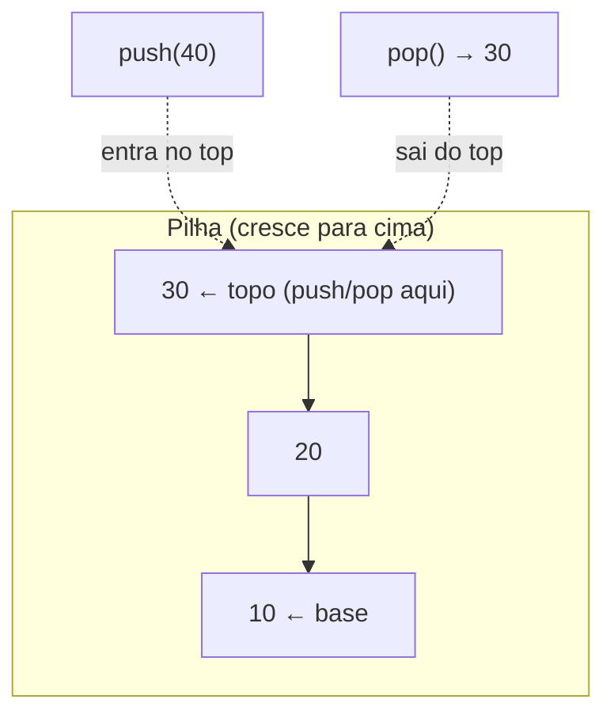
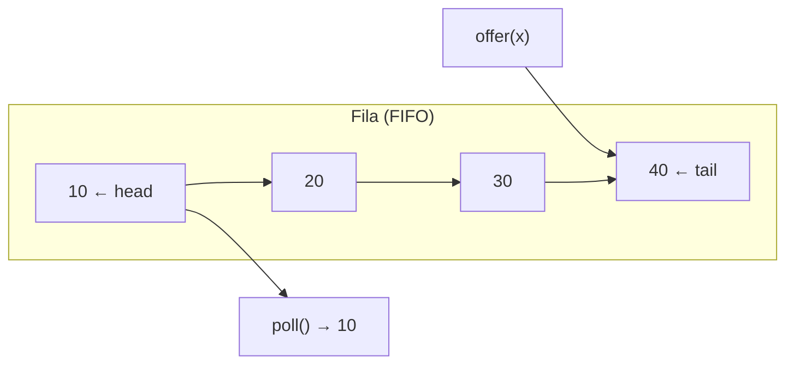
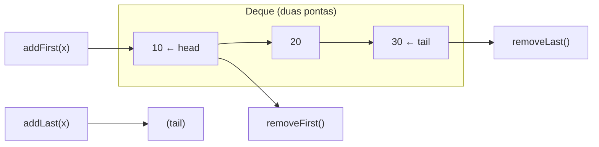
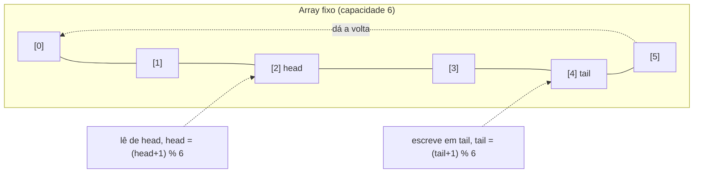
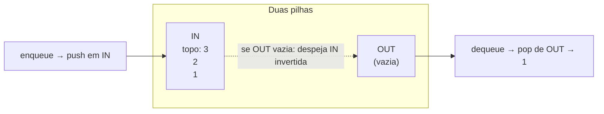

# Pilhas, filas e deques

Três estruturas que parecem triviais — e o ADT realmente é. Mas todas vivem sobre um mesmo array ou lista encadeada que você já conhece; o que muda é **a disciplina de acesso**: por onde você pode entrar e por onde pode sair. Pilha só mexe num lado. Fila entra por um e sai pelo outro. Deque libera os dois lados.

A parte trivial é a definição. A parte que separa júnior de sênior aparece quando a fila precisa ser **limitada**, **concorrente** e com **backpressure** — e é exatamente aí que as linguagens divergem mais.

> [!summary] Em uma linha
> Pilha = LIFO (entra/sai no mesmo lado); fila = FIFO (entra atrás, sai na frente); deque = ambos os lados — e a engenharia de verdade está nas filas *limitadas e concorrentes*.

---

## TL;DR

- **Pilha (LIFO):** `push` / `pop` / `peek`, todos O(1). Call stack, parsing, undo/redo, DFS iterativo, backtracking.
- **Fila (FIFO):** `offer` / `poll` / `peek`, todos O(1). BFS, message queues, scheduling, producer-consumer.
- **Deque:** insere e remove nas duas pontas — generaliza pilha + fila.
- **Ring buffer:** fila limitada sobre array fixo com índices `head`/`tail` que dão a volta (wrap-around). Logging, streaming, áudio.
- **Java:** prefira `ArrayDeque` como pilha **e** fila. `java.util.Stack` é legacy (estende `Vector`, sincronizado). Para concorrência: `ConcurrentLinkedQueue` (lock-free) e `ArrayBlockingQueue` / `LinkedBlockingQueue` (bloqueantes).
- **A divergência entre linguagens** não está no ADT — está em **limitada vs ilimitada**, **bloqueante vs não-bloqueante** e **concorrente**.
- Fila de prioridade fica em [[07 - Heaps e filas de prioridade]]; o nó encadeado por trás está em [[03 - Listas encadeadas]].

---

## Stack (Pilha) — LIFO

**L**ast **I**n, **F**irst **O**ut: a última coisa que entrou é a primeira a sair. Pense numa pilha de pratos — você sempre tira o de cima.

Três operações, todas O(1):

- `push(x)` — empilha no topo.
- `pop()` — desempilha e retorna o topo.
- `peek()` — olha o topo sem remover.



**Leitura do diagrama:** toda a ação acontece num único lado — o topo. Você nunca alcança o `10` da base sem antes remover o `20` e o `30`. Esse "único ponto de contato" é o que torna a pilha tão barata: não há deslocamento de elementos.

**Onde a pilha aparece:**

- **Call stack** — cada chamada de função empilha um frame; o `return` desempilha. Recursão profunda demais estoura essa pilha (`StackOverflowError`).
- **Parsing / parênteses balanceados** — empilha cada `(` e desempilha no `)`; se sobrar ou faltar, está desbalanceado.
- **Undo/redo** — uma pilha de "desfazer", outra de "refazer".
- **DFS iterativo** — a pilha explícita substitui a recursão, evitando o estouro.
- **Backtracking** — empilha decisões; ao bater num beco, desempilha e tenta outra.

---

## Queue (Fila) — FIFO

**F**irst **I**n, **F**irst **O**ut: quem chegou primeiro é atendido primeiro. É a fila do banco — entra-se atrás, é-se atendido na frente.

Operações O(1):

- `offer(x)` — enfileira na cauda (tail).
- `poll()` — desenfileira da cabeça (head).
- `peek()` — olha a cabeça sem remover.



**Leitura do diagrama:** dois pontos de contato em pontas opostas. Entra-se sempre pela cauda (`tail`), sai-se sempre pela cabeça (`head`). O `10`, que entrou primeiro, sai primeiro — daí o "FIFO".

> [!warning] O detalhe que arruína filas ingênuas
> Implementar fila com um array "normal" removendo o índice 0 a cada `poll` é O(n): todo elemento desliza uma posição. Pilha sofre menos porque mexe só no fim. A solução de produção é não deslocar nada — usar **índices `head`/`tail`** (ring buffer) ou uma **lista encadeada**. Esse é o cerne da armadilha de fila em JS, que vem mais abaixo.

**Onde a fila aparece:**

- **BFS** — explora um grafo em camadas; a fila guarda a fronteira a visitar.
- **Message queues** — Kafka, RabbitMQ, SQS desacoplam produtor de consumidor.
- **Task scheduling** — tarefas pendentes aguardam um worker.
- **Buffers producer-consumer** — alguém produz rápido, alguém consome no seu ritmo.

---

## Deque (Double-Ended Queue)

Pronuncia-se "deck". Insere e remove nas **duas pontas** — por isso generaliza pilha e fila: use só uma ponta e tem uma pilha; use as duas opostas e tem uma fila.



**Leitura do diagrama:** quatro operações, duas por ponta — `addFirst`/`removeFirst` na cabeça, `addLast`/`removeLast` na cauda. Restrinja-se a uma combinação e o deque "vira" outra estrutura. É por isso que `ArrayDeque` serve de pilha *e* de fila no Java: ambas são casos particulares do deque.

Casos onde o deque é o protagonista, não um substituto:

- **Sliding window maximum** — um *monotonic deque* mantém candidatos a máximo (vem na seção de entrevista).
- **Work stealing** — pools de threads onde cada worker tem seu próprio deque e "rouba" tarefas da ponta oposta dos outros (`ForkJoinPool`).
- **Undo bidirecional / histórico de navegação** — voltar e avançar.

---

## Ring buffer (buffer circular)

Uma fila **limitada** construída sobre um array de tamanho fixo. Em vez de deslocar elementos, dois índices circulam: `head` (de onde se lê) e `tail` (onde se escreve). Quando um índice chega ao fim do array, ele **dá a volta** para o início — daí "circular".



**Leitura do diagrama:** os dados "vivos" estão entre `head` e `tail`. Escrever avança `tail`; ler avança `head`. A fórmula `(índice + 1) % capacidade` é o truque do wrap-around: ao passar de `[5]`, o `% 6` traz de volta para `[0]`. Nada se move; só os índices andam.

Por ser **limitado**, o ring buffer tem uma propriedade preciosa: **memória constante e previsível**. Ele nunca cresce. Quando enche, há duas políticas — bloquear o produtor (backpressure) ou sobrescrever o dado mais antigo (descartar o passado).

**Onde aparece:** logging de alta vazão, streaming, processamento de áudio/vídeo, e por baixo do `ArrayDeque` e do `ArrayBlockingQueue` do Java.

---

## Implementações comparadas: Java · TypeScript · Python · Go

O ADT é igual nas quatro. O que muda — e muda *muito* — é o que cada ecossistema oferece para o caso difícil: filas **limitadas**, **bloqueantes** e **concorrentes**.

### Java

A regra de ouro: **`ArrayDeque` é a escolha padrão tanto para pilha quanto para fila.**

```java
// Pilha com ArrayDeque (preferir sobre Stack)
Deque<Integer> pilha = new ArrayDeque<>();
pilha.push(1);
pilha.push(2);
pilha.peek();   // 2
pilha.pop();    // 2

// Fila com ArrayDeque
Queue<Integer> fila = new ArrayDeque<>();
fila.offer(1);
fila.offer(2);
fila.peek();    // 1
fila.poll();    // 1

// Deque pleno
Deque<Integer> deque = new ArrayDeque<>();
deque.addFirst(0);
deque.addLast(3);
deque.removeFirst();
deque.removeLast();
```

> [!info] Por que `ArrayDeque` e não `Stack`?
> A classe `java.util.Stack` é **legacy**: estende `Vector` e portanto é sincronizada em todos os métodos — você paga o custo de locks mesmo num cenário single-thread. `ArrayDeque` é um ring buffer sobre array, sem sincronização, com melhor localidade de cache. A própria doc da Oracle recomenda `ArrayDeque` no lugar de `Stack` (pilha) e de `LinkedList` (fila).

As **interfaces** importam: `Queue` e `Deque` são os tipos abstratos; `ArrayDeque`, `LinkedList` e `PriorityQueue` são implementações. Programe contra a interface.

E é aqui que Java se destaca — as **filas concorrentes** do `java.util.concurrent`:

```java
// Não-bloqueante, lock-free (algoritmo de Michael & Scott via CAS)
Queue<Task> mpsc = new ConcurrentLinkedQueue<>();
mpsc.offer(t);          // nunca bloqueia
Task t = mpsc.poll();   // retorna null se vazia

// Bloqueante e LIMITADA — backpressure embutido
BlockingQueue<Task> limitada = new ArrayBlockingQueue<>(1000);
limitada.put(t);        // BLOQUEIA o produtor se cheia
Task t2 = limitada.take(); // BLOQUEIA o consumidor se vazia

// Bloqueante, ilimitada (cuidado: pode estourar a heap)
BlockingQueue<Task> ilimitada = new LinkedBlockingQueue<>();

// Deque concorrente / bloqueante também existem:
//   ConcurrentLinkedDeque, LinkedBlockingDeque
```

Três eixos a entender:

- **`ConcurrentLinkedQueue`** — fila **não-bloqueante** baseada no algoritmo lock-free de Michael & Scott: uma lista encadeada simples cujos ponteiros `head`/`tail` são trocados por CAS (compare-and-swap), sem locks. É lock-free, **não** wait-free — o laço de retry pode girar sob alta contenção. Ideal quando você quer throughput e não quer threads dormindo.
- **`ArrayBlockingQueue`** (limitada) vs **`LinkedBlockingQueue`** (opcionalmente ilimitada) — ambas **bloqueantes**, o coração do padrão producer-consumer. `put` bloqueia o produtor quando cheia; `take` bloqueia o consumidor quando vazia.
- A versão **limitada** dá **backpressure de graça**: quando os consumidores não acompanham, os produtores são *naturalmente freados* porque ficam presos no `put`. A ilimitada não freia ninguém — e, se o consumo for mais lento que a produção, a memória cresce até o `OutOfMemoryError`.

### TypeScript / JavaScript

Pilha é trivial e barata — o array nativo já entrega:

```typescript
const pilha: number[] = [];
pilha.push(1);        // O(1) amortizado
pilha.push(2);
const topo = pilha[pilha.length - 1]; // peek
pilha.pop();          // O(1)
```

A **fila** é a armadilha. O instinto é `push` + `shift`:

```typescript
const fila: number[] = [];
fila.push(1);
fila.shift();   // ARMADILHA: O(n) — desloca TODO o array
```

`shift()` remove o índice 0 e reindexa todos os outros — O(n). Numa fila quente, isso transforma um laço O(n) em O(n²). Não há deque embutido em JS; é preciso construir um O(1).

```typescript
// Fila O(1) com truque de índice (head): não desloca, só avança o ponteiro
class Fila<T> {
  private itens: T[] = [];
  private head = 0;

  enqueue(x: T): void {
    this.itens.push(x);            // O(1)
  }

  dequeue(): T | undefined {
    if (this.head >= this.itens.length) return undefined;
    const x = this.itens[this.head];
    this.itens[this.head] = undefined as unknown as T; // libera referência
    this.head++;                   // O(1) — não desloca nada
    // compacta de vez em quando para não vazar memória
    if (this.head > 32 && this.head * 2 >= this.itens.length) {
      this.itens = this.itens.slice(this.head);
      this.head = 0;
    }
    return x;
  }

  get size(): number {
    return this.itens.length - this.head;
  }
}
```

Alternativas ao truque do `head`: uma **fila por lista encadeada** (cada nó aponta para o próximo, sem reindexação) ou uma **fila com duas pilhas** (próxima seção). A ideia comum: **nunca deslocar o array inteiro a cada remoção.**

### Python

Mesma história. Pilha com `list` é ótima:

```python
pilha = []
pilha.append(1)   # push  — O(1)
pilha.append(2)
pilha[-1]         # peek
pilha.pop()       # pop   — O(1)
```

Mas fila com `list` é a armadilha clássica:

```python
fila = []
fila.append(1)
fila.pop(0)       # ARMADILHA: O(n) — desloca tudo à esquerda
```

A solução idiomática é `collections.deque`, que é uma lista duplamente encadeada (em blocos) com **O(1) garantido nas duas pontas**:

```python
from collections import deque

fila = deque()
fila.append(1)        # enfileira na direita — O(1)
fila.append(2)
fila.popleft()        # desenfileira na esquerda — O(1)

# também serve de pilha e de deque
d = deque()
d.appendleft(0)       # O(1)
d.append(3)           # O(1)
d.pop()               # O(1)
d.popleft()           # O(1)

# deque limitada = ring buffer pronto:
ring = deque(maxlen=1000)   # ao encher, descarta o mais antigo
```

Para **concorrência**, o módulo `queue` traz versões thread-safe e bloqueantes:

```python
import queue

q  = queue.Queue(maxsize=1000)  # FIFO, limitada → backpressure via put()
lq = queue.LifoQueue()          # pilha thread-safe
pq = queue.PriorityQueue()      # fila de prioridade thread-safe

q.put(item)   # bloqueia se cheia
item = q.get()  # bloqueia se vazia
```

E ainda: `heapq` para prioridade sobre uma lista comum (detalhe em [[07 - Heaps e filas de prioridade]]) e `asyncio.Queue` para o mundo `async`.

> [!tip] A pegadinha de entrevista em Python
> `list.pop(0)` parece inocente e é O(n). Trocar por `deque.popleft()` (O(1)) é um daqueles detalhes que demonstram que você conhece a *implementação*, não só a API. Mesma ideia do `shift` em JS.

### Go

Go não tem estruturas genéricas de pilha/fila na biblioteca padrão — a filosofia é compor com o que existe.

Pilha com slice é direta:

```go
// Pilha com slice
pilha := []int{}
pilha = append(pilha, 1)         // push — O(1) amortizado
pilha = append(pilha, 2)
topo := pilha[len(pilha)-1]      // peek
pilha = pilha[:len(pilha)-1]     // pop — O(1)
```

Fila com slice é desajeitada: remover da frente com `fila = fila[1:]` parece O(1), mas reslicing **retém o array subjacente** — o elemento removido continua referenciado pela memória de trás do slice, vazando até o array inteiro ser substituído. Para filas reais, prefira `container/list` (lista encadeada) ou — o idioma de verdade — **channels**.

```go
// O idioma concorrente de Go: channel com buffer = fila LIMITADA
fila := make(chan Task, 1000)   // capacidade 1000 = fila bounded

// Produtor
fila <- t          // BLOQUEIA quando o buffer está cheio → backpressure

// Consumidor
t := <-fila        // BLOQUEIA quando o buffer está vazio

// fan-out producer-consumer típico
for i := 0; i < numWorkers; i++ {
    go func() {
        for t := range fila {   // consome até o channel fechar
            processa(t)
        }
    }()
}
```

O **channel com buffer é uma fila limitada e bloqueante embutida na linguagem** — o equivalente direto do `ArrayBlockingQueue` do Java. A capacidade dá o limite; o bloqueio dá o backpressure. Channel sem buffer (`make(chan Task)`) é uma fila de capacidade 0: o `send` espera um `receive` (rendezvous síncrono). Quando precisa de prioridade ou estrutura explícita, há `container/heap` e `container/list`.

### Síntese sênior

> [!quote] O que realmente importa
> O ADT abstrato (LIFO/FIFO) é trivial e idêntico em qualquer linguagem. A engenharia de verdade está em três eixos:
> - **Limitada vs ilimitada** — fila ilimitada sob produção rápida demais é um vazamento de memória que termina em `OutOfMemoryError`.
> - **Bloqueante vs não-bloqueante** — bloqueante dá backpressure de graça; não-bloqueante dá throughput.
> - **Concorrente** — várias threads produzindo/consumindo é onde as linguagens **mais divergem**: Java entrega um arsenal (`ConcurrentLinkedQueue`, `ArrayBlockingQueue`); Go embute tudo num primitivo só (channel com buffer); Python e JS exigem escolher a estrutura certa para fugir da armadilha O(n).

| Necessidade | Java | TS/JS | Python | Go |
| --- | --- | --- | --- | --- |
| Pilha | `ArrayDeque` | array `push`/`pop` | `list` `append`/`pop` | slice `append`/`[:n-1]` |
| Fila O(1) | `ArrayDeque` | head-index / linked / 2-stacks | `deque` | channel / `container/list` |
| Deque | `ArrayDeque` | construir | `deque` | construir |
| Limitada + backpressure | `ArrayBlockingQueue` | construir | `queue.Queue(maxsize)` | `make(chan T, n)` |
| Concorrente não-bloqueante | `ConcurrentLinkedQueue` | — (single-thread) | — | channel |

---

## Truques de entrevista

### Fila a partir de duas pilhas

Duas pilhas — `in` (entrada) e `out` (saída) — simulam uma fila. Empilha-se em `in`; para sair, se `out` está vazia, despeja-se `in` invertida nela. Cada elemento é movido no máximo uma vez de cada lado → `poll` **O(1) amortizado**.



**Leitura do diagrama:** ao empilhar 1, 2, 3 em `IN`, o topo é 3. Despejando `IN` em `OUT` (pop de uma, push na outra), a ordem inverte: o topo de `OUT` passa a ser 1 — exatamente o primeiro que entrou. FIFO emerge de dois LIFOs.

```java
class FilaComDuasPilhas<T> {
    private final Deque<T> in = new ArrayDeque<>();
    private final Deque<T> out = new ArrayDeque<>();

    void enqueue(T x) { in.push(x); }

    T dequeue() {
        if (out.isEmpty())
            while (!in.isEmpty()) out.push(in.pop());
        return out.pop();
    }
}
```

### Min-stack (pilha com getMin O(1))

Uma pilha que devolve o **mínimo atual em O(1)**. Mantém-se uma segunda pilha de mínimos: a cada `push`, empilha-se `min(x, topoDosMins)`. O mínimo está sempre no topo da pilha auxiliar.

```java
class MinStack {
    private final Deque<Integer> dados = new ArrayDeque<>();
    private final Deque<Integer> mins  = new ArrayDeque<>();

    void push(int x) {
        dados.push(x);
        mins.push(mins.isEmpty() ? x : Math.min(x, mins.peek()));
    }
    int pop()    { mins.pop(); return dados.pop(); }
    int getMin() { return mins.peek(); }   // O(1)
}
```

### Máximo em janela deslizante (monotonic deque)

Dado um array e uma janela de tamanho `k`, achar o máximo de cada janela. Força bruta é O(n·k). Um **deque monotônico** (decrescente) faz em O(n): guarda *índices* de candidatos a máximo; ao avançar, remove pela cauda quem é menor que o novo elemento (não pode mais ser máximo) e remove pela cabeça quem saiu da janela. O máximo é sempre a cabeça.

```java
int[] maxSlidingWindow(int[] nums, int k) {
    Deque<Integer> dq = new ArrayDeque<>(); // guarda índices
    int[] res = new int[nums.length - k + 1];
    for (int i = 0; i < nums.length; i++) {
        if (!dq.isEmpty() && dq.peekFirst() <= i - k) dq.pollFirst(); // saiu da janela
        while (!dq.isEmpty() && nums[dq.peekLast()] < nums[i]) dq.pollLast(); // menores: descarta
        dq.offerLast(i);
        if (i >= k - 1) res[i - k + 1] = nums[dq.peekFirst()];
    }
    return res;
}
```

E o clássico mais simples: **parênteses balanceados** — empilha cada abre, desempilha e confere a cada fecha; sobra ou desencontro = inválido. É o "hello world" da pilha.

---

## Na prática

> Num caso de fila de **replay de eventos** eu adicionava no final e removia do começo em altíssima frequência, sem jamais acessar por índice. Comecei com `LinkedList` (que implementa `Deque` e dá `addLast`/`removeFirst` em O(1)). Funcionava, mas o profiling depois mostrou o custo escondido: **cache misses**. Cada nó da `LinkedList` é um objeto separado no heap, então percorrer a fila pula por endereços de memória dispersos, derrubando a localidade de cache. Troquei por `ArrayDeque` — mesmo contrato de deque, mas sobre um array contíguo — e foi a escolha final. O ADT era o mesmo; o que mudou foi a memória por baixo.

A lição condensa o tema inteiro: a escolha entre `LinkedList` e `ArrayDeque` para uma fila **não** é sobre complexidade Big-O (ambas O(1) nas pontas) — é sobre o **substrato** (nós dispersos vs array contíguo) e o que ele faz com o cache. Profile antes de decidir; o instinto "lista encadeada é boa para inserir/remover" ignora a realidade do hardware.

---

## Em entrevista (How to explain in English)

> "For a stack or a queue in Java, I reach for `ArrayDeque`, not `Stack` — `Stack` is legacy, it extends `Vector` and synchronizes every method, so you pay for locks even single-threaded. `ArrayDeque` is a ring buffer over an array: no synchronization, better cache locality, and it serves as both stack and queue.
>
> The abstract data type is trivial — LIFO versus FIFO. The real engineering shows up with **bounded, blocking, and concurrent** queues. If I have multiple producers and consumers, I use an `ArrayBlockingQueue`: it's bounded, so when consumers fall behind, `put` blocks the producers — that's backpressure for free. An unbounded queue under a fast producer is just a memory leak waiting to OOM. If I want non-blocking throughput instead, there's `ConcurrentLinkedQueue`, which is lock-free, based on the Michael-Scott algorithm.
>
> In Go the idiom is different: a buffered channel *is* a bounded blocking queue — the capacity is the bound, the blocking is the backpressure. In Python I never use `list.pop(0)` for a queue, it's O(n); I use `collections.deque`, which is O(1) on both ends. Same trap as `Array.shift` in JavaScript."

**Frases úteis:**

- "I'd use `ArrayDeque` as both my stack and my queue — `Stack` is legacy."
- "A bounded blocking queue gives me backpressure for free."
- "An unbounded queue under a fast producer is a memory leak."
- "A buffered channel in Go is essentially a bounded queue."
- "`pop(0)` and `shift` are O(n) — I'd use a deque or a head-index."

**Vocabulário:**

- pilha → stack · fila → queue · deque (fila de duas pontas) → deque / double-ended queue
- empilhar / desempilhar → push / pop · enfileirar / desenfileirar → enqueue / dequeue
- topo → top · cabeça / cauda → head / tail
- buffer circular → ring buffer / circular buffer · dar a volta → wrap-around
- limitada / ilimitada → bounded / unbounded · bloqueante → blocking
- contrapressão → backpressure · produtor-consumidor → producer-consumer
- sem travas / sem espera → lock-free / wait-free

---

## Referências

- [ArrayDeque (Java SE docs)](https://docs.oracle.com/en/java/javase/21/docs/api/java.base/java/util/ArrayDeque.html) — recomendado como pilha (sobre `Stack`) e como fila (sobre `LinkedList`).
- [ConcurrentLinkedQueue (Java SE docs)](https://docs.oracle.com/javase/8/docs/api/java/util/concurrent/ConcurrentLinkedQueue.html) — fila lock-free baseada no algoritmo de Michael & Scott.
- Michael & Scott, ["Simple, Fast, and Practical Non-Blocking and Blocking Concurrent Queue Algorithms" (PODC 1996)](https://www.cs.rochester.edu/~scott/papers/1996_PODC_queues.pdf) — o paper original do algoritmo lock-free.
- [Guide to java.util.concurrent.BlockingQueue (Baeldung)](https://www.baeldung.com/java-blocking-queue) — `ArrayBlockingQueue` (limitada) vs `LinkedBlockingQueue`, producer-consumer e backpressure.
- [collections — deque (Python docs)](https://docs.python.org/3/library/collections.html) — O(1) garantido nas duas pontas; `maxlen` para ring buffer.
- [Python's deque (Real Python)](https://realpython.com/python-deque/) — por que `list.pop(0)` é O(n) e `deque.popleft()` é O(1).
- [The Producer-Consumer pattern in Go (Medium)](https://medium.com/@mm.nikfarjam/the-producer-consumer-pattern-in-go-cf97299a0320) — channel com buffer como fila limitada e backpressure.

> [!note] Lastro de honestidade
> Os números de complexidade (O(1) nas pontas, O(n) do `pop(0)`/`shift`, O(1) amortizado da fila-de-duas-pilhas) são consenso de documentação e teoria, verificados nas fontes acima. A classificação do `ConcurrentLinkedQueue` como *lock-free* (e **não** wait-free, apesar de doc antiga do Java 7 ter dito "wait-free") está confirmada pela doc do Java 8 e pelo paper de Michael & Scott. O relato em "Na prática" é experiência real do autor (fila de replay, `LinkedList` → `ArrayDeque` após profiling) — não fabricado.

## Veja também

- [[03 - Listas encadeadas]] — o nó encadeado que está por trás de filas e deques.
- [[07 - Heaps e filas de prioridade]] — a fila onde sai primeiro o de maior prioridade, não o que entrou primeiro.
- [[02 - Arrays e listas dinâmicas]] — o array contíguo sob `ArrayDeque` e o ring buffer.
- [[Dicionário de Ciência da Computação]] — glossário de termos.
