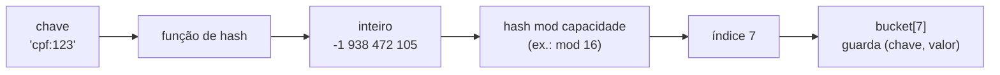
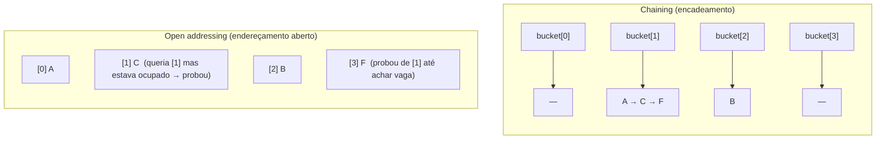
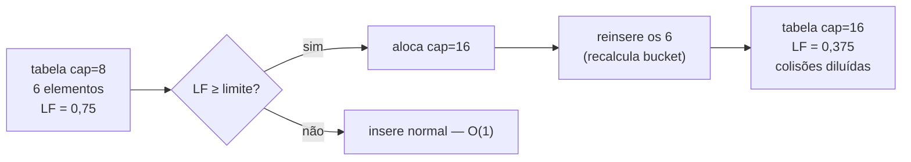
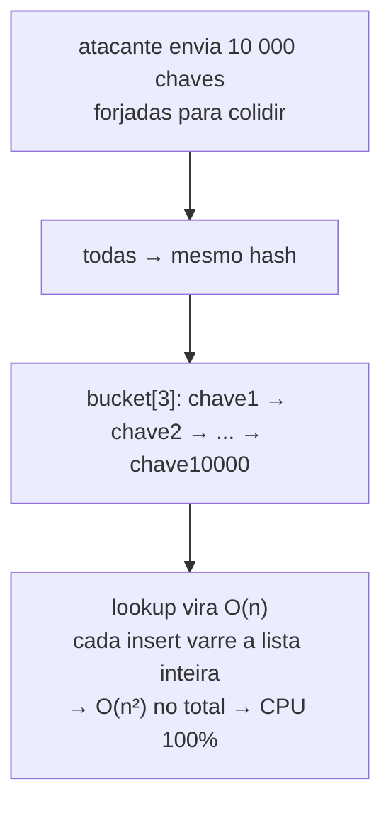
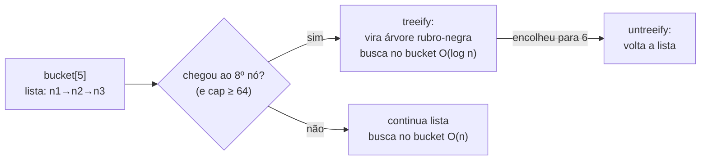
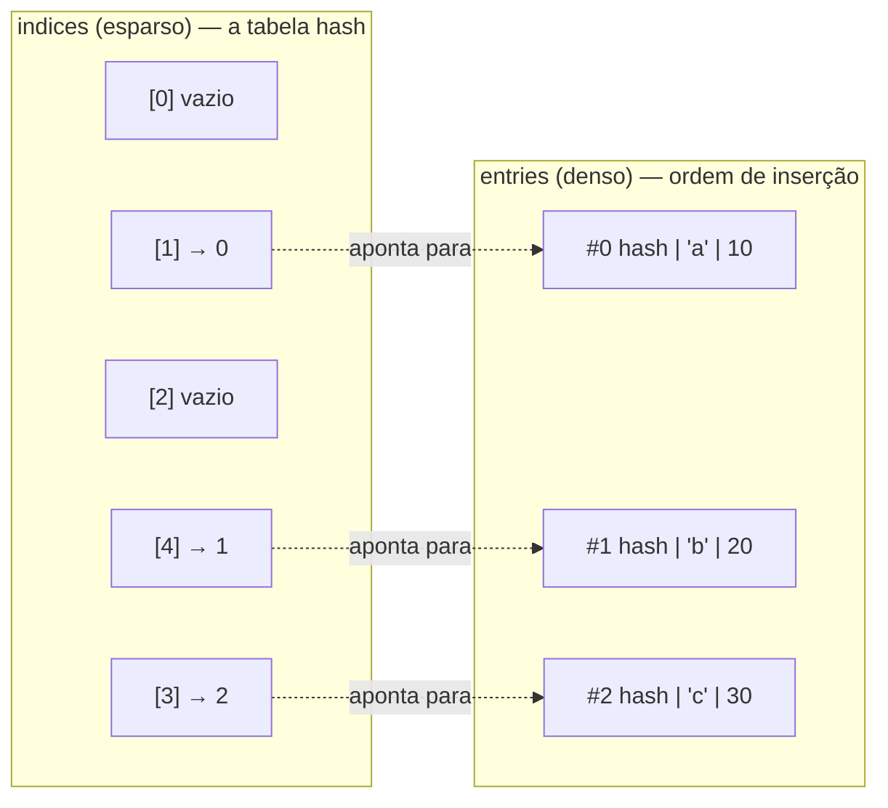
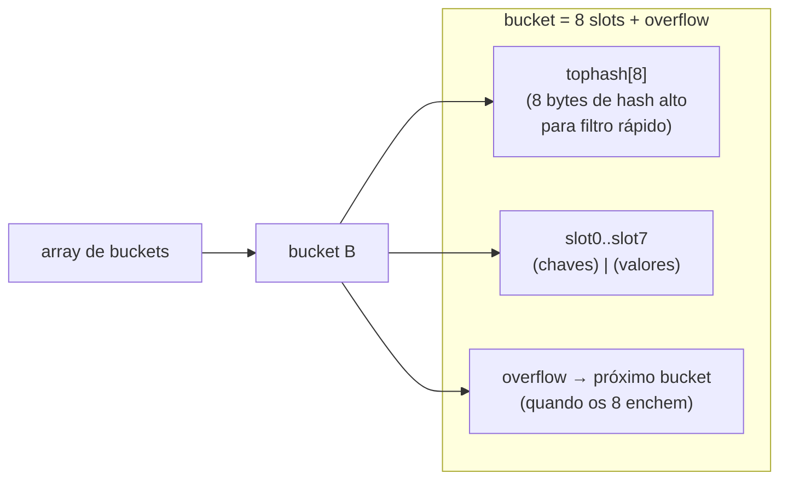

# Tabelas hash

A tabela hash é a estrutura mais cobrada em entrevista de backend — e, paradoxalmente, a mais **mal compreendida**. A definição "lookup O(1) por chave" é só a fachada. Por baixo, é uma engenhoca delicada que equilibra uma função de espalhamento, uma política de colisão, um fator de carga e um contrato de igualdade. Mude qualquer uma dessas peças e o O(1) vira O(n).

E aqui está o ponto que torna esta nota o centro do galho: das estruturas que veremos, a tabela hash é a que **mais diverge entre linguagens em tempo de execução**. O contrato abstrato é idêntico (dicionário chave→valor), mas Java, JavaScript, Python e Go construíram quatro motores radicalmente diferentes por baixo — e cada decisão de engenharia conta uma história sobre o que a linguagem prioriza.

> [!summary] Em uma linha
> Tabela hash = chave → função de hash → inteiro → bucket; O(1) amortizado *desde que* o hash espalhe bem, as colisões sejam tratadas e o fator de carga seja respeitado. O ADT é o mesmo nas quatro linguagens; os motores por baixo são quatro mundos.

---

## TL;DR

- **Hashing:** a chave passa por uma função de hash → inteiro → índice de bucket via `hash mod capacidade`. O objetivo é **distribuição uniforme** (efeito avalanche: mudar 1 bit da chave muda metade dos bits do hash).
- **Colisões** (duas chaves no mesmo bucket) se resolvem por **chaining** (lista/árvore por bucket) ou **open addressing** (procurar outro slot: linear, quadrático, double hashing, Robin Hood, cuckoo).
- **Fator de carga** (`tamanho / capacidade`): ao ultrapassar o limite (0,75 em Java, ~6,5 no Go antigo), a tabela **rehashia** — realoca e reinsere tudo. É o custo O(n) ocasional que dilui no "O(1) amortizado".
- **Contrato hashCode/equals:** chaves iguais *precisam* ter o mesmo hash; chave usada num mapa deve ser **imutável** (mutar a chave perde a entrada).
- **HashDoS** (2011): um atacante forja chaves que colidem todas no mesmo bucket → O(n). Defesa: **hashing randomizado** (SipHash).
- **Os quatro motores:** Java faz *chaining* com **treeify para árvore rubro-negra no bucket 8**; Python tem o **dict compacto** (ordenado por inserção) com *open addressing*; Go usa **buckets de 8 slots + overflow** e, desde a **1.24 (2025), migrou para Swiss Tables**; JS tem a dualidade **`Object` (shapes) vs `Map` (hash table de verdade)**.

---

## Como funciona: da chave ao bucket

Uma tabela hash é, no fundo, um **array**. A mágica é transformar uma chave qualquer (uma string, um objeto) no **índice** desse array onde o valor mora. Três passos:

1. A chave passa por uma **função de hash** → produz um inteiro (o *hash code*).
2. Esse inteiro é dobrado no tamanho do array: `índice = hash mod capacidade`.
3. O par chave-valor é guardado no **bucket** daquele índice.



**Leitura do diagrama:** a chave entra como qualquer coisa e sai como um número pequeno entre `0` e `capacidade-1`. O `mod` é o que "dobra" o universo infinito de hashes possíveis no tamanho finito do array. É exatamente por causa desse dobramento que **colisões são inevitáveis**: muitos hashes diferentes caem no mesmo índice.

A qualidade da função de hash é tudo. O ideal é **distribuição uniforme**: cada bucket recebe aproximadamente o mesmo número de chaves. Uma boa função tem o **efeito avalanche** — mudar um único bit da chave muda, em média, metade dos bits do hash. Sem avalanche, chaves parecidas (`"user1"`, `"user2"`) caem em buckets vizinhos ou no mesmo, e a tabela degenera.

> [!tip] Por que capacidade potência de 2 (ou primo)?
> Se a capacidade é potência de 2, `hash mod capacidade` vira um simples **AND de bits** (`hash & (cap-1)`) — muito mais rápido que uma divisão. O preço: só os bits **baixos** do hash importam, então um hash ruim espalha mal. Java compensa com o *bit spreading* `h ^ (h >>> 16)`, que mistura os bits altos nos baixos antes do AND. A alternativa clássica é usar capacidade **prima**, que espalha bem até com hashes medíocres, ao custo de uma divisão de verdade.

---

## Colisões: chaining vs open addressing

Duas chaves diferentes vão cair no mesmo bucket. Isso não é um bug — é a regra. O que separa as implementações é **como** elas convivem com a colisão. Há duas grandes famílias.



**Leitura do diagrama:** no **chaining**, cada bucket é uma estrutura externa (lista encadeada, ou árvore) — as chaves A, C e F que colidiram no bucket 1 viram uma corrente pendurada ali. No **open addressing**, *não há* estrutura externa: todas as chaves moram **no próprio array**. Quando C quer o slot 1 e ele está ocupado por A, C **proba** (sonda) — procura o próximo slot livre segundo uma regra.

### Chaining (encadeamento)

Cada bucket aponta para uma **lista encadeada** (ou, no Java moderno, uma **árvore**) dos pares que colidiram. Inserir é pendurar na lista; buscar é varrer a lista do bucket.

- **Prós:** simples; tolera fator de carga > 1; remover é trivial (descosturar o nó).
- **Contras:** **cache ruim** — cada nó é um objeto disperso no heap, então varrer a lista pula por endereços de memória (o mesmo problema da [[03 - Listas encadeadas]]). E há o overhead de ponteiro por nó.

### Open addressing (endereçamento aberto)

Tudo mora no array. Ao colidir, **proba** (sonda) outros slots até achar vaga (inserção) ou a chave (busca). Variantes pela regra de probing:

- **Linear probing:** tenta `i+1, i+2, i+3...`. Cache excelente (slots contíguos), mas sofre de **primary clustering**: blocos de slots ocupados crescem juntos e pioram juntos.
- **Quadratic probing:** tenta `i+1, i+4, i+9...`. Quebra o clustering primário, mas tem *secondary clustering*.
- **Double hashing:** o passo do probe vem de uma **segunda** função de hash — espalha melhor, ao custo de cache pior.
- **Robin Hood hashing:** ao inserir, a chave que "viajou mais longe" do seu slot ideal rouba o lugar da que viajou menos — equaliza as distâncias de probe e reduz a variância das buscas.
- **Cuckoo hashing:** duas funções de hash, dois ninhos possíveis por chave; ao inserir, expulsa o ocupante para o seu *outro* ninho (como o filhote do cuco). Garante **busca O(1) no pior caso** (só dois lugares para olhar).

> [!warning] A armadilha da remoção em open addressing: tombstones
> No chaining você descosura o nó e pronto. No open addressing, **apagar um slot quebra a cadeia de probe** — uma busca futura encontraria o slot vazio e desistiria cedo demais, perdendo chaves que probaram *através* dele. A solução é marcar o slot com um **tombstone** (lápide): "aqui foi apagado, mas continue probando". Tombstones acumulam, poluem a tabela e forçam *rehash* mesmo sem crescimento. É o calcanhar de Aquiles do open addressing.

| Eixo | Chaining | Open addressing |
| --- | --- | --- |
| Onde mora o dado | listas/árvores externas | dentro do próprio array |
| Localidade de cache | ruim (nós dispersos) | excelente (slots contíguos) |
| Fator de carga viável | pode passar de 1 | precisa ficar abaixo de 1 (~0,7) |
| Remoção | trivial | precisa de tombstone |
| Quem usa | Java (`HashMap`) | Python (`dict`), Go (1.24+) |

---

## Fator de carga e rehashing

O **fator de carga** (load factor) é a razão `tamanho / capacidade` — quão cheia a tabela está. Quando ele passa de um limite, as colisões explodem e o O(1) começa a virar O(n). A solução é **rehashing**: alocar uma tabela nova (tipicamente o **dobro** de buckets) e **reinserir tudo**, recalculando cada bucket para a nova capacidade.



**Leitura do diagrama:** a inserção que dispara o rehash paga O(n) — ela reinsere todos os elementos existentes. Mas isso acontece raramente (a cada vez que a tabela dobra), então o custo **dilui** ao longo de todas as inserções baratas. Por isso dizemos **O(1) amortizado**: o caso comum é O(1), o caso raro de resize é O(n), e a média é O(1).

> [!info] O que "amortizado" realmente significa
> Não é "em média na sorte". É uma garantia: para *qualquer* sequência de N inserções, o **total** é O(N), mesmo contando os resizes. Como cada elemento é reinserido um número logarítmico de vezes (dobrando: 1, 2, 4, 8...), a soma das cópias é ≤ 2N. O resize é o "imposto" que você paga de vez em quando para manter o lookup barato o resto do tempo. Mesma matemática do array dinâmico em [[02 - Arrays e listas dinâmicas]].

O limite escolhido é um **trade-off**: load factor baixo (0,5) gasta memória mas tem poucas colisões; alto (0,9) economiza memória mas as colisões custam. Java fica em **0,75** como meio-termo histórico; Go tolera até **~6,5** porque cada bucket guarda 8 slots (a conta é diferente).

---

## O contrato hashCode/equals e a imutabilidade da chave

Aqui mora o bug mais comum com tabelas hash. Para que o mapa encontre a chave que você guardou, **duas funções da chave precisam concordar**: a que dá o hash (qual bucket) e a que decide igualdade (é esta mesma chave?). O contrato:

1. Se `a.equals(b)` é verdadeiro, então **obrigatoriamente** `a.hashCode() == b.hashCode()`. (O contrário não precisa valer: hashes iguais com objetos diferentes é só uma colisão.)
2. Se você sobrescreve `equals`, **sempre** sobrescreva `hashCode` junto. Esquecer um é o bug clássico: dois objetos "iguais" caem em buckets diferentes e o mapa os trata como distintos.
3. O hash precisa ser **estável** durante a vida da chave dentro do mapa.

```java
public final class Cpf {
    private final String numero;   // final = imutável

    public Cpf(String numero) { this.numero = numero; }

    @Override
    public boolean equals(Object o) {
        if (this == o) return true;
        if (!(o instanceof Cpf other)) return false;
        return numero.equals(other.numero);
    }

    @Override
    public int hashCode() {
        return numero.hashCode();   // deriva do mesmo campo que equals usa
    }
}
```

> [!warning] A armadilha mortal: mutar a chave
> Imagine usar um objeto **mutável** como chave, guardá-lo no mapa, e depois mudar um campo que entra no `hashCode`. O hash da chave muda — mas a entrada continua no bucket **antigo**, calculado no momento da inserção. Agora `mapa.get(chave)` calcula o bucket **novo**, olha lá, e não acha nada. A entrada virou um fantasma: ocupa memória, mas é inacessível. **Regra de ouro: chave de mapa deve ser imutável.** Em Python isso é imposto pela linguagem — só objetos *hashable* (imutáveis) podem ser chave; lista não pode, tupla pode.

---

## HashDoS e SipHash: quando o atacante escolhe as chaves

Toda a promessa de O(1) repousa numa premissa: **as chaves se espalham**. E se um atacante deliberadamente forjar milhares de chaves que **todas colidem no mesmo bucket**?



**Leitura do diagrama:** com todas as chaves no mesmo bucket, a tabela hash colapsa numa **lista encadeada**. Inserir N chaves vira O(n²), e o servidor trava queimando CPU. Em 2011, no congresso **28C3**, Klink e Wälde mostraram que PHP, ASP.NET, Java, Python e Ruby eram *todos* vulneráveis: bastava um POST com parâmetros cuidadosamente escolhidos para derrubar o servidor. É o **HashDoS** (hash-flooding).

A defesa é **hashing randomizado**: a função de hash recebe uma **semente secreta** gerada quando o processo inicia. Como o atacante não conhece a semente, não consegue prever quais chaves colidem — as colisões que ele calculou na máquina dele não valem no servidor. A função que virou padrão para isso é a **SipHash** (Aumasson & Bernstein, 2012), criada justamente em resposta à onda de HashDoS.

- **Python** adotou SipHash com **randomização de hash** controlável por `PYTHONHASHSEED` (e o Java treeifica o bucket — veja abaixo — como defesa estrutural).
- **Rust** usa SipHash por padrão no `HashMap`.
- É o fio que **costura as quatro linguagens**: cada uma respondeu ao HashDoS de um jeito (randomização de semente, ou árvore por bucket).

---

## Implementações comparadas: Java · TypeScript · Python · Go

O contrato é idêntico — dicionário chave→valor com O(1) amortizado. Mas os **motores** são quatro mundos. Esta é a seção-vitrine do galho.

### Java — chaining com treeify para árvore rubro-negra

`HashMap` usa **chaining**: cada bucket começa como uma lista encadeada. A jogada do Java 8 foi defensiva: quando um bucket fica longo demais — **`TREEIFY_THRESHOLD = 8`** elementos *e* capacidade ≥ 64 — aquela lista vira uma **árvore rubro-negra**, derrubando a busca naquele bucket de O(n) para O(log n). Quando encolhe abaixo de **`UNTREEIFY_THRESHOLD = 6`**, volta a ser lista (a histerese 8/6 evita ficar convertendo de ida e volta). É uma **mitigação de HashDoS embutida na estrutura**: mesmo sob colisão adversária, o pior caso é O(log n), não O(n).



**Leitura do diagrama:** a treeificação é **por bucket**, não da tabela inteira — só o bucket que estourou vira árvore. Os outros continuam listas. O limiar 8 não é arbitrário: com hash bom, a chance de um bucket ter 8 colisões segue uma Poisson com média 0,5, e cair em 8 tem probabilidade na casa de 1 em 10 milhões. Ou seja, treeificar **nunca deveria acontecer** com hash honesto — só sob ataque ou hashCode muito ruim.

Outros detalhes cravados do `HashMap`: **load factor 0,75**, **capacidade potência de 2**, *bit spreading* `h ^ (h >>> 16)` para misturar bits altos nos baixos, resize **dobrando** a capacidade.

```java
Map<String, Integer> freq = new HashMap<>();
for (String palavra : texto.split(" ")) {
    freq.merge(palavra, 1, Integer::sum);   // contagem idiomática
}
```

O ecossistema em torno dele:

- **`HashSet`** — é literalmente um `HashMap` por baixo (as chaves são os elementos; o valor é um objeto sentinela). Deduplicação e teste de existência O(1).
- **`LinkedHashMap`** — `HashMap` + lista duplamente encadeada ligando as entradas na **ordem de inserção** (ou de **acesso**, com `accessOrder=true`). É a base do **LRU cache** — detalhe em [[12 - Estruturas especializadas]].
- **`TreeMap`** — não é hash: é uma **árvore rubro-negra**, O(log n), ordenada por `Comparable`. Entra quando você precisa de *range queries* (`subMap`, `floorKey`). A fundo em [[06 - Árvores e árvores de busca]].
- **`ConcurrentHashMap`** — redesenhado no **Java 8**: o antigo *segment locking* (a tabela dividida em N segmentos, cada um com um lock) deu lugar a **locking por bucket**. A inserção do primeiro nó num bucket vazio é um **CAS** (compare-and-swap, sem lock); só quando há contenção no mesmo bucket é que as threads se sincronizam no primeiro nó daquele bucket. Leituras seguem ponteiros voláteis **sem lock**. Resultado: buckets diferentes operam em paralelo de verdade.
- **`IdentityHashMap`** (usa `==` e identidade, não `equals`/`hashCode`), **`WeakHashMap`** (chaves coletáveis pelo GC — útil para caches que não devem segurar memória), **`EnumMap`** (array indexado pelo `ordinal` do enum, ultrarrápido).

```java
// LRU em uma linha, via LinkedHashMap com access order
Map<String, String> lru = new LinkedHashMap<>(16, 0.75f, true) {
    protected boolean removeEldestEntry(Map.Entry<String, String> e) {
        return size() > 100;   // evita o menos recentemente usado
    }
};
```

### TypeScript / JavaScript — a dualidade `Object` vs `Map`

JS tem **duas** estruturas chave-valor com semânticas internas diferentes, e escolher errado custa performance.

O **`Object`** parece um mapa, mas o V8 o trata de duas formas:

- Objetos de **shape fixo** (sempre as mesmas chaves, na mesma ordem) ganham uma **hidden class** (também chamada *shape* ou *map* no código do V8): as propriedades viram offsets fixos num array, e o acesso é quase tão rápido quanto um campo de struct. É o caminho "fast properties".
- Objetos com chaves **dinâmicas** (adiciona/remove em runtime, chaves arbitrárias) fazem o V8 desistir da hidden class e cair em **dictionary mode** — aí sim vira uma tabela hash de verdade, mais lenta para acesso.

```typescript
// Object: ótimo para SHAPE FIXO conhecido (vira hidden class, acesso rápido)
const ponto = { x: 1, y: 2 };   // shape estável → fast properties

// Object como mapa dinâmico: cai em dictionary mode + armadilhas
const obj: Record<string, number> = {};
obj["__proto__"] = 1;   // ARMADILHA: prototype pollution
```

> [!warning] Prototype pollution
> Chaves de `Object` herdam do protótipo. Escrever `obj["__proto__"]` ou `obj["constructor"]` pode **poluir o protótipo** de *todos* os objetos, uma classe inteira de vulnerabilidade. Por isso, para dados vindos do usuário, prefira `Map` — cujas chaves não tocam o protótipo — ou `Object.create(null)`.

O **`Map`** é a tabela hash explícita e idiomática:

- Aceita **qualquer chave** (objetos, funções, `NaN`), não só strings/Symbols.
- **Garante a ordem de inserção** na iteração (o V8 o implementa como uma tabela hash com uma ordem mantida à parte).
- É a escolha certa para **chaves dinâmicas, conjuntos grandes ou frequentemente modificados** — tem `delete` O(1) honesto, enquanto `delete obj.k` num `Object` pode forçar dictionary mode.

```typescript
const cache = new Map<string, User>();   // hash table de verdade, ordem de inserção
cache.set("u1", user);
cache.get("u1");
cache.has("u1");
cache.delete("u1");

const unicos = new Set([1, 2, 2, 3]);    // {1, 2, 3}
const wm = new WeakMap<object, Meta>();  // chaves coletáveis pelo GC (sem vazar)
```

> [!tip] A regra de decisão `Object` vs `Map`
> Use `Object` quando o **shape é fixo e conhecido** (um registro, um DTO) — o JIT otimiza via hidden class. Use `Map` quando as chaves são **dinâmicas**, quando precisa **iterar em ordem de inserção**, quando quer chaves **não-string**, ou quando há **muitas inserções/remoções**. E para dados não confiáveis, `Map` evita prototype pollution.

### Python — o `dict` compacto e ordenado

O `dict` do CPython usa **open addressing** com *perturbation probing* (a sequência de probe mistura bits altos do hash a cada passo, espalhando melhor que probing linear). Mas a joia é o **dict compacto**, implementado no **3.6** e tornado garantia de linguagem no **3.7**: o `dict` passou a **preservar a ordem de inserção** — de graça, como efeito colateral do novo layout.

O truque é separar em **dois arrays**:



**Leitura do diagrama:** o array **`indices`** é a tabela hash esparsa de verdade — `hash mod capacidade` indexa aqui, e cada slot guarda apenas um **número pequeno** (o índice na outra tabela), não o par inteiro. Os pares `(hash, chave, valor)` moram no array **`entries`**, **denso e em ordem de inserção**. Iterar o dict é varrer `entries` na ordem — daí a ordem de inserção preservada. E `indices` guardar só inteirinhos (1, 2, 4 ou 8 bytes conforme o tamanho) economiza ~58% de memória vs. o layout antigo.

Há ainda os **key-sharing dicts**: instâncias de uma mesma classe compartilham *uma só* tabela de chaves (os nomes dos atributos são os mesmos para todas), e cada instância carrega só o array de valores. Economia enorme quando você tem milhões de objetos do mesmo tipo.

```python
d = {}
d["a"] = 10
d["b"] = 20
d["c"] = 30
list(d)          # ['a', 'b', 'c'] — ordem de inserção GARANTIDA (3.7+)

# contrato __hash__ / __eq__ : chave precisa ser HASHABLE (imutável)
d[(1, 2)] = "ok"   # tupla é hashable → vale como chave
# d[[1, 2]] = "x"  # TypeError: list é mutável → unhashable

from collections import Counter
Counter("banana")   # {'a': 3, 'n': 2, 'b': 1} — contagem idiomática
```

O contrato espelha o do Java: `__hash__` e `__eq__` precisam concordar, e **hashable ⇒ imutável** (a linguagem *impõe* — lista não é chave, tupla é). E o `dict` (como o `set`/`frozenset`) usa **hashing randomizado com SipHash**, controlado por `PYTHONHASHSEED`, como defesa de HashDoS.

### Go — buckets de 8 slots, overflow, e a virada para Swiss Tables

O `map` é um *builtin* da linguagem. Até o **Go 1.23**, o desenho era: um **array de buckets**, cada bucket com **8 slots** de chave/valor mais um ponteiro para um **bucket de overflow** (quando os 8 enchem). O fator de carga é **~6,5 entradas por bucket** antes de crescer — mais alto que o de outras linguagens justamente porque cada bucket comporta 8.



**Leitura do diagrama:** o `tophash` guarda os bits **altos** do hash de cada slot — antes de comparar a chave inteira (caro), o Go compara esse byte (barato) para descartar rápido quem não bate. Quando os 8 slots enchem, encadeia um **bucket de overflow**. O crescimento usa **evacuação incremental**: em vez de reinserir tudo de uma vez (um *stall* O(n)), o Go move os buckets antigos para a tabela nova **aos poucos**, conforme você acessa o mapa — diluindo o custo do resize.

Duas decisões deliberadas que pegam todo mundo de surpresa:

> [!warning] Ordem de iteração randomizada — de propósito
> Iterar um `map` em Go dá ordem **diferente a cada vez** — o runtime escolhe um bucket inicial aleatório. Isso é **intencional**: impede que código passe a depender de uma ordem acidental (que mudaria entre versões). Se você precisa de ordem, extraia as chaves e ordene.

> [!danger] Não é seguro para uso concorrente
> Escrita concorrente sem sincronização é um **erro fatal** detectado em runtime: `fatal error: concurrent map writes` — derruba o programa inteiro, e nem `recover` pega. Soluções: `sync.RWMutex` em volta, *sharding* (N mapas com locks separados), ou `sync.Map` (otimizado para o caso de muitas leituras e poucas escritas).

E a grande virada: **o Go 1.24 (fevereiro de 2025) trocou o `map` builtin por Swiss Tables.** É uma reescrita do motor, ainda transparente para o seu código:

- Sai o chaining-por-overflow, entra **open addressing** num desenho moderno (origem na Abseil/Google).
- Cada grupo de 8 slots ganha uma palavra de **control bytes** (1 byte de metadado por slot).
- O lookup compara esse byte de controle com **instruções SIMD** (no amd64, 8 comparações em paralelo numa só operação), achando candidatos pelo metadado antes de tocar as chaves.
- Ganho real: menos CPU e menos memória, sobretudo em mapas grandes (a Datadog relatou economizar **centenas de gigabytes**).

```go
m := make(map[string]int, 100)   // pré-dimensiona: evita rehashes
m["a"] = 1
v, ok := m["a"]                  // idioma "comma ok": ok=false se ausente
delete(m, "a")

// concorrência: ou Mutex, ou sync.Map
var mu sync.RWMutex              // protege um map comum
var sm sync.Map                 // pronto para concorrência (muitas leituras)
```

Outra restrição do Go: as chaves precisam ser **comparáveis** (`comparable`) — tipos com `==`. Slice, map e função **não** podem ser chave.

### Síntese sênior

> [!quote] O mesmo ADT, quatro motores
> A interface é uma só — dicionário O(1) — mas cada linguagem fez uma aposta diferente por baixo, e cada aposta é uma lição:
> - **Java** escolheu *chaining* e blindou o pior caso com **treeify para árvore rubro-negra no bucket 8** — defesa de HashDoS embutida na estrutura.
> - **Python** escolheu *open addressing* e ainda ganhou o **dict compacto e ordenado** de brinde, com dois arrays (indices esparso + entries denso) que economizam memória e preservam ordem de inserção.
> - **Go** foi de **buckets de 8 slots + overflow** com evacuação incremental e iteração propositalmente aleatória — e em **2025 migrou para Swiss Tables** (open addressing com control bytes e SIMD).
> - **JS** vive a dualidade **`Object` (hidden classes para shape fixo) vs `Map` (hash table real, ordem de inserção)** — escolher errado é deixar performance na mesa.
>
> E o **HashDoS** é o fio que costura as quatro: foi o susto de 2011 que levou quase todo mundo a adotar **randomização / SipHash** (ou, no caso do Java, a árvore por bucket).

| Eixo | Java `HashMap` | JS `Map` / `Object` | Python `dict` | Go `map` |
| --- | --- | --- | --- | --- |
| Colisão | chaining → treeify (8) | hash table / shapes | open addressing | overflow → Swiss Tables (1.24) |
| Ordem | nenhuma (`LinkedHashMap` p/ ordem) | `Map`: inserção | inserção (3.7+) | **aleatória** (deliberado) |
| Load factor | 0,75 | — | ~2/3 | ~6,5 (8 slots/bucket) |
| Concorrência | `ConcurrentHashMap` | single-thread | GIL | **não-safe** → `sync.Map` |
| Defesa HashDoS | treeify | — | SipHash (`PYTHONHASHSEED`) | randomização de seed |

---

## Quando usar / armadilhas

**Use tabela hash para:** lookup por chave única (cache, índice secundário), contagem de frequência, deduplicação (set), memoization, e teste rápido de existência. Sempre que a pergunta é "isso já existe?" ou "qual o valor associado a esta chave?", a tabela hash é a primeira resposta.

**Não use quando** você precisa de **ordem natural** ou **range queries** ("todas as chaves entre X e Y") — aí é árvore ([[06 - Árvores e árvores de busca]]); ou quando os dados vivem **em disco** e o gargalo é I/O — aí é B-Tree ([[09 - Árvores B e índices]]).

> [!warning] As armadilhas clássicas
> - **Mutar uma chave** depois de inseri-la — o hash muda e a entrada vira fantasma (a mais comum).
> - **Sobrescrever `equals` sem `hashCode`** (Java) — objetos "iguais" caem em buckets diferentes.
> - **Assumir ordem de iteração** num `HashMap` Java ou num `map` Go — o primeiro não tem ordem, o segundo é aleatório de propósito.
> - **Usar `HashMap` em cenário concorrente** — use `ConcurrentHashMap`; em Go, lembre que `map` cru é fatal sob escrita concorrente.
> - **Ignorar o fator de carga / não pré-dimensionar** — se você sabe o tamanho, construa com capacidade inicial e evite rehashes.

---

## Na prática

> No **MedEspecialista**, usei intensamente `HashMap` como **cache em memória de configurações** carregadas no boot e consultadas em *hot paths* — evitando *round-trips* ao banco para dados quase-estáticos. A lógica era simples: dados que mudam raramente (parâmetros de sistema, tabelas de domínio, flags) entram num `HashMap` populado uma vez na inicialização, e cada requisição que precisa deles faz um `get` O(1) em memória, em vez de uma query. A diferença num endpoint quente é gritante: trocar uma ida ao banco (milissegundos, *I/O*, contenção de pool de conexões) por um lookup em RAM (nanossegundos) tira pressão do banco inteiro.

O detalhe sênior desse caso: o cache de boot funciona **porque os dados são quase-estáticos**. A tabela hash brilha aqui justamente onde a invalidação é simples (raramente muda) e a chave é natural (o código do parâmetro). Para dados que mudam o tempo todo, o mesmo padrão viraria um pesadelo de invalidação de cache — e aí entra um LRU com expiração ([[12 - Estruturas especializadas]]), não um `HashMap` cru.

---

## Em entrevista (How to explain in English)

> "A hash table gives you O(1) average lookup by running the key through a hash function to pick a bucket. The catch is that 'O(1)' assumes the hash distributes well and you handle collisions — get those wrong and it degrades to O(n).
>
> Collisions are resolved two ways. **Chaining** hangs a linked list — or in Java 8 and up, a **red-black tree once a bucket hits eight entries** — off each bucket. **Open addressing** keeps everything in the array and probes for the next free slot; it's more cache-friendly but you need tombstones on delete.
>
> The four languages diverge a lot under the hood. Java's `HashMap` is chaining that **treeifies to O(log n) per bucket** — that's actually a HashDoS defense. Python's `dict` is open addressing, and since 3.7 it's a **compact, insertion-ordered dict**: a dense entries array plus a sparse index array. Go's built-in map was buckets of eight slots with overflow, and **in Go 1.24, 2025, it moved to Swiss Tables** — open addressing with control bytes and SIMD lookups — plus Go **randomizes iteration order on purpose** and isn't safe for concurrent writes. In JavaScript I reach for `Map` over a plain object when keys are dynamic — `Map` is a real hash table with guaranteed insertion order, and it sidesteps prototype pollution.
>
> The thing that ties them together is the **HashDoS** attack from 2011 — adversarial keys that all collide and force O(n). Most languages responded by randomizing the hash with **SipHash**; Java responded with the per-bucket tree."

**Frases úteis:**

- "It's O(1) amortized — the resize is O(n) but it happens rarely, so it averages out."
- "If you override `equals`, you must override `hashCode` — that's the contract."
- "Never mutate a key after you've put it in the map — you lose the entry."
- "Java treeifies a bucket at eight entries; that's a defense against hash flooding."
- "Go's map randomizes iteration order deliberately, and it's not safe for concurrent writes."
- "I'd use a `Map` over an object here because the keys are dynamic and I want insertion order."

**Vocabulário:**

- tabela hash → hash table / hash map · função de hash → hash function
- bucket / balde → bucket · colisão → collision · espalhamento → hashing / spreading
- encadeamento → chaining · endereçamento aberto → open addressing · sondagem → probing
- fator de carga → load factor · rehashing → rehashing · lápide → tombstone
- distribuição uniforme → uniform distribution · efeito avalanche → avalanche effect
- chave imutável → immutable key · hashable → hashable
- ordem de inserção → insertion order · dict compacto → compact dict
- árvore rubro-negra → red-black tree · treeificar → treeify
- inundação de hash → hash flooding · ataque de negação de serviço → denial-of-service (DoS)

---

## Referências

- [HashMap.java — OpenJDK 11 (AdoptOpenJDK)](https://github.com/AdoptOpenJDK/openjdk-jdk11u/blob/master/src/java.base/share/classes/java/util/HashMap.java) — código-fonte: `TREEIFY_THRESHOLD = 8`, `UNTREEIFY_THRESHOLD = 6`, load factor `0.75`, `h ^ (h >>> 16)`, treeify exige capacidade ≥ 64.
- [The Secret Improvement of HashMap in Java 8 (Runzhuo Li)](https://runzhuoli.me/2018/08/31/the-secret-improvement-of-hashmap-in-java8.html) — treeify para árvore rubro-negra no bucket 8.
- [ConcurrentHashMap in Java 8: Internals (Cleverence)](https://www.cleverence.com/articles/oracle-documentation/concurrenthashmap-java-8-internals-guide-4728/) — fim do segment locking; CAS por bucket + `synchronized` no primeiro nó; leituras sem lock (redesign do Java 8).
- [Java HashMap Load Factor (Baeldung)](https://www.baeldung.com/java-hashmap-load-factor) — default 0,75 e o trade-off memória vs. colisão.
- [Python 3.6 dict becomes compact (python-dev, INADA Naoki)](https://mail.python.org/pipermail/python-dev/2016-September/146327.html) — anúncio do dict compacto: indices esparso + entries denso, ordem de inserção como efeito colateral.
- [CPython-Internals — dict (zpoint)](https://github.com/zpoint/CPython-Internals/blob/master/BasicObject/dict/dict.md) — layout dos dois arrays, key-sharing dicts, ~58% de economia de memória.
- [Faster Go maps with Swiss Tables (go.dev/blog)](https://go.dev/blog/swisstable) — anúncio oficial: Go 1.24 troca o `map` builtin por Swiss Tables; grupos de 8 slots, control word, SIMD no amd64.
- [Map internals in Go 1.24 (Mohamed Said)](https://themsaid.com/map-internals-go-1-24) — control bytes, grupos de 8, comparação SIMD.
- [How Go 1.24's Swiss Tables saved us hundreds of gigabytes (Datadog)](https://www.datadoghq.com/blog/engineering/go-swiss-tables/) — ganho real de memória em produção.
- [Go Maps Explained: How Key-Value Pairs Are Actually Stored (VictoriaMetrics)](https://victoriametrics.com/blog/go-map/) — desenho pré-1.24: 8 slots/bucket, overflow, load factor ~6,5, evacuação incremental, `tophash`.
- [SipHash — Wikipedia](https://en.wikipedia.org/wiki/SipHash) — criada por Aumasson & Bernstein (2012) em resposta ao HashDoS de 2011; adotada por Python, Rust e outros.
- [Hash collision DoS — 28C3 (jsmon)](https://blogs.jsmon.sh/what-is-hash-collision-dos-ways-to-exploit-examples-and-impact/) — o ataque de 2011 (Klink & Wälde) e as linguagens afetadas.
- [Fast properties in V8 (v8.dev)](https://v8.dev/blog/fast-properties) — hidden classes / shapes para shape fixo vs. *dictionary mode* para chaves dinâmicas.
- [Maps (Hidden Classes) in V8 (v8.dev/docs)](https://v8.dev/docs/hidden-classes) — como o V8 monta e troca a hidden class de um objeto.

> [!note] Lastro de honestidade
> Os números internos foram verificados em fonte primária ou de alta confiança: Java `TREEIFY_THRESHOLD = 8` / `UNTREEIFY_THRESHOLD = 6` / LF 0,75 / `h ^ (h >>> 16)` (código do OpenJDK); ConcurrentHashMap CAS-por-bucket sem segment locking (Java 8); dict compacto do Python (anúncio python-dev de 2016, spec a partir do 3.7); Go pré-1.24 com 8 slots/bucket, overflow e LF ~6,5; **Go 1.24 (2025) migrando para Swiss Tables** (blog oficial go.dev); SipHash e o HashDoS de 2011 (28C3). Os detalhes de *Robin Hood* e *cuckoo hashing* são teoria de domínio público (não internos de uma versão específica). A V8 muda de versão para versão — "hidden class vs dictionary mode" é o modelo conceitual estável, não um snapshot de uma versão exata. O relato em "Na prática" (cache de configuração em `HashMap` no boot do MedEspecialista) é experiência real do autor — não fabricado.

## Veja também

- [[01 - O que é uma estrutura de dados]] — o contrato de operações e o framework de decisão que coloca a tabela hash como primeira resposta para lookup por chave.
- [[06 - Árvores e árvores de busca]] — `TreeMap`/BST: O(log n) ordenado, a escolha quando você precisa de ordem natural e range queries (e a árvore rubro-negra que o Java treeifica por bucket).
- [[09 - Árvores B e índices]] — quando os dados vão para disco e o hash não basta: a B-Tree que indexa o banco.
- [[12 - Estruturas especializadas]] — LRU cache, Bloom filter e outras estruturas que se constroem *sobre* a tabela hash.
- [[Dicionário de Fundamentos]] — glossário de termos.
