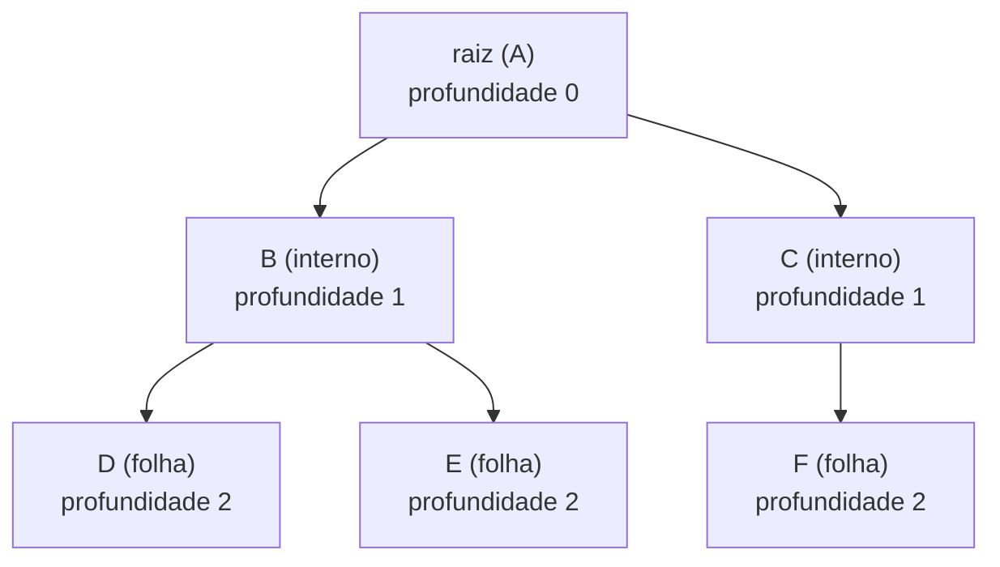
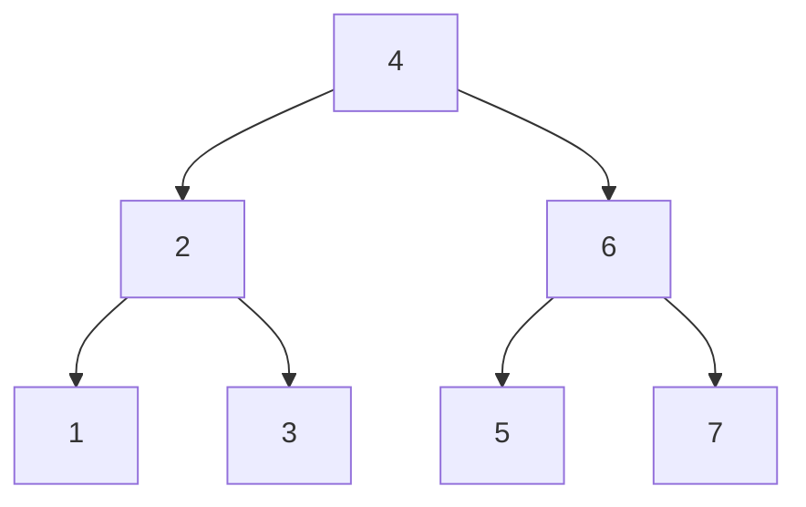
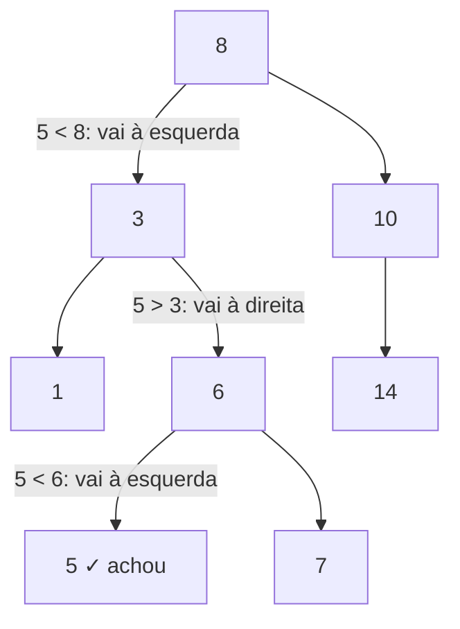
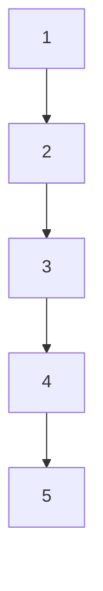
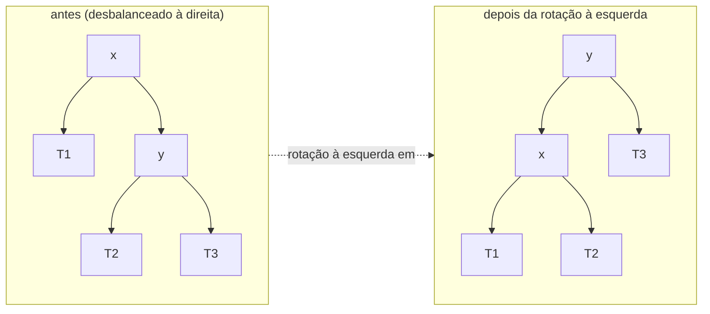
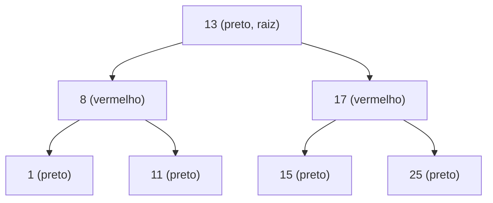

# Árvores e árvores de busca

Até aqui, todas as estruturas do galho eram **lineares**: array, lista, pilha, fila, tabela hash — uma sequência ou um balde de baldes. A árvore quebra essa linha. Ela é a primeira estrutura **hierárquica**: cada elemento pode ter vários filhos, e o que importa não é a posição, é o **caminho** da raiz até ele.

E há uma tensão que faz esta nota render. A tabela hash (nota anterior) entrega `O(1)` mas joga fora a **ordem**: ela não sabe dizer "qual é a próxima chave depois de 42", nem "me dê todas as chaves entre 10 e 50". A árvore de busca paga `O(log n)` justamente para guardar isso. É o trade-off ordem × velocidade no estado puro.

E aqui mora um *gotcha* de entrevista que separa quem decorou de quem entendeu: **das quatro linguagens deste galho, só o Java traz uma árvore balanceada pronta na biblioteca padrão.** JavaScript, Python e Go não têm `TreeMap`. Cada um resolve a falta de um jeito diferente — e saber qual é o idioma de cada linguagem é o que a pergunta realmente testa.

> [!summary] Em uma linha
> Árvore = nós em hierarquia (raiz → filhos → folhas). A **BST** mantém `esquerda < nó < direita`, dando busca/inserção/remoção em `O(log n)` **médio** — mas degenera para `O(n)` se desbalancear. **AVL** e **Red-Black** garantem o `O(log n)` com rotações. Só o Java expõe isso no stdlib (`TreeMap`, Red-Black); JS/Python/Go vivem o gap do *ordered-map*.

---

## TL;DR

- **Árvore:** raiz (sem pai), nós internos (com filhos), folhas (sem filhos). **Altura** mede do nó até a folha mais profunda; **profundidade** mede da raiz até o nó.
- **Travessias:** *in-order*, *pre-order*, *post-order* (DFS, recursivas ou com pilha explícita) e *level-order* (BFS, com fila). **In-order de uma BST sai ordenado** — é o truque que torna BST sinônimo de "estrutura ordenada".
- **BST:** invariante `esquerda < nó < direita`. Busca/inserção/remoção `O(log n)` **no caso médio**, `O(n)` no **pior** (árvore vira lista). O caso chato da remoção é o nó com **dois filhos** (resolve com sucessor ou predecessor).
- **Balanceadas:** **AVL** é estritamente balanceada (mais rotações, busca mais rápida); **Red-Black** é frouxa (menos rotações na escrita, 5 propriedades) — por isso é a escolha de `TreeMap`, `std::map` do C++ e do scheduler CFS do Linux.
- **O gap do ordered-map:** Java tem `TreeMap`/`TreeSet` (Red-Black, API `NavigableMap`). JS, Python e Go **não têm árvore balanceada embutida**. O idioma de Python é o `sortedcontainers` (que nem árvore é — é lista-de-listas); o de Go é *slice* ordenado + `sort.Search`; o de JS é construir ou puxar biblioteca.

---

## Anatomia de uma árvore

Uma árvore é um conjunto de **nós** ligados por arestas, com três regras: existe um nó especial chamado **raiz** (o único sem pai), todo outro nó tem **exatamente um pai**, e não há ciclos. Quem não tem filho é uma **folha**; quem tem é um **nó interno**.



**Leitura do diagrama:** a raiz `A` está no topo (profundidade 0). Descendo, cada nível aumenta a profundidade em 1. `D`, `E` e `F` são folhas. A **altura da árvore** é a maior profundidade — aqui, 2.

Dois termos que confundem em entrevista:

- **Profundidade (depth) de um nó:** distância da **raiz** até ele. A raiz tem profundidade 0.
- **Altura (height) de um nó:** distância do nó até a **folha** mais profunda abaixo dele. As folhas têm altura 0. A altura da *árvore* é a altura da raiz.

> Pense assim: profundidade olha para cima (de onde eu vim), altura olha para baixo (quão fundo ainda dá pra cair).

E a distinção que importa para o resto da nota: uma árvore é **n-ária** se um nó pode ter qualquer número de filhos, e **binária** se cada nó tem no máximo dois (o esquerdo e o direito). Tudo daqui pra frente é binário.

---

## Travessias: como visitar todos os nós

Visitar um array é trivial: do índice 0 ao fim. Numa árvore não há "próximo" óbvio — há ramos. Existem duas famílias de travessia, e a diferença entre elas é a **estrutura auxiliar**: pilha (profundidade) ou fila (largura).



**Leitura do diagrama:** esta é uma BST pequena que vamos percorrer de quatro jeitos. Repare que ela já respeita `esquerda < nó < direita` (a invariante da próxima seção).

As três travessias em **profundidade (DFS)** diferem só em **quando** você "visita" o nó em relação aos filhos:

- **In-order** (esquerda → **nó** → direita): `1, 2, 3, 4, 5, 6, 7`. Numa BST, **sai sempre ordenado**. Este é o resultado mais importante da nota.
- **Pre-order** (**nó** → esquerda → direita): `4, 2, 1, 3, 6, 5, 7`. Serve para **clonar** ou **serializar** a árvore (você emite o pai antes dos filhos).
- **Post-order** (esquerda → direita → **nó**): `1, 3, 2, 5, 7, 6, 4`. Serve para **destruir/liberar** ou **avaliar** a árvore de baixo pra cima (calcular o filho antes do pai — é assim que um interpretador avalia uma árvore de expressão).

A travessia em **largura (BFS)** é o quarto modo:

- **Level-order** (nível por nível, esquerda pra direita): `4, 2, 6, 1, 3, 5, 7`. Usa uma **fila**: desenfileira um nó, enfileira seus filhos, repete.

```java
// In-order recursivo: o jeito natural
void inOrder(No no) {
    if (no == null) return;
    inOrder(no.esquerda);
    visita(no.valor);          // <-- nó no meio
    inOrder(no.direita);
}

// In-order iterativo: pilha explícita (evita stack overflow em árvore alta)
void inOrderIterativo(No raiz) {
    Deque<No> pilha = new ArrayDeque<>();
    No atual = raiz;
    while (atual != null || !pilha.isEmpty()) {
        while (atual != null) {       // desce o máximo à esquerda
            pilha.push(atual);
            atual = atual.esquerda;
        }
        atual = pilha.pop();          // o menor ainda não visitado
        visita(atual.valor);
        atual = atual.direita;        // vai pra subárvore direita
    }
}

// Level-order (BFS): fila
void levelOrder(No raiz) {
    if (raiz == null) return;
    Queue<No> fila = new ArrayDeque<>();
    fila.offer(raiz);
    while (!fila.isEmpty()) {
        No no = fila.poll();
        visita(no.valor);
        if (no.esquerda != null) fila.offer(no.esquerda);
        if (no.direita  != null) fila.offer(no.direita);
    }
}
```

> [!tip] A pegadinha pilha vs fila
> DFS usa **pilha** (a recursão *é* a pilha da JVM; o iterativo só a torna explícita). BFS usa **fila**. Trocar uma pela outra troca a ordem de visita — é o mesmo par pilha/fila que você viu em [[04 - Pilhas, filas e deques]] e que reaparece em DFS/BFS de grafos.

---

## BST: a invariante que ordena

Uma **árvore binária de busca** (BST) é uma árvore binária com uma única regra de ouro, válida em **todo** nó:

> Tudo na subárvore **esquerda** é **menor** que o nó; tudo na subárvore **direita** é **maior**.

Essa invariante (`esquerda < nó < direita`) é o que transforma uma árvore qualquer em uma estrutura de busca. Ela permite que, a cada nó, você **descarte metade** da árvore — exatamente como a busca binária num array ordenado, mas agora com inserção barata.



**Leitura do diagrama:** buscando o `5`. Em `8`, como `5 < 8`, descemos à esquerda. Em `3`, como `5 > 3`, descemos à direita. Em `6`, como `5 < 6`, esquerda — e achamos. Três comparações para sete nós: é o `O(log n)` em ação. Cada passo joga fora um ramo inteiro.

**Inserção** segue o mesmo caminho da busca: desce comparando até achar um ponto vazio e pendura ali. **Busca** é o que o diagrama mostra. Ambas são `O(altura)`.

### O caso difícil: remoção com dois filhos

Remover é fácil em dois casos e chato em um:

1. **Folha:** simplesmente apaga.
2. **Um filho:** o filho sobe e toma o lugar.
3. **Dois filhos:** não dá pra "subir" nenhum dos dois sem quebrar a invariante. A saída clássica: trocar o nó pelo seu **sucessor in-order** (o **menor** valor da subárvore direita) ou pelo **predecessor in-order** (o **maior** da subárvore esquerda). Esse substituto, por definição, mantém `esquerda < nó < direita`, e ele próprio tem no máximo um filho — caindo nos casos fáceis.

> O sucessor in-order é "o próximo número se eu listasse tudo em ordem". Como ele é o menor da direita, ele é maior que toda a esquerda e menor que todo o resto da direita: encaixa perfeito no buraco.

### O pior caso: quando a árvore vira lista

A BST promete `O(log n)` — mas só se ela for **rasa e larga**. Insira chaves **já ordenadas** (`1, 2, 3, 4, 5`) numa BST ingênua e cada nova chave é sempre maior que a anterior, sempre indo pra direita:



**Leitura do diagrama:** não sobrou ramo nenhum à esquerda. A "árvore" é uma **lista encadeada disfarçada**. A altura virou `n`, então busca/inserção/remoção viram `O(n)` — o pior caso da BST. E ironicamente o gatilho é a entrada mais comum do mundo: dados que chegam ordenados (timestamps, IDs sequenciais).

É exatamente esse colapso que as **árvores balanceadas** existem para impedir.

> [!warning] Médio ≠ pior
> Em entrevista, nunca diga só "BST é `O(log n)`". Diga "`O(log n)` no **caso médio**, `O(n)` no pior, quando ela degenera para uma lista — e é por isso que na prática a gente usa uma variante **auto-balanceada**". Essa frase sozinha sinaliza senioridade.

---

## Árvores balanceadas: AVL vs Red-Black

Uma árvore **auto-balanceada** detecta quando está ficando torta e se conserta sozinha, via **rotações** — reorganizações locais de ponteiros que preservam a invariante da BST mas reduzem a altura. O resultado: altura garantida em `O(log n)`, e portanto **todas** as operações em `O(log n)` no **pior** caso, não só no médio.

### A rotação, a operação fundamental



**Leitura do diagrama:** antes, `x` é a raiz e pende pesado pra direita (via `y`). A **rotação à esquerda** promove `y` a raiz e rebaixa `x` para filho esquerdo. A subárvore `T2` (que era esquerda de `y`) migra para direita de `x` — e a ordem `T1 < x < T2 < y < T3` continua intacta. A árvore ficou mais baixa de um lado. Tudo é `O(1)`: mexe em três ponteiros.

### AVL: rígida e rápida na leitura

A **árvore AVL** (Adelson-Velsky e Landis, 1962) mantém, em cada nó, um **fator de balanceamento** = altura(esquerda) − altura(direita), e exige que ele fique em `{-1, 0, +1}`. Estourou? Rotaciona — uma rotação **simples** (LL ou RR) ou **dupla** (LR ou RL, quando o desequilíbrio "dobra").

Por ser **estritamente** balanceada, a AVL é mais baixa que a Red-Black, então **buscas são um tiquinho mais rápidas**. O custo: ela rotaciona **mais** nas escritas para manter o rigor.

### Red-Black: frouxa e barata na escrita

A **árvore Red-Black** (rubro-negra) pinta cada nó de **vermelho** ou **preto** e obedece a **5 propriedades**:

1. Todo nó é vermelho ou preto.
2. A **raiz** é preta.
3. Toda **folha** (nó nulo/`NIL`) é preta.
4. Um nó **vermelho** não pode ter filho vermelho (nunca dois vermelhos seguidos).
5. Todo caminho da raiz a uma folha tem o **mesmo número de nós pretos** (a *black-height*).



**Leitura do diagrama:** a raiz `13` é preta (regra 2). Os vermelhos `8` e `17` só têm filhos pretos (regra 4 — nenhum vermelho com filho vermelho). Conte os nós pretos em qualquer caminho da raiz até uma folha `NIL`: o número é o mesmo (regra 5). Essas regras juntas garantem que o caminho mais longo nunca passa do **dobro** do mais curto — balanceamento "bom o bastante".

O ganho de ser frouxa: a Red-Black faz **menos rotações por inserção/remoção** que a AVL. Por isso ela é a escolha quando a **escrita é frequente** — e é a árvore por trás de quase tudo na indústria:

- `TreeMap` e `TreeSet` do **Java**;
- `std::map` e `std::set` do **C++** (STL);
- o **CFS** (Completely Fair Scheduler) do **Linux**, que mantém as tarefas ordenadas por tempo virtual de execução numa rubro-negra, com o nó mais à esquerda (menor tempo) sempre pronto para rodar.

> [!info] AVL ou Red-Black? A regra de bolso
> **Leitura-pesada e busca crítica → AVL** (mais baixa). **Escrita-pesada → Red-Black** (menos rotações). Na dúvida, o mundo escolheu Red-Black: o overhead de balanceamento mais barato vence na média dos workloads reais.

E há um andar acima: quando os dados não cabem na RAM e moram em **disco**, a binária dá lugar à **B-tree** (multi-via, cada nó com muitas chaves e muitos filhos, altura minúscula para poupar I/O). É o que indexa seu banco de dados — assunto da [[09 - Árvores B e índices]]. Mencione também que existem **splay trees** (auto-organizáveis, trazem o acessado pro topo) e **treaps** (BST + heap por prioridade aleatória) — são pegadinhas de "cite outra árvore balanceada".

---

## Implementações comparadas: Java · TypeScript · Python · Go — o gap do *ordered-map*

Aqui está o coração desta nota e a pergunta de entrevista que pega gente sênior desavisada:

> **Das quatro linguagens deste grimório, só o Java entrega uma árvore balanceada pronta na biblioteca padrão.** As outras três te deixam na mão — e cada uma tem um idioma diferente para preencher a lacuna.

### Java — o `TreeMap`, o stdlib mais rico dos quatro

`TreeMap` e `TreeSet` são **árvores rubro-negras** que implementam a interface `NavigableMap`/`NavigableSet`. Operações `O(log n)` garantidas, e uma API de navegação que **nenhuma das outras três tem de fábrica**:

```java
TreeMap<Integer, String> mapa = new TreeMap<>();
mapa.put(10, "dez"); mapa.put(20, "vinte"); mapa.put(30, "trinta");

mapa.firstKey();        // 10  — menor chave
mapa.lastKey();         // 30  — maior chave
mapa.floorKey(25);      // 20  — maior chave <= 25
mapa.ceilingKey(25);    // 30  — menor chave >= 25
mapa.lowerKey(20);      // 10  — maior chave estritamente < 20
mapa.higherKey(20);     // 30  — menor chave estritamente > 20

mapa.subMap(10, 30);    // {10, 20} — range query [10, 30)
mapa.headMap(20);       // {10}     — tudo antes de 20
mapa.tailMap(20);       // {20, 30} — de 20 em diante
mapa.descendingMap();   // visão invertida: 30, 20, 10
```

Esse `floorKey`/`ceilingKey`/`subMap` é o superpoder do Java: **vizinho mais próximo** e **consulta por intervalo** sem query extra, em `O(log n)`. Guarde esses nomes — são o que falta nas outras linguagens.

### TypeScript / JavaScript — não existe. Você constrói ou importa.

**Não há mapa ordenado nem árvore na biblioteca padrão.** `Map` preserva ordem de **inserção**, não ordem de **chave** — não é a mesma coisa. As saídas:

- **Array ordenado + busca binária:** simples, mas **inserção é `O(n)`** (precisa deslocar elementos). Bom para conjuntos pequenos (centenas) ou *read-mostly*.
- **Biblioteca:** `@datastructures-js/binary-search-tree`, `js-sorted-set` (red-black *left-leaning*), `rbts`. Aí sim você tem `O(log n)` de verdade.

```typescript
// O workaround mais comum: array ordenado + busca binária (insere em O(n))
function inserirOrdenado(arr: number[], x: number): void {
  let lo = 0, hi = arr.length;
  while (lo < hi) {
    const mid = (lo + hi) >> 1;
    if (arr[mid] < x) lo = mid + 1; else hi = mid;
  }
  arr.splice(lo, 0, x);   // <-- O(n): desloca tudo à direita
}

// BST mínima, se você precisa mesmo de uma árvore (sem balanceamento!)
class No { constructor(public v: number, public esq?: No, public dir?: No) {} }
function inserir(raiz: No | undefined, v: number): No {
  if (!raiz) return new No(v);
  if (v < raiz.v) raiz.esq = inserir(raiz.esq, v);
  else            raiz.dir = inserir(raiz.dir, v);
  return raiz;             // cuidado: sem rotação, degenera com entrada ordenada
}
```

### Python — não tem árvore, e o idioma é melhor que árvore

**Python também não tem árvore balanceada embutida.** A resposta idiomática é a biblioteca `sortedcontainers` (`SortedList`, `SortedDict`, `SortedSet`) — e aqui vem a reviravolta:

> **`sortedcontainers` não é uma árvore.** É uma **lista de listas** com busca binária. E costuma ser **mais rápido** que uma árvore balanceada em CPython.

Como assim? Ela mantém uma lista de **sublistas** ordenadas, mais um array `_maxes` com o maior elemento de cada sublista para a busca binária localizar a sublista certa. Por que ganha de uma árvore? Dois motivos que são o **tema das notas [[02 - Arrays e listas dinâmicas|02]] e [[03 - Listas encadeadas|03]]**:

1. **Localidade de cache:** dados contíguos em arrays, não nós espalhados pela heap com dois ponteiros cada (a sobrecarga de ponteiros que vimos matar a lista encadeada).
2. **`memmove` em nível C:** "deslocar elementos" num array do CPython é uma cópia de bloco otimizada em C — absurdamente rápida na prática, apesar de ser `O(n)` no papel. Cabe ~66% menos overhead por elemento que uma árvore (sem os dois ponteiros de filho por nó).

```python
from sortedcontainers import SortedDict, SortedList

sd = SortedDict()
sd[10] = "dez"; sd[30] = "trinta"; sd[20] = "vinte"
sd.peekitem(0)            # (10, 'dez')  — menor
sd.irange(10, 25)         # iterador 10, 20  — range query
i = sd.bisect_left(25)    # índice de inserção de 25 → equivale a ceilingKey

# Sem dependência externa: o módulo bisect mantém uma lista ordenada à mão
import bisect
arr = [10, 20, 30]
bisect.insort(arr, 25)    # busca O(log n) + inserção O(n) (desloca elementos)
i = bisect.bisect_left(arr, 25)   # primeiro índice >= 25
```

O `bisect` da stdlib é a versão crua: busca binária `O(log n)`, mas a inserção continua `O(n)` porque `list` é array dinâmico. Para um caso pontual, basta; para volume e mutação frequente, `sortedcontainers`.

### Go — não tem árvore; *slice* ordenado ou biblioteca

**Go também não traz árvore na biblioteca padrão.** O pacote `container/...` tem lista, anel e heap — mas **nenhuma árvore de busca**. Os caminhos:

- **`read-mostly`:** *slice* ordenado + `sort.Search` (busca binária). Inserção `O(n)` (desloca o *slice*), igual ao truque de JS/Python.
- **Mutação frequente:** biblioteca de terceiros — `google/btree` (uma B-tree em memória, mais rasa e *cache-friendly* que uma binária) ou um red-black de pacotes como `emirpasic/gods`.

```go
// read-mostly: slice ordenado + sort.Search (busca binária O(log n))
nums := []int{10, 20, 30}
i := sort.Search(len(nums), func(i int) bool { return nums[i] >= 25 })
// i == 2  → equivale a ceilingKey(25); insere deslocando o slice (O(n)):
nums = append(nums[:i], append([]int{25}, nums[i:]...)...)
```

### Síntese sênior

| Linguagem | Mapa ordenado no stdlib? | Idioma real | Custo de inserção |
| --------- | ------------------------ | ----------- | ----------------- |
| **Java**  | **Sim** — `TreeMap` (Red-Black, `NavigableMap`) | usa direto | `O(log n)` |
| **TS/JS** | Não | array ordenado + busca binária, ou biblioteca | `O(n)` (array) ou `O(log n)` (lib) |
| **Python**| Não | `sortedcontainers` (lista-de-listas), ou `bisect` | rápido na prática; `bisect` é `O(n)` |
| **Go**    | Não | *slice* + `sort.Search`, ou `google/btree` | `O(n)` (slice) ou `O(log n)` (btree) |

> [!quote] O insight que demonstra senioridade
> BST balanceada é um clássico de ciência da computação — e, ainda assim, **a maioria das linguagens não te dá uma de fábrica**. O conhecimento que vale não é "o que é uma rubro-negra", é **saber o idioma de cada linguagem** para o problema "preciso de chaves ordenadas com range query": `TreeMap` (Java), `sortedcontainers` (Python), *slice*+`sort.Search` (Go), construir/importar (JS). E `sortedcontainers` é o exemplo perfeito de **array vence árvore na prática** — cache e `memmove` derrotando a elegância de `O(log n)`, o mesmo tema que abriu este galho.

---

## Quando usar uma árvore de busca

- **Você precisa de ordem E busca eficiente E range queries** ao mesmo tempo. Se só precisa de lookup, a [[05 - Tabelas hash|tabela hash]] é `O(1)` e ganha.
- **Vizinho mais próximo:** "qual a chave imediatamente antes/depois de X" (`floorKey`/`ceilingKey`). Hash não responde isso; árvore sim, em `O(log n)`.
- **Consulta por intervalo:** "todas as chaves entre A e B" (`subMap`, `irange`, `sort.Search`). É a operação que a hash não tem.
- **Iteração ordenada** sem pagar um `sort` `O(n log n)` a cada vez: a árvore já está ordenada (in-order).
- **Não use** quando a ordem não importa: pagar `O(log n)` por nada quando `O(1)` resolve é a armadilha clássica de quem aprendeu árvore e quer usar em tudo.

---

## Na prática (da minha experiência)

> No projeto **Digidados**, eu precisava ordenar e fazer *range queries* sobre leituras de sensores indexadas por **timestamp**. A escolha foi um `TreeMap<Long, Reading>`: o `Long` (timestamp em epoch millis) é a chave natural ordenada, e o `subMap(inicio, fim)` me entregou a consulta "todas as leituras nesta janela de tempo" de forma elegante — sem precisar de uma query extra ao banco nem ordenar o resultado na mão.
>
> Esse é o caso de uso de árvore de busca em estado puro: a chave tem **ordem natural**, eu precisava de **intervalo**, e o `O(log n)` do `TreeMap` valeu cada bit a mais sobre o `HashMap` — porque o `HashMap` simplesmente **não tem** `subMap`. Foi a primeira vez que senti, na pele, por que o `NavigableMap` do Java é mais rico que o que as outras linguagens oferecem: se aquele serviço fosse em Python ou Go, eu teria que puxar `sortedcontainers` ou montar um *slice* ordenado à mão.

---

## Em entrevista

A árvore de busca é onde você mostra que entende **por que `O(log n)`** e **quando ela quebra**. E o *gotcha* multilíngue é ouro.

> "A binary search tree keeps the invariant that everything to the left is smaller and everything to the right is larger. That gives `O(log n)` search, insert, and delete — **on average**. The catch is the worst case: if you insert already-sorted keys into a naive BST, it degenerates into a linked list and everything becomes `O(n)`. That's why in practice we use a **self-balancing** variant — an AVL or a red-black tree — which guarantees `O(log n)` by rotating to keep the height bounded."

Sobre AVL vs Red-Black:

> "AVL is strictly balanced, so lookups are slightly faster, but it rotates more on writes. Red-black is more relaxed — fewer rotations on insert — so it wins on write-heavy workloads. That's why red-black is what backs Java's `TreeMap`, C++'s `std::map`, and the Linux CFS scheduler."

E o golpe de mestre, o que separa sênior de pleno:

> "One thing worth knowing: **Java is the only one of these languages with a balanced ordered map in the standard library** — `TreeMap`, backed by a red-black tree, with `floorKey`, `ceilingKey`, and `subMap`. **JavaScript, Python, and Go have no built-in TreeMap.** In Python the idiom is `sortedcontainers`, which — surprisingly — isn't even a tree; it's a list of lists with binary search, and it's often *faster* than a tree in CPython because of cache locality and C-level `memmove`. In Go you reach for a sorted slice with `sort.Search`, or `google/btree`. In JS you build one or pull a library. So the real skill isn't knowing what a red-black tree is — it's knowing each language's idiom for ordered, range-queryable keys."

### Frases úteis

- "It's `O(log n)` **on average**, but `O(n)` worst case if the tree degenerates — so I'd use a balanced one."
- "In-order traversal of a BST gives you the keys in sorted order — that's the whole point."
- "Hash map for lookups; tree map when I also need ordering or range queries."
- "**Python, JS, and Go have no TreeMap** — the idiom differs per language."
- "`sortedcontainers` is a great example of an array-based structure beating a tree in practice."

### Vocabulário

- árvore de busca binária → binary search tree (BST)
- raiz / folha / nó interno → root / leaf / internal node
- altura / profundidade → height / depth
- travessia em ordem / pré-ordem / pós-ordem → in-order / pre-order / post-order traversal
- travessia em largura / nível → level-order / breadth-first traversal
- árvore auto-balanceada → self-balancing tree
- rotação (simples / dupla) → (single / double) rotation
- fator de balanceamento → balance factor
- árvore degenerada → degenerate / skewed tree
- sucessor / predecessor in-order → in-order successor / predecessor
- mapa ordenado → sorted map / ordered map
- consulta por intervalo → range query

---

## Referências

- [TreeMap (Java SE 21 docs)](https://docs.oracle.com/en/java/javase/21/docs/api/java.base/java/util/TreeMap.html) — "Red-Black tree based `NavigableMap` implementation", `O(log n)` garantido, métodos `floorKey`/`ceilingKey`/`higherKey`/`subMap`/`descendingMap`.
- [sortedcontainers — Implementation Details](https://grantjenks.com/docs/sortedcontainers/implementation.html) e [no GitHub](https://github.com/grantjenks/python-sortedcontainers/blob/master/docs/implementation.rst) — desenho de **lista de listas** (`_lists`, `_maxes`, `_index`), ~8 bytes de overhead por objeto (66% menos que uma árvore), por que vence árvores em CPython.
- [Python `bisect` — docs](https://docs.python.org/3/library/bisect.html) — `insort`/`bisect_left`: busca `O(log n)`, inserção `O(n)` porque `list` é array dinâmico.
- [`google/btree` (Go Packages)](https://pkg.go.dev/github.com/google/btree) — B-tree em memória, "flatter structure than a red-black or other binary tree", melhor uso de memória/cache; idioma de Go para ordered data mutável.
- [js-sorted-set (npm)](https://www.npmjs.com/package/js-sorted-set) e `@datastructures-js/binary-search-tree` — bibliotecas de árvore ordenada em JS (red-black *left-leaning*), já que o stdlib não traz nenhuma.
- [Completely Fair Scheduler (Wikipedia)](https://en.wikipedia.org/wiki/Completely_Fair_Scheduler) — o CFS do Linux mantém as tarefas em uma **rubro-negra** ordenada por tempo virtual; nó mais à esquerda = próxima a rodar. C++ `std::map` é red-black na STL.
- [Red–black tree (Wikipedia)](https://en.wikipedia.org/wiki/Red%E2%80%93black_tree) — as 5 propriedades e a garantia de altura `O(log n)`.

> [!note] Lastro de honestidade
> Verifiquei via web (jun/2026): o desenho lista-de-listas do `sortedcontainers` e seu overhead reduzido vs árvore, o `TreeMap` como rubro-negra com `NavigableMap`, a inserção `O(n)` do `bisect`, e a **ausência de árvore balanceada embutida em JS, Python e Go** — todos confirmados nas fontes acima. A experiência do Digidados (`TreeMap<Long, Reading>` + `subMap`) é real, relocada do monólito sem invenção. Detalhes finos de implementação (ex.: estratégia exata de *treeify* ou número de rotações por operação) ficam de fora por atomicidade — heap vai para [[07 - Heaps e filas de prioridade]], trie para [[08 - Tries]], B-tree e índices de banco para [[09 - Árvores B e índices]].

---

## Veja também

- [[05 - Tabelas hash]] — o contraponto: `O(1)` sem ordem; a árvore paga `O(log n)` justamente pela ordem e pelo range query
- [[07 - Heaps e filas de prioridade]] — outra árvore binária (completa), mas ordenada **parcialmente** (só pai vs filho), implementada como array
- [[09 - Árvores B e índices]] — quando a árvore mora em disco: B-tree/B+tree e índices de banco
- [[04 - Pilhas, filas e deques]] — a pilha (DFS) e a fila (BFS) que dirigem as travessias
- [[Banco de dados]] — índices como árvores balanceadas em disco
- [[Dicionário de Fundamentos]] — verbetes de BST, rotação, travessia
