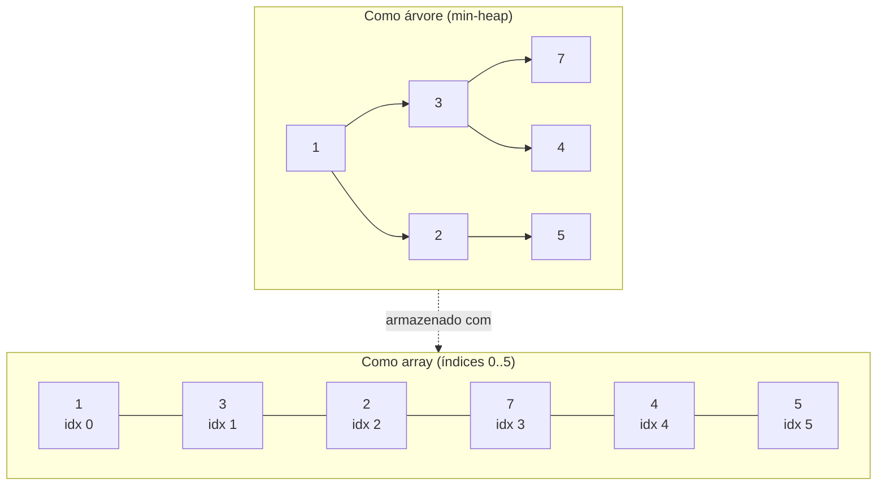
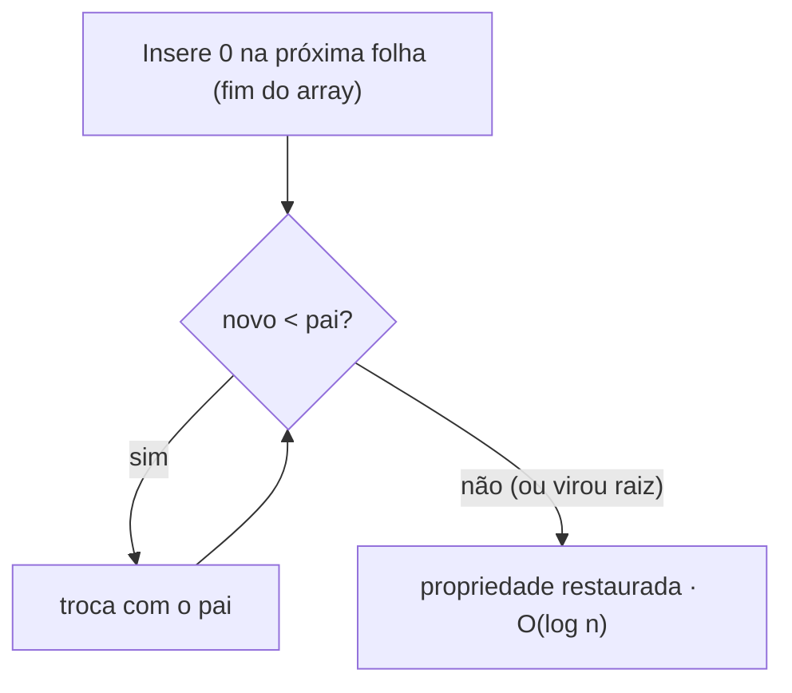
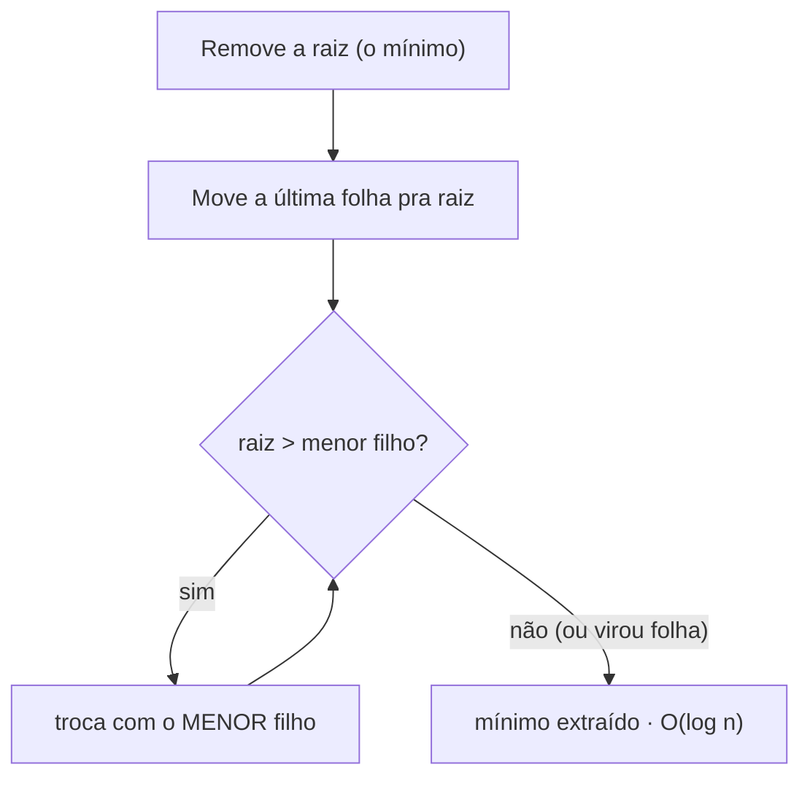
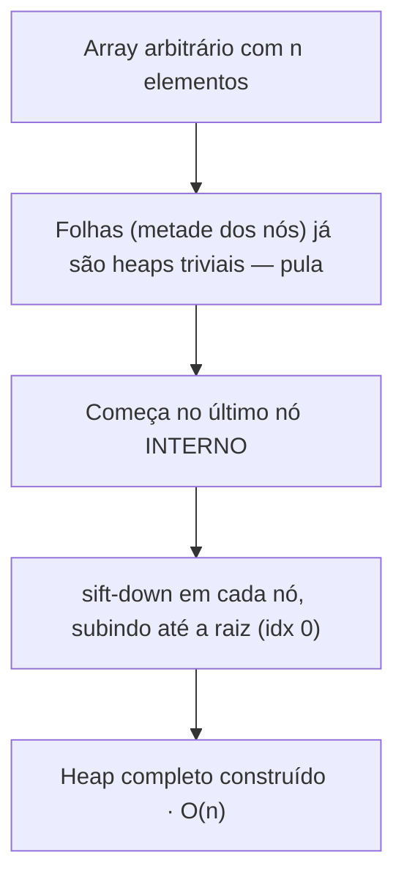
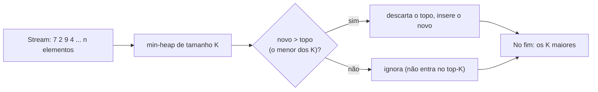
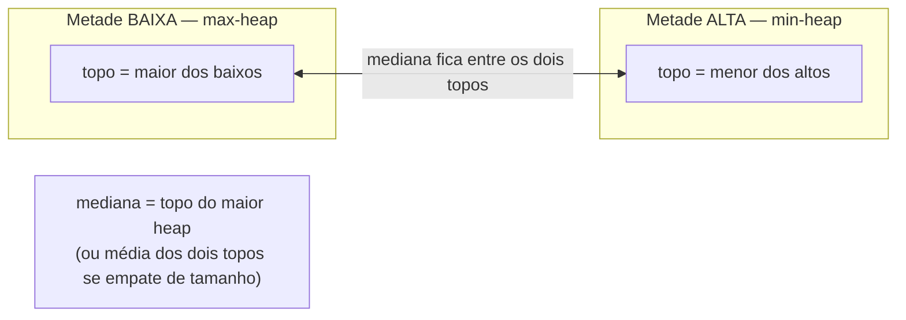

# Heaps e filas de prioridade

Imagine uma fila de pronto-socorro. Quem chega primeiro **não** é atendido primeiro — quem está mais grave é. A ordem de saída não é a ordem de chegada: é a ordem de **prioridade**. Essa é a ideia inteira de uma fila de prioridade, e o heap é a estrutura que a torna eficiente.

Um detalhe que confunde quase todo mundo na primeira vez: o heap **não mantém tudo ordenado**. Ele só garante uma coisa — que o elemento de maior prioridade esteja sempre acessível no topo, em O(1). É um luxo barato comprado com uma promessa muito modesta.

> [!summary] Resumo em uma linha
> Um heap é um **array que você trata como uma árvore**: barato pra pegar o menor (ou maior), barato pra inserir, e ótimo pra "os K melhores" — sem nunca pagar o preço de ordenar tudo.

---

## TL;DR

- **Heap binário** = árvore binária **completa** com a propriedade de heap (min-heap: pai ≤ filhos; max-heap: pai ≥ filhos), guardada num **array**.
- Mapeamento de índices: pai de `i` em `(i-1)/2`, filhos em `2i+1` e `2i+2`. Sem ponteiros.
- **Não é globalmente ordenado.** Só a relação pai/filho vale. Pegar o topo é O(1); listar em ordem custa.
- Operações: `insert`/sift-up O(log n), `extract`/sift-down O(log n), `peek` O(1), **build-heap O(n)** (Floyd, bottom-up — não O(n log n)).
- **Heapsort** O(n log n) in-place, mas não estável e cache-hostil → na prática perde pro quicksort.
- Padrões: **Top-K** (heap de tamanho K, O(n log k)), **mediana em stream** (dois heaps), **merge de K listas**, **Dijkstra/Prim**.
- Linguagens divergem: Java tem classe pronta, Python tem funções sobre uma lista, Go pede que você implemente a interface, JS não tem nada — você constrói.

---

## O que é um heap

Duas regras, só duas:

1. **Forma — árvore binária completa.** Todos os níveis estão cheios, exceto talvez o último, que é preenchido da esquerda pra direita. Sem buracos no meio.
2. **Ordem — a propriedade de heap.** Num min-heap, todo pai é ≤ que seus filhos. Num max-heap, todo pai é ≥. Isso vale ao longo de **cada caminho** raiz→folha, mas **não** entre irmãos ou primos.

> [!warning] O erro clássico
> Heap **não** é uma BST. Numa [[06 - Árvores e árvores de busca|árvore de busca]], `esquerda < nó < direita` — há ordem horizontal. No heap, um filho à esquerda pode ser maior que um neto à direita de outra subárvore. A única garantia é vertical: **o pai domina os filhos**. Por isso o topo é o mínimo (ou máximo) global, mas o resto é parcialmente bagunçado.

### O truque: a árvore vive num array

Como a árvore é **completa**, ela não tem buracos — e isso permite guardá-la num array nível por nível, da esquerda pra direita, sem desperdiçar nenhuma posição. A partir do índice, você navega a árvore com aritmética pura:

- **Pai** de `i`: `(i - 1) / 2` (divisão inteira)
- **Filho esquerdo** de `i`: `2i + 1`
- **Filho direito** de `i`: `2i + 2`

Nada de ponteiros, nada de nós alocados no heap (da memória). Apenas índices. Isso dá ao heap uma **localidade de cache** muito melhor que árvores com ponteiros.



**Leitura do diagrama:** o `1` na raiz (idx 0) tem filhos em `2·0+1 = 1` (o `3`) e `2·0+2 = 2` (o `2`). O `3` (idx 1) tem filhos em idx 3 (`7`) e idx 4 (`4`). Repare que `2` é menor que `3` — irmãos não têm ordem entre si — mas ambos respeitam o pai `1`. O array é a árvore lida nível a nível.

---

## Operações

Toda mutação do heap conserta a propriedade de heap com um de dois movimentos: **subir** um elemento que está pequeno demais pro lugar (sift-up) ou **descer** um que está grande demais (sift-down). Ambos percorrem no máximo a **altura** da árvore — e a árvore é completa, então a altura é O(log n).

### Inserir — sift-up (bubble-up)

Você sempre insere na **próxima folha livre** (fim do array). Aí o elemento pode violar a propriedade — ele é menor que o pai num min-heap. Então ele **sobe**: troca com o pai enquanto for menor, parando quando o pai for menor ou ele virar raiz.



**Leitura do diagrama:** o novo elemento entra embaixo e "borbulha" pra cima trocando de lugar com pais maiores que ele, até encontrar um pai menor ou chegar na raiz. No pior caso ele sobe a altura inteira — log n trocas.

### Extrair o topo — sift-down (bubble-down)

Pra remover o mínimo (a raiz), você não pode simplesmente apagá-la — abriria um buraco. O truque: **promova a última folha pra raiz** (mantendo a árvore completa) e deixe-a **afundar**, trocando sempre com o **menor** dos dois filhos, até nenhum filho ser menor que ela.



**Leitura do diagrama:** a última folha vira raiz provisória e afunda. O detalhe que pega na entrevista: você troca sempre com o **menor** filho (num min-heap), senão você quebraria a propriedade do lado que ficou pra trás. O elemento desce no máximo a altura — log n.

### Build-heap — por que é O(n), não O(n log n)

A intuição ingênua diz: "inserir n elementos, cada um O(log n), logo O(n log n)". Está certo se você **inserir um por um**. Mas há um jeito melhor — o **heapify bottom-up de Floyd**: jogue todos os n elementos num array qualquer e faça `sift-down` partindo do **último nó interno** até a raiz.



**Leitura do diagrama:** o segredo está na **distribuição das alturas**. Metade dos nós são folhas (altura 0, custo zero); um quarto tem altura 1; um oitavo tem altura 2... Os nós caros (perto da raiz, com sift-down longo) são **pouquíssimos**. A soma `Σ (n/2^(h+1))·h` converge para uma constante vezes n. Ou seja: a maioria esmagadora dos nós afunda pouco ou nada. O total é **O(n)** — provadamente, não por sorte.

> [!tip] Por que isso importa
> Se você vai construir um heap a partir de um array que já tem em mãos, **nunca** insira elemento por elemento. Use o heapify de Floyd e economize o fator log n. Em Python é `heapq.heapify(lista)`; em Go é `heap.Init(h)`; em Java o construtor `new PriorityQueue<>(collection)` já faz isso por você.

---

## Heapsort

Tem um algoritmo de ordenação escondido aqui. **Heapsort**:

1. `build-heap` no array — O(n).
2. Extraia o mínimo n vezes; cada extração é O(log n) → O(n log n).

In-place (a "região ordenada" cresce no fim do mesmo array, à medida que você troca a raiz com a última posição não-ordenada e encolhe o heap), O(n log n) garantido até no pior caso. Parece perfeito. Por que então quase ninguém usa?

> [!warning] Heapsort na vida real
> Dois problemas. (1) **Não é estável** — elementos iguais podem trocar de ordem relativa, o que importa quando você ordena por chave secundária. (2) **É cache-hostil**: o sift-down salta entre `i`, `2i+1`, `2i+2` — endereços distantes na memória, péssimo pra pré-fetch. O quicksort, com seu padrão de acesso sequencial, costuma ser **2-3× mais rápido na prática** apesar do pior caso O(n²). Por isso o `Arrays.sort` de objetos em Java usa TimSort (estável), e o de primitivos usa dual-pivot quicksort — heapsort entra só como fallback anti-pior-caso dentro do **introsort** de algumas libs C++.

O valor do heap não é ordenar tudo. É **te dar o melhor agora**, repetidamente, sem ordenar tudo.

---

## Padrões

### Top-K — o pão com manteiga

Você tem um stream de n elementos e quer os **K maiores**. O reflexo ingênuo é ordenar tudo (O(n log n)) e pegar os primeiros K. Desperdício: você ordenou n-K elementos que vai jogar fora.

A jogada certa: mantenha um **heap de tamanho K**. Para os K maiores, use um **min-heap** — o topo é o menor dos seus candidatos. Para cada novo elemento: se ele é maior que o topo, descarte o topo e insira o novo. O heap nunca passa de K elementos.



**Leitura do diagrama:** o min-heap guarda os K melhores até agora, e seu topo é "o pior dos bons" — o porteiro. Qualquer recém-chegado só entra se for melhor que o porteiro, e ao entrar expulsa justamente o porteiro. Cada operação custa O(log k), e há n elementos → **O(n log k)**. Quando K ≪ n, isso é dramaticamente melhor que O(n log n).

> [!note] Min-heap pra achar os MAIORES?
> Sim, e isso confunde. Pra manter os K **maiores**, o heap precisa expulsar o **menor** com eficiência — logo o menor tem que estar no topo, ou seja, **min-heap**. Espelhe a lógica pra os K menores (max-heap). É contra-intuitivo até você ver o porquê: o topo é quem está na "berlinda" pra ser eliminado.

### Mediana em stream — dois heaps

Como manter a **mediana** de uma sequência que cresce, sem reordenar a cada número novo? Truque elegante: parta os dados em duas metades e guarde cada uma num heap.

- **Metade de baixo** num **max-heap** (o topo é o maior da metade baixa).
- **Metade de cima** num **min-heap** (o topo é o menor da metade alta).
- Mantenha os tamanhos balanceados (diferem em no máximo 1).



**Leitura do diagrama:** os dois topos são os elementos "do meio" da sequência. Se os heaps têm tamanhos iguais, a mediana é a média dos dois topos; se um é maior, a mediana é o topo dele. Inserir é O(log n) (coloca no heap certo, depois rebalanceia movendo um topo pro outro lado se preciso), e ler a mediana é O(1). Sem nunca ordenar a sequência inteira.

### Outros padrões (gesto rápido)

- **Merge de K listas ordenadas**: um min-heap com o "cabeça" de cada lista; extraia o menor, avance aquela lista, repita. O(N log k) pra N elementos no total.
- **Dijkstra / Prim**: a priority queue escolhe sempre o próximo vértice de menor distância. O algoritmo em si mora em [[11 - Grafos - travessia e algoritmos]] — aqui só importa que o motor é um heap.
- **Simulação de eventos / scheduling**: heap ordenado por timestamp do próximo evento; sempre processa o evento mais iminente.

---

## Heaps avançados e o abismo do decrease-key

O heap binário é o cavalo de batalha, mas há variações.

- **d-ário (d-ary heap)**: cada nó tem **d** filhos em vez de 2. Árvore mais rasa (`log_d n`), então `insert`/decrease-key fica mais barato — ao custo de `extract` mais caro (comparar d filhos). Usado quando há muito mais inserções que extrações.
- **Heap binomial / de Fibonacci**: estruturas mais sofisticadas que dão **merge eficiente** e, no caso do Fibonacci, **decrease-key em O(1) amortizado**.

Por que decrease-key importa? Dijkstra com heap de Fibonacci atinge o limite teórico **O(E + V log V)** justamente porque cada relaxamento de aresta (que diminui a distância de um vértice) é O(1) amortizado. Com heap binário, decrease-key é O(log V), e o limite fica O((V+E) log V). (Detalhe em [[11 - Grafos - travessia e algoritmos]].)

> [!warning] O abismo: stdlib não te dá decrease-key
> Aqui mora a pegadinha de senioridade. **A maioria das filas de prioridade de biblioteca-padrão não expõe decrease-key.** O `PriorityQueue` do Java não tem; o `heapq` do Python não tem. Você não consegue dizer "ei, a prioridade daquele elemento lá no meio caiu, reposicione-o" em O(log n) — porque você nem **acha** o elemento sem busca linear. Workarounds: (a) **lazy deletion** — insira a nova entrada e ignore a velha quando ela aparecer no topo (marca como obsoleta); (b) **remove + re-add** (O(n) pelo `remove(Object)`). A exceção honrosa é **Go**, cujo `container/heap` expõe `heap.Fix(h, i)` — decrease-key de verdade, se você souber o índice. Na prática, Dijkstra de produção quase sempre usa lazy deletion, e o ganho teórico do Fibonacci raramente aparece (constantes altas).

---

## Implementações comparadas: Java · TypeScript · Python · Go

A ideia é a mesma em toda parte; o que muda radicalmente é a **ergonomia**.

### Java — classe pronta, min-heap por padrão

`PriorityQueue` é um **heap binário de mínimo** (ordem natural ou um `Comparator`). `offer`/`poll` são O(log n), `peek` é O(1).

```java
// Min-heap (padrão)
PriorityQueue<Integer> minHeap = new PriorityQueue<>();
minHeap.offer(5);
minHeap.offer(1);
minHeap.offer(3);
minHeap.peek();  // 1  — O(1)
minHeap.poll();  // 1  — remove, O(log n)

// Max-heap: inverta o comparador
PriorityQueue<Integer> maxHeap = new PriorityQueue<>(Comparator.reverseOrder());

// Por campo de um objeto
PriorityQueue<Medico> porNota =
    new PriorityQueue<>(Comparator.comparingDouble(Medico::getNota));

// Build-heap O(n): passar uma coleção pronta ao construtor
PriorityQueue<Integer> h = new PriorityQueue<>(List.of(7, 2, 9, 4));
```

> [!info] Pegadinhas do Java
> - **Sem decrease-key.** Pra mudar a prioridade de um elemento existente: `remove(obj)` (O(n), busca linear) + `offer` de novo. Ou lazy deletion.
> - **`remove(Object)` e `contains(Object)` são O(n).** Só `offer`/`poll`/`add` são O(log n); `peek`/`size` são O(1).
> - **Não é thread-safe.** Pra concorrência, use `PriorityBlockingQueue`.
> - **Sem `Comparator` e elementos não-`Comparable`** → `ClassCastException` em runtime, não em compilação.

### TypeScript / JS — não existe, você constrói

JS/TS **não têm heap nativo**. É o exercício clássico de entrevista "implemente um heap". Eis um binário genérico, array-based:

```typescript
class BinaryHeap<T> {
  private heap: T[] = [];
  // less(a, b) = true se 'a' tem mais prioridade (sai antes)
  constructor(private less: (a: T, b: T) => boolean) {}

  size(): number { return this.heap.length; }
  peek(): T | undefined { return this.heap[0]; }

  push(value: T): void {
    this.heap.push(value);
    this.siftUp(this.heap.length - 1);
  }

  pop(): T | undefined {
    const top = this.heap[0];
    const last = this.heap.pop()!;
    if (this.heap.length > 0) {
      this.heap[0] = last;
      this.siftDown(0);
    }
    return top;
  }

  private siftUp(i: number): void {
    while (i > 0) {
      const parent = (i - 1) >> 1;
      if (!this.less(this.heap[i], this.heap[parent])) break;
      [this.heap[i], this.heap[parent]] = [this.heap[parent], this.heap[i]];
      i = parent;
    }
  }

  private siftDown(i: number): void {
    const n = this.heap.length;
    while (true) {
      let smallest = i;
      const l = 2 * i + 1, r = 2 * i + 2;
      if (l < n && this.less(this.heap[l], this.heap[smallest])) smallest = l;
      if (r < n && this.less(this.heap[r], this.heap[smallest])) smallest = r;
      if (smallest === i) break;
      [this.heap[i], this.heap[smallest]] = [this.heap[smallest], this.heap[i]];
      i = smallest;
    }
  }
}

// min-heap: const h = new BinaryHeap<number>((a, b) => a < b);
// max-heap: const h = new BinaryHeap<number>((a, b) => a > b);
```

Em produção, em vez de reimplementar, pegue uma lib (`heap-js`, `@datastructures-js/priority-queue`). Mas em entrevista, saber escrever os 30 linhas acima é o ponto.

### Python — funções sobre uma lista comum (`heapq`)

Python não tem **classe** de heap. Tem o módulo `heapq`: um punhado de **funções que operam sobre uma `list` qualquer**, tratando-a como um min-heap. E é **só min-heap**.

```python
import heapq

h = []
heapq.heappush(h, 5)
heapq.heappush(h, 1)
heapq.heappush(h, 3)
h[0]            # 1  — o mínimo, O(1) (apenas olhar)
heapq.heappop(h)  # 1  — remove o mínimo, O(log n)

# Build-heap O(n) a partir de uma lista existente
nums = [7, 2, 9, 4]
heapq.heapify(nums)   # vira min-heap in-place

# Combos úteis (mais rápidos que push + pop separados)
heapq.heapreplace(h, 8)   # pop o menor, depois push 8
heapq.heappushpop(h, 8)   # push 8, depois pop o menor

# Top-K direto, sem montar heap na mão — O(n log k)
heapq.nlargest(3, nums)
heapq.nsmallest(3, nums)
heapq.merge(lista_a, lista_b)  # merge preguiçoso de iteráveis ordenados
```

> [!info] Max-heap e empates em Python
> - **Só min-heap.** Pra max-heap: negue as chaves (`heappush(h, -x)`) ou use tuplas `(-prioridade, item)`.
> - **Empate de prioridade compara o payload.** Se dois itens têm a mesma prioridade, o heap tenta comparar o segundo campo da tupla — e estoura `TypeError` se o payload não for comparável. Solução canônica: um **contador monotônico** como desempate → `(prioridade, contador, item)`. O contador nunca empata, então o item nunca é comparado.
> - **`queue.PriorityQueue`** é um wrapper thread-safe (com locks) por cima do `heapq`, pra produtor-consumidor.

### Go — você implementa a interface (`container/heap`)

Go é o oposto do Java: nada de classe pronta. `container/heap` é uma **interface algorítmica**. Você fornece o armazenamento implementando `sort.Interface` (`Len`/`Less`/`Swap`) mais `Push`/`Pop`, e o pacote chama **seus** métodos.

```go
import "container/heap"

type Item struct {
    value    string
    priority int
    index    int // posição no heap — necessária pra heap.Fix
}

type PriorityQueue []*Item

func (pq PriorityQueue) Len() int { return len(pq) }
func (pq PriorityQueue) Less(i, j int) bool {
    return pq[i].priority > pq[j].priority // > = max-heap por priority
}
func (pq PriorityQueue) Swap(i, j int) {
    pq[i], pq[j] = pq[j], pq[i]
    pq[i].index = i
    pq[j].index = j
}
func (pq *PriorityQueue) Push(x any) {
    item := x.(*Item)
    item.index = len(*pq)
    *pq = append(*pq, item)
}
func (pq *PriorityQueue) Pop() any {
    old := *pq
    n := len(old)
    item := old[n-1]
    old[n-1] = nil
    *pq = old[:n-1]
    return item
}

// Uso — note: chame as funções heap.X, não os métodos diretamente
pq := PriorityQueue{}
heap.Init(&pq)                       // build-heap O(n)
heap.Push(&pq, &Item{value: "a", priority: 3})
top := heap.Pop(&pq).(*Item)

// decrease-key / update — a vantagem do Go:
item.priority = 10
heap.Fix(&pq, item.index)            // O(log n), de verdade
```

> [!info] Pegadinhas do Go
> - **Verboso** — você escreve cinco métodos antes de inserir o primeiro item. Mas ganha controle total.
> - **`Push`/`Pop` que você escreve ≠ `heap.Push`/`heap.Pop`.** Os seus mexem no slice; os do pacote orquestram sift-up/down chamando os seus. Sempre chame os do pacote.
> - **Tem decrease-key real**: `heap.Fix(h, i)` reposiciona o elemento `i` em O(log n) — por isso o exemplo guarda o `index` em cada item.

### Síntese de senioridade

Um heap é "um array que você trata como uma árvore". O algoritmo (sift-up/down, build-heap O(n)) é universal. O que diverge é **quanto a linguagem te entrega pronto**:

| | Java | Python | Go | TS/JS |
|---|---|---|---|---|
| O que você recebe | classe `PriorityQueue` | funções sobre `list` | interface pra implementar | nada |
| Min ou max | min (max via comparator) | **só min** (negue p/ max) | você decide no `Less` | você decide |
| decrease-key | não (remove+add O(n)) | não (lazy deletion) | **sim, `heap.Fix`** | você implementa |
| Thread-safe | `PriorityBlockingQueue` | `queue.PriorityQueue` | não (proteja você) | n/a |

---

## Na prática (da minha experiência)

> No MedEspecialista, um endpoint precisava retornar os **10 médicos mais bem avaliados**. Em vez de carregar o resultado inteiro do banco e fazer um sort completo, usei um `PriorityQueue` de **tamanho fixo 10 como min-heap**: iterava o resultado mantendo só os top-10 — quando o heap passava de 10, eu fazia `poll` do menor (o topo do min-heap). Isso transformou um O(n log n) num **O(n log k)** com k = 10. Para n grande, é a diferença entre tocar todos os elementos uma vez com um logaritmo minúsculo (log 10 ≈ 3,3) versus pagar log n por elemento.

A lição que ficou: o heap não foi escolhido pra "ordenar os médicos" — foi escolhido pra **nunca ordenar mais do que os 10 que importam**. Esse é o instinto de Top-K na vida real.

---

## Em entrevista

A frase que demonstra que você entende a estrutura, não só decorou a API:

> "A heap gives me the min — or max — in O(1), and insert and extract in O(log n), without ever fully sorting the data. That's the whole point: I pay only for the ordering I actually consume. So for a top-K problem — say, the ten highest-rated doctors out of a million rows — I keep a **min-heap of size K** instead of sorting everything. Sorting is O(n log n); the size-K heap is **O(n log k)**, and with k far smaller than n that's a real win.
>
> The thing people get wrong is thinking a heap is sorted — it isn't. It only guarantees the **parent-child** relationship along each path, which is exactly why peeking the top is constant time but listing in order costs you. And it's just an **array under the hood** — parent at `(i-1)/2`, children at `2i+1` and `2i+2` — so it's cache-friendly, no pointers.
>
> One subtlety I watch for: most standard libraries — Java's `PriorityQueue`, Python's `heapq` — don't expose **decrease-key**. So in something like Dijkstra I use **lazy deletion** instead of trying to reposition an element in place. Go is the exception with `heap.Fix`."

Frases-gancho:

- "I'd reach for a heap whenever I need *the best element repeatedly*, but not the full ordering."
- "Building a heap from an existing array is **O(n)**, not O(n log n) — that's Floyd's bottom-up heapify."
- "For a streaming median I'd run **two heaps**: a max-heap for the lower half and a min-heap for the upper half."

**Vocabulário-chave:**

- fila de prioridade → priority queue
- heap de mínimo / máximo → min-heap / max-heap
- árvore binária completa → complete binary tree
- propriedade de heap → heap property / heap invariant
- subir / descer (restaurar a propriedade) → sift-up (bubble-up) / sift-down (bubble-down)
- construção do heap → heapify / build-heap
- extrair o mínimo → extract-min / poll
- os K maiores → top-K
- decrementar a chave → decrease-key

---

## Referências

- [PriorityQueue (Java Platform SE 8)](https://docs.oracle.com/javase/8/docs/api/java/util/PriorityQueue.html) — heap binário de mínimo; O(log n) para `offer`/`poll`; **O(n) para `remove(Object)`/`contains`**; O(1) para `peek`/`size`; não sincronizado.
- [Java PriorityBlockingQueue (thread-safe)](https://topdeveloperacademy.com/articles/java-priorityblockingqueue-thread-safe-and-memory-efficient-concurrent-heap) — alternativa concorrente ao `PriorityQueue`; confirma ausência de decrease-key (remove + re-add).
- [heapq — Heap queue algorithm (Python docs)](https://docs.python.org/3/library/heapq.html) — funções sobre uma `list`; **min-heap only**; `heappush`/`heappop` O(log n), `heapify` O(n); `nlargest`/`nsmallest` O(n log k); `heapreplace`/`heappushpop`/`merge`.
- [The Python heapq Module — Real Python](https://realpython.com/python-heapq-module/) — max-heap via negação, desempate por contador, `queue.PriorityQueue` como wrapper thread-safe.
- [container/heap (Go pkg.go.dev)](https://pkg.go.dev/container/heap) — interface (`Len`/`Less`/`Swap` + `Push`/`Pop`); `heap.Init`/`Push`/`Pop`/`Fix`; `Fix` = decrease-key em O(log n), equivalente mais barato a `Remove`+`Push`; exemplo canônico de `PriorityQueue`.
- [Implementing a Priority Queue in Go Using container/heap — Leapcell](https://leapcell.io/blog/implementing-a-priority-queue-in-go-using-container-heap) — padrão de guardar `index` no item pra `heap.Fix`.
- Build-heap O(n) via Floyd (bottom-up sift-down): soma `Σ (n/2^(h+1))·h` converge para O(n) — fundamento clássico (Sedgewick, *Algorithms*; CLRS cap. 6).
- [Visualgo — Heap](https://visualgo.net/en/heap) — visualização interativa de sift-up/down e heapify.

---

## Veja também

- [[04 - Pilhas, filas e deques]] — o heap é uma fila cuja ordem de saída é prioridade, não chegada
- [[06 - Árvores e árvores de busca]] — por que heap ≠ BST (ordem vertical vs horizontal)
- [[11 - Grafos - travessia e algoritmos]] — Dijkstra e Prim usam a priority queue como motor; o abismo do decrease-key
- [[Dicionário de Fundamentos]]
