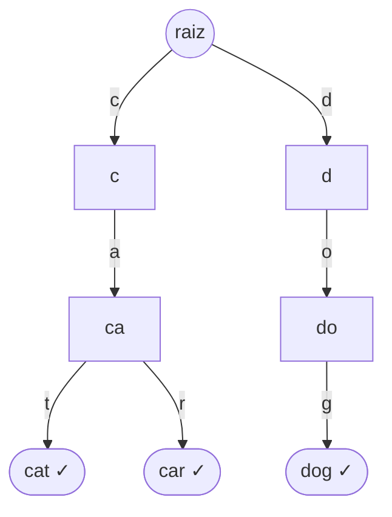
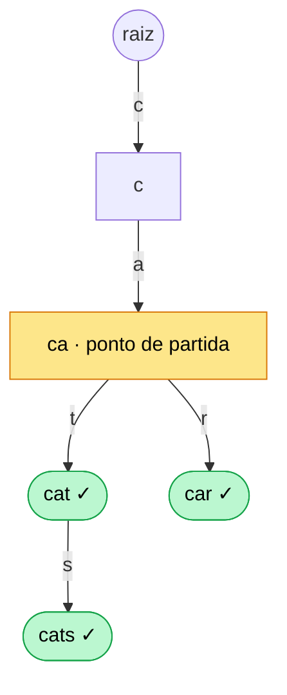
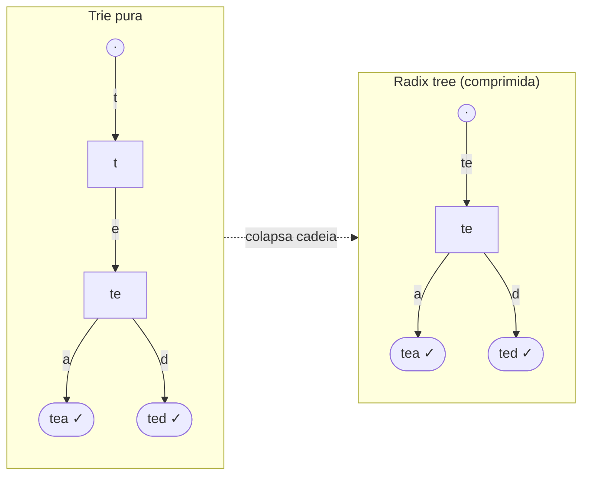
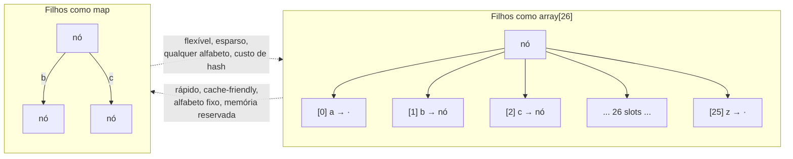

# Tries

Quando o problema diz "autocomplete", "busca por prefixo" ou "qual a rota mais específica para este IP", existe uma estrutura que faz isso de forma natural — e que **nenhuma das quatro stdlibs te entrega pronta**. Você constrói. A trie é a estrutura canônica do tipo "você implementa na hora", e a decisão de design que separa o júnior do sênior nela é sempre a mesma: como representar os filhos de um nó.

> [!summary] Resumo em uma linha
> Uma trie é uma árvore onde o **caminho** da raiz até um nó soletra um prefixo, as operações custam **O(L)** (L = tamanho da chave, não o número de chaves), e ela te dá prefixo/ordem/casamento-mais-longo que um hash não dá — pagando em **espaço**.

> [!tip] TL;DR
> - **O que é:** árvore de caracteres; o caminho raiz→nó é um prefixo; um flag marca fim-de-palavra.
> - **Custo:** busca/inserção/remoção em **O(L)**, independente de quantas chaves existem.
> - **Por que não um hash:** trie dá **consulta por prefixo**, **percurso ordenado** e **longest-prefix-match**; hash não.
> - **O preço:** espaço — muitos nós esparsos, ponteiro atrás de ponteiro (ruim de cache).
> - **Variante que salva memória:** **radix tree / Patricia trie** (colapsa cadeias de filho-único).
> - **Decisão de design:** filhos como **array** (rápido, alfabeto fixo, gasta memória) vs **map/dict** (flexível, qualquer alfabeto). Mesma decisão nas 4 linguagens.

---

## O que é

Uma trie (de re**trie**val, mas pronuncia-se "try") é uma árvore onde **cada aresta representa um caractere**. Você não guarda a string inteira em cada nó — você guarda *um caractere por nível*, e a string emerge do caminho percorrido.

A raiz é a string vazia. Descer pela aresta `c` te leva ao prefixo `"c"`; de lá, descer por `a` te leva a `"ca"`; e assim por diante. Um nó carrega um **flag de fim-de-palavra** (`isWord`, `isEnd`) que diz "este prefixo também é uma palavra completa que foi inserida".

> [!note] A sacada do custo
> Buscar `"cat"` numa trie é **O(3)** — três passos, um por caractere. Não importa se a trie guarda 10 palavras ou 10 milhões. O custo é **O(L)**, governado pelo *comprimento da chave*, nunca pela *quantidade de chaves*. Isso é fundamentalmente diferente de uma árvore de busca, onde o custo é O(log n) no número de elementos.

Repare na economia de prefixos: `"cat"` e `"car"` compartilham os nós de `c` e `a`. Quanto mais as suas chaves compartilham prefixos, menos nós a trie precisa.



> [!example] Leitura do diagrama
> Cada aresta é rotulada com um caractere. O nó `ca` é **compartilhado** entre `cat` e `car` — inserir as duas palavras não duplicou o prefixo. Os nós com `✓` têm o flag de fim-de-palavra ligado: `cat`, `car` e `dog` são palavras completas. O nó `ca` *não* tem o flag — `"ca"` é um prefixo válido, mas ninguém inseriu a palavra `"ca"`.

---

## Por que não um hash?

Um `HashMap<String, V>` também faz lookup de string em O(L) (precisa hashear a string toda, que custa O(L)). Então por que não usar sempre o hash, que é mais simples e cache-friendly?

Porque o hash **destrói a estrutura do prefixo**. Ao hashear `"cat"`, o valor resultante não tem nenhuma relação com o hash de `"ca"` ou de `"cats"`. A trie preserva essa vizinhança, e isso habilita três coisas que o hash não consegue:

> [!abstract] O que a trie dá e o hash não
> 1. **Consulta por prefixo** — "todas as palavras que começam com `ca`". Na trie, você desce até o nó `ca` e coleta a subárvore. No hash, você teria que varrer *todas* as chaves.
> 2. **Percurso ordenado** — um DFS em ordem alfabética dos filhos emite as chaves em **ordem lexicográfica**, de graça. Hash não tem ordem.
> 3. **Longest-prefix-match (LPM)** — "qual o prefixo armazenado mais longo que casa com esta entrada?". Você desce o máximo que conseguir e lembra do último fim-de-palavra visto. É a operação que faz tabelas de roteamento IP funcionarem.

A consulta por prefixo é a que move o autocomplete: digite `ca`, desça até o nó `ca`, e colete tudo abaixo.



> [!example] Leitura do diagrama
> O usuário digitou `ca`. Você **caminha** os dois caracteres até o nó destacado em amarelo — isso é O(2). A partir dele, um percurso (DFS/BFS) da **subárvore inteira** coleta todas as completações: `cat`, `cats`, `car` (em verde). O custo total é O(comprimento do prefixo + tamanho da resposta) — exatamente o que você quer de um typeahead. Num hash, não existe "subárvore"; você varreria o keyset inteiro.

> [!warning] O preço é o espaço
> A trie chega a essas operações pagando **memória e cache misses**. Cada nó pode ter um array ou map de filhos, a maioria das posições vazia (esparsidade), e percorrer a estrutura é seguir ponteiro atrás de ponteiro — péssimo para a localidade de cache da CPU. Um hash é um bloco contíguo; a trie é uma teia de nós espalhados no heap.

---

## Variantes: quando a trie pura gasta demais

A trie ingênua tem um desperdício gritante: **cadeias de filho-único**. Se você inseriu só a palavra `"banana"`, a trie pura cria seis nós em fila (`b`→`a`→`n`→`a`→`n`→`a`), cada um com exatamente um filho. Seis nós para guardar uma string que cabe em seis bytes.

### Radix tree / Patricia trie (a mais importante)

A **radix tree** (também chamada **Patricia trie** — *Practical Algorithm To Retrieve Information Coded In Alphanumeric*) resolve isso **colapsando cadeias de filho-único em uma única aresta rotulada com a substring inteira**. Em vez de seis nós para `banana`, você tem uma aresta `banana`.

> [!note] Por que isso importa de verdade
> A compressão não muda o custo assintótico (ainda O(L)), mas reduz **drasticamente** o número de nós e ponteiros — o que melhora memória *e* cache. É por isso que radix trees, não tries puras, são o que roda em produção: tabelas de roteamento IP e o Redis (ver [Usos reais](#usos-reais)).



> [!example] Leitura do diagrama
> À esquerda, a trie pura gasta um nó separado para `t` e outro para `te` — uma cadeia de filho-único, pois depois de `t` só existe um caminho (`e`). À direita, a radix tree **funde** `t` e `e` numa única aresta rotulada `"te"`, porque o ramo só se bifurca em `tea`/`ted`. Menos nós, menos ponteiros, mesma semântica de busca.

### Ternary Search Tree (TST)

Uma **TST** combina trie com BST: cada nó tem três filhos — *menor*, *igual* e *maior* que o caractere do nó. Em vez de um array de 26 ou um map por nó, você navega os filhos como numa árvore de busca binária pelo caractere. Resultado: **bem mais econômica de memória** que a trie de array, ao custo de buscas um pouco mais lentas (você compara caracteres num mini-BST a cada nível). É a estrutura que Sedgewick recomenda quando memória importa.

### Suffix tree / suffix array (gesto)

Para casamento de **substring** (não de prefixo) — "esta cadeia aparece em algum lugar do texto?" — entram **suffix trees** e **suffix arrays**, que indexam *todos os sufixos* de um texto. São a base de busca em texto e de bioinformática (alinhamento de DNA). É um universo próprio; aqui fica só o gesto.

> [!info] DAWG (gesto)
> Um **DAWG** (Directed Acyclic Word Graph) vai além da radix tree e funde também *sufixos* comuns, virando um grafo acíclico em vez de árvore. Compressão máxima de dicionário ao custo de perder a capacidade de associar um valor por chave. Usado em motores de jogos de palavras (Scrabble). Gesto.

---

## Usos reais

A trie sai do exercício de entrevista e vira infraestrutura quando o problema é intrinsecamente sobre prefixos:

> [!example] Onde tries (e radix trees) aparecem em produção
> - **Autocomplete / typeahead** — o caso canônico. Caixa de busca, IDE, terminal.
> - **Corretor ortográfico e filtros de palavra** — "esta palavra existe no dicionário?" em O(L), e sugestões por prefixo.
> - **Tabelas de roteamento IP (longest-prefix-match)** — o roteador escolhe a rota *mais específica* que casa com o IP de destino. Linux usa um **LPC-trie** (level-compressed) para IPv4 e uma **radix tree / Patricia trie** para IPv6; o kernel BSD usa Patricia desde o 4.3 Reno.[^lpm]
> - **Redis** — usa uma **radix tree** (a implementação `rax`, de antirez) internamente para indexar as entradas de **Streams** pelo ID (codificado como chave de 128 bits) e para os consumer groups.[^redis]
> - **T9 / jogos de palavras** — mapear sequências de teclas a palavras, navegar o espaço de palavras válidas.
> - **Compressão de dicionário** — armazenar grandes conjuntos de strings com prefixos compartilhados ocupa menos que N strings soltas.

O fio condutor: sempre que a operação dominante é "casar pelo começo da chave" ou "navegar por prefixos ordenados", a trie (ou sua versão comprimida) é a resposta estrutural.

---

## Implementações comparadas: Java · TypeScript · Python · Go

Aqui o jogo é diferente das outras notas: **nenhuma das quatro stdlibs traz uma trie pronta**. Então não comparamos APIs — comparamos os **idiomas de construção**. E todos convergem para a mesma decisão de design central: **como representar os filhos de um nó**.

> [!abstract] A decisão que atravessa as quatro linguagens
> - **Filhos como array** (`TrieNode[26]`): índice direto (`filho[c - 'a']`), acesso O(1) sem hash, ótimo de cache. Mas **fixa o alfabeto** (26 minúsculas) e reserva 26 slots por nó mesmo que use 2 → desperdício em tries esparsas.
> - **Filhos como map/dict**: aceita **qualquer alfabeto** (Unicode, bytes), aloca só os filhos que existem (economiza em nós esparsos). Mas paga o custo de hash por acesso e perde localidade de cache.
> 
> Essa é a alavanca real de projeto — velocidade vs memória vs tamanho do alfabeto — e é **idêntica** em Java, TS, Python e Go.



> [!example] Leitura do diagrama
> À esquerda, o nó com **array[26]** reserva 26 posições sempre — mesmo usando só `b` e `c`, os outros 24 slots (`·`) ocupam ponteiros à toa, mas o acesso é índice direto (`filho[c-'a']`), sem hash. À direita, o nó com **map** guarda *só* as duas arestas que existem (`b`, `c`) — economiza nos nós esparsos e aceita qualquer alfabeto, ao custo de hashear o caractere a cada passo. As setas tracejadas resumem o trade-off nos dois sentidos.

### Java — array vs Map de filhos

```java
// Variante array: alfabeto fixo (a-z), rápida, mais memória
class TrieNode {
    TrieNode[] children = new TrieNode[26]; // null = ausente
    boolean isWord;
}

class Trie {
    private final TrieNode root = new TrieNode();

    void insert(String word) {
        TrieNode node = root;
        for (char c : word.toCharArray()) {
            int i = c - 'a';
            if (node.children[i] == null) node.children[i] = new TrieNode();
            node = node.children[i];
        }
        node.isWord = true;
    }

    boolean search(String word) {
        TrieNode node = walk(word);
        return node != null && node.isWord;
    }

    boolean startsWith(String prefix) { // consulta por prefixo
        return walk(prefix) != null;
    }

    private TrieNode walk(String s) { // iterativo: sem risco de stack overflow
        TrieNode node = root;
        for (char c : s.toCharArray()) {
            node = node.children[c - 'a'];
            if (node == null) return null;
        }
        return node;
    }
}
```

```java
// Variante Map: alfabeto qualquer, flexível, menos memória em nós esparsos
class TrieNode {
    Map<Character, TrieNode> children = new HashMap<>();
    boolean isWord;
}
// insert: node.children.computeIfAbsent(c, k -> new TrieNode());
```

> O array é o default de entrevista quando o enunciado diz "lowercase English letters" (LeetCode adora isso). O `Map<Character, TrieNode>` é o que você usa quando o alfabeto é grande/desconhecido (Unicode, emojis, paths).

### TypeScript / JavaScript — object ou Map de filhos

```typescript
class TrieNode {
  children: Record<string, TrieNode> = {};   // ou: Map<string, TrieNode>
  isWord = false;
}

class Trie {
  private root = new TrieNode();

  insert(word: string): void {
    let node = this.root;
    for (const ch of word) {
      node.children[ch] ??= new TrieNode(); // cria filho se ausente
      node = node.children[ch];
    }
    node.isWord = true;
  }

  startsWith(prefix: string): boolean {
    let node: TrieNode | undefined = this.root;
    for (const ch of prefix) {
      node = node.children[ch];
      if (!node) return false;
    }
    return true;
  }
}
```

> Em JS, o uso de autocomplete em UI é tão comum que a trie é quase um clássico de front-end. O `{ [ch]: TrieNode }` é o idioma mais enxuto; troca-se por `Map` quando se quer iteração ordenada de inserção ou chaves não-string.

### Python — o "dict trie" idiomático

```python
# A trie de dicionários aninhados — talvez a mais concisa das quatro
class Trie:
    def __init__(self):
        self.root: dict = {}

    def insert(self, word: str) -> None:
        node = self.root
        for ch in word:
            node = node.setdefault(ch, {})  # desce, criando dict se ausente
        node['#'] = True                    # sentinela de fim-de-palavra

    def search(self, word: str) -> bool:
        node = self.root
        for ch in word:
            if ch not in node:
                return False
            node = node[ch]
        return '#' in node

    def starts_with(self, prefix: str) -> bool:
        node = self.root
        for ch in prefix:
            if ch not in node:
                return False
            node = node[ch]
        return True
```

> O idioma Python clássico nem cria uma classe `TrieNode` — cada nó **é** um `dict`, os filhos são as entradas, e uma **chave-sentinela** (`'#'` ou `True`) marca fim-de-palavra. `setdefault` (ou `collections.defaultdict`) faz a inserção em uma linha. Para produção, a lib **`pygtrie`** (Google) entrega tries prontas, incluindo `CharTrie` e `StringTrie`.

### Go — struct com map ou array de filhos

```go
type trieNode struct {
    children map[rune]*trieNode // ou: [26]*trieNode para alfabeto fixo
    isWord   bool
}

func newNode() *trieNode {
    return &trieNode{children: make(map[rune]*trieNode)}
}

type Trie struct{ root *trieNode }

func (t *Trie) Insert(word string) {
    node := t.root
    for _, ch := range word { // range sobre string itera runes (Unicode-safe)
        next, ok := node.children[ch]
        if !ok {
            next = newNode()
            node.children[ch] = next
        }
        node = next
    }
    node.isWord = true
}

func (t *Trie) StartsWith(prefix string) bool {
    node := t.root
    for _, ch := range prefix {
        next, ok := node.children[ch]
        if !ok {
            return false
        }
        node = next
    }
    return true
}
```

> Em Go as arestas são **ponteiros** (`*trieNode`) e o idioma é o `next, ok := m[k]` para checar ausência. `map[rune]*trieNode` lida com Unicode naturalmente (range sobre string entrega runes); `[26]*trieNode` é a versão rápida de alfabeto fixo, com nil checks no lugar do `ok`.

> [!quote] Síntese de sênior
> A trie é a estrutura "**você constrói**" por excelência — nenhuma stdlib te dá uma, então em toda linguagem você cai na mesma escolha de modelagem: **array de filhos** (rápido, cache-friendly, alfabeto fixo, memória reservada) vs **map/dict de filhos** (flexível, qualquer alfabeto, esparso). Reconhecer que essa é a alavanca de projeto — e não a sintaxe da linguagem — é o que mostra maturidade. E saber que a versão de produção é a **radix tree** (cadeias colapsadas) fecha o raciocínio.

---

## Custo de espaço e quando (não) usar

O calcanhar de Aquiles da trie é a memória. No pior caso, com filhos em array, o espaço é **O(alfabeto × número-de-nós)** — cada nó reserva um slot por símbolo do alfabeto, a maioria vazia.

> [!warning] O trade-off de filhos, em números
> Um nó com `TrieNode[26]` num sistema de 64 bits reserva **26 ponteiros = ~208 bytes**, mesmo que use só dois filhos. Num dicionário grande e esparso, isso explode. O `Map`/`dict` aloca só os filhos presentes, mas paga overhead de hash e perde cache. A **radix tree** é o que reconcilia: menos nós no total. É por isso que a versão comprimida domina em produção.

Use trie quando:

- A operação dominante é **prefixo, ordem lexicográfica ou longest-prefix-match**.
- As chaves **compartilham muitos prefixos** (a economia de nós compensa).
- Você precisa de **autocomplete, roteamento, ou dicionário** com essas operações.

Não use quando:

- Você só precisa de **lookup exato** por chave → um `HashMap` é mais simples, mais rápido e mais cache-friendly.
- As chaves **não compartilham prefixos** (a trie vira uma coleção de cadeias longas e magras, puro desperdício) → considere radix/TST, ou volte ao hash.
- Memória é apertada e o alfabeto é grande → array de filhos é proibitivo; vá de map, TST ou radix.

> [!caution] Honestidade sobre o lastro
> Tudo aqui — anatomia da trie, O(L), array-vs-map de filhos, radix/Patricia, TST — é material consolidado de estruturas de dados (Sedgewick, CLRS). Os pontos que dependem de **detalhe de implementação real** e foram verificados na web estão marcados com nota de rodapé: o uso de radix/Patricia em roteamento IP no Linux/BSD[^lpm] e a radix tree (`rax`) interna do Redis Streams[^redis]. Suffix trees, DAWG e bioinformática entram como **gesto** — não foram aprofundados aqui de propósito.

---

## Em entrevista

A trie aparece em duas formas: como **resposta de pattern** ("autocomplete / busca por prefixo" → trie) e como **problema de implementação** ("implemente uma trie", LeetCode 208). Saber verbalizar o trade-off vale mais que recitar a definição.

> [!quote] How to explain it in English
> "A trie is a tree where each edge is a character, so the **path** from the root spells out a prefix. The key property is that lookups, inserts and deletes are **O(L)** — proportional to the length of the key, *not* to the number of keys stored. That's what makes it shine for autocomplete: I walk the typed prefix in O(L), then collect the subtree below it.
> 
> I'd reach for a trie over a hash map specifically when I need **prefix queries**, **ordered traversal**, or **longest-prefix matching** — none of which a hash map gives you, because hashing destroys the structure of the key. The cost is **space**: tries have many sparse nodes and poor cache locality.
> 
> The core design decision is how to store a node's children: a **fixed-size array** — say `TrieNode[26]` — is fast and cache-friendly but locks you to one alphabet and wastes memory; a **map** handles any alphabet and only allocates the children that exist, but pays hashing cost. In production you usually want a **compressed trie — a radix tree, also called a Patricia trie** — which collapses single-child chains into a single edge. That's what IP routing tables use for longest-prefix match, and what Redis uses internally for its streams."

> [!tip] Frases úteis
> - "The cost is O(L), the length of the key — independent of how many keys are stored."
> - "A hash map can't do prefix queries because hashing destroys the key's structure."
> - "The real design lever is array-vs-map children: speed and cache versus memory and alphabet size."
> - "In production I'd use a radix tree — a Patricia trie — to collapse the single-child chains."
> - "It's the canonical 'you build it yourself' structure — no standard library ships one."

### Vocabulário-chave

- árvore de prefixos → trie / prefix tree
- nó-caractere → character node
- fim-de-palavra (flag) → end-of-word marker / terminal flag
- busca por prefixo → prefix search / prefix query
- autocompletar → autocomplete / typeahead
- trie comprimida → compressed trie / radix tree
- árvore Patricia → Patricia trie
- casamento de prefixo mais longo → longest-prefix match (LPM)
- cadeia de filho-único → single-child chain
- filhos como array / como mapa → array-backed / map-backed children
- tamanho do alfabeto → alphabet size
- nó esparso → sparse node
- localidade de cache → cache locality

---

## Referências

[^lpm]: Vincent Bernat, ["IPv4 route lookup on Linux"](https://vincent.bernat.ch/en/blog/2017-ipv4-route-lookup-linux) e ["IPv6 route lookup on Linux"](https://vincent.bernat.ch/en/blog/2017-ipv6-route-lookup-linux) — Linux usa um *level-compressed trie* (LPC-trie) para IPv4 e uma *radix tree / Patricia trie* para IPv6; Patricia é usada em roteamento desde o kernel BSD 4.3 Reno. Conceito de *longest-prefix match*: [Tree/Trie IP and Forwarding Lookups](https://null.53bits.co.uk/page/tree-trie).

[^redis]: antirez, [`rax` — A radix tree implementation in ANSI C](https://github.com/antirez/rax); ["How Redis Streams Work Internally (Radix Tree)"](https://oneuptime.com/blog/post/2026-03-31-redis-streams-work-internally-radix-tree/view) — Redis Streams indexam entradas por ID (chave de 128 bits) numa radix tree cujas folhas são *listpacks*; outra radix tree guarda os consumer groups.

- Robert Sedgewick & Kevin Wayne, *Algorithms, 4th ed.* — cap. de Tries (R-way tries, TSTs).
- CLRS, *Introduction to Algorithms* — radix trees / tries.
- [pygtrie](https://github.com/google/pygtrie) — biblioteca de tries em Python (Google).
- [Visualgo](https://visualgo.net/) — visualização interativa.

## Veja também

- [[06 - Árvores e árvores de busca]] — a estrutura-pai; BST, balanceamento, heap
- [[05 - Tabelas hash]] — a alternativa para lookup exato (sem prefixo/ordem)
- [[09 - Árvores B e índices]] — outra árvore multi-way, mas otimizada para disco
- [[Dicionário de Ciência da Computação]]
