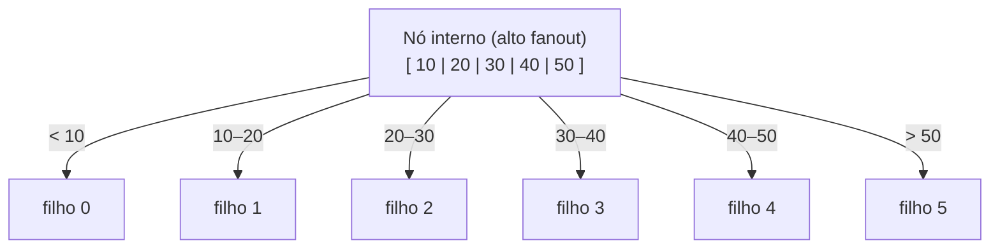
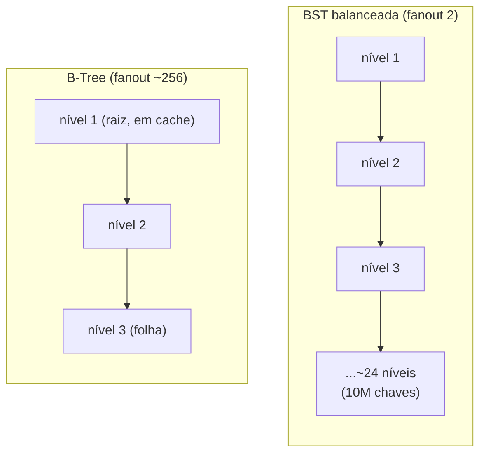
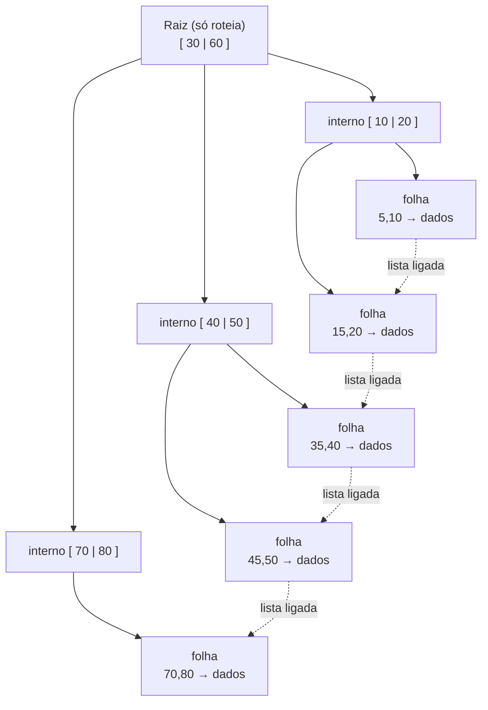
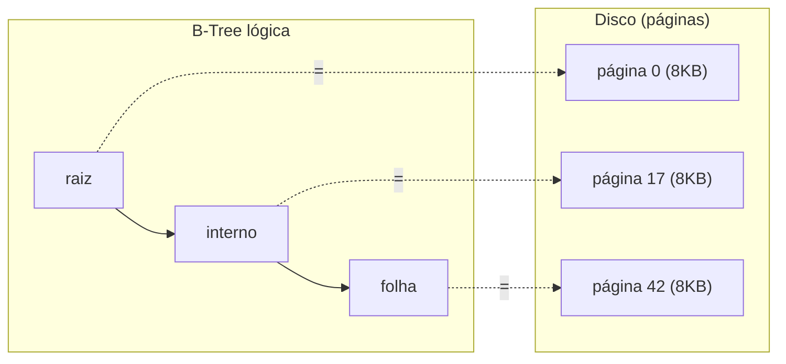
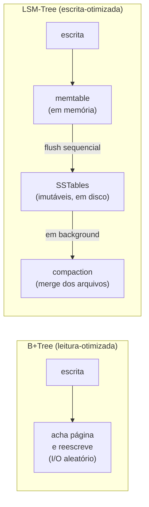

# Árvores B e índices

Você quase nunca vai escrever uma B-Tree na mão. Mas você *usa* uma todos os dias — toda vez que faz `CREATE INDEX`, toda vez que um `WHERE id = 42` retorna em milissegundos sobre uma tabela de milhões de linhas. A B-Tree é a estrutura que faz o banco de dados ser rápido. Entender por que ela existe é entender por que índices funcionam.

Esta nota é menos sobre a árvore em si e mais sobre **onde você a encontra**: o índice do seu banco. A pergunta de entrevista raramente é "implemente uma B-Tree" — é "por que este índice ajudou?" ou "por que aquele não foi usado?".

> [!info] Pré-requisito
> Esta nota assume que você já conhece [[06 - Árvores e árvores de busca]] (BST, árvores balanceadas). A B-Tree é a evolução da BST para o mundo do disco.

## TL;DR

- **B-Tree** = árvore de busca **multi-way balanceada**: cada nó guarda **muitas chaves e muitos filhos** (alto *fanout*). Todas as folhas na mesma profundidade.
- **Por quê?** Minimizar a **altura** minimiza o **I/O de disco**. Cada nó é uma **página de disco**; uma árvore de milhões de chaves tem só 3–4 níveis. Cada nível = um acesso a disco.
- **B+Tree** = variante onde **todos os dados ficam só nas folhas**; nós internos só roteiam (chaves). **Folhas ligadas em lista** → *range scans* eficientes. É o que a maioria dos índices de banco usa.
- Operações em **O(log_b n)** (b = fanout); inserção pode causar *split*, remoção pode causar *merge*.
- **PostgreSQL** usa B-Tree como índice default; **MySQL/InnoDB** usa B+Tree, com **índice clusterizado** na PK e **índices secundários** apontando pra PK.
- Alternativas: **hash index** (só igualdade, sem range → [[05 - Tabelas hash]]); **LSM-Tree** (otimizada pra escrita: Cassandra, RocksDB, LevelDB).
- Senior: você **configura** uma B-Tree (o índice), não a codifica. A habilidade é saber *quando* indexar e o trade-off **B-Tree vs LSM**.

---

## O que é uma B-Tree

Imagine que você precisa buscar uma chave entre 10 milhões. Numa BST balanceada (2 filhos por nó), a altura é ~log₂(10M) ≈ **24 níveis**. Cada nível pode ser um *cache miss* — ou pior, se a árvore estiver no disco, **um acesso a disco**. 24 idas ao disco para uma única busca é inaceitável.

A B-Tree resolve isso com uma ideia simples: **engorde cada nó**. Em vez de 1 chave e 2 filhos, um nó de B-Tree guarda *centenas* de chaves e *centenas* de filhos. Esse número é o **fanout** (ou grau, ou ordem).

> [!tip] A intuição central
> Largura em vez de profundidade. Se cada nó tem fanout de 100, uma árvore de 3 níveis já endereça 100³ = **1 milhão de chaves**. Com fanout 1000, 3 níveis dão **1 bilhão**. A árvore é rasíssima de propósito.

As propriedades que definem uma B-Tree de ordem `m`:

- Cada nó interno tem entre `⌈m/2⌉` e `m` filhos (exceto a raiz).
- Um nó com `k` chaves tem `k+1` filhos. As chaves separam os intervalos dos filhos.
- **Todas as folhas estão na mesma profundidade** — a árvore é perfeitamente balanceada por construção.
- As chaves dentro de um nó ficam ordenadas; a busca dentro do nó é binária ou linear.



**Leitura do diagrama:** um único nó com 5 chaves divide o espaço em 6 faixas, cada uma apontando para um filho. Numa BST, 5 chaves seriam 5 nós e várias rotações; aqui é *um* nó. Multiplique isso por centenas de chaves por nó e você vê de onde vem o fanout gigante.

A busca é direta: chegou num nó, faça uma busca binária entre as chaves locais para decidir em qual filho descer. Repita até a folha. O custo é **O(log_b n)** — onde `b` é o fanout, não 2. Como `b` é grande, o log é minúsculo.

### Por que a altura importa tanto: I/O de disco

Aqui está o ponto que separa a B-Tree de qualquer árvore de memória. **Cada nó da B-Tree é dimensionado para caber em uma página de disco** (tipicamente 4–16 KB). Quando o banco precisa visitar um nó, ele lê a página inteira de uma vez — um acesso de I/O.

Logo: **número de níveis = número de acessos a disco** por busca. Comparado:



**Leitura do diagrama:** para as mesmas 10 milhões de chaves, a BST desce ~24 níveis (24 potenciais acessos a disco), enquanto a B-Tree de fanout ~256 desce apenas **3 níveis**. E como a raiz e os nós superiores ficam quase sempre em cache de memória, uma busca real custa frequentemente **1 leitura de disco**. Essa é a razão de existir da B-Tree.

> [!important] Lastro de honestidade
> O fanout real depende do tamanho da chave e da página. "Centenas" é a ordem de grandeza típica para chaves inteiras numa página de 8–16 KB, não um número cravado. A moral — árvore de milhões de chaves em 3–4 níveis — é robusta; o número exato varia.

---

## B-Tree vs B+Tree

A B-Tree "clássica" guarda dados (valores) em **qualquer nó** — internos e folhas. A **B+Tree** faz uma mudança que parece pequena e muda tudo: **só as folhas guardam dados**. Os nós internos viram puro roteamento — guardam apenas chaves que dizem "desça por aqui".



**Leitura do diagrama:** as chaves nos nós internos (30, 60, 10, 20...) só servem para guiar a descida — elas se repetem nas folhas, onde os dados realmente vivem. As **folhas estão encadeadas** (linha pontilhada): uma vez na folha de início de um intervalo, você caminha lateralmente pela lista sem voltar à raiz.

Duas consequências enormes dessa escolha:

1. **Fanout ainda maior nos internos.** Como os nós internos não carregam o peso dos dados, cabem mais chaves de roteamento por página → árvore ainda mais rasa.

2. **Range scans triviais.** "Me dê todos os pedidos entre 2024-01-01 e 2024-03-31" vira: desça até a folha do início, depois **caminhe pela lista ligada de folhas** até o fim do intervalo. Sem subir e descer a árvore repetidamente. Numa B-Tree clássica, iterar em ordem exige percorrer a árvore inteira (*in-order traversal*) atravessando nós internos.

> [!note] Por que a maioria dos índices é B+Tree
> Bancos vivem de duas operações: busca por chave (*equality*) e busca por faixa (*range*). A B+Tree é ótima nas duas e a lista ligada de folhas torna `ORDER BY` e `BETWEEN` baratos. Por isso PostgreSQL, InnoDB e companhia usam B+Tree, não B-Tree pura. Coloquialmente as pessoas dizem "índice B-tree" — quase sempre é uma B+Tree por baixo.

| Aspecto | B-Tree | B+Tree |
|---|---|---|
| Onde ficam os dados | em qualquer nó | **só nas folhas** |
| Nós internos | chave + valor | **só chaves (roteamento)** |
| Fanout interno | menor | **maior** |
| Range scan / ordem | percorre a árvore | **caminha pelas folhas ligadas** |
| Busca pode parar cedo? | sim (achou no interno) | não (sempre vai à folha) |
| Uso típico | acadêmico, alguns FS | **índices de banco** |

---

## Um nó = uma página de disco

Vale martelar este ponto porque é o "porquê" de todo o resto. A B-Tree não foi inventada para a memória — foi inventada para o **disco**, onde o acesso é caro e feito em blocos.



**Leitura do diagrama:** cada nó lógico da árvore corresponde a **uma página física no disco**. Visitar 3 nós = ler 3 páginas. O storage engine lê e escreve sempre em páginas inteiras — nunca um byte solto. Por isso o nó é dimensionado *exatamente* para encher uma página: aproveita-se cada I/O ao máximo.

Tamanhos de página reais (verificados):

- **PostgreSQL**: página de **8 KB** por padrão (`BLCKSZ`, configurável em tempo de compilação, potência de 2 entre 1 e 32 KB). Tabelas e índices são arrays de páginas de 8 KB. ([Postgres docs](https://www.postgresql.org/docs/current/storage-page-layout.html))
- **MySQL/InnoDB**: página de **16 KB** por padrão (`innodb_page_size`). Cada nó da B+Tree é uma página de 16 KB. ([MySQL docs](https://dev.mysql.com/doc/refman/8.0/en/innodb-index-types.html))

> [!tip] A ponte com o S.O.
> A página de disco não é uma invenção do banco — é a unidade de I/O do sistema operacional e do hardware. A B-Tree apenas se *alinha* a ela. É um exemplo lindo de estrutura de dados desenhada em torno da física da máquina, não da matemática abstrata.

---

## Índices de banco de dados

Agora juntamos tudo. Um **índice** é uma B+Tree separada da tabela, ordenada pela(s) coluna(s) indexada(s), cujas folhas apontam de volta para as linhas. É por isso que `WHERE email = 'x'` com índice é rápido e sem índice é um *full table scan* O(n).

Mas há nuances que distinguem quem sabe usar índice de quem só sabe que existe.

### Clusterizado vs secundário

No **InnoDB**, a própria tabela *é* uma B+Tree, ordenada pela **chave primária** — isso é o **índice clusterizado**. As folhas dessa árvore guardam **a linha inteira**. Logo, buscar pela PK é uma única travessia da árvore: chegou na folha, a linha está ali.

Um **índice secundário** (qualquer índice que não a PK) é outra B+Tree, ordenada pela coluna indexada. Mas suas folhas **não guardam a linha** — guardam o **valor da PK**. Para pegar a linha completa, o banco faz uma **segunda busca**, agora no índice clusterizado.


**Leitura do diagrama:** a busca por `email` encontra na folha do índice secundário não a linha, mas a **PK** (42). Com a PK em mãos, o banco mergulha no índice clusterizado e aí sim recupera a linha completa. São **duas travessias de árvore** — o famoso *double lookup* do InnoDB. ([MySQL docs](https://dev.mysql.com/doc/refman/8.0/en/innodb-index-types.html))

> [!info] PostgreSQL é diferente
> No Postgres não há índice clusterizado por padrão: a tabela é um *heap* desordenado, e *todo* índice (inclusive o da PK) aponta para a posição física da linha no heap. Não confunda os dois modelos — InnoDB clusteriza pela PK, Postgres não.

### Covering index

O *double lookup* do InnoDB tem um escape: se o índice secundário já contém **todas as colunas que a query pede**, o banco nunca precisa ir ao índice clusterizado. Isso é um **covering index** — o índice "cobre" a query inteira.

Exemplo: índice `(email, nome)`. A query `SELECT nome FROM users WHERE email = ?` é satisfeita *só pelo índice* — `email` para buscar, `nome` já está na folha. Zero acesso à tabela. ([referência](https://medium.com/@ydmtrnk/composite-indexes-in-mysql-a-technical-analysis-695998bc4595))

### Ordem das colunas e a regra do prefixo mais à esquerda

Um índice composto `(a, b, c)` é uma B+Tree ordenada **primeiro por `a`, depois por `b`, depois por `c`** — como um dicionário ordena por primeira letra, depois segunda. Isso impõe a **leftmost-prefix rule**:

- ✅ `WHERE a = ?` — usa o índice.
- ✅ `WHERE a = ? AND b = ?` — usa.
- ✅ `WHERE a = ? AND b = ? AND c = ?` — usa.
- ❌ `WHERE b = ?` (sem `a`) — **não usa**. É como procurar palavras pela segunda letra num dicionário.
- ❌ `WHERE b = ? AND c = ?` — também não.

E predicados de **faixa "param" o índice**: num índice `(a, b)`, a query `WHERE a > 10 AND b = 5` usa o índice só para `a`; o `b` não pode ser usado para filtrar porque, uma vez que `a` é uma faixa, os valores de `b` não estão mais contíguos. Regra prática: **colunas de igualdade primeiro, colunas de faixa por último**. ([referência](https://medium.com/@nitish.weaddo/how-sql-composite-indexes-work-the-leftmost-prefix-rule-and-b-tree-insights-ec2b78326b80))

> [!tip] Por que a ordem é "de graça" mas crucial
> Criar `(a, b)` ou `(b, a)` custa o mesmo. Mas servem queries diferentes. Escolher a ordem errada é o erro de indexação mais comum em produção — o índice existe, ocupa espaço, é mantido a cada escrita, e *o otimizador simplesmente o ignora* porque a query não bate o prefixo.

---

## B-Tree vs hash vs LSM

A B+Tree não é a única forma de indexar. Saber quando ela perde é sinal de senioridade.

### Hash index

Um índice **hash** ([[05 - Tabelas hash]]) dá O(1) para igualdade — `WHERE id = 42` é uma operação de hash, mais rápido que descer uma árvore. Mas hash **não tem ordem**: `WHERE id > 42`, `BETWEEN`, `ORDER BY` são impossíveis. A B+Tree é mais lenta na igualdade pura, porém versátil. Por isso o default de quase todo banco é B+Tree, com hash como opção de nicho (Postgres tem índice hash, raramente usado).

### LSM-Tree: o trade-off de escrita

A B+Tree atualiza dados **no lugar** (*in-place*): inserir uma linha pode exigir achar a página certa, lê-la, modificá-la e reescrevê-la — **escritas aleatórias** no disco. Em cargas de escrita pesada (logs, séries temporais, telemetria), isso vira gargalo.

A **LSM-Tree** (Log-Structured Merge-Tree) inverte a aposta: otimiza **escrita** em vez de leitura.



**Leitura do diagrama:** a B+Tree escreve direto no disco, no lugar certo — barato de ler depois, caro de escrever (I/O aleatório). A LSM acumula escritas num buffer em memória (**memtable**), e quando enche, **despeja sequencialmente** num arquivo imutável (SSTable). Escritas viram sequenciais (rápidas). O preço: a leitura precisa checar vários SSTables, e um processo de **compaction** em background mescla arquivos para manter a leitura sã. ([referência](https://medium.com/@harshithgowdakt/lsm-trees-the-complete-guide-to-wal-memtables-sstables-compaction-bloom-filters-7ddde77935f4))

O trade-off, honestamente:

- **B+Tree**: leitura ótima, escrita mais cara (I/O aleatório, atualização in-place). Bancos relacionais clássicos.
- **LSM**: escrita ótima (sequencial), leitura mais cara (vários arquivos) e *write amplification* da compaction. Usada em **Cassandra, RocksDB, LevelDB, ScyllaDB**. ([referência](https://ujjwal3009.medium.com/why-do-cassandra-rocksdb-and-scylladb-use-lsm-trees-instead-of-b-trees-b071b8693471))

> [!important] Lastro de honestidade
> Estou *gesticulando* sobre LSM-Trees, não esgotando. Detalhes como WAL, *bloom filters* nos SSTables, estratégias de compaction (leveled vs size-tiered) e *write amplification* têm sua própria profundidade. O que importa aqui: **B+Tree lê melhor, LSM escreve melhor** — e a escolha depende da carga. Internos profundos ficam para [[Banco de dados]].

---

## Onde você encontra B-trees: Java · TypeScript · Python · Go

A pergunta honesta não é "qual stdlib tem B-tree" — **nenhuma das quatro tem** uma B-tree de propósito geral. É "onde você *esbarra* numa B-tree em cada ecossistema". E a resposta quase sempre é: **através do banco de dados**.

### Java

Não há B-tree na stdlib. Você as encontra via **JDBC**: seu `CREATE INDEX` constrói uma B+Tree no Postgres/MySQL. Embarcados em processo: **H2**, **SQLite** (via driver JDBC), **MapDB** (B-tree em disco).

```java
// Você não escreve a B-tree — você a CRIA com SQL via JDBC.
try (var stmt = conn.createStatement()) {
    stmt.execute("CREATE INDEX idx_email ON users(email)"); // B+Tree no engine
}
// Query que usa o índice:
var ps = conn.prepareStatement("SELECT nome FROM users WHERE email = ?");
ps.setString(1, "a@x.com");
```

> [!warning] `TreeMap` NÃO é uma B-tree
> O `TreeMap`/`TreeSet` da JDK é uma **Red-Black tree** — uma árvore **binária** balanceada (fanout 2), de memória ([[06 - Árvores e árvores de busca]]). Ótima para `floorKey`/`subMap`, mas é o oposto de uma B-tree: fanout 2, sem noção de página de disco. Confundir os dois numa entrevista é um deslize clássico.

### TypeScript / JavaScript

Sem B-tree na stdlib. Você as encontra através do banco:

```typescript
// Node: SQLite embarcado via better-sqlite3 → índice = B+Tree
import Database from "better-sqlite3";
const db = new Database("app.db");
db.exec("CREATE INDEX idx_email ON users(email)"); // B-tree no SQLite
```

No **navegador**, o **IndexedDB** é tipicamente implementado sobre B-trees persistentes — é o que torna a iteração ordenada de chaves eficiente. ([W3C IndexedDB](https://www.w3.org/TR/IndexedDB/)) De novo: você encontra a B-tree *através* do storage, não como uma classe que você instancia.

### Python

Aqui há um detalhe bonito: o módulo **`sqlite3` faz parte da biblioteca padrão**. Ou seja, você tem um banco SQLite — e portanto **índices B-tree** — sem instalar nada.

```python
import sqlite3  # stdlib!
con = sqlite3.connect("app.db")
con.execute("CREATE INDEX idx_email ON users(email)")  # B-tree no SQLite
con.execute("SELECT nome FROM users WHERE email = ?", ("a@x.com",))
```

Também na stdlib: `dbm` e `shelve` (key-value persistente em disco). E ORMs (**SQLAlchemy**, **Django**) geram o `CREATE INDEX` por você.

> [!warning] `sortedcontainers` NÃO é uma B-tree
> A popular lib `sortedcontainers` (`SortedList`, `SortedDict`) é implementada com **listas de listas ordenadas** (array de arrays), não uma B-tree de ponteiros. Dá ordem e busca O(log n), mas a estrutura é diferente — não a cite como exemplo de B-tree.

### Go

Go é onde B-trees aparecem mais explicitamente como bibliotecas:

```go
// google/btree: B-tree EM MEMÓRIA (usada pelo etcd)
import "github.com/google/btree"
tr := btree.New(32) // grau 32
tr.ReplaceOrInsert(btree.Int(42))

// bbolt (BoltDB): key-value embarcado, B+Tree em UM arquivo
import "go.etcd.io/bbolt"
db, _ := bbolt.Open("app.db", 0600, nil) // B+Tree em disco
```

- **`google/btree`**: B-tree em memória, pura, usada pelo **etcd** e outros. Explicitamente *não* para persistência. ([pkg.go.dev](https://pkg.go.dev/github.com/google/btree))
- **bbolt / BoltDB**: store key-value em arquivo único, **B+Tree** interna, leitura-otimizado, MVCC. ([github.com/etcd-io/bbolt](https://github.com/etcd-io/bbolt))
- **badger**: o contraste — key-value baseado em **LSM-Tree**, escrita-otimizado.

### Síntese de senioridade

Você quase nunca codifica uma B-tree à mão. Você **configura** uma — o índice do banco. A habilidade que importa:

1. Saber **quando** um índice ajuda (e o custo dele).
2. Conhecer a força da B+Tree em **range scans** (folhas ligadas).
3. Entender o trade-off **B-Tree vs LSM** para cargas de escrita pesada.

---

## Quando um índice ajuda (e quando atrapalha)

Índice não é grátis. Cada `INSERT`/`UPDATE`/`DELETE` precisa **manter a B+Tree** atualizada — split de nós, rebalanceamento, escrita de páginas. Um índice acelera leituras e **desacelera escritas** e ocupa disco.

**Ajuda quando:**

- A coluna é usada em `WHERE`, `JOIN`, `ORDER BY` ou `GROUP BY` com frequência.
- A coluna é **seletiva** — filtra para poucas linhas (ex.: `email`, `cpf`). Índice em coluna booleana ou de baixa cardinalidade (ex.: `status` com 3 valores) raramente compensa.
- A query é uma **faixa** ou precisa de **ordem** — aí a B+Tree brilha sobre hash.

**Atrapalha quando:**

- A tabela é write-heavy e o índice raramente é usado — você paga manutenção sem colher leitura.
- A coluna tem baixa cardinalidade — o otimizador prefere um full scan.
- Você tem índices demais — cada um é custo de escrita e espaço.
- A ordem das colunas no índice composto não bate o prefixo das queries (a regra leftmost-prefix) — o índice existe mas é ignorado.

> [!tip] O reflexo de senior
> Não saia indexando tudo. Olhe o `EXPLAIN`/`EXPLAIN ANALYZE`, identifique os full scans que doem, e adicione o índice *certo* (colunas e ordem certas). E lembre: o índice mais barato é um *covering index* que mata o double-lookup.

---

## Em entrevista

A frase que demonstra que você entende a base:

> "A database index is almost always a B+Tree. The key property is high fanout — each node is a disk page holding hundreds of keys — so a tree over millions of rows is only three or four levels deep. That means a lookup is a handful of disk reads, often just one once the upper levels are cached. The 'B+' part matters: data lives only in the leaves, and the leaves are linked, which makes range scans and `ORDER BY` cheap — you walk the leaf list instead of traversing the tree repeatedly."

Sobre o trade-off clusterizado/secundário:

> "In InnoDB the table itself is a B+Tree clustered on the primary key, so the leaves hold the full rows. A secondary index stores the primary key at its leaves, not the row — so a lookup by a secondary column does two tree traversals: one to get the PK, one to fetch the row. Unless it's a covering index, in which case the index alone answers the query."

Sobre B-Tree vs LSM:

> "B+Trees are read-optimized — they update in place, which means random writes. For write-heavy workloads like time-series or event logs, an LSM-Tree wins: it buffers writes in memory and flushes them sequentially, then compacts in the background. That's why Cassandra and RocksDB use LSM. The trade-off is read amplification — a read may have to check several files. It's reads-versus-writes, and you pick based on the workload."

### Vocabulário-chave

- árvore multi-way / multicaminho → multi-way tree
- fanout / grau → fanout / branching factor
- página de disco / bloco → disk page / block
- índice clusterizado → clustered index
- índice secundário / não-clusterizado → secondary / non-clustered index
- covering index → covering index
- regra do prefixo mais à esquerda → leftmost-prefix rule
- range scan / busca por faixa → range scan
- split de nó / merge de nó → node split / node merge
- write amplification → write amplification
- compaction → compaction

---

## Referências

- [PostgreSQL: Database Page Layout](https://www.postgresql.org/docs/current/storage-page-layout.html) — página de 8 KB por padrão, configurável.
- [MySQL 8.0: Clustered and Secondary Indexes](https://dev.mysql.com/doc/refman/8.0/en/innodb-index-types.html) — índice clusterizado pela PK, página de 16 KB, secundário aponta pra PK.
- [How B+ Trees Power InnoDB Indexing](https://duthaho.medium.com/how-b-trees-power-innodb-indexing-and-optimize-mysql-performance-e920470bf127) — fanout, nó = página, folhas ligadas.
- [Why Cassandra, RocksDB, and ScyllaDB use LSM trees](https://ujjwal3009.medium.com/why-do-cassandra-rocksdb-and-scylladb-use-lsm-trees-instead-of-b-trees-b071b8693471) — trade-off escrita vs leitura.
- [LSM Trees: WAL, MemTables, SSTables, Compaction](https://medium.com/@harshithgowdakt/lsm-trees-the-complete-guide-to-wal-memtables-sstables-compaction-bloom-filters-7ddde77935f4) — memtable, flush sequencial, compaction.
- [Composite Indexes in MySQL](https://medium.com/@ydmtrnk/composite-indexes-in-mysql-a-technical-analysis-695998bc4595) — covering index.
- [Leftmost Prefix Rule and B-Tree Insights](https://medium.com/@nitish.weaddo/how-sql-composite-indexes-work-the-leftmost-prefix-rule-and-b-tree-insights-ec2b78326b80) — ordem de colunas, faixa para o índice.
- [google/btree (pkg.go.dev)](https://pkg.go.dev/github.com/google/btree) — B-tree em memória, usada pelo etcd.
- [etcd-io/bbolt](https://github.com/etcd-io/bbolt) — B+Tree em arquivo único, leitura-otimizada.
- [W3C IndexedDB API](https://www.w3.org/TR/IndexedDB/) — B-trees persistentes no navegador.
- [Python docs: sqlite3](https://docs.python.org/3/library/sqlite3.html) — SQLite na biblioteca padrão.

## Veja também

- [[06 - Árvores e árvores de busca]] — BST e árvores balanceadas (Red-Black, AVL); a base binária que a B-Tree generaliza para o disco.
- [[05 - Tabelas hash]] — hash index: O(1) em igualdade, sem range; a alternativa à B+Tree.
- [[Banco de dados]] — internos de storage engine, EXPLAIN, otimização de queries.
- [[Dicionário de Ciência da Computação]] — verbetes de fanout, índice clusterizado, LSM-Tree.
