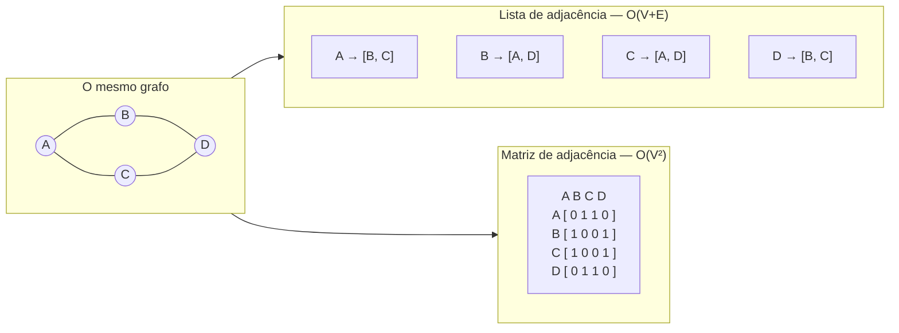
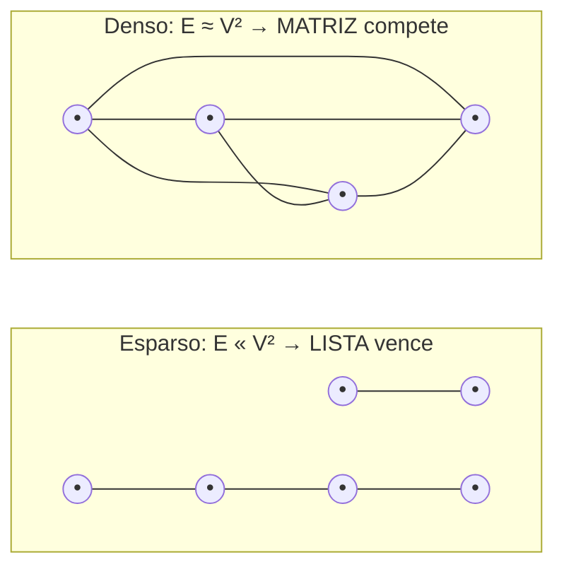
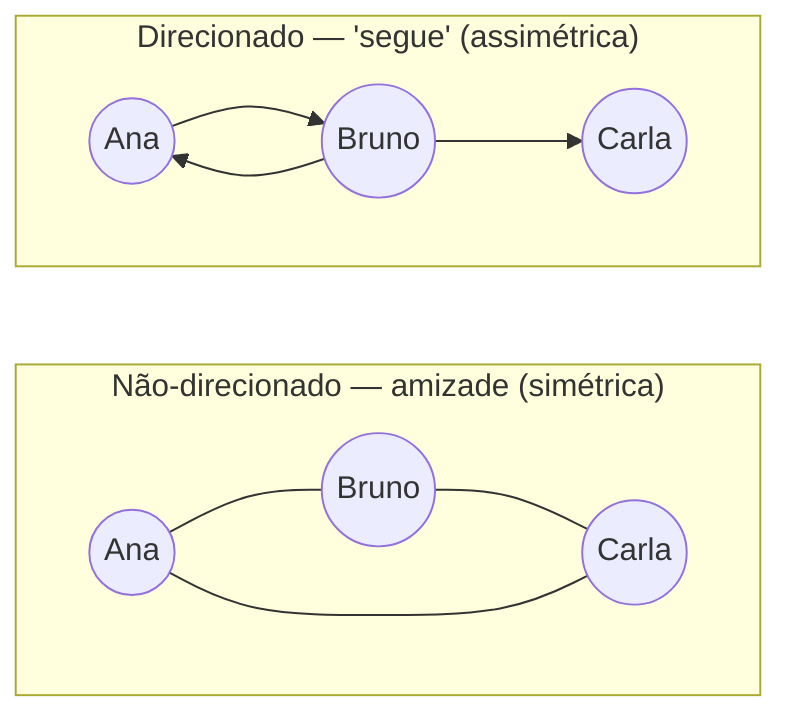
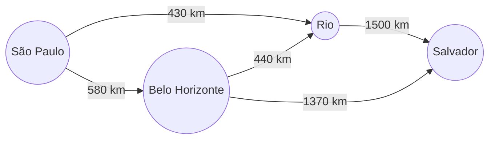
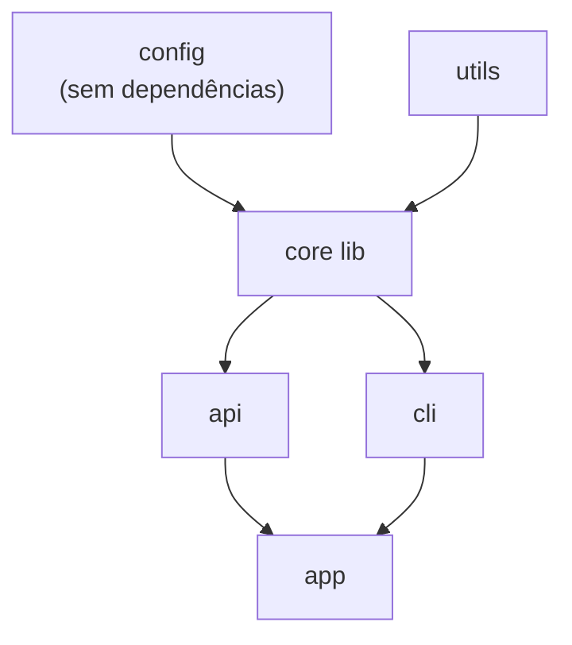
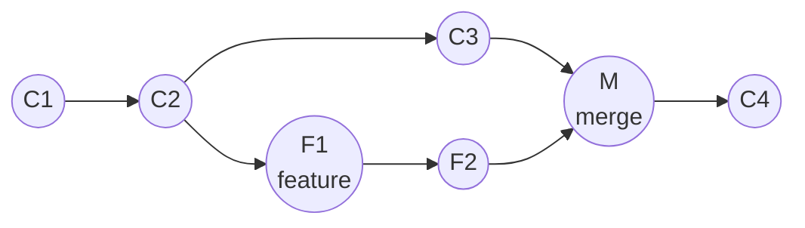

# Grafos - representação e tipos

Quase tudo que importa em software é, no fundo, um grafo. As pessoas que você segue e quem elas seguem. As ruas entre dois pontos no mapa. Os módulos que dependem uns dos outros para compilar. Os commits que apontam para os commits anteriores. Quando você desenha caixas e flechas num quadro branco, você está desenhando um grafo — você só não chamou pelo nome.

Esta nota é sobre o substrato: **o que é um grafo, como você o guarda na memória, e que sabores ele tem**. Os algoritmos que correm *sobre* o grafo — BFS, DFS, Dijkstra, ordenação topológica, union-find — moram na nota seguinte, [[11 - Grafos - travessia e algoritmos]]. Aqui a pergunta é mais humilde e mais fundamental: dado um grafo, como eu o represento, e que decisão essa escolha trava?

> [!info] Pré-requisito
> Esta nota usa [[05 - Tabelas hash]] (o mapa de adjacência é, na prática, um `HashMap`) e [[04 - Pilhas, filas e deques]] (as listas de vizinhos). Se você está confortável com "mapa de listas", já tem o suficiente.

## TL;DR

- **Grafo** = um conjunto de **vértices** (nós) ligados por **arestas**. Modela qualquer relação: rede social, rota, dependência, fluxo.
- Duas representações dominam: **lista de adjacência** (para cada vértice, a lista dos seus vizinhos) e **matriz de adjacência** (uma grade V×V de "tem aresta? sim/não").
- **Regra prática:** lista de adjacência em **99% dos casos**. Espaço O(V+E), iterar vizinhos é O(grau). A matriz só vale quando o grafo é **denso** *ou* quando "existe a aresta u→v?" é a operação dominante (matriz responde em O(1)).
- **Tipos** importam mais do que parece: **direcionado vs não-direcionado**, **ponderado** (arestas com peso), **cíclico vs acíclico** (o **DAG** é a estrela), **conexo** (e seus componentes), **denso vs esparso**, **bipartido**, **multigrafo**. A **árvore** é só um grafo conexo acíclico.
- Conceitos de bolso: **grau** (in/out-degree), **caminho**, **ciclo**, **vizinhança**.
- Nenhuma linguagem mainstream traz um tipo "grafo" na biblioteca padrão. Em todas elas você o constrói do mesmo jeito — **um mapa de listas**. O que muda é a **cultura de bibliotecas**: Python tem o `networkx` como padrão de fato; Java vai de `Map` na mão ou **JGraphT**; Go idem com **`gonum/graph`**; JS tem o `graphology`.
- Senior: "grafo é um mapa de listas". A escolha **lista vs matriz** é a mesma decisão em qualquer linguagem; o que difere é a ferramenta que você puxa da prateleira.

---

## O que é um grafo

Um grafo `G = (V, E)` são duas coisas: um conjunto de **vértices** `V` (os nós, os pontos, as "coisas") e um conjunto de **arestas** `E` (as ligações, os pares de vértices que estão conectados). Só isso. Toda a riqueza vem de *o que* você decide que os vértices e arestas representam.

- Vértices = usuários, arestas = "segue".
- Vértices = cidades, arestas = estradas.
- Vértices = tarefas de build, arestas = "depende de".
- Vértices = commits, arestas = "tem como pai".

O vocabulário mínimo que você precisa para conversar sobre grafos:

- **Vizinhança** de um vértice `v` = o conjunto de vértices ligados a `v` por uma aresta. São os "vizinhos" de `v`.
- **Grau** de `v` = quantas arestas tocam `v`. Em grafo direcionado, ele se parte em dois: **in-degree** (arestas que *chegam*) e **out-degree** (arestas que *saem*). Um seguidor é in-degree; quem você segue é out-degree.
- **Caminho** = uma sequência de vértices onde cada par consecutivo tem uma aresta. "Posso ir de A até F?" é uma pergunta sobre existência de caminho.
- **Ciclo** = um caminho que volta ao ponto de partida sem repetir aresta. A presença ou ausência de ciclos é o que separa um DAG de um grafo qualquer — e é uma das perguntas mais importantes que você fará a um grafo.

> [!tip] A intuição que destrava tudo
> Não pense em "grafo" como uma figura bonita de bolinhas e flechas. Pense nele como **uma pergunta sobre relações**: quem se conecta com quem, e como chego de um ponto a outro. A figura é só o desenho dessa pergunta.

---

## Representações: como guardar um grafo na memória

O grafo é uma ideia abstrata. Para o computador trabalhar com ele, você precisa de uma representação concreta. Há três, e na prática você só usa a primeira.

### Lista de adjacência

Para **cada vértice, guarde a lista dos seus vizinhos**. É isso. Concretamente: um mapa de vértice → lista (ou conjunto) de vértices.

```
A: [B, C]
B: [A, D]
C: [A, D]
D: [B, C]
```

- **Espaço: O(V + E)** — você guarda cada vértice uma vez e cada aresta uma ou duas vezes (duas em grafo não-direcionado, porque a aresta A–B aparece na lista de A *e* na de B). É proporcional ao tamanho real do grafo, não ao quadrado dele.
- **Iterar os vizinhos de `v`: O(grau de v)** — você visita exatamente os vizinhos, nem um a mais. Isso é exatamente o que BFS e DFS precisam fazer o tempo todo, e é por isso que a lista de adjacência é a casa natural da travessia.
- **Verificar uma aresta específica (u→v existe?): O(grau de u)** — você tem que varrer a lista de vizinhos de `u` à procura de `v`. (Se a "lista" for um `Set`, isso cai para O(1) — um truque que vale a pena.)

### Matriz de adjacência

Uma **grade V×V** onde a célula `[u][v]` diz se existe aresta de `u` para `v` (um bit; ou o peso, se ponderado).

```
    A  B  C  D
A [ 0  1  1  0 ]
B [ 1  0  0  1 ]
C [ 1  0  0  1 ]
D [ 0  1  1  0 ]
```

- **Espaço: O(V²)** — sempre, independente de quantas arestas existem de fato. Um grafo de 1 milhão de vértices precisaria de 10¹² células. Inviável para grafos grandes e esparsos.
- **Verificar uma aresta (u→v existe?): O(1)** — olhe a célula `[u][v]`. Imbatível. É *a* vantagem da matriz.
- **Iterar os vizinhos de `v`: O(V)** — você tem que varrer a linha inteira, mesmo que `v` tenha só 2 vizinhos entre um milhão de colunas.

### Lista de arestas

A representação mais crua: **só uma lista de pares** `(u, v)` (e o peso, se houver). `[(A,B), (A,C), (B,D), (C,D)]`. Não é boa para consultar vizinhos (você varre a lista toda), mas é **compacta para serializar/transmitir** e é o formato de entrada de alguns algoritmos (Kruskal, que ordena arestas por peso, adora). Na prática você costuma *receber* o grafo como lista de arestas e *converter* para lista de adjacência antes de processá-lo.

### O trade-off, numa tabela

| Operação / custo            | Lista de adjacência | Matriz de adjacência | Lista de arestas |
| --------------------------- | ------------------- | -------------------- | ---------------- |
| Espaço                      | **O(V + E)**        | O(V²)                | O(E)             |
| Aresta u→v existe?          | O(grau de u)\*      | **O(1)**             | O(E)             |
| Iterar vizinhos de v        | **O(grau de v)**    | O(V)                 | O(E)             |
| Adicionar aresta            | **O(1)**            | O(1)                 | **O(1)**         |
| Adicionar vértice           | **O(1)**            | O(V²) (realoca)      | O(1)             |
| Melhor para                 | quase tudo          | grafos densos        | serializar/entrada |

\* O(1) se a lista de vizinhos for um `Set` em vez de uma `List`.

> [!important] A regra prática
> **Lista de adjacência em 99% dos casos.** Os grafos do mundo real — redes sociais, grafos de dependência, mapas — são **esparsos**: cada nó tem poucos vizinhos relativos ao total. A lista de adjacência paga só pelo que existe. A matriz só ganha em dois cenários: o grafo é **denso** (E ≈ V², quase todo par conectado) *ou* a operação dominante é "essa aresta existe?" repetida milhões de vezes, onde o O(1) da matriz domina o O(grau) da lista.



**Leitura do diagrama:** o mesmo grafo de 4 nós, representado dos dois jeitos. A lista guarda quatro listinhas curtas (uma por vértice); a matriz guarda 16 células — e como só 8 são "1", metade do espaço é desperdiçado com zeros. Multiplique por um grafo de milhões de nós com poucos vizinhos cada e você vê por que a matriz fica inviável: ela cresce com V², a lista com E.



**Leitura do diagrama:** à esquerda, um grafo esparso — poucas arestas, muitos nós sem ligação direta; a matriz seria quase toda zeros, a lista cabe num punhado de entradas. À direita, um grafo denso — quase todo par conectado; aqui a matriz não desperdiça quase nada, e o O(1) de consulta de aresta começa a compensar o custo de O(V²) de espaço.

---

## Tipos de grafo

O mesmo conjunto de vértices e arestas pode ter naturezas muito diferentes. Reconhecer o tipo é o que dita qual algoritmo serve.

### Direcionado vs não-direcionado

Numa aresta **não-direcionada**, a relação é simétrica: se A é amigo de B, B é amigo de A. A aresta é uma linha sem ponta. Numa aresta **direcionada**, a relação tem sentido: A *segue* B não implica que B segue A. A aresta é uma flecha.



**Leitura do diagrama:** à esquerda, linhas sem ponta — amizade vale nos dois sentidos por construção. À direita, flechas — Ana segue Bruno e Bruno segue Ana (duas flechas, relação mútua mas explícita), mas Bruno segue Carla sem reciprocidade. Em grafo direcionado, cada aresta é uma decisão de sentido; é por isso que in-degree e out-degree passam a ser números diferentes.

### Ponderado

Arestas carregam um **peso**: distância, custo, latência, capacidade. O grafo deixa de responder só "existe caminho?" e passa a responder "**qual o caminho mais barato?**". É o que transforma um mapa de ruas em um GPS.



**Leitura do diagrama:** os números nas arestas são pesos (km). Sem peso, "São Paulo → Rio" e "São Paulo → Belo Horizonte → Rio" seriam só dois caminhos quaisquer. Com peso, dá para perguntar qual é o *mais curto* — e é exatamente essa pergunta que algoritmos como Dijkstra respondem (vivem na nota [[11 - Grafos - travessia e algoritmos]]).

### Cíclico vs acíclico — e o DAG

Um grafo é **cíclico** se você consegue sair de um vértice, andar pelas arestas e voltar ao ponto de partida. É **acíclico** se isso é impossível. O caso mais importante de todos é o **DAG — Directed Acyclic Graph** (grafo direcionado acíclico): tem direção e *não* tem ciclos.

Por que o DAG é tão central? Porque um DAG é, por definição, **uma estrutura de dependências sem paradoxos**. Se A depende de B que depende de C, e não há ciclo, então existe uma **ordem válida** para processar tudo (C, depois B, depois A). Encontrar essa ordem é a **ordenação topológica** — a base de build systems, schedulers e resolvedores de dependência. Se houvesse um ciclo (A depende de B que depende de A), nenhuma ordem existiria — é o erro "dependência circular" que todo build system grita.



**Leitura do diagrama:** um grafo de build. As flechas apontam de "preciso de" para "depende de mim" — `config` e `utils` não dependem de ninguém, então compilam primeiro; `app` depende de tudo, então compila por último. Como não há nenhum ciclo (nenhuma flecha que feche um laço de volta), existe uma ordem de compilação válida. Esse "não há ciclo" é precisamente o que faz dele um DAG e o que a ordenação topológica explora.

### Conexo e componentes

Um grafo (não-direcionado) é **conexo** se existe caminho entre qualquer par de vértices — tudo está em uma peça só. Se não, ele se parte em **componentes conexos**: ilhas de vértices que se alcançam entre si mas não alcançam as outras ilhas. "Quantos grupos isolados de amigos existem nesta rede?" é uma pergunta sobre número de componentes.

### Denso vs esparso

Já apareceu na decisão de representação, mas vale como tipo: um grafo é **denso** quando o número de arestas se aproxima do máximo possível (E ≈ V²), e **esparso** quando E é muito menor (tipicamente E ≈ V, cada nó com poucos vizinhos). A esmagadora maioria dos grafos reais é esparsa — e é por isso que a lista de adjacência venceu.

### Os tipos especiais que vale nomear

- **Multigrafo** — admite **múltiplas arestas entre o mesmo par** de vértices (ex.: dois voos diferentes entre as mesmas duas cidades) e/ou **laços** (aresta de um vértice para si mesmo). Os grafos "simples" proíbem ambos.
- **Bipartido** — os vértices se dividem em **dois grupos**, e toda aresta liga um vértice de um grupo a outro do outro grupo, nunca dentro do mesmo grupo. Clássico: usuários × produtos ("quem comprou o quê"), candidatos × vagas. Bipartido é a base de problemas de *matching*.
- **Árvore** — não é um tipo à parte, é um **caso especial**: uma árvore é simplesmente um **grafo conexo e acíclico**. Toda [[06 - Árvores e árvores de busca|árvore]] é um grafo; nem todo grafo é uma árvore. Um grafo conexo com `V` vértices é uma árvore exatamente quando tem `V−1` arestas (a aresta de número `V` fecharia um ciclo).

---

## Onde os grafos aparecem em sistemas reais

A graça de aprender grafos não é resolver puzzles — é **reconhecer o grafo escondido** no problema do dia a dia.

- **Redes sociais** — vértices = pessoas, arestas = amizade ("amigos em comum", "pessoas que talvez você conheça" é uma busca a 2 níveis de distância).
- **Mapas e rotas** — vértices = interseções, arestas ponderadas = ruas (GPS é caminho mais curto em grafo ponderado).
- **Build systems / dependências** — Gradle, Maven, Bazel, `npm`, `cargo` montam um **DAG** de módulos e o ordenam topologicamente para decidir a ordem de compilação. Dependência circular = ciclo detectado = build falha.
- **Dependency injection** — o Spring monta um **grafo de beans**: cada bean é um vértice, cada `@Autowired` é uma aresta "preciso disso para ser construído". O container resolve a ordem de criação por ordenação topológica e detecta dependências circulares no boot.
- **Git** — o histórico é um **DAG de commits**: cada commit aponta para seu(s) pai(s), um merge tem dois pais, e nunca há ciclo (um commit não pode ser ancestral de si mesmo). Branches são só ponteiros para nós desse DAG.
- **Scheduling e package managers** — qualquer "isto antes daquilo" com dependências é um DAG aguardando ordenação topológica.



**Leitura do diagrama:** o histórico do Git como DAG. Cada nó é um commit; cada flecha aponta do commit mais novo para o seu pai. A partir de `C2` o histórico se bifurca numa branch de feature (`F1 → F2`); o commit de merge `M` tem **dois pais** (`C3` da main e `F2` da feature), juntando os dois caminhos. Como nenhuma flecha volta para trás formando laço, é acíclico — um DAG. É por isso que `git log` consegue sempre ordenar os commits e `git rebase` consegue replicá-los numa ordem linear.

---

## Implementações comparadas: Java · TypeScript · Python · Go

A revelação que une as quatro linguagens: **nenhuma traz um tipo "grafo" na biblioteca padrão**. Lista, mapa, pilha, fila — todas vêm prontas. Grafo, não. E o motivo é que você não precisa: o grafo é só **um mapa de listas**, e isso você monta em uma linha. O que difere entre os ecossistemas é a **cultura de bibliotecas** quando o problema cresce.

### Java — `Map<V, List<V>>` ou JGraphT

O idioma é um `Map` de vértice para lista (ou `Set`) de vizinhos, construído com `computeIfAbsent` para criar a lista na primeira aresta:

```java
// Lista de adjacência — o idioma
Map<String, List<String>> grafo = new HashMap<>();
grafo.computeIfAbsent("A", k -> new ArrayList<>()).add("B");
grafo.computeIfAbsent("A", k -> new ArrayList<>()).add("C");
grafo.computeIfAbsent("B", k -> new ArrayList<>()).add("D");

// Vizinhos de A — O(grau)
for (String vizinho : grafo.getOrDefault("A", List.of())) { /* ... */ }

// Use Set quando "aresta existe?" precisa ser O(1):
Map<String, Set<String>> grafoSet = new HashMap<>();
grafoSet.computeIfAbsent("A", k -> new HashSet<>()).add("B");
boolean existe = grafoSet.getOrDefault("A", Set.of()).contains("B"); // O(1)

// Ponderado: mapa de mapas (vizinho -> peso) ou um record de aresta
Map<String, Map<String, Integer>> ponderado = new HashMap<>();
ponderado.computeIfAbsent("SP", k -> new HashMap<>()).put("RJ", 430);

record Aresta(String de, String para, int peso) {}
```

Quando o problema fica sério (algoritmos prontos, grafos tipados, exportação), a biblioteca de referência é o **JGraphT** — uma biblioteca livre que oferece grafos dirigidos/não-dirigidos/ponderados e dezenas de algoritmos.

```java
// Com JGraphT
Graph<String, DefaultEdge> g = new SimpleDirectedGraph<>(DefaultEdge.class);
g.addVertex("A"); g.addVertex("B");
g.addEdge("A", "B");
```

### TypeScript / JavaScript — `Map<V, V[]>` ou graphology

Mesmo idioma, com `Map` (chaves de qualquer tipo, ordem de inserção preservada) ou um objeto literal:

```typescript
// Lista de adjacência com Map
const grafo = new Map<string, string[]>();

function addAresta(de: string, para: string): void {
  if (!grafo.has(de)) grafo.set(de, []);
  grafo.get(de)!.push(para);
}
addAresta("A", "B");
addAresta("A", "C");

const vizinhos = grafo.get("A") ?? []; // ["B", "C"]

// Ponderado: Map de Map
const ponderado = new Map<string, Map<string, number>>();
ponderado.set("SP", new Map([["RJ", 430]]));
```

Sem nada na biblioteca padrão, o ecossistema JS gravita para **`graphology`** — uma especificação robusta de grafo (dirigido/não-dirigido, multigrafo, atributos) com um pacote de algoritmos satélite.

### Python — `defaultdict(list)` ou networkx

Aqui o idioma é quase poético de tão curto. `defaultdict` cria a lista vazia automaticamente no primeiro acesso, então não há `if key not in dict`:

```python
from collections import defaultdict

grafo = defaultdict(list)
grafo["A"].append("B")   # cria a lista sozinho
grafo["A"].append("C")
grafo["B"].append("D")

vizinhos = grafo["A"]    # ['B', 'C']

# Use set quando "aresta existe?" precisa ser O(1):
grafo_set = defaultdict(set)
grafo_set["A"].add("B")
existe = "B" in grafo_set["A"]   # O(1)

# Ponderado: dict de dict
ponderado = defaultdict(dict)
ponderado["SP"]["RJ"] = 430
```

Para trabalho sério, o **`networkx`** é o **padrão de fato** da comunidade Python — com mais de 50 milhões de downloads (mais de 50× o `igraph`), API pythônica e uma biblioteca enorme de algoritmos. Para *performance* em grafos grandes, a comunidade troca para o **`igraph`** (núcleo em C, vence o networkx por margens grandes em métricas pesadas) ou `graph-tool`/`rustworkx`.

```python
import networkx as nx
g = nx.DiGraph()
g.add_edge("A", "B", weight=430)
```

### Go — `map[V][]V` ou gonum/graph

O idioma usa o `map` nativo com slices de valor; sem `computeIfAbsent`, o `append` num slice nil já funciona:

```go
// Lista de adjacência — append em slice nil funciona
grafo := map[string][]string{}
grafo["A"] = append(grafo["A"], "B")
grafo["A"] = append(grafo["A"], "C")
grafo["B"] = append(grafo["B"], "D")

vizinhos := grafo["A"] // ["B" "C"]

// Conjunto de vizinhos (set) p/ "aresta existe?" O(1): map[V]struct{}
grafoSet := map[string]map[string]struct{}{}
grafoSet["A"] = map[string]struct{}{"B": {}}
_, existe := grafoSet["A"]["B"] // O(1)

// Ponderado: map de map
ponderado := map[string]map[string]int{}
ponderado["SP"] = map[string]int{"RJ": 430}
```

Para algoritmos prontos, o ecossistema usa o **`gonum/graph`** (pacote `gonum.org/v1/gonum/graph`), parte da suíte numérica Gonum, com implementações de grafos simples/ponderados e algoritmos (componentes fortemente conexos, topo, caminhos).

> [!note] Síntese senior
> Em todas as quatro linguagens, o grafo é **a mesma coisa: um mapa de listas** (`Map`/`dict`/`map` → `List`/`[]`/slice de vizinhos). A construção é idêntica; a decisão **lista vs matriz** é a mesma decisão em qualquer lugar. O que muda é a **cultura de bibliotecas**: Python tem a dominância do `networkx`; Java e Go preferem "monte na mão ou use JGraphT/gonum"; JS tem o `graphology`. A estrutura é universal; a prateleira de ferramentas é local.

---

## Em entrevista

A frase que mostra que você pensa em grafos como modelagem, não como puzzle:

> "Whenever a problem is about relationships — users and who they follow, services and their dependencies, tasks and their prerequisites — I model it as a graph: vertices for the things, edges for the relationships. The first decision is the representation. I reach for an **adjacency list** by default — a map from each vertex to its list of neighbors. It's O(V+E) space and lets me iterate a vertex's neighbors in O(degree), which is exactly what traversal needs. I'd only use an **adjacency matrix** if the graph is dense or if 'does edge u→v exist?' is the dominant operation, because the matrix answers that in O(1) at the cost of O(V²) space."

Sobre os tipos e o DAG:

> "The type drives the algorithm. Directed or undirected? Weighted or not? And crucially, is it acyclic? A **DAG** — a directed acyclic graph — is a dependency structure with no paradoxes, so it has a valid processing order you find with a topological sort. That's what build systems, schedulers, and Spring's bean graph all run on. Git's commit history is a DAG too — that's why you can always order the log."

Sobre o ecossistema:

> "No mainstream standard library ships a graph type, because you don't need one — a graph is just a map of lists, built the same way in Java, TypeScript, Python, and Go. What differs is the library culture: in Python, `networkx` is the de-facto standard; in Java and Go you usually build it by hand or reach for JGraphT or gonum; in JS there's graphology. The representation trade-off is identical everywhere."

### Vocabulário-chave

- grafo → graph
- vértice / nó → vertex (pl. vertices) / node
- aresta → edge
- vizinho / vizinhança → neighbor / neighborhood
- grau → degree
- grau de entrada / saída → in-degree / out-degree
- direcionado / não-direcionado → directed / undirected
- ponderado → weighted
- caminho → path
- ciclo → cycle
- acíclico → acyclic
- grafo direcionado acíclico → directed acyclic graph (DAG)
- conexo / componente conexo → connected / connected component
- denso / esparso → dense / sparse
- bipartido → bipartite
- multigrafo → multigraph
- lista de adjacência → adjacency list
- matriz de adjacência → adjacency matrix
- lista de arestas → edge list

---

## Referências

- [NetworkX (Wikipedia)](https://en.wikipedia.org/wiki/NetworkX) — padrão de fato em Python; mais de 50 milhões de downloads (abr/2024), 50× o igraph; Python puro.
- [igraph enables fast and robust network analysis (arXiv)](https://arxiv.org/pdf/2311.10260) — núcleo em C, performance para grafos grandes; alternativa ao networkx.
- [Benchmark of popular graph/network packages](https://www.timlrx.com/blog/benchmark-of-popular-graph-network-packages/) — igraph supera networkx em métricas pesadas (ex.: betweenness ~8×).
- [JGraphT](https://jgrapht.org/) — biblioteca Java livre de grafos (dirigido/ponderado) e algoritmos; sem tipo grafo na stdlib.
- [Graphs in Java (Baeldung)](https://www.baeldung.com/java-graphs) — idioma `Map<V, List<V>>` de adjacência na mão.
- [graphology](https://graphology.github.io/) — especificação de grafo robusta para JS/TS (dirigido/não-dirigido/multigrafo) + pacotes de algoritmos.
- [gonum/graph (pkg.go.dev)](https://pkg.go.dev/gonum.org/v1/gonum/graph) — pacote de grafos da suíte Gonum; simples/ponderado, SCC, topo, caminhos.
- [Pro Git: Git Branching (DAG)](https://git-scm.com/book/en/v2/Git-Branching-Branches-in-a-Nutshell) — commits formam um DAG; cada commit aponta para o(s) pai(s), merge tem dois pais.

## Veja também

- [[11 - Grafos - travessia e algoritmos]] — BFS, DFS, Dijkstra, ordenação topológica e union-find: os algoritmos que correm sobre as representações desta nota.
- [[05 - Tabelas hash]] — o mapa de adjacência é, por dentro, um `HashMap`; e o `Set` de vizinhos é o que dá consulta de aresta em O(1).
- [[04 - Pilhas, filas e deques]] — as listas de vizinhos, e as filas/pilhas que a travessia usa.
- [[Dicionário de Ciência da Computação]] — verbetes de grafo, DAG, lista de adjacência, grau, componente conexo.
