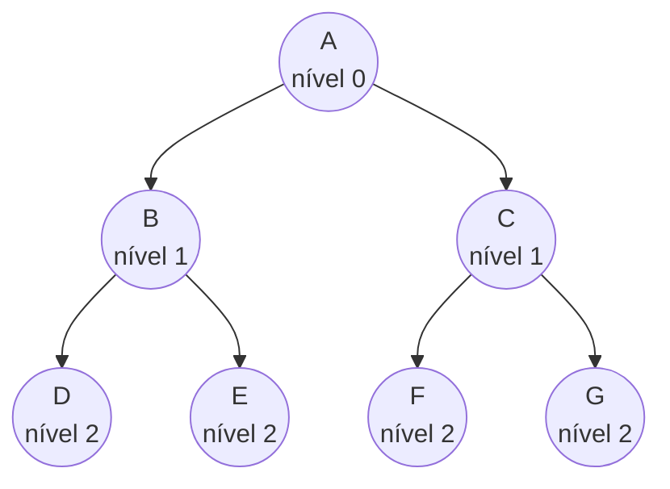
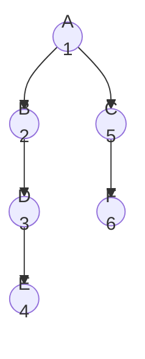
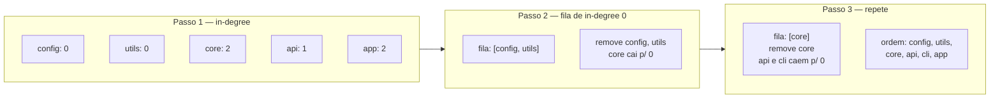
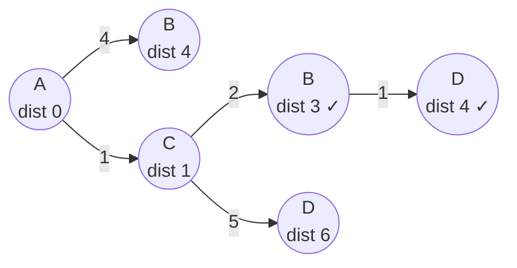
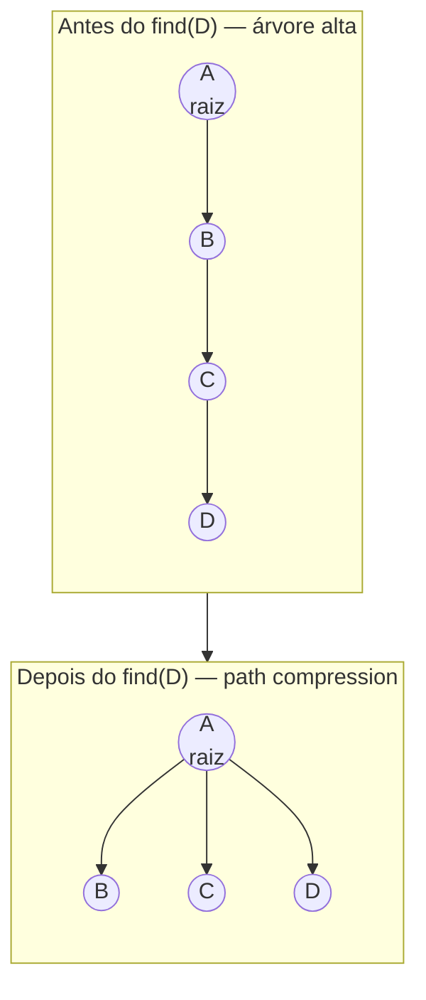
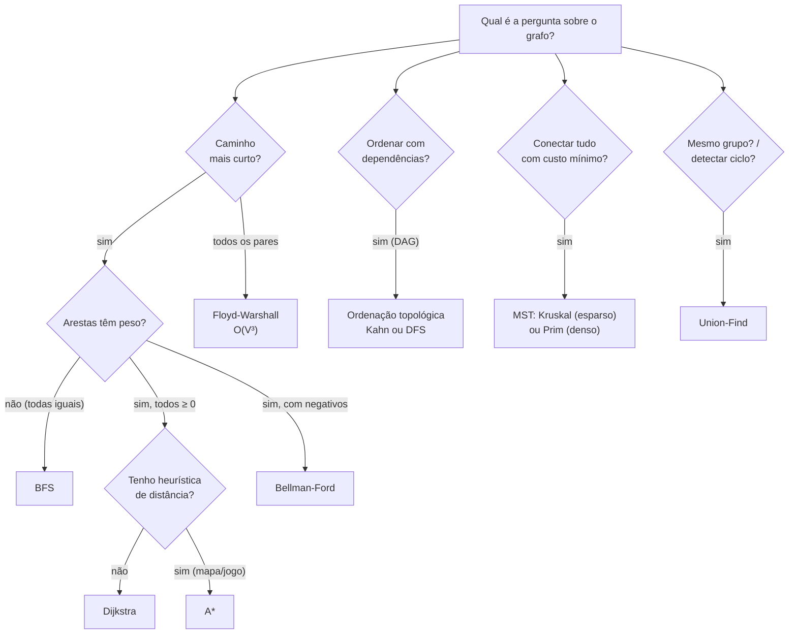

# Grafos - travessia e algoritmos

A nota anterior, [[10 - Grafos - representação e tipos]], montou o palco: o grafo é um mapa de listas, e você decide entre lista e matriz de adjacência. Mas um grafo guardado na memória é inerte. Ele só ganha vida quando alguém o **percorre** — caminha de vértice em vértice respondendo perguntas: "Existe caminho de A até F? Qual o mais curto? Em que ordem posso processar estas tarefas? Estes dois nós estão no mesmo grupo?"

Esta nota é sobre essa caminhada. São os algoritmos que correm *sobre* as representações: **BFS** e **DFS** (as duas travessias fundamentais), os algoritmos de **caminho mínimo** (Dijkstra, Bellman-Ford, A\*, Floyd-Warshall), a **ordenação topológica**, o **union-find** e as **árvores geradoras mínimas** (Kruskal, Prim).

A boa notícia: quase todos esses algoritmos são variações de **duas ideias** — "explore em camadas" (BFS) e "mergulhe fundo primeiro" (DFS). Dijkstra é BFS com uma fila de prioridade no lugar da fila comum. Kahn é BFS contando dependências. Quem entende as duas travessias entende metade do catálogo.

> [!info] Pré-requisito
> Esta nota assume a representação de [[10 - Grafos - representação e tipos]] (grafo = mapa de listas) e usa intensamente as estruturas de [[04 - Pilhas, filas e deques]] (fila para BFS, pilha para DFS) e [[07 - Heaps e filas de prioridade]] (a fila de prioridade que faz Dijkstra e Prim funcionarem). O union-find como *estrutura* é detalhado em [[12 - Estruturas especializadas]]; aqui eu o **uso**.

## TL;DR

- **BFS** (fila): explora em **camadas**. É o caminho mais curto em grafos **não-ponderados** (cada aresta custa 1). Também serve para distância em níveis, componentes conexos e teste de bipartição. **O(V+E)**.
- **DFS** (pilha/recursão): **mergulha fundo** antes de voltar. Base para **detecção de ciclo** (cores/estados), **ordenação topológica**, componentes (fortemente) conexos e *backtracking*. **O(V+E)**. Cuidado com profundidade de recursão → stack overflow; converta para iterativo se preciso.
- **Caminho mínimo ponderado:** **Dijkstra** (pesos não-negativos, fila de prioridade, O((V+E) log V) com heap binário); **Bellman-Ford** (aceita pesos negativos e detecta ciclo negativo, O(V·E)); **A\*** (Dijkstra + heurística, para mapas/jogos); **Floyd-Warshall** (todos-os-pares, O(V³), programação dinâmica).
- **Ordenação topológica:** **Kahn** (BFS, conta in-degree) ou **DFS** (pós-ordem invertida). Só para **DAGs**. É o motor de build systems e schedulers.
- **Union-Find:** responde "estes dois estão no mesmo conjunto?" em tempo quase constante (α inverso de Ackermann) com *path compression* + *union by rank*. Componentes conexos, detecção de ciclo, e o coração do **Kruskal**.
- **MST (árvore geradora mínima):** **Kruskal** (ordena arestas + union-find) vs **Prim** (cresce uma árvore com fila de prioridade).
- Senior: o algoritmo é **agnóstico de linguagem**; o que muda é a **ergonomia da fila de prioridade** (nota 07). Python e Java tornam Dijkstra agradável; JS te obriga a construir o heap na mão; Go te obriga a implementar uma interface.

---

## BFS — explorar em camadas

A busca em largura (Breadth-First Search) é a travessia mais intuitiva: comece num vértice, visite **todos os vizinhos diretos**, depois todos os vizinhos *deles*, e assim por diante. Você se expande em **ondas concêntricas**, como uma pedra jogada num lago.

A ferramenta que faz isso acontecer é a **fila** (FIFO). Você enfileira o nó inicial; depois, repetidamente, **desenfileira um nó, marca como visitado, e enfileira seus vizinhos ainda não vistos**. Como a fila preserva a ordem de chegada, todos os nós a distância 1 saem antes de qualquer nó a distância 2 — é exatamente isso que garante a expansão em camadas.



**Leitura do diagrama:** começando em `A` (nível 0), a BFS primeiro visita toda a camada de vizinhos diretos — `B` e `C` (nível 1) — antes de descer para a camada seguinte, `D`, `E`, `F`, `G` (nível 2). A fila garante essa ordem: quando você processa `A`, enfileira `B` e `C`; eles saem antes de qualquer neto. O "nível" de cada nó é literalmente sua **distância em arestas** até a origem — e é por isso que BFS resolve caminho mínimo não-ponderado de graça.

### O superpoder do BFS: caminho mais curto não-ponderado

Aqui está a sacada que faz o BFS valer ouro. Em um grafo onde **toda aresta custa o mesmo** (custo 1, ou nenhum peso), o primeiro momento em que o BFS toca um vértice é, garantidamente, pelo **caminho mais curto** até ele. Por quê? Porque o BFS esgota a camada de distância `k` inteira antes de tocar qualquer nó de distância `k+1`. Não há como chegar "tarde" a um nó por um caminho mais curto — a onda já passou.

Isso resolve, sem nenhum algoritmo mais sofisticado:

- **Menor número de saltos** numa rede ("graus de separação", o "amigos em comum" das redes sociais a 2 níveis).
- **Distância em labirintos** onde cada passo custa 1.
- **Nível/profundidade** de cada nó a partir de uma raiz.

### Os outros usos do BFS

- **Componentes conexos** — rode BFS de cada nó ainda não visitado; cada disparo descobre uma "ilha" inteira. Conte os disparos e você tem o número de componentes.
- **Teste de bipartição** — pinte cada camada com uma cor alternada (origem branca, vizinhos pretos, vizinhos deles brancos...). Se você nunca encontrar dois vizinhos da mesma cor, o grafo é **bipartido**.

> [!tip] BFS em uma frase
> "Use uma fila, visite por camadas, e o primeiro toque é o caminho mais curto — desde que todas as arestas custem o mesmo." A última cláusula é crucial: peso quebra essa garantia, e aí você precisa de Dijkstra.

```java
// BFS com ArrayDeque (a fila idiomática em Java)
Map<Integer, List<Integer>> grafo = /* ... */;
Queue<Integer> fila = new ArrayDeque<>();
Map<Integer, Integer> dist = new HashMap<>();   // distância (= nível)

fila.offer(origem);
dist.put(origem, 0);

while (!fila.isEmpty()) {
    int u = fila.poll();
    for (int v : grafo.getOrDefault(u, List.of())) {
        if (!dist.containsKey(v)) {        // ainda não visitado
            dist.put(v, dist.get(u) + 1);  // camada seguinte
            fila.offer(v);
        }
    }
}
```

---

## DFS e ordenação topológica — mergulhar fundo

A busca em profundidade (Depth-First Search) é o oposto do BFS: em vez de se espalhar em camadas, ela **escolhe um caminho e o segue até o fim** antes de recuar e tentar outro. É a caminhada do explorador teimoso: sempre vá fundo, e só volte quando bater num beco.

A ferramenta natural é a **pilha** (LIFO) — explícita, ou implícita na **recursão** (a própria pilha de chamadas do programa faz o trabalho). Você visita um nó, marca, e mergulha recursivamente no primeiro vizinho não visitado; quando não há mais para onde ir, a recursão "desempilha" e você tenta o próximo vizinho do nó anterior.



**Leitura do diagrama:** os números são a **ordem de visita**. A partir de `A`, a DFS mergulha pelo ramo da esquerda até o fundo — `A → B → D → E` — antes de voltar e explorar `C → F`. Compare com o BFS do diagrama anterior no mesmo formato de árvore: lá a ordem seria por camadas (A, B, C, D, E...); aqui é por profundidade (A, B, D, E, depois C, F). A pilha (ou a recursão) é o que produz esse "vá fundo primeiro".

### Detecção de ciclo: as três cores

A aplicação mais elegante do DFS é descobrir se um grafo direcionado tem ciclo. A técnica clássica usa **três estados** (cores) por vértice:

- **Branco** — ainda não visitado.
- **Cinza** — em processamento (está na pilha de recursão atual, no caminho que estou percorrendo agora).
- **Preto** — totalmente processado (eu e todos os meus descendentes já terminaram).

A regra: se durante o DFS você encontrar uma aresta que aponta para um nó **cinza**, achou um ciclo — você voltou a um nó que ainda está no seu caminho atual. (Uma aresta para um nó preto é só um caminho que reconverge, não um ciclo.)

### Ordenação topológica via DFS

Num **DAG** (grafo direcionado acíclico), a ordenação topológica produz uma sequência linear dos vértices onde **toda dependência vem antes de quem depende dela**. O DFS resolve isso quase de graça: faça o DFS completo e, **quando cada nó terminar** (fica preto), empilhe-o; no final, **inverta a pilha**. A intuição: um nó só termina depois de todos os seus dependentes terminarem, então ele aparece *depois* deles na ordem de término — invertendo, ele vem antes. Base de build systems, schedulers, resolução de dependências.

### Ordenação topológica via Kahn (BFS, in-degree)

Há um segundo jeito, muitas vezes mais intuitivo, que usa **BFS contando o in-degree** (quantas arestas chegam em cada nó). O algoritmo de **Kahn**:

1. Calcule o **in-degree** de cada vértice.
2. Enfileire todos os vértices com **in-degree 0** (não dependem de nada — podem ir primeiro).
3. Repetidamente: desenfileire um nó, adicione-o à saída, e **decremente o in-degree** de cada vizinho. Se algum vizinho chegar a in-degree 0, enfileire-o.
4. Se a saída não contém todos os vértices ao final, **há um ciclo** (alguém nunca chegou a in-degree 0). Complexidade **O(V+E)**.



**Leitura do diagrama:** Kahn começa medindo quantas arestas *chegam* em cada nó (in-degree). `config` e `utils` não dependem de ninguém (in-degree 0), então entram na fila e saem primeiro. Removê-los **diminui** o in-degree de `core` (que dependia dos dois) até zerá-lo — agora `core` está liberado. O processo se repete: cada nó removido libera os que dependiam dele, como dominós. Se em algum momento a fila esvazia mas sobram nós, é porque eles formam um ciclo e nunca se libertam — é assim que Kahn detecta dependência circular.

> [!warning] Recursão profunda em DFS
> O DFS recursivo usa a pilha de chamadas do programa. Em grafos grandes ou muito "compridos" (um caminho de centenas de milhares de nós), você estoura a pilha — **stack overflow**. Em Python isso bate cedo: o limite padrão de recursão é **1000** (`sys.getrecursionlimit()`); ou você sobe o limite com `sys.setrecursionlimit(...)`, ou — melhor — **reescreve o DFS de forma iterativa** com uma pilha explícita (`ArrayDeque`/lista). Em entrevista, mencionar essa armadilha sinaliza maturidade.

---

## Caminho mínimo ponderado

Quando as arestas têm **peso** (distância, custo, latência), o BFS não basta — "menos saltos" não é mais o mesmo que "menor custo". Um caminho de 3 arestas baratas pode ser mais curto que um de 1 aresta cara. Aqui entram os algoritmos de caminho mínimo, e a escolha entre eles é uma decisão de **trade-off** clássica de entrevista.

### Dijkstra — o cavalo de batalha

Dijkstra é, essencialmente, **um BFS onde a fila comum vira uma fila de prioridade**. Em vez de visitar nós na ordem em que chegam, você sempre expande o nó com a **menor distância tentativa conhecida**. A cada expansão, você **relaxa** as arestas: para cada vizinho, verifica se chegar até ele *via o nó atual* é mais barato que a melhor rota conhecida — e, se for, atualiza.



**Leitura do diagrama:** as distâncias são *tentativas* que melhoram conforme a busca avança. A rota direta `A→B` custa 4, mas ao expandir `C` (que está a distância 1), o relaxamento descobre que `A→C→B` custa só 3 — **menor**, então `B` é atualizado para 3 (o ✓). O mesmo acontece com `D`: a rota `A→C→D` custa 6, mas `A→C→B→D` custa 4 e vence. A fila de prioridade garante que sempre processamos o nó mais barato conhecido a seguir — é isso que torna a primeira finalização de cada nó definitiva.

A condição **inviolável**: pesos **não-negativos**. Dijkstra assume que, uma vez que você finaliza um nó pela rota mais barata, nenhum caminho futuro o melhora — porque adicionar mais arestas (de peso ≥ 0) só pode aumentar o custo. Uma **aresta negativa quebra essa premissa**: ela poderia, lá adiante, baratear um nó já "fechado", e Dijkstra nunca volta para corrigir. Por isso peso negativo é território do Bellman-Ford.

> [!note] Complexidade — e o porquê do heap (lastro)
> Com um **heap binário** (a `PriorityQueue` de Java, o `heapq` de Python), Dijkstra é **O((V+E) log V)**: cada aresta pode causar uma inserção no heap, e cada operação de heap custa O(log V). Com um **heap de Fibonacci** — que faz *decrease-key* em O(1) amortizado em vez de O(log V) — o limite teórico cai para **O(E + V log V)**, melhor para grafos densos. Na prática quase ninguém usa Fibonacci (constante alta, implementação chata); o heap binário domina. O detalhe do heap mora em [[07 - Heaps e filas de prioridade]].

### Bellman-Ford — quando há pesos negativos

Bellman-Ford é mais lento mas mais poderoso. Ele **relaxa todas as arestas, V−1 vezes** (qualquer caminho mínimo tem no máximo V−1 arestas). Aceita **pesos negativos**, e tem um bônus: se uma **V-ésima** passada ainda consegue relaxar alguma aresta, existe um **ciclo negativo** (um loop que fica barateando indefinidamente — não há caminho mínimo bem definido). Complexidade **O(V·E)** — bem pior que Dijkstra, o preço por lidar com negativos.

### A\* — Dijkstra com um palpite

A\* (A-estrela) é Dijkstra **guiado por uma heurística**: além da distância já percorrida (`g`), ele soma uma *estimativa* do quanto falta até o destino (`h`), e prioriza por `g + h`. Com uma heurística **admissível** (nunca superestima a distância real — ex.: distância em linha reta num mapa) e **consistente**, A\* encontra o caminho ótimo explorando **muito menos nós** que Dijkstra, porque "mira" na direção do alvo. É o algoritmo de GPS e de pathfinding em jogos.

### Floyd-Warshall — todos os pares

E se você quer a menor distância **entre todo par de vértices** de uma vez? Floyd-Warshall é uma **programação dinâmica** elegante: para cada vértice intermediário `k`, verifica se passar por `k` melhora a distância entre cada par `(i, j)`. Três laços aninhados → **O(V³)**. Viável só para grafos pequenos/médios, mas imbatível em simplicidade quando você precisa da matriz completa de distâncias.

---

## Union-Find e árvores geradoras mínimas

### Union-Find: "estes dois estão no mesmo grupo?"

O **Union-Find** (ou *Disjoint Set Union*, DSU) resolve uma pergunta deceptivamente simples: dado um monte de elementos agrupados em conjuntos, **`union(a, b)`** funde os grupos de `a` e `b`, e **`find(x)`** diz a qual grupo `x` pertence. Duas operações, e quase tudo em tempo **quase constante**.

A representação é uma **floresta**: cada elemento aponta para um "pai", e o pai-de-todos (a raiz) é o **representante** do grupo. `find(x)` sobe a corrente de pais até a raiz; `union(a, b)` faz a raiz de um apontar para a raiz do outro. Dois truques o tornam quase mágico:

- **Path compression** — durante o `find`, **reaponte cada nó visitado direto para a raiz**, achatando a árvore para os próximos `find` serem instantâneos.
- **Union by rank** — ao unir, **pendure a árvore menor sob a maior**, evitando correntes longas.



**Leitura do diagrama:** antes, os nós formam uma corrente alta `A ← B ← C ← D`; um `find(D)` precisa subir três níveis até a raiz `A`. A *path compression* aproveita essa subida para **reapontar B, C e D diretamente para A**: a árvore vira chata (todos a um passo da raiz). O próximo `find` de qualquer um deles é O(1). Repetido ao longo de muitas operações, é isso que dá o tempo amortizado quase constante.

> [!note] Tempo "quase O(1)" (lastro)
> Com path compression + union by rank, cada operação é **O(α(n)) amortizado**, onde **α** é o **inverso da função de Ackermann** — uma função que cresce tão devagar que **α(n) ≤ 4** para qualquer `n` astronomicamente grande imaginável. Na prática, **constante**. A estrutura em si é detalhada em [[12 - Estruturas especializadas]]; aqui ela é ferramenta.

Usos: **componentes conexos** (dois nós estão conectados sse têm a mesma raiz), **detecção de ciclo** em grafo não-direcionado (ao adicionar a aresta `(u,v)`, se `find(u) == find(v)` antes da união, fechar essa aresta cria um ciclo), e o coração do **Kruskal**.

### MST — a árvore geradora mínima

Uma **árvore geradora mínima** (MST) é o subconjunto de arestas que **conecta todos os vértices** com o **menor peso total possível** e **sem ciclos**. Pense em ligar todas as cidades com cabo de fibra gastando o mínimo de cabo. Dois algoritmos gulosos clássicos resolvem:

**Kruskal** pensa em **arestas**. Ordene todas as arestas por peso (da mais barata à mais cara) e vá adicionando uma a uma — **pulando qualquer aresta que formaria um ciclo** (e é o union-find que detecta o ciclo em O(α)). Quando você tiver V−1 arestas, acabou. Complexidade **O(E log E)** — dominada pela ordenação das arestas. Brilha em grafos **esparsos** e quando as arestas já vêm como lista.

**Prim** pensa em **vértices**. Comece de um vértice e **cresça a árvore um nó por vez**, sempre adicionando a **aresta mais barata que sai da árvore atual** para um nó de fora — uma fila de prioridade entrega essa aresta mínima. Lembra Dijkstra (e usa a mesma estrutura). Com heap binário, **O(E log V)**; brilha em grafos **densos**.

> [!tip] Kruskal vs Prim em uma frase
> Kruskal ordena **arestas** globalmente e cola pedaços com union-find (bom para esparso); Prim faz uma **árvore crescer** localmente com fila de prioridade (bom para denso). Mesmo resultado, estratégia oposta — exatamente como BFS/DFS ou Dijkstra/Bellman-Ford são duas filosofias para a mesma família de problema.

---

## Qual algoritmo para qual problema

Esta é a tabela de decisão que você quer ter na ponta da língua em entrevista. A pergunta quase nunca é "implemente Dijkstra" — é "como você resolveria X?", e acertar o algoritmo *é* a resposta.



**Leitura do diagrama:** comece pela **pergunta**, não pelo algoritmo. Caminho mais curto sem peso → **BFS**. Com peso não-negativo → **Dijkstra** (ou **A\*** se você tem uma heurística de direção, como num mapa). Com peso negativo → **Bellman-Ford**. Distância entre *todos* os pares de uma vez → **Floyd-Warshall**. Ordenar tarefas que dependem umas das outras → **ordenação topológica** (Kahn ou DFS). Ligar tudo com custo mínimo → **MST** (Kruskal ou Prim). "Estes dois estão conectados?" ou "há ciclo?" → **Union-Find**. Decorar essa árvore de decisão vale mais que decorar qualquer implementação.

---

## Implementações comparadas: Java · TypeScript · Python · Go

O algoritmo é o mesmo em qualquer linguagem — mas a **ergonomia da fila/pilha/fila-de-prioridade** (toda a discussão da nota [[07 - Heaps e filas de prioridade]] e da [[04 - Pilhas, filas e deques]]) decide o quão limpo o código fica. BFS e DFS são triviais em todas; **Dijkstra é o teste de fogo**, porque expõe se a linguagem te dá uma fila de prioridade pronta ou te faz construir uma.

### Java — `ArrayDeque` + `PriorityQueue`

Java é confortável: `ArrayDeque` é a fila do BFS *e* a pilha do DFS; `PriorityQueue` faz Dijkstra. A pegadinha: a `PriorityQueue` de Java **não tem decrease-key**, então a técnica padrão é **lazy deletion** — você insere uma nova entrada `(dist, nó)` toda vez que melhora a distância e **ignora entradas obsoletas** ao desenfileirar.

```java
// BFS — fila
Queue<Integer> fila = new ArrayDeque<>();

// DFS iterativo — pilha (mesma classe!)
Deque<Integer> pilha = new ArrayDeque<>();

// Dijkstra — PriorityQueue com lazy deletion (sem decrease-key)
record Estado(int no, int dist) {}
PriorityQueue<Estado> pq =
    new PriorityQueue<>(Comparator.comparingInt(Estado::dist));
int[] dist = new int[V];
Arrays.fill(dist, Integer.MAX_VALUE);
dist[origem] = 0;
pq.offer(new Estado(origem, 0));

while (!pq.isEmpty()) {
    Estado e = pq.poll();
    if (e.dist() > dist[e.no()]) continue;   // entrada obsoleta — descarta
    for (var aresta : grafo.get(e.no())) {
        int novo = dist[e.no()] + aresta.peso();
        if (novo < dist[aresta.destino()]) {
            dist[aresta.destino()] = novo;
            pq.offer(new Estado(aresta.destino(), novo)); // reinsere
        }
    }
}

// Union-Find — int[] parent
int[] parent = new int[n];
for (int i = 0; i < n; i++) parent[i] = i;
int find(int x) {                 // com path compression
    if (parent[x] != x) parent[x] = find(parent[x]);
    return parent[x];
}
void union(int a, int b) { parent[find(a)] = find(b); }
```

### TypeScript / JavaScript — arrays, e o heap na mão

BFS e DFS são triviais com arrays (`push`/`shift` para fila, `push`/`pop` para pilha). Mas JS **não tem fila de prioridade na biblioteca padrão** — então Dijkstra exige **construir um min-heap à mão** (ou puxar uma lib como `heapify`/`@datastructures-js/priority-queue`). É a fricção real do ecossistema.

```typescript
// BFS — array como fila (cuidado: shift() é O(n); use índice ou deque p/ grande)
const fila: number[] = [origem];
const visto = new Set<number>([origem]);
while (fila.length) {
  const u = fila.shift()!;
  for (const v of grafo.get(u) ?? [])
    if (!visto.has(v)) { visto.add(v); fila.push(v); }
}

// DFS — array como pilha
const pilha: number[] = [origem];

// Dijkstra precisa de um heap — não existe na stdlib. Esboço:
class MinHeap<T> { /* push, pop, size — você implementa */ }
// const pq = new MinHeap<[number, number]>(); // [dist, nó]

// Union-Find — array
const parent = Array.from({ length: n }, (_, i) => i);
const find = (x: number): number =>
  parent[x] === x ? x : (parent[x] = find(parent[x]));
```

### Python — `deque` + `heapq`

Python é o mais agradável. `collections.deque` dá fila O(1) nas duas pontas; `heapq` dá o heap para Dijkstra (com lazy deletion + um contador para desempate). E para produção, `networkx` já traz tudo pronto.

```python
from collections import deque
import heapq

# BFS — deque
fila = deque([origem])
dist = {origem: 0}
while fila:
    u = fila.popleft()
    for v in grafo[u]:
        if v not in dist:
            dist[v] = dist[u] + 1
            fila.append(v)

# DFS recursivo — cuidado com sys.getrecursionlimit() == 1000 por padrão!
# import sys; sys.setrecursionlimit(10_000)  # ou reescreva iterativo

# Dijkstra — heapq com lazy deletion
dist = {origem: 0}
pq = [(0, origem)]                 # (distância, nó)
while pq:
    d, u = heapq.heappop(pq)
    if d > dist.get(u, float("inf")):
        continue                   # entrada obsoleta
    for v, peso in grafo[u]:
        if d + peso < dist.get(v, float("inf")):
            dist[v] = d + peso
            heapq.heappush(pq, (d + peso, v))

# Union-Find — lista
parent = list(range(n))
def find(x):
    while parent[x] != x:
        parent[x] = parent[parent[x]]   # path compression
        x = parent[x]
    return x
```

### Go — slices + `container/heap`

Go dá fila/pilha com slices, mas a fila de prioridade exige **implementar a interface `heap.Interface`** (`Len/Less/Swap/Push/Pop`) — verboso, porém com a vantagem de `heap.Fix` permitir um *decrease-key* de verdade. Union-find é um `[]int`.

```go
// BFS — slice como fila
fila := []int{origem}
visto := map[int]bool{origem: true}
for len(fila) > 0 {
    u := fila[0]
    fila = fila[1:]
    for _, v := range grafo[u] {
        if !visto[v] {
            visto[v] = true
            fila = append(fila, v)
        }
    }
}

// Dijkstra — container/heap (você implementa heap.Interface no tipo da PQ)
// import "container/heap"
// heap.Push(&pq, &Item{no: v, dist: d}) ; heap.Fix(&pq, i) p/ decrease-key

// Union-Find — []int
parent := make([]int, n)
for i := range parent {
    parent[i] = i
}
var find func(int) int
find = func(x int) int {           // path compression
    if parent[x] != x {
        parent[x] = find(parent[x])
    }
    return parent[x]
}
```

> [!note] Síntese senior
> O algoritmo é **agnóstico de linguagem** — BFS é BFS em todo lugar. O que varia é a **ergonomia da fila de prioridade** (nota 07), e é ela que decide o quão limpo Dijkstra fica. **Python** (`heapq`) e **Java** (`PriorityQueue`) são agradáveis — com a ressalva da *lazy deletion* por não terem decrease-key. **JS** te obriga a construir o heap na mão (a maior fricção). **Go** te obriga a implementar `heap.Interface`, mas em troca te dá `heap.Fix` para um decrease-key real. A estrutura é universal; a prateleira é local — o mesmo refrão da nota 10.

---

## Onde esses algoritmos aparecem em sistemas reais

Reconhecer o algoritmo escondido num problema do dia a dia é o que separa decorar de entender.

- **Build systems** (Gradle, Maven, Bazel, `npm`, `cargo`) — montam o DAG de módulos e rodam **ordenação topológica** para decidir a ordem de compilação. Dependência circular = ciclo = build falha (o DFS/Kahn detecta).
- **Maps e GPS** — **Dijkstra** e **A\*** sobre o grafo de ruas ponderado por distância/tempo. A\* domina porque a heurística "linha reta até o destino" poda o espaço de busca.
- **Package managers e schedulers** — qualquer "isto antes daquilo" com dependências é **ordenação topológica**.
- **Spring (DI)** — o container resolve a ordem de criação dos beans por **ordenação topológica** do grafo de dependências e detecta ciclos no boot.
- **Redes / infraestrutura** — **MST** (Kruskal/Prim) para projetar redes de custo mínimo; **union-find** para connected components em clusters.
- **Detecção de comunidades / spam** — **BFS/DFS** para componentes; **union-find** para agrupar contas relacionadas.
- **Redes sociais** — **BFS de 2 níveis** para "pessoas que talvez você conheça".

---

## Em entrevista

A frase que mostra que você escolhe o algoritmo pela **forma do problema**, não por reflexo:

> "My first question is always: what am I actually asking the graph? If it's the **shortest path** and edges are unweighted, plain **BFS** — the first time you reach a node is the shortest path, because BFS exhausts each layer before the next. If edges have non-negative weights, **Dijkstra** — it's BFS with a priority queue, always expanding the cheapest-known node and relaxing its edges. If there are negative weights, Dijkstra breaks — a later edge could cheapen an already-finalized node — so I'd use **Bellman-Ford**, which also detects negative cycles. For all-pairs, **Floyd-Warshall**, O(V³)."

Sobre DFS e ordem topológica:

> "**DFS** goes deep before it goes wide — a stack or recursion. It's the basis for **cycle detection** with the white/gray/black coloring, and for **topological sort**: in a DAG, it gives you a valid processing order where every dependency comes first. That's what build systems, schedulers, and Spring's bean graph run on. I'd flag one trap: recursive DFS uses the call stack, and on large graphs that overflows — in Python the default recursion limit is around a thousand, so I'd go iterative with an explicit stack."

Sobre union-find e MST:

> "For 'are these two connected?' or cycle detection in an undirected graph, **union-find** — near-constant per operation with path compression and union by rank. It's also the engine of **Kruskal's** MST: sort edges by weight, add each unless it forms a cycle, which union-find checks in effectively O(1). **Prim's** is the alternative — grow a single tree with a priority queue. Kruskal for sparse graphs, Prim for dense."

### Frases úteis

- "The first time BFS reaches a node, that's the shortest path — for unweighted graphs."
- "Dijkstra is essentially BFS with a priority queue instead of a plain queue."
- "Negative edges break Dijkstra's invariant — that's when I reach for Bellman-Ford."
- "I'd go iterative here to avoid blowing the recursion stack on a deep graph."
- "This is a topological sort — Kahn's algorithm with in-degrees, or DFS post-order."

### Vocabulário-chave

- busca em largura → breadth-first search (BFS)
- busca em profundidade → depth-first search (DFS)
- caminho mais curto → shortest path
- relaxamento (de aresta) → edge relaxation
- fila de prioridade → priority queue
- ordenação topológica → topological sort
- grau de entrada → in-degree
- detecção de ciclo → cycle detection
- ciclo negativo → negative cycle
- heurística admissível / consistente → admissible / consistent heuristic
- componente (fortemente) conexo → (strongly) connected component
- árvore geradora mínima → minimum spanning tree (MST)
- conjuntos disjuntos → disjoint set (union-find)
- compressão de caminho → path compression
- união por rank → union by rank
- função inversa de Ackermann → inverse Ackermann function

---

## Referências

- [Time & Space Complexity of Dijkstra's Algorithm (OpenGenus)](https://iq.opengenus.org/time-and-space-complexity-of-dijkstra-algorithm/) — heap binário O((V+E) log V); heap de Fibonacci O(E + V log V) graças ao decrease-key em O(1).
- [Fibonacci heap (Wikipedia)](https://en.wikipedia.org/wiki/Fibonacci_heap) — decrease-key em O(1) amortizado é o que baixa o limite teórico de Dijkstra.
- [Dijkstra com PriorityQueue em Java (GeeksforGeeks)](https://www.geeksforgeeks.org/java/dijkstras-shortest-path-algorithm-in-java-using-priorityqueue/) — `PriorityQueue` sem decrease-key → lazy deletion (reinserir e descartar entradas obsoletas).
- [Python sys.setrecursionlimit (note.nkmk.me)](https://note.nkmk.me/en/python-sys-recursionlimit/) — limite de recursão padrão = 1000; ajustável, mas iterativo é mais seguro para DFS profundo.
- [Topological Sorting — Kahn's Algorithm (GeeksforGeeks)](https://www.geeksforgeeks.org/dsa/topological-sorting-indegree-based-solution/) — BFS por in-degree; O(V+E); detecta ciclo quando a saída não cobre todos os vértices.
- [Union By Rank and Path Compression (GeeksforGeeks)](https://www.geeksforgeeks.org/dsa/union-by-rank-and-path-compression-in-union-find-algorithm/) — O(α(n)) amortizado; α(n) ≤ 4 na prática (inverso de Ackermann).
- [Kruskal's MST complexity (GeeksforGeeks)](https://www.geeksforgeeks.org/dsa/time-and-space-complexity-analysis-of-kruskal-algorithm/) — O(E log E), dominado pela ordenação das arestas + union-find.
- [Prim's vs Kruskal's (GeeksforGeeks)](https://www.geeksforgeeks.org/dsa/difference-between-prims-and-kruskals-algorithm-for-mst/) — Prim cresce uma árvore via fila de prioridade (O(E log V)); Kruskal cola arestas via union-find.
- [4.3 Minimum Spanning Trees (Sedgewick, Princeton)](https://algs4.cs.princeton.edu/43mst/) — referência canônica de Kruskal e Prim.

## Veja também

- [[10 - Grafos - representação e tipos]] — o substrato: o que é um grafo, lista vs matriz de adjacência, e os tipos (DAG, ponderado, conexo) que ditam qual algoritmo desta nota serve.
- [[07 - Heaps e filas de prioridade]] — a fila de prioridade que faz Dijkstra e Prim funcionarem; o detalhe do heap binário vs Fibonacci e o decrease-key.
- [[12 - Estruturas especializadas]] — o union-find como *estrutura* (floresta, path compression, union by rank) é detalhado lá; aqui ele é ferramenta.
- [[Dicionário de Ciência da Computação]] — verbetes de BFS, DFS, Dijkstra, ordenação topológica, union-find, MST.
