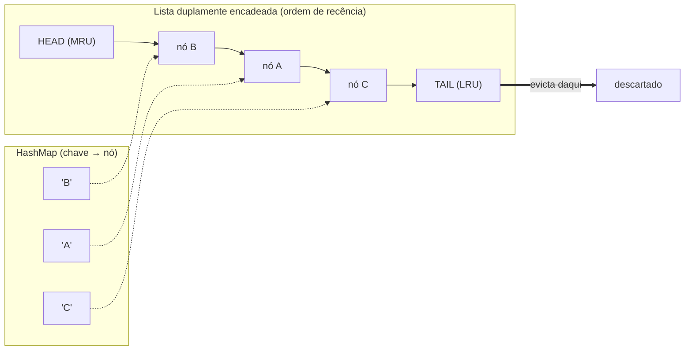
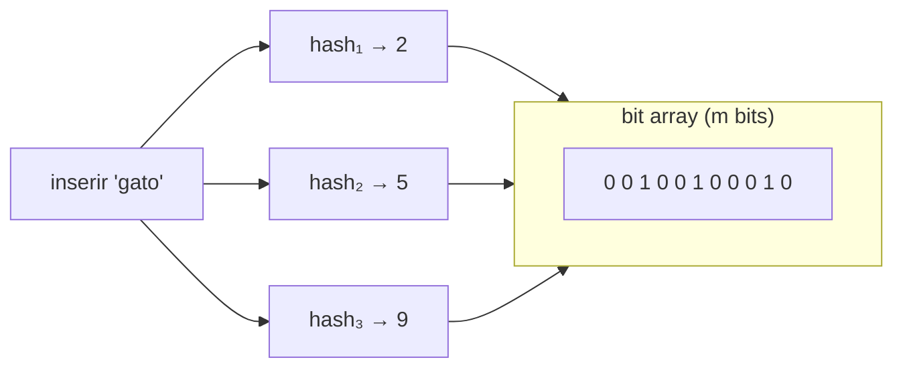
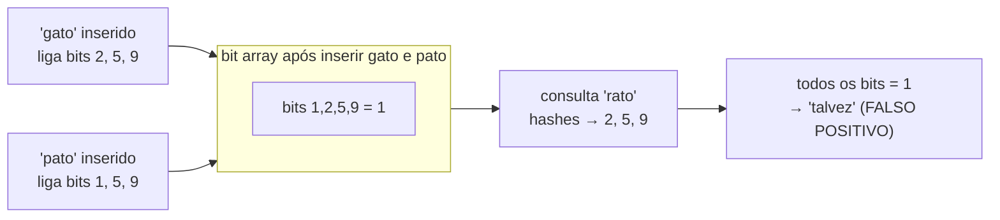
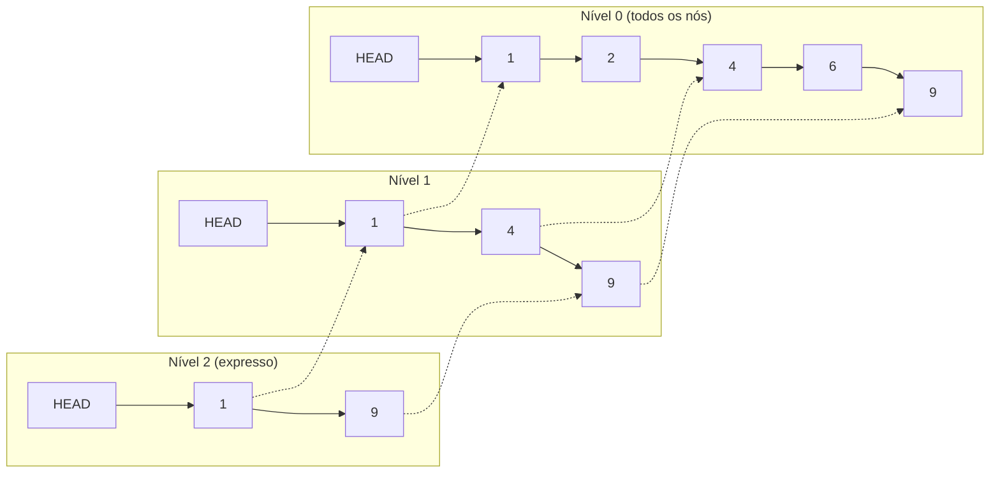
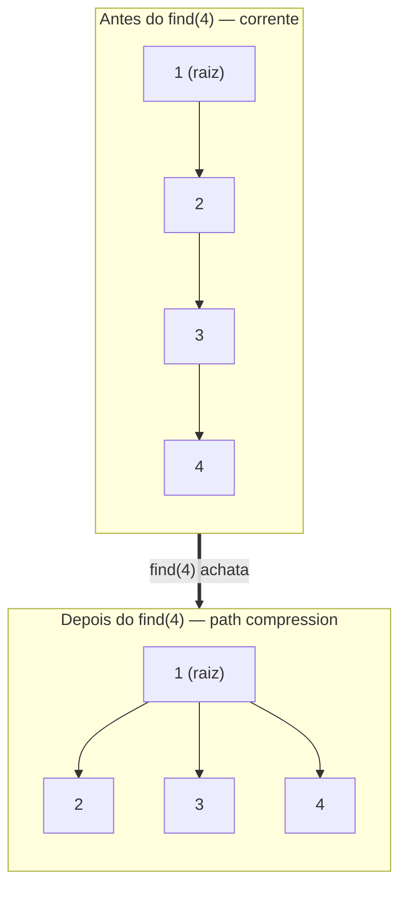
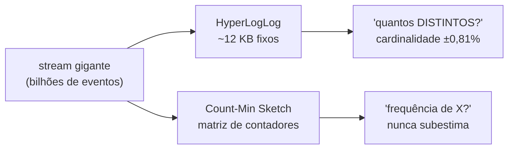

# Estruturas especializadas

Todas as estruturas das notas anteriores — arrays, listas, tabelas hash, árvores, heaps, grafos — resolvem o problema de **guardar e recuperar** dados com exatidão. Você pede um elemento, recebe o elemento. Você pergunta "está aqui?", recebe um sim ou não definitivo.

Esta nota é sobre uma vizinhança diferente: estruturas que **abrem mão de algo** — exatidão, simplicidade, ou generalidade — em troca de um superpoder específico. São as ferramentas que raramente aparecem num coding challenge de meia hora, mas que, mencionadas no momento certo de uma conversa de *system design*, sinalizam que você já viu sistema rodar em escala.

São quatro protagonistas e uma família convidada:

- **LRU Cache** — um cache de tamanho fixo que sabe **quem descartar** quando enche.
- **Bloom Filter** — um "porteiro" probabilístico que responde "talvez" ou "com certeza não", ocupando uma fração da memória de um `Set`.
- **Skip List** — uma lista encadeada com "pistas expressas" que alcança O(log n) sem a complexidade de uma árvore balanceada.
- **Disjoint Set (Union-Find)** — o contador de "vocês dois estão no mesmo grupo?" em tempo quase constante.
- E a **família probabilística de streaming** (HyperLogLog, Count-Min Sketch), que conta o incontável em alguns kilobytes.

> [!info] Esta nota é sobre as estruturas, não sobre os algoritmos que as usam
> O **union-find** aqui é dissecado como *estrutura* (parent/rank, path compression). Os algoritmos que o **empregam** — Kruskal, detecção de ciclo, componentes conexos — vivem em [[11 - Grafos - travessia e algoritmos]]. Hash básico (função de hash, colisões) está em [[05 - Tabelas hash]]; lista duplamente encadeada está em [[03 - Listas encadeadas]]. Aqui eu gesticulo e linko.

## TL;DR

- **LRU Cache:** cache de capacidade fixa que evicta o **menos recentemente usado**. Implementação clássica = **HashMap + lista duplamente encadeada** → get/put O(1), com a ordem de recência codificada na lista. Em Java, o `LinkedHashMap` com `accessOrder=true` + `removeEldestEntry` **já é um LRU pronto** (joia da stdlib). Irmão: **LFU** (menos *frequentemente* usado).
- **Bloom Filter:** teste de pertinência **probabilístico** — responde "**talvez presente**" ou "**definitivamente ausente**". Bit array + **k funções de hash**. **Falsos positivos sim, falsos negativos não.** Taxa de FP ajustável por (m bits, k hashes, n itens). Não deleta (→ counting Bloom filter, que reintroduz falsos negativos). Primo deletável: **Cuckoo filter**.
- **Skip List:** estrutura ordenada **probabilística** — lista encadeada com vários níveis de "pista expressa" → busca/inserção/remoção **O(log n)** esperado. Mais simples que árvore balanceada e **amigável a concorrência**. É o motor dos **sorted sets do Redis** e do **`ConcurrentSkipListMap`** do Java (o único mapa ordenado concorrente da stdlib).
- **Disjoint Set (Union-Find):** partições com **find** + **union**, quase-O(1) amortizado (**α(n)**, inverso de Ackermann, < 5 para qualquer n viável) via **path compression + union by rank**. Coração do Kruskal, detecção de ciclo, componentes conexos.
- **Família probabilística de streaming:** **HyperLogLog** (cardinalidade — "quantos *distintos*?" — em 12 KB fixos no Redis, `PFCOUNT`) e **Count-Min Sketch** (frequência aproximada). Trocam exatidão por espaço sublinear.
- Senior: são as estruturas que "demonstram senioridade" em *system design*. Saber que **Java embute LRU via `LinkedHashMap` e skip list via `ConcurrentSkipListMap`**, e que **Bloom/HLL trocam exatidão por espaço**, é o que separa o pleno do sênior.

---

## LRU Cache

Um cache vive de uma promessa: guardar o que é caro de recomputar para devolver rápido. Mas memória é finita. Quando o cache enche, **alguém precisa sair** — e a pergunta de ouro é: quem?

A política **LRU** (*Least Recently Used*) responde: descarte o item que **há mais tempo não é tocado**. A aposta é a **localidade temporal** — o que você acabou de usar, provavelmente vai usar de novo em breve; o que está esquecido há horas, provavelmente já não importa. É a mesma intuição dos caches de CPU, dos *buffer pools* de banco de dados e das CDNs.

O desafio de implementação é fazer **duas coisas ao mesmo tempo em O(1)**: localizar um item por chave (isso pede uma tabela hash) **e** saber quem é o mais antigo, reordenando a recência a cada acesso (isso pede uma fila ordenada). A solução canônica casa as duas estruturas.



**Leitura do diagrama:** o **HashMap** dá o salto O(1) da chave (`'A'`, `'B'`, `'C'`) direto para o **nó** correspondente na lista. A **lista duplamente encadeada** mantém a ordem de recência: o **head** é o *Most Recently Used*, o **tail** é o *Least Recently Used*. Toda vez que você acessa um item, você o **desliga da posição atual e o reconecta no head** (O(1), porque a lista é dupla e você tem o nó em mãos). Quando o cache estoura a capacidade, você **evicta o tail** — o item esquecido há mais tempo — e remove a chave correspondente do mapa. Sem o mapa, achar o nó seria O(n); sem a lista dupla, reordenar a recência seria O(n). Juntos, tudo é O(1).

> [!tip] Por que a lista precisa ser *dupla*
> Para remover um nó em O(1) você precisa religar o anterior ao próximo — e para isso precisa de uma referência ao **anterior**. Lista simples não te dá isso sem percorrer. É o caso de uso canônico da lista duplamente encadeada de [[03 - Listas encadeadas]].

### O irmão: LFU

A política irmã é **LFU** (*Least Frequently Used*): em vez de descartar o mais antigo, descarta o **menos frequente** — o item com menos *hits* desde que entrou. É melhor quando há itens "quentes" perenes que o LRU expulsaria injustamente durante uma rajada de acessos diferentes. O custo: manter contadores de frequência (e às vezes empatar com recência). LRU é o default da indústria por ser mais simples e barato; LFU aparece em caches sofisticados (o **Caffeine**, cache Java moderno, usa um híbrido chamado **W-TinyLFU**).

> [!info] Onde LRU mora no mundo real
> *Buffer pool* do PostgreSQL/MySQL (páginas de disco em RAM), caches de CPU (L1/L2/L3 usam aproximações de LRU em hardware), CDNs (objetos quentes na borda), e praticamente todo cache de aplicação com limite de tamanho.

---

## Bloom Filter

Imagine que antes de cada consulta cara ao banco — "esse e-mail já foi cadastrado?" — você pudesse fazer uma pergunta muito mais barata que, na maioria dos "não", te poupasse a viagem ao disco. É exatamente isso que um **Bloom filter** faz: um "porteiro" que responde, em memória e em tempo constante, **"talvez esteja"** ou **"definitivamente não está"**.

A mágica está numa assimetria deliberada. O Bloom filter **nunca erra um "não"** (zero falsos negativos), mas **pode errar um "talvez"** (falsos positivos existem). Você só paga a consulta cara quando o filtro diz "talvez" — e o "definitivamente não" é sempre confiável, cortando a maioria das buscas inúteis.

A estrutura é minúscula: um **bit array** de `m` bits e **k funções de hash**.



**Leitura do diagrama:** para **inserir** `'gato'`, passamos a chave pelas `k` funções de hash (aqui k=3), obtendo `k` posições (2, 5, 9), e **ligamos esses bits para 1**. Para **consultar** depois, recalculamos as mesmas `k` posições e olhamos: se **algum** dos bits estiver em 0, o item é **definitivamente ausente** (se tivesse sido inserido, todos estariam em 1). Se **todos** estiverem em 1, respondemos "**talvez presente**" — talvez de verdade, talvez por coincidência de bits ligados por *outros* itens. Note que nunca guardamos `'gato'`: só ligamos bits. Por isso o filtro ocupa kilobytes onde um `Set` ocuparia megabytes.

### Por que o falso positivo acontece



**Leitura do diagrama:** inserimos `'gato'` (bits 2, 5, 9) e `'pato'` (bits 1, 5, 9). Agora consultamos `'rato'`, que nunca foi inserido, mas cujos hashes calham de cair em 2, 5 e 9 — **todos já ligados por gato e pato**. O filtro responde "talvez", e está **errado**. Esse é o falso positivo: bits ligados por *outros* itens conspiram para fingir a presença de um item ausente. Quanto mais cheio o filtro, mais frequente isso fica — e é por isso que a taxa de FP é **ajustável** escolhendo `m` (mais bits) e `k` (número ótimo de hashes) para um número esperado `n` de itens.

> [!warning] Bloom filter não deleta
> Apagar um item exigiria zerar seus `k` bits — mas esses bits podem estar sendo compartilhados por outros itens, e zerá-los criaria **falsos negativos** (o veneno que o Bloom filter foi projetado para nunca ter). Solução: **counting Bloom filter** (cada posição vira um contador em vez de um bit), que aceita deleção ao custo de mais memória e de reintroduzir uma chance de falso negativo. Já o **Cuckoo filter** suporta deleção mantendo zero falsos negativos (enquanto você não deletar algo nunca inserido) e costuma ser mais compacto.

> [!info] Onde Bloom filter mora no mundo real
> **Cassandra e HBase** usam Bloom filters para evitar ler SSTables de disco que não contêm a chave procurada. **Bitcoin (SPV)** usava-os para filtrar transações relevantes. **CDNs e web crawlers** os usam para "já vi essa URL?". Bancos os usam para pular *lookups* em índices vazios.

---

## Skip List

Uma lista encadeada ordenada tem um defeito fatal: para achar um elemento, você percorre **nó por nó** — O(n). Árvores balanceadas (AVL, red-black) resolvem com O(log n), mas ao custo de rotações e invariantes delicadas de manter (e de programar). A **skip list** é a terceira via: alcança O(log n) **sem nenhuma rotação**, usando uma ideia desarmadamente simples — **pistas expressas**.

A intuição é a de uma rodovia com saídas. No nível do chão, todos os nós estão ligados em sequência. Mas alguns nós também participam de uma "pista expressa" um nível acima, que pula vários nós de uma vez; e alguns *desses* participam de uma pista ainda mais expressa acima. Para buscar, você anda pela pista mais alta até quase passar do alvo, **desce um nível**, continua, desce de novo — descartando metade do que resta a cada nível, como uma busca binária sobre uma lista.



**Leitura do diagrama:** o **nível 0** tem todos os nós ordenados (1, 2, 4, 6, 9). Os níveis acima são pistas expressas com **cada vez menos nós**. Para buscar o **6**: começo no nível 2 (expresso), avanço de HEAD para `1`; o próximo é `9`, que passa do alvo — então **desço** para o nível 1, avanço `1 → 4`; o próximo lá é `9`, passa de novo — **desço** para o nível 0 em `4`, avanço `4 → 6`, achei. Pulei `2` inteiramente. A cada nível eu descarto um pedação da lista, e é daí que vem o **O(log n) esperado**. O "esperado" é a palavra-chave: a altura de cada nó é decidida por **moeda jogada** na inserção (50% de chance de subir mais um nível), então a estrutura é **probabilística** — em média balanceada, sem nunca precisar rebalancear ativamente.

> [!tip] Por que skip list e não árvore balanceada
> Duas razões. **Simplicidade**: inserir/remover é só religar ponteiros em alguns níveis — nada de rotações ou recoloração. **Concorrência**: como cada modificação toca poucos ponteiros locais, é muito mais fácil fazer uma skip list *lock-free* ou com travas finas do que uma árvore balanceada, onde uma rotação pode reorganizar uma subárvore inteira. É exatamente por isso que o Java escolheu skip list para seu mapa ordenado **concorrente**.

> [!info] Onde skip list mora no mundo real
> **Redis** usa skip list (combinada com uma hashtable) para implementar *sorted sets* (`zset`) quando eles passam de pequenos — a skip list dá *range queries* por score em O(log n), a hashtable dá *lookup* de score em O(1). **Java** expõe `ConcurrentSkipListMap` e `ConcurrentSkipListSet` na stdlib (`java.util.concurrent`).

---

## Disjoint Set (Union-Find)

Algumas perguntas não são sobre *qual* dado, mas sobre **agrupamento**: "essas duas cidades estão na mesma rede elétrica?", "esses dois pixels pertencem à mesma região da imagem?", "adicionar esta aresta cria um ciclo?". Todas se reduzem a uma única primitiva: **manter partições de um conjunto e perguntar se dois elementos caíram no mesmo grupo** — respondendo (e fundindo grupos) em tempo quase constante.

Essa é a estrutura **Disjoint Set**, mais conhecida pelas suas duas operações: **Union-Find**.

- **find(x)** — retorna o "representante" (a raiz) do grupo de `x`.
- **union(x, y)** — funde os grupos de `x` e `y` em um só.

Dois elementos estão no mesmo grupo se, e somente se, `find(x) == find(y)`. A representação é um array `parent` onde cada elemento aponta para seu pai; seguir os pais até alguém que aponta para si mesmo te leva à raiz — o representante do grupo. Cada grupo é, portanto, uma **árvore invertida** (filhos apontando para pais).

A versão ingênua degenera: árvores podem virar correntes longas, e `find` vira O(n). Duas otimizações combinadas resgatam o desempenho:

- **Union by rank** — ao fundir, pendure a árvore **mais baixa** sob a raiz da **mais alta**, mantendo tudo raso.
- **Path compression** — durante o `find`, **religue cada nó visitado direto à raiz**, achatando o caminho para as próximas consultas.



**Leitura do diagrama:** antes, o grupo é uma corrente `1 ← 2 ← 3 ← 4`; um `find(4)` precisa subir três saltos até a raiz `1`. A **path compression** aproveita essa subida: ao retornar, ela **reconecta 4, 3 e 2 diretamente à raiz 1**. Depois, a árvore tem altura 1 — qualquer `find` futuro sobre esses nós custa um único salto. Repetindo isso ao longo das operações, as árvores ficam tão rasas que o custo amortizado por operação cai para **α(n)**, o inverso da função de Ackermann — um valor que **não passa de 5 para qualquer `n` concebível no universo** (≈ n < 10^600). Na prática, é constante.

> [!info] Onde union-find mora no mundo real
> **Kruskal (MST)** — o union-find decide se adicionar uma aresta uniria dois componentes ou criaria ciclo. **Detecção de ciclo** em grafos não-direcionados. **Componentes conexos** (quantas "ilhas"?). **Segmentação de imagem** (pixels vizinhos similares viram a mesma região). Os algoritmos que o usam estão em [[11 - Grafos - travessia e algoritmos]] — aqui é só a estrutura.

---

## Família probabilística de streaming

Bloom filter e skip list já mostraram a filosofia: **trocar exatidão por espaço**. Há uma família inteira que leva essa ideia ao extremo, projetada para **streams** — fluxos de dados grandes demais para caber na memória, que você só pode olhar **uma vez**. Em vez de guardar os dados, elas guardam um **resumo (sketch)** de tamanho fixo e respondem aproximações.

- **HyperLogLog (HLL)** — responde "**quantos elementos *distintos* eu vi?**" (cardinalidade). Em vez de um `Set` de bilhões de itens (gigabytes), guarda um resumo de **~12 KB fixos** e estima a contagem com erro padrão de **~0,81%**. A intuição: hasheia cada item e observa a posição do **primeiro bit 1** no hash; ver um hash que começa com muitos zeros é raro, e a raridade observada indica quantos itens distintos passaram. É o que o Redis expõe via `PFADD`/`PFCOUNT`.
- **Count-Min Sketch** — responde "**quantas vezes vi *este* item?**" (frequência aproximada). Uma matriz de contadores indexada por várias funções de hash; pode **superestimar** (colisões somam), nunca subestima. Usado para *heavy hitters* (os itens mais frequentes de um stream) sem guardar um contador por item.



**Leitura do diagrama:** o mesmo stream gigante alimenta duas estruturas de **tamanho fixo**, cada uma respondendo uma pergunta diferente. O **HyperLogLog** responde *cardinalidade* ("quantos usuários únicos visitaram hoje?") em 12 KB constantes, não importa se foram mil ou um bilhão. O **Count-Min Sketch** responde *frequência* ("quantas vezes este IP apareceu?"), útil para detectar *heavy hitters* sem manter um mapa de contadores que explodiria em memória. As duas nunca guardam os eventos em si — só um resumo — e por isso aceitam um erro pequeno e controlado em troca de espaço sublinear.

> [!tip] A pergunta que cada uma responde
> Bloom = "**pertence?**" (sim/não com FP). HyperLogLog = "**quantos distintos?**". Count-Min = "**quão frequente?**". Skip list = "**ordenado, com range queries**". Reconhecer qual pergunta o sistema está fazendo é o que aponta para a estrutura certa.

---

## Implementações comparadas: Java · TypeScript · Python · Go

A senioridade aqui não é saber implementar tudo do zero — é saber **quando a stdlib já te dá a estrutura de graça** e quando você precisa de uma biblioteca. O destaque: Java embute dois desses (LRU e skip list); ninguém embute Bloom filter; union-find todo mundo faz na mão.

### LRU Cache

**Java** — a joia da stdlib. `LinkedHashMap` com `accessOrder=true` já reordena por acesso; basta sobrescrever `removeEldestEntry` para evictar o mais antigo:

```java
// LRU pronto em ~8 linhas, sem lista encadeada manual
class LRUCache<K, V> extends LinkedHashMap<K, V> {
    private final int capacity;
    public LRUCache(int capacity) {
        super(capacity, 0.75f, true); // accessOrder = true → reordena por acesso
        this.capacity = capacity;
    }
    @Override
    protected boolean removeEldestEntry(Map.Entry<K, V> eldest) {
        return size() > capacity; // evicta o LRU automaticamente no put()
    }
}
```

**Python** — duas vias. O decorator `functools.lru_cache` resolve memoization de função sem você ver a estrutura; para um cache manual, `OrderedDict.move_to_end` reposiciona a chave acessada:

```python
from functools import lru_cache
from collections import OrderedDict

@lru_cache(maxsize=128)        # memoization automática com política LRU
def fib(n): ...

class LRUCache:                # versão manual
    def __init__(self, cap): self.cap, self.d = cap, OrderedDict()
    def get(self, k):
        if k not in self.d: return -1
        self.d.move_to_end(k)  # marca como mais recente
        return self.d[k]
    def put(self, k, v):
        self.d[k] = v
        self.d.move_to_end(k)
        if len(self.d) > self.cap:
            self.d.popitem(last=False)  # remove o LRU
```

**JavaScript/TypeScript** — `Map` preserva ordem de inserção, o que dá um LRU enxuto via delete+set (reinserir joga a chave para o fim):

```typescript
class LRUCache<K, V> {
  private map = new Map<K, V>();
  constructor(private cap: number) {}
  get(k: K): V | undefined {
    if (!this.map.has(k)) return undefined;
    const v = this.map.get(k)!;
    this.map.delete(k); this.map.set(k, v); // reinsere → vira o mais recente
    return v;
  }
  put(k: K, v: V): void {
    if (this.map.has(k)) this.map.delete(k);
    this.map.set(k, v);
    if (this.map.size > this.cap)
      this.map.delete(this.map.keys().next().value!); // 1º da iteração = LRU
  }
}
```

**Go** — sem LRU na stdlib; constrói-se com `map` + `container/list` (lista dupla), ou usa-se a biblioteca de fato `hashicorp/golang-lru`:

```go
import lru "github.com/hashicorp/golang-lru/v2"

cache, _ := lru.New[string, int](128) // LRU pronto, thread-safe
cache.Add("a", 1)
v, ok := cache.Get("a")
```

### Bloom Filter

Nenhuma stdlib embute — sempre biblioteca (ou você implementa o princípio: bit array + k hashes).

- **Java** — **Guava** `BloomFilter` é o padrão de fato: `BloomFilter.create(funnel, expectedInsertions, fpp)`.
- **Python** — `rbloom` (rápido, em Rust) ou `pybloom-live`.
- **Go** — `bits-and-blooms/bloom`.
- **JS/TS** — bibliotecas como `bloom-filters`.

```java
// Java + Guava: filtro para 1M itens com 1% de falso positivo
BloomFilter<String> filtro =
    BloomFilter.create(Funnels.stringFunnel(StandardCharsets.UTF_8), 1_000_000, 0.01);
filtro.put("email@exemplo.com");
filtro.mightContain("email@exemplo.com"); // true (talvez)
filtro.mightContain("outro@exemplo.com"); // false = definitivamente ausente
```

### Skip List

**Java** — **stdlib**, e é o destaque: `ConcurrentSkipListMap` / `ConcurrentSkipListSet` são o **único mapa/conjunto ordenado concorrente** do JDK (`java.util.concurrent`), com O(log n) esperado para get/put/remove. Quando você precisa de um `TreeMap` thread-safe, é aqui que se vai:

```java
// Mapa ordenado, thread-safe, lock-free para leituras
ConcurrentNavigableMap<Long, String> ordenado = new ConcurrentSkipListMap<>();
ordenado.put(3L, "três");
ordenado.put(1L, "um");
ordenado.firstKey();          // 1 — mantém ordem natural
ordenado.subMap(1L, 5L);      // range query O(log n), seguro sob concorrência
```

**Redis** — usa skip list internamente para *sorted sets* grandes (verificado: skiplist + hashtable acima do limiar `zset-max-listpack-entries`). Você nunca vê a skip list; vê os comandos `ZADD`/`ZRANGE`. **Python/Go/JS** — sem skip list na stdlib; via biblioteca ou implementação própria.

### Union-Find

Construído **na mão em toda linguagem** — é só um array `parent` (e um `rank`). Não há stdlib para isso em lugar nenhum.

```java
// Java — parent[] + rank[], path compression + union by rank
class UnionFind {
    int[] parent, rank;
    UnionFind(int n) {
        parent = new int[n]; rank = new int[n];
        for (int i = 0; i < n; i++) parent[i] = i; // cada um é seu próprio grupo
    }
    int find(int x) {
        if (parent[x] != x) parent[x] = find(parent[x]); // path compression
        return parent[x];
    }
    void union(int a, int b) {
        int ra = find(a), rb = find(b);
        if (ra == rb) return;
        if (rank[ra] < rank[rb]) { int t = ra; ra = rb; rb = t; } // union by rank
        parent[rb] = ra;
        if (rank[ra] == rank[rb]) rank[ra]++;
    }
}
```

```python
# Python — list parent + rank; mesmo padrão
class UnionFind:
    def __init__(self, n):
        self.parent = list(range(n))
        self.rank = [0] * n
    def find(self, x):
        while self.parent[x] != x:
            self.parent[x] = self.parent[self.parent[x]]  # path halving
            x = self.parent[x]
        return x
    def union(self, a, b):
        ra, rb = self.find(a), self.find(b)
        if ra == rb: return
        if self.rank[ra] < self.rank[rb]: ra, rb = rb, ra
        self.parent[rb] = ra
        if self.rank[ra] == self.rank[rb]: self.rank[ra] += 1
```

```go
// Go — []int parent + rank
type UnionFind struct{ parent, rank []int }

func NewUF(n int) *UnionFind {
    p := make([]int, n)
    for i := range p { p[i] = i }
    return &UnionFind{p, make([]int, n)}
}
func (u *UnionFind) Find(x int) int {
    for u.parent[x] != x {
        u.parent[x] = u.parent[u.parent[x]] // path halving
        x = u.parent[x]
    }
    return x
}
func (u *UnionFind) Union(a, b int) {
    ra, rb := u.Find(a), u.Find(b)
    if ra == rb { return }
    if u.rank[ra] < u.rank[rb] { ra, rb = rb, ra }
    u.parent[rb] = ra
    if u.rank[ra] == u.rank[rb] { u.rank[ra]++ }
}
```

### Síntese sênior

| Estrutura | Stdlib embute? | Onde |
| --- | --- | --- |
| **LRU** | **Sim (Java, Python)** | Java `LinkedHashMap` (accessOrder); Python `functools.lru_cache` / `OrderedDict` |
| **Bloom filter** | Não (ninguém) | Guava (Java), `rbloom` (Python), `bits-and-blooms` (Go) |
| **Skip list** | **Sim (Java)** | `ConcurrentSkipListMap`/`Set` — único ordenado concorrente; Redis usa internamente |
| **Union-Find** | Não (ninguém) | `parent[]` + `rank[]` na mão, toda linguagem |

> O diferencial sênior é o **mapa mental**: saber que Java te dá LRU via `LinkedHashMap` e skip list via `ConcurrentSkipListMap` sem dependência externa, que Bloom e HyperLogLog **trocam exatidão por ordens de magnitude de memória**, e que union-find é trivial de escrever mas resolve uma classe inteira de problemas de agrupamento. Reconhecer a estrutura certa numa conversa de *system design* vale mais que decorar a implementação.

---

## Em entrevista

Essas estruturas raramente caem como problema de implementação num *coding challenge* curto — mas brilham numa pergunta de **system design**, exatamente por sinalizarem experiência com escala.

> "When I need a bounded cache, I reach for an **LRU**: a hash map for O(1) lookup plus a doubly-linked list for recency, evicting the tail. In Java I don't even build that by hand — `LinkedHashMap` with `accessOrder=true` and `removeEldestEntry` gives me an LRU in a few lines.
>
> To avoid expensive lookups — 'does this key exist in the database?' — I'd put a **Bloom filter** in front. It tells me 'definitely not' or 'maybe', never a false negative, in a fraction of the memory of a real set. The trade-off is false positives, which I can tune. That's how Cassandra avoids touching SSTables that don't hold the key.
>
> For an ordered structure under concurrency, a **skip list** is often better than a balanced tree — it's lock-friendly and simpler. Java ships `ConcurrentSkipListMap`, the only concurrent sorted map in the JDK, and Redis uses skip lists for its sorted sets.
>
> And when the question is 'are these two things in the same group?' — connected components, cycle detection, Kruskal's MST — **union-find** answers in near-constant time with path compression and union by rank.
>
> The meta-point is the same one that runs through everything: **these structures trade exactness or generality for a specific superpower.** A Bloom filter trades certainty for space; HyperLogLog counts billions of distinct items in twelve kilobytes. Knowing when that trade pays off — and when it's premature — is the senior judgment call."

> [!tip] A frase que fecha
> "These impress in system design because they show I've thought about **scale and trade-offs**, not just correctness." É o registro que separa "eu sei a definição" de "eu já vi isso quebrar em produção".

---

## Referências

- [LinkedHashMap (Java SE 8 docs)](https://docs.oracle.com/javase/8/docs/api/java/util/LinkedHashMap.html) — `accessOrder` e `removeEldestEntry` para LRU embutido.
- [ConcurrentSkipListMap (Java SE 17 docs)](https://docs.oracle.com/en/java/javase/17/docs/api/java.base/java/util/concurrent/ConcurrentSkipListMap.html) — variante concorrente de skip list, O(log n) esperado, único mapa ordenado concorrente do JDK.
- [How Redis Sorted Sets Work Internally (Skiplist and Listpack)](https://oneuptime.com/blog/post/2026-03-31-redis-sorted-sets-work-internally-skiplist/view) — `zset` usa skiplist + hashtable acima de `zset-max-listpack-entries`.
- [Cuckoo Filter: Practically Better Than Bloom (CMU)](https://www.cs.cmu.edu/~dga/papers/cuckoo-conext2014.pdf) — Bloom só tem falso positivo (nunca negativo); não deleta; Cuckoo deleta.
- [Counting Bloom filter (Wikipedia)](https://en.wikipedia.org/wiki/Counting_Bloom_filter) — deleção reintroduz risco de falso negativo.
- [HyperLogLog (Redis docs)](https://redis.io/docs/latest/develop/data-types/probabilistic/hyperloglogs/) — cardinalidade em ~12 KB fixos, erro padrão ~0,81%, `PFADD`/`PFCOUNT`.
- [Union By Rank and Path Compression (GeeksforGeeks)](https://www.geeksforgeeks.org/dsa/union-by-rank-and-path-compression-in-union-find-algorithm/) — amortizado O(α(n)), inverso de Ackermann, < 5 para qualquer n viável.
- [Guava BloomFilter](https://guava.dev/releases/snapshot/api/docs/com/google/common/hash/BloomFilter.html) — implementação de referência em Java.
- [hashicorp/golang-lru](https://github.com/hashicorp/golang-lru) — LRU de fato em Go.

> [!note] Lastro de honestidade
> Os fatos verificáveis foram conferidos via web: `LinkedHashMap` como LRU (accessOrder + removeEldestEntry), `ConcurrentSkipListMap` como skip list stdlib concorrente, Redis usando skip list para sorted sets grandes, Bloom filter com falso positivo mas nunca falso negativo, HyperLogLog em 12 KB com ~0,81% de erro no Redis, e union-find amortizado em α(n). As implementações em Python/Go/JS são idiomáticas e revisadas, mas não executadas neste ambiente — trate-as como esqueleto correto, não como código copiado de produção. APIs exatas de bibliotecas (Guava, golang-lru, rbloom) podem variar entre versões; confira a doc da versão que você usar.

## Veja também

- [[05 - Tabelas hash]] — a base do HashMap por trás do LRU e dos hashes do Bloom filter.
- [[03 - Listas encadeadas]] — a lista duplamente encadeada que faz o LRU ser O(1).
- [[11 - Grafos - travessia e algoritmos]] — onde o union-find é *usado* (Kruskal, ciclo, componentes).
- [[13 - Escolhendo a estrutura certa]] — o framework de decisão que escolhe entre tudo isto.
- [[Dicionário de Ciência da Computação]]
