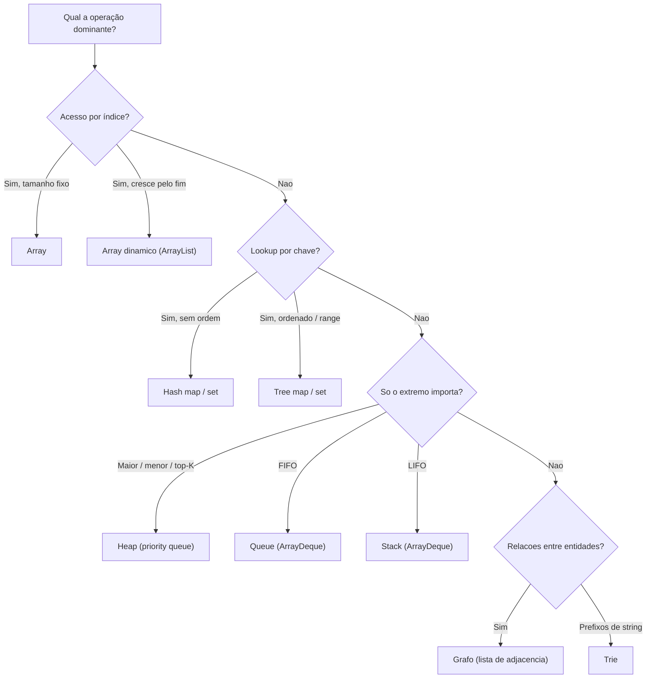
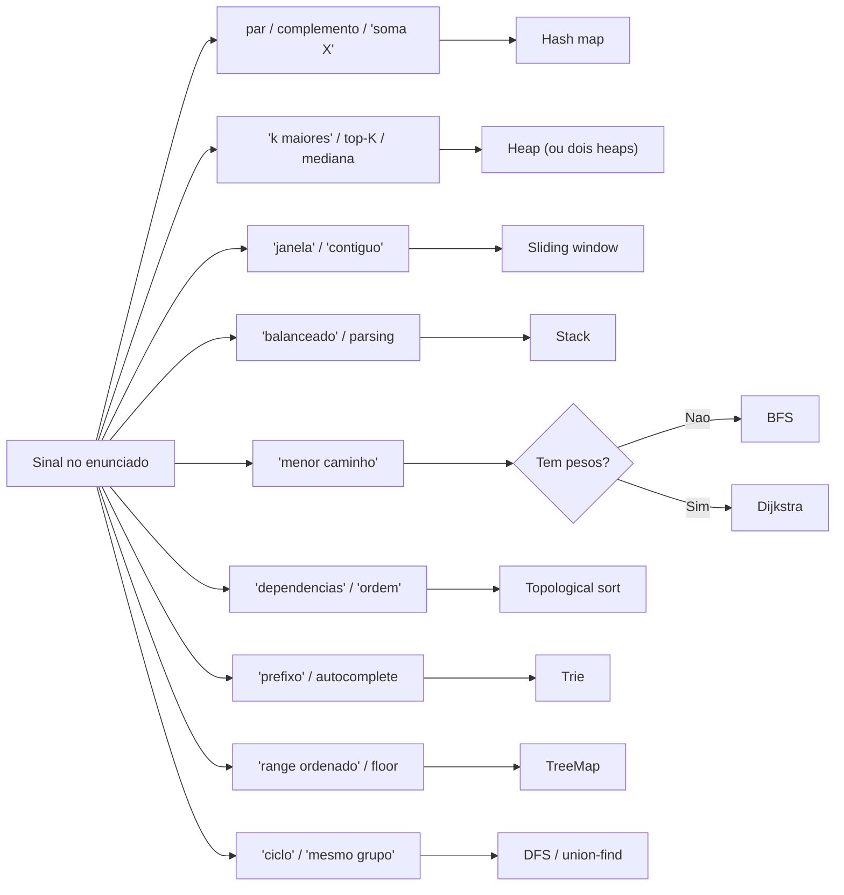

# Escolhendo a estrutura certa

As doze notas anteriores dissecaram cada estrutura por dentro: o array contíguo, a lista de nós, a tabela hash com seus buckets, a árvore que se reequilibra, o heap que só ordena pai e filho, o grafo e suas travessias. Cada uma respondeu "como funciona" e "quando brilha".

Esta nota fecha o galho com a pergunta que importa numa entrevista: **dado este problema, qual eu escolho — e por quê?**

Não há estrutura nova aqui. Há **síntese**: a tabela de complexidade que você cola na parede, o dicionário de "sinal no enunciado → estrutura", o cheat-sheet que mapeia cada estrutura abstrata no tipo idiomático de Java, TypeScript, Python e Go, e o roteiro de como explicar tudo isso em inglês sem gaguejar. É o capstone — o mapa que une os pinos que você espetou ao longo do galho.

> [!info] O framework de decisão profundo vive na nota 01
> As **perguntas** que guiam a escolha (padrão de acesso, chave natural, ordem, concorrência, duplicatas) são desenvolvidas com calma em [[01 - O que é uma estrutura de dados]]. Aqui eu **recapitulo** o framework e mergulho no que é específico do capstone: as tabelas de referência, os patterns de entrevista e a preparação bilíngue.

## TL;DR

- **Escolher é responder perguntas**, nessa ordem: *qual o acesso dominante?* → *tem chave natural?* → *preciso de ordem?* → *tamanho fixo ou dinâmico?* → *concorrência?* → *duplicatas?*. As respostas convergem numa família de estrutura.
- **90% do trabalho** em backend é feito por **array, hash map e fila/pilha**. O resto (trie, heap, TreeMap, união-find, bloom) é para quando o problema *grita* por eles.
- **Tabela de complexidade** = a cola de referência. **Acesso O(1)** só array/ArrayList. **Busca O(1)** só hash. **Ordenado + busca rápida** = TreeMap O(log n). **Topo rápido** = heap O(log n).
- **Pattern matching de entrevista**: "par com soma X" → hash; "k maiores" → heap-k; "janela fixa" → sliding window; "parênteses" → stack; "menor caminho não-ponderado" → BFS; "com pesos" → Dijkstra; "dependências" → topo-sort; "prefixo" → trie; "LRU" → LinkedHashMap; "mediana em stream" → dois heaps; "range ordenado" → TreeMap; "ciclo / mesmo grupo" → DFS/union-find.
- **Cross-linguagem**: o conceito é o mesmo; o tipo muda. Java tem o JCF mais completo. **JS/TS não tem mapa ordenado nem priority queue na stdlib** (lib ou build-it). **Go** te dá `container/heap` (você traz o tipo) e o set é o idioma `map[T]struct{}`. **Python** tem `heapq` e `OrderedDict`, mas `sortedcontainers` (mapa ordenado) é terceiros.
- **Em inglês**: a entrevista não premia recitar definição; premia raciocinar sobre **trade-off**. "It depends on the access pattern" é a abertura de ouro.

## Recap: o framework de decisão

Antes de codar qualquer coisa, responda — em voz alta numa entrevista, mentalmente no trabalho:

1. **Qual é o padrão de acesso dominante?** Lookup por chave? Iteração sequencial? Top-K? Range query? FIFO/LIFO? A operação que você faz **mais vezes** decide tudo.
2. **Há chave natural?** Se sim → hash ou tree. Se não → array/lista indexada.
3. **Preciso de ordem?** Nenhuma → `HashMap`. Inserção/acesso → `LinkedHashMap`. Natural/ordenada → `TreeMap`. Parcial (só o extremo) → heap.
4. **O tamanho é conhecido?** Fixo → array cru. Dinâmico → array dinâmico / map.
5. **Há concorrência?** Sim → `ConcurrentHashMap`, `CopyOnWriteArrayList`, `ConcurrentSkipListMap`. Estruturas comuns **não são thread-safe**.
6. **Duplicatas importam?** Sim → List. Não → Set.

Três dimensões atravessam todas as respostas: **tempo** (Big O das operações), **espaço** (memória + overhead por elemento) e **ordem** (inserção? natural? nenhuma?).

### Árvore de decisão mestra

O fluxo abaixo é a versão visual do framework: você entra com o problema e cai numa estrutura. Não é dogma — é o primeiro palpite, o que você diz antes de refinar.

> **Leitura do diagrama:** a primeira bifurcação é sempre *acesso por índice vs. lookup por chave*. Se é índice, array (fixo) ou array dinâmico (cresce). Se é chave, hash (sem ordem) ou tree (ordenado). Se nem índice nem chave, a pergunta vira "o que você consome": só o extremo → heap; ordem de chegada/saída → fila/pilha; relações → grafo; prefixos → trie. Repare que o array dinâmico e o hash map ficam no topo dos caminhos curtos — são os destinos mais frequentes por design.

### Mapa das estruturas do galho

E este é o inventário completo, agrupado por família, com o uso típico de cada uma — o índice do galho em uma imagem.

```mermaid
flowchart TD
    ED["Estruturas de dados"]

    ED --> LIN["Lineares"]
    ED --> ASSOC["Associativas"]
    ED --> HIER["Hierarquicas"]
    ED --> REDE["Em rede"]
    ED --> ESP["Especializadas"]

    LIN --> L1["Array / ArrayList — acesso O(1), iteracao cache-friendly"]
    LIN --> L2["Lista encadeada — insercao/remocao O(1) com referencia"]
    LIN --> L3["Pilha / fila / deque — LIFO / FIFO / ambas pontas"]

    ASSOC --> A1["Hash map / set — lookup O(1), contagem, dedup"]
    ASSOC --> A2["LinkedHashMap — ordem de insercao/acesso, LRU"]
    ASSOC --> A3["TreeMap / set — ordenado, range query O(log n)"]

    HIER --> H1["BST / arvore balanceada — busca ordenada O(log n)"]
    HIER --> H2["Heap — top-K, scheduling, Dijkstra"]
    HIER --> H3["Trie — autocomplete, busca por prefixo"]
    HIER --> H4["Arvore B / B+ — indices de banco em disco"]

    REDE --> R1["Grafo — relacoes, rotas, dependencias, BFS/DFS"]

    ESP --> E1["LRU cache, bloom filter, skip list, union-find"]
```

> **Leitura do diagrama:** cinco famílias. **Lineares** (a ordem é posicional), **associativas** (chave → valor), **hierárquicas** (relação pai-filho), **em rede** (relação arbitrária entre nós) e **especializadas** (trocam exatidão ou simplicidade por um superpoder). Cada folha cita o uso que justifica a estrutura. Use este mapa para conferir se você conhece o *para quê* de cada nó — se algum soar estranho, a nota dedicada está a um wikilink.

## Tabela de complexidade comparativa

A cola de referência. Memorize as linhas que você usa todo dia (array, hash, tree, heap); para o resto, saiba **de onde** vem o custo (por que LinkedList é O(n) no acesso, por que TreeMap é O(log n)).

| Estrutura             | Acesso | Busca    | Inserção    | Remoção  | Espaço   | Ordem            |
| --------------------- | ------ | -------- | ----------- | -------- | -------- | ---------------- |
| Array                 | O(1)   | O(n)     | O(n)        | O(n)     | O(n)     | inserção         |
| Array dinâmico        | O(1)   | O(n)     | O(1) amort. | O(n)     | O(n)     | inserção         |
| Lista encadeada       | O(n)   | O(n)     | O(1)*       | O(1)*    | O(n)     | inserção         |
| Stack / Queue / Deque | —      | O(n)     | O(1)        | O(1)     | O(n)     | inserção         |
| Hash map / Hash set   | —      | O(1)†    | O(1)†       | O(1)†    | O(n)     | nenhuma          |
| LinkedHashMap         | —      | O(1)†    | O(1)†       | O(1)†    | O(n)     | inserção/acesso  |
| Tree map / Tree set   | —      | O(log n) | O(log n)    | O(log n) | O(n)     | natural          |
| Heap (priority queue) | —      | O(n)     | O(log n)    | O(log n) | O(n)     | parcial          |
| Trie                  | —      | O(L)     | O(L)        | O(L)     | O(A·N·L) | lexicográfica    |
| BST (balanceada)      | —      | O(log n) | O(log n)    | O(log n) | O(n)     | natural          |
| BST (desbalanceada)   | —      | O(n)     | O(n)        | O(n)     | O(n)     | natural          |

\* Com referência ao nó (sem ela, é O(n) para chegar lá). † O(1) **amortizado** no caso médio; pior caso é O(n) durante rehashing ou com colisões adversariais (em Java 8+, buckets viram árvore acima de um threshold, degradando para O(log n) em vez de O(n)). L = comprimento da string; A = tamanho do alfabeto; N = número de strings.

Três leituras rápidas desta tabela:

- **"Acesso" só faz sentido com índice.** Por isso array e array dinâmico têm O(1); as demais têm "—" — você não acessa um hash map "pela posição 3", você busca por chave.
- **A coluna "Ordem" é o desempate.** Hash e tree têm a mesma cara funcional (chave → valor), mas hash é O(1) sem ordem e tree é O(log n) **com** ordem. Você paga o log n exatamente pela ordenação.
- **Heap engana.** Inserção/remoção O(log n) parece caro, mas a busca arbitrária é O(n) — heap **não** é para procurar elemento qualquer, é para sempre ter o extremo à mão.

## Patterns de entrevista

Metade do problema é reconhecer o pattern. Coding interviews reciclam um punhado de "sinais" no enunciado que apontam direto para a estrutura. Treine o gatilho.

| Sinal no enunciado                             | Estrutura / técnica              |
| ---------------------------------------------- | -------------------------------- |
| "par com soma X" / "dois números que somam"    | Hash map (guarda o complemento)  |
| "primeira ocorrência repetida / é único?"      | Hash set                         |
| "k maiores / k menores / top-K"                | Heap de tamanho k                |
| "janela de tamanho fixo / contígua"            | Sliding window (dois ponteiros)  |
| "subarray contíguo com soma X"                 | Prefix sum + hash map            |
| "parênteses balanceados" / parsing / "válido?" | Stack                            |
| "caminho mais curto" (não-ponderado)           | BFS                              |
| "caminho mais curto" (com pesos não-negativos) | Dijkstra (heap)                  |
| "ordem de execução com dependências"           | Topological sort                 |
| "autocomplete / busca por prefixo"             | Trie                             |
| "LRU / cache com capacidade fixa"              | LinkedHashMap, ou hash map + DLL |
| "mediana em stream / fluxo de números"         | Dois heaps (min + max)           |
| "range / intervalo ordenado / floor-ceiling"   | TreeMap                          |
| "detectar ciclo / mesmo grupo / conectados?"   | DFS (estados) ou union-find      |

### Sinal de entrevista → estrutura

O mesmo gatilho como fluxo: do que o enunciado *diz* para o que você *escreve*.

> **Leitura do diagrama:** leia da esquerda (a frase que o entrevistador usa) para a direita (a ferramenta). O único nó que ramifica é "menor caminho" — porque a presença de **pesos** é o que separa BFS de Dijkstra (esse é, inclusive, um ótimo esclarecimento para fazer em voz alta: *"are the edges weighted?"*). Decorar esta tradução compra os primeiros 30 segundos de qualquer problema: você fala a estrutura antes de escrever uma linha.

## Cheat-sheet cross-linguagem

O galho percorreu quatro linguagens de propósito: o **conceito** é universal, o **tipo concreto** não é. Esta tabela é o capstone desse tema — para cada estrutura abstrata, o tipo idiomático em Java, TypeScript, Python e Go. *"build-it"* = não existe na biblioteca-padrão, você implementa ou usa terceiros.

| Estrutura abstrata | Java                    | TypeScript            | Python                          | Go                            |
| ------------------ | ----------------------- | --------------------- | ------------------------------- | ----------------------------- |
| Array dinâmico     | `ArrayList`             | `Array`               | `list`                          | `slice`                       |
| Hash map           | `HashMap`               | `Map`                 | `dict`                          | `map[K]V`                     |
| Hash set           | `HashSet`               | `Set`                 | `set`                           | `map[T]struct{}` *(idioma)*   |
| Mapa ordenado      | `TreeMap`               | *(lib / build-it)*    | `sortedcontainers` *(terceiros)*| *(lib / build-it)*            |
| Heap / prio. queue | `PriorityQueue`         | *(build-it / lib)*    | `heapq` *(funções sobre list)*  | `container/heap` *(você traz o tipo)* |
| Deque              | `ArrayDeque`            | `Array` *(ou lib)*    | `collections.deque`             | `slice` *(ou channel)*        |
| Stack              | `ArrayDeque`            | `Array` *(push/pop)*  | `list` *(append/pop)*           | `slice`                       |
| Queue              | `ArrayDeque`            | `Array` *(shift O(n))*| `collections.deque`             | `slice` *(ou channel)*        |
| LRU cache          | `LinkedHashMap`         | `Map` *(insertion-ordered)* | `OrderedDict` / `@lru_cache` | `container/list` + `map`      |
| Skip list (concor.)| `ConcurrentSkipListMap` | *(lib)*               | *(lib)*                         | *(lib)*                       |
| Trie               | *(build-it)*            | *(build-it)*          | *(build-it / dict aninhado)*    | *(build-it)*                  |

O que essa tabela ensina sobre cada ecossistema:

- **Java tem o JCF mais completo.** Mapa ordenado, priority queue, deque, mapa ordenado concorrente — tudo pronto. É por isso que entrevistas de backend tendem a assumir Java/C++ na hora de discutir estruturas.
- **JS/TS é o mais espartano.** A stdlib te dá `Array`, `Map`, `Set` e `Object` — e **nada mais**. Não há mapa ordenado nem priority queue nativos (nem no ES2024); você importa uma lib (`js-sdsl`, `sortedcontainers`-likes) ou implementa. O `Map` **preserva ordem de inserção** desde o ES2015, o que dá um LRU básico de graça. `Set` cobre o caso de dedup.
- **Python é pragmático.** `dict` e `set` são primeira classe; `heapq` te dá um min-heap operando sobre uma `list` comum (não é um tipo, são funções); `collections.deque` é fila/pilha O(1) nas duas pontas; `OrderedDict` e o decorator `functools.lru_cache` cobrem LRU. Mas **mapa ordenado é terceiros** — `sortedcontainers` (`SortedDict`) é a biblioteca de facto, não stdlib.
- **Go é minimalista por filosofia.** `map` e `slice` resolvem a maioria. O **set** é o idioma `map[T]struct{}` (o `struct{}` vazio ocupa zero bytes — sinaliza "o valor não importa"). O **heap** vem de `container/heap`, mas você **traz seu próprio tipo** implementando a interface (`Len`, `Less`, `Swap`, `Push`, `Pop`). Mapa ordenado: não tem na stdlib.

> [!tip] Por que isso cai em entrevista
> Se a vaga é poliglota, é comum o entrevistador perguntar "e como você faria isso em Go/JS?". Saber que **a estrutura existe mas o nome muda** — e que em algumas linguagens ela simplesmente **não vem pronta** — mostra maturidade. A resposta honesta "in JavaScript I'd reach for a library, or build a small heap, because the standard library doesn't ship one" vale mais que fingir que `Array` resolve tudo.

## Armadilhas comuns

O outro lado da escolha certa: os erros recorrentes que custam pontos em entrevista e bugs em produção.

- **Confundir `ArrayList` com `LinkedList`.** Em Java, `ArrayList` vence em quase todo cenário — inclusive os "teoricamente" favoráveis à lista — por causa da localidade de cache. `LinkedList` só ganha com inserção/remoção frequente **e referência direta ao nó** (não por índice).
- **Usar `Stack` em vez de `ArrayDeque`.** `java.util.Stack` é legacy (estende `Vector`, sincronizado à toa). `ArrayDeque` é mais rápido e serve de pilha **e** fila.
- **Esquecer `hashCode()`/`equals()`** ao usar objeto custom como chave em `HashMap`. Sem o contrato (`a.equals(b) ⇒ a.hashCode() == b.hashCode()`), a entrada vira fantasma.
- **Mutar chave de `HashMap`.** Se o hash depende de campo mutável e você muta após inserir, o hash muda e a entrada fica **inacessível** (está no bucket antigo). Use chaves imutáveis.
- **Assumir ordem de iteração em `HashMap`.** Não há garantia nenhuma. Se a ordem importa, use `LinkedHashMap` (chegada) ou `TreeMap` (natural).
- **`HashMap` em cenário concorrente.** Race conditions, e no pior caso loop infinito durante resize (Java 7). Use `ConcurrentHashMap`.
- **Matriz de adjacência para grafo esparso.** O(V²) de memória desperdiçada. Lista de adjacência (O(V+E)) é o default; matriz só para grafos densos ou quando "existe aresta u-v?" domina.
- **Recursão profunda em DFS** sem pensar no stack overflow. Para grafos/árvores grandes, converta para iterativo com stack explícito (Python tem limite de recursão de 1000 por padrão; a JVM estoura por volta de alguns milhares de frames).
- **`TreeMap` quando `HashMap` basta.** Pagar O(log n) sem precisar de ordem é desperdício. Só suba para tree se você usa `floorKey`, `ceilingKey`, `subMap` ou iteração ordenada.
- **`PriorityQueue` sem `Comparator`** quando os elementos não são `Comparable` — `ClassCastException` em runtime. E cuidado: o default é **min-heap**; para max-heap, passe `Comparator.reverseOrder()`.

## Em entrevista / How to explain in English

This is the part that turns the whole galho into interview currency. The goal isn't reciting definitions — it's showing you reason about **trade-offs** out loud, in English.

> "The data structure I choose depends on the access pattern. If I need constant-time lookups by a unique key, I reach for a hash map — `HashMap` in Java, `Map` in TypeScript, `dict` in Python. If I also need the keys to be sorted, or I need range queries, I use a `TreeMap`, which trades O(1) for O(log n) to give me ordering and operations like `floorKey` and `subMap`.
>
> For top-K problems — say, the ten most-recent events or the five highest scores — I use a priority queue of fixed size K. That turns what would be an O(n log n) sort into an O(n log k) pass, which matters when n is large.
>
> For modeling relationships — users and their friends, services and their dependencies — I think in graphs. Adjacency lists by default; adjacency matrices only when the graph is dense and edge-existence checks dominate.
>
> One thing I've learned is that in most backend code, ninety percent of the work is done by arrays, hash maps, and queues. Knowing when to reach for something more specialized — a trie for autocomplete, a bloom filter to avoid expensive lookups, an LRU cache to bound memory — is what separates a senior from a junior. But reaching for them unnecessarily is its own mistake: complexity has a cost."

### Frases para pivotar trade-offs

Decore meia dúzia. Elas compram tempo e sinalizam senioridade:

- "It depends on the access pattern — are reads or writes more frequent?"
- "I'd trade a bit of memory for faster lookups here."
- "The naive approach is O(n²), but with a hash map we can bring it down to O(n)."
- "This is O(1) amortized — worst case is O(n) during rehashing, but that happens rarely."
- "Are the edges weighted? That decides between BFS and Dijkstra."
- "I'd profile before optimizing, but my first instinct is..."
- "In the standard library that's not available, so I'd either pull in a small library or implement it."

### Key vocabulary (EN ↔ PT)

| Português                            | English                              |
| ------------------------------------ | ------------------------------------ |
| lista encadeada                      | linked list                          |
| lista duplamente encadeada           | doubly linked list                   |
| array dinâmico                       | dynamic array                        |
| árvore binária de busca              | binary search tree (BST)             |
| árvore balanceada                    | (self-)balancing tree                |
| tabela hash / mapa hash              | hash table / hash map                |
| colisão                              | collision                            |
| fator de carga                       | load factor                          |
| rehashing                            | rehashing                            |
| pilha / fila                         | stack / queue                        |
| fila de prioridade                   | priority queue                       |
| heap de mínimo / máximo              | min-heap / max-heap                  |
| grafo direcionado acíclico           | directed acyclic graph (DAG)         |
| busca em largura / profundidade      | breadth-first / depth-first search   |
| ordenação topológica                 | topological sort                     |
| caminho mais curto                   | shortest path                        |
| complexidade de tempo / espaço       | time / space complexity              |
| amortizado                           | amortized                            |
| pior caso / caso médio               | worst case / average case            |
| localidade de cache                  | cache locality                       |
| contíguo em memória                  | contiguous in memory                 |
| compensação / contrapartida          | trade-off                            |

> [!note] Lastro
> A tabela de complexidade, os patterns e a seção em inglês foram migrados e revisados a partir do monólito original [[Estruturas de Dados]]. O cheat-sheet cross-linguagem é novo: a ausência de mapa ordenado e priority queue na stdlib de JS/TS (mesmo no ES2024), o idioma `map[T]struct{}` para set em Go, o `container/heap` exigindo tipo próprio, e o status de terceiros do `sortedcontainers` em Python foram verificados na web (ver Referências). Os custos Big O batem com o Big-O Cheat Sheet e com cada nota dedicada do galho.

## Recursos

- [Visualgo](https://visualgo.net/) — visualização interativa de estruturas e algoritmos
- [Big-O Cheat Sheet](https://bigocheatsheet.com/) — referência rápida de complexidades
- [Algorithms, Part I](https://www.coursera.org/learn/algorithms-part1) e [Part II](https://www.coursera.org/learn/algorithms-part2) — Princeton (Sedgewick), Coursera
- [NeetCode 150](https://neetcode.io/) — trilha de problemas categorizada por padrão
- [Java Collections Framework docs](https://docs.oracle.com/en/java/javase/21/docs/api/java.base/java/util/package-summary.html)

## Referências

- [container/heap — Go Packages](https://pkg.go.dev/container/heap) — o heap da stdlib opera sobre um tipo que você fornece implementando `heap.Interface` (`Len`, `Less`, `Swap`, `Push`, `Pop`); push/pop O(log n), topo O(1).
- [Go idiom: `map[T]struct{}` para set (Hacker News)](https://news.ycombinator.com/item?id=15267411) — o `struct{}` vazio ocupa zero bytes; é o idioma de set em Go por falta de tipo nativo.
- [Sorted Maps in JavaScript (JSter)](https://jster.net/blog/sorted-maps-in-javascript/) — JS não tem mapa ordenado nativo; libs (`js-sdsl`, AVL/red-black) preenchem a lacuna.
- [PriorityQueue vs TreeSet/TreeMap (wiki)](https://github.com/wanxin0001/AlgorithmLearning/wiki/1.-PriorityQueue-vs.-TreeSet---TreeMap) — TreeMap dá floor/ceiling e busca O(log n); priority queue dá topo O(1) mas busca arbitrária O(n).

## Veja também

Os irmãos do galho, agrupados por família:

- **Fundamento e lineares:** [[01 - O que é uma estrutura de dados]] · [[02 - Arrays e listas dinâmicas]] · [[03 - Listas encadeadas]] · [[04 - Pilhas, filas e deques]]
- **Associativas:** [[05 - Tabelas hash]]
- **Hierárquicas:** [[06 - Árvores e árvores de busca]] · [[07 - Heaps e filas de prioridade]] · [[08 - Tries]] · [[09 - Árvores B e índices]]
- **Em rede:** [[10 - Grafos - representação e tipos]] · [[11 - Grafos - travessia e algoritmos]]
- **Especializadas:** [[12 - Estruturas especializadas]]

E os vizinhos de domínio:

- [[Algoritmos]] — os algoritmos que rodam sobre estas estruturas
- [[Banco de dados]] — onde as árvores B viram índices
- [[Coding Challenges Strategy]] — o método de reconhecer pattern e atacar o problema
- [[Dicionário de Ciência da Computação]] — verbetes de cada estrutura e termo
