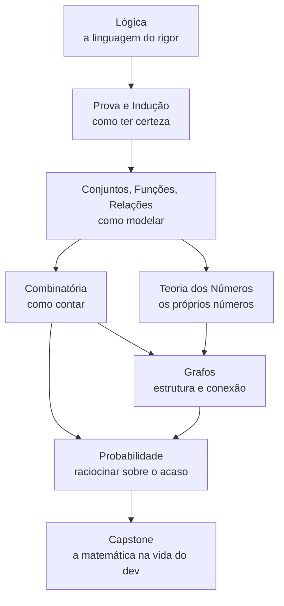
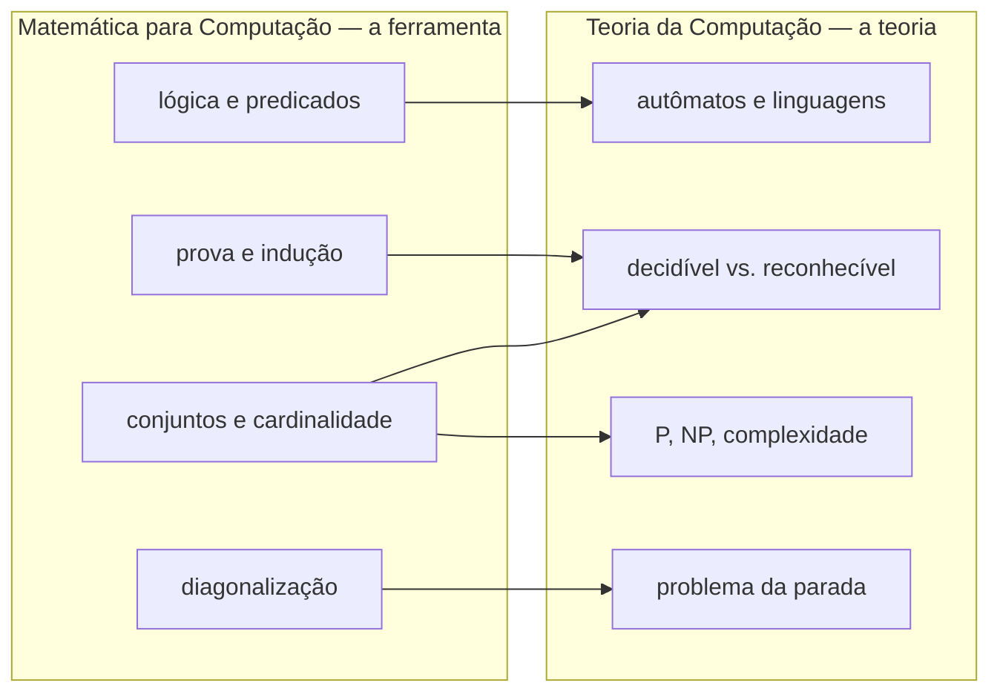
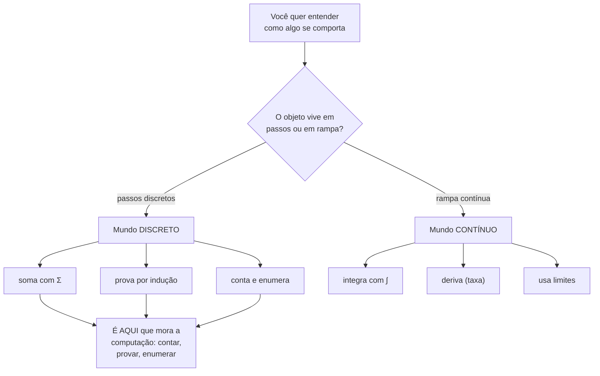
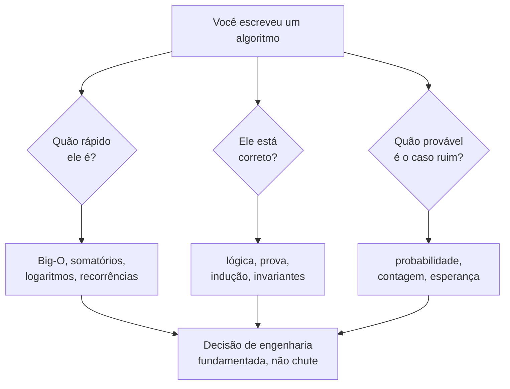
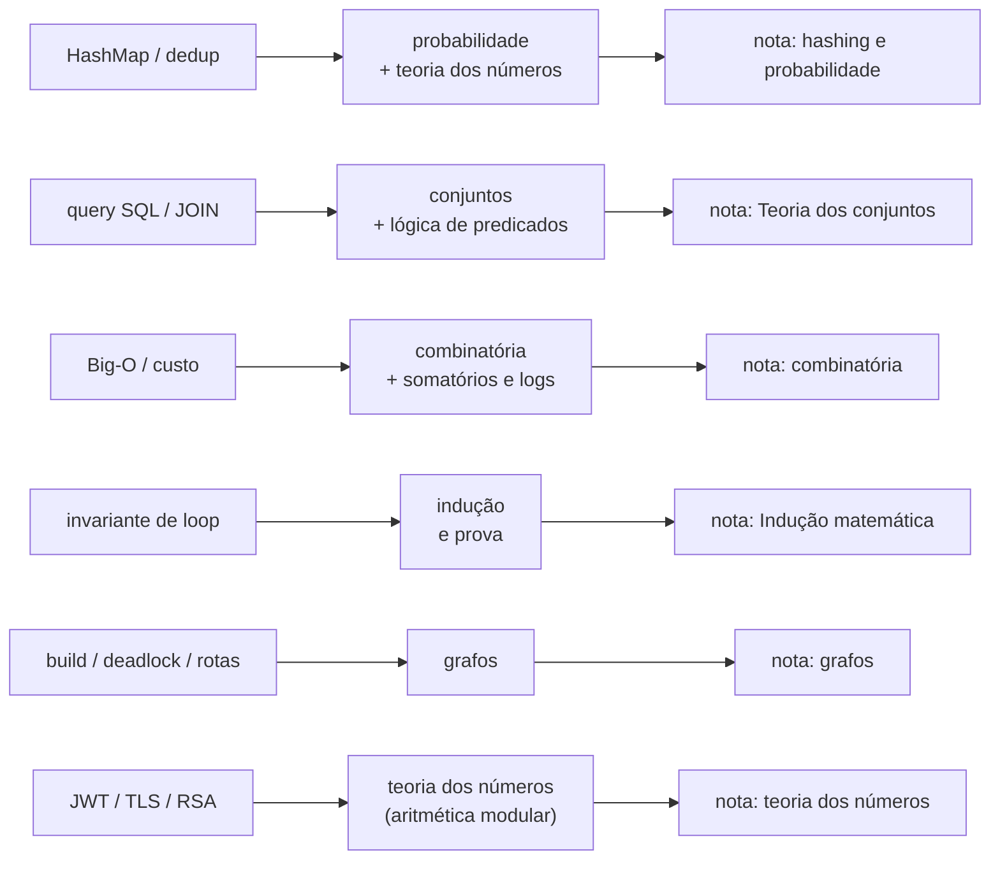

# O que é matemática para computação

> [!abstract] TL;DR
> Computadores são máquinas de estados **discretos**: bits, passos, estruturas finitas. A matemática "natural" da computação não é o cálculo (que vive no contínuo) — é a **matemática discreta**: lógica, prova, conjuntos, contagem, números, grafos, probabilidade. Ela é a ferramenta que está escondida atrás de Big-O, hashing, banco de dados e criptografia. Este galho ensina essa ferramenta; a [[03-Dominios/Ciência/Teoria da Computação/index|Teoria da Computação]] a usa pra falar dos limites do computável.

Você já usou logaritmo hoje sem perceber. Quando disse que uma busca binária é "log n", quando comentou que uma árvore balanceada "não cresce em altura", quando estimou que dobrar os dados "só adiciona um nível" — você estava fazendo matemática discreta. Ela só não estava com o crachá.

Este galho é sobre arrancar o crachá e olhar de frente pra essa matemática. Não pra virar matemático — pra parar de chutar.

## A pergunta de base: discreto ou contínuo?

Existem dois grandes mundos na matemática, e a primeira coisa que um dev precisa saber é **em qual deles ele mora**.

O mundo **contínuo** é o do cálculo e da análise. Pense numa rampa: entre qualquer dois pontos sempre existe um ponto no meio. Os números reais ℝ são assim — entre 1 e 2 existem infinitos números (1.5, 1.41, π/2…). Limites, derivadas, integrais: tudo isso vive aqui. É a matemática da física, da engenharia, do movimento suave.

O mundo **discreto** é o dos degraus. Pense numa escada: você está no degrau 3 ou no 4, nunca no 3.5. Os inteiros ℤ são assim. Estados são assim. Um grafo tem 7 nós ou 8, nunca 7 e meio. Não há "meio" entre dois estados vizinhos. Você conta, não mede.

> [!note] Discreto = "contável em passos separados"
> A palavra vem de *discretus*, em latim "separado". Discreto **não** quer dizer "pequeno" nem "discreto-de-discrição". Quer dizer: os elementos são **distintos e separados**, com vazio entre eles. ℕ (naturais), ℤ (inteiros) e ℚ (racionais, surpreendentemente) são discretos no sentido de serem **contáveis**; ℝ (reais) não é.

### Por que o computador é uma máquina discreta

Aqui está a virada de chave do galho inteiro. **O computador é, por construção, uma máquina de estados discretos.**

- Um **bit** é 0 ou 1. Não existe 0.7 de bit.
- A memória tem um número **finito** de células, cada uma com um valor **discreto**.
- A execução acontece em **passos** (instruções), em **ticks** de clock — o tempo da CPU é granulado, não fluido.
- As estruturas que você manipula são **finitas ou enumeráveis**: listas, árvores, tabelas, conjuntos de chaves.
- O estado completo de um programa, num instante, é uma configuração **discreta** entre um número (gigantesco, mas finito) de configurações possíveis.

Por isso a matemática "natural" da Ciência da Computação é a **discreta**. Não é uma escolha de gosto — é uma consequência de como a máquina é feita.

> [!tip] Onde o cálculo ainda aparece
> O contínuo não some: aprendizado de máquina usa derivadas (gradiente descendente), gráficos usam geometria contínua, simulações físicas usam integrais. Mas isso é matemática **aplicada a um domínio**, não a matemática da **computação em si**. A lógica de um `if`, o número de comparações de um `sort`, a corretude de um loop — tudo isso é discreto até o osso.

A tabela abaixo crava a diferença. Leia cada linha como "no eixo X, o mundo discreto faz Y, o contínuo faz Z".

| Eixo | Discreto | Contínuo |
| --- | --- | --- |
| Objetos | inteiros, grafos, estados, strings | reais, curvas, campos |
| Como você opera | conta, enumera, prova | mede, deriva, integra |
| Ferramenta central | lógica, indução, combinatória | cálculo, análise |
| Pergunta típica | "quantos? existe? sempre?" | "quão rápido varia? qual a área?" |
| Exemplo em CS | nº de comparações de um sort | (raro) decaimento de learning rate |
| Infinito | contável (ℕ, ℤ) | não-contável (ℝ) |

A leitura da tabela: tudo na coluna da esquerda é o pão-com-manteiga do dia a dia de quem programa. A coluna da direita só entra quando você sai do **núcleo da computação** e vai modelar um fenômeno físico. Por isso o galho mora inteiro na esquerda.

## Por que um dev precisa disso

"Beleza, mas eu programo há anos sem provar teorema nenhum." Verdade. Você usa a matemática discreta o tempo todo — só terceirizada, embrulhada em bibliotecas e intuições. O problema aparece quando a intuição falha e você precisa **raciocinar** em vez de chutar.

Vamos abrir a tampa de coisas que você já faz e ver a matemática escondida embaixo.

> [!example] Mini-exemplo 1 — Por que uma árvore binária balanceada tem ~log₂ n níveis
> Uma árvore binária dobra a capacidade a cada nível: 1 nó no topo, até 2 no segundo nível, até 4 no terceiro, até 8 no quarto… No nível *k* cabem até 2ᵏ nós. Pra guardar *n* nós você precisa de níveis suficientes pra que 2ᵏ ≥ n, ou seja *k* ≥ log₂ n. **É por isso que busca, inserção e remoção numa árvore balanceada são O(log n):** a altura é o logaritmo do tamanho. O log não é decoração — é a conta de "quantas vezes posso dobrar até chegar em n". Isso é o coração do [[03-Dominios/Ciência/Algoritmos/02 - Análise de complexidade - Big-O|Big-O]].

> [!example] Mini-exemplo 2 — Por que um conjunto de n elementos tem 2ⁿ subconjuntos
> Pense em cada elemento como uma porta com um interruptor: ou ele **está** no subconjunto, ou **não está**. São 2 escolhas por elemento, independentes. Com *n* elementos, são 2 × 2 × … × 2 (*n* vezes) = **2ⁿ** combinações. É contagem pura (o princípio multiplicativo da combinatória). Esse 2ⁿ é a razão de tantos problemas serem "exponenciais": testar **todos** os subconjuntos de *n* itens é impraticável já com *n* = 60, porque 2⁶⁰ é maior que o número de segundos desde o Big Bang.

> [!example] Mini-exemplo 3 — Por que colisão de hash é o "paradoxo do aniversário"
> Quantas pessoas você precisa numa sala pra ter ~50% de chance de duas fazerem aniversário no mesmo dia? Não 183 (metade de 365) — apenas **23**. A intuição falha porque o que cresce não é o número de pessoas, mas o número de **pares** de pessoas (que é ~n²/2). O mesmo vale pra hash: você não precisa de "metade dos buckets" pra colidir. Com uma tabela de *m* slots, as colisões começam a ficar prováveis lá por √m inserções. **É por isso que hashes de criptografia precisam de tantos bits:** um hash de 128 bits resiste a colisão até ~2⁶⁴ tentativas, não 2¹²⁸. Probabilidade + contagem, escondidas dentro de um `HashMap`.

> [!example] Mini-exemplo 4 — Por que busca binária faz ⌈log₂ n⌉ passos (com n = 1000)
> Busca binária corta o espaço de busca **pela metade** a cada passo. Comece com 1000 elementos. Depois de olhar o do meio, sobram no máximo 500. Depois, 250. Depois 125, 63, 32, 16, 8, 4, 2, 1. Conte os cortes: 1000 → 500 → 250 → 125 → 63 → 32 → 16 → 8 → 4 → 2 → 1. São **10 passos** pra ir de 1000 a 1 elemento.
> Não é coincidência: você está perguntando "quantas vezes dá pra dividir 1000 por 2 até chegar em 1?". Essa é a definição de logaritmo na base 2. E ⌈log₂ 1000⌉ = ⌈9,97⌉ = **10**. O teto ⌈ ⌉ aparece porque você não faz "0,97 de comparação" — passos são discretos, você arredonda pra cima. Dobre os dados pra 2000 e você ganha **um** passo a mais, não o dobro. É por isso que busca binária em um bilhão de itens custa só ~30 comparações: log₂(10⁹) ≈ 30. O logaritmo é a matemática de "quantas vezes posso cortar pela metade", e ela está dentro de [[03-Dominios/Ciência/Algoritmos/02 - Análise de complexidade - Big-O|Big-O]].

Esses exemplos não são casos isolados. Quase tudo que você usa tem um ramo da matemática discreta por baixo:

| Coisa do dia a dia | Matemática escondida | Onde no galho |
| --- | --- | --- |
| Big-O, análise de custo | logaritmos, somatórios | combinatória, [[06 - Indução matemática]] |
| Corretude de algoritmo / invariante de loop | prova por indução | [[06 - Indução matemática]], [[05 - Técnicas de prova]] |
| `HashMap`, deduplicação | teoria dos números, probabilidade | hashing, probabilidade |
| Consulta SQL, `JOIN`, `WHERE` | álgebra relacional = conjuntos + lógica de predicados | conjuntos, [[02 - Lógica proposicional]] |
| Ordem de build, dependências, deadlock | grafos (ordenação topológica, ciclos) | grafos |
| JWT, TLS, assinatura digital | aritmética modular, números primos | teoria dos números |
| Compilador, regex, parsing | linguagens formais, autômatos | (toca a [[03-Dominios/Ciência/Teoria da Computação/index\|Teoria da Computação]]) |

A leitura da tabela: a coluna do meio é exatamente o conteúdo deste galho. Cada linha da esquerda é um lugar onde "saber a matemática" transforma você de quem **usa** a ferramenta em quem **entende** a ferramenta — e consegue debugá-la quando ela quebra de um jeito estranho.

> [!question] "E na entrevista?"
> Entrevistas técnicas de empresas grandes vivem disso. "Qual a complexidade?" é um somatório. "Prove que seu algoritmo está correto" é indução. "Quantas combinações existem?" é combinatória. "Qual a probabilidade de colisão?" é probabilidade. Quem só decorou padrões trava; quem entende a matemática **deriva** a resposta na hora.

### A conta do aniversário, passo a passo

O Mini-exemplo 3 jogou o resultado na sua cara — colisões lá por √m — mas vale ver **de onde sai** esse √m, porque é a probabilidade mais contra-intuitiva da computação e a que mais derruba gente em entrevista.

Comece pelo complemento. Em vez de calcular "qual a chance de **alguma** colisão?" (difícil, há muitos casos), calcule "qual a chance de **nenhuma** colisão?" e subtraia de 1. Esse truque — atacar o evento oposto — é puro raciocínio probabilístico, e ele aparece o tempo todo.

Com 365 dias e *k* pessoas, a chance de todas terem aniversários **distintos** é o produto:

P(sem colisão) = (365/365) · (364/365) · (363/365) · … · ((365 − k + 1)/365)

A primeira pessoa pode nascer em qualquer dia (365/365 = 1). A segunda precisa evitar 1 dia (364/365). A terceira evita 2 (363/365). E assim por diante. Multiplique tudo para *k* = 23 e você obtém ≈ 0,493. Logo P(pelo menos uma colisão) = 1 − 0,493 ≈ **0,507** — pouco mais de 50%. Vinte e três pessoas, meio a meio. A intuição esperava ~183 porque pensava em "eu contra todos"; a conta certa pensa em **todos os pares**.

E é aí que o √ aparece. O número de pares entre *k* pessoas é C(k,2) = k·(k−1)/2 ≈ k²/2. A colisão fica provável quando esse número de pares se aproxima do número de dias *m*. Ou seja: k²/2 ≈ m, o que dá **k ≈ √(2m)**. Para *m* = 365, √(730) ≈ 27 — na mesma ordem de grandeza do 23 exato. O ponto-chave: o limiar de colisão cresce com a **raiz** do espaço, não com metade dele.

> [!example] Por que isso decide o tamanho de um hash
> Troque "365 dias" por "2¹²⁸ saídas possíveis de um hash". A regra do √ diz: colisões viram prováveis lá por √(2¹²⁸) = 2⁶⁴ tentativas. Um atacante não precisa de 2¹²⁸ tentativas pra forjar uma colisão — só 2⁶⁴. **É por isso que um hash precisa do dobro de bits da segurança que você quer:** quer resistência de 128 bits contra colisão? Use um hash de 256 bits (SHA-256). O "paradoxo do aniversário" é literalmente o que dimensiona a criptografia que protege o seu login. Probabilidade discreta, decidindo arquitetura.

## O mapa do galho

Este galho tem 22 notas, e elas não estão em ordem aleatória. Há uma **dependência**: cada bloco se apoia no anterior, como tijolos. Você não conta antes de saber modelar; não modela antes de saber provar; não prova antes de ter uma linguagem pra escrever afirmações precisas.

O diagrama abaixo mostra a jornada. Leia de cima pra baixo: a seta significa "isto é pré-requisito daquilo".

A leitura do diagrama: tudo começa na **lógica**, porque sem uma linguagem precisa pra dizer "para todo ∀", "existe ∃", "se… então →", você não consegue nem enunciar um teorema. Em cima da lógica vem o **rigor** — prova e indução, que respondem "como eu *sei* que isto é sempre verdade?". Com linguagem e rigor na mão, você ganha o poder de **modelar** com conjuntos, funções e relações. A partir daí o galho se abre em três frentes que se cruzam: **contar** (combinatória), conhecer **os números** (teoria dos números) e mapear **estrutura** (grafos). Tudo desemboca na **probabilidade**, que precisa de contagem e de conjuntos pra existir. O capstone amarra tudo de volta ao dia a dia de programação.

Pra fixar, aqui vai **uma frase-âncora por bloco** — o que cada um resolve e qual pergunta de dev ele responde. Se um dia você esquecer pra que serve um pedaço do galho, volte aqui:

| Bloco | O que resolve (frase-âncora) | Pergunta de dev que responde |
| --- | --- | --- |
| **Lógica** ([[02 - Lógica proposicional]]) | dá a linguagem pra dizer afirmações sem ambiguidade (∀, ∃, →, ¬, ↔) | "o `WHERE` da minha query realmente diz o que eu quis?" |
| **Prova e indução** ([[05 - Técnicas de prova]], [[06 - Indução matemática]]) | garante que uma afirmação vale em **todos** os casos, inclusive os infinitos | "meu loop está correto pra qualquer entrada, não só nos testes?" |
| **Conjuntos, funções, relações** ([[04 - Teoria dos conjuntos]]) | dá a linguagem pra **modelar** coleções, mapeamentos e vínculos entre dados | "o que é um `JOIN`, um índice único, uma chave estrangeira?" |
| **Combinatória** | ensina a **contar** sem enumerar um a um (arranjos, combinações, princípios) | "quantos casos meu algoritmo precisa percorrer? é exponencial?" |
| **Teoria dos números** | estuda os inteiros, primos e a aritmética modular (resto da divisão) | "como funcionam hashing, UUID, RSA e o `% n` que distribui buckets?" |
| **Grafos** | modela **estrutura e conexão**: nós, arestas, caminhos, ciclos | "como detecto um deadlock, ordeno um build, acho o caminho mais curto?" |
| **Probabilidade** | ensina a **raciocinar sobre o acaso** e o caso médio | "qual a chance de colisão? quanto custa, em média, um retry?" |

A leitura da tabela: cada linha é um bloco do galho traduzido em uma promessa concreta. A coluna do meio é o **superpoder** que o bloco entrega; a da direita é a **dor de dev** que esse superpoder cura. Repare que nenhuma dessas perguntas é abstrata — todas aparecem em code review, em entrevista, ou às 3 da manhã debugando produção.

> [!note] Por que lógica vem primeiro, sempre
> A lógica é a gramática da matemática. Antes de provar qualquer coisa, você precisa saber escrever afirmações sem ambiguidade: o que é uma implicação →, o que é uma equivalência ↔, como negar (¬) um "para todo" (vira "existe um que não"). Por isso a segunda nota do galho é [[02 - Lógica proposicional]]. Sem ela, "prova" é só hand-waving.

## A fronteira cravada: ferramenta vs. teoria

Aqui mora uma confusão clássica, e vale resolver de uma vez. **Onde acaba a Matemática para Computação e onde começa a Teoria da Computação?**

A regra é simples:

> [!warning] A divisão de propriedade
> **A Matemática é dona da FERRAMENTA. A [[03-Dominios/Ciência/Teoria da Computação/index|Teoria da Computação]] é dona da TEORIA sobre os limites do computável.**
>
> A Matemática **ensina** lógica, prova, conjuntos, funções, cardinalidade, diagonalização. A Teoria da Computação **usa** essas ferramentas — sem reensiná-las — pra responder perguntas como "este problema é decidível?", "esta linguagem é regular?", "P = NP?".

Um exemplo concreto: o argumento de **diagonalização** de Cantor (que mostra que ℝ é "maior" que ℕ, que há infinitos de tamanhos diferentes) é matemática pura — ele pertence a este galho, na parte de conjuntos e cardinalidade. Mas quando Turing usou **a mesma técnica** pra provar que o Problema da Parada é indecidível, isso é Teoria da Computação. Mesma ferramenta, perguntas diferentes.

O diagrama abaixo separa os dois territórios. Leia da esquerda (o que a Matemática fornece) pra direita (o que a Teoria da Computação constrói com isso).

A leitura do diagrama: as caixas da esquerda são **insumos**. A Teoria da Computação não vai parar pra te ensinar o que é uma prova por indução ou o que significa um conjunto ser não-enumerável — ela assume que você já sabe (porque aprendeu **aqui**) e parte direto pra construir resultados sobre máquinas e linguagens. Saber dividir esses dois mundos evita que você procure "diagonalização" na nota errada — e evita que cada galho reensine o que o outro já cobriu.

Vale um teste rápido pra internalizar a fronteira. Pergunte-se: **a coisa é uma técnica de raciocínio ou um resultado sobre máquinas?** Se for técnica — indução, prova por contradição, contagem, cardinalidade — mora aqui, na Matemática. Se for um veredito sobre o que um computador pode ou não fazer — "esta linguagem não é regular", "este problema é NP-completo", "não existe algoritmo pra decidir a parada" — mora na [[03-Dominios/Ciência/Teoria da Computação/index|Teoria da Computação]]. O pumping lemma, por exemplo: a *ideia* de "se uma estrutura é grande o bastante, alguma parte repete" é combinatória (princípio da casa dos pombos, daqui); mas usá-la pra **provar que aⁿbⁿ não é uma linguagem regular** é teoria da computação. A ferramenta é nossa; o veredito é deles.

## O sabor da matemática discreta

Tem uma diferença de **textura** entre fazer cálculo e fazer matemática discreta, e ela muda como você pensa.

No contínuo, você **manipula**: deriva, integra, simplifica expressões. Há fórmulas, há mecânica.

No discreto, o verbo principal é **raciocinar**. Você:

- **conta** (quantos caminhos? quantos subconjuntos?),
- **prova por indução** (vale pra 1, e se vale pra *k* vale pra *k+1* → vale pra todo *n*),
- **enumera casos** (se *n* é par… se *n* é ímpar…),
- **busca um contraexemplo** (basta um caso que falha pra derrubar uma afirmação).

> [!tip] A prova substitui o experimento
> Na engenharia tradicional, você testa um protótipo. Na matemática discreta — e na corretude de software — **um teste não basta**. Seu código pode passar em mil casos e falhar no milésimo-primeiro. A prova é o que te dá certeza sobre **todos** os casos, inclusive os infinitos que você nunca vai conseguir testar. Por isso a indução ([[06 - Indução matemática]]) é a ferramenta mais valiosa que este galho te dá: ela cobre uma infinidade de casos com um argumento finito.

Pense num invariante de loop. Você não roda o loop um milhão de vezes pra "confiar" nele. Você prova: "esta propriedade vale antes do loop, e cada iteração a preserva, logo ela vale no fim". Isso é indução vestida de código. O teste te dá evidência; a prova te dá **garantia**.

## Por que não é o cálculo que você viu na faculdade

Se a sua única exposição à "matemática séria" foi o ciclo de cálculo da faculdade — limites, derivadas, integrais — prepare-se pra uma troca de ferramentas quase completa. Não é que cálculo seja inútil; é que ele responde a perguntas que **a computação raramente faz**.

O cálculo é a matemática da **mudança suave**. A derivada pergunta "quão rápido isto varia neste instante?". A integral pergunta "qual a área acumulada sob esta curva?". Ambas pressupõem que entre dois pontos existe um continuum — que você pode chegar arbitrariamente perto, que existe sempre um "ponto do meio". É a matemática da física, do movimento, do calor que se espalha.

A computação não vive nesse mundo. Um algoritmo não "varia suavemente": ele dá **passos**. Um loop roda 0, 1, 2, 3 vezes — nunca 2,5 vezes. Por isso o instrumento da CS não é a integral ∫, é o **somatório Σ**: em vez de "área contínua sob a curva", você soma um **número discreto de termos**. Quando você conta o custo de um loop aninhado, escreve Σ (de i=1 até n) de i — não uma integral. O somatório é o primo discreto da integral, e é ele que aparece em toda análise de complexidade.

O paralelo se repete em todo lugar. Veja a tradução:

| O que o contínuo faz | O que o discreto faz no lugar | Onde aparece em CS |
| --- | --- | --- |
| integral ∫ (área contínua) | somatório Σ (soma de termos) | custo de loops, análise de Big-O |
| derivada (taxa instantânea) | diferença / recorrência (T(n) em função de T(n-1)) | custo de recursão, divide-and-conquer |
| continuidade (sem saltos) | indução (de *k* pra *k+1*) | corretude, invariantes |
| função suave f: ℝ → ℝ | grafo / relação (nós e arestas) | dependências, redes, estados |
| limite (chegar perto) | caso-base + passo (alcançar exatamente) | terminação de algoritmos |

A leitura da tabela: cada ferramenta do cálculo tem uma **prima discreta** que faz o trabalho equivalente no mundo dos passos. Onde o cálculo *deriva*, a CS *conta a diferença entre dois passos vizinhos*. Onde o cálculo usa continuidade pra garantir "sem buracos", a CS usa indução pra garantir "vale pra todo *n*". É a mesma intenção — entender como algo cresce, garantir que vale sempre — com instrumentos feitos pra degraus, não pra rampas.

> [!tip] Por que a CS quase nunca "deriva"
> Derivar exige um continuum onde a variação faz sentido. Mas "o tempo de execução entre n=7 e n=7,5 elementos" não significa nada — não existe meio elemento. Então em vez de derivar, a CS **conta** (quantas operações?), **prova** (vale pra todos os casos?) e **enumera** (quantas configurações possíveis?). O verbo do cálculo é *medir*; o verbo da computação é *contar*. Trocar de mundo é, antes de tudo, trocar de verbo.

Um exemplo final que crava a diferença. Pergunte a um físico "quão rápido a função cresce em x=10" e ele deriva. Pergunte a um dev "quantas comparações meu sort faz com 10 elementos" e ele **soma**: no pior caso, 9 + 8 + 7 + … + 1 = 45 comparações — um somatório Σ, não uma integral. Mesmo espírito ("quanto custa?"), matemática oposta.

O diagrama abaixo resume a bifurcação. Leia de cima (a pergunta-mãe) descendo pelos dois ramos — cada lado leva a um conjunto de ferramentas próprio.

A leitura do diagrama: a pergunta-mãe ("como isto se comporta?") é a mesma dos dois lados — o que muda é a **natureza do objeto**. Se ele dá passos (instruções, comparações, nós de um grafo), você desce pela esquerda e usa Σ, indução e contagem. Se ele varia suave (temperatura, velocidade, um learning rate decaindo), você desce pela direita e usa ∫, derivadas e limites. A computação quase sempre mora na esquerda — e por isso este galho inteiro vive lá.

## O vocabulário do rigor

Antes de mergulhar no galho, vale conhecer as palavras que a matemática usa pra construir conhecimento de forma rigorosa. Elas aparecem o tempo todo daqui pra frente e têm significados **precisos** — não são sinônimos soltos. (A nota [[05 - Técnicas de prova]] mergulha nelas.)

| Termo | O que é |
| --- | --- |
| **Definição** | um significado fixado pra um termo. Não se questiona, só se concorda em usar. |
| **Axioma** | uma verdade assumida sem prova, o ponto de partida (ex.: "existe um número 0"). |
| **Teorema** | uma afirmação **provada** a partir de axiomas e definições. O resultado importante. |
| **Lema** | um teorema "auxiliar", um degrau usado pra provar um teorema maior. |
| **Corolário** | uma consequência quase imediata de um teorema já provado. "De brinde". |
| **Conjectura** | uma afirmação que se acredita verdadeira mas **ainda não foi provada** (ex.: P ≠ NP). |
| **Prova** | o argumento rigoroso que estabelece a verdade de um teorema. |
| **Contraexemplo** | um único caso que **derruba** uma afirmação geral. Mata uma conjectura. |

A leitura da tabela: note a hierarquia de **certeza**. Axioma é onde você começa (aceito sem prova); teorema é onde você chega (provado); conjectura é o limbo no meio (acreditado, não provado). E o contraexemplo é a arma mais barata do mundo: você não precisa provar que algo é falso em geral — basta **um** caso que quebra. Quando alguém diz "meu algoritmo sempre funciona", o trabalho do cético é achar **o** input que o quebra.

## As três perguntas que a matemática responde pro dev

Se você quiser guardar uma só ideia desta nota, guarde esta: a matemática discreta existe, pro programador, pra responder **três perguntas** que você faz toda vez que escreve código sério.

A leitura do diagrama: toda decisão de engenharia séria passa por uma dessas três perguntas. **"Quão rápido?"** é análise de complexidade — somatórios e logaritmos. **"Está correto?"** é prova e indução — a garantia de que o código faz o que promete em todos os casos. **"Quão provável?"** é probabilidade — porque sistemas reais lidam com incerteza (uma estrutura *probabilística* como um Bloom filter, uma estimativa de carga, um retry com backoff). As três frentes desembocam no mesmo lugar: uma decisão **fundamentada**, em vez de "achei que ia dar certo".

> [!note] Por que isso te separa do júnior
> A diferença entre um dev pleno e um sênior raramente é "conhecer mais frameworks". É a capacidade de responder essas três perguntas com **argumento**, não com opinião. "Acho que é rápido o suficiente" vira "é O(n log n), domina pelo sort, com n até 10⁶ isso é ~20 milhões de operações, sub-segundo". Essa frase é matemática discreta falada em voz alta.

Repare como as três perguntas se encadeiam numa decisão real. Suponha que você precisa deduplicar uma lista de 10 milhões de e-mails.

- **Quão rápido?** Comparar todos os pares é O(n²) → 10¹⁴ operações, inviável. Usar um `HashSet` é O(n) → 10⁷ operações, instantâneo. A escolha já saiu de uma conta de complexidade.
- **Está correto?** O `HashSet` só funciona se `equals`/`hashCode` forem consistentes — uma propriedade que você **prova** (ou pelo menos argumenta) sobre a sua classe, não testa por amostragem.
- **Quão provável?** Com 10⁷ chaves e hash de 32 bits, colisões são quase certas (paradoxo do aniversário de novo: √(2³²) ≈ 65 mil). Você precisa de tratamento de colisão, ou de mais bits. A probabilidade dimensiona a estrutura.

Três ramos da matemática discreta, uma única decisão de engenharia. Quem enxerga os três sai na frente.

## De conceito de CS pra ramo de matemática

Talvez a forma mais útil de enxergar o galho seja **de trás pra frente**: parta de uma coisa concreta que você usa programando e siga a seta até o ramo da matemática que a explica — e depois até a nota onde ela mora. É o caminho do "preciso entender isto" até "estude aquilo".

A leitura do diagrama: a coluna da esquerda é o **mundo do dev** — coisas que você toca todo dia. A do meio é o **ramo de matemática** que está por baixo. A da direita aponta a **nota** onde você aprende esse ramo. O fluxo é diagnóstico: bateu uma dúvida concreta (por que dois usuários colidiram no mesmo bucket?), siga a seta e você sabe exatamente o que estudar (probabilidade + teoria dos números). É o galho funcionando como mapa de sintoma → causa → cura.

Note que vários conceitos de CS puxam **mais de um** ramo ao mesmo tempo. Um `HashMap` precisa de teoria dos números (a função hash, o módulo) **e** de probabilidade (a chance de colisão). Uma query SQL precisa de conjuntos (as tabelas como conjuntos de tuplas) **e** de lógica (o predicado do `WHERE`). Isso não é coincidência: os ramos da matemática discreta não são silos isolados — eles foram pensados pra se compor. Por isso o mapa do galho tem setas que se cruzam, e por isso o capstone final junta tudo num só problema realista.

> [!example] Um caso onde os dois mundos se encontram: o infinito
> Aqui está a peça mais bonita do galho, e ela mostra por que a fronteira com a [[03-Dominios/Ciência/Teoria da Computação/index|Teoria da Computação]] é tão limpa. Cantor provou que **nem todo infinito tem o mesmo tamanho**: os naturais ℕ são "contáveis", mas os reais ℝ são "maiores" — não dá nem pra listá-los. A técnica que ele usou é a **diagonalização**: suponha que você listou todos os reais; construa um novo número trocando o *k*-ésimo dígito do *k*-ésimo número da lista; esse número não pode estar na lista. Contradição. Isso é **matemática pura** — mora aqui, na cardinalidade de conjuntos.
> Décadas depois, Turing pegou **exatamente essa técnica** e provou que o Problema da Parada é indecidível: não existe programa que decida, pra todo par (programa, entrada), se ele para. A diagonalização é a ferramenta; o resultado sobre máquinas é **Teoria da Computação**. Mesma chave, fechaduras diferentes — e essa é a fronteira do domínio em uma só história.

## Como estudar este galho

Uma última orientação prática, porque a matemática discreta tem fama (injusta) de árida. O segredo é **nunca estudar um conceito sem o gancho em código**.

- Aprendeu o que é um **somatório**? Releia a análise de custo de um loop aninhado e identifique o Σ ali dentro.
- Aprendeu **indução**? Pegue um algoritmo recursivo que você já escreveu e prove que ele termina e está correto.
- Aprendeu **combinatória**? Conte os estados possíveis de uma feature flag com 5 toggles (resposta: 2⁵ = 32) antes de "testar tudo".
- Aprendeu **probabilidade**? Estime a chance de pelo menos um de 100 requests cair, dado que cada um falha 0,1% das vezes (≈ 1 − 0,999¹⁰⁰ ≈ 9,5%) — e entenda por que sistemas em escala precisam de retry.
- Aprendeu **grafos**? Olhe o seu `package.json` ou `pom.xml` como um grafo de dependências e ache os ciclos.
- Aprendeu **teoria dos números**? Entenda por que `hashCode() % numBuckets` distribui chaves, e por que o número de buckets costuma ser primo.
- Aprendeu **lógica de predicados**? Reescreva um `WHERE` complicado de SQL como uma fórmula ∀/∃ e veja se ela diz o que você quis dizer.

A ordem de leitura importa, mas não é uma cela. A sequência do mapa (lógica → prova → conjuntos → contagem/números/grafos → probabilidade) é a que minimiza pré-requisitos faltando. Você *pode* pular pra grafos por curiosidade, mas vai sentir falta da linguagem de conjuntos pra falar de "conjunto de vértices" e "conjunto de arestas" com precisão. Respeitar a dependência não é burocracia — é evitar construir o segundo andar antes da fundação.

Se você só tem tempo pra **uma** habilidade deste galho inteiro, escolha a **indução** ([[06 - Indução matemática]]). É ela que transforma "testei e passou" em "provei que vale sempre" — o salto mental que separa quem confia no código de quem **sabe** que o código está certo. Todo o resto orbita essa ideia: contar é indução disfarçada de soma, um invariante de loop é indução vestida de código, e até a recursão que você escreve todo dia é indução executando. Domine essa e o galho inteiro fica mais fácil.

> [!tip] A matemática discreta é melhor digerida em código
> Cada nota deste galho fecha com uma ponte pra prática — não por capricho didático, mas porque o conceito **gruda** quando você o vê resolvendo um problema que já te incomodou. Decorar a fórmula de combinação C(n,k) é frágil; entender que ela conta "de quantos jeitos escolho *k* itens de *n* sem ligar pra ordem" e reconhecê-la na hora de contar caminhos num grafo — isso fica. O galho inteiro foi montado pra você sair de "sei a definição" pra "vejo a matemática acontecendo no meu código".

E uma honestidade final: você **não** precisa virar matemático pra colher esse fruto. A meta deste galho não é elegância de demonstração nem rigor de papel acadêmico — é te dar a fluência mínima pra **enxergar** a matemática que já está rodando dentro do seu código e **raciocinar** sobre ela quando a intuição não dá conta. Saber que busca binária é log, que um `HashSet` tem comportamento de aniversário, que um invariante é indução: esse é o nível que muda o seu dia a dia. O resto é aprofundamento opcional. Comece pela [[02 - Lógica proposicional]] e siga o mapa — uma nota de cada vez, sempre com o gancho em código.

> [!summary] Resumo em uma linha
> Computadores são máquinas discretas, então a matemática da computação é a **discreta** — lógica, prova, contagem, números, grafos, acaso — a ferramenta escondida atrás de Big-O, hashing, SQL e cripto, que responde "quão rápido?", "está correto?" e "quão provável?".

## Em entrevista

Esse tema raramente é perguntado de forma direta ("o que é matemática discreta?"), mas ele está **embutido** em quase toda pergunta de algoritmos. Quando o entrevistador pede complexidade, corretude ou probabilidade, ele está testando se você sabe a matemática por baixo. Mostre que você enxerga o ramo discreto atrás do problema — fale "isso é um somatório", "isso é indução", "isso é contagem" — e você sinaliza maturidade. Abaixo, frases prontas pra defender que você raciocina, não chuta.

- *"Computers are fundamentally discrete-state machines, so the natural math behind computer science is discrete math, not calculus."*
- *"A balanced binary tree has about log base 2 of n levels because each level doubles the capacity."*
- *"A set of n elements has 2 to the n subsets — each element is either in or out, two independent choices."*
- *"Hash collisions follow the birthday paradox: collisions get likely around the square root of the number of buckets, not half of it."*
- *"To reason about correctness over all inputs, a test isn't enough — I'd argue it with a loop invariant, which is basically induction."*
- *"Big-O analysis is really about summations and logarithms hiding inside the loop structure."*
- *"A counterexample is the cheapest disproof: one failing input is enough to kill a general claim."*
- *"Diagonalization is a math tool; the Halting Problem is computation theory using that tool."*
- *"I'd estimate it's O(n log n), dominated by the sort, so for n up to a million that's sub-second."*

| Português | English |
| --- | --- |
| matemática discreta | discrete mathematics |
| contínuo | continuous |
| máquina de estados | state machine |
| contável / enumerável | countable / enumerable |
| conjunto | set |
| subconjunto | subset |
| lógica de predicados | predicate logic |
| prova | proof |
| indução | induction |
| invariante de loop | loop invariant |
| contraexemplo | counterexample |
| teorema | theorem |
| lema | lemma |
| corolário | corollary |
| conjectura | conjecture |
| somatório | summation |
| combinatória | combinatorics |
| teoria dos números | number theory |
| aritmética modular | modular arithmetic |
| grafo | graph |
| paradoxo do aniversário | birthday paradox |
| diagonalização | diagonalization |

> [!info] Lastro
> - Lehman, Leighton & Meyer. *Mathematics for Computer Science* (MIT 6.042J) — texto gratuito, abertura do livro sobre o papel da prova e da matemática discreta na CC. Disponível em [people.csail.mit.edu/meyer/mcs.pdf](https://people.csail.mit.edu/meyer/mcs.pdf) e [MIT OCW 6.042J](https://www.ocw.mit.edu/courses/6-042j-mathematics-for-computer-science-fall-2010/pages/readings).
> - Kenneth H. Rosen. *Discrete Mathematics and Its Applications*, 8ª ed. (McGraw-Hill, 2018) — referência canônica; capítulo introdutório sobre lógica, conjuntos e o escopo da matemática discreta. [Página da editora](https://www.mheducation.com/unitas/highered/changes/rosen-dm-8e.pdf).
> - Graham, Knuth & Patashnik. *Concrete Mathematics* (Addison-Wesley) — sobre o sabor "discreto" do raciocínio (somatórios, recorrências) por trás da análise de algoritmos.
> - Fronteira ferramenta/teoria cruzada com a nota [[03-Dominios/Ciência/Teoria da Computação/index|Teoria da Computação]] deste mesmo domínio [[03-Dominios/Ciência/index|Ciência da Computação]].
