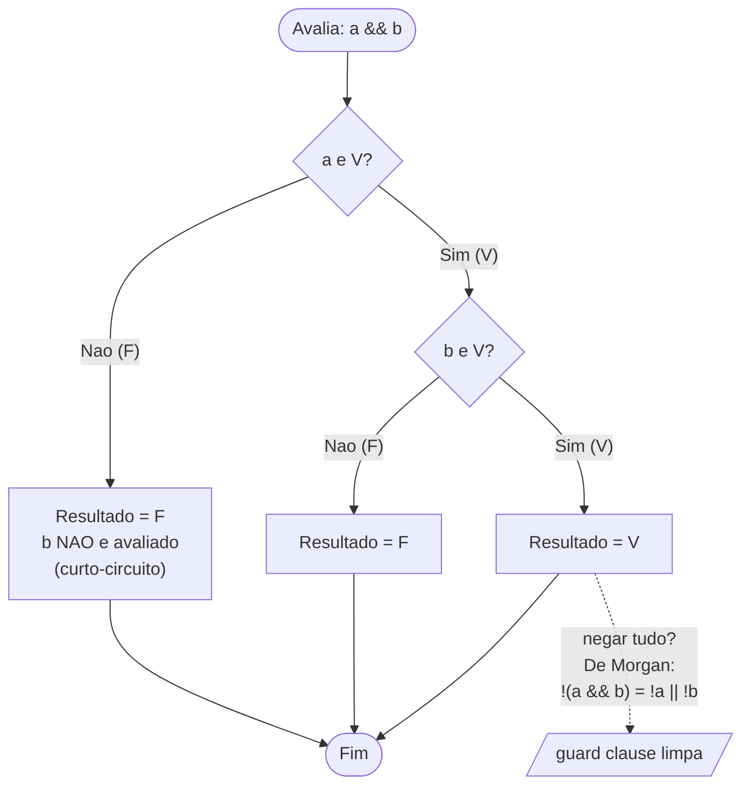
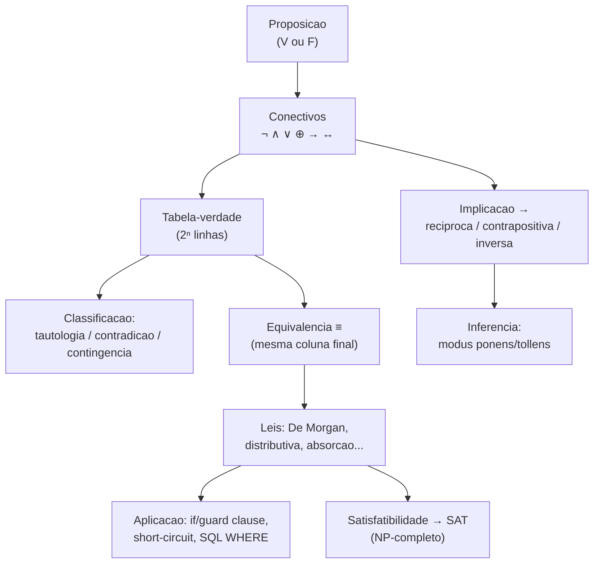

# Lógica proposicional

> [!abstract] TL;DR
> A lógica proposicional é a álgebra do verdadeiro e do falso. Ela pega frases que são V ou F (proposições), cola elas com conectivos (¬ ∧ ∨ ⊕ → ↔) e estuda quando o resultado é sempre verdadeiro, sempre falso, ou depende. É a mesma máquina que roda dentro do seu `if`, do `WHERE` do SQL e de todo circuito digital. Quem domina tabela-verdade, implicação (e sua contrapositiva) e as Leis de De Morgan simplifica condições, escreve guard clauses limpas e não cai na armadilha do `NULL` no SQL.

Toda a computação é, no fundo, manipular bits — e bit é só V ou F com outro nome. A lógica proposicional é a gramática desse universo de dois valores. Se a nota [[01 - O que é matemática para computação]] disse *por que* matemática importa pro dev, esta aqui entrega a primeira ferramenta concreta: o cálculo do verdadeiro e do falso.

## O que é uma proposição

Uma **proposição** é uma sentença declarativa que é ou **verdadeira (V)** ou **falsa (F)** — nunca as duas, nunca nenhuma, nunca "mais ou menos".

- "2 + 2 = 4" → proposição (V).
- "Brasília é a capital do Brasil" → proposição (V).
- "10 é um número primo" → proposição (F).
- "Que horas são?" → **não** é proposição (é pergunta).
- "Feche a porta." → **não** é proposição (é ordem).
- "x + 1 = 5" → **não** é proposição enquanto `x` for desconhecido (é uma *função proposicional*; vira proposição quando você fixa `x`). Esse caso abre a porta pra [[03 - Lógica de predicados e quantificadores]].

> [!note] Sem meio-termo
> A lógica proposicional clássica é **bivalente**: dois valores, ponto. Não existe "talvez". Guarde esse detalhe — lá no fim, o SQL vai quebrar exatamente essa regra ao inventar um terceiro valor (`NULL`/UNKNOWN), e é aí que muita query dá errado.

Como escrever "2 + 2 = 4" toda hora cansa, usamos **variáveis proposicionais**: letras minúsculas `p`, `q`, `r`, `s`. Cada uma carrega um valor V ou F. A partir delas montamos fórmulas maiores com os conectivos.

## Os conectivos e suas tabelas-verdade

Conectivo é um operador que combina proposições e devolve outra proposição. A **tabela-verdade** lista todas as combinações possíveis de entrada e o resultado de cada uma. Com `n` variáveis há `2ⁿ` linhas — 1 variável dá 2 linhas, 2 variáveis dão 4, 3 dão 8.

### Negação ¬

A mais simples: troca o valor. `¬p` ("não p") é V quando `p` é F.

| p | ¬p |
|---|----|
| V | F  |
| F | V  |

### Conjunção ∧ (e)

`p ∧ q` ("p e q") só é V quando **as duas** são V. É o `&&` exigente: basta uma falhar pra tudo falhar.

| p | q | p ∧ q |
|---|---|-------|
| V | V | V     |
| V | F | F     |
| F | V | F     |
| F | F | F     |

### Disjunção ∨ (ou inclusivo)

`p ∨ q` ("p ou q") é V quando **pelo menos uma** é V. É o ou do português jurídico: "p, ou q, ou ambos".

| p | q | p ∨ q |
|---|---|-------|
| V | V | V     |
| V | F | V     |
| F | V | V     |
| F | F | F     |

### Ou exclusivo ⊕ (XOR)

`p ⊕ q` é V quando **exatamente uma** das duas é V — nunca as duas juntas. É o "ou" do cardápio: "vem com batata **ou** salada" (não os dois).

| p | q | p ⊕ q |
|---|---|-------|
| V | V | F     |
| V | F | V     |
| F | V | V     |
| F | F | F     |

> [!tip] Inclusivo vs exclusivo — a confusão clássica
> Repare a linha de cima: quando p **e** q são V, o ∨ inclusivo dá **V**, mas o ⊕ exclusivo dá **F**. Essa é a única linha onde eles divergem. No dia a dia falamos "ou" pros dois casos e o contexto desambigua; na lógica e no código você tem que escolher. Em programação, `|` costuma ser inclusivo e `^` é o XOR.

### Condicional → (implicação, "se... então")

`p → q` ("se p, então q") é o conectivo mais usado e o mais traiçoeiro. Ele só é **F** num único caso: quando `p` é V mas `q` é F. Em todos os outros, é V.

| p | q | p → q |
|---|---|-------|
| V | V | V     |
| V | F | F     |
| F | V | V     |
| F | F | V     |

Aqui chamamos `p` de **antecedente** (a hipótese) e `q` de **consequente** (a conclusão). Volto nesse conectivo na próxima seção — ele merece tratamento à parte.

### Bicondicional ↔ ("se e somente se", sse)

`p ↔ q` é V quando as duas têm o **mesmo** valor — ambas V ou ambas F. É o "igual" lógico.

| p | q | p ↔ q |
|---|---|-------|
| V | V | V     |
| V | F | F     |
| F | V | F     |
| F | F | V     |

> [!info] Diagrama 1 — os seis conectivos lado a lado
> Cole as colunas e compare os comportamentos numa única tabela. As quatro linhas de entrada são sempre as mesmas combinações de p e q.

| p | q | ¬p | p ∧ q | p ∨ q | p ⊕ q | p → q | p ↔ q |
|---|---|----|-------|-------|-------|-------|-------|
| V | V | F  | V     | V     | F     | V     | V     |
| V | F | F  | F     | V     | V     | F     | F     |
| F | V | V  | F     | V     | V     | V     | F     |
| F | F | V  | F     | F     | F     | V     | V     |

**Leitura do diagrama:** percorra cada coluna de cima a baixo e ela vira a "assinatura" do conectivo. Note que `↔` é exatamente a **negação** de `⊕` (onde um dá V o outro dá F) — bicondicional é "são iguais", XOR é "são diferentes". E `→` é o único cuja assinatura não é simétrica em p e q: trocar a ordem muda o resultado, o que é a raiz de toda a confusão da próxima seção.

## A implicação a fundo: a tabela contraintuitiva

Olhe de novo as duas últimas linhas de `p → q`: quando `p` é **F**, o resultado é **V** não importa o `q`. "Falso implica qualquer coisa". Isso costuma travar o cérebro de quem está começando. Por quê uma promessa baseada em algo falso seria *verdadeira*?

> [!example] A analogia da promessa
> Imagine que eu prometo: **"Se chover, eu levo guarda-chuva."** Em que cenário você me chamaria de mentiroso?
>
> | Choveu? (p) | Levei guarda-chuva? (q) | Quebrei a promessa? | p → q |
> |---|---|---|---|
> | Sim (V) | Sim (V) | Não, cumpri | **V** |
> | Sim (V) | Não (F) | **Sim! Menti** | **F** |
> | Não (F) | Sim (V) | Não — não choveu, levei à toa, mas não menti | **V** |
> | Não (F) | Não (F) | Não — não choveu, não levei, promessa intacta | **V** |
>
> A promessa só é **quebrada** numa situação: choveu e eu **não** levei. Nos dias em que não choveu (`p` é F), a promessa *não foi testada* — e o que não foi testado não pode ser dado como violado. Por isso dizemos que `p → q` é **vacuamente verdadeiro** quando o antecedente é falso.

Essa "verdade vácua" não é um capricho dos matemáticos; ela faz a lógica funcionar. Pense num laço `for (i de 0 até n)` com `n = 0`: a afirmação "todo elemento do laço satisfaz X" é V por vacuidade — não há elemento que a contradiga. É o mesmo motivo pelo qual `all([])` retorna `True` em Python.

### A identidade que tudo simplifica: p → q ≡ ¬p ∨ q

Existe uma equivalência que mata a estranheza da implicação de vez:

```
p → q  ≡  ¬p ∨ q
```

Em palavras: "se p então q" é a mesma coisa que "ou p é falso, ou q é verdadeiro". Prove você mesmo comparando as colunas — se as duas baterem em todas as linhas, são equivalentes:

| p | q | p → q | ¬p | ¬p ∨ q |
|---|---|-------|----|--------|
| V | V | V     | F  | V      |
| V | F | F     | F  | F      |
| F | V | V     | V  | V      |
| F | F | V     | V  | V      |

As colunas `p → q` e `¬p ∨ q` são idênticas. Provado. Guarde essa identidade: ela é a ponte entre a implicação (abstrata) e os conectivos ∧/∨/¬ (que você sabe codar com `&&`/`||`/`!`).

## Recíproca, contrapositiva, inversa: a falácia de virar a seta

Dado `p → q`, você pode formar três variações trocando e/ou negando os lados. **Três nomes, três comportamentos diferentes** — e confundir um pelo outro é uma das falácias mais comuns que existem.

| Nome | Fórmula | Equivalente a p → q? |
|---|---|---|
| **Original** (condicional) | p → q | — |
| **Recíproca** (converse) | q → p | **Não** |
| **Contrapositiva** | ¬q → ¬p | **Sim** ✅ |
| **Inversa** | ¬p → ¬q | **Não** (mas equivale à recíproca) |

Prove na tabela-verdade que a contrapositiva bate com a original e a recíproca **não**:

| p | q | p → q | q → p (recíproca) | ¬q → ¬p (contrapositiva) | ¬p → ¬q (inversa) |
|---|---|-------|------|---------|---------|
| V | V | V     | V    | V       | V       |
| V | F | F     | V    | F       | V       |
| F | V | V     | F    | V       | F       |
| F | F | V     | V    | V       | V       |

**Leitura:** a coluna da **contrapositiva** é idêntica à da original — `p → q ≡ ¬q → ¬p`. Já a **recíproca** diverge nas linhas 2 e 3. E a **inversa** é a contrapositiva da recíproca, então ela bate com a recíproca, não com a original.

> [!warning] A falácia da recíproca
> Trocar uma afirmação pela sua recíproca é um erro de raciocínio clássico. "Se chove, a rua fica molhada" (`p → q`) **não** garante "se a rua está molhada, choveu" (`q → p`) — o caminhão-pipa pode ter passado. Em código e em provas, isso aparece o tempo todo: "se o login falhou, mostro erro" não implica "se mostro erro, o login falhou". A contrapositiva, sim, é confiável: "se a rua **não** está molhada, **não** choveu". A técnica de **prova por contrapositiva** (em [[05 - Técnicas de prova]]) explora exatamente essa equivalência: às vezes provar ¬q → ¬p é bem mais fácil que provar p → q diretamente.

## Tautologia, contradição e contingência

Classificamos uma fórmula pelo que aparece na coluna final da sua tabela-verdade:

- **Tautologia**: sempre **V**, em toda linha. Ex.: `p ∨ ¬p` (lei do terceiro excluído).
- **Contradição**: sempre **F**, em toda linha. Ex.: `p ∧ ¬p`.
- **Contingência**: às vezes V, às vezes F — depende dos valores. A maioria das fórmulas é assim.

| p | ¬p | p ∨ ¬p (tautologia) | p ∧ ¬p (contradição) |
|---|----|--------------------|---------------------|
| V | F  | V                  | F                   |
| F | V  | V                  | F                   |

> [!note] Equivalência lógica ≡
> Duas fórmulas são **logicamente equivalentes** (`A ≡ B`) quando têm a **mesma** coluna final na tabela-verdade — ou seja, quando `A ↔ B` é uma tautologia. Foi exatamente o que fizemos com `p → q ≡ ¬p ∨ q` e com a contrapositiva. **Montar a tabela-verdade das duas e comparar coluna a coluna é o método universal pra provar equivalência.** Se houver uma única linha diferente, não são equivalentes.

## As leis de equivalência

Montar tabela toda vez é cansativo. Por sorte, existe um catálogo de equivalências prontas — a "álgebra booleana" — que deixa você simplificar fórmulas como simplifica expressões algébricas. As que mais importam:

| Lei | Forma 1 | Forma 2 |
|---|---|---|
| **Identidade** | p ∧ V ≡ p | p ∨ F ≡ p |
| **Dominação** | p ∨ V ≡ V | p ∧ F ≡ F |
| **Idempotência** | p ∨ p ≡ p | p ∧ p ≡ p |
| **Dupla negação** | ¬(¬p) ≡ p | — |
| **Comutativa** | p ∧ q ≡ q ∧ p | p ∨ q ≡ q ∨ p |
| **Associativa** | (p ∧ q) ∧ r ≡ p ∧ (q ∧ r) | (p ∨ q) ∨ r ≡ p ∨ (q ∨ r) |
| **Distributiva** | p ∧ (q ∨ r) ≡ (p ∧ q) ∨ (p ∧ r) | p ∨ (q ∧ r) ≡ (p ∨ q) ∧ (p ∨ r) |
| **De Morgan** | ¬(p ∧ q) ≡ ¬p ∨ ¬q | ¬(p ∨ q) ≡ ¬p ∧ ¬q |
| **Absorção** | p ∨ (p ∧ q) ≡ p | p ∧ (p ∨ q) ≡ p |
| **Negação** | p ∨ ¬p ≡ V | p ∧ ¬p ≡ F |

**Leitura da tabela:** repare na simetria entre as duas colunas — toda lei tem uma versão "∧" e uma "∨" que viram uma na outra se você trocar ∧↔∨ e V↔F. Isso se chama **dualidade**, e é a mesma simetria que aparece entre interseção/união na [[04 - Teoria dos conjuntos]]. Não é coincidência: conjuntos e lógica são a mesma álgebra com roupas diferentes.

> [!important] De Morgan é a estrela do dia a dia
> Das dez, a que você vai usar **toda semana** é De Morgan. Em uma frase: **"negar um E vira um OU de negações, e vice-versa."** Negar "está chovendo **e** está frio" dá "**não** está chovendo **ou não** está frio". A negação entra, troca o conectivo e nega cada parte. Guarde isso — vamos aplicar direto em `if`s logo abaixo.

## Formas normais e satisfatibilidade

Toda fórmula pode ser reescrita num formato padronizado. Dois deles:

- **DNF** (forma normal disjuntiva): um **OU de Es** — `(p ∧ ¬q) ∨ (¬p ∧ r)`. Cada parêntese descreve uma linha V da tabela-verdade.
- **CNF** (forma normal conjuntiva): um **E de OUs** — `(p ∨ q) ∧ (¬p ∨ r)`. É a forma que os *solvers* preferem.

Por que isso importa? Porque leva a uma pergunta enorme: **a fórmula é satisfatível?** Ou seja, **existe** alguma atribuição de V/F às variáveis que torne a fórmula inteira V? Uma tautologia é sempre satisfatível; uma contradição, nunca.

> [!quote] O gancho com a complexidade
> Decidir se uma fórmula booleana em CNF é satisfatível é o problema **SAT** — e ele é a pedra angular da teoria da complexidade. Foi o **primeiro** problema provado ser NP-completo (Teorema de Cook-Levin, 1971). Em miúdos: é fácil **verificar** uma solução (basta testar a atribuição), mas ninguém conhece jeito rápido de **encontrá-la** no pior caso. Por trás de "P = NP?" — talvez a maior pergunta em aberto da computação — está esta seção que você acabou de ler. A trilha de Teoria da Computação destrincha isso; aqui, basta saber que o assunto nasce na lógica proposicional.

## Regras de inferência (pincelando)

Equivalência diz quando duas fórmulas são *iguais*. **Inferência** diz quando uma conclusão *segue* de premissas — o motor das provas. As três mais citadas:

| Regra | Premissas | Conclui | Ideia |
|---|---|---|---|
| **Modus ponens** | p → q, e p | q | "Se p então q; ocorre p; logo q." |
| **Modus tollens** | p → q, e ¬q | ¬p | "Se p então q; não ocorre q; logo não p." (é a contrapositiva em ação) |
| **Silogismo hipotético** | p → q, e q → r | p → r | encadeia implicações (transitividade) |

Cada uma é uma tautologia da forma "premissas → conclusão". Elas são a base das **provas formais**, assunto cheio em [[05 - Técnicas de prova]] — aqui ficam só apresentadas pra você reconhecer os nomes.

## A lógica no código de quem programa

Tudo isso parece abstrato até você perceber que **já escreve lógica proposicional o dia inteiro**. Cada `if` é uma fórmula; cada `&&` é um ∧; cada `||` é um ∨; cada `!` é um ¬. As leis de equivalência são ferramentas de refatoração.

### De Morgan pra limpar guard clauses

Considere a condição feia de negar um acesso:

```java
// "negar quando NÃO (é admin E está logado)"
if (!(isAdmin && isLoggedIn)) {
    return "Acesso negado";
}
```

A negação em volta do parêntese atrapalha a leitura. Aplique **De Morgan** — `¬(a ∧ b) ≡ ¬a ∨ ¬b`:

```java
// equivalente, sem o parêntese negado
if (!isAdmin || !isLoggedIn) {
    return "Acesso negado";
}
```

"Não é admin **ou** não está logado." Mesma lógica, leitura direta. Esse é o uso campeão de De Morgan no trabalho: **empurrar a negação pra dentro** transforma `!(A && B)` em `!A || !B` e `!(A || B)` em `!A && !B`, e o `if` vira prosa.

### Short-circuit: a ordem importa

`&&` e `||` na maioria das linguagens são **avaliados por curto-circuito** (lazy): assim que o resultado está decidido, o resto nem roda.

- Em `a && b`, se `a` é F, o resultado já é F — `b` **não é avaliado**.
- Em `a || b`, se `a` é V, o resultado já é V — `b` **não é avaliado**.

Isso não é só otimização; muda a corretude. Veja o clássico null-check:

```javascript
// SEGURO: se user for null, o && para antes de tocar em .name
if (user != null && user.name === "admin") { ... }

// QUEBRA: inverter a ordem estoura NullPointerException / TypeError
if (user.name === "admin" && user != null) { ... }
```

> [!tip] A ordem dos operandos é uma decisão de design
> Coloque a **condição barata e protetora primeiro**: o teste que evita o crash (`user != null`), ou o teste mais provável de cortar caminho. Curto-circuito é avaliação preguiçosa transformada em recurso de linguagem — use a teu favor.

> [!info] Diagrama 2 — fluxo do `&&` com curto-circuito e De Morgan
> O fluxograma mostra como `a && b` decide e onde De Morgan entraria se você precisasse negar o bloco.



**Leitura do diagrama:** a primeira decisão (`a é V?`) pode encerrar tudo pelo ramo "Não" sem nunca olhar `b` — esse é o curto-circuito que protege seu null-check. O ramo pontilhado lembra que, se a intenção fosse **negar** o bloco inteiro, De Morgan reescreve `!(a && b)` como `!a || !b` sem mexer no comportamento.

### Bicondicional e XOR no código

- `p ↔ q` é o **`==` entre booleanos**: `flagA == flagB` é V quando as duas têm o mesmo valor.
- `p ⊕ q` é o **toggle/XOR**: `estado ^= true` alterna o estado a cada chamada. XOR também aparece em paridade, checksums e na troca de variáveis sem temporária.

## A lógica no banco de dados: SQL e seus três valores

O `WHERE` do SQL é lógica proposicional pura: você cola predicados com `AND`, `OR`, `NOT` e o banco devolve as linhas onde a expressão é V.

```sql
SELECT * FROM pedidos
WHERE status = 'pago' AND (valor > 100 OR cliente_vip = true);
```

De Morgan vale aqui igualzinho: `NOT (a AND b)` é o mesmo que `(NOT a) OR (NOT b)`. Até aqui, tudo familiar. **Mas o SQL tem uma armadilha que não existe na lógica clássica: o `NULL`.**

### A lógica de três valores (V / F / UNKNOWN)

A lógica proposicional clássica é bivalente. O SQL **não** é: ele tem **três** valores — V, F e **UNKNOWN** — porque `NULL` representa "valor ausente/desconhecido". Qualquer comparação envolvendo `NULL` não dá nem V nem F: dá **UNKNOWN**.

> [!danger] `NULL = NULL` é UNKNOWN, não V
> O erro número um de iniciante em SQL: `NULL` **não é igual a si mesmo**. `WHERE coluna = NULL` nunca traz linha nenhuma, porque `NULL = NULL` avalia pra UNKNOWN, e o `WHERE` só devolve linhas onde o resultado é **V** (UNKNOWN é tratado como "não traz"). Por isso existe o operador especial `IS NULL` — ele é o único jeito de testar ausência.

Veja como `AND` e `OR` se comportam com o terceiro valor (U = UNKNOWN):

| p | q | p AND q | p OR q |
|---|---|---------|--------|
| V | V | V | V |
| V | U | **U** | V |
| V | F | F | V |
| U | U | U | U |
| U | F | F | **U** |
| F | F | F | F |

**Leitura:** repare em duas linhas que salvam a lógica de colapsar: `V OR U` é **V** (o V já decide, igual ao curto-circuito), e `F AND U` é **F** (o F já decide). Nos demais casos onde o U "importa", o resultado é U — e o `WHERE` descarta a linha.

### A surpresa do `NOT IN` com NULL

A combinação mais perigosa — e a que derruba query em produção:

```sql
-- INTENÇÃO: clientes que NÃO estão na lista de bloqueados
SELECT * FROM clientes
WHERE id NOT IN (SELECT cliente_id FROM bloqueados);
```

Se a subconsulta `bloqueados` contiver **um único** `NULL`, esta query retorna **zero linhas** — silenciosamente, sem erro. Por quê? `NOT IN (a, b, NULL)` expande pra `id <> a AND id <> b AND id <> NULL`. Aquele `id <> NULL` é **UNKNOWN**, e `qualquer_coisa AND UNKNOWN` nunca chega a V. A lista inteira fica envenenada.

> [!tip] O conserto
> Prefira `NOT EXISTS` (que lida com a ausência corretamente) ou filtre o NULL na subconsulta: `... WHERE cliente_id IS NOT NULL`. Sempre que escrever `NOT IN` com subconsulta, pergunte: "essa coluna pode ter NULL?". Se sim, troque a abordagem.

### Diagrama 3 — a dualidade lógica ↔ conjuntos ↔ SQL

> [!info] Os três mundos são o mesmo mundo
> Os conectivos da lógica têm gêmeos exatos na [[04 - Teoria dos conjuntos]] e no SQL. Aprender um é aprender os três.

| Lógica | Conjuntos | SQL | Significado |
|---|---|---|---|
| ∧ (e) | ∩ (interseção) | `AND` / `INNER JOIN` | os dois ao mesmo tempo |
| ∨ (ou) | ∪ (união) | `OR` / `UNION` | pelo menos um |
| ¬ (não) | complemento | `NOT` / `EXCEPT` | tudo que não é |
| → (implica) | A ⊆ B (contido) | — | se está em A, está em B |
| tautologia | conjunto universo | `WHERE 1=1` | sempre verdadeiro |
| contradição | ∅ (vazio) | `WHERE 1=0` | sempre falso |

**Leitura da tabela:** leia cada linha da esquerda pra direita e você vê o mesmo conceito trocando de sotaque. Quando você faz `INNER JOIN`, está calculando uma interseção, que é um ∧. Quando combina filtros com `AND`, está afunilando dois conjuntos. Essa ponte é o motivo de a lógica proposicional ser pré-requisito tanto pra [[04 - Teoria dos conjuntos]] quanto pra todo SQL que você vai escrever na vida.

### Diagrama 4 — o mapa mental da nota

> [!info] Como as peças se encaixam
> Do átomo (proposição) até a aplicação (código e SQL).



**Leitura do diagrama:** a proposição é a raiz; os conectivos a transformam em fórmulas; a tabela-verdade é a lente que revela tudo — dela saem a classificação e a noção de equivalência, e da equivalência saem as leis que você usa pra refatorar `if`s e queries. Os ramos da direita (implicação→inferência) levam às provas, e o ramo de satisfatibilidade abre a porta da complexidade.

> [!summary] Resumo em uma linha
> Lógica proposicional é a álgebra de V e F — conectivos + tabelas-verdade + leis de equivalência (De Morgan na frente) — e é literalmente o que roda dentro de cada `if`, cada `WHERE` e cada circuito.

## Em entrevista

Lógica proposicional aparece em entrevista de duas formas: explícita ("o que é a contrapositiva de X?", "simplifique esta condição") e implícita (você escreve uma guard clause limpa ou explica por que sua query SQL ignora linhas com NULL). Demonstrar que você enxerga o `if` como uma fórmula lógica — e que sabe aplicar De Morgan de cabeça — sinaliza fundamento sólido, não só decoreba de sintaxe.

- *A proposition is a declarative statement that is either true or false, with no middle ground.*
- *The conditional p → q is only false when the antecedent is true and the consequent is false.*
- *"If p then q" is vacuously true whenever p is false — that's why empty-loop assertions hold.*
- *A conditional and its contrapositive are logically equivalent; the converse is not — swapping them is a classic fallacy.*
- *Two formulas are logically equivalent when they share the same final column in the truth table.*
- *De Morgan's laws let me push a negation inward: `!(a && b)` becomes `!a || !b`, which cleans up guard clauses.*
- *Short-circuit evaluation means operand order affects correctness, not just performance — put the null-check first.*
- *In SQL, comparisons with NULL return UNKNOWN, so `NOT IN` with a NULL in the list can silently return no rows.*
- *Boolean satisfiability — SAT — was the first problem proven NP-complete.*

| Português | English |
|---|---|
| proposição | proposition |
| valor-verdade | truth value |
| tabela-verdade | truth table |
| conectivo lógico | logical connective |
| negação | negation |
| conjunção | conjunction |
| disjunção | disjunction |
| ou exclusivo | exclusive or (XOR) |
| condicional / implicação | conditional / implication |
| bicondicional | biconditional |
| antecedente | antecedent |
| consequente | consequent |
| vacuamente verdadeiro | vacuously true |
| recíproca | converse |
| contrapositiva | contrapositive |
| inversa | inverse |
| tautologia | tautology |
| contradição | contradiction |
| contingência | contingency |
| equivalência lógica | logical equivalence |
| Leis de De Morgan | De Morgan's laws |
| satisfatibilidade | satisfiability |
| curto-circuito | short-circuit evaluation |
| lógica de três valores | three-valued logic |

> [!info] Lastro
> - Kenneth H. Rosen, *Discrete Mathematics and Its Applications* (8ª ed., McGraw-Hill) — cap. 1, "The Foundations: Logic and Proofs"; seções 1.1 (Propositional Logic), 1.3 (Propositional Equivalences) e 1.6 (Rules of Inference). Fonte canônica de proposição, conectivos, condicional, converse/contrapositive/inverse e Leis de De Morgan.
> - Lehman, Leighton & Meyer, *Mathematics for Computer Science* (MIT 6.042J / OpenCourseWare) — cap. 1–3, propositions, logical formulas e equivalência; tratamento voltado pra computação.
> - Microsoft Learn, *NULL and UNKNOWN (Transact-SQL)* — comportamento da lógica de três valores e do operador de comparação com NULL.
> - *Modern SQL: Three-Valued Logic (3VL)* (modern-sql.com) — tabelas de AND/OR com UNKNOWN e a armadilha do `NOT IN` com NULL.
> - LearnSQL.com, *Understanding the Use of NULL in SQL Three-Valued Logic* — reforço aplicado do 3VL em consultas reais.
