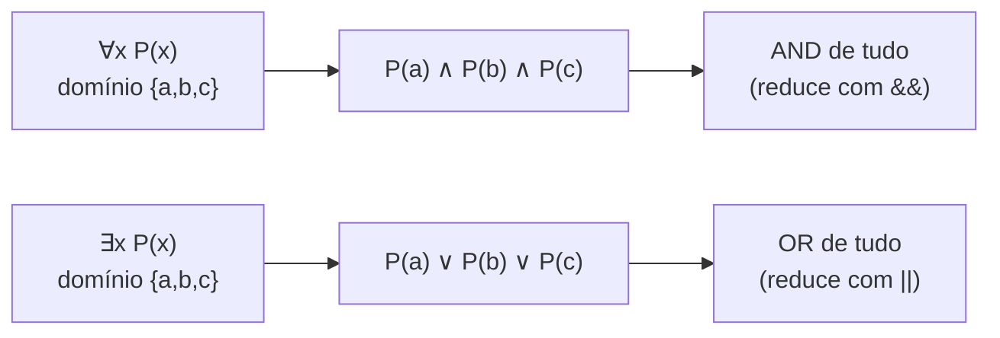
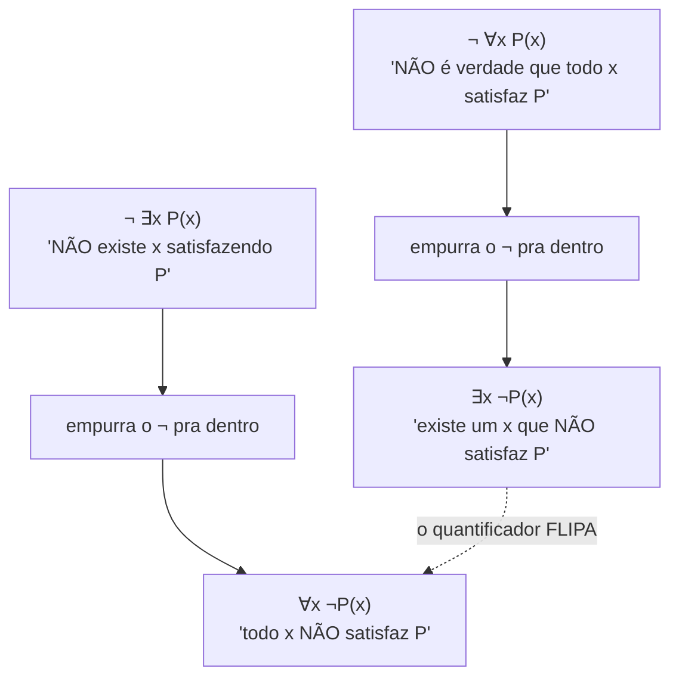
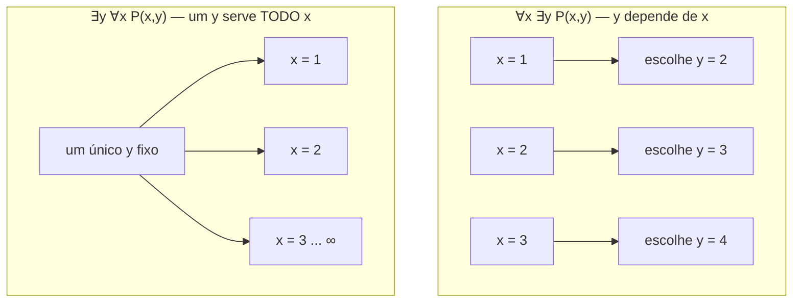
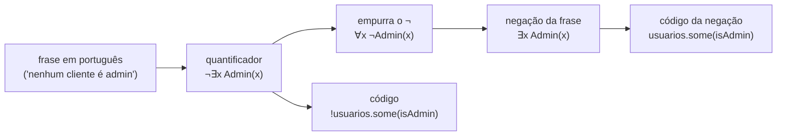
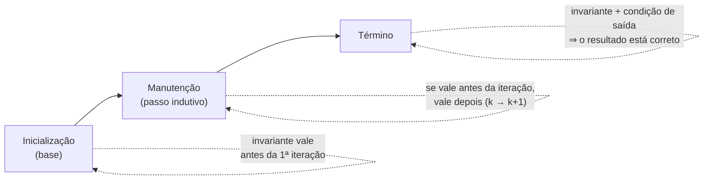

# Lógica de predicados e quantificadores

> [!abstract] TL;DR
> A [[02 - Lógica proposicional|lógica proposicional]] enxerga o mundo como caixas-pretas que valem V ou F. Ela não sabe falar de **objetos**, nem dizer "todo" ou "existe". A lógica de predicados conserta isso: um **predicado** P(x) é uma proposição com um buraco; quando você enche o buraco com um valor do **domínio de discurso**, vira V ou F. Os **quantificadores** ∀ ("para todo") e ∃ ("existe") amarram esse buraco varrendo o domínio inteiro. Duas coisas você precisa gravar na pele: a **negação** vira o quantificador de cabeça pra baixo (¬∀x P(x) ≡ ∃x ¬P(x)) — é a De Morgan dos quantificadores; e em quantificadores **aninhados a ORDEM importa** (∀x∃y ≠ ∃y∀x). Pra um dev, ∀/∃ não são enfeite acadêmico: são `.every()`/`.some()`, `all()`/`any()`, `EXISTS`/`NOT EXISTS`, e a linguagem exata de **invariantes de laço** e **pré/pós-condições**.

## O teto da lógica proposicional

Na [[02 - Lógica proposicional|lógica proposicional]], `p` é só um rótulo. Você sabe que `p` vale V ou F, e ponto. Não há como olhar pra dentro de `p` e perguntar "do que ele está falando?".

Agora tente formalizar isto:

> Todo número par é divisível por 2.

Onde isso entra? Se você chamar a frase inteira de `p`, perdeu tudo o que interessa. Não dá pra raciocinar sobre "número par", sobre "divisível por 2", nem sobre o "todo". A proposicional só consegue colar uma etiqueta.

E pior: ela não consegue ligar afirmações que falam do **mesmo objeto**. "Sócrates é homem" e "todo homem é mortal" — pra concluir "Sócrates é mortal" você precisa que as duas frases conversem sobre o mesmo Sócrates e a mesma classe "homem". A proposicional não tem vocabulário pra isso.

> [!question] Qual é a peça que falta?
> Falta poder falar de **coisas** (objetos do mundo) e de **quantidade** ("todos", "algum", "nenhum"). É exatamente isso que a lógica de predicados adiciona. Por isso ela também é chamada de **lógica de primeira ordem**.

## Predicado: uma proposição com um buraco

Um **predicado** é uma proposição parametrizada. Escreve-se P(x): uma frase com uma variável `x` que ainda não tem valor.

Pense em P(x) := "x é divisível por 2". Sozinho, P(x) **não** é V nem F — depende de quem é `x`. É como uma função que ainda não foi chamada.

- P(4) → "4 é divisível por 2" → **V**
- P(7) → "7 é divisível por 2" → **F**

No instante em que você passa um argumento, o buraco se fecha e o predicado vira uma proposição de verdade definida. Predicado é função booleana; é literalmente o que você escreve em código toda hora:

```python
def P(x):
    return x % 2 == 0   # o predicado "x é par"
```

### Predicados de várias variáveis

Nada obriga um buraco só. P(x, y) := "x < y" é um predicado de duas variáveis (uma **relação**).

- P(3, 5) → "3 < 5" → **V**
- P(5, 3) → "5 < 3" → **F**

Você só consegue avaliar quando **todos** os buracos estão preenchidos. Um predicado com `n` argumentos é uma relação `n`-ária.

### Domínio de discurso: o universo onde x mora

Aqui está a sutileza que muita gente pula. Um predicado não vive no vácuo — ele varia sobre um **domínio de discurso** (o "universo", "tipo" de `x`). E trocar o domínio **muda o valor de verdade**.

Considere P(x) := "x² ≥ 0":

| Domínio | ∀x P(x)? | Por quê |
| --- | --- | --- |
| ℝ (reais) | **V** | quadrado de real nunca é negativo |
| ℂ (complexos) | **F** | com `i`, "≥ 0" nem faz sentido / falha |

A mesma fórmula, dois veredictos. **Sempre fixe o domínio antes de quantificar.** É o equivalente lógico de declarar o tipo da variável: `for (int x : ...)` é diferente de `for (double x : ...)`.

> [!tip] Domínio é o `range` do seu `for`
> Quantificar é varrer um domínio. Se você não disser qual é a coleção, a varredura não tem sentido. "Para todo x..." → para todo x **em quê**?

## Os dois quantificadores (e o terceiro, leve)

Quantificador é o operador que pega o buraco aberto do predicado e o amarra varrendo o domínio.

> [!example] ∀ — Universal
> **∀x P(x)** lê-se "para todo x, P(x)". É V quando P(x) é V para **cada** elemento do domínio. Um único contraexemplo derruba tudo.
> *Mnemônico*: ∀ é um **A** de cabeça pra baixo — **A**ll.

> [!example] ∃ — Existencial
> **∃x P(x)** lê-se "existe x tal que P(x)". É V quando P(x) é V para **pelo menos um** elemento. Uma única testemunha basta.
> *Mnemônico*: ∃ é um **E** espelhado — **E**xists.

> [!example] ∃! — Existe único (bônus)
> **∃!x P(x)** lê-se "existe um único x tal que P(x)". V quando há **exatamente um** elemento satisfazendo P. É açúcar: ∃!x P(x) significa "existe pelo menos um E não existem dois diferentes".

### Quantificar sobre domínio finito = ∧/∨ gigante

Se o domínio é finito, digamos {a, b, c}, os quantificadores **desmontam** em conjunções e disjunções da proposicional:

- ∀x P(x) ≡ P(a) ∧ P(b) ∧ P(c) — universal é um **∧** de todos os termos
- ∃x P(x) ≡ P(a) ∨ P(b) ∨ P(c) — existencial é um **∨** de todos os termos

Isso amarra a lógica de predicados de volta na [[02 - Lógica proposicional|proposicional]]: ∀ é "AND de tudo", ∃ é "OR de tudo". O quantificador só é mais poderoso porque funciona também em domínios **infinitos** (ℕ, ℝ), onde você não consegue escrever o ∧ com infinitos termos na mão.



**Leitura do diagrama**: num domínio finito, ∀ é só um grande AND e ∃ é só um grande OR. Em código, é exatamente o que `reduce` faz com `&&` ou `||`. A grande virada é que o quantificador funciona também onde o domínio não cabe num AND escrito à mão.

## Negação de quantificadores — a De Morgan dos predicados

Esta é a parte que cai em entrevista e que destrava metade dos exercícios. Negar um quantificado **flipa o quantificador e empurra a negação pra dentro**:

> [!warning] As duas regras de ouro
> - **¬∀x P(x) ≡ ∃x ¬P(x)** — "nem todo x satisfaz P" = "existe um x que NÃO satisfaz P"
> - **¬∃x P(x) ≡ ∀x ¬P(x)** — "não existe x que satisfaça P" = "todo x NÃO satisfaz P"

Repare na simetria com as [[02 - Lógica proposicional|leis de De Morgan]]: ¬(p ∧ q) ≡ ¬p ∨ ¬q. Como ∀ é um AND gigante e ∃ é um OR gigante, negar o AND vira OR (∀ vira ∃) e a negação cola em cada termo (P vira ¬P). É **literalmente** De Morgan esticado pro infinito.



**Leitura do diagrama**: ao atravessar o ¬ pra dentro do quantificador, o ∀ vira ∃ e o ∃ vira ∀, e a negação gruda no predicado. Nunca atravesse uma negação sem flipar o quantificador — é o erro número um.

### Em português, isso confunde demais

O cuidado em linguagem natural: a negação de "todos" **não** é "nenhum". É "nem todos".

| Afirmação | Negação correta (formal) | Negação em PT-BR |
| --- | --- | --- |
| "Todo aluno passou" — ∀x Passou(x) | ∃x ¬Passou(x) | "Existe (pelo menos um) aluno que **não** passou" |
| "Algum aluno passou" — ∃x Passou(x) | ∀x ¬Passou(x) | "**Nenhum** aluno passou" |

"Nem todos passaram" só exige **um** reprovado. "Nenhum passou" exige que **todos** tenham reprovado. São negações de coisas diferentes — confundi-las é um bug de raciocínio clássico.

> [!danger] Pegadinha de entrevista
> Negar "todo cisne é branco" não é "todo cisne é preto". É "existe um cisne que **não** é branco" — basta **um** contraexemplo. Falsear um ∀ é caçar **um** contraexemplo; falsear um ∃ é provar que **todos** falham.

## Quantificadores aninhados: a ORDEM importa

Quando há dois ou mais quantificadores, a **ordem** em que aparecem muda o significado. Trocar ∀x∃y por ∃y∀x quase sempre dá uma frase diferente.

O exemplo canônico, sobre os naturais ℕ, com P(x, y) := "y > x":

- **∀x ∃y, y > x** — "para todo x, existe um y maior que x". **V** em ℕ: dado qualquer x, escolha y = x + 1. Cada x pode escolher **seu próprio** y.
- **∃y ∀x, y > x** — "existe um y que é maior que todo x". **F** em ℕ: nenhum número é maior que todos os outros. Aqui um **único** y teria de servir pra **todos** os x de uma vez.

Mesmos símbolos, ordem trocada: um é verdadeiro, o outro é falso. A diferença é **quem escolhe depois de quem**.

> [!tip] A analogia da mãe
> "Toda pessoa tem uma mãe" (∀x ∃y, y é mãe de x) — **verdade**: cada pessoa tem a sua.
> "Existe uma pessoa que é mãe de todas" (∃y ∀x, y é mãe de x) — **falso**: não há uma única super-mãe universal.
> No ∀x∃y, o `y` pode **depender** do `x` (cada x pega o seu). No ∃y∀x, o `y` é fixado **antes** e precisa servir a todos.



**Leitura do diagrama**: no bloco de cima (∀x∃y), cada x escolhe um y sob medida — flexível, geralmente verdadeiro. No bloco de baixo (∃y∀x), um único y é fixado primeiro e tem de cobrir todo x de uma vez — uma exigência muito mais forte, geralmente falsa. **∃y∀x ⇒ ∀x∃y, mas não o contrário.**

### As quatro combinações

| Forma | Lê-se | Exemplo (ℕ, P: "y > x") | Valor |
| --- | --- | --- | --- |
| ∀x ∀y P(x,y) | "todo par (x,y) satisfaz" | todo y > todo x | **F** |
| ∀x ∃y P(x,y) | "cada x tem algum y" | cada x tem um y maior | **V** |
| ∃x ∀y P(x,y) | "algum x serve com todo y" | algum x é menor que todo y | **F** |
| ∃x ∃y P(x,y) | "existe algum par" | existe par com y > x | **V** |

Regra prática: ∀∀ e ∃∃ **não** dependem da ordem (pode trocar à vontade). Os mistos ∀∃ e ∃∀ **dependem** — é aí que mora o perigo.

### Mais um caso, agora num banco de dados

Tire o exemplo do papel e ponha numa loja. Domínio de `x` = clientes; domínio de `y` = pedidos; o predicado Fez(x, y) := "o cliente x fez o pedido y".

- **∀x ∃y, Fez(x, y)** — "todo cliente tem (ao menos) um pedido". Cada cliente escolhe **o seu** pedido. É a afirmação de que ninguém ficou sem comprar — plausível numa base saudável.
- **∃y ∀x, Fez(x, y)** — "existe um pedido que **todo** cliente fez". Agora um **único** pedido `y`, fixado de antemão, teria de pertencer a todos os clientes ao mesmo tempo. Num modelo onde cada pedido tem um dono só, isso é impossível — **falso**.

Repare que é exatamente o mesmo esqueleto do "y > x": no ∀x∃y o `y` pode mudar conforme o `x`; no ∃y∀x o `y` é congelado antes de a varredura sobre `x` começar. Trocar a ordem trocou "todo mundo comprou alguma coisa" por "alguma coisa foi comprada por todo mundo" — duas frases que o português disfarça e a lógica separa.

> [!tip] O truque pra ler em voz alta
> Leia da esquerda pra direita e pergunte "quem é escolhido primeiro?". O quantificador da esquerda escolhe **antes** e não enxerga o da direita; o da direita escolhe **depois** e pode depender do anterior. Em ∀x∃y, o `y` nasce sabendo quem é o `x`. Em ∃y∀x, o `y` nasce cego.

## Vacuamente verdadeiro: ∀ sobre o vazio

Pergunta-armadilha: ∀x P(x) sobre o domínio **vazio** (∅) vale o quê?

Resposta: **verdadeiro**. Sempre. Independente de P.

Por quê? Porque ∀x P(x) é falso só quando existe um **contraexemplo** — um x que falha P. No domínio vazio não há x nenhum, logo **zero contraexemplos**, logo nada pra derrubar a afirmação. Chama-se **vacuamente verdadeiro** (*vacuously true*).

> [!example] "Todos os elefantes cor-de-rosa na sala sabem voar"
> Se não há elefantes cor-de-rosa na sala, a frase é **verdadeira** — não há quem a contradiga. Soa estranho, mas é coerente: nenhum contraexemplo = ∀ verdadeiro.

Isso não é filosofia abstrata; é o comportamento exato de código que você roda todo dia:

```javascript
[].every(x => x > 1000)   // true  — ∀ sobre lista vazia
[].some(x => x > 0)       // false — ∃ sobre lista vazia (nenhuma testemunha)
```

`every` numa lista vazia é `true` (vacuamente verdadeiro); `some` é `false` (não há nenhum elemento pra ser a testemunha). Espelha exatamente ∀ e ∃ sobre ∅. Quem esquece disso escreve um bug sutil: a validação "todos os itens são válidos" passa numa lista vazia. Às vezes é o que você quer; às vezes não.

> [!tip] Casa com ∧/∨ neutros
> ∀ vacuamente V combina com "AND de zero termos = `true`" (elemento neutro do ∧). ∃ vacuamente F combina com "OR de zero termos = `false`" (elemento neutro do ∨). Tudo coerente.

## Variáveis livres × ligadas e escopo

Quando você quantifica `x`, ele fica **ligado** (*bound*) àquele quantificador — perde a identidade, vira um nome interno. Um `x` **não** quantificado é **livre** (*free*) e a fórmula depende dele.

- P(x): `x` é **livre** — a fórmula é só um predicado, não tem valor até você dar um x.
- ∀x P(x): `x` é **ligado** — a fórmula virou uma proposição fechada, com valor V/F definido.

Variável ligada é como o `x` no `for (x : lista)`: você pode renomeá-lo pra `i`, `j`, qualquer coisa, sem mudar o sentido. Variável livre é como um parâmetro de função ainda não recebido. O **escopo** de um quantificador é o trecho da fórmula sob o qual ele manda. Em ∀x (P(x) ∧ Q(x)), o ∀x cobre tudo entre parênteses. Em (∀x P(x)) ∧ Q(x), o segundo `x` está **fora** do escopo — é uma variável livre, outra coisa.

> [!warning] Mesmo nome, mundos diferentes
> Em (∀x P(x)) ∨ (∃x Q(x)), os dois `x` são variáveis ligadas **independentes** — não têm relação nenhuma. Igual a duas funções que ambas usam um parâmetro chamado `x`: mesmo nome, escopos separados. Renomear um não afeta o outro.

## Traduzindo português ↔ lógica ↔ código

Metade dos bugs de raciocínio nasce na fronteira entre o português e a fórmula. As palavrinhas "nenhum", "nem todo", "pelo menos um", "no máximo um" parecem inocentes, mas cada uma esconde um quantificador (e a negação dele). A tabela abaixo desfaz o disfarce:

| Português | Forma quantificada | Negação (o oposto) | Código |
| --- | --- | --- | --- |
| **Pelo menos um** x é válido | ∃x Válido(x) | ∀x ¬Válido(x) ("nenhum é") | `arr.some(válido)` |
| **Nenhum** x é válido | ¬∃x Válido(x) ≡ ∀x ¬Válido(x) | ∃x Válido(x) ("existe um") | `!arr.some(válido)` |
| **Todo** x é válido | ∀x Válido(x) | ∃x ¬Válido(x) ("nem todo") | `arr.every(válido)` |
| **Nem todo** x é válido | ¬∀x Válido(x) ≡ ∃x ¬Válido(x) | ∀x Válido(x) ("todo é") | `!arr.every(válido)` |
| **No máximo um** x é válido | ¬∃x∃y (x≠y ∧ Válido(x) ∧ Válido(y)) | existem **dois** válidos | `arr.filter(válido).length <= 1` |

Leia uma linha de cada vez e repare: "nenhum" é o ¬∃, que vira ∀¬; "nem todo" é o ¬∀, que vira ∃¬. As duas se confundem na fala porque ambas começam com "n", mas são opostas — "nenhum passou" exige que **todos** falhem; "nem todo passou" exige só **um** que falhou.



**Leitura do diagrama**: o caminho de uma afirmação até o código sempre passa pelo quantificador. Quando você precisa do **oposto** (pra um `if` de erro, por exemplo), flipe o quantificador e empurre o ¬ pra dentro — e o `.some()` vira `!.some()` ou o `.every()` vira `!.every()`. Errar esse passo é o clássico "validei ao contrário".

> [!warning] "No máximo um" não é "exatamente um"
> "No máximo um admin" (≤ 1) admite **zero** admins; "exatamente um" (∃!) **exige** um. Em fórmula: ∃!x P(x) ≡ ∃x P(x) ∧ ¬∃x∃y (x≠y ∧ P(x) ∧ P(y)) — junta "existe pelo menos um" com "não existem dois". Misturar os dois é um bug de regra de negócio que passa em todos os testes felizes.

## Onde isso vira código de verdade

Pra um dev, ∀/∃ não são notação enfeitada — são a alma das queries, dos filtros e das provas de correção.

### Invariantes de laço escritas com ∀

Um **invariante de laço** é uma propriedade que vale antes e depois de cada iteração. A forma natural de escrevê-lo é com ∀. Exemplo: um trecho ordenado.

> Invariante: **∀ i, 0 ≤ i < k → a[i] ≤ a[i+1]**

Em português: "o prefixo a[0..k] está ordenado". Provar correção de um laço com isso tem três passos — exatamente o esqueleto da [[06 - Indução matemática|indução matemática]]:



**Leitura do diagrama**: provar um invariante é uma indução disfarçada. **Inicialização** = caso base (vale antes do laço). **Manutenção** = passo indutivo (se ∀ vale para `k`, vale para `k+1`). **Término** = ao sair do laço, o invariante mais a condição de parada garantem o pós-condição. É o método de Floyd–Hoare, e o invariante é quase sempre uma fórmula com ∀.

Concretize com a **busca linear**, o laço mais simples que existe. Você quer responder "x está em `a`?" varrendo do começo:

```javascript
function contém(a, x) {
    for (let k = 0; k < a.length; k++) {
        // INVARIANTE: ∀ i, 0 ≤ i < k → a[i] ≠ x
        if (a[k] === x) return true;
    }
    return false;
}
```

A invariante é um **∀ sobre o prefixo já processado**: "nenhum dos `k` primeiros elementos era o `x`". Os três momentos da indução caem perfeitamente:

- **Inicialização** (`k = 0`): o prefixo a[0..0] é **vazio**. ∀ sobre o vazio é **vacuamente verdadeiro** — repare como o conceito de algumas seções atrás reaparece aqui pra fazer o caso base funcionar de graça.
- **Manutenção**: se ∀ i < k vale `a[i] ≠ x` e o `if` não disparou (logo `a[k] ≠ x`), então ∀ i < k+1 também vale. O prefixo cresceu um e a propriedade sobreviveu — é o passo `k → k+1` da [[06 - Indução matemática|indução]].
- **Término**: o laço para por `a[k] === x` (achou, e o pós é "∃ i, a[i] == x") ou por `k === a.length` (varreu tudo, e o invariante vira ∀ i < n, a[i] ≠ x — a prova de que `x` **não** está lá).

> [!tip] A invariante é a frase que o laço nunca quebra
> Pense na invariante como o "estado de verdade" carregado a cada volta. No início ela é trivialmente verdadeira (∀ sobre o vazio); cada iteração a estende sem quebrar; no fim, ela mais a condição de saída **provam** o resultado. Achar essa frase é o coração de provar qualquer laço — e ela quase sempre tem um ∀ varrendo a parte do array já visitada.

### Asserções e pré/pós-condições (Hoare, leve)

Um **contrato** de função descreve-se com predicados:

- **Pré-condição**: ∀ argumento, restrição válida. Ex.: `binarySearch(a, x)` exige "**∀** i, a[i] ≤ a[i+1]" (entrada ordenada).
- **Pós-condição**: o que a função garante na saída. Ex.: "**∃** i tal que a[i] == x" se retornou índice; ou "**∀** i, a[i] ≠ x" se retornou -1.

A tripla de Hoare `{P} código {Q}` é literalmente "se o predicado P vale antes, então Q vale depois". `assert`, pré/pós-condições e [[05 - Técnicas de prova|técnicas de prova]] de correção falam essa mesma língua.

### Validação de formulário

Regra de negócio direto em quantificadores:

- "Todo campo obrigatório está preenchido" → **∀** campo ∈ obrigatórios, `preenchido(campo)`
- "Existe ao menos um administrador" → **∃** usuário, `isAdmin(usuário)`

```javascript
const todosPreenchidos = obrigatorios.every(c => c.value !== "");  // ∀
const temAdmin       = usuarios.some(u => u.role === "admin");     // ∃
```

### A tabela que amarra tudo: quantificador → SQL → código

| Lógica | SQL | JavaScript | Python | Significado |
| --- | --- | --- | --- | --- |
| ∀x P(x) | `NOT EXISTS (... ¬P ...)` / `ALL` | `arr.every(P)` | `all(P(x) for x in xs)` | todos satisfazem |
| ∃x P(x) | `EXISTS (... P ...)` / `ANY`/`SOME` | `arr.some(P)` | `any(P(x) for x in xs)` | algum satisfaz |
| ¬∃x P(x) | `NOT EXISTS (... P ...)` | `!arr.some(P)` | `not any(...)` | nenhum satisfaz |
| ¬∀x P(x) | `EXISTS (... ¬P ...)` | `!arr.every(P)` | `not all(...)` | nem todos satisfazem |

**Leitura da tabela**: a mesma ideia atravessa três linguagens. `every`/`all` são ∀; `some`/`any` são ∃. E `NOT EXISTS` é a tradução da negação de quantificador para o SQL.

### SQL é lógica de predicados aplicada

O SQL reconhece os quantificadores `ANY` (ou `SOME`) e `ALL`, e os predicados `EXISTS`/`NOT EXISTS`. Repare na tradução da **negação de quantificador**:

```sql
-- ∀ aluno, ∃ matrícula → "alunos que se matricularam em TODA disciplina"
-- Truque clássico: NÃO existe disciplina em que o aluno NÃO se matriculou.
-- ∀d M(a,d)  ≡  ¬∃d ¬M(a,d)
SELECT a.id FROM aluno a
WHERE NOT EXISTS (
    SELECT 1 FROM disciplina d
    WHERE NOT EXISTS (
        SELECT 1 FROM matricula m
        WHERE m.aluno = a.id AND m.disciplina = d.id
    )
);
```

Esse padrão de **`NOT EXISTS` aninhado** é a forma canônica de exprimir um ∀ em SQL — porque SQL não tem um "FOR ALL" direto, e a gente reescreve ∀x P(x) como ¬∃x ¬P(x) usando a negação de quantificador. O `EXISTS` é eficiente: a subconsulta para assim que acha o primeiro match (a testemunha do ∃). É a lógica de predicados rodando dentro do otimizador do banco.

### Divisão relacional: "quem comprou TODOS os produtos"

Esse mesmo truque tem nome na teoria de bancos: **divisão relacional**. Toda pergunta da forma "ache os X que se relacionam com **todos** os Y" é um ∀ disfarçado, e cai no mesmo `NOT EXISTS (... NOT EXISTS ...)`. O caso canônico: **clientes que compraram todos os produtos do catálogo**.

Em lógica, "o cliente c comprou todos os produtos" é ∀p Comprou(c, p). Aplicando a dupla negação de ∀:

> ∀p Comprou(c, p)  ≡  ¬∃p ¬Comprou(c, p)

Lê-se ao contrário: "**não** existe um produto que o cliente c **não** comprou". Os dois "não" são os dois `NOT EXISTS`:

```sql
-- Clientes que compraram TODOS os produtos.
-- ∀p Comprou(c,p) ≡ ¬∃p ¬Comprou(c,p):
-- "não há produto que falte na lista de compras do cliente"
SELECT c.id FROM cliente c
WHERE NOT EXISTS (                       -- ¬∃p ... : nenhum produto que...
    SELECT 1 FROM produto p
    WHERE NOT EXISTS (                   -- ¬Comprou(c,p) : ...o cliente NÃO comprou
        SELECT 1 FROM compra k
        WHERE k.cliente = c.id AND k.produto = p.id
    )
);
```

> [!example] Como ler a casca de cebola
> Vá de dentro pra fora. O `EXISTS` mais interno é Comprou(c, p) — "este cliente comprou este produto". O `NOT EXISTS` do meio inverte: "este produto **não** foi comprado por c". O `NOT EXISTS` externo varre todos os produtos e exige que **nenhum** caia nessa categoria — ou seja, que **todos** tenham sido comprados. Duas negações reconstroem o "para todo".

A lição de fundo: sempre que você ouvir "todos", desconfie de que vai precisar de uma dupla negação no SQL, porque a linguagem só te dá o ∃ (via `EXISTS`) de graça. O ∀ você fabrica com ¬∃¬.

> [!summary] Resumo em uma linha
> Predicado é proposição com buraco; ∀/∃ amarram o buraco varrendo um domínio; negar flipa o quantificador (¬∀≡∃¬, ¬∃≡∀¬); em aninhados a ordem manda (∀∃≠∃∀); e isso é exatamente `every`/`some`, `all`/`any`, `EXISTS`/`NOT EXISTS` e a linguagem de invariantes e contratos.

## Em entrevista

Predicados e quantificadores aparecem quando o entrevistador pede pra você raciocinar sobre correção (invariantes de laço), descrever contratos de função, ou escrever uma query de "todos/algum". Saber dizer "isto é um `for all`, então em SQL vira `NOT EXISTS` aninhado" mostra que você enxerga a lógica por trás do código. Treine especialmente verbalizar negações em voz alta, porque é onde a maioria escorrega.

- *"A predicate is a proposition with a free variable; it only gets a truth value once you plug in an element of the domain of discourse."*
- *"The universal quantifier says **for all**, the existential says **there exists**; on a finite domain they collapse into a big AND and a big OR."*
- *"To negate a quantifier you flip it and push the negation inside: not-for-all becomes there-exists-not. It's De Morgan for quantifiers."*
- *"To disprove a `for all` you only need **one counterexample**; to disprove a `there exists` you must show **every** case fails."*
- *"With nested quantifiers the **order matters**: for-all-x there-exists-y lets y depend on x, but there-exists-y for-all-x fixes a single y for everyone."*
- *"A `for all` over an empty domain is **vacuously true** — zero counterexamples — which is exactly why `[].every(...)` returns true."*
- *"A loop invariant is usually a `for all` statement, and proving it follows the same three steps as induction: initialization, maintenance, termination."*
- *"In SQL, `EXISTS` is the existential quantifier and a `for all` is expressed as a nested `NOT EXISTS`, which is just `not-exists-not`."*
- *"`.every()`/`.some()` in JS and `all()`/`any()` in Python are literally universal and existential quantifiers over a collection."*

| Português | English |
| --- | --- |
| Lógica de predicados | Predicate logic |
| Lógica de primeira ordem | First-order logic |
| Predicado | Predicate |
| Quantificador | Quantifier |
| Quantificador universal | Universal quantifier |
| Quantificador existencial | Existential quantifier |
| Para todo | For all |
| Existe (ao menos um) | There exists |
| Existe um único | There exists a unique |
| Domínio de discurso | Domain of discourse |
| Valor de verdade | Truth value |
| Contraexemplo | Counterexample |
| Negação | Negation |
| Quantificadores aninhados | Nested quantifiers |
| Variável livre | Free variable |
| Variável ligada | Bound variable |
| Escopo | Scope |
| Vacuamente verdadeiro | Vacuously true |
| Invariante de laço | Loop invariant |
| Pré-condição / pós-condição | Precondition / postcondition |

> [!info] Lastro
> - Kenneth H. Rosen, *Discrete Mathematics and Its Applications*, 8ª ed. — Seção 1.4 (Predicates and Quantifiers) e 1.5 (Nested Quantifiers): domínio de discurso, negação de quantificados (De Morgan para quantificadores) e a ordem em aninhados.
> - E. Lehman, F. T. Leighton, A. R. Meyer, *Mathematics for Computer Science* (MIT 6.042, OpenCourseWare) — predicados, quantificadores e provas; ênfase em correção de programas e invariantes.
> - Material de curso baseado em Rosen — "Nested Quantifiers" (J. Pineiro, BCC/CUNY) e ICS 141 *Nested Quantifiers* (Univ. of Hawaii): exemplos ∀x∃y vs ∃y∀x sobre ℕ.
> - Microsoft Learn / SQL Server docs — *Quantified comparison predicates (ANY, ALL, SOME)* e semântica de `EXISTS`/`NOT EXISTS` (existencial; término no primeiro match).
> - Relacionadas no vault: [[02 - Lógica proposicional]], [[04 - Teoria dos conjuntos]], [[05 - Técnicas de prova]], [[06 - Indução matemática]].
