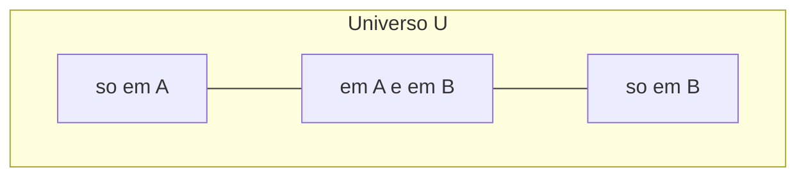
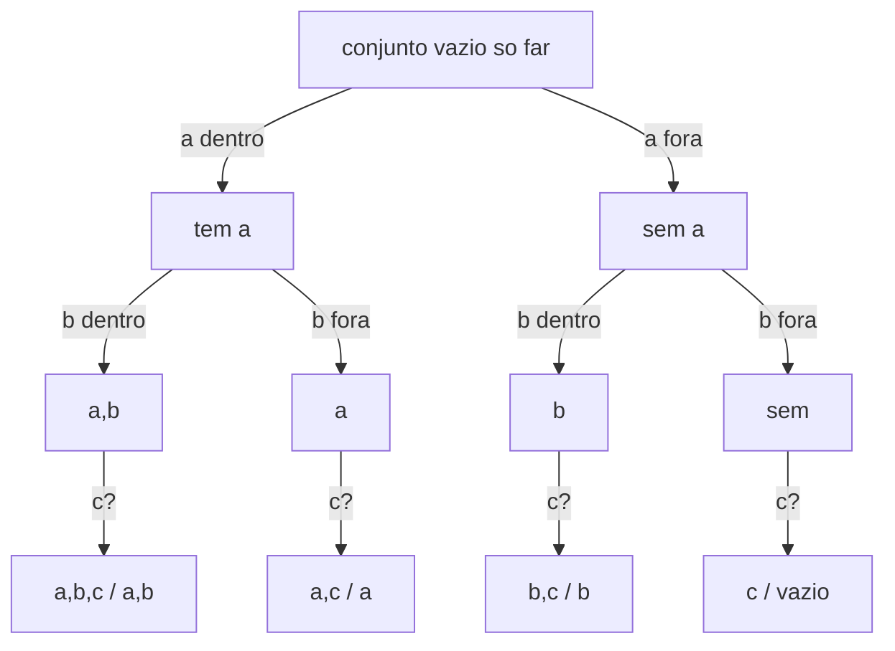
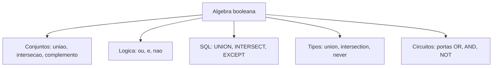

# Teoria dos conjuntos

> [!abstract] TL;DR
> Um **conjunto** é uma coleção não-ordenada de elementos distintos. Você decide tudo com uma pergunta: o elemento **pertence** (∈) ou **não pertence** (∉)? Em cima disso constrói-se um álgebra inteira — união ∪, interseção ∩, diferença ∖, complemento — que é *literalmente o mesmo* da lógica booleana (∪ é ∨, ∩ é ∧, complemento é ¬). E isso não é trivia de prova: **tipos são conjuntos de valores**, `UNION`/`INTERSECT` em SQL são operações de conjunto, `Set` em JS/Python é um conjunto com pertinência O(1). A teoria dos conjuntos é o solo onde a computação inteira pisa.

## O que é um conjunto

Um **conjunto** é uma coleção de objetos, chamados **elementos** ou **membros**. Duas regras o definem, e elas mudam tudo:

1. **Não-ordenado**: `{1, 2, 3}` e `{3, 1, 2}` são o *mesmo* conjunto. Não existe "primeiro elemento".
2. **Sem repetição**: `{1, 1, 2}` é só `{1, 2}`. Um elemento está dentro ou está fora — não há "duas vezes dentro".

Pense num conjunto como uma sacola onde você só consegue perguntar *"isso está aí?"*. Não dá pra perguntar "qual o terceiro item" nem "quantas vezes o 1 aparece". Se você precisa de ordem, quer uma **sequência**; se precisa de repetição, quer um **multiconjunto**. O conjunto é deliberadamente mais pobre — e é dessa pobreza que vem o poder de raciocinar com ele.

A relação fundamental é a **pertinência**:

- `x ∈ A` — *x pertence a A* (x é membro de A).
- `x ∉ A` — *x não pertence a A*.

> [!note] A pergunta única
> Tudo na teoria dos conjuntos se reduz a uma função booleana: dado um elemento e um conjunto, `pertence?` devolve verdadeiro ou falso. Toda operação que veremos é só uma forma esperta de combinar essa pergunta. Guarde isso — é a chave da conexão com [[03 - Lógica de predicados e quantificadores]].

### Duas formas de descrever um conjunto

**Por extensão** (listando os elementos):

```
A = {2, 3, 5, 7, 11}
Vogais = {a, e, i, o, u}
```

**Por compreensão** (descrevendo a regra de quem entra):

```
P = {x ∈ ℕ : x é par}
Q = {x ∈ ℤ : -3 ≤ x ≤ 3}
```

Leia o `:` (ou `|`) como *"tal que"*. `{x ∈ ℕ : x é par}` é "o conjunto dos x em ℕ tais que x é par". A compreensão é o pão de cada dia do dev — é exatamente um *list comprehension* em Python ou um `.filter()` em JS. Você não lista os elementos; você descreve o **predicado** que decide quem entra.

### Os conjuntos numéricos

Há uma cadeia de conjuntos numéricos que todo dev deveria conseguir desenhar de olhos fechados:

| Símbolo | Nome | Exemplos |
|---------|------|----------|
| ℕ | Naturais | 0, 1, 2, 3, ... |
| ℤ | Inteiros | ..., -2, -1, 0, 1, 2, ... |
| ℚ | Racionais | 1/2, -3/4, 5, 0.25 |
| ℝ | Reais | ℚ mais π, √2, e, ... |

E eles se encaixam um dentro do outro:

```
ℕ ⊂ ℤ ⊂ ℚ ⊂ ℝ
```

Todo natural é um inteiro; todo inteiro é racional (n = n/1); todo racional é real. As setas dessa cadeia são *subconjuntos próprios* — cada nível tem elementos que o anterior não tem. Isso é o `⊂` da próxima seção.

## Subconjunto, vazio e igualdade

### Subconjunto e subconjunto próprio

`A ⊆ B` (*A é subconjunto de B*) significa: **todo** elemento de A também está em B. Formalmente, conectando com [[03 - Lógica de predicados e quantificadores]]:

```
A ⊆ B  ⟺  ∀x (x ∈ A → x ∈ B)
```

Repare: subconjunto é uma **implicação universal**. "Estar em A força estar em B." É por isso que `⊆` corresponde a `→` na dualidade que veremos.

`A ⊊ B` (ou `A ⊂ B`, *subconjunto próprio*) significa A ⊆ B **e** A ≠ B — B tem pelo menos um elemento que A não tem. A notação `⊂` é ambígua na literatura (alguns autores usam pra "subconjunto qualquer", outros pra "próprio"); quando a distinção importa, use `⊆` e `⊊` sem medo.

> [!tip] Subconjunto não é elemento
> Confusão clássica: `2 ∈ {1, 2, 3}` (pertinência) é diferente de `{2} ⊆ {1, 2, 3}` (inclusão). O número 2 *pertence*; o conjunto `{2}` é *subconjunto*. Em código: `x in s` (membership) versus `s1.issubset(s2)`. Misturar os dois é um bug conceitual comum.

### O conjunto vazio

O **conjunto vazio** ∅ (ou `{}`) não tem nenhum elemento. E ele tem uma propriedade que parece truque mas é pura lógica:

> [!warning] ∅ é subconjunto de TODO conjunto
> `∅ ⊆ A` para qualquer A. Por quê? `∅ ⊆ A` quer dizer "todo elemento de ∅ está em A". Mas ∅ não tem elementos — então a afirmação é **vacuamente verdadeira** (não há contraexemplo possível). É a mesma lógica de "todos os unicórnios na minha mesa são roxos": verdade, porque não há unicórnio que a desminta. Vê [[03 - Lógica de predicados e quantificadores]] sobre verdade vacuosa.

Cuidado também: `∅` e `{∅}` são coisas diferentes. `∅` é a sacola vazia; `{∅}` é uma sacola contendo *uma sacola vazia* — tem 1 elemento. Como uma `List<List>` com uma lista vazia dentro: não está vazia.

### Igualdade por dupla inclusão

Dois conjuntos são **iguais** quando têm exatamente os mesmos elementos. A forma operacional disso — a que você usa pra *provar* igualdade — é a **dupla inclusão**:

```
A = B  ⟺  (A ⊆ B)  ∧  (B ⊆ A)
```

Pra provar que dois conjuntos são iguais, você prova duas inclusões: pega um x ∈ A arbitrário e mostra x ∈ B; depois pega x ∈ B arbitrário e mostra x ∈ A. Esse é o padrão de prova mais usado em teoria dos conjuntos — vê `[[05 - Técnicas de prova]]` pra mecânica das provas de inclusão. Toda lei de conjunto da tabela mais abaixo é provada assim.

## As operações

Aqui mora o coração prático. Cada operação tem uma **definição por pertinência** (via [[03 - Lógica de predicados e quantificadores]]) — e cada definição revela a dualidade com a lógica.

| Operação | Notação | Definição por compreensão | Lê-se |
|----------|---------|---------------------------|-------|
| União | A ∪ B | `{x : x ∈ A ∨ x ∈ B}` | em A **ou** em B |
| Interseção | A ∩ B | `{x : x ∈ A ∧ x ∈ B}` | em A **e** em B |
| Diferença | A ∖ B | `{x : x ∈ A ∧ x ∉ B}` | em A **e não** em B |
| Complemento | Aᶜ | `{x ∈ U : x ∉ A}` | tudo em U fora de A |
| Dif. simétrica | A △ B | `{x : x ∈ A ⊕ x ∈ B}` | num **ou** noutro, não nos dois |

Olhe a coluna do meio: ∪ usa **∨**, ∩ usa **∧**, diferença usa **¬**, simétrica usa **⊕** (xor). As operações de conjunto *são* operações lógicas aplicadas à pergunta `pertence?`. Não é analogia — é identidade.

O **complemento** Aᶜ precisa de um **universo** U (o conjunto de todos os elementos em jogo). "Tudo que não é A" só faz sentido dentro de um contexto. Sem universo, "complemento de {gatos}" seria infinito e absurdo. Em programação o universo é o *tipo*: o complemento de `EVEN` dentro de `int` são os ímpares, não "todo objeto do universo".

Vamos visualizar. Como o Mermaid do Obsidian não tem diagrama de Venn nativo, representamos as regiões com um flowchart: cada elemento cai numa de três zonas.



**Leitura do diagrama**: o universo se parte em três zonas — *só em A*, *na interseção*, *só em B* (mais o "fora dos dois", implícito em U). Agora cada operação é só *quais zonas você pega*:

| Operação | Zonas que ela inclui |
|----------|----------------------|
| A ∪ B | só A + interseção + só B |
| A ∩ B | só interseção |
| A ∖ B | só A (tira a interseção) |
| B ∖ A | só B (tira a interseção) |
| A △ B | só A + só B (tira a interseção) |
| Aᶜ | tudo de U *menos* (só A + interseção) |

> [!example] Concreto
> Sejam `A = {1, 2, 3, 4}` e `B = {3, 4, 5, 6}`, universo `U = {1..8}`.
> - `A ∪ B = {1, 2, 3, 4, 5, 6}`
> - `A ∩ B = {3, 4}`
> - `A ∖ B = {1, 2}`
> - `B ∖ A = {5, 6}`
> - `A △ B = {1, 2, 5, 6}` — note que `A △ B = (A ∖ B) ∪ (B ∖ A)`
> - `Aᶜ = {5, 6, 7, 8}`

A **diferença simétrica** △ merece um olhar: ela é o "ou exclusivo" de conjuntos — o que está num *ou* no outro, **mas não nos dois**. É exatamente o XOR bit a bit se você pensar em conjuntos como bitmasks. Aparece em diffs, em detecção de mudanças ("o que entrou e o que saiu entre dois estados"), em estruturas de dados como *Merkle trees*.

## Conjunto potência e produto cartesiano

### Conjunto potência

O **conjunto potência** P(A) é o conjunto de *todos* os subconjuntos de A. Inclui ∅ e o próprio A.

```
A = {a, b}
P(A) = { ∅, {a}, {b}, {a, b} }   →  4 elementos
```

A fórmula: se |A| = n, então **|P(A)| = 2ⁿ**. Por quê esse 2? Pense em construir um subconjunto elemento por elemento. Pra cada elemento de A você faz **uma escolha binária**: entra ou não entra. n elementos, 2 escolhas cada, independentes → 2 × 2 × ... × 2 = 2ⁿ. Esse é o **princípio multiplicativo** da [[11 - Combinatória - a arte de contar]] em ação.

Vamos ver a árvore de decisões pra `{a, b, c}` (n = 3, então 2³ = 8 folhas):



**Leitura do diagrama**: a cada nível você decide um elemento (dentro/fora). Três decisões binárias → 2×2×2 = 8 caminhos da raiz às folhas, e cada caminho é um subconjunto distinto. Os 8 subconjuntos de `{a,b,c}` são: `∅, {a}, {b}, {c}, {a,b}, {a,c}, {b,c}, {a,b,c}`.

> [!tip] Por que isso importa pro dev
> A correspondência subconjunto ↔ string binária de n bits é *literalmente* como você representa conjuntos pequenos como **bitmasks** (flags, permissões `rwx`, máscaras de features). `{a, c}` de `{a,b,c}` vira `101`. União é OR, interseção é AND, complemento é NOT, simétrica é XOR. A teoria dos conjuntos *é* operação de bits.

### Produto cartesiano

O **produto cartesiano** A × B é o conjunto de todos os **pares ordenados** (a, b) com a ∈ A e b ∈ B:

```
A = {1, 2},  B = {x, y}
A × B = { (1,x), (1,y), (2,x), (2,y) }
```

Diferente de tudo até aqui, o produto cartesiano produz **pares ordenados** — `(1, x) ≠ (x, 1)`. A ordem importa. A cardinalidade:

```
|A × B| = |A| · |B|
```

Faz sentido: pra cada um dos |A| primeiros componentes, há |B| escolhas pro segundo. É uma tabela |A| × |B|. Esse produto é a fundação das [[10 - Relações]] (uma relação é um subconjunto de A × B) e das [[09 - Funções]] (uma função é uma relação especial). Em código, é o `CROSS JOIN` do SQL e o `itertools.product` do Python.

## As leis (e a grande dualidade)

As operações de conjunto obedecem a um álgebra com leis que espelham a lógica proposicional ponto a ponto. Aqui o catálogo:

| Lei | Forma | Análoga lógica |
|-----|-------|----------------|
| Comutativa | A ∪ B = B ∪ A | a ∨ b = b ∨ a |
| Associativa | (A ∪ B) ∪ C = A ∪ (B ∪ C) | idem |
| Distributiva | A ∩ (B ∪ C) = (A ∩ B) ∪ (A ∩ C) | ∧ distribui sobre ∨ |
| Idempotência | A ∪ A = A | a ∨ a = a |
| Identidade | A ∪ ∅ = A; A ∩ U = A | a ∨ F = a; a ∧ V = a |
| Dominação | A ∪ U = U; A ∩ ∅ = ∅ | a ∨ V = V; a ∧ F = F |
| Absorção | A ∪ (A ∩ B) = A | a ∨ (a ∧ b) = a |
| Complemento | A ∪ Aᶜ = U; A ∩ Aᶜ = ∅ | a ∨ ¬a = V; a ∧ ¬a = F |
| **De Morgan** | (A ∪ B)ᶜ = Aᶜ ∩ Bᶜ | ¬(a ∨ b) = ¬a ∧ ¬b |
| **De Morgan** | (A ∩ B)ᶜ = Aᶜ ∪ Bᶜ | ¬(a ∧ b) = ¬a ∨ ¬b |

**De Morgan** é a estrela. "O complemento da união é a interseção dos complementos." Em português dev: *o oposto de (A ou B) é (não-A e não-B)*. Você usa isso toda vez que reescreve uma condição negada — `!(a || b)` vira `!a && !b`. Mesma lei, três trajes (conjuntos, lógica, código).

### A dualidade conjuntos ↔ lógica ↔ SQL ↔ tipos

Por que tantas analogias? Porque é tudo o **mesmo álgebra** — a *álgebra booleana*. Conjuntos, lógica proposicional, circuitos digitais e tipos são apenas dialetos diferentes de uma única estrutura matemática. Quem entende uma entende todas:

| Conjuntos | Lógica | SQL | Tipos | Bits |
|-----------|--------|-----|-------|------|
| ∪ união | ∨ ou | `UNION` | `A \| B` (union) | OR |
| ∩ interseção | ∧ e | `INTERSECT` | `A & B` (intersection) | AND |
| ∖ diferença | a ∧ ¬b | `EXCEPT` | — | AND NOT |
| complemento ᶜ | ¬ não | `NOT IN` | complemento de tipo | NOT |
| △ simétrica | ⊕ xor | — | — | XOR |
| ⊆ subconjunto | → implica | subquery | subtipo | submáscara |
| ∅ vazio | falso | conjunto vazio | `never` | `000...` |
| U universo | verdadeiro | tabela toda | `unknown`/topo | `111...` |

Esta tabela é a tese da nota inteira: **aprenda teoria dos conjuntos uma vez, e você ganha de graça a lógica, o SQL de conjuntos e o sistema de tipos.**



**Leitura do diagrama**: no topo, uma única estrutura abstrata (álgebra booleana); embaixo, cinco encarnações concretas. Todas obedecem De Morgan, distributiva, complemento. Trocar de uma pra outra é tradução, não aprendizado novo.

## Cardinalidade e inclusão-exclusão

A **cardinalidade** |A| de um conjunto finito é só a contagem de elementos: `|{a, b, c}| = 3`. Simples — até você querer contar a *união* de dois conjuntos.

> [!warning] Cuidado com a interseção dupla-contada
> `|A ∪ B| ≠ |A| + |B|` em geral! Se você só soma, conta os elementos da interseção **duas vezes**. A correção é o **princípio da inclusão-exclusão**:
> ```
> |A ∪ B| = |A| + |B| − |A ∩ B|
> ```
> Some os dois, subtraia a sobreposição. Para três conjuntos vira `|A| + |B| + |C| − |A∩B| − |A∩C| − |B∩C| + |A∩B∩C|`. Aprofundamento em [[11 - Combinatória - a arte de contar]].

Exemplo concreto: numa turma, 18 estudam Java, 15 estudam Python, 7 estudam ambos. Quantos estudam *pelo menos uma*? Não são 33 (você contou os 7 bilíngues duas vezes): são `18 + 15 − 7 = 26`.

E os conjuntos **infinitos**? Aí a coisa fica fascinante e contraintuitiva. ℕ e ℤ têm o "mesmo tamanho" (ambos infinitos contáveis), mas ℝ é *estritamente maior* — há mais reais do que naturais, infinitos de tamanhos diferentes. Esse é o tema de [[13 - Cardinalidade - contável e incontável]]; por ora, guarde que `|A|` finito é contagem honesta, mas o infinito exige ferramentas próprias.

## O paradoxo de Russell (uma rachadura no chão)

A teoria "ingênua" dos conjuntos — a que descrevemos até aqui — diz: *qualquer* predicado define um conjunto. Bertrand Russell, em 1901, achou uma rachadura mortal nisso.

Considere R, o conjunto de todos os conjuntos que **não se contêm** a si mesmos: `R = {S : S ∉ S}`. Pergunta inocente: **R pertence a R?**

- Se `R ∈ R`, então por definição R não se contém, ou seja `R ∉ R`. Contradição.
- Se `R ∉ R`, então R satisfaz a regra de entrada, ou seja `R ∈ R`. Contradição.

Não há saída. É o "barbeiro que barbeia todos os que não se barbeiam — quem barbeia o barbeiro?" em traje matemático. A conclusão devastadora: *nem todo predicado define um conjunto legítimo*. A teoria ingênua estava furada.

> [!info] A solução: axiomas (ZFC)
> A matemática reconstruiu a teoria dos conjuntos sobre **axiomas** — o sistema **ZFC** (Zermelo-Fraenkel com Escolha) — que restringem como conjuntos podem ser formados (você só "separa" subconjuntos de conjuntos que já existem, nunca cria "o conjunto de tudo"). Pra 99% do trabalho de dev, a teoria ingênua basta. Mas é bom saber que o chão tem fundação — e que ele já rachou uma vez.

## Prática: o ângulo dev

Aqui está por que isso não é matemática de gaveta. Conjuntos estão *em todo lugar* no seu código.

### Tipos são conjuntos

A ideia que destrava tudo: **um tipo é o conjunto dos seus valores possíveis.** `bool` é `{true, false}`. `uint8` é `{0, 1, ..., 255}`. E daí as operações de conjunto viram operações de tipo:

| Conceito de conjunto | Sistema de tipos |
|----------------------|------------------|
| União `A ∪ B` | **union type** `A \| B` (TS) — um valor de A *ou* de B |
| Interseção `A ∩ B` | **intersection type** `A & B` (TS) — tem tudo de A *e* de B |
| Conjunto vazio ∅ | `never` (TS) — nenhum valor possível |
| Subconjunto ⊆ | **subtipagem** — `Cat ⊆ Animal`, todo Cat é Animal |
| Produto cartesiano × | **tupla / struct** — `(int, string)` é `int × string` |

Quando o TypeScript diz que um valor "não pode ocorrer", ele te dá `never` — o ∅ dos tipos. Quando um `switch` cobre todos os casos de uma union, o caso "default" tem tipo `never`: o conjunto que sobrou é vazio. Exhaustiveness checking *é* a igualdade de conjuntos por dupla inclusão.

### Conjuntos em SQL

```sql
SELECT id FROM ativos
UNION       -- A ∪ B (e remove duplicatas)
SELECT id FROM premium;

SELECT id FROM ativos
INTERSECT   -- A ∩ B
SELECT id FROM premium;

SELECT id FROM ativos
EXCEPT      -- A ∖ B
SELECT id FROM premium;
```

E `SELECT DISTINCT` é a própria regra "sem repetição" do conjunto: transforma uma tabela (multiconjunto) num conjunto de verdade. `CROSS JOIN` é o produto cartesiano A × B — toda linha de A com toda linha de B.

### O tipo `Set`

```js
const a = new Set([1, 2, 3]);
const b = new Set([3, 4, 5]);
const uniao = new Set([...a, ...b]);                 // A ∪ B
const inter = new Set([...a].filter(x => b.has(x))); // A ∩ B
const dif   = new Set([...a].filter(x => !b.has(x)));// A ∖ B
```

```python
a, b = {1, 2, 3}, {3, 4, 5}
a | b   # união      {1,2,3,4,5}
a & b   # interseção {3}
a - b   # diferença  {1,2}
a ^ b   # simétrica  {1,2,4,5}
a <= b  # subconjunto?
```

Python ainda dá a sintaxe mais limpa: `|`, `&`, `-`, `^`, `<=` mapeiam 1-pra-1 nos símbolos matemáticos. A graça do `Set`: **dedup automático** e **`membership` em O(1)** (graças à hashtable por baixo). Trocar `if x in lista` (O(n)) por `if x in conjunto` (O(1)) é uma das otimizações mais comuns e baratas que existe.

### Modelagem de domínio

Pense nos estados válidos de uma entidade como um conjunto. Um pedido pode estar em `{rascunho, pago, enviado, entregue, cancelado}` — e *só* nisso. Modelar o domínio é definir esse conjunto e as transições permitidas (que são [[10 - Relações]] sobre ele). "Make illegal states unrepresentable" é literalmente: faça o conjunto-tipo conter *só* os estados válidos, e ∅ seja o resto.

> [!summary] Resumo em uma linha
> Conjunto é "pertence ou não?"; em cima dessa pergunta booleana mora um álgebra (∪ ∩ ∖ ᶜ △) idêntica à da lógica, e essa álgebra é a mesma de tipos, SQL e bits — domine-a uma vez, ganhe todas.

## Em entrevista

Teoria dos conjuntos raramente é perguntada de frente, mas vaza em tudo: complexidade de `Set` versus lista, `UNION` versus `UNION ALL`, union types, exhaustiveness. O sinal de senioridade é conectar os mundos — dizer "isso é De Morgan" ao reescrever um `!(a && b)`, ou "isso é o produto cartesiano" ao olhar um `CROSS JOIN` que explodiu. Mostre que você vê o álgebra única por baixo dos dialetos.

- *A set is an unordered collection of distinct elements — order and duplicates don't matter.*
- *Membership is the only primitive question: does x belong to the set or not?*
- *The empty set is a subset of every set — vacuously, since it has no element to violate the inclusion.*
- *Two sets are equal iff each is a subset of the other — that's the double-inclusion proof.*
- *Set operations mirror logic exactly: union is OR, intersection is AND, complement is NOT.*
- *De Morgan's laws: the complement of a union is the intersection of the complements.*
- *The power set of an n-element set has 2 to the n elements, because each element is either in or out.*
- *Inclusion-exclusion: the size of a union is the sum of sizes minus the size of the intersection.*
- *In type theory, a type is the set of its values — union types are unions, `never` is the empty set.*

| Português | English |
|-----------|---------|
| conjunto | set |
| elemento / membro | element / member |
| pertence a | belongs to / is a member of |
| coleção não-ordenada | unordered collection |
| elementos distintos | distinct elements |
| subconjunto | subset |
| subconjunto próprio | proper subset |
| conjunto vazio | empty set |
| vacuamente verdadeiro | vacuously true |
| dupla inclusão | double inclusion |
| união | union |
| interseção | intersection |
| diferença | difference / set minus |
| complemento | complement |
| diferença simétrica | symmetric difference |
| conjunto universo | universal set |
| conjunto potência | power set |
| produto cartesiano | Cartesian product |
| par ordenado | ordered pair |
| cardinalidade | cardinality |
| inclusão-exclusão | inclusion-exclusion |
| leis de De Morgan | De Morgan's laws |
| union type | union type |
| subtipagem | subtyping |

> [!info] Lastro
> - Kenneth H. Rosen, *Discrete Mathematics and Its Applications* — Capítulo 2 (Basic Structures: Sets, Functions, Sequences): conjuntos, operações, subconjuntos, conjunto potência, produto cartesiano, identidades de conjunto. Referência canônica do tópico.
> - Eric Lehman, F. Thomson Leighton, Albert R. Meyer, *Mathematics for Computer Science* (MIT, free PDF em people.csail.mit.edu/meyer/mcs.pdf) — tratamento de conjuntos, relações e provas voltado a CS; ênfase em definições e provas.
> - Paul R. Halmos, *Naive Set Theory* — clássico enxuto sobre teoria ingênua e a transição pra axiomática (ZFC); contexto do paradoxo de Russell.
> - MIT OpenCourseWare 6.042J, *Mathematics for Computer Science* — material de curso com leituras e exercícios sobre conjuntos.
>
> Conexões: [[03 - Lógica de predicados e quantificadores]] · [[05 - Técnicas de prova]] · [[09 - Funções]] · [[10 - Relações]] · [[11 - Combinatória - a arte de contar]] · [[13 - Cardinalidade - contável e incontável]]
