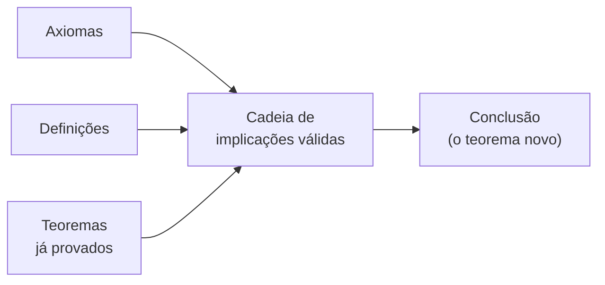
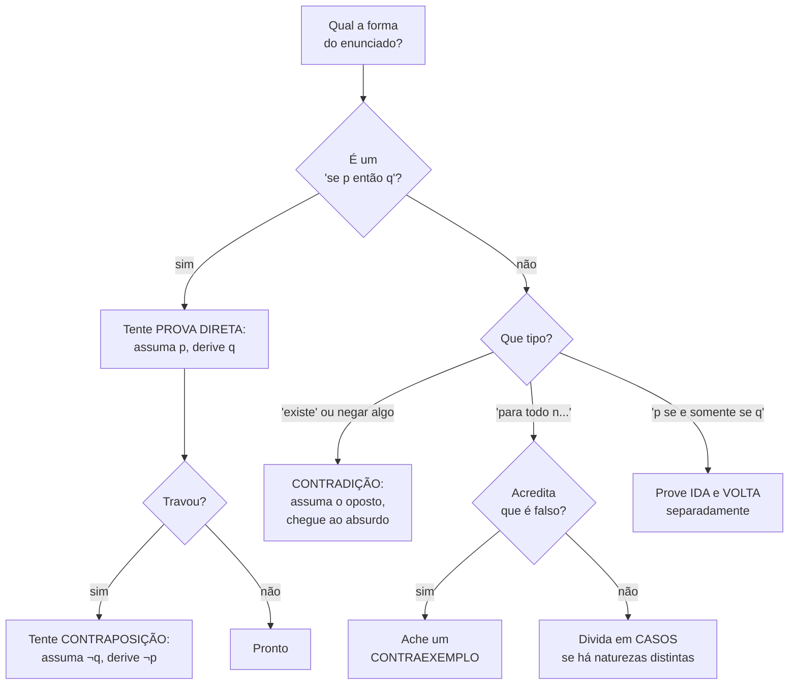
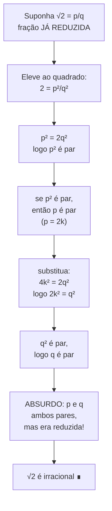
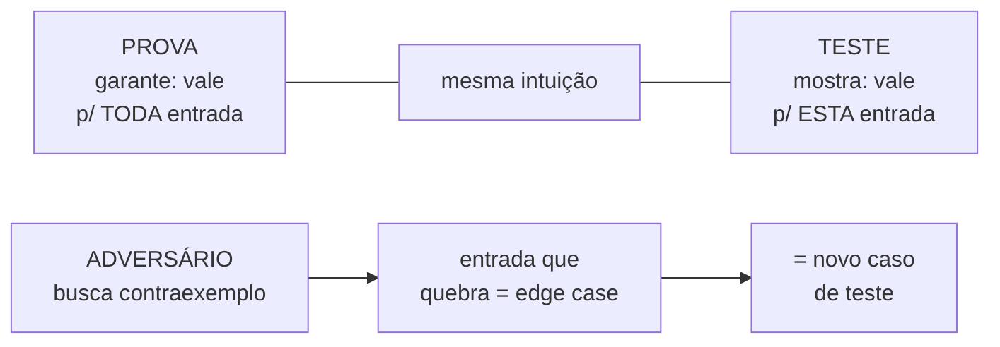

# Técnicas de prova

> [!abstract] TL;DR
> Uma prova é uma cadeia de implicações que vai de axiomas, definições e teoremas já provados até a conclusão. Cada elo precisa ser inquestionável. Você dispõe de um pequeno arsenal de táticas — prova direta, contraposição, contradição, casos, contraexemplo, ida-e-volta do "se e somente se" — e a perícia está em escolher a tática certa pra cada formato de enunciado. No fim, a mesma intuição que sustenta uma prova ("isso sempre funciona porque…") é a que você usa pra defender um algoritmo; e o adversário que procura um contraexemplo é o mesmo que escreve o caso de teste que quebra o seu código.

A matemática tem um luxo que a engenharia não tem: ela pode dizer *sempre*.

Quando você prova que a soma de dois inteiros pares é par, isso vale pra os pares que existem, os que vão existir e os que ninguém nunca vai escrever. Não é "testei dez casos e deu certo". É verdade fechada, para todo o universo de inteiros, de uma vez.

Como é que se chega nesse tipo de certeza? Com técnicas de prova.

---

## O que é uma prova, afinal

Uma **prova** é um argumento que estabelece a verdade de uma proposição a partir de coisas já aceitas como verdadeiras.

Quais coisas? Três tipos:

- **Axiomas** — verdades que assumimos sem provar (os tijolos do fundamento).
- **Definições** — o que cada termo significa, sem ambiguidade.
- **Teoremas já provados** — resultados que outra pessoa (ou você, antes) já trancou.

A partir desse alicerce, você encadeia **implicações lógicas**. Cada passo segue do anterior por uma regra de inferência válida (veja `[[02 - Lógica proposicional]]`). O último elo da cadeia é a conclusão.

Lead-in: o diagrama mostra o "fluxo de matéria-prima" de uma prova.

Leitura do diagrama: tudo que entra (axiomas, definições, teoremas anteriores) é matéria já confiável; a prova é a máquina no meio que transforma essa matéria em uma conclusão nova, igualmente confiável. Se um único elo da cadeia central for inválido, o produto final está contaminado — a conclusão não é mais garantida.

### Verdade matemática × evidência empírica

Aqui mora a diferença que todo dev precisa internalizar.

Na ciência empírica, você acumula evidência. Soltou a maçã mil vezes, ela caiu mil vezes — você confia que vai cair de novo. Mas é confiança, não certeza. A milésima-primeira poderia, em tese, flutuar.

Na matemática, não. Uma prova de que "todo par + par = par" não admite exceção. Não existe par rebelde escondido em algum canto de ℕ.

> [!quote] Dijkstra
> "Program testing can be used to show the presence of bugs, but never to show their absence."
>
> Testar mostra a presença de bugs, nunca a ausência. Dez mil testes verdes são dez mil pedaços de evidência — nunca uma prova.

Guarde essa frase. Ela é o eixo que liga este texto inteiro à sua rotina de código.

> [!note] Por que isso importa pra você
> Quando você diz "esse loop sempre termina" ou "esse cache nunca retorna valor velho", você está fazendo uma *afirmação universal* — um ∀ disfarçado. Provar de verdade é raro no dia a dia. Mas pensar como quem prova muda a qualidade do seu raciocínio: você passa a procurar o contraexemplo antes que o cliente encontre.

---

## O arsenal: qual técnica usar?

Antes de cada tática em detalhe, o mapa de decisão.

Lead-in: essa é a árvore de decisão que você roda mentalmente quando encara um enunciado.

Leitura do diagrama: comece sempre pela *forma* do enunciado, não pelo conteúdo. Implicação "se p então q"? Tente o caminho direto e, se emperrar, vire pra contraposição. Enunciado que afirma existência ou que você quer negar? Contradição costuma ser o atalho. Afirmação universal que você desconfia ser falsa? Pare de tentar provar e cace um contraexemplo. "Se e somente se" sempre se quebra em dois.

---

## Prova direta

A mais natural. Você quer provar `p → q`. Então **assume que p é verdadeiro** e, passo a passo, **deriva que q é verdadeiro**.

Não há truque. Só desenrolar definições e aplicar o que já se sabe.

> [!example] Teorema: a soma de dois inteiros pares é par
> **Enunciado.** Se `a` e `b` são pares, então `a + b` é par.
>
> **Prova.**
> 1. Assuma a hipótese: `a` e `b` são pares.
> 2. Pela *definição* de par, existe um inteiro `k` tal que `a = 2k`. E existe um inteiro `m` tal que `b = 2m`.
> 3. Some: `a + b = 2k + 2m`.
> 4. Fatore o 2: `a + b = 2(k + m)`.
> 5. Como `k + m` é um inteiro (soma de inteiros é inteiro), chamamos `j = k + m`. Então `a + b = 2j`.
> 6. Pela definição de par, `a + b` é par. ∎

Repare no motor da prova: **a definição de par fez todo o trabalho**. "Par" virou `2k`, e a partir daí foi álgebra. É quase sempre assim — destrave a definição e o caminho aparece.

> [!example] Teorema: divisibilidade é transitiva
> **Enunciado.** Se `a ∣ b` e `b ∣ c`, então `a ∣ c`.
>
> (Lembre: `a ∣ b` lê-se "a divide b", e significa que existe inteiro `k` com `b = a·k`.)
>
> **Prova.**
> 1. Assuma: `a ∣ b` e `b ∣ c`.
> 2. Por definição, existe inteiro `k` com `b = a·k`.
> 3. Por definição, existe inteiro `m` com `c = b·m`.
> 4. Substitua `b` da linha 2 na linha 3: `c = (a·k)·m`.
> 5. Reorganize: `c = a·(k·m)`.
> 6. Como `k·m` é inteiro, existe inteiro `n = k·m` com `c = a·n`.
> 7. Por definição, `a ∣ c`. ∎

Mesma receita: abra as definições, faça a álgebra encontrar-se, feche pela definição.

> [!tip] A regra de ouro da prova direta
> Quando travar, **escreva o que cada termo significa**. "n é par" não te ajuda; "n = 2k para algum inteiro k" te dá uma alavanca algébrica. Definições são as ferramentas; deixá-las fechadas é como tentar abrir um parafuso com a chave ainda no bolso.

---

## Prova por contraposição

Às vezes a prova direta emperra. Você assume `p` e simplesmente não consegue chegar em `q`.

A lógica oferece uma saída. A implicação `p → q` é **logicamente equivalente** à sua contrapositiva `¬q → ¬p` (essa equivalência está justificada em `[[02 - Lógica proposicional]]` via tabela-verdade). São a *mesma* afirmação vestida de outro jeito.

Então, em vez de provar `p → q`, você prova `¬q → ¬p`. Às vezes o caminho de trás é muito mais fácil.

> [!example] Teorema: se n² é par, então n é par
> **Enunciado.** Para todo inteiro `n`: se `n²` é par, então `n` é par.
>
> Tentar direto é desconfortável. "n² é par" não diz nada óbvio sobre `n`. Então vire pra contrapositiva.
>
> **Contrapositiva.** Se `n` *não* é par (ou seja, é ímpar), então `n²` *não* é par (é ímpar).
>
> **Prova.**
> 1. Assuma `n` ímpar. Por definição, `n = 2k + 1` para algum inteiro `k`.
> 2. Eleve ao quadrado: `n² = (2k + 1)² = 4k² + 4k + 1`.
> 3. Fatore o 2 dos dois primeiros termos: `n² = 2(2k² + 2k) + 1`.
> 4. Chame `j = 2k² + 2k` (inteiro). Então `n² = 2j + 1`.
> 5. Por definição, `n²` é ímpar.
> 6. Provamos `¬q → ¬p`. Logo `p → q` está provado. ∎

Veja como a contrapositiva é mais gentil: assumir que `n` é ímpar te dá uma fórmula concreta (`2k + 1`) pra elevar ao quadrado. A versão direta não te dava nada com que trabalhar.

> [!warning] Contraposição ≠ recíproca
> A contrapositiva de `p → q` é `¬q → ¬p` — **equivalente**. A recíproca é `q → p` — **NÃO equivalente**. Trocar uma pela outra é um erro clássico (a famosa falácia de afirmar o consequente, que veremos no fim). "Se chove, a rua molha" não implica "se a rua molha, choveu" (alguém pode ter lavado a calçada).

---

## Prova por contradição (redução ao absurdo)

A tática mais elegante e, talvez, a mais poderosa.

Você quer provar uma proposição `P`. Então **assume que `P` é falsa** — assume `¬P` — e mostra que isso leva a uma **contradição**: algo absurdo, impossível, que viola uma verdade conhecida.

Se assumir `¬P` quebra a realidade, então `¬P` não pode ser verdade. Logo `P` é verdade.

É a prova "não tem outro jeito": eliminamos a única alternativa.

### Exemplo clássico 1 — √2 é irracional

Esse é o exemplo que assombrou os pitagóricos. Eles acreditavam que todo número era uma razão de inteiros. √2 mostrou que não.

> [!danger] Teorema: √2 é irracional
> **Enunciado.** Não existem inteiros `p` e `q` (com `q ≠ 0`) tais que `√2 = p/q`.
>
> **Prova (por contradição).**
> 1. **Assuma o oposto**: suponha que `√2` *é* racional. Então `√2 = p/q`, com `p` e `q` inteiros e a fração **já reduzida** (sem fator comum — `p` e `q` não são ambos pares). Esse "já reduzida" é a faca que vamos usar.
> 2. Eleve ao quadrado: `2 = p²/q²`.
> 3. Multiplique cruzado: `p² = 2q²`.
> 4. Então `p²` é par (é 2 vezes algo). Pelo teorema da seção anterior, **`p` é par**. Escreva `p = 2k`.
> 5. Substitua: `(2k)² = 2q²` → `4k² = 2q²` → `2k² = q²`.
> 6. Então `q²` é par. Pelo mesmo teorema, **`q` é par**.
> 7. **Absurdo.** Concluímos que `p` é par E `q` é par. Mas no passo 1 dissemos que a fração estava reduzida — `p` e `q` não podiam ser ambos pares. Contradição.
> 8. Logo a suposição inicial é falsa: `√2` não é racional. `√2` é irracional. ∎

Lead-in: a prova de √2 é o tour mais bonito da redução ao absurdo — vale ver os passos como fluxo.

Leitura do diagrama: tudo começa na suposição perigosa do topo ("é racional, e em forma reduzida"). Cada caixa força a próxima inevitavelmente. Quando se chega a "p e q ambos pares", isso colide com "fração reduzida" lá em cima — a colisão é a contradição. A única peça que podemos ter errado é a suposição inicial; logo ela cai, e a conclusão (irracionalidade) sobe.

### Exemplo clássico 2 — infinitos primos (Euclides)

Mais de dois mil anos depois, ainda é a prova favorita de muita gente.

> [!danger] Teorema: existem infinitos números primos
> **Prova (por contradição).**
> 1. **Assuma o oposto**: suponha que existe um número *finito* de primos. Então podemos listar todos: `p₁, p₂, …, pₙ`. Essa é a lista completa, não falta nenhum.
> 2. Construa um número novo multiplicando todos e somando 1:
>    `N = (p₁ · p₂ · … · pₙ) + 1`.
> 3. `N` é maior que qualquer primo da lista, então `N` não está na lista — pela suposição, `N` não é primo.
> 4. Se `N` não é primo, ele tem algum divisor primo. Esse divisor está na lista (a lista é completa). Chame-o `pᵢ`.
> 5. Então `pᵢ ∣ N`. Mas `pᵢ` também divide o produto `p₁ · … · pₙ` (ele é um dos fatores).
> 6. Se `pᵢ` divide `N` e divide o produto, então `pᵢ` divide a *diferença*: `N − (p₁ · … · pₙ) = 1`.
> 7. **Absurdo.** Nenhum primo divide 1 (o menor primo é 2). Contradição.
> 8. Logo a lista finita não pode existir. Há infinitos primos. ∎

> [!note] O coração de toda prova por contradição
> Você nunca prova `P` diretamente. Você prova que **`¬P` é impossível**. Eliminada a única alternativa, `P` sobra como única possibilidade. É o raciocínio do detetive: "se não foi ninguém da casa, e a porta estava trancada por dentro… só pode ter sido você."

---

## Prova por casos (exaustão)

Quando o universo se parte em situações de natureza diferente, você prova **cada caso separadamente**. Se cobriu todos os casos possíveis, cobriu tudo.

A chave é a exaustividade: os casos juntos têm que esgotar todas as possibilidades, sem buraco.

> [!example] Teorema: n² + n é par para todo inteiro n
> **Prova (por casos).** Todo inteiro `n` é par ou ímpar — dois casos, exaustivos.
>
> **Caso 1: `n` é par.** `n = 2k`. Então `n² + n = n(n + 1) = 2k(2k + 1)`, que é 2 vezes algo — par.
>
> **Caso 2: `n` é ímpar.** `n = 2k + 1`. Então `n + 1 = 2k + 2 = 2(k + 1)`, par. Logo `n(n + 1)` tem um fator par — par.
>
> Em ambos os casos, `n² + n` é par. Como não há terceiro caso, está provado. ∎

> [!tip] Casos é o `switch` da matemática
> Pensar em casos é familiar pra quem programa: é o `switch`/`match` exaustivo. E a mesma armadilha mora nos dois lugares — esquecer um caso. No código, vira o `default` ausente; na prova, vira o buraco que invalida tudo. Sempre pergunte: "esses casos cobrem 100%?"

---

## Refutação por contraexemplo

As táticas anteriores *provam* que algo é verdade. Esta faz o oposto: **derruba** uma afirmação.

Para refutar uma afirmação universal — um `∀`, "para todo x, vale P(x)" — basta **um único caso** onde P(x) falha. Esse caso é o contraexemplo.

A conexão lógica é direta (e está em `[[03 - Lógica de predicados e quantificadores]]`): a negação de `∀x P(x)` é `∃x ¬P(x)`. Negar um "para todo" é exibir um "existe um que não". Você não precisa de mil exceções. Uma basta pra explodir o universal.

> [!example] "Todo número da forma n² + n + 41 é primo" — FALSO
> A fórmula `n² + n + 41` (de Euler) é traiçoeira. Ela cospe primos pra muitos valores:
>
> | n | n² + n + 41 | primo? |
> |---|-------------|--------|
> | 0 | 41 | sim |
> | 1 | 43 | sim |
> | 2 | 47 | sim |
> | 3 | 53 | sim |
> | … | … | … (continua primo até n = 39) |
> | 39 | 1601 | sim |
> | **40** | **1681 = 41 × 41** | **NÃO** |
>
> Em `n = 40`: `40² + 40 + 41 = 1681 = 41²`. Composto. **Um único contraexemplo derruba a afirmação universal inteira.**

Lead-in: a tabela mostra por que contraexemplos são perigosamente difíceis de achar por força bruta.

Leitura da tabela: quarenta valores consecutivos confirmam a fórmula. Se você "testasse" `n` de 0 a 39, todos verdes — confiança total, e errada. Só no quadragésimo valor a fachada cai. É exatamente o bug que passa em todo o seu CI e estoura em produção: a evidência empírica nunca chega ao caso que importa.

> [!warning] Conjectura não é teorema
> Verificar uma afirmação em muitos casos é *evidência*, não *prova*. A conjectura de Collatz foi verificada em quintilhões de números — ainda não é teorema, porque ninguém provou que vale pra **todos**. E a história da matemática tem afirmações que pareciam verdadeiras por enormes intervalos e desabaram num contraexemplo gigantesco. Muitos verdes não fecham um ∀.

---

## "Se e somente se" (↔): provar nas duas direções

Um enunciado `p ↔ q` ("p se e somente se q") é, na verdade, **duas** afirmações empacotadas:

- a **ida**: `p → q`
- a **volta**: `q → p`

Pela lógica, `p ↔ q ≡ (p → q) ∧ (q → p)` (veja `[[02 - Lógica proposicional]]`). Para provar a bicondicional, você prova **as duas direções, separadamente** — cada uma pode usar uma técnica diferente.

> [!example] Teorema: n é par ↔ n² é par
> **Ida (`n par → n² par`).** Se `n = 2k`, então `n² = 4k² = 2(2k²)`, par. ✓
>
> **Volta (`n² par → n par`).** Essa é a que já provamos por contraposição lá em cima (se `n` é ímpar, `n²` é ímpar). ✓
>
> As duas direções fechadas → a bicondicional está provada. `n` é par se e somente se `n²` é par. ∎

> [!danger] O erro de provar só metade
> Provar só a ida e cantar vitória na bicondicional é um furo silencioso. "Se e somente se" exige as duas pernas. Faltando uma, a equivalência não está demonstrada — você provou um teorema mais fraco do que anunciou.

---

## E a indução?

A **indução matemática** é a tática central pra provar afirmações sobre *todos* os naturais ("para todo n ≥ 0, vale P(n)"). É poderosa o bastante — e cheia de detalhe próprio — pra merecer notas inteiras.

> [!info] Onde estudar indução
> - `[[06 - Indução matemática]]` — o princípio, o caso base, o passo indutivo, indução forte.
> - `[[07 - Indução estrutural e definições recursivas]]` — a mesma ideia aplicada a estruturas recursivas (árvores, listas, gramáticas), o pão-com-manteiga de quem escreve compiladores e parsers.

Aqui só registramos: ela é a técnica que prova o "para todo n" sem precisar testar infinitos casos — você prova o primeiro e prova que cada um leva ao seguinte, como dominós.

---

## Erros e falácias comuns

Saber provar é metade. A outra metade é farejar prova *falsa*.

> [!failure] Afirmar o consequente
> De `p → q` e do fato de `q` ser verdade, concluir `p`. Inválido.
> "Se chove, a rua molha. A rua está molhada. Logo choveu." — não: lavaram a calçada. Confundir uma implicação com sua recíproca é a raiz dessa falácia.

> [!failure] Generalizar de exemplos
> "Funcionou pra n = 1, 2, 3… logo vale sempre." É exatamente o erro de `n² + n + 41`. Exemplos *sugerem*, não *provam*. Só servem como prova quando há um princípio (indução) por trás.

> [!failure] Circularidade (petição de princípio)
> Usar a própria conclusão como passo da prova. "X é verdade porque Y, e Y porque X." A cadeia morde o próprio rabo e não se ancora em nada já estabelecido.

> [!failure] Prova por intimidação / handwaving
> "É óbvio que…", "claramente segue que…", "deixo como exercício trivial…" — quando esconde justamente o passo difícil. Se é mesmo óbvio, é barato escrever. Quando alguém *insiste* que é óbvio, desconfie: o buraco costuma estar exatamente ali.

---

## O ângulo dev: prova, teste e o adversário

Agora a parte que liga tudo isso ao seu trabalho.

### A prova informal que você já faz

Toda vez que você defende uma decisão — "esse `if` cobre todos os casos porque o input só pode ser A, B ou C" — você está fazendo uma **prova por casos informal**. Quando diz "esse loop termina porque o contador só cresce e tem um teto", é um argumento de **terminação**, prima da indução. Você prova o tempo todo; só não chama assim.

### Testes não provam ausência de bug

Volte à frase de Dijkstra. Um teste exercita **um** caminho com **uns** valores. Mil testes verdes = mil pontos de evidência. Nunca uma garantia universal. O caso que quebra pode ser justamente o que ninguém escreveu (o `n = 40` da fórmula de Euler é o bug que sobrevive ao CI inteiro). Por isso testes e provas são ferramentas *diferentes*, com forças diferentes — veja `[[03-Dominios/Engenharia/Testes/index|Testes]]` pra a face de engenharia dessa moeda.

### O adversário e o contraexemplo

Existe um exercício mental poderoso: em vez de tentar mostrar que seu código funciona, vire o adversário e **tente provar que NÃO funciona**.

Achar essa quebra é, literalmente, encontrar um **contraexemplo** da afirmação "meu código está correto para toda entrada". E um contraexemplo da correção é exatamente… um **caso de teste que falha** — o edge case. Lista vazia. String com emoji. Inteiro no overflow. Data em 29 de fevereiro. O fuso UTC−12.

Pensar "qual entrada faz isso explodir?" é o mesmo músculo de "qual valor faz esse ∀ falhar?". Refutar por contraexemplo e escrever um teste destrutivo são a mesma atividade em roupas diferentes.

### Invariantes e asserções: mini-teoremas

Quando você escreve `assert saldo >= 0` ou documenta "invariante: a lista permanece ordenada após cada inserção", está cravando um **mini-teorema** sobre o estado do programa. A asserção é a *afirmação*; sua confiança de que ela se mantém é a *prova informal*; e o crash em runtime é o *contraexemplo* aparecendo pra te dizer que a prova estava errada.

Lead-in: o último diagrama costura prova, teste e o papel do adversário.

Leitura do diagrama: na linha de cima, prova e teste compartilham a mesma intuição, mas o alcance é radicalmente diferente — uma cobre *toda* entrada, a outra cobre *esta*. Na linha de baixo, o adversário que procura um contraexemplo produz uma entrada que quebra, e essa entrada vira um caso de teste. É o ciclo virtuoso: pensar como quem refuta gera os testes mais valiosos que você vai escrever.

### Prova vs teste vs tipo

| Mecanismo | O que garante | Alcance | Custo | Pega |
|-----------|---------------|---------|-------|------|
| **Prova matemática** | Verdade para toda entrada | Universal (∀) | Alto (manual, raro no dia a dia) | Erros de raciocínio na lógica do algoritmo |
| **Sistema de tipos** | Ausência de classes inteiras de erro (tipo errado) | Universal, mas restrito ao que o tipo expressa | Médio (compilador faz) | Passar string onde se espera int, null não tratado |
| **Teste automatizado** | Comportamento correto nos casos escritos | Pontual (∃, os casos que você cobriu) | Baixo-médio | Regressões, casos conhecidos, edge cases lembrados |

Lead-in: a tabela posiciona as três defesas que você tem contra bugs.

Leitura da tabela: prova é a única coluna com alcance verdadeiramente universal — e a mais cara, por isso reservada a algoritmos críticos. Tipos são "provas baratas e parciais": o compilador prova *automaticamente* que você não somou um booleano com uma data, mas não prova que sua lógica de negócio está certa. Testes são pontuais por natureza — pegam o que você lembrou de exercitar. A defesa madura usa as três em camadas: tipos barram o grosso de graça, testes cobrem o comportamento, e a intuição de prova guia onde colocar os dois.

---

> [!summary] Resumo em uma linha
> Provar é encadear implicações de verdades aceitas até a conclusão; o arsenal (direta, contraposição, contradição, casos, contraexemplo, ida-e-volta) se escolhe pela *forma* do enunciado, e a mesma mentalidade — sobretudo o adversário que cata o contraexemplo — é o que separa o dev que testa do dev que entende por que o código está (ou não) correto.

---

## Em entrevista

Técnicas de prova aparecem em entrevistas de duas formas: explicitamente, num problema de matemática discreta ("prove que…"), e implicitamente, quando o entrevistador pergunta "por que esse algoritmo está correto?" ou "esse loop sempre termina?". Saber nomear a técnica que você está usando — "vou provar por contradição", "aqui um contraexemplo basta" — sinaliza rigor. E quando pedirem pra você *quebrar* uma solução, lembre: você está caçando um contraexemplo, que é o mesmo que um edge case.

*A proof is a chain of valid implications from axioms and definitions to the conclusion.*
*In a direct proof, you assume the hypothesis and derive the conclusion step by step.*
*Proof by contraposition works because `p → q` is logically equivalent to `¬q → ¬p`.*
*In a proof by contradiction, you assume the opposite and derive an absurdity.*
*A single counterexample is enough to refute a universal claim.*
*To prove an "if and only if", you must prove both directions separately.*
*Testing shows the presence of bugs, never their absence.*
*Looking for a counterexample is the same skill as finding the edge case that breaks the code.*
*An assertion or invariant is a small theorem about the program's state.*

| Português | English |
|-----------|---------|
| prova | proof |
| teorema | theorem |
| axioma | axiom |
| definição | definition |
| hipótese | hypothesis / assumption |
| conclusão | conclusion |
| prova direta | direct proof |
| contraposição | proof by contraposition |
| contrapositiva | contrapositive |
| contradição / absurdo | proof by contradiction |
| prova por casos | proof by cases / case analysis |
| exaustão | exhaustive proof |
| contraexemplo | counterexample |
| afirmação universal | universal statement |
| se e somente se | if and only if (iff) |
| recíproca | converse |
| afirmar o consequente | affirming the consequent |
| invariante | invariant |
| asserção | assertion |
| caso de borda | edge case |

> [!info] Lastro
> - Rosen, K. H. *Discrete Mathematics and Its Applications* — seções 1.7 (Introduction to Proofs) e 1.8 (Proof Methods and Strategy): prova direta, contraposição, contradição, casos. [Resumo da obra](https://www.bookey.app/book/discrete-mathematics-and-its-applications)
> - Lehman, Leighton & Meyer. *Mathematics for Computer Science* (MIT 6.042) — Cap. 1 (Propositions) e Cap. 2 (Patterns of Proof); texto gratuito sob licença CC BY-SA. [PDF oficial MIT CSAIL](https://people.csail.mit.edu/meyer/mcs.pdf) · [MIT OpenCourseWare 6.042J](https://ocw.mit.edu/courses/6-042j-mathematics-for-computer-science-fall-2010/pages/readings)
> - Velleman, D. J. *How to Prove It: A Structured Approach* — manual canônico de estrutura de provas, da lógica proposicional à quantificada.
> - E. W. Dijkstra, *Notes on Structured Programming* (1970) — origem de "testing shows the presence, not the absence of bugs".
