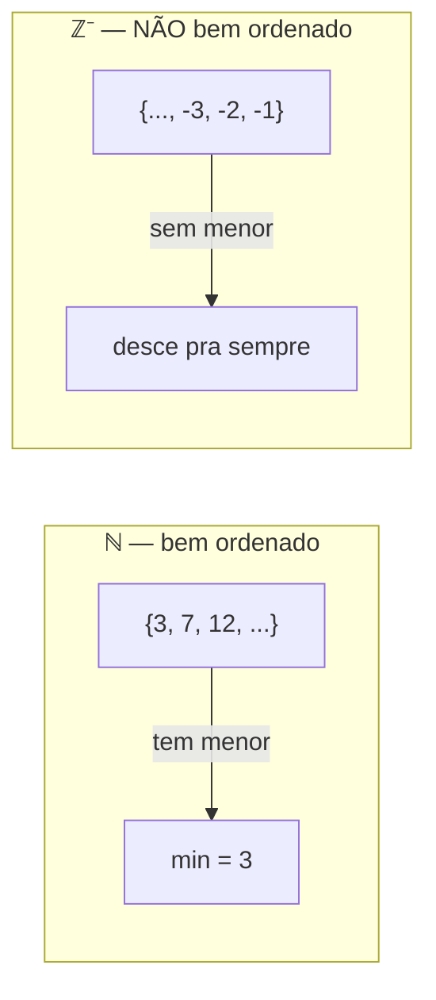
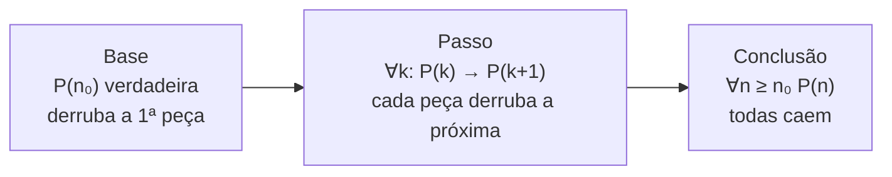
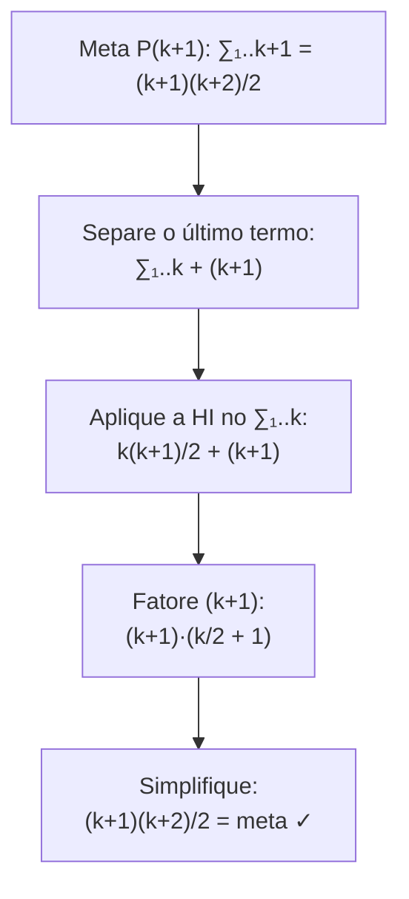
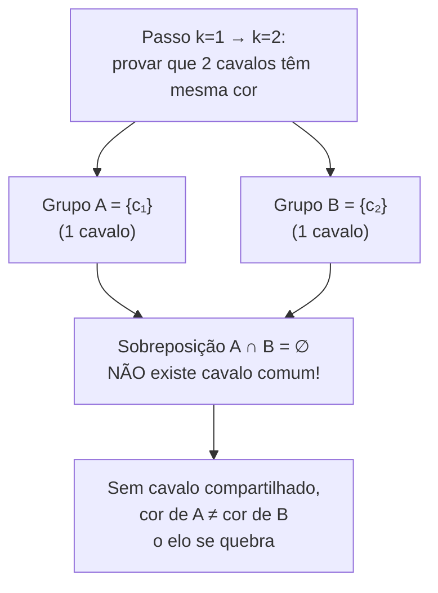
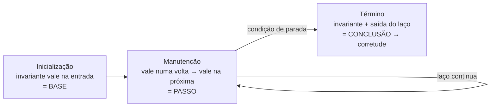

# Indução matemática

> [!abstract] TL;DR
> Indução prova afirmações sobre **todos** os naturais a partir de ℕ ser **bem ordenado**: todo subconjunto não-vazio tem menor elemento. Você prova um **caso base** P(n₀) e um **passo** ∀k (P(k) → P(k+1)); o efeito dominó faz o resto. A versão **forte** assume P(n₀..k) inteiro pra provar P(k+1), e é o que você precisa quando o passo depende de mais de um caso anterior (Fibonacci, fatoração em primos). E o pulo do gato pra dev: **corretude de algoritmo recursivo** é indução no tamanho da entrada, e **loop invariant** é indução disfarçada — inicialização é a base, manutenção é o passo, término é a conclusão. Mesma máquina, três nomes.

## A pergunta que a indução responde

Você quer provar uma frase do tipo "para **todo** n, vale P(n)".

Mas "todo n" são infinitos casos. Você não pode testar P(0), P(1), P(2), ... até o fim — não há fim.

A indução é a saída engenhosa: você prova **dois** fatos finitos e deles deduz os infinitos. É uma das técnicas do arsenal de [[05 - Técnicas de prova]], mas merece nota própria porque sua estrutura reaparece em todo canto da computação.

> [!question] Como dois fatos cobrem infinitos casos?
> Porque ℕ tem uma estrutura especial: todo número (exceto o primeiro) tem um antecessor, e a cadeia de antecessores **sempre termina** no começo. Você não consegue descer pra sempre. Essa propriedade tem nome.

## Princípio da boa ordenação — o alicerce

> [!info] Boa ordenação
> Todo subconjunto **não-vazio** de ℕ tem um **menor elemento**.

Parece óbvio? É. Mas é exatamente o axioma de onde a indução brota.

Repare nas duas palavras que fazem o serviço:

- **Não-vazio**: o conjunto vazio não tem menor elemento, e tudo bem — a propriedade não fala dele.
- **ℕ** (os não-negativos): em ℤ ela falha. O conjunto dos inteiros negativos não tem menor elemento (desce −1, −2, −3... pra sempre). Em ℚ⁺ também falha: qual o menor racional positivo? Não existe — entre 0 e qualquer ε ainda cabe ε/2.

A boa ordenação é o que impede uma "descida infinita". E é justamente isso que faz a indução funcionar, como veremos: se P(n) falhasse pra algum n, o **menor** contraexemplo nos daria uma contradição.



**Leitura do diagrama**: à esquerda, qualquer recorte não-vazio de ℕ aterrissa num menor elemento — há um "chão". À direita, os negativos não têm chão; a descida nunca para. Sem chão, não há base de indução possível. É por isso que indução é uma ferramenta de ℕ (e de qualquer conjunto bem ordenado), não dos inteiros ou racionais soltos.

## Indução fraca — o dominó

A forma mais usada. O esquema:

> [!note] Princípio da indução (fraca)
> Seja P(n) uma propriedade. Se
> 1. **Base**: P(n₀) é verdadeira, e
> 2. **Passo**: ∀k ≥ n₀, P(k) → P(k+1),
>
> então ∀n ≥ n₀, P(n).

Duas analogias gravam isso pra sempre.

**O dominó.** Imagine infinitas peças de dominó enfileiradas. Você quer que **todas** caiam.

- Derrubar a primeira peça = provar a **base** P(n₀).
- Garantir que cada peça, ao cair, derruba a próxima = provar o **passo** P(k) → P(k+1).

Se você tem as duas coisas, todas caem. Não importa quão longe vá a fila.

**A escada infinita.** Você quer alcançar **todo** degrau.

- Conseguir subir no primeiro degrau = base.
- Saber que, estando num degrau qualquer, você consegue subir pro seguinte = passo.

Com as duas, você chega a qualquer altura.



**Leitura do diagrama**: as duas caixas da esquerda são o que **você** prova com suor (base + passo). A caixa da direita é o **brinde** que o princípio te dá de graça. Se faltar a base, nenhuma peça cai (a fila nunca começa). Se faltar o passo, a primeira cai e morre ali.

### A hipótese de indução (HI)

No passo, ao provar P(k) → P(k+1), você **assume** P(k) verdadeira. Esse "assumir" é a **hipótese de indução**.

> [!warning] Não é circular
> "Mas você está assumindo o que quer provar!" Não. Você assume P(**k**) (um caso) pra provar P(**k+1**) (o próximo). Nunca assume P(n) em geral. É uma alavanca: pega o caso anterior de graça e empurra um passo adiante. A base ancora a alavanca na realidade.

## Exemplo trabalhado 1 — a soma de Gauss

Vamos provar, com todo o algebrismo, que para todo n ≥ 1:

$$\sum_{i=1}^{n} i = \frac{n(n+1)}{2}$$

Seja P(n) essa igualdade.

**Base** (n = 1). Lado esquerdo: ∑ vai só de i=1 a 1, dá 1. Lado direito: 1·(1+1)/2 = 2/2 = 1. Iguais. P(1) ✓.

**Passo.** Assumimos P(k) (a **HI**):

$$\sum_{i=1}^{k} i = \frac{k(k+1)}{2}$$

Queremos P(k+1): que ∑_{i=1}^{k+1} i = (k+1)(k+2)/2.

Partimos do lado esquerdo de P(k+1) e separamos o último termo:

$$\sum_{i=1}^{k+1} i = \left(\sum_{i=1}^{k} i\right) + (k+1)$$

Agora aplicamos a HI no parêntese — esse é **o** momento em que a hipótese entra:

$$= \frac{k(k+1)}{2} + (k+1)$$

Fatoramos (k+1) e colocamos sobre o mesmo denominador:

$$= (k+1)\left(\frac{k}{2} + 1\right) = (k+1)\cdot\frac{k+2}{2} = \frac{(k+1)(k+2)}{2}$$

Que é exatamente o lado direito de P(k+1). Passo provado. ∎



**Leitura do diagrama**: todo passo de indução algébrico tem este formato — comece pela meta P(k+1), **destaque o pedaço que é P(k)**, substitua pela HI, e empurre a álgebra até bater com o lado direito. O nó central ("aplique a HI") é onde a mágica acontece; sem ele você só estaria manipulando símbolos sem usar a hipótese.

## Exemplo trabalhado 2 — soma das potências de 2

Para todo n ≥ 0:

$$\sum_{i=0}^{n} 2^{i} = 2^{n+1} - 1$$

(É o porquê de um inteiro sem sinal de n+1 bits ir até 2^{n+1} − 1.)

**Base** (n = 0). Esquerda: 2⁰ = 1. Direita: 2¹ − 1 = 1. ✓.

**Passo.** HI: ∑_{i=0}^{k} 2ⁱ = 2^{k+1} − 1. Queremos ∑_{i=0}^{k+1} 2ⁱ = 2^{k+2} − 1.

$$\sum_{i=0}^{k+1} 2^{i} = \left(\sum_{i=0}^{k} 2^{i}\right) + 2^{k+1} = (2^{k+1} - 1) + 2^{k+1}$$

Juntamos os dois 2^{k+1}:

$$= 2\cdot 2^{k+1} - 1 = 2^{k+2} - 1$$

Exatamente a meta. ∎

> [!tip] O ritual é sempre o mesmo
> Separe o último termo → injete a HI → simplifique até a meta. Decore o **ritual**, não cada conta.

## Exemplo trabalhado 3 — divisibilidade: n³ − n é divisível por 6

Aqui a tese não é uma soma, mas uma propriedade aritmética. P(n): 6 ∣ (n³ − n) para todo n ≥ 0.

**Base** (n = 0). 0³ − 0 = 0, e 6 ∣ 0. ✓.

**Passo.** HI: 6 ∣ (k³ − k), ou seja, existe um inteiro m com k³ − k = 6m.

Queremos: 6 ∣ ((k+1)³ − (k+1)). Expandimos:

$$(k+1)^3 - (k+1) = k^3 + 3k^2 + 3k + 1 - k - 1 = k^3 + 3k^2 + 2k$$

Agora o truque: fazer aparecer o k³ − k da HI. Some e subtraia k:

$$= (k^3 - k) + 3k^2 + 3k = (k^3 - k) + 3k(k+1)$$

O primeiro pedaço é 6m pela HI. Falta mostrar que 6 ∣ 3k(k+1):

> [!note] Lema dois-em-um
> k(k+1) é o produto de **dois inteiros consecutivos** → um deles é par → k(k+1) é par → 3k(k+1) é múltiplo de 3·2 = 6.

Logo (k+1)³ − (k+1) = 6m + (múltiplo de 6) = múltiplo de 6. ∎

> [!example] Por que a HI sozinha não bastou
> Diferente dos exemplos de soma, aqui você teve que **provar um fato lateral** (que 3k(k+1) é divisível por 6) que não vinha da HI. Isso é normal: o passo de indução pode exigir lemas auxiliares. A HI te dá um pedaço; você arma o resto.

## Exemplo trabalhado 4 — uma desigualdade: 2ⁿ ≥ n+1

Indução não serve só pra igualdades. Desigualdades são pão-de-cada-dia em análise de algoritmos (provar que uma função domina outra). Tese: 2ⁿ ≥ n+1 para todo n ≥ 0.

**Base** (n = 0). 2⁰ = 1 ≥ 0+1 = 1. Vale com igualdade. ✓.

**Passo.** HI: 2^k ≥ k+1. Queremos 2^{k+1} ≥ k+2.

Começamos pelo lado esquerdo e usamos a definição de potência:

$$2^{k+1} = 2 \cdot 2^{k}$$

Aplicamos a HI (2^k ≥ k+1) — e aqui há uma sutileza: como multiplicamos por 2 > 0, a desigualdade **se preserva**:

$$2 \cdot 2^{k} \geq 2(k+1) = 2k + 2$$

Falta conectar 2k+2 com a meta k+2. Como k ≥ 0, temos 2k + 2 ≥ k + 2 (sobra um k ≥ 0). Encadeando:

$$2^{k+1} \geq 2k + 2 \geq k + 2$$

Logo 2^{k+1} ≥ k+2. ∎

> [!tip] Desigualdade exige "afrouxar com cuidado"
> Em provas de ≤ e ≥, o passo não fecha numa igualdade limpa — você **majora** ou **minora** até bater na meta. O risco é afrouxar **na direção errada** (deixar o lado maior virar menor). Mantenha sempre o olho em qual lado você precisa empurrar. Aqui descemos de 2k+2 pra k+2, o que é legal porque queremos provar um "≥".

## Indução forte — quando um passo atrás não chega

Às vezes P(k+1) não depende só de P(k), mas de **vários** casos anteriores. A indução fraca não te dá isso. A **forte** dá.

> [!note] Princípio da indução forte
> Se
> 1. **Base**: P(n₀) (às vezes vários casos iniciais), e
> 2. **Passo**: ∀k ≥ n₀, [ P(n₀) ∧ P(n₀+1) ∧ ... ∧ P(k) ] → P(k+1),
>
> então ∀n ≥ n₀, P(n).

A diferença está na HI: na forte, você assume **todos** os casos de n₀ até k, não só o último.

### Por que ela é necessária — fatoração em primos

> [!example] Todo inteiro n > 1 é produto de primos
> P(n): n é primo ou produto de primos. Provar por **forte**.
>
> **Base** (n = 2). 2 é primo. ✓.
>
> **Passo.** HI forte: todo j com 2 ≤ j ≤ k é produto de primos. Provar pra k+1.
> - Se k+1 é primo, acabou.
> - Senão, k+1 = a·b com 1 < a, b < k+1. Aqui está o ponto: a e b são **menores** que k+1, mas você não sabe se são k. Você precisa que P(a) e P(b) já valham — e a HI **forte** garante isso, porque cobre todo j ≤ k. A HI fraca (só P(k)) seria inútil: a poderia ser 2 e b poderia ser 7, nenhum deles igual a k.
>
> Pela HI, a e b são produtos de primos; concatene as fatorações e k+1 também é. ∎

Fibonacci é o outro caso clássico: F(n) = F(n−1) + F(n−2) depende dos **dois** anteriores, então provar qualquer coisa sobre F frequentemente pede HI forte (e duas bases).

> [!tip] Indução forte e estruturas recursivas são primas
> Quando o objeto a provar não é um número mas uma **estrutura** definida recursivamente (uma árvore, uma fórmula, uma lista), a HI forte vira **indução estrutural**: você assume a propriedade pra todas as **subestruturas** e prova pra a estrutura inteira. Esse é o assunto de [[07 - Indução estrutural e definições recursivas]] — a generalização natural do que está aqui.

### Equivalência: as três são a mesma coisa

> [!info] Boa ordenação ↔ indução fraca ↔ indução forte
> Os três princípios são **logicamente equivalentes** sobre ℕ — cada um prova os outros. Boa ordenação é o axioma de base; as duas induções são "modos de uso" dele.

O elo intuitivo com a boa ordenação: suponha que P falhe pra algum n. Então o conjunto S = {n : P(n) é falsa} é não-vazio. Pela **boa ordenação**, S tem um **menor** elemento m. Mas m não pode ser n₀ (a base garante P(n₀)). Então m−1 existe e P(m−1) é verdadeira (m era o menor falso). O **passo** aplicado a m−1 força P(m) verdadeira — contradição com m ∈ S. Logo S é vazio: P vale sempre. **A indução é a boa ordenação contada ao contrário.**

| Aspecto | Indução fraca | Indução forte |
|---|---|---|
| HI assume | só P(k) | P(n₀) ∧ ... ∧ P(k) |
| Bases típicas | 1 | 1 ou mais |
| Quando usar | passo depende do caso **imediatamente** anterior | passo depende de **vários** anteriores ou de um anterior **não determinado** |
| Exemplos | ∑ de Gauss, potências de 2, n³−n | Fibonacci, fatoração em primos, recorrências de divisão e conquista |
| Poder | igual à forte | igual à fraca |

**Leitura da tabela**: a última linha é o segredo que confunde iniciantes — as duas têm **exatamente** o mesmo poder de prova. A forte nunca prova algo que a fraca não possa. Você escolhe a forte por **conveniência**: quando o passo precisa de mais de um caso anterior, escrever com HI forte é mais limpo. Nunca é "mais forte" no sentido de provar mais teoremas.

## Erros comuns

### Esquecer a base

O erro mais bobo e mais fatal. Sem base, o passo prova nada.

> [!danger] "Demonstração" de que ∀n, 1 + 2 + ... + n = (n+1)²/4... mais 1/8?
> Você pode provar passos inválidos que se "auto-sustentam" se nunca os ancorar. Considere P(n): "n = n+1". O passo é fácil: se k = k+1, some 1 dos dois lados → k+1 = k+2, logo P(k) → P(k+1). O passo é **válido**. Mas P(0) é falsa (0 ≠ 1), a base não existe, e a conclusão (todo n = n+1) é absurda. Sem base, o dominó nunca tomba.

### O paradoxo do cavalo

O exemplo mais famoso de passo furado. "Teorema": **todos os cavalos têm a mesma cor**.

P(n): em qualquer conjunto de n cavalos, todos têm a mesma cor.

**Base** (n = 1). Um cavalo tem a mesma cor que ele mesmo. ✓ (verdadeiro!).

**Passo (falso).** HI: qualquer grupo de k cavalos é monocromático. Pegue k+1 cavalos: {c₁, c₂, ..., c_{k+1}}.

- O grupo A = {c₁, ..., c_k} tem k cavalos → todos a mesma cor (HI).
- O grupo B = {c₂, ..., c_{k+1}} tem k cavalos → todos a mesma cor (HI).
- Como A e B se **sobrepõem** (compartilham c₂..c_k), a cor de A = cor de B, então todos os k+1 têm a mesma cor. ∎(?)

Onde está o buraco?



**Leitura do diagrama**: o passo k → k+1 só funciona se A e B **compartilham** pelo menos um cavalo — é o cavalo comum que iguala as cores. Para k+1 = 2 (ou seja, k = 1), A = {c₁} e B = {c₂} são conjuntos de um cavalo cada, e a interseção é **vazia**. Sem cavalo compartilhado, nada força c₁ e c₂ a terem a mesma cor. O passo P(1) → P(2) é **falso**, e como toda a cadeia passa por ele, ela inteira desmorona.

> [!warning] A moral
> Um passo de indução tem que valer pra **todo** k ≥ n₀, **inclusive o menor**. O paradoxo do cavalo mostra um passo que vale pra k ≥ 2 mas falha em k = 1. Sempre teste seu passo no caso mais baixo — é onde os argumentos por "sobreposição" costumam furar.

## O ângulo dev — corretude e loop invariants

Aqui é onde indução deixa de ser matemática de quadro-negro e vira sua ferramenta diária.

### Corretude de algoritmo recursivo = indução no tamanho

Um algoritmo recursivo se prova correto por indução no **tamanho da entrada** (ou na profundidade da recursão). A estrutura é literal:

- **Base** = o caso-base da recursão (lista vazia, n = 0, etc.).
- **Passo** = assumindo que as chamadas recursivas em entradas **menores** estão corretas (a HI!), mostrar que a combinação produz a resposta certa.

> [!example] Soma recursiva
> ```
> soma(A, n):           # soma A[0..n-1]
>     se n == 0: return 0          # caso base
>     return soma(A, n-1) + A[n-1] # passo
> ```
> **Afirmação** P(n): `soma(A, n)` retorna ∑_{i=0}^{n-1} A[i].
>
> **Base** (n = 0). Retorna 0 = soma vazia. ✓.
>
> **Passo.** HI: `soma(A, k)` retorna ∑_{i=0}^{k-1} A[i] (a chamada **menor** está correta). Então `soma(A, k+1)` retorna `soma(A, k)` + A[k] = ∑_{i=0}^{k-1} A[i] + A[k] = ∑_{i=0}^{k} A[i]. ✓.
>
> Repare: é **a mesma álgebra** do exemplo 1 (separar o último termo, aplicar HI). A recursão e a prova têm o mesmo formato porque a recursão **é** a indução executando.

### Loop invariant = indução disfarçada

Um laço não é recursivo, mas você prova sua corretude com **a mesma máquina**. A ponte é o **invariante**: uma propriedade que vale a cada volta do laço. CLRS organiza isso em três obrigações que são, ponto a ponto, a indução:

| Loop invariant (CLRS) | Indução |
|---|---|
| **Inicialização**: o invariante vale antes da 1ª iteração | **Base** |
| **Manutenção**: se vale antes de uma iteração, vale antes da próxima | **Passo** P(k) → P(k+1) |
| **Término**: quando o laço para, o invariante dá a corretude | **Conclusão** ∀n |



**Leitura do diagrama**: a auto-aresta em "Manutenção" é o dominó tombando volta após volta. Você prova inicialização e manutenção (trabalho finito); o laço "executa" os infinitos passos por você; término colhe o resultado. É indução com outro figurino.

> [!example] Invariante de soma de prefixo
> ```
> total = 0
> para i de 0 até n-1:
>     total = total + A[i]
> ```
> **Invariante** I: ao **começar** a iteração com índice i, `total` = ∑_{j=0}^{i-1} A[j] (soma do prefixo já processado).
>
> - **Inicialização** (i = 0): `total` = 0 = soma vazia do prefixo [0..−1]. ✓ (base).
> - **Manutenção**: suponha I no início da iteração i (`total` = ∑_{j<i} A[j]). O corpo faz `total += A[i]`, então no início de i+1 temos `total` = ∑_{j<i} A[j] + A[i] = ∑_{j<i+1} A[j]. I vale pra i+1. ✓ (passo).
> - **Término**: o laço para com i = n. Pelo invariante, `total` = ∑_{j=0}^{n-1} A[j] — a soma completa. ✓ (conclusão).

> [!tip] O invariante é um ∀ sobre o prefixo
> "Para todo j no prefixo já visto, A[j] já foi somado." Isso é um quantificador universal sobre uma fatia crescente do array — exatamente a linguagem de [[03 - Lógica de predicados e quantificadores]]. Achar o invariante certo de um laço é **descobrir qual ∀ você está mantendo verdadeiro a cada volta**.

### Invariante de busca binária

A soma de prefixo cresce a fatia; a busca binária faz o oposto — **encolhe** uma janela até zerar. Mesmo assim, o esqueleto indutivo é idêntico.

> [!example] Busca binária num array ordenado
> ```
> lo, hi = 0, n-1
> enquanto lo <= hi:
>     mid = (lo + hi) // 2
>     se A[mid] == alvo: return mid
>     se A[mid] <  alvo: lo = mid + 1
>     senão:             hi = mid - 1
> return -1
> ```
> **Invariante** I: *se* o alvo está no array, então ele está em A[lo..hi]. (Um ∀ negativo: nenhum índice **fora** de [lo, hi] pode conter o alvo.)
>
> - **Inicialização**: [lo, hi] = [0, n−1] cobre o array inteiro — se o alvo existe, está aqui. ✓ (base).
> - **Manutenção**: suponha I antes de uma volta. Como A está **ordenado**: se A[mid] < alvo, tudo em A[0..mid] é < alvo, logo o alvo (se existe) está em A[mid+1..hi] — e `lo = mid+1` preserva I. O caso simétrico vale pra `hi = mid−1`. ✓ (passo).
> - **Término**: o laço para quando `lo > hi` (janela vazia) ou num `return mid`. Se a janela esvaziou, pelo invariante o alvo **não estava** em lugar nenhum → `-1` está correto. ✓ (conclusão).
>
> Repare que a **ordenação** do array é a premissa que faz a manutenção funcionar — sem ela, descartar metade seria injustificado. Todo invariante carrega premissas escondidas; explicitá-las é metade da prova.

> [!tip] Achar o invariante é a parte difícil
> Provar inicialização/manutenção/término é mecânico **depois** que você tem o invariante certo. O salto criativo é **enunciá-lo**. Para a busca binária, o invariante "o alvo, se existe, está na janela" é o que torna seguro jogar fora metade dos dados a cada passo.

### Onde indução vai, mas não é prova de corretude

Há um terceiro uso, e é importante não confundi-lo com os anteriores: **resolver o custo** de uma recorrência. Quando você escreve T(n) = 2·T(n/2) + n e quer fechar T(n) = O(n log n), o **método da substituição** chuta uma cota e a verifica **por indução**. Isso não prova que o algoritmo está certo — prova quanto ele custa. Esse uso mora em [[03-Dominios/Ciência/Algoritmos/05 - Recorrências e o Teorema Mestre]], e a álgebra de somatórios e logaritmos que ele exige está em [[08 - Somatórios, logaritmos e crescimento]].

> [!summary] Resumo em uma linha
> Indução transforma dois fatos finitos (base + passo) em infinitos por causa da boa ordenação de ℕ; sua forma forte assume todos os casos anteriores quando um só não basta; e ela é literalmente a mesma estrutura da corretude recursiva (indução no tamanho) e do loop invariant (inicialização/manutenção/término).

## Em entrevista

Indução aparece em entrevistas de duas formas: direta ("prove que esta fórmula vale pra todo n") e disfarçada — quando pedem pra você **argumentar a corretude** de uma solução recursiva ou justificar por que um laço termina e está certo. Saber dizer "o invariante deste laço é tal, vale na inicialização, é mantido a cada iteração, e no término me dá o resultado" sinaliza maturidade de engenharia, não só de prova. Não esqueça de mencionar a **base** em voz alta — entrevistadores reparam quando você pula. E se o passo depender de mais de um caso anterior, diga "isto pede indução forte" antes de assumir os casos.

*"To prove this for all n, I'll use induction: a base case and an inductive step."*
*"The induction hypothesis assumes the property holds for k, and I use it to prove k plus one."*
*"This needs strong induction, since the step depends on several earlier cases, not just the previous one."*
*"The whole thing rests on the well-ordering principle: every non-empty subset of the naturals has a least element."*
*"I'll prove correctness by induction on the size of the input — the recursive calls are my induction hypothesis."*
*"My loop invariant is that total holds the sum of the prefix processed so far."*
*"Initialization, maintenance, and termination map exactly onto base case, inductive step, and conclusion."*
*"The classic trap is forgetting the base case, or a step that quietly fails at the smallest value, like the all-horses-same-color paradox."*

| Português | English |
|---|---|
| indução matemática | mathematical induction |
| caso base | base case |
| passo indutivo | inductive step |
| hipótese de indução | induction hypothesis |
| indução fraca | weak induction |
| indução forte | strong induction |
| princípio da boa ordenação | well-ordering principle |
| menor elemento | least element |
| subconjunto não-vazio | non-empty subset |
| prova | proof |
| corretude | correctness |
| invariante de laço | loop invariant |
| inicialização | initialization |
| manutenção | maintenance |
| término | termination |
| chamada recursiva | recursive call |
| tamanho da entrada | input size |
| fatoração em primos | prime factorization |
| contraexemplo | counterexample |

> [!info] Lastro
> - Kenneth H. Rosen, *Discrete Mathematics and Its Applications*, cap. 5 "Induction and Recursion" (indução matemática, indução forte/well-ordering, definições recursivas).
> - Eric Lehman, F. Thomson Leighton & Albert R. Meyer, *Mathematics for Computer Science* (MIT) — capítulos de "Well Ordering Principle" e "Induction"; o "False Theorem: All horses are the same color" como estudo do passo furado. [PDF MIT](https://people.csail.mit.edu/meyer/mcs.pdf)
> - Cormen, Leiserson, Rivest & Stein (CLRS), *Introduction to Algorithms* — loop invariants (inicialização/manutenção/término) e prova de corretude por indução (cap. 2).
