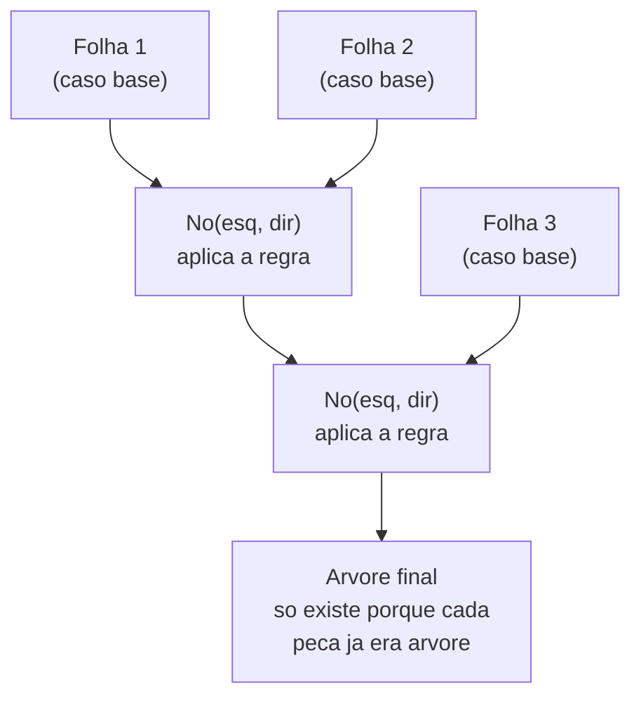
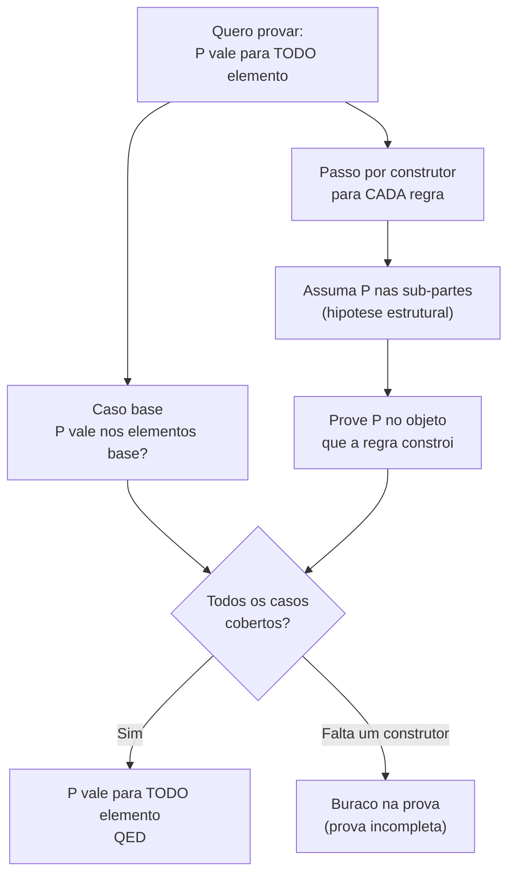
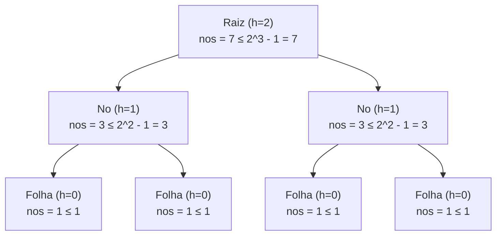
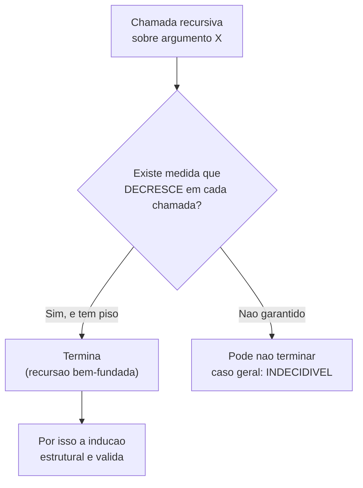

# Indução estrutural e definições recursivas

> [!abstract] TL;DR
> Uma **definição recursiva** (ou indutiva) constrói um conjunto a partir de **casos base** mais **regras de construção** — e o conjunto definido é o **menor** fechado sob essas regras. A **indução estrutural** é a técnica de prova que casa com essa definição: prove a propriedade nos casos base, depois prove que **cada construtor a preserva** (assumindo-a nas sub-partes). É a generalização direta de [[06 - Indução matemática]] — ℕ é só a estrutura indutiva mais boba que existe. E é *a* técnica de prova da Ciência da Computação: toda estrutura de dados recursiva e toda função recursiva sobre ela se justificam assim.

Você já provou propriedades de números naturais com indução. Base no 0, passo de `n` para `n+1`. Funciona porque ℕ tem uma forma específica: um ponto de partida e uma operação que sempre te leva ao "próximo".

Mas pense numa árvore. Numa lista encadeada. Numa expressão aritmética. Numa string. Nenhuma dessas é "um número seguido do próximo". Como você prova algo sobre **todas as árvores binárias possíveis**? Há infinitas, de formatos selvagens.

A resposta é a mesma ideia da indução, generalizada para *qualquer* coisa construída por regras. Essa é a nota.

## Definição recursiva: base + regras de construção

Uma definição recursiva de um conjunto tem duas partes:

1. **Caso base** — alguns elementos que estão no conjunto "de graça", sem depender de nada.
2. **Regra(s) de construção** — como pegar elementos que já estão no conjunto e fabricar novos.

E uma cláusula implícita, que a maioria dos livros esquece de dizer em voz alta: **nada mais está no conjunto**. Só o que você consegue alcançar partindo da base e aplicando as regras um número finito de vezes.

Vamos ver isso virar concreto em cinco estruturas que você usa todo dia.

### ℕ — os números naturais

A própria definição que motiva tudo:

- **Base:** 0 ∈ ℕ.
- **Regra:** se n ∈ ℕ, então o sucessor (n + 1) ∈ ℕ.

É isso. O 5 existe porque é o sucessor do sucessor do sucessor do sucessor do sucessor do 0. ℕ é a estrutura indutiva mínima: **uma** base, **um** construtor unário.

### Listas

- **Base:** a lista vazia `[]` é uma lista.
- **Regra (cons):** se `x` é um elemento e `l` é uma lista, então `x :: l` (o "cons" de `x` na frente de `l`) é uma lista.

A lista `[1, 2, 3]` é, por baixo do açúcar sintático, `1 :: (2 :: (3 :: []))`. Nada de mágico — é base mais regra aplicada três vezes.

### Árvores binárias

- **Base:** uma `Folha` (com um valor) é uma árvore.
- **Regra:** se `esq` e `dir` são árvores, então `No(valor, esq, dir)` é uma árvore.

Repare que agora o construtor é **binário**: ele consome *duas* sub-árvores. É aqui que a indução vai ganhar dois "casos de hipótese" no passo, um para cada filho.

### Expressões aritméticas (ASTs)

A árvore de sintaxe abstrata de `2 * (3 + 4)`:

- **Base:** todo literal numérico é uma expressão (`Lit n`).
- **Regra:** se `e₁` e `e₂` são expressões e `op` é um operador (+, −, ·, /), então `OpBin(op, e₁, e₂)` é uma expressão.

Isso é exatamente o que um parser produz e o que um interpretador percorre. A definição recursiva da gramática **é** a definição da AST.

### Palavras sobre um alfabeto Σ

Strings, formalmente:

- **Base:** a palavra vazia ε é uma palavra sobre Σ.
- **Regra:** se `w` é uma palavra sobre Σ e `a` ∈ Σ, então `wa` (concatenar o símbolo `a`) é uma palavra sobre Σ.

O conjunto de todas as palavras é o famoso Σ*. E ele nasce de uma base (ε) mais um construtor.

> [!example] Lead-in do diagrama
> Antes de provar qualquer coisa, vale enxergar uma definição indutiva como o que ela é: uma máquina de fabricar elementos. O fluxograma abaixo mostra como a regra "cose" sub-partes num todo, usando árvores binárias.



**Leitura do diagrama:** as Folhas entram "de graça" pela base. Cada `No` só pode ser construído porque seus filhos *já eram* árvores válidas. A árvore final no topo é legítima porque há um caminho finito de construção partindo de folhas. Não há como inventar um nó cujos filhos não sejam árvores — essa é a força da cláusula "nada mais está no conjunto".

### Por que "o MENOR conjunto fechado sob as regras"?

Essa frase parece pedantismo, mas é o coração de tudo. Pierce define termos como "o menor conjunto que satisfaz as cláusulas". Por quê *menor*?

Pense: o conjunto de todas as listas é fechado sob `cons`. Mas o conjunto de "todas as listas mais um unicórnio chamado 🦄" *também* seria fechado sob `cons` (cons num unicórnio dá um erro de tipo, então a regra simplesmente não produz nada novo a partir dele — vacuamente fechado). Qual dos dois é "as listas"?

O **menor**. O que contém *exatamente* o que as regras forçam a existir, e nada de penetra. Tecnicamente: a interseção de todos os conjuntos fechados sob as regras.

E é justamente esse "menor" que dá licença para a indução estrutural funcionar. Se o conjunto fosse maior do que o necessário, poderia haver elementos "soltos" que nenhuma regra construiu — e sobre os quais sua prova não diria nada.

## Indução estrutural: a prova que casa com a definição

Aqui está a regra geral, e ela é lindamente simétrica à definição:

> Para provar que **todo** elemento de um conjunto indutivamente definido satisfaz uma propriedade P:
> 1. **Casos base:** prove P para cada elemento base.
> 2. **Passo indutivo (por construtor):** para cada regra de construção, assuma P para as sub-partes (a **hipótese estrutural**) e prove P para o objeto que a regra constrói.

Se você fizer isso, P vale para *todos* os elementos. Sem exceção. E a razão é exatamente o "menor conjunto": como todo elemento foi construído por um caminho finito a partir da base, e você cobriu a base e cada passo de construção, não há onde a propriedade falhar.

> [!example] Lead-in do diagrama
> A estrutura de uma prova por indução estrutural é sempre a mesma forma. O fluxograma traduz o esqueleto.



**Leitura do diagrama:** a prova se divide em duas frentes que precisam *ambas* fechar. À esquerda, os casos base, onde não há hipótese a assumir — você prova P do zero. À direita, um ramo por construtor: cada um te dá a hipótese estrutural de graça (P nas sub-partes) e te cobra P no resultado. Se você esquecer *um* construtor, o losango "Todos cobertos?" cai no "buraco" — a prova não fecha. Pattern matching exaustivo, mais adiante, é exatamente isso.

### É só indução matemática generalizada

Volte em [[06 - Indução matemática]]. Lá, a base era P(0) e o passo era "P(n) ⇒ P(n+1)". Agora reconheça:

- ℕ tem **uma** base (0) → indução tem **um** caso base.
- ℕ tem **um** construtor (sucessor) → indução tem **um** passo.

A indução matemática é a indução estrutural sobre a estrutura indutiva mais simples possível. Quando a estrutura ganha mais bases ou mais construtores (ou construtores binários), a prova ganha mais casos. Mesma máquina, mais alavancas. Como diz Pierce: é prática comum usar indução estrutural sempre que possível, pois ela trabalha sobre os termos diretamente, evitando o desvio pelos números.

| Indução matemática | Indução estrutural |
| --- | --- |
| Base: P(0) | Base: P para cada elemento base |
| Passo: P(n) ⇒ P(n+1) | Passo: P(sub-partes) ⇒ P(construído), por construtor |
| Estrutura: ℕ (1 base, 1 construtor) | Estrutura: qualquer conjunto indutivo |
| "menor conjunto com 0 fechado sob +1" | "menor conjunto fechado sob as regras" |

## Por que é *a* técnica da Ciência da Computação

Aqui está a tese forte, e ela se sustenta: **toda estrutura de dados recursiva** e **toda função recursiva sobre ela** se provam por indução estrutural.

Por que não é exagero? Porque a coincidência não é coincidência. A *mesma* definição recursiva que descreve o **dado** (a árvore, a lista, a AST) descreve a **forma da recursão** que opera sobre ele *e* a **forma da prova** sobre ele. Três espelhos da mesma estrutura:

- A **definição** do dado tem base + construtores.
- A **função** recursiva tem caso base + caso por construtor.
- A **prova** tem caso base + passo por construtor.

Quando você prova uma propriedade de uma função recursiva, a indução estrutural percorre a função no mesmo ritmo em que ela se chama. É por isso que a prova "sai sozinha" quando o código está bem estruturado — e trava quando o código tem um caso esquecido.

## Exemplos trabalhados completos

Chega de filosofia. Três provas de verdade, com todos os casos.

### Exemplo 1 — número de nós ≤ 2^(altura+1) − 1

**Afirmação:** para toda árvore binária `t`, o número de nós satisfaz `nos(t) ≤ 2^(altura(t)+1) − 1`.

Convenções: uma folha tem altura 0; um nó tem altura `1 + max(altura(esq), altura(dir))`. `nos(Folha) = 1`; `nos(No(e,d)) = 1 + nos(e) + nos(d)`.

**Caso base — `t = Folha`.**
nos(Folha) = 1. E 2^(0+1) − 1 = 2 − 1 = 1. Então 1 ≤ 1. ✓

**Passo — `t = No(e, d)`.**
**Hipótese estrutural:** nos(e) ≤ 2^(altura(e)+1) − 1 e nos(d) ≤ 2^(altura(d)+1) − 1.

Seja h = altura(t) = 1 + max(altura(e), altura(d)). Logo altura(e) ≤ h − 1 e altura(d) ≤ h − 1.

Calculando:

```
nos(t) = 1 + nos(e) + nos(d)
       ≤ 1 + (2^(altura(e)+1) − 1) + (2^(altura(d)+1) − 1)    [hipótese estrutural]
       ≤ 1 + (2^h − 1) + (2^h − 1)                            [altura(e), altura(d) ≤ h−1]
       = 1 + 2·2^h − 2
       = 2^(h+1) − 1
```

Logo nos(t) ≤ 2^(altura(t)+1) − 1. ✓ Cobrimos base e o único construtor. QED.

> [!example] Lead-in do diagrama
> A prova acima sobe a árvore de baixo para cima. Cada nó usa o resultado dos filhos. O diagrama mostra a propagação numa árvore perfeita de altura 2.



**Leitura do diagrama:** as folhas, embaixo, fecham o caso base (1 ≤ 1). Subindo um nível, cada nó soma 1 mais os dois filhos e ainda respeita o limite (3 ≤ 3). A raiz herda os limites dos dois sub-totais e bate exatamente no máximo (7 ≤ 7). A igualdade é atingida justamente em árvores **cheias** — a prova nos diz não só *que* o limite vale, mas *quando* ele é apertado.

### Exemplo 2 — length(append(a, b)) = length(a) + length(b)

**Afirmação:** para todas as listas `a` e `b`, `length(append(a, b)) = length(a) + length(b)`.

Definições:
- `length([]) = 0`; `length(x :: l) = 1 + length(l)`.
- `append([], b) = b`; `append(x :: l, b) = x :: append(l, b)`.

Faremos indução **sobre a estrutura de `a`** (`b` fica fixo, como parâmetro). Repare: a recursão de `append` desce por `a`, então é por `a` que a indução tem que descer.

**Caso base — `a = []`.**

```
length(append([], b)) = length(b)              [def. append, caso base]
length([]) + length(b) = 0 + length(b) = length(b)   [def. length]
```

Os dois lados batem em `length(b)`. ✓

**Passo — `a = x :: l`.**
**Hipótese estrutural:** length(append(l, b)) = length(l) + length(b).

Lado esquerdo:

```
length(append(x :: l, b))
  = length(x :: append(l, b))       [def. append, caso construtor]
  = 1 + length(append(l, b))        [def. length, caso construtor]
  = 1 + (length(l) + length(b))     [hipótese estrutural]
```

Lado direito:

```
length(x :: l) + length(b)
  = (1 + length(l)) + length(b)     [def. length]
  = 1 + (length(l) + length(b))     [associatividade da soma]
```

Os dois lados chegam em `1 + length(l) + length(b)`. ✓ Base e construtor cobertos. QED.

### Exemplo 3 — reverse(reverse(l)) = l

Essa é a mais bonita, e a que mais ensina sobre **lemas auxiliares**.

Definições:
- `reverse([]) = []`; `reverse(x :: l) = append(reverse(l), [x])`.

**Lema necessário:** `reverse(append(a, b)) = append(reverse(b), reverse(a))`. (Reverter uma concatenação inverte a ordem e reverte cada parte. Prova-se por indução sobre `a` — deixo como exercício do mesmo padrão; é o que torna o teorema principal viável.)

**Afirmação:** para toda lista `l`, `reverse(reverse(l)) = l`.

**Caso base — `l = []`.**

```
reverse(reverse([])) = reverse([]) = []   [def. reverse, duas vezes]
```

E `l = []`. ✓

**Passo — `l = x :: l'`.**
**Hipótese estrutural:** reverse(reverse(l')) = l'.

```
reverse(reverse(x :: l'))
  = reverse(append(reverse(l'), [x]))                    [def. reverse]
  = append(reverse([x]), reverse(reverse(l')))           [lema acima]
  = append([x], reverse(reverse(l')))                    [reverse([x]) = [x]]
  = append([x], l')                                      [hipótese estrutural]
  = x :: l'                                               [def. append em singleton]
```

Chegamos em `x :: l'`, que é exatamente `l`. ✓ QED.

> [!tip] O que o exemplo 3 ensina
> Às vezes a indução estrutural **não fecha sozinha**: você precisa de um lema, provado *também* por indução estrutural, para destravar o passo. Saber identificar "preciso de um lema aqui" é a diferença entre travar e terminar. Em entrevista, reconhecer isso vale ouro.

## Recursão bem-fundada e terminação

Tem uma pergunta que talvez já tenha pinicado: *como sei que essas funções recursivas terminam?* Se elas não terminassem, a prova falaria de algo que nem existe como valor.

A resposta é **recursão bem-fundada**: uma função recursiva termina se existe uma **medida** que **decresce estritamente** a cada chamada recursiva, e que não pode decrescer para sempre (tem um piso).

- Em `length(x :: l)`, a chamada é sobre `l` — uma lista **mais curta**. A medida "comprimento da lista" cai de `n` para `n−1`. Não cai abaixo de 0. Termina.
- Em árvores, a recursão desce para sub-árvores — **menores** em número de nós. Termina.
- Em ℕ, a recursão vai de `n` para algo `< n`. Termina.

O nome técnico: a estrutura indutiva induz uma **ordem bem-fundada** (sem cadeias decrescentes infinitas), e por isso toda recursão que "desce na estrutura" para nas folhas. É a mesma garantia que faz a indução estrutural ser válida — terminação e indução são dois lados da boa-fundação.

> [!warning] E toda recursão termina?
> Não. E pior: **não dá para decidir automaticamente** se uma recursão arbitrária termina. Essa é uma das verdades mais profundas da computação — o problema da parada é indecidível: não existe algoritmo que, dado qualquer programa, responda sempre e corretamente "isso para?". A boa-fundação **garante** terminação quando você tem uma medida decrescente clara; mas a ausência dela não prova o contrário, e o caso geral é genuinamente impossível de automatizar. É por isso que compiladores de linguagens totais (que exigem terminação) só aceitam recursão estruturalmente decrescente — eles trocam poder por garantia.



**Leitura do diagrama:** a pergunta-chave é se cada chamada recursiva encolhe uma medida com piso. Se sim, a recursão atinge o caso base em passos finitos — e essa mesma boa-fundação é o que licencia a indução estrutural. Se não há medida garantida, caímos no território onde o problema da parada manda: indecidível no caso geral.

## Prática: o ângulo dev

Agora a parte que paga as contas. Onde isso aparece no código que você escreve?

### Provar propriedades de folds / reduce

Um `fold` (ou `reduce`) é a forma canônica de consumir uma estrutura recursiva: ele tem um valor inicial (caso base) e uma função de combinação (caso construtor). Provar uma propriedade de um `fold` é literalmente fazer indução estrutural — o caso base do fold é o seu caso base, a função de combinação é o seu passo. A correspondência é exata.

`length` é `foldr (\_ acc -> 1 + acc) 0`. A prova do Exemplo 2 nada mais foi do que indução sobre a estrutura que o fold percorre.

### Pattern matching exaustivo = cobrir todos os casos da prova

Olhe um match sobre uma árvore:

```
match t with
| Folha v       -> ...    -- caso base
| No(v, e, d)   -> ...    -- caso construtor
```

Reconheça a forma: **um ramo por construtor da definição indutiva**. É a *mesma* decomposição da prova por indução estrutural. Por isso o compilador implora por exaustividade: um match não-exaustivo é o equivalente em código de uma prova com um construtor esquecido — o "buraco" do nosso primeiro fluxograma. O warning de "non-exhaustive patterns" é o compilador te avisando que sua "prova" está incompleta.

### ADTs e tipos recursivos

Um **tipo algébrico de dados** (ADT) *é* uma definição indutiva escrita na sintaxe da linguagem:

```
data Arvore a = Folha a | No (Arvore a) (Arvore a)
```

Cada `|` é um construtor. `Folha` é a base; `No` é a regra. A definição matemática e a declaração de tipo são a mesma coisa em dois idiomas. Veja [[Paradigmas de Programação]] para como ADTs, recursão e pattern matching se entrelaçam no estilo funcional — esta nota é a fundação teórica daquele tripé.

### Confiança sem rodar

Esse é o prêmio. Quando você prova `reverse(reverse(l)) = l` por indução estrutural, você sabe que vale para **todas** as listas — as infinitas. Nenhum conjunto de testes alcança isso; testes amostram, provas quantificam universalmente (o ∀). Em sistemas onde correção importa de verdade — um compilador, um motor de consenso, um parser de protocolo — saber *raciocinar* sobre a recursão, e não só testá-la, é o que separa "provavelmente funciona" de "demonstravelmente funciona".

E mesmo quando você não escreve a prova formal, *pensar* na estrutura "base + cada construtor preserva" é o hábito mental que te faz escrever a função recursiva certa de primeira — cobrindo o caso vazio, tratando cada variante, descendo na estrutura.

> [!example] Lead-in do diagrama
> Para fechar, uma tabela-mapa: dado o tipo de estrutura, qual a base, quais as regras, e o que a indução te permite provar.

| Estrutura | Caso base | Regra(s) de construção | O que a indução prova |
| --- | --- | --- | --- |
| ℕ | 0 | sucessor: n → n+1 | propriedades de todo natural |
| Listas | `[]` | cons: `x :: l` | length, append, reverse, map/fold |
| Árvores binárias | `Folha` | `No(esq, dir)` | altura×nós, percursos, balanceamento |
| Expressões / AST | `Lit n` | `OpBin(op, e₁, e₂)` | correção de avaliação, type-safety |
| Palavras sobre Σ | ε | concatenar símbolo: `wa` | propriedades de Σ*, autômatos |

**Leitura do diagrama:** leia cada linha como uma receita de prova. A coluna do meio (base + regras) é *exatamente* o esqueleto do seu `match` ou do seu ADT. A última coluna é o tipo de teorema que aquela estrutura habilita — e em todos os casos, a tática é uma só: base mais passo por construtor.

> [!summary] Resumo em uma linha
> Defina por base + construtores, prove na base e em cada construtor assumindo a hipótese nas sub-partes, e você terá demonstrado a propriedade para toda a (infinita) família de estruturas — que é o mesmo formato da função recursiva e do pattern matching que a consome.

## Em entrevista

Indução estrutural raramente aparece com esse nome numa entrevista de engenharia, mas o *raciocínio* aparece o tempo todo: ao argumentar que uma função sobre árvore está correta, ao justificar terminação de uma recursão, ao explicar por que um pattern match precisa ser exaustivo. Saber nomear a técnica — e esboçar "caso base, depois passo por construtor" — sinaliza maturidade de fundamentos. Se te pedirem para *provar* algo sobre uma estrutura recursiva, não comece a manipular: declare a indução, separe os casos e ataque um por um.

*"A recursive (or inductive) definition has base cases plus construction rules, and defines the smallest set closed under those rules."*
*"Structural induction generalizes mathematical induction from the naturals to any inductively defined structure."*
*"You prove the base cases, then prove that each constructor preserves the property, assuming it holds on the sub-parts."*
*"That assumption on the sub-parts is the structural induction hypothesis."*
*"The same recursive shape describes the data, the recursive function over it, and the proof — that's why structural induction is the proof technique of computer science."*
*"Exhaustive pattern matching is structural induction in code: one branch per constructor, just like one case per proof."*
*"A recursion terminates when some measure strictly decreases at each call down to a base case — that's well-founded recursion."*
*"Whether an arbitrary recursion terminates is undecidable in general — that's the halting problem — so total languages only allow structurally decreasing recursion."*

| Português | English |
| --- | --- |
| definição recursiva / indutiva | recursive / inductive definition |
| caso base | base case |
| regra de construção | construction rule |
| construtor | constructor |
| menor conjunto fechado sob as regras | smallest set closed under the rules |
| indução estrutural | structural induction |
| hipótese estrutural / de indução | structural / induction hypothesis |
| passo indutivo | inductive step |
| preservar a propriedade | preserve the property |
| recursão bem-fundada | well-founded recursion |
| terminação | termination |
| medida decrescente | decreasing measure |
| ordem bem-fundada | well-founded order |
| problema da parada | halting problem |
| indecidível | undecidable |
| tipo algébrico de dados (ADT) | algebraic data type (ADT) |
| pattern matching exaustivo | exhaustive pattern matching |
| árvore de sintaxe abstrata (AST) | abstract syntax tree (AST) |
| palavra vazia | empty word / empty string |

> [!info] Lastro
> - Rosen, Kenneth H. *Discrete Mathematics and Its Applications* — seção "Recursive Definitions and Structural Induction" (basis step + recursive step; indução estrutural como generalização da indução matemática). [PDF da seção](https://zimmer.fresnostate.edu/~mnogin/math114fall17/rosen-section3.4.pdf)
> - Lehman, Eric; Leighton, F. Thomson; Meyer, Albert R. *Mathematics for Computer Science* (MIT) — capítulos de recursive data types e structural induction; exemplos de fechamento sob construtores. [PDF oficial (MIT CSAIL)](https://people.csail.mit.edu/meyer/mcs.pdf)
> - Pierce, Benjamin C. *Types and Programming Languages* (MIT Press, 2002) — cap. 3, "termos como o menor conjunto satisfazendo as cláusulas" e indução estrutural sobre termos (Teorema 3.3.4). [Índice/TAPL](https://www.cis.upenn.edu/~bcpierce/tapl/contents.pdf)
> - Wikipedia, *Structural induction* — visão geral e relação com indução noetheriana. [Verbete](https://en.wikipedia.org/wiki/Structural_induction)

## Relacionadas

- [[06 - Indução matemática]] — o caso particular sobre ℕ; esta nota é a generalização.
- [[05 - Técnicas de prova]] — onde a indução entra no arsenal de provas.
- [[04 - Teoria dos conjuntos]] — "o menor conjunto fechado sob regras" formaliza-se via interseção de conjuntos fechados.
- [[Paradigmas de Programação]] — ADTs, recursão e pattern matching no estilo funcional, a face prática desta teoria.
