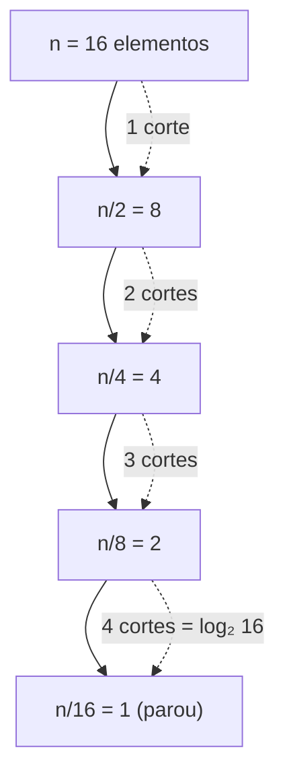
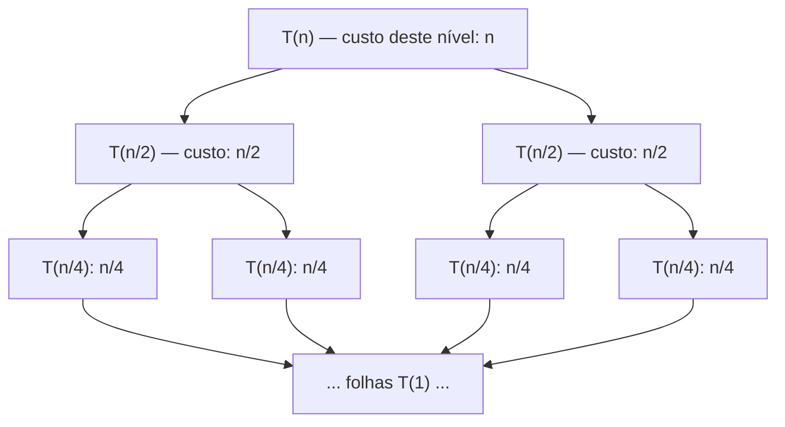
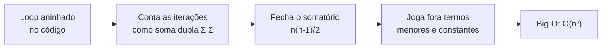

# Somatórios, logaritmos e crescimento

> [!abstract] TL;DR
> Toda análise de algoritmo desemboca em três ferramentas: **somar** (Σ), **dividir pela metade** (log) e **comparar quem cresce mais rápido**. Um loop é um somatório. Uma árvore balanceada é um logaritmo. Uma recorrência é um somatório disfarçado de recursão.
> Esta nota é a **base matemática** que a análise de complexidade *defere*. Aqui você aprende a fechar a conta; em [[03-Dominios/Ciência/Algoritmos/02 - Análise de complexidade - Big-O]] você aprende a jogar fora os detalhes. As séries fechadas (∑i = n(n+1)/2, geométrica, harmônica) são o vocabulário. Logaritmo é o que sobra quando você divide por 2 até não dar mais. E a hierarquia 1 ≺ log n ≺ n ≺ n log n ≺ n² ≺ 2ⁿ ≺ n! é o ranking que decide se seu código roda em milissegundos ou na próxima era geológica.

---

## Por que esta nota existe

Você abre um algoritmo. Tem dois loops aninhados. Você "sabe" que é O(n²). Mas *por quê*?

Porque o loop de dentro roda 1, depois 2, depois 3... até n vezes. E somar 1 + 2 + 3 + … + n dá **n(n+1)/2**. O n² está escondido ali, dentro de um somatório que ninguém abriu.

A maioria dos devs decora o resultado e nunca vê a conta. O problema é que, na hora que o algoritmo foge do caso fácil — quicksort, hashing, mergesort, árvore B —, o resultado decorado não cobre. Aí você precisa da máquina, não da tabela.

A máquina tem três peças: **somatório**, **logaritmo** e **crescimento de funções**. Vamos abrir as três.

> [!info] Onde isto se encaixa
> Esta é uma nota de *Fundamentos*. Ela é a fonte que Algoritmos consome. Quando [[03-Dominios/Ciência/Algoritmos/05 - Recorrências e o Teorema Mestre]] cita "a soma por nível é geométrica", a prova daquela soma mora **aqui**. Não vamos reescrever o Teorema Mestre — vamos construir o chão sobre o qual ele pisa.

---

## Parte 1 — Somatórios (Σ)

### O que a notação diz

O Σ é só uma abreviação de "some isto repetidas vezes". Lê-se de baixo pra cima:

$$\sum_{i=1}^{n} i = 1 + 2 + 3 + \dots + n$$

O `i` é o **índice** (a variável que anda), o `1` é onde ele começa, o `n` é onde para, e `i` (à direita) é o que você soma a cada passo. Troque o `i` da direita por `i²` e você soma quadrados. Por `1` e você soma n cópias de 1 (o que dá... n).

Pense no Σ como um `for` matemático:

```
soma = 0
for i = 1 to n:
    soma += f(i)
```

Σ é esse `for`. A diferença é que o matemático quer a **fórmula fechada** — o valor sem rodar o loop. É exatamente isso que transforma "rodar n vezes" em "isto é n(n+1)/2".

### Linearidade: a propriedade que você mais vai usar

Somatório é **linear**. Constante sai pra fora, e soma de somas separa:

$$\sum_{i} \big(a \cdot f(i) + g(i)\big) = a\sum_{i} f(i) + \sum_{i} g(i)$$

Por que importa pra dev? Porque o custo de um loop quase nunca é uma coisa só. É "3 comparações + 1 swap por iteração". A linearidade deixa você somar cada pedaço separado e juntar no fim. O `3` (constante) sai na frente. Sobra ∑1 = n, e o custo total vira 3n + (custo do swap). Constante na frente, somatório limpo atrás.

### Reindexação (troca de variável)

Às vezes a soma fica mais fácil se você desloca o índice. Trocar `i` por `j = i − 1` é como renomear a variável do loop: o conteúdo não muda, só o rótulo.

$$\sum_{i=1}^{n} f(i) = \sum_{j=0}^{n-1} f(j+1)$$

É o mesmo truque de quando você reescreve `for (i=1; i<=n; i++)` como `for (j=0; j<n; j++)` ajustando o corpo. Útil pra alinhar duas somas que você quer combinar.

### O somatório telescópico

Esse é o truque mais bonito. Quando cada termo **cancela** parte do vizinho, tudo no meio desaparece e só sobram as pontas:

$$\sum_{i=1}^{n} \big(a_i - a_{i-1}\big) = a_n - a_0$$

Por quê? Escreva os termos: (a₁ − a₀) + (a₂ − a₁) + (a₃ − a₂) + … + (aₙ − aₙ₋₁). O −a₁ do segundo termo mata o +a₁ do primeiro. O −a₂ do terceiro mata o +a₂ do segundo. Como um telescópio dobrando: só ficam visíveis as extremidades.

Por que dev se importa? Custo amortizado. Quando você prova que uma sequência de operações custa no total apenas `(estado final − estado inicial)`, em vez de somar cada operação cara, você está telescopando. O grosso cancela.

### Soma dupla (loops aninhados)

Dois Σ encaixados são dois `for` aninhados:

$$\sum_{i=1}^{n} \sum_{j=1}^{i} 1$$

O de dentro depende do de fora (`j` vai até `i`, não até `n` fixo). Isso é o pão com manteiga da análise de loop aninhado. Vamos fechar essa conta na Parte 5 — é de onde sai o n² da bolha.

### As séries fechadas que você precisa conhecer de cor

Aqui está o arsenal. Cada uma vira uma conta que aparece em algoritmo real.

| Série | Fórmula fechada | Cresce como | Onde aparece em CS |
|---|---|---|---|
| Aritmética | ∑ᵢ₌₁ⁿ i = n(n+1)/2 | Θ(n²) | Loop aninhado triangular, bubble/insertion sort |
| Soma de quadrados | ∑ᵢ₌₁ⁿ i² = n(n+1)(2n+1)/6 | Θ(n³) | Triplo loop, álgebra de matrizes ingênua |
| Geométrica finita | ∑ᵢ₌₀ⁿ rⁱ = (rⁿ⁺¹ − 1)/(r − 1) | Θ(rⁿ) se r>1 | Dobrar array, soma por nível de árvore |
| Geométrica infinita | ∑ᵢ₌₀^∞ rⁱ = 1/(1 − r), se ÷r÷ < 1 | constante | Custo amortizado de array dinâmico |
| Harmônica | Hₙ = ∑ᵢ₌₁ⁿ 1/i ≈ ln n + γ | Θ(log n) | Quicksort médio, hashing, coupon collector |

> [!note] Leitura da tabela
> Repare na coluna "cresce como". A série aritmética soma n termos que chegam até n → o resultado é quadrático. A de quadrados soma termos até n² → cúbico. A regra de bolso: **somar n termos cujo maior vale M dá algo da ordem de n·M no pior caso, mas com um fator que depende de como os termos se distribuem.** A harmônica é a estranha: soma n termos, mas eles encolhem tão rápido (1, ½, ⅓, …) que o total só chega a ≈ ln n. Termos que minguam salvam o dia.

### A aritmética: duas provas pelo preço de uma

**Prova de Gauss (a do menino de 8 anos).** Escreva a soma duas vezes, uma de trás pra frente:

```
S =   1  +  2  +  3  + … + (n-1) + n
S =   n  + (n-1) + (n-2) + … +  2  + 1
```

Some coluna por coluna. Cada par dá **n+1**. E você tem **n** colunas. Então 2S = n(n+1), ou seja:

$$S = \frac{n(n+1)}{2}$$

**Prova por indução.** A base: n=1 dá 1(2)/2 = 1. ✓ O passo: suponha que vale pra n. Então pra n+1:

$$\sum_{i=1}^{n+1} i = \underbrace{\frac{n(n+1)}{2}}_{\text{hipótese}} + (n+1) = \frac{n(n+1) + 2(n+1)}{2} = \frac{(n+1)(n+2)}{2} \checkmark$$

É exatamente a fórmula com n+1 no lugar de n. Fechou. O motor formal dessa segunda prova está em [[06 - Indução matemática]] — Gauss te dá a intuição, a indução te dá a garantia para *qualquer* n.

### A geométrica: a conta do "dobra ou metade"

A geométrica é a alma de tudo que divide ou multiplica por um fator constante. A prova é puro telescópio. Seja S = 1 + r + r² + … + rⁿ. Multiplique tudo por r:

```
rS =       r + r² + … + rⁿ + rⁿ⁺¹
 S = 1 +   r + r² + … + rⁿ
```

Subtraia: rS − S = rⁿ⁺¹ − 1. Logo S(r − 1) = rⁿ⁺¹ − 1, ou:

$$\sum_{i=0}^{n} r^i = \frac{r^{n+1} - 1}{r - 1}$$

E se ÷r÷ < 1 e n → ∞? O rⁿ⁺¹ vira pó. Sobra:

$$\sum_{i=0}^{\infty} r^i = \frac{1}{1 - r}$$

Guarde esse 1/(1−r). Ele é a razão de um array dinâmico ter inserção O(1) amortizado mesmo dobrando de tamanho. Voltaremos.

### A harmônica: por que ln n aparece do nada

Hₙ = 1 + ½ + ⅓ + ¼ + … + 1/n não tem fórmula fechada exata. Mas ela é ≈ **ln n**. Por que o logaritmo natural?

Pense em ∫ de 1/x. A área sob a curva 1/x de 1 até n é exatamente ln n. A soma Hₙ é a aproximação em degraus dessa área. Os degraus seguem a curva de perto, então Hₙ ≈ ln n + γ, onde γ ≈ 0,577 é a constante de Euler-Mascheroni.

Onde isso bate na sua porta:

- **Quicksort.** Na média, a profundidade esperada de cada elemento na árvore de recursão soma uma série harmônica → o n log n esperado.
- **Hashing / coupon collector.** Quantas tentativas pra preencher uma tabela? Quando faltam k slots de n, a chance de acertar um vazio é k/n, então o custo esperado é n/k. Some n/n + n/(n−1) + … + n/1 = n·Hₙ ≈ n ln n.

A harmônica é a impressão digital do logaritmo dentro de um somatório. Quando você vê Hₙ, sabe que tem um log escondido.

### Produtório e fatorial (a versão multiplicativa)

Troque o `+` por `×` e o Σ vira **Π**:

$$\prod_{i=1}^{n} i = 1 \cdot 2 \cdot 3 \cdots n = n!$$

O fatorial é o produtório de 1 até n. Ele conta permutações (ver [[11 - Combinatória - a arte de contar]]) e é o campeão de crescimento da nossa hierarquia. Um truque útil: **log de produtório vira somatório**. Como log(ab) = log a + log b:

$$\log(n!) = \log\!\prod_{i=1}^{n} i = \sum_{i=1}^{n} \log i \approx n \log n$$

Esse log(n!) ≈ n log n é exatamente o limite inferior de ordenação por comparação. O produtório e o logaritmo conversam — e essa conversa é a ponte pra Parte 2.

---

## Parte 2 — Logaritmos

### A definição que destrava tudo

Logaritmo é a pergunta inversa da exponenciação. Exponenciação pergunta "2 elevado a 3 dá quanto?" (resposta: 8). Logaritmo pergunta o contrário: "**2 elevado a quê dá 8?**" (resposta: 3).

$$\log_b x = y \iff b^y = x$$

Em CS, a base mais comum é 2, porque computação adora dividir as coisas em duas. log₂ 8 = 3. log₂ 1024 = 10. log₂ (1 milhão) ≈ 20. **Esse é o ponto que muda a vida do dev: 1 milhão de elementos, busca binária resolve em ≈ 20 passos.** O log esmaga.

### As identidades (e por que cada uma serve)

| Identidade | Fórmula | Pra que serve em CS |
|---|---|---|
| Produto vira soma | log(ab) = log a + log b | Transforma produtório em somatório (log n!) |
| Quociente vira diferença | log(a/b) = log a − log b | Analisar "metade do tamanho" por nível |
| Potência vira produto | log(aⁿ) = n · log a | Tirar o expoente pra fora; comparar 2ⁿ vs nᵏ |
| Mudança de base | log_b x = ln x / ln b | Provar que a base só muda por constante |
| Identidade do log/exp | b^(log_b x) = x | Desfazer um log; voltar pro tamanho original |

> [!tip] Leitura da tabela
> A linha que mais importa pra análise de algoritmo é a **mudança de base**. log_b x = ln x / ln b. O ÷1/ln b÷ é uma **constante** — não depende de x. Ou seja: trocar de log₂ pra log₁₀ pra ln só multiplica tudo por um número fixo. E constante, em terra assintótica, é invisível. Por isso ninguém escreve a base num Big-O: O(log n) já diz tudo.

### Por que a base não importa no Big-O

Aqui está a conta completa, porque ela cai em entrevista. Suponha que um algoritmo custa log₂ n. Quero reescrever em ln:

$$\log_2 n = \frac{\ln n}{\ln 2} = \frac{1}{\ln 2} \cdot \ln n \approx 1{,}4427 \cdot \ln n$$

O 1,4427 é uma constante. Em [[03-Dominios/Ciência/Algoritmos/02 - Análise de complexidade - Big-O]], O(c · f(n)) = O(f(n)) — constantes evaporam. Então O(log₂ n) = O(ln n) = O(log₁₀ n). **A base vira um detalhe de implementação da prova, não do resultado.** Por isso a literatura escreve só `lg n` ou `log n` e segue a vida.

> [!warning] lg vs ln vs log — não confunda
> - **lg n** = log₂ n (base 2). Convenção de CS. CLRS usa essa.
> - **ln n** = log_e n (base e ≈ 2,718). Logaritmo *natural*. Aparece em cálculo, na harmônica, em probabilidade.
> - **log n** = ambíguo. Matemáticos: base 10. CS: geralmente base 2 ou "tanto faz" (porque é assintótico).
> Em análise de complexidade, a ambiguidade é *de propósito* — a base não importa. Mas quando você está somando uma harmônica e aparece ln n, aí a base **e** é específica e literal. Saiba qual chapéu está usando.

### Por que o log aparece tanto em CS

Toda vez que um algoritmo **divide o problema pela metade repetidamente**, conte quantas vezes você consegue dividir n por 2 até chegar em 1. Essa contagem *é* log₂ n.



**Leitura do diagrama:** começamos com 16. Cada seta corta pela metade. Quatro cortes pra chegar em 1. E 4 = log₂ 16. Generalizando: o número de vezes que você divide n por 2 até sobrar 1 é ⌈log₂ n⌉. Isso explica de uma tacada:

- **Busca binária.** A cada comparação, descarta metade do espaço de busca. Número de comparações ≈ log₂ n.
- **Altura de árvore balanceada.** Uma árvore binária com n nós, se balanceada, tem altura ≈ log₂ n. Cada descida divide a árvore restante pela metade. É por isso que busca/inserção em AVL, rubro-negra, B-tree é O(log n).
- **Bits pra representar n.** Quantos bits pra escrever o número n em binário? Exatamente ⌈log₂(n+1)⌉. O número 1000 cabe em 10 bits, porque 2¹⁰ = 1024 > 1000. Logaritmo é literalmente "quantos dígitos isto tem".

A intuição-mestra: **log é a inversa de dobrar.** Se algo dobra a cada passo (potência de 2), o log conta os passos. Se algo cai pela metade a cada passo, o log conta os passos de novo. Dividir-e-conquistar vive disso.

---

## Parte 3 — Crescimento de funções

### A hierarquia que decide tudo

Quando n cresce, nem todas as funções crescem igual. Existe um **ranking** rígido. O símbolo ≺ aqui significa "cresce estritamente mais devagar que" (formalmente, f ≺ g quando f(n)/g(n) → 0).

$$1 \prec \log n \prec \sqrt{n} \prec n \prec n\log n \prec n^2 \prec n^3 \prec 2^n \prec n!$$

Leia da esquerda (céu) pra direita (inferno). Constante é grátis. Log é quase grátis. Linear é honesto. n log n é o teto dos algoritmos "bons" de ordenação. Quadrático começa a doer. Exponencial e fatorial são **sentenças de morte** — só servem pra n minúsculo.

### A tabela que vale mais que mil palavras

Números concretos. Suponha que cada operação leva 1 nanossegundo (10⁻⁹ s). Veja o que cada função custa pra n = 10, 100, 1000:

| f(n) | n = 10 | n = 100 | n = 1000 | Tempo real em n=1000 |
|---|---|---|---|---|
| 1 | 1 | 1 | 1 | instantâneo |
| log₂ n | ≈ 3,3 | ≈ 6,6 | ≈ 10 | instantâneo |
| √n | ≈ 3,2 | 10 | ≈ 31,6 | instantâneo |
| n | 10 | 100 | 1.000 | ≈ 1 µs |
| n log₂ n | ≈ 33 | ≈ 664 | ≈ 9.966 | ≈ 10 µs |
| n² | 100 | 10.000 | 1.000.000 | ≈ 1 ms |
| n³ | 1.000 | 1.000.000 | 1.000.000.000 | ≈ 1 s |
| 2ⁿ | 1.024 | ≈ 1,27 × 10³⁰ | ≈ 10³⁰¹ | além da idade do universo |
| n! | ≈ 3,6 × 10⁶ | ≈ 9,3 × 10¹⁵⁷ | ≈ 10²⁵⁶⁷ | incomputável |

> [!danger] Leitura da tabela — onde o exponencial explode
> Olhe a linha do 2ⁿ. Em n=10 são modestas 1024 operações. Em n=100, já são 10³⁰ — mais operações do que átomos numa galáxia. A 1 ns cada, levaria **bilhões de vezes a idade do universo**. E n=100 é um input *pequeno*. Esse é o abismo entre "polinomial" (n, n², n³ — tudo na tabela ainda é tratável até n=1000) e "exponencial" (2ⁿ, n! — quebram já na casa das dezenas). Quando um problema só tem solução exponencial conhecida, a pergunta deixa de ser "qual servidor?" e vira "será que dá pra resolver de outro jeito?". É a fronteira P vs NP, mas a intuição nasce aqui, nesta tabela.

### Por que os termos menores e as constantes somem

Pegue f(n) = 3n² + 50n + 1000. Pra n pequeno, o "+1000" domina. Mas e pra n = 1.000.000?

| Termo | Valor em n = 10⁶ | Fração do total |
|---|---|---|
| 3n² | 3 × 10¹² | 99,998% |
| 50n | 5 × 10⁷ | 0,0017% |
| 1000 | 1000 | desprezível |

**Leitura:** o termo quadrático engole tudo. O 50n e o 1000 viram poeira estatística. É por isso que [[03-Dominios/Ciência/Algoritmos/02 - Análise de complexidade - Big-O]] joga fora os termos menores e a constante: assintoticamente, **só o termo dominante sobrevive**. 3n² + 50n + 1000 = Θ(n²), ponto. A matemática aqui (limites, razões) é o que *justifica* aquela poda. Big-O é a notação; isto é a razão.

### Comparando por razão

Como saber se f ≺ g? Olhe o limite da razão f(n)/g(n) quando n → ∞.

- Se → 0, então f cresce mais devagar (f ≺ g).
- Se → ∞, f cresce mais rápido.
- Se → constante > 0, crescem no mesmo ritmo (f = Θ(g)).

Exemplo: n vs n log n. A razão é n / (n log n) = 1/log n → 0. Então n ≺ n log n. ✓ Outro: log n vs √n. A razão log n / √n → 0 (qualquer potência positiva de n vence qualquer log). Então log n ≺ √n. A regra-mestra que isso revela: **log perde pra qualquer potência, e qualquer polinômio perde pra qualquer exponencial.** Memorize esses dois e você ordena 90% das funções de cabeça.

---

## Parte 4 — Resolvendo recorrências (sem o Teorema Mestre)

Uma recorrência é uma função definida em termos de si mesma: T(n) depende de T(de algo menor). Toda recursão é uma recorrência esperando pra ser resolvida. Aqui resolvemos **na mão** — somando. O Teorema Mestre (o atalho) está em [[03-Dominios/Ciência/Algoritmos/05 - Recorrências e o Teorema Mestre]]; aqui mostramos o que ele *economiza*.

### Método da iteração (desenrola e soma)

A ideia: substitua T pela própria definição, repetidamente, até bater no caso base. O que sobrar é um **somatório**. Feche o somatório, e pronto.

**Exemplo 1: T(n) = T(n−1) + 1, com T(1) = 1.** (Custo de percorrer uma lista, recursão linear.)

Desenrole:

```
T(n)   = T(n-1) + 1
       = T(n-2) + 1 + 1
       = T(n-3) + 1 + 1 + 1
       = ...
       = T(1) + (n-1)·1
       = 1 + (n-1) = n
```

Cada passo adiciona um `+1` e desce um degrau. Após n−1 passos chega em T(1). Sobra a soma de n cópias de 1 → **T(n) = Θ(n)**. Um somatório trivial (∑1 = n) escondido numa recursão.

**Exemplo 2: T(n) = T(n−1) + n, com T(1) = 1.** (Custo do insertion sort no pior caso, ou bubble sort.)

Desenrole:

```
T(n)   = T(n-1) + n
       = T(n-2) + (n-1) + n
       = T(n-3) + (n-2) + (n-1) + n
       = ...
       = T(1) + (2 + 3 + … + n)
```

Olha quem apareceu: a **série aritmética**. T(n) = 1 + ∑ᵢ₌₂ⁿ i ≈ n(n+1)/2. Isso é **Θ(n²)**. O n² do insertion sort não é mágica — é a série aritmética que abrimos na Parte 1, vinda direto da recorrência. Decrementar de 1 mas pagar n por nível dá quadrático.

### Método da árvore de recursão (soma por nível)

Quando o problema **se ramifica** (divide-e-conquista), desenhar a árvore e somar nível a nível é mais limpo. O custo total = soma dos custos de todos os níveis.

**Exemplo 3 (o clássico): T(n) = 2T(n/2) + n, com T(1) = Θ(1).** Este é o mergesort. Dois subproblemas de tamanho n/2, mais um custo n pra combinar (o merge).



**Leitura do diagrama:** cada nó se parte em dois filhos com metade do tamanho. Agora some o custo *por nível* — e aqui está o pulo do gato:

| Nível | Nº de nós | Tamanho de cada | Custo do nível |
|---|---|---|---|
| 0 (raiz) | 1 | n | 1 × n = **n** |
| 1 | 2 | n/2 | 2 × (n/2) = **n** |
| 2 | 4 | n/4 | 4 × (n/4) = **n** |
| 3 | 8 | n/8 | 8 × (n/8) = **n** |
| … | … | … | **n** |
| k (folhas) | n | 1 | n × 1 = **n** |

> [!note] Leitura da tabela — de onde sai o n log n
> Repare na coluna da direita: **todo nível custa exatamente n.** Os subproblemas dobram de quantidade, mas encolhem pela metade — os dois efeitos se cancelam, e a conta de cada andar dá sempre n. Agora, quantos andares existem? Você divide n por 2 até chegar em 1 — e isso (Parte 2!) é **log₂ n** níveis. Então: custo total = n por nível × log₂ n níveis = **n log₂ n**. T(n) = Θ(n log n). É por isso que mergesort e heapsort são n log n e a bolha é n². A diferença inteira está em "cada nível custa n e há log n níveis" versus "a aritmética te dá n²".

### O que o Teorema Mestre economiza

Os três exemplos acima eu resolvi na mão — desenrolando e somando. O Teorema Mestre é uma **receita** que olha pra forma T(n) = a·T(n/b) + f(n), confere três casos, e cospe a resposta sem você desenhar árvore nenhuma. É o atalho.

Mas o atalho só funciona porque a soma-por-nível *sempre dá uma série geométrica*, e geométrica a gente sabe fechar (Parte 1). O Teorema Mestre é geométrica empacotada. Quando ele não se aplica (recorrências fora do padrão, como T(n) = T(n/3) + T(2n/3) + n), você volta pra cá: desenrola e soma na mão. A receita está em [[03-Dominios/Ciência/Algoritmos/05 - Recorrências e o Teorema Mestre]] — não vamos reescrevê-la. Saiba só que ela *é feita destas peças*.

---

## Parte 5 — Na prática (ângulo dev)

Hora de fechar o círculo. Onde cada peça desta nota encosta em código que você escreve.

### Loop aninhado → somatório → Big-O

O caso canônico. Considere:

```python
for i in range(n):
    for j in range(i):   # j vai de 0 até i-1
        operacao()
```

Quantas vezes `operacao()` roda? O loop interno roda `i` vezes pra cada `i`. Some:

$$\sum_{i=0}^{n-1} \sum_{j=0}^{i-1} 1 = \sum_{i=0}^{n-1} i = \frac{(n-1)n}{2} = \frac{n^2 - n}{2}$$

A série aritmética outra vez. Despreze o −n e a constante ½ (Parte 3): isto é **O(n²)**. O fluxo mental completo:



**Leitura do diagrama:** este é o pipeline que todo dev deveria automatizar na cabeça. Vê loop aninhado → escreve a soma dupla → fecha com fórmula da Parte 1 → poda com as regras da Parte 3 → chega no Big-O. Cada flecha é uma seção desta nota. A Big-O em si (último nó) pertence a [[03-Dominios/Ciência/Algoritmos/02 - Análise de complexidade - Big-O]]; tudo antes dela é **esta** nota.

### Por que mergesort é n log n

Já provamos: a recorrência T(n) = 2T(n/2) + n tem log n níveis, cada um custando n (Parte 4). O `+n` é o merge (juntar duas metades ordenadas custa n comparações). Dividir até o fim dá log n níveis. **n × log n.** O algoritmo "ótimo" de ordenação por comparação é literalmente a árvore de recursão fechada.

### Por que árvore balanceada busca em log n

Uma árvore binária balanceada com n nós tem altura ⌈log₂ n⌉ (Parte 2 — dividir n por 2 até chegar em 1). Buscar = descer da raiz até uma folha = altura de passos = **O(log n)**. Cada nível descarta metade da árvore. É busca binária com ponteiros. Um milhão de chaves, ≈ 20 comparações. É por isso que índices de banco de dados são B-trees, não listas.

### Por que dobrar capacidade dá O(1) amortizado

O caso mais elegante. Um array dinâmico (ArrayList, vector, slice) que **dobra de tamanho** quando enche. Cada dobra custa caro (copiar tudo). Mas com que frequência?

Pra inserir n elementos, as cópias acontecem em tamanhos 1, 2, 4, 8, …, n. O custo total de cópia é:

$$1 + 2 + 4 + 8 + \dots + n = \sum_{k=0}^{\log_2 n} 2^k = 2n - 1$$

Geométrica (Parte 1)! A soma de potências de 2 até n é ≈ 2n — **linear no total**. Distribua esse 2n por n inserções: cada inserção custa ≈ 2, ou seja, **O(1) amortizado**. A intuição da série infinita 1/(1−r) é a mesma: os custos altos são tão raros (a cada dobra) que sua soma converge pra um múltiplo constante de n. A teoria formal de custo amortizado (método do potencial, agregado) é assunto de Algoritmos — mas o coração dela é esta geométrica.

> [!tip] O fio que costura tudo
> Reparou? Loop aninhado = série aritmética. Árvore de recursão = série geométrica. Busca binária e altura de árvore = logaritmo. Array dinâmico = geométrica de novo. Quicksort = harmônica. **Cada estrutura de dados e cada algoritmo é um somatório, um logaritmo ou uma comparação de crescimento usando um disfarce.** Domine as três peças e a análise de complexidade vira leitura, não decoreba.

---

> [!summary] Resumo em uma linha
> Todo algoritmo se reduz a somar (Σ, com séries fechadas como n(n+1)/2 e a geométrica), dividir pela metade (log, a inversa de dobrar) e comparar crescimento (a hierarquia 1 ≺ log n ≺ n ≺ n log n ≺ n² ≺ 2ⁿ ≺ n!) — e esta nota é a base matemática que [[03-Dominios/Ciência/Algoritmos/02 - Análise de complexidade - Big-O]] e o Teorema Mestre deferem.

---

## Em entrevista

Em entrevista, o entrevistador raramente pede "prove a soma de Gauss". Ele pede algo que *exige* a soma sem dizer. "Qual a complexidade deste loop aninhado?" — e espera que você feche ∑i = n(n+1)/2 de cabeça e chegue em O(n²). "Por que busca binária é log n?" — e espera "porque divido o espaço pela metade a cada passo, e o número de metades é log₂ n". O sinal de senioridade é abrir a conta, não recitar a tabela. Saiba derivar a geométrica e a árvore de recursão de T(n) = 2T(n/2) + n no quadro branco — é o exemplo que mais aparece, porque é o mergesort.

- *"Two nested loops where the inner runs `i` times give the arithmetic series, which sums to n(n+1)/2, so it's O(n squared)."*
- *"The base of a logarithm doesn't matter in Big-O because changing base only multiplies by a constant factor, and constants vanish asymptotically."*
- *"Binary search is O(log n) because we halve the search space each step, and the number of halvings until we reach one is log base two of n."*
- *"For T of n equals two T of n over two plus n, every level of the recursion tree costs n, and there are log n levels, so the total is n log n — that's mergesort."*
- *"A dynamic array that doubles gives amortized O(1) insertion because the total copy cost is a geometric series, one plus two plus four up to n, which sums to about two n."*
- *"The harmonic series H sub n is approximately the natural log of n, which is why quicksort's average case and the coupon collector problem both land on n log n."*
- *"Any polynomial grows slower than any exponential, and any logarithm grows slower than any positive power of n — those two rules order almost every function."*
- *"A balanced binary tree of n nodes has height log n, so search, insert, and delete are all O(log n) — that's why databases use B-trees for indexes."*

| Português | English |
|---|---|
| Somatório | Summation |
| Produtório | Product (notation) |
| Série aritmética | Arithmetic series |
| Série geométrica | Geometric series |
| Série harmônica | Harmonic series |
| Soma telescópica | Telescoping sum |
| Linearidade | Linearity |
| Reindexação | Reindexing / change of index |
| Fórmula fechada | Closed form |
| Fatorial | Factorial |
| Logaritmo | Logarithm |
| Mudança de base | Change of base |
| Logaritmo natural | Natural logarithm |
| Crescimento de funções | Growth of functions |
| Termo dominante | Dominant term |
| Custo amortizado | Amortized cost |
| Recorrência | Recurrence |
| Método da substituição | Substitution method |
| Árvore de recursão | Recursion tree |
| Soma por nível | Level-by-level sum |

> [!info] Lastro
> - Graham, Knuth & Patashnik — *Concrete Mathematics: A Foundation for Computer Science* (2ª ed.). Cap. 2 (Sums) para somatório, linearidade, telescópio e reindexação; Cap. 6 (Special Numbers, §6.3–6.4) para números harmônicos Hₙ ≈ ln n. [Página oficial de Knuth](https://www-cs-faculty.stanford.edu/~knuth/gkp.html).
> - Cormen, Leiserson, Rivest & Stein — *Introduction to Algorithms* (CLRS). Apêndice A (Summations) para séries aritmética/geométrica/harmônica e fórmulas fechadas; Cap. 4 (Divide-and-Conquer) para método da substituição e árvore de recursão. [Notas de recorrências, CLRS Cap. 4](https://cs.uno.edu/~adlai/4101/notes/chapter04.pdf).
> - Rosen — *Discrete Mathematics and Its Applications* (7ª/8ª ed.). §2.4 (Sequences and Summations) para notação Σ e progressões; apêndice (Exponential and Logarithmic Functions) para identidades de log. [PDF da 7ª ed.](https://eclass.upatras.gr/modules/document/file.php/CEID1139/%CE%A3%CF%85%CE%BC%CF%80%CE%BB%CE%B7%CF%81%CF%89%CE%BC%CE%B1%CF%84%CE%B9%CE%BA%CF%8C%20%CF%85%CE%BB%CE%B9%CE%BA%CF%8C/Rosen%20Discrete%20Mathematics%20.pdf).
> - Lehman, Leighton & Meyer — *Mathematics for Computer Science* (MIT 6.042). Capítulos de Sums and Asymptotics: somatórios, séries geométricas, e a hierarquia de crescimento de funções. [PDF oficial do MIT CSAIL](https://people.csail.mit.edu/meyer/mcs.pdf).
