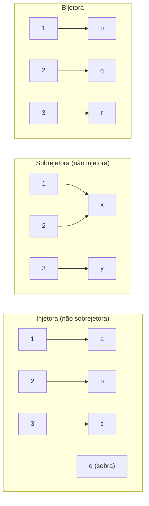
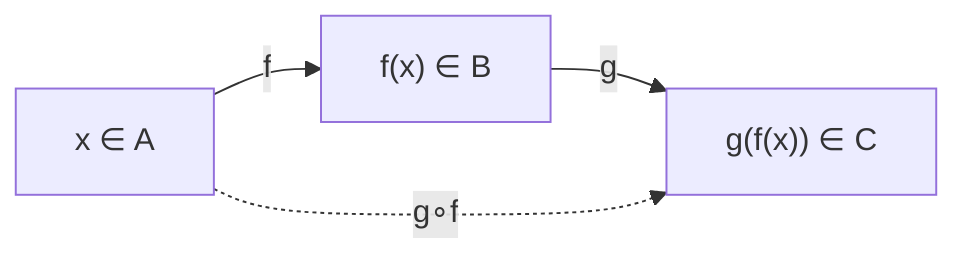
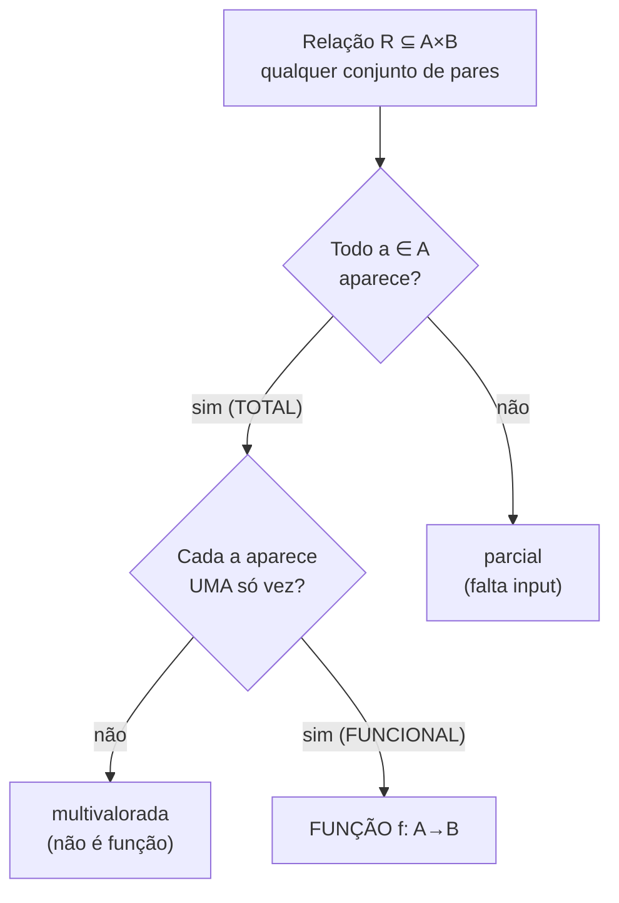
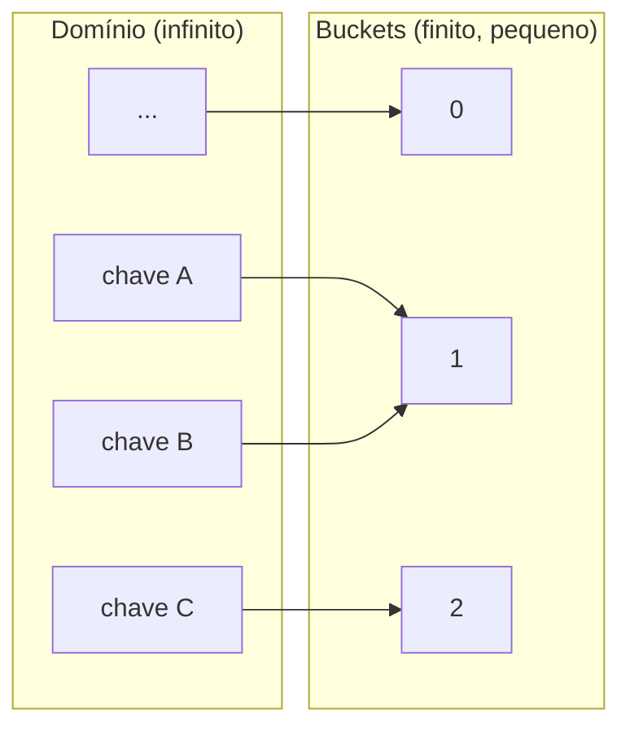

# Funções

> [!abstract] TL;DR
> Uma **função** f: A→B é uma regra que pega cada elemento do **domínio** A e devolve **exatamente um** elemento do **contradomínio** B. Nem mais, nem menos: um, e só um.
> Os três adjetivos que importam: **injetora** (não repete saída), **sobrejetora** (cobre todo o contradomínio), **bijetora** (as duas coisas — e só ela tem **inversa**).
> Função é uma [[10 - Relações|relação]] especial: total e funcional. A **bijeção** é a régua que define "mesmo tamanho" em [[13 - Cardinalidade - contável e incontável|cardinalidade]].
> No código isso vira ouro: **hash não pode ser injetora** (colisão é forçada pela casa dos pombos), **dict é função parcial**, **idempotência** é f∘f = f, e **função pura** é literalmente a função matemática — sem efeito colateral.

---

## O que é uma função, de verdade

Esqueça por um segundo a sintaxe `function foo()`. A função matemática é mais simples e mais rígida.

Você tem dois conjuntos. Um de partida, A. Um de chegada, B. Uma função f: A→B é uma **máquina determinística**: você enfia um x ∈ A, ela cospe um f(x) ∈ B.

A regra de ouro tem duas metades:

- **Totalidade**: *todo* x de A tem que produzir uma saída. Ninguém fica de fora.
- **Unicidade (ser funcional)**: cada x produz *exatamente uma* saída. Nada de "às vezes 3, às vezes 7".

> [!question] Por que "exatamente um" e não "no máximo um"?
> Porque se algum x ∈ A não tivesse saída, a máquina travaria nesse input. Função não trava. Ela é total no domínio. Se ela puder travar, ela é *parcial* — e a gente trata disso mais embaixo.

Três nomes que você confunde sob pressão:

| Nome | O que é | Símbolo |
|---|---|---|
| **Domínio** | conjunto de entrada (A) | dom f |
| **Contradomínio** | conjunto onde as saídas *podem* cair (B) | — |
| **Imagem** (*range*) | conjunto das saídas que *realmente* acontecem | f(A) ⊆ B |

A imagem é o detalhe que derruba candidato. Ela é um **subconjunto** do contradomínio. Pode ser ele inteiro, pode ser só um pedaço.

Exemplo: f: ℝ→ℝ, f(x) = x². O contradomínio é ℝ inteiro. Mas a imagem é só [0, ∞) — números negativos nunca saem. Contradomínio é a promessa; imagem é a entrega.

### Notação de mapeamento

Quando você quer dizer "x vira f(x)", usa a setinha de barra: x ↦ x². Lê-se "x mapeia para x quadrado". A seta f: A→B fala dos *conjuntos*; a seta ↦ fala dos *elementos*.

### Funções de várias variáveis

E quando a função recebe dois argumentos? Tipo `dividir(numerador, denominador)`?

Aí o domínio é um **produto cartesiano**. Uma função de duas variáveis é f: A×B→C. O input é um par ordenado (a, b). Isso é exatamente o A×B que você viu em [[04 - Teoria dos conjuntos]] — o conjunto de todos os pares.

`max: ℝ×ℝ→ℝ` recebe dois reais, devolve um. `String.concat: Σ*×Σ*→Σ*` recebe duas strings, devolve uma. Toda função multiária é só uma função de uma variável cujo domínio é uma tupla.

> [!tip] Currying: o truque do paradigma funcional
> Existe um segundo jeito de ver isso. Em vez de A×B→C, você pode encarar a função como A→(B→C): ela recebe o primeiro argumento e devolve *outra função*, que espera o segundo. Isso é **currying**, e é por que `add(2)(3)` funciona em linguagens funcionais. Matematicamente, A×B→C e A→(B→C) carregam a mesma informação — há uma bijeção entre esses dois conjuntos de funções. Aplicação parcial não é hack de linguagem; é uma identidade de teoria de conjuntos.

---

## Os três tipos: injetora, sobrejetora, bijetora

Aqui mora metade das perguntas de entrevista sobre funções. Vou desenhar os três com mapeamentos pequenos e concretos.

### Injetora (1-1)

Uma função é **injetora** quando entradas diferentes geram saídas diferentes:

x ≠ y ⟹ f(x) ≠ f(y)

Ou, na contrapositiva (forma que você usa pra *provar*): f(x) = f(y) ⟹ x = y.

Nada de duas entradas batendo no mesmo alvo. Injetora "não desperdiça" colisões — cada saída tem no máximo uma origem. É a propriedade que garante que você consegue *recuperar* a entrada a partir da saída, sem ambiguidade. ID autoincremento de banco, índice único, chave primária: todos apostam em injetividade.

### Sobrejetora (onto)

Uma função é **sobrejetora** quando *todo* elemento do contradomínio é atingido por alguém. Ou seja: imagem = contradomínio, f(A) = B. Não sobra ninguém em B sem flecha apontando pra ele. Sobrejetividade é uma afirmação sobre *cobertura*: garante que nenhuma saída possível fica inalcançável. Se o seu gerador de status devolve algo do tipo `Status`, ele é sobrejetor quando *todos* os status realmente podem acontecer — senão você tem dead code num branch que nunca roda.

### Bijetora

**Bijetora** = injetora **e** sobrejetora ao mesmo tempo. É um **emparelhamento perfeito**: cada x de A casa com um único y de B, e cada y de B tem exatamente um par em A. Casamento monogâmico, sem solteiros dos dois lados.

Vamos ver os três lado a lado. A = {1, 2, 3}, e variamos B:

> [!note] Leitura do diagrama
> - **Injetora**: cada entrada vai pra um alvo distinto (sem colisão), mas o "d" do contradomínio fica órfão — logo, *não* é sobrejetora.
> - **Sobrejetora**: o "x" recebe duas flechas (1 e 2 colidem nele) — *não* é injetora —, mas todo alvo (x, y) é coberto.
> - **Bijetora**: três entradas, três alvos, um pra um, ninguém sobrando. As flechas formam um pareamento perfeito.

Repare numa pegadinha de contagem: se |A| = |B| são *finitos*, então injetora ⟺ sobrejetora ⟺ bijetora. Numa cardinalidade finita igual, não dá pra ser uma sem ser a outra. (Em conjuntos infinitos isso *quebra* — e é justamente aí que [[13 - Cardinalidade - contável e incontável|cardinalidade]] fica interessante.)

| Tipo | Definição | Exemplo concreto |
|---|---|---|
| **Injetora** | x ≠ y ⟹ f(x) ≠ f(y) | f(n) = 2n em ℕ→ℕ (nunca repete) |
| **Sobrejetora** | imagem = contradomínio | f(x) = ⌊x⌋ de ℝ→ℤ (todo inteiro é atingido) |
| **Bijetora** | injetora E sobrejetora | f(x) = x + 1 em ℤ→ℤ (desliza sem perder ninguém) |

---

## Composição, identidade e inversa

### Composição g∘f

Encadear funções é o pão com manteiga da programação. Você passa a saída de uma como entrada da outra.

Se f: A→B e g: B→C, a **composição** g∘f: A→C é "primeiro f, depois g":

(g∘f)(x) = g(f(x))

> [!note] Leitura do diagrama
> A linha cheia mostra os dois passos reais: f leva A até B, g leva B até C. A linha tracejada é o atalho conceitual: g∘f é a função composta que vai direto de A pra C. Repare que o contradomínio de f tem que casar com o domínio de g — senão não encaixa.

Duas propriedades pra cravar:

**É associativa**: h∘(g∘f) = (h∘g)∘f. A ordem de *agrupar* não importa. Como pipe no shell — `a | b | c` dá no mesmo independente de onde você imagina os parênteses.

**NÃO é comutativa**: g∘f ≠ f∘g em geral. A ordem de *aplicar* importa muito. Calçar a meia e depois o sapato não é a mesma coisa que calçar o sapato e depois a meia.

> [!warning] g∘f lê-se da direita pra esquerda
> Em g∘f, o f age primeiro. A notação engana porque o g vem escrito na frente. Pense "g *depois de* f". Quem decora isso errado troca a ordem na prova e perde a questão.

### Função identidade

A **identidade** id_A: A→A é a função preguiçosa: id(x) = x. Devolve o que recebeu. É o elemento neutro da composição:

f∘id = f = id∘f

É o equivalente do `x => x`. Parece inútil, mas é a âncora que define o que significa "desfazer": a inversa é, por definição, a função que composta com f devolve a identidade. Sem id, a frase "f⁻¹ desfaz f" nem teria como ser escrita formalmente.

### Função inversa f⁻¹

A inversa f⁻¹: B→A é a função que **desfaz** o que f fez. Se f(x) = y, então f⁻¹(y) = x. E o teste formal: f∘f⁻¹ = id e f⁻¹∘f = id. Você vai e volta, cai onde começou.

Agora o teorema que é pura pergunta de prova:

> [!important] f tem inversa ⟺ f é bijetora
> A inversa existe **se e somente se** f é uma bijeção. E dá pra ver *por quê* olhando as duas metades:
>
> - **Precisa ser injetora.** Se f mandasse 2 e 3 ambos pro 7, então f⁻¹(7) teria que devolver... 2 ou 3? A inversa não saberia escolher. Aí ela *não seria função* (violaria a unicidade). Sem injetividade, a inversa é ambígua.
> - **Precisa ser sobrejetora.** Se algum y de B nunca fosse atingido por f, então f⁻¹(y) não teria pra onde ir. Aí a inversa *não seria total* — travaria nesse y. Sem sobrejetividade, a inversa tem buracos.
>
> Bijetora mata os dois problemas de uma vez: sem ambiguidade (injetora) e sem buracos (sobrejetora). Por isso, e só por isso, a inversa é uma função honesta.

Isso não é abstração inútil. Toda vez que você serializa e desserializa — `JSON.stringify` / `JSON.parse`, `encode` / `decode` — você está apostando que existe uma inversa. Quando a "inversa" perde informação (truncou um float, normalizou um caractere), o round-trip quebra. E aí você descobre, na pior hora, que aquele encoding *não era bijetivo*.

> [!tip] Inversa à esquerda × inversa à direita
> O teorema completo tem uma versão mais fina, que cai em entrevista mais avançada:
> - Se f é **só injetora**, ela tem uma **inversa à esquerda** g com g∘f = id_A (dá pra desfazer a ida, mas g não precisa ser função total partindo de B inteiro).
> - Se f é **só sobrejetora**, ela tem uma **inversa à direita** h com f∘h = id_B (toda saída tem origem, mas pode haver várias).
> - Só quando ela é **bijetora** as duas coincidem numa única f⁻¹ que serve dos dois lados. É o caso "limpo" — e o único em que falamos da inversa, no singular.

Resumindo a álgebra da composição numa tabela:

| Propriedade | Vale? | Consequência prática |
|---|---|---|
| Associatividade `h∘(g∘f) = (h∘g)∘f` | sempre | pode encadear pipes sem se preocupar com agrupamento |
| Comutatividade `g∘f = f∘g` | **não** em geral | a ordem das transformações importa |
| Identidade `f∘id = f` | sempre | id é o neutro; base pra definir inversa |
| Inversa `f∘f⁻¹ = id` | só se f bijetora | round-trip seguro só com bijeção |
| Composta de injetoras é injetora | sim | pipelines 1-1 preservam unicidade |
| Composta de sobrejetoras é sobrejetora | sim | pipelines onto preservam cobertura |

> [!note] Leitura da tabela
> As duas últimas linhas são as que surpreendem: injetividade e sobrejetividade *sobrevivem à composição*. Se cada estágio do seu pipeline é 1-1, o pipeline inteiro é 1-1 — nenhuma informação de identidade se perde no caminho. É por isso que encadear transformações reversíveis (encode → comprimir → cifrar) ainda dá um round-trip reversível.

---

## Parciais × totais, piso e teto

### Funções parciais

Até agora exigimos que f cubra *todo* o domínio. Mas e funções que falham em alguns inputs?

Uma **função parcial** f: A⇀B é definida só em um *subconjunto* de A. Pra alguns x, ela simplesmente não tem resposta.

> [!example] Todo programa que pode falhar é uma função parcial
> Pense em `dividir(a, b) = a / b`. Domínio "pretendido": ℝ×ℝ. Mas em b = 0 ela explode. Ela **não está definida** nesse ponto — é parcial.
>
> Generalizando: uma rotina que pode lançar exceção, entrar em loop infinito, ou retornar `null` pra entradas válidas, é a encarnação computacional de uma **função parcial**. A matemática já tinha um nome pro seu `NullPointerException` antes de você nascer.

A função é **total** quando é definida em *todo* A — sem buracos, sem exceções. O ideal de robustez ("essa função nunca quebra, pra qualquer input válido") é literalmente "essa função é total".

### Piso ⌊x⌋ e teto ⌈x⌉

Duas funções de ℝ→ℤ que aparecem o tempo todo em CS:

- **Piso** ⌊x⌋: o maior inteiro ≤ x. Arredonda *pra baixo*. ⌊3.7⌋ = 3, ⌊-1.2⌋ = -2.
- **Teto** ⌈x⌉: o menor inteiro ≥ x. Arredonda *pra cima*. ⌈3.2⌉ = 4, ⌈-1.8⌉ = -1.

> [!tip] A regrinha pra não errar negativo
> Piso vai em direção a −∞, teto vai em direção a +∞. Pra positivos é "intuitivo"; pra negativos, lembre que piso *desce* (⌊-1.2⌋ = -2, não -1).

Onde isso bate no seu código:

| Caso de uso | Fórmula | Por quê |
|---|---|---|
| Nº de páginas | ⌈n/k⌉ | n itens, k por página: a última página parcial ainda conta uma inteira |
| Divisão inteira | a div b = ⌊a/b⌋ | `//` em Python, `/` entre ints em C/Java |
| Particionar em lotes | ⌈total/lote⌉ | quantas levas pra processar tudo |
| Índice do meio | ⌊(lo+hi)/2⌋ | busca binária, sem cair em fracionário |
| Altura de árvore binária cheia | ⌊log₂ n⌋ | níveis a partir de n nós |

O caso da paginação é o canônico. 95 itens, 10 por página? `95/10 = 9.5`. Piso daria 9 (e os últimos 5 itens sumiriam). É **teto**: ⌈9.5⌉ = 10 páginas. Errar piso/teto aqui é bug de "cadê o último registro".

> [!tip] Identidade que salva: ⌈n/k⌉ = ⌊(n + k − 1) / k⌋
> Muitas linguagens só te dão divisão inteira (piso). Pra computar o teto sem ponto flutuante — e sem o erro de arredondamento que o float traz —, use o truque do "empurrão": ⌈n/k⌉ = ⌊(n + k − 1) / k⌋. Adicionar k−1 antes de dividir empurra qualquer resto pra cima. É a forma idiomática de paginar em código inteiro puro, e evita aquele bug sutil de `Math.ceil(a/b)` falhando com floats grandes.

Piso e teto também são o exemplo mais palpável de função **sobrejetora mas não injetora**: ⌊·⌋: ℝ→ℤ atinge *todo* inteiro (sobrejetora), mas esmaga todo o intervalo [3, 4) no mesmo 3 (longe de injetora). Quantização — converter contínuo em discreto — é sempre destrutiva por natureza, e a matemática registra isso como "não injetora".

---

## Função é uma relação especial

Aqui o conceito sobe um andar e se conecta com [[10 - Relações]].

Uma [[10 - Relações|relação]] de A pra B é qualquer subconjunto de A×B — qualquer coleção de pares (a, b). Bagunça total: um a pode se relacionar com zero, um ou vários b.

Uma **função é uma relação que obedece duas restrições**:

> [!note] Leitura do diagrama
> Partimos de uma relação qualquer. O primeiro filtro é **totalidade**: todo elemento de A precisa estar coberto — senão é parcial. O segundo é ser **funcional** (univalente): cada a pode aparecer em um único par — senão é multivalorada e não vale como função. Quem passa nos dois filtros é função. Função é o caso domesticado da relação: total e funcional.

Resumindo o slogan: **toda função é uma relação, mas nem toda relação é função.** A relação é o gênero; a função é a espécie bem-comportada.

### A bijeção prepara cardinalidade

E a peça mais bonita: a **bijeção** é a ferramenta que define "ter o mesmo tamanho".

Como você prova que dois conjuntos têm a mesma quantidade de elementos *sem contar*? Você pareia. Se existe uma bijeção entre A e B, eles têm a **mesma cardinalidade**. Ponto.

Isso parece óbvio pra conjuntos finitos (3 cadeiras, 3 pessoas, todo mundo sentado: bijeção). Mas é *o método* pra conjuntos infinitos, onde "contar" não faz sentido. ℕ e os pares têm o mesmo tamanho porque n ↦ 2n é uma bijeção. Esse é o trampolim pra [[13 - Cardinalidade - contável e incontável]] — "contável" significa, no fundo, "existe bijeção com ℕ".

---

## Prática: funções no código

Agora o ângulo dev, que é onde isso deixa de ser folclore e vira intuição operacional.

### Hash: colisão é matemática, não bug

Uma **função de hash** mapeia um domínio gigante (todas as strings possíveis, todos os objetos) num contradomínio minúsculo (digamos, 2⁶⁴ valores, ou os índices de um array).

Domínio grande, contradomínio pequeno. Pelas regras que vimos, **ela não pode ser injetora**. Impossível. E o motivo tem nome:

> [!note] Leitura do diagrama
> A "chave A" e a "chave B" caem no mesmo bucket 1 — isso é uma **colisão**. Não é azar nem bug: com mais pombos (chaves) do que casas (buckets), *alguma* casa recebe dois. É a [[12 - Princípios combinatórios - casa dos pombos e inclusão-exclusão|casa dos pombos]] em ação: se |domínio| > |contradomínio|, a função não tem como ser injetora — pelo menos duas entradas colidem, *garantido*.

Por isso toda hash table precisa de uma estratégia de colisão (chaining, open addressing). Não porque o algoritmo de hash é ruim — porque a *matemática proíbe* injetividade aqui. Uma "hash sem colisão" só existe se o domínio for ≤ o contradomínio (hashing perfeito, caso especial e raro).

### Map/dict é função parcial

Um `Map` ou `dict` é, literalmente, uma **função parcial** chave→valor. Ele está definido só nas chaves que você inseriu. Pedir uma chave ausente cai no caso "não definido": `KeyError`, `undefined`, `Optional.empty()`. Aquele `.get(k, default)` é você *totalizando* a função parcial — dando uma saída pra todo input, inclusive os de fora do domínio real.

### Idempotência: f∘f = f

Uma operação é **idempotente** quando aplicá-la duas vezes dá no mesmo que aplicar uma:

f(f(x)) = f(x), ou seja f∘f = f

Aplicou uma vez, aplicou mil, mesmo resultado. Isso é precioso em sistemas distribuídos, onde mensagens se repetem e você não controla quantas vezes algo roda:

- **PUT e DELETE em REST** são (devem ser) idempotentes. `DELETE /user/42` dez vezes deixa o mesmo estado: usuário 42 não existe. `POST` *não* é — dez POSTs criam dez recursos.
- **Deploys e migrações reentrantes**: `CREATE TABLE IF NOT EXISTS`, `kubectl apply`. Rodar de novo não estraga; converge pro mesmo estado.
- **Retries seguros**: se a operação é idempotente, reenviar depois de um timeout é inofensivo. Se não, você duplica a cobrança do cartão.

`abs(x)` é idempotente: `abs(abs(x)) = abs(x)`. `x + 1` não é. Saber qual é qual decide se seu retry é seguro.

> [!question] Toda função idempotente é também uma projeção?
> Quase. Se f∘f = f, então f *fixa* tudo que está na sua própria imagem: pra todo y na imagem, f(y) = y. A função "se acomoda" depois do primeiro passo e não mexe mais. `abs` leva ℝ em [0, ∞) e, uma vez lá, todo valor é ponto fixo. Pensar em idempotência como "chegar a um ponto fixo na primeira aplicação" é a intuição que conecta a álgebra ao seu `kubectl apply` convergindo pro estado desejado.

### Funções puras = a função matemática de verdade

Uma **função pura** é a que mais se aproxima da definição matemática: mesma entrada ⟹ sempre a mesma saída, e **zero efeito colateral** (não escreve em disco, não muta estado global, não lê o relógio). Ela *é* um mapeamento A→B, nada mais.

Funções impuras (que dependem do tempo, de I/O, de variável global) nem são funções no sentido matemático — `now()` devolve coisas diferentes pra mesma entrada vazia, violando a unicidade. Toda a disciplina de pureza no [[Paradigmas de Programação|paradigma funcional]] é, no fundo, "trate suas funções como funções matemáticas de verdade", e ganhe testabilidade e raciocínio de graça.

### Encoding bijetivo e o round-trip

Base64, URL-safe encoding, percent-encoding — são pensados pra serem **bijetivos** (ou injetivos) num domínio controlado: cada sequência de bytes vira uma string, e essa string volta exatamente aos mesmos bytes. `decode(encode(x)) = x`. Isso é dizer que decode é a **inversa** de encode.

Serialização/desserialização é a versão prática e imperfeita disso. Quando funciona, `parse(stringify(x))` recupera x — encode e decode são (quase) inversas. Quando *não* recupera (você perdeu a ordem das chaves, truncou precisão, normalizou Unicode), você descobriu na marra que aquele par não era bijetivo. Todo bug de "salvei e voltou diferente" é uma inversa que mentiu.

---

> [!summary] Resumo em uma linha
> Função é o mapeamento total-e-único A→B; injetora não repete saída, sobrejetora cobre o contradomínio, bijetora faz os dois e ganha inversa — e essa tríade explica hash (colisão forçada), dict (parcial), idempotência (f∘f = f) e função pura (a coisa real) no seu código.

## Em entrevista

Funções aparecem em entrevista por dois caminhos: direto ("o que é uma função injetora?") e indireto, escondido em hash tables, idempotência de API e desenho de sistemas. O truque é traduzir o conceito matemático pro impacto prático na hora — não recitar a definição, mas conectar "domínio grande, contradomínio pequeno" a "logo, colisões são inevitáveis, logo preciso de chaining". Saber *por que* a inversa exige bijeção e *por que* a casa dos pombos força colisão te diferencia de quem só decorou.

*A function maps each input from the domain to exactly one output in the codomain.*
*A function is injective when distinct inputs always produce distinct outputs.*
*It's surjective when every element of the codomain is actually hit; bijective means both.*
*A function has an inverse if and only if it's a bijection — no ambiguity, no gaps.*
*Composition isn't commutative: g after f is generally different from f after g.*
*A hash function can't be injective because the domain is larger than the codomain.*
*By the pigeonhole principle, collisions are mathematically guaranteed, not a bug.*
*An operation is idempotent when applying it twice equals applying it once.*
*A pure function is the real mathematical function — same input, same output, no side effects.*

| Português | English |
|---|---|
| função | function |
| domínio | domain |
| contradomínio | codomain |
| imagem | image / range |
| mapeamento | mapping |
| injetora (um-a-um) | injective (one-to-one) |
| sobrejetora | surjective (onto) |
| bijetora | bijective |
| composição | composition |
| função identidade | identity function |
| função inversa | inverse function |
| função parcial | partial function |
| função total | total function |
| piso | floor |
| teto | ceiling |
| função pura | pure function |
| idempotência | idempotence |
| colisão (de hash) | (hash) collision |

> [!info] Lastro
> - Rosen, Kenneth. *Discrete Mathematics and Its Applications* — capítulo "Functions" (injective/surjective/bijective, composition, inverse, floor & ceiling). [Slides Rutgers CS205, seção 1.6/2.3](https://people.cs.rutgers.edu/~elgammal/classes/cs205/functions_2.pdf)
> - Lehman, Leighton & Meyer. *Mathematics for Computer Science* (MIT 6.042J) — bijeções, regra da bijeção e o princípio da casa dos pombos aplicado a colisões de hash. [PDF MIT CSAIL](https://people.csail.mit.edu/meyer/mcs.pdf) · [Pigeonhole — LibreTexts](https://eng.libretexts.org/Bookshelves/Computer_Science/Programming_and_Computation_Fundamentals/Mathematics_for_Computer_Science_(Lehman_Leighton_and_Meyer)/03:_Counting/14:_Cardinality_Rules/14.08:_The_Pigeonhole_Principle)
> - [Hash collision — Wikipedia](https://en.wikipedia.org/wiki/Hash_collision): colisão garantida quando o número de objetos excede o de valores de hash (casa dos pombos).
> - Conexões internas: [[04 - Teoria dos conjuntos]], [[10 - Relações]], [[12 - Princípios combinatórios - casa dos pombos e inclusão-exclusão]], [[13 - Cardinalidade - contável e incontável]].
