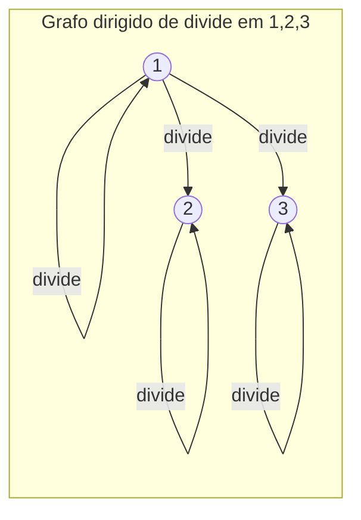
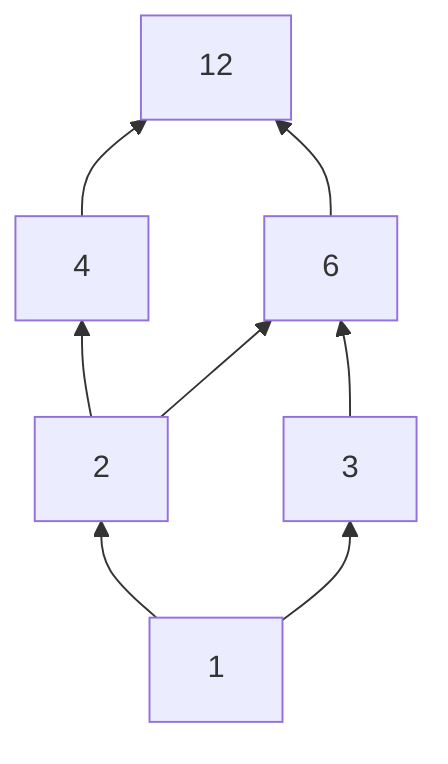
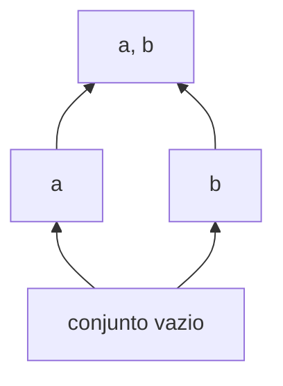
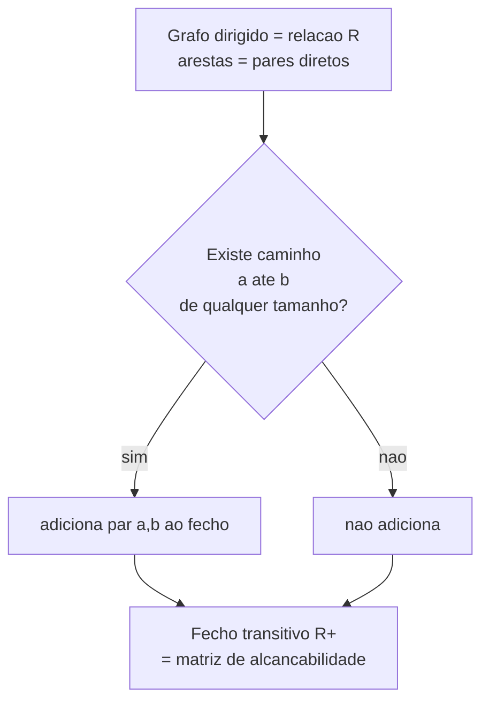
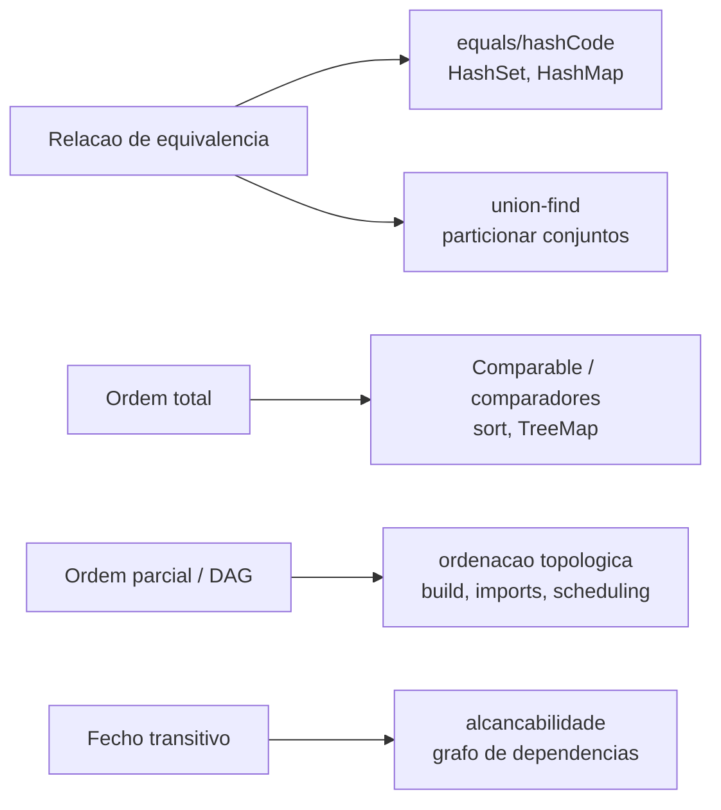

# Relações

> [!abstract] TL;DR
> Uma **relação** é só um conjunto de pares ordenados — nada mais místico que isso. R ⊆ A×B diz quais elementos "se conversam". Quando a relação fala de um conjunto consigo mesmo (R ⊆ A×A), ela ganha **propriedades**: reflexiva, simétrica, antissimétrica, transitiva. A combinação dessas propriedades dá nome a duas estruturas que você usa todo dia sem perceber. **Equivalência** (reflexiva + simétrica + transitiva) particiona o conjunto em classes — é o que seu `equals` deveria sempre ser. **Ordem parcial** (reflexiva + antissimétrica + transitiva) organiza o conjunto numa hierarquia — é o que seu `Comparable` e sua ordenação topológica precisam respeitar. Quebre uma dessas propriedades e o `HashSet` perde elementos, o `sort` entra em loop e o build não resolve a ordem dos módulos.

---

## O que é uma relação, no osso

Esqueça por um segundo a palavra "relação" e pense em uma pergunta de sim/não entre dois elementos.

"3 é menor que 5?" Sim. "7 divide 12?" Não. "João é irmão de Maria?" Talvez.

Uma **relação binária** é exatamente isso: uma regra que, dado um par (a, b), responde sim ou não. E como toda regra de sim/não pode ser representada pelo **conjunto dos pares que dizem sim**, a definição formal é desconcertantemente simples.

> [!info] Definição
> Dados conjuntos A e B, uma **relação binária** R de A em B é qualquer subconjunto do produto cartesiano: R ⊆ A×B Quando A = B, dizemos que R é uma relação **em A**: R ⊆ A×A.

O produto cartesiano A×B é o saco com **todos** os pares possíveis. A relação é o subconjunto que você escolhe ficar. Por isso relação é, literalmente, conjunto — tudo que você sabe de [[04 - Teoria dos conjuntos]] vale aqui: união de relações, interseção, complemento, vazia, total.

Quando o par (a, b) ∈ R, escrevemos **a R b** ("a se relaciona com b"). Notações que você já conhece são só açúcar sintático em cima disso: 3 ≤ 5 quer dizer (3, 5) ∈ ≤. O símbolo ≤ É a relação.

> [!tip] A virada de chave
> Você passou anos pensando em ≤, =, ∣ (divide), ⊆ como "operadores". Eles são **conjuntos de pares**. Essa troca de lente é o que destrava o resto da nota.

### Exemplo concreto

Seja A = {1, 2, 3} e R = "divide" (∣). Os pares que dizem sim:

(1,1), (1,2), (1,3), (2,2), (3,3)

Por quê? 1 divide tudo. 2 divide 2. 3 divide 3. Mas 2 não divide 3, então (2,3) fica de fora. Essa é a relação inteira — cinco pares.

---

## Como desenhar uma relação

Uma relação em A pode ser representada de dois jeitos que vão reaparecer a vida toda em CS: **matriz** e **grafo dirigido**.

A **matriz booleana** M tem uma linha e uma coluna para cada elemento. M[i][j] = 1 se i R j, senão 0. O **grafo dirigido** tem um nó por elemento e uma seta a → b para cada par (a, b) ∈ R.

Vamos materializar o exemplo de ∣ em {1, 2, 3}.

**Leitura do diagrama**: cada nó é um número; cada seta é um par da relação. Os laços (1→1, 2→2, 3→3) são os pares onde o elemento se relaciona consigo mesmo. Note que 1 alcança todo mundo (1 divide tudo), mas 2 e 3 só têm o laço — não dividem um ao outro. A mesma informação na matriz:

| ∣ (divide) | 1 | 2 | 3 |
|---|---|---|---|
| **1** | 1 | 1 | 1 |
| **2** | 0 | 1 | 0 |
| **3** | 0 | 0 | 1 |

**Leitura da tabela**: a linha i, coluna j vale 1 quando i divide j. A diagonal toda preenchida (todo número divide a si mesmo) é uma pista visual que vamos usar para detectar **reflexividade** já já. Guarde essa imagem: matriz e grafo são o mesmo objeto em duas roupas.

> [!note] Por que isso importa para o dev
> A matriz booleana é como o algoritmo de Warshall calcula **alcançabilidade**; o grafo dirigido é como você modela **dependências**. Toda a parte prática desta nota nasce desses dois retratos.

---

## As cinco propriedades

Quando R é uma relação **em A** (mesmo conjunto dos dois lados), perguntamos sobre seu formato. Cinco propriedades dominam tudo. Decore-as como se fossem cláusulas de um contrato — porque, em código, elas literalmente são.

| Propriedade | Definição (∀ a, b, c ∈ A) | Em palavras | Exemplo que satisfaz | Exemplo que falha |
|---|---|---|---|---|
| **Reflexiva** | ∀a, a R a | todo elemento se relaciona consigo | =, ≤, ∣, ⊆ | "é irmão de" (não é irmão de si mesmo) |
| **Irreflexiva** | ∀a, ¬(a R a) | nenhum elemento se relaciona consigo | < (estrito), "é irmão de" | ≤ (pois a ≤ a) |
| **Simétrica** | a R b ⟹ b R a | seta sempre tem volta | =, "mesma cor", "é irmão de" | ≤ (3 ≤ 5 mas 5 ⋨ 3) |
| **Antissimétrica** | a R b ∧ b R a ⟹ a = b | só volta se for o mesmo nó | ≤, ∣, ⊆ | "mesma cor" (a, b distintos voltam) |
| **Transitiva** | a R b ∧ b R c ⟹ a R c | atalho sempre existe | =, ≤, ∣, ⊆, < | "é amigo de" (amigo do amigo não é amigo) |

**Leitura da tabela**: cada linha é uma cláusula com quantificador. Reflexiva e irreflexiva são opostas, mas cuidado — uma relação pode ser **nenhuma das duas** (basta ter alguns laços e outros não). Simétrica e antissimétrica **também** não são opostas: a igualdade = é as duas ao mesmo tempo (a única "ida e volta" permitida pela antissimetria é a = b, e a igualdade só tem pares assim).

> [!warning] A armadilha clássica de entrevista
> "Antissimétrica é o contrário de simétrica?" **Não.** Antissimétrica proíbe voltas entre elementos **distintos**. A igualdade = satisfaz as duas. Uma relação vazia satisfaz as duas. Não caia nessa.

Visualmente, no grafo dirigido cada propriedade vira um "carimbo" que você procura de relance:

> [!example] As assinaturas visuais no grafo
> - **Reflexiva**: laço em **todo** nó.
> - **Simétrica**: **toda** seta tem a volta (arcos bidirecionais).
> - **Antissimétrica**: **nenhuma** volta entre nós distintos.
> - **Transitiva**: se há caminho a→b→c, tem que haver o atalho a→c.
>
> Treine esse olhar: metade das questões sobre relações é só "qual carimbo esse desenho tem?".

### Lendo as propriedades na matriz booleana

A matriz dá atalhos visuais ainda mais rápidos. Use M[i][j] = 1 quando i R j:

- **Reflexiva** ⟺ a **diagonal principal** é toda 1 (cada elemento se relaciona consigo).
- **Irreflexiva** ⟺ a diagonal é toda 0.
- **Simétrica** ⟺ a matriz é **igual à sua transposta** (M = Mᵀ): espelho perfeito pela diagonal.
- **Antissimétrica** ⟺ para i ≠ j, M[i][j] e M[j][i] **nunca** valem 1 ao mesmo tempo.
- **Transitiva** ⟺ M "ao quadrado" (no sentido booleano) não acrescenta nenhum 1 novo: se há caminho de 2 passos, a aresta direta já existe.

> [!tip] Truque de prova
> Para checar transitividade de uma relação pequena à mão, calcule o produto booleano M ⊙ M (linha vezes coluna com OR-AND). Se todo 1 que aparecer já estava em M, ela é transitiva. Esse é exatamente o passo que o **fecho transitivo** vai automatizar mais adiante — guarde a conexão.

---

## Relação de equivalência: agrupar é o destino

Pegue três propriedades específicas — **reflexiva + simétrica + transitiva** — e algo mágico acontece. A relação para de "ordenar" e começa a "agrupar".

> [!info] Definição
> Uma **relação de equivalência** em A é reflexiva, simétrica e transitiva. Costuma-se escrever a ≡ b ou a ~ b em vez de a R b.

Por que essas três geram agrupamento? Pense intuitivamente:
- **Reflexiva**: todo elemento está no seu próprio grupo (ninguém fica de fora).
- **Simétrica**: se a está no grupo de b, então b está no grupo de a (grupo não tem dono).
- **Transitiva**: se a e b estão juntos e b e c estão juntos, então a e c estão juntos (grupos não vazam um no outro).

O resultado é a **classe de equivalência** de a: o conjunto de todos os elementos equivalentes a ele, escrito [a] = { x ∈ A ∣ x ~ a }.

E aqui está o teorema que faz tudo valer a pena.

> [!abstract] Teorema fundamental
> Toda relação de equivalência em A **particiona** A em classes disjuntas. E toda **partição** de A induz uma relação de equivalência (x ~ y se estão no mesmo bloco). Equivalências e partições são **a mesma coisa** vista de dois ângulos.

Uma **partição** é uma divisão de A em blocos não vazios, disjuntos, que cobrem A inteiro. Cada classe vira um bloco. Cada elemento mora em **exatamente uma** classe.

**Leitura do diagrama**: leia da esquerda para a direita — uma equivalência produz classes, classes formam uma partição. A seta tracejada que volta fecha o ciclo: dada a partição, você recupera a equivalência. Esse vai-e-volta é o coração da ideia. Sempre que você "agrupa por uma característica", está construindo uma equivalência.

### Exemplos que você reconhece

- **Igualdade (=)**: a equivalência mais fina. Cada classe tem um único elemento. Partição em blocos unitários.
- **Mesma cor**: "x ~ y se têm a mesma cor". As classes são os conjuntos de objetos vermelhos, azuis, verdes. Partição por cor.
- **Congruência mod m**: a ≡ b (mod m) quando m divide (a − b). Particiona os inteiros em m classes — os **restos** 0, 1, …, m−1. Essa é a equivalência mais importante para CS; ela é o terreno de [[15 - Aritmética modular e Fermat-Euler]]. Hash com `% m` é literalmente jogar chaves em classes de equivalência mod m.

Repare como a congruência satisfaz as três cláusulas: a ≡ a (resto de a−a = 0, divisível por m → reflexiva); se m ∣ (a−b) então m ∣ (b−a) → simétrica; se m ∣ (a−b) e m ∣ (b−c) então m ∣ (a−c) somando → transitiva. A matemática casa exatamente com a intuição de "mesmo resto".

> [!tip] Por que classes são úteis
> Você troca "tratar cada elemento" por "tratar cada classe". Em vez de 2³² inteiros, você raciocina sobre m restos. Em vez de mil objetos, três cores. Equivalência é compressão de raciocínio.

> [!question] E o `hashCode`?
> Por que o contrato de Java exige "se `a.equals(b)` então `a.hashCode() == b.hashCode()`"? Porque o hash precisa ser **constante dentro de cada classe de equivalência**. Se dois elementos da mesma classe caíssem em buckets diferentes, o `HashMap` os trataria como distintos e perderia a busca. O hash tem que respeitar a partição que o `equals` define. É a equivalência ditando a regra de baixo nível.

---

## Ordem parcial: hierarquia sem ditadura

Troque uma propriedade. **Reflexiva + antissimétrica + transitiva** (a simetria saiu, entrou a antissimetria). Agora a relação não agrupa — ela **ordena**.

> [!info] Definição
> Uma **ordem parcial** em A é reflexiva, antissimétrica e transitiva. Escreve-se a ⪯ b. O par (A, ⪯) é um **conjunto parcialmente ordenado** (poset).

Por que "parcial"? Porque nem todo par precisa ser comparável. Em uma **ordem total**, dois elementos quaisquer SEMPRE se comparam: ∀ a, b vale a ⪯ b ou b ⪯ a. Em uma ordem parcial, podem existir elementos **incomparáveis** — nenhum dos dois precede o outro.

| | Ordem parcial | Ordem total (linear) |
|---|---|---|
| Propriedades | reflexiva + antissimétrica + transitiva | parcial **+** todo par é comparável |
| Incomparáveis? | pode haver | nunca |
| Exemplo | ⊆ no conjunto potência; ∣ nos divisores | ≤ nos inteiros; ordem alfabética |
| Desenho | DAG / Hasse com ramos | uma linha |

**Leitura da tabela**: ordem total é um caso especial de ordem parcial — a que não deixa nenhum par solto. O ≤ dos números é total (qualquer par de números se compara). Mas ∣ (divisão) é só parcial: 2 e 3 são **incomparáveis**, nenhum divide o outro. Essa incomparabilidade é o que permite que coisas aconteçam em paralelo — segure esse pensamento até a ordenação topológica.

### Diagrama de Hasse

Desenhar todas as setas de uma ordem parcial polui (laços de reflexividade, atalhos de transitividade). O **diagrama de Hasse** limpa tudo: remove os laços, remove as arestas que a transitividade implica, e desenha "maior em cima". Sobra só a estrutura essencial — a relação de **cobertura** (quem está logo acima de quem).

Vamos o caso canônico: divisores de 12 sob ∣ (divide).

**Leitura do diagrama**: leia de baixo para cima — uma aresta a → b significa "a divide b e b é o próximo acima". 1 está embaixo (divide todo mundo, é o **mínimo**); 12 está no topo (todos dividem ele, é o **máximo**). Note que 4 e 6 são **incomparáveis** — estão lado a lado, sem aresta entre eles (4 não divide 6 nem vice-versa). A transitividade está implícita: 1 divide 12, mas não desenhamos a aresta direta — você a infere subindo pelo caminho. Isso é uma ordem **parcial**, não total, justamente por causa de pares incomparáveis como (4, 6) e (2, 3).

### Vocabulário do poset

- **Maximal**: ninguém está acima dele (não há b com a ⪯ b, a ≠ b). Pode haver vários.
- **Minimal**: ninguém está abaixo. Pode haver vários.
- **Máximo**: está acima de **todos**. É único se existir (12, no exemplo).
- **Mínimo**: está abaixo de todos. Único se existir (1, no exemplo).

> [!warning] Maximal ≠ máximo
> "Maximal" é local ("ninguém acima de mim"); "máximo" é global ("estou acima de todos"). Num poset com ramos paralelos pode haver **vários maximais e nenhum máximo**. Confundir os dois é erro clássico. Pense em "filhos sem pais" (vários minimais) versus "a raiz única".

Outro poset famoso: o **conjunto potência** sob ⊆. Para {a, b}, os subconjuntos ∅, {a}, {b}, {a,b} formam um quadrado — {a} e {b} incomparáveis no meio, ∅ no fundo, {a,b} no topo. É o mesmo formato do Hasse de divisores, e não por acaso: containment de conjuntos é o protótipo de toda ordem parcial.

**Leitura do diagrama**: o Hasse de ⊆ no conjunto potência de {a, b}. O vazio embaixo (mínimo — está contido em todos), {a,b} no topo (máximo — contém todos), e {a} e {b} **incomparáveis** lado a lado (nenhum contém o outro). Compare mentalmente com o Hasse dos divisores de 12: mesmo esqueleto de "diamante". O fato de Rosen e Lehman usarem containment de conjuntos como representação universal de posets vem daí — todo poset finito pode ser desenhado como conjuntos sob ⊆.

---

## Fechos: completar o que falta

Às vezes você tem uma relação que **quase** tem uma propriedade. O **fecho** é a menor extensão dela que satisfaz a propriedade — você adiciona os pares mínimos necessários, nem um a mais.

| Fecho | O que adiciona | Resultado |
|---|---|---|
| **Reflexivo** | todos os pares (a, a) faltantes | passa a ter laço em todo nó |
| **Simétrico** | a volta (b, a) de cada (a, b) | passa a ter ida-e-volta sempre |
| **Transitivo** | (a, c) sempre que há a→b→c | **alcançabilidade** completa |

**Leitura da tabela**: cada fecho é "adicione o mínimo para satisfazer a propriedade X". O reflexivo e o simétrico são simples. O **transitivo** é o herói da computação.

### Fecho transitivo = alcançabilidade

Pegue um grafo dirigido (que é uma relação, lembra?). O **fecho transitivo** responde: "existe um caminho de a até b?" — não uma aresta direta, mas **qualquer** caminho. Isso é exatamente a relação de **alcançabilidade**.

**Leitura do diagrama**: para cada par de nós, pergunte se um alcança o outro por algum caminho; se sim, o par entra no fecho. O resultado é a matriz de alcançabilidade — quem chega em quem. O algoritmo de **Warshall** (e o **Floyd-Warshall** para a variante com pesos) computa isso em O(n³) operando exatamente na matriz booleana que vimos lá no começo. É um BFS/DFS "de todos para todos" empacotado em três laços aninhados. Quando precisar do como, os detalhes vivem na trilha de algoritmos e em [[16 - Teoria dos grafos - o lado matemático]].

---

## Relação versus função: o caso especial

Você já viu funções em [[09 - Funções]]. Eis a conexão: **toda função é uma relação** — uma relação muito disciplinada.

Uma função f: A → B é uma relação R ⊆ A×B que obedece a duas regras extras:

- **Total**: todo a ∈ A aparece em **algum** par (cada entrada tem saída).
- **Funcional** (determinística): cada a aparece em **no máximo um** par (cada entrada tem **uma** saída, não duas).

> [!note] A hierarquia
> Relação ⊃ relação total ⊃ função (total + funcional). Uma função é uma relação que promete: "para cada entrada, exatamente uma saída". Se você relaxar "exatamente uma" para "pelo menos uma", vira relação total. Se relaxar tudo, vira relação qualquer. Por isso bancos modelam relacionamentos N:N com tabelas de junção — são relações que **não** cabem numa função.

---

## Prática: onde isso te morde no código

Agora a parte que separa quem decorou de quem entendeu. Essas estruturas não são enfeite acadêmico — elas estão soldadas dentro das suas bibliotecas-padrão.

**Leitura do diagrama**: cada conceito matemático da esquerda vira uma ferramenta concreta à direita. Vamos um por um.

### 1. `equals`/`==` DEVE ser equivalência

O contrato de `equals` em Java (e o equivalente em qualquer linguagem) **exige** as três propriedades:

- **Reflexivo**: `x.equals(x)` é sempre `true`.
- **Simétrico**: `x.equals(y)` ⟺ `y.equals(x)`.
- **Transitivo**: `x.equals(y)` ∧ `y.equals(z)` ⟹ `x.equals(z)`.

Não é capricho do JavaDoc — é o que torna agrupamento coerente. Um `HashSet` agrupa elementos em classes "são o mesmo". Se você quebra a transitividade (clássico: `equals` que compara com tolerância, tipo "quase igual"), a noção de classe **desmorona**: o set pode conter dois elementos que ele próprio considera iguais, ou perder um insert silenciosamente. Bugs que só aparecem em produção, com dados grandes, sem stack trace. A causa-raiz é matemática: você prometeu uma equivalência e entregou outra coisa.

### 2. `Comparable`/comparadores DEVEM dar ordem total consistente

Ordenar exige uma ordem **total** bem-comportada. O `compareTo` precisa ser antissimétrico (se a ≤ b e b ≤ a então são "iguais" para a ordenação) e transitivo (a ≤ b e b ≤ c ⟹ a ≤ c). Quebre isso e:

- o resultado do `sort` vira lixo não determinístico, ou
- em runtimes modernos (o TimSort do Java detecta inconsistência) você toma um **`IllegalArgumentException: Comparison method violates its general contract`** — o algoritmo se recusa a confiar no seu comparador.

A causa quase sempre é um comparador que não é transitivo (ex.: comparar por proximidade, ou `a - b` com overflow de inteiros). De novo: violação de uma propriedade de relação virando exception em produção.

Há um detalhe fino que entrevistadores adoram: ordenação precisa de **ordem total**, mas a maioria dos comparadores reais define só uma **ordem parcial** (empates — elementos "iguais" para o critério). Um `sort` lida com isso fixando uma regra de desempate (estável ou não). Quando você ordena pessoas por idade, idades iguais são incomparáveis pelo critério; o `sort` ainda precisa colocá-las em **alguma** ordem. É de novo a história de "estender ordem parcial a total" — a mesma da topológica, em escala miúda.

### 3. Ordenação topológica: estender ordem parcial a total

Esse é o ângulo mais bonito. Você tem um **DAG** de dependências — uma **ordem parcial** onde a → b significa "a precisa vir antes de b". Mas a máquina executa em **sequência**, uma coisa por vez: precisa de uma **ordem total**.

A **ordenação topológica** faz exatamente a ponte: ela **estende** a ordem parcial a uma ordem total linear que respeita todas as dependências (uma *extensão linear* do poset). Onde havia elementos incomparáveis (que poderiam rodar em qualquer ordem entre si), ela escolhe uma sequência arbitrária mas consistente.

Onde isso vive no seu dia:
- **Build systems** (Make, Bazel, Gradle): qual alvo compilar primeiro.
- **Resolução de módulos/imports**: ordem de inicialização sem usar coisa ainda não carregada.
- **Task scheduling**: tarefas com pré-requisitos.
- **Migrações de banco**: aplicar na ordem das dependências de schema.

> [!danger] Por que um ciclo quebra tudo
> Se houver um **ciclo** (a → b → … → a), não existe ordenação topológica. E a razão é puramente sobre relações: um ciclo viola a **antissimetria**. Você teria a ⪯ b **e** b ⪯ a com a ≠ b, o que uma ordem parcial proíbe. Sem ordem parcial, sem extensão linear. É por isso que o erro clássico de build é "**circular dependency detected**" — a ferramenta tentou ordenar topologicamente, detectou o ciclo, e te avisou que sua relação não é um poset.

### 4. Union-find e particionamento

Quando você mantém grupos de elementos "que são o mesmo / estão conectados" e vai fundindo grupos, está mantendo **classes de equivalência** dinamicamente. A estrutura **union-find** (disjoint-set) é a materialização disso: `find(x)` devolve o representante da classe de x, `union(x, y)` funde duas classes. Componentes conexos de um grafo, detecção de ciclo em Kruskal, clustering — tudo é particionar por uma equivalência. Os detalhes da estrutura especializada moram na trilha de Estruturas de Dados; aqui o ponto é reconhecer a equivalência por trás.

### 5. Grafos de dependência em geral

Pacotes (npm, Maven), serviços (ordem de startup), planilhas (recálculo de células): todos são relações dirigidas. A pergunta "essa mudança afeta o quê?" é **alcançabilidade** = fecho transitivo. A pergunta "em que ordem processo?" é **ordenação topológica**. A pergunta "tem dependência circular?" é "essa relação é antissimétrica?". Três perguntas de engenharia, três conceitos desta nota.

| Propriedade / conceito | Onde aparece em CS |
|---|---|
| reflexiva + simétrica + transitiva | contrato de `equals` / `==`; agrupar/clustering |
| partição em classes | buckets de hash, particionamento de dados, sharding conceitual |
| congruência mod m | hashing com `% m`, criptografia, checksums |
| antissimetria | ausência de ciclo em DAG; "no circular dependency" |
| transitividade quebrada | `IllegalArgumentException` do TimSort; `HashSet` inconsistente |
| ordem total consistente | `Comparable`, `TreeMap`, `sort`, índices ordenados de BD |
| extensão linear de poset | ordenação topológica: build, imports, scheduling, migrações |
| fecho transitivo | alcançabilidade, análise de impacto, Warshall/Floyd-Warshall |
| classes de equivalência dinâmicas | union-find: componentes conexos, Kruskal, detecção de ciclo |

**Leitura da tabela**: é o mapa de bolso "matemática → engenharia" desta nota. Se na entrevista te derem um sintoma (`sort` que estoura, `HashSet` que some elemento, build que trava), a coluna da direita te leva de volta à propriedade violada na esquerda. Diagnóstico por relação.

---

> [!summary] Resumo em uma linha
> Relação é um conjunto de pares; reflexiva+simétrica+transitiva dá equivalência (que particiona e é o contrato do `equals`), reflexiva+antissimétrica+transitiva dá ordem parcial (que a ordenação topológica lineariza, e cujo ciclo quebra a antissimetria e o build).

---

## Em entrevista

Relações aparecem disfarçadas: "por que seu `equals` deve ser transitivo?", "o que acontece se o comparador for inconsistente?", "como o build detecta dependência circular?". O entrevistador raramente diz "relação de equivalência" — ele espera que **você** nomeie a estrutura. Mostre que enxerga a matemática por trás do contrato de API: isso sinaliza senioridade. Saiba diferenciar ordem parcial de total (a palavra-chave é *incomparável*), conecte ciclo a falha de antissimetria, e amarre equivalência a particionamento. Se conseguir dizer "ordenação topológica é estender uma ordem parcial a uma extensão linear", você ganhou a questão.

*"A relation is just a set of ordered pairs — `R ⊆ A×A` when it's on a single set."* *"An equivalence relation is reflexive, symmetric and transitive; it partitions the set into disjoint classes."* *"That's exactly the `equals` contract — break transitivity and your `HashSet` silently misbehaves."* *"A partial order is reflexive, antisymmetric and transitive; a total order also makes every pair comparable."* *"In a partial order some elements are incomparable, which is what lets work happen in parallel."* *"Topological sort extends a partial order on a DAG into a linear extension — a total order that respects every dependency."* *"A cycle breaks antisymmetry, so no topological order exists — that's your 'circular dependency' error."* *"The transitive closure of a graph is its reachability relation; Warshall's algorithm computes it on the boolean matrix."* *"A function is a special relation — total and deterministic: every input maps to exactly one output."*

| Português | English |
|---|---|
| relação binária | binary relation |
| par ordenado | ordered pair |
| produto cartesiano | Cartesian product |
| matriz booleana | boolean matrix |
| grafo dirigido | directed graph |
| reflexiva | reflexive |
| irreflexiva | irreflexive |
| simétrica | symmetric |
| antissimétrica | antisymmetric |
| transitiva | transitive |
| relação de equivalência | equivalence relation |
| classe de equivalência | equivalence class |
| partição | partition |
| ordem parcial | partial order |
| ordem total / linear | total / linear order |
| incomparável | incomparable |
| diagrama de Hasse | Hasse diagram |
| elemento maximal / máximo | maximal / greatest element |
| fecho transitivo | transitive closure |
| alcançabilidade | reachability |
| ordenação topológica | topological sort |
| extensão linear | linear extension |
| conjunto parcialmente ordenado | partially ordered set (poset) |

> [!info] Lastro
> - Kenneth H. Rosen, *Discrete Mathematics and Its Applications* — capítulo "Relations" (relações binárias, propriedades, fechos, equivalência e classes, ordens parciais e diagramas de Hasse). Referência canônica do tópico.
> - Lehman, Leighton & Meyer, *Mathematics for Computer Science* (MIT 6.042J) — "Directed Graphs and Partial Orders": ordens parciais (9.6), representação por containment de conjuntos (9.7), ordens lineares (9.8), relações de equivalência (9.10). [Engineering LibreTexts](https://eng.libretexts.org/Bookshelves/Computer_Science/Programming_and_Computation_Fundamentals/Mathematics_for_Computer_Science_(Lehman_Leighton_and_Meyer)/02:_Structures/09:_Directed_graphs_and_Partial_Orders/9.10:_Equivalence_Relations) · [PDF MIT OCW](https://ocw.mit.edu/courses/6-042j-mathematics-for-computer-science-fall-2010/efac321fdc8d0b27586ca35b04aab808_MIT6_042JF10_chap07.pdf)
> - Sobre fecho transitivo, alcançabilidade e a ponte DAG → ordem parcial → extensão linear (a ordenação topológica como conjunto das extensões lineares do poset de alcançabilidade): [GeeksforGeeks — Transitive closure via Floyd-Warshall](https://www.geeksforgeeks.org/dsa/transitive-closure-of-a-graph/).
