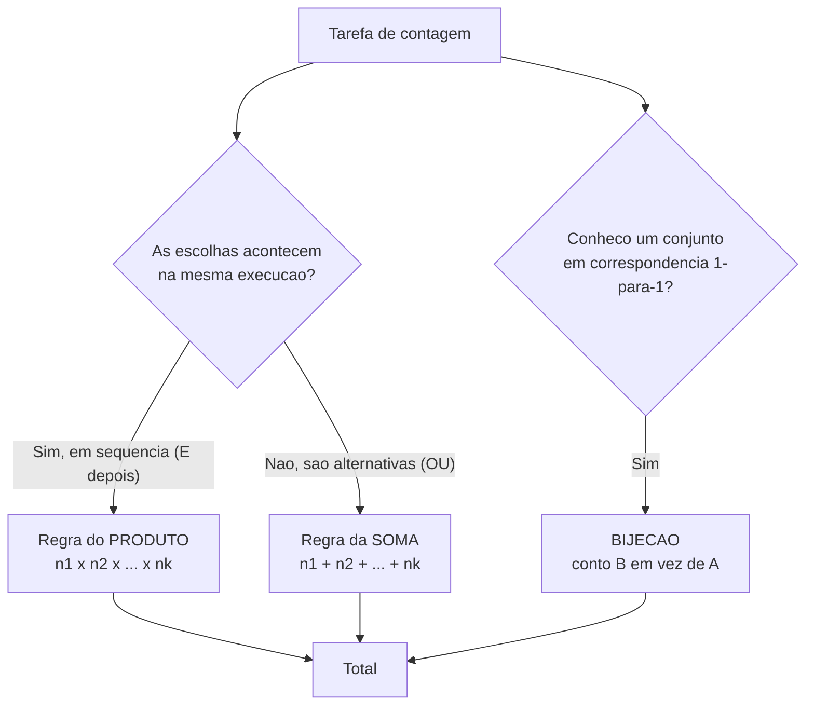
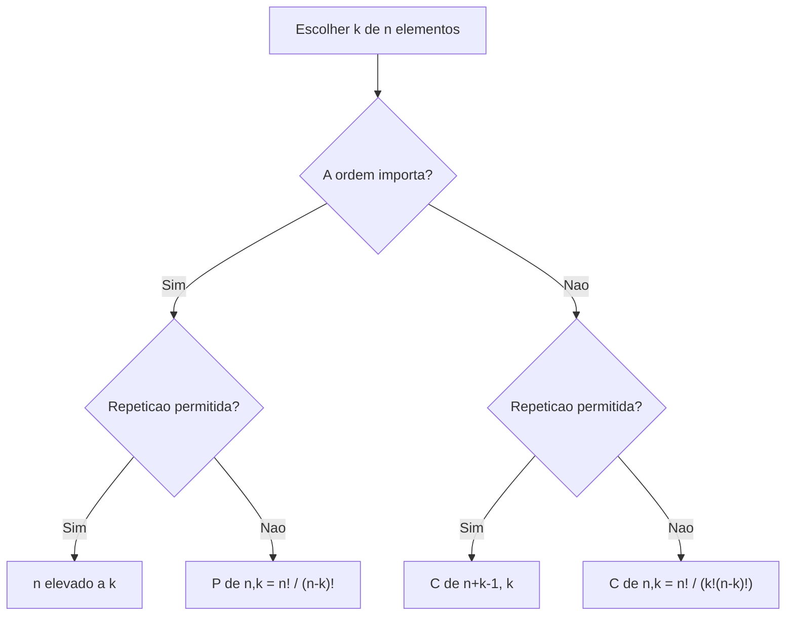
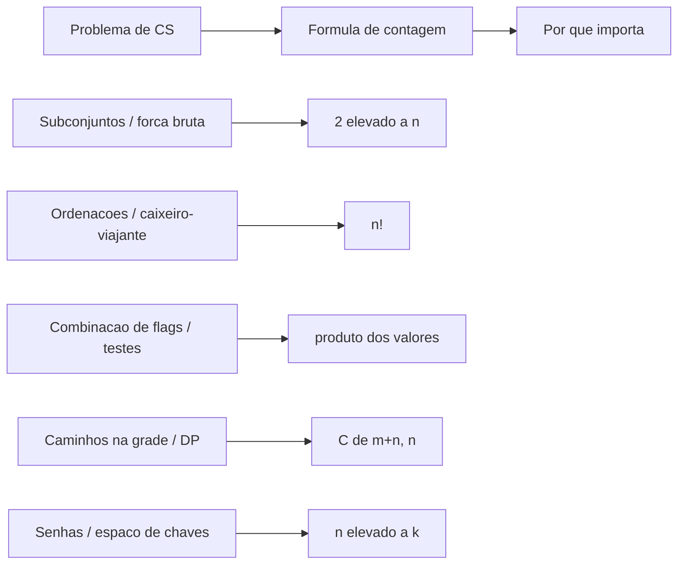

# Combinatória: a arte de contar

> [!abstract] TL;DR
> Combinatória é a matemática de **contar sem listar**. Você não enumera os 9.864.100 placares de senha possíveis — você multiplica. Duas regras sustentam tudo: **produto** (escolhas em sequência → multiplica) e **soma** (alternativas disjuntas → adiciona). Daí saem permutações (ordem importa, n!), combinações (ordem não importa, C(n,k)), o binômio de Newton e o triângulo de Pascal. Para o dev, contar é estimar o **tamanho do espaço de busca**: por que força bruta explode (2ⁿ subconjuntos, n! rotas), quantos casos de teste a combinação de flags gera, e quão grande é um espaço de senhas (nᵏ). Contar é o pré-requisito da probabilidade: probabilidade uniforme = favoráveis / total.

## Por que contar importa em CS

Quase todo problema interessante de computação esconde uma pergunta de contagem.

Quantos estados esse sistema pode assumir? Quantos casos esse teste precisa cobrir? Quantas tentativas um atacante precisa para quebrar essa senha? Quantos caminhos um algoritmo pode percorrer?

Responder "muitos" não ajuda. Você precisa do **número** — ou pelo menos da sua ordem de grandeza.

> [!question] Por que não simplesmente listar e contar?
> Porque a lista não cabe no universo. Um cadeado de 4 dígitos tem 10.000 combinações — listável. Uma rota de caixeiro-viajante por 20 cidades tem 19! ≈ 1,2 × 10¹⁷ ordens. Se você listasse uma por nanossegundo, levaria mais de 3 anos. Combinatória te dá o número **sem** pagar o preço de gerá-lo.

E há uma ponte direta com a aleatoriedade. Quando todos os resultados são igualmente prováveis, a probabilidade vira pura contagem:

```
P(evento) = (nº de resultados favoráveis) / (nº de resultados totais)
```

Contar o numerador e o denominador **é** calcular a probabilidade. Por isso a combinatória é o alicerce da [[19 - Probabilidade discreta]] — sem saber contar, você não sabe medir chance.

## As duas regras que sustentam tudo

Toda a combinatória elementar se reduz a duas operações: somar e multiplicar. A dificuldade nunca é a aritmética — é saber **qual** das duas aplicar.

### Regra do produto: escolhas em sequência

Se uma tarefa se decompõe em uma **sequência de etapas independentes**, e a etapa 1 tem n₁ formas, a etapa 2 tem n₂ formas, …, então o total é o **produto**:

```
total = n₁ × n₂ × … × nₖ
```

> [!example] Cardápio combinado
> Um restaurante oferece 3 entradas, 4 pratos principais e 2 sobremesas. Quantos jantares de três pratos diferentes existem?
>
> 3 × 4 × 2 = **24** jantares.
>
> A intuição: para cada uma das 3 entradas, há 4 principais; para cada um desses 12 começos, há 2 sobremesas. As escolhas se *multiplicam* porque não interferem umas nas outras.

A palavra-chave é **independente** no sentido de "uma não bloqueia a outra": escolher a entrada não muda quantos principais existem.

### Regra da soma: alternativas disjuntas

Se uma tarefa pode ser feita por uma de várias **categorias mutuamente exclusivas** (não há sobreposição), o total é a **soma**:

```
total = n₁ + n₂ + … + nₖ
```

> [!example] Escolher um meio de transporte
> Para ir ao trabalho você pode pegar 1 de 3 ônibus, 1 de 2 trens, ou 1 de 4 linhas de metrô. Quantas escolhas de transporte?
>
> 3 + 2 + 4 = **9** escolhas.
>
> Aqui as categorias *não se combinam*: você não pega ônibus E trem na mesma viagem. São alternativas, então somam.

> [!tip] O teste de uma frase
> Pergunte-se: as escolhas acontecem **"E depois"** (uma após a outra, na mesma execução) ou **"OU"** (uma alternativa exclui as outras)?
> "E depois" → **multiplica** (produto).
> "OU" → **soma** (soma).
> Confundir os dois é o erro nº 1 de quem está começando.

### Bijeção: contar A contando um B equivalente

Há uma terceira técnica, mais sutil e poderosa: a **bijeção**.

Se existe uma correspondência exata, um-para-um, entre o conjunto A que você quer contar e um conjunto B que você sabe contar, então |A| = |B|. Você troca um problema difícil por um fácil.

> [!example] Subconjuntos viram strings binárias
> Quantos subconjuntos tem um conjunto de 3 elementos {a, b, c}?
>
> Em vez de listar, associe cada subconjunto a uma string de 3 bits: bit 1 = "a está dentro?", bit 2 = "b está?", bit 3 = "c está?". O subconjunto {a, c} vira `101`; o conjunto vazio vira `000`; o conjunto todo vira `111`.
>
> Cada subconjunto ↔ exatamente uma string de 3 bits. É uma bijeção. E strings de 3 bits, pela regra do produto, são 2 × 2 × 2 = **2³ = 8**. Logo há 8 subconjuntos.

Esse truque — codificar o que você quer contar como algo que a regra do produto resolve — reaparece o tempo todo. Guarde-o. Ele conecta direto à [[04 - Teoria dos conjuntos]] e ao porquê de um conjunto de n elementos ter 2ⁿ subconjuntos.



**Leitura do diagrama:** toda contagem começa com a mesma pergunta — as decisões são uma *sequência* (multiplica) ou *alternativas exclusivas* (soma)? O ramo da bijeção é o atalho: quando o conjunto alvo é difícil, encontre um espelho fácil. Os três caminhos desembocam no mesmo lugar, o número final.

## Permutações: quando a ordem importa

Uma **permutação** é uma *ordenação* dos elementos. Trocar a ordem produz um resultado diferente. Pense em senhas, pódios, filas, ordens de execução.

### Todos os elementos: n!

De quantas formas você pode ordenar n objetos distintos numa fila?

A primeira posição tem n candidatos. Escolhido um, a segunda tem n−1 restantes. A terceira, n−2. Pela regra do produto:

```
n × (n−1) × (n−2) × … × 2 × 1 = n!
```

> [!example] Ordenando livros
> Quantas formas de enfileirar 5 livros distintos numa prateleira?
>
> 5! = 5 × 4 × 3 × 2 × 1 = **120**.

O fatorial cresce **brutalmente**. 10! já passa de 3,6 milhões; 13! ultrapassa 6 bilhões. Esse crescimento é exatamente o que torna certos algoritmos intratáveis — voltaremos a isso.

### Arranjos de k elementos sem repetição: P(n,k)

E se você quer ordenar apenas **k** dos n objetos? Por exemplo, pódio de 3 entre 8 corredores?

A primeira posição tem n opções, a segunda n−1, …, até a k-ésima, que tem n−k+1. O produto desses k fatores é:

```
P(n,k) = n × (n−1) × … × (n−k+1) = n! / (n−k)!
```

> [!example] Pódio de uma corrida
> 8 corredores, 3 medalhas (ouro, prata, bronze). Quantos pódios possíveis?
>
> P(8,3) = 8! / 5! = 8 × 7 × 6 = **336**.
>
> A ordem importa: João-Maria-Ana é um pódio diferente de Maria-João-Ana. Por isso é permutação, não combinação.

### Com repetição: nᵏ

Se você pode **reusar** elementos (repetição permitida) e a ordem importa, cada uma das k posições tem as n opções inteiras disponíveis. Regra do produto pura:

```
n × n × … × n  (k vezes) = nᵏ
```

> [!example] Senha numérica
> Um PIN de 4 dígitos (0–9, repetição permitida): 10⁴ = **10.000** PINs.
> Uma senha de 8 caracteres do conjunto {a–z, A–Z, 0–9}: 62⁸ ≈ **2,18 × 10¹⁴**.

Guarde nᵏ — é a fórmula do espaço de senhas, e do espaço de strings em geral.

## Combinações: quando a ordem NÃO importa

Uma **combinação** é uma *seleção* sem ordem. Você escolhe um subconjunto; {a, b, c} é o mesmo que {c, b, a}. Pense em comitês, mãos de cartas, conjuntos de features.

A fórmula:

```
C(n,k) = n! / (k! · (n−k)!)
```

Lê-se "n escolhe k". É também chamada de **coeficiente binomial**.

> [!question] Por que dividir por k!?
> Comece com P(n,k) = n!/(n−k)!, que conta as seleções **ordenadas** de k elementos. Mas cada subconjunto de k elementos foi contado **k! vezes** — uma vez para cada ordenação interna dele. Para uma seleção *sem* ordem, dividimos por k!, eliminando essas duplicatas.
>
> Em outras palavras: **C(n,k) = P(n,k) / k!**. A combinação é a permutação com a ordem "espremida para fora".

> [!example] Comitê de uma equipe
> Quantos comitês de 3 pessoas você forma a partir de 8?
>
> C(8,3) = 8! / (3! · 5!) = (8 × 7 × 6) / (3 × 2 × 1) = 336 / 6 = **56**.
>
> Compare com o pódio (P(8,3) = 336): o comitê tem 6× menos casos porque, num comitê, a ordem das 3 pessoas escolhidas não conta. 336 / 3! = 56.

### Duas propriedades que você precisa decorar

**Simetria:** C(n,k) = C(n,n−k).

Escolher quais k entram é o mesmo que escolher quais n−k ficam de fora. C(8,3) = C(8,5) = 56. Use isso para encurtar contas: C(100,98) = C(100,2) = 4.950, fácil; C(100,98) direto, horrível.

**A soma dá 2ⁿ:** ∑ₖ C(n,k) = 2ⁿ.

Somando C(n,0) + C(n,1) + … + C(n,n), você conta **todos** os subconjuntos possíveis de tamanho 0, 1, …, n. Ou seja, todos os subconjuntos. E já vimos pela bijeção com strings binárias que um conjunto de n elementos tem 2ⁿ subconjuntos. As duas contagens batem.

> [!example] Conferindo com n = 3
> C(3,0) + C(3,1) + C(3,2) + C(3,3) = 1 + 3 + 3 + 1 = **8 = 2³**. ✓

Essa identidade amarra combinatória, [[04 - Teoria dos conjuntos]] e o crescimento exponencial estudado em [[08 - Somatórios, logaritmos e crescimento]].

## Binômio de Newton e o triângulo de Pascal

Por que C(n,k) também se chama **coeficiente binomial**? Porque ele aparece, literalmente, como o coeficiente na expansão de (a + b)ⁿ:

```
(a + b)ⁿ = ∑ₖ₌₀ⁿ C(n,k) · aᵏ · bⁿ⁻ᵏ
```

> [!example] Expandindo (a + b)³
> (a + b)³ = C(3,0)·b³ + C(3,1)·a·b² + C(3,2)·a²·b + C(3,3)·a³
> = 1·b³ + 3·a·b² + 3·a²·b + 1·a³
> = a³ + 3a²b + 3ab² + b³.
>
> Os coeficientes 1, 3, 3, 1 são exatamente C(3,0), C(3,1), C(3,2), C(3,3).

**Por que** os coeficientes binomiais surgem aqui? Ao multiplicar (a+b)(a+b)…(a+b) n vezes, cada termo do resultado escolhe `a` ou `b` de cada fator. Um termo com aᵏbⁿ⁻ᵏ corresponde a escolher `a` em exatamente k dos n fatores — e há C(n,k) maneiras de fazer essa escolha. A álgebra **é** contagem disfarçada.

### O triângulo de Pascal

Empilhe os coeficientes linha a linha (linha n = coeficientes de (a+b)ⁿ):

| n | Linha do triângulo | Soma (= 2ⁿ) |
|---|---|---|
| 0 | 1 | 1 |
| 1 | 1 &nbsp; 1 | 2 |
| 2 | 1 &nbsp; 2 &nbsp; 1 | 4 |
| 3 | 1 &nbsp; 3 &nbsp; 3 &nbsp; 1 | 8 |
| 4 | 1 &nbsp; 4 &nbsp; 6 &nbsp; 4 &nbsp; 1 | 16 |
| 5 | 1 &nbsp; 5 &nbsp; 10 &nbsp; 10 &nbsp; 5 &nbsp; 1 | 32 |

**Leitura da tabela:** a entrada na linha n, posição k (contando de 0), é C(n,k). Cada linha é simétrica (espelho de C(n,k) = C(n,n−k)). A soma de cada linha dobra a anterior — é a identidade ∑ C(n,k) = 2ⁿ aparecendo visualmente. As bordas são sempre 1 (só há um jeito de escolher 0 ou todos os elementos).

### A identidade de Pascal

Cada número no triângulo é a **soma dos dois acima dele**:

```
C(n,k) = C(n−1,k−1) + C(n−1,k)
```

> [!note] A interpretação combinatória
> Para formar um comitê de k pessoas a partir de n, fixe uma pessoa específica — digamos, a Ana. Há dois casos disjuntos (regra da soma!):
> - **Ana está no comitê:** falta escolher k−1 dos n−1 restantes → C(n−1,k−1).
> - **Ana está de fora:** escolha os k inteiros entre os n−1 restantes → C(n−1,k).
>
> Somando os dois casos: C(n,k) = C(n−1,k−1) + C(n−1,k). A recorrência **não é um truque** — é a regra da soma aplicada à pergunta "a Ana entra ou não?".

Essa identidade é o que permite construir o triângulo de Pascal sem fatoriais: comece com as bordas em 1 e some os vizinhos. É também a base de algoritmos de **programação dinâmica** para calcular C(n,k) sem estourar com fatoriais gigantes.

## Variações: circular, multiconjunto e "stars and bars"

### Permutações circulares: (n−1)!

Quando os objetos formam um **círculo** (uma mesa redonda), rotações são equivalentes — girar todo mundo um assento não cria um arranjo novo. Fixamos uma pessoa para quebrar a simetria rotacional e ordenamos as n−1 restantes:

```
(n−1)!
```

> [!example] Mesa redonda
> 6 convidados numa mesa circular: (6−1)! = 5! = **120** disposições distintas (em vez das 720 de uma fila reta).

### Permutações de multiconjunto: n! / (n₁! n₂! …)

Quando há elementos **repetidos**, trocar duas cópias idênticas não gera arranjo novo. Dividimos n! pelos fatoriais das multiplicidades:

```
n! / (n₁! · n₂! · … · nᵣ!)
```

> [!example] Anagramas de BANANA
> "BANANA" tem 6 letras: 1 B, 3 A, 2 N. Anagramas distintos:
>
> 6! / (1! · 3! · 2!) = 720 / (1 · 6 · 2) = 720 / 12 = **60**.
>
> Sem a divisão, contaríamos as 3 letras A como distintas e infláriamos o total 12 vezes.

### "Stars and bars": combinações com repetição

E se você escolhe k itens de n tipos, **com repetição permitida** e **sem ordem** (quantos de cada tipo)? O número é:

```
C(n + k − 1, k)
```

> [!example] Comprando donuts
> Você compra 5 donuts de uma loja com 3 sabores (chocolate, baunilha, morango). Quantas seleções (quantos de cada)?
>
> C(3 + 5 − 1, 5) = C(7,5) = C(7,2) = **21**.
>
> A imagem por trás do nome: represente os 5 donuts como estrelas e use 2 barras para dividir entre os 3 sabores. `**|*|**` = 2 chocolate, 1 baunilha, 2 morango. Cada arranjo de 5 estrelas e 2 barras é uma seleção — e isso é uma bijeção que reduz o problema a "onde coloco as barras".

## A tabela mestre: as quatro contagens fundamentais

Toda escolha de k elementos a partir de n cai em uma de **quatro caixas**, conforme duas perguntas: a ordem importa? a repetição é permitida?

| | **Ordem importa** | **Ordem NÃO importa** |
|---|---|---|
| **Sem repetição** | P(n,k) = n! / (n−k)! | C(n,k) = n! / (k!(n−k)!) |
| **Com repetição** | nᵏ | C(n+k−1, k) |

**Leitura da tabela:** as colunas perguntam se reordenar muda o resultado (permutação vs. combinação). As linhas perguntam se um elemento pode reaparecer. O canto mais usado em entrevistas é o de cima à direita — C(n,k), o coeficiente binomial. O canto inferior esquerdo (nᵏ) é o espaço de senhas. Decore esta tabela: 90% dos problemas de contagem de entrevista são identificar **em qual célula** o problema cai.



**Leitura do diagrama:** é a tabela mestre virada em árvore de decisão. Duas perguntas binárias — ordem? repetição? — te levam a uma das quatro folhas. Treine fazer essas duas perguntas para *qualquer* enunciado de contagem antes de escrever uma fórmula.

## Na prática: contar é dimensionar o espaço de busca

Aqui está o ângulo que torna combinatória inseparável do trabalho de dev. Quase todo "isso é caro?" é, no fundo, "quão grande é o espaço?".

### Por que força bruta explode

Um algoritmo que testa **todos os subconjuntos** de n itens faz 2ⁿ iterações. Para n = 30, são mais de um bilhão; para n = 60, mais do que o número de nanossegundos desde o Big Bang. É a soma ∑ C(n,k) = 2ⁿ se vingando.

Um algoritmo que testa **todas as ordenações** de n itens faz n! iterações. É por isso que o **caixeiro-viajante** por força bruta (testar todas as rotas) é proibitivo: 20 cidades → 19! ≈ 1,2 × 10¹⁷ rotas. Esse crescimento fatorial/exponencial é a fronteira da **intratabilidade** que você estuda em complexidade de algoritmos: classes de problemas onde a contagem do espaço cresce tão rápido que enumerar é inviável, e você precisa de heurísticas ou aproximações.

> [!warning] A lição operacional
> Quando alguém propõe "vamos só testar todas as combinações", faça a conta antes de escrever o loop. Se o espaço é 2ⁿ ou n!, "todas" pode significar mais iterações do que átomos na sua máquina aguenta. Combinatória te dá o veto **na fase de design**, não depois do timeout em produção.

### Explosão combinatória nos casos de teste

Imagine uma função com 4 flags booleanas, mais um parâmetro com 3 valores e outro com 5. Para testar **toda** combinação:

2 × 2 × 2 × 2 × 3 × 5 = 16 × 15 = **240** casos (regra do produto).

Adicione mais uma flag e dobra. Esse é o motivo de existir **pairwise testing** (teste combinatório de pares): em vez de cobrir todas as combinações, você cobre todos os *pares* de valores, cortando drasticamente o número de casos enquanto pega a maioria dos bugs de interação. A combinatória explica tanto o problema (explosão) quanto a saída (cobertura de pares).

### Caminhos numa grade m × n

Quantos caminhos de monotônicos (só direita ou só para baixo) ligam o canto superior esquerdo ao inferior direito de uma grade m × n?

Todo caminho é uma sequência de m passos "baixo" e n passos "direita", em alguma ordem. Você só escolhe **em quais posições** da sequência ficam os passos "baixo":

```
C(m + n, m) = C(m + n, n)
```

> [!example] Grade 3 × 3
> C(3 + 3, 3) = C(6,3) = **20** caminhos.

Esse problema é o "hello world" da **programação dinâmica** — e a fórmula fechada C(m+n, n) confere o resultado da DP. Contar e otimizar de mãos dadas.

### Espaço de chaves e força bruta

O espaço de senhas é nᵏ puro: n símbolos possíveis, k posições. Uma senha de 12 caracteres num alfabeto de 95 símbolos imprimíveis tem 95¹² ≈ 5,4 × 10²³ possibilidades. É a fórmula nᵏ ditando quanto tempo um ataque de força bruta levaria — e o motivo de cada caractere a mais multiplicar a segurança por 95. Combinatória é, aqui, a aritmética da criptografia prática.



**Leitura do diagrama:** cada problema cotidiano de engenharia mapeia para uma fórmula de contagem específica. Reconhecer o mapeamento é o que transforma "parece caro" em "são 2⁶⁰ iterações, esqueça". A coluna do meio é seu vocabulário; a habilidade é traduzir o enunciado para ela.

### A ponte para esperança

Quando você sabe contar os resultados, sabe atribuir probabilidades (favoráveis / total) — e daí calcular **valores esperados**. Quantas comparações em média um quicksort faz? Quantas tentativas até acertar? Essas perguntas saem da contagem e desembocam em [[20 - Variáveis aleatórias e esperança]]. Contar é o primeiro degrau; esperar é o segundo.

> [!summary] Resumo em uma linha
> Combinatória conta sem listar: produto (sequência) e soma (alternativas) geram permutações (n!, ordem importa), combinações (C(n,k), ordem não importa) e o binômio/Pascal — e contar **é** dimensionar o espaço de busca que decide se um algoritmo é viável.

## Em entrevista

Combinatória aparece em entrevistas de duas formas: direta ("quantos jeitos de…") e disfarçada (estimar o tamanho de um espaço de busca antes de propor um algoritmo). O reflexo de ouro é fazer **duas perguntas** antes de qualquer fórmula: a ordem importa? a repetição é permitida? Isso te coloca numa das quatro células da tabela mestre instantaneamente. E quando alguém sugere força bruta, demonstrar que você sabe que o espaço é 2ⁿ ou n! — e portanto inviável — sinaliza maturidade de design.

*The first question I ask any counting problem is whether order matters and whether repetition is allowed.*
*If order matters, it's a permutation; if it doesn't, it's a combination, and I divide out the k! orderings.*
*The product rule applies when choices happen in sequence; the sum rule when they're mutually exclusive alternatives.*
*A set of n elements has 2ⁿ subsets, which is why brute-forcing over all subsets blows up fast.*
*Before I propose a brute-force solution, I estimate the size of the search space — n! routes or 2ⁿ subsets often rules it out.*
*Pascal's identity reflects a simple case split: does this specific element go in the selection or not?*
*The number of monotonic paths through an m by n grid is C(m+n, n), which doubles as a dynamic-programming sanity check.*
*A password space of n symbols and k positions is n to the k, and that's exactly what a brute-force attacker faces.*
*Combinatorics is really just careful multiplication and addition — the hard part is choosing which one applies.*

| Português | English |
|---|---|
| combinatória | combinatorics |
| contar / contagem | to count / counting |
| regra do produto | product rule |
| regra da soma | sum rule |
| permutação | permutation |
| combinação | combination |
| fatorial | factorial |
| arranjo | arrangement / r-permutation |
| coeficiente binomial | binomial coefficient |
| ordem importa | order matters |
| com repetição | with repetition |
| sem repetição | without repetition |
| binômio de Newton | binomial theorem |
| triângulo de Pascal | Pascal's triangle |
| identidade de Pascal | Pascal's identity |
| bijeção | bijection |
| espaço de busca | search space |
| explosão combinatória | combinatorial explosion |
| subconjunto | subset |
| espaço de chaves | key space |

> [!info] Lastro
> - Kenneth H. Rosen, *Discrete Mathematics and Its Applications* (8ª ed.), Cap. 6 — "Counting": 6.1 The Basics of Counting (regras do produto e da soma), 6.3 Permutations and Combinations, 6.4 Binomial Coefficients and Identities (binômio, Pascal), 6.5 Generalized Permutations and Combinations (repetição, multiconjunto, stars and bars).
> - Ronald Graham, Donald Knuth, Oren Patashnik, *Concrete Mathematics: A Foundation for Computer Science* (2ª ed.), Cap. 5 — "Binomial Coefficients" (identidades básicas, prática, truques). Errata e material: [www-cs-faculty.stanford.edu/~knuth/gkp.html](https://www-cs-faculty.stanford.edu/~knuth/gkp.html)
> - Eric Lehman, F. Thomson Leighton, Albert R. Meyer, *Mathematics for Computer Science* (MIT, CC BY-SA), Parte "Counting" — regras de soma/produto, bijeção como técnica de contagem, princípio da divisão. Disponível em [ocw.mit.edu](https://ocw.mit.edu/courses/6-1200j-mathematics-for-computer-science-spring-2024/pages/readings/) e [eng.libretexts.org](https://eng.libretexts.org/Bookshelves/Computer_Science/Programming_and_Computation_Fundamentals/Mathematics_for_Computer_Science_(Lehman_Leighton_and_Meyer)).

## Veja também
- [[04 - Teoria dos conjuntos]] — subconjuntos, o porquê de 2ⁿ
- [[08 - Somatórios, logaritmos e crescimento]] — somatórios e crescimento exponencial/fatorial
- [[12 - Princípios combinatórios - casa dos pombos e inclusão-exclusão]] — as próximas ferramentas de contagem
- [[19 - Probabilidade discreta]] — probabilidade uniforme = contagem (favoráveis / total)
- [[20 - Variáveis aleatórias e esperança]] — da contagem ao valor esperado
