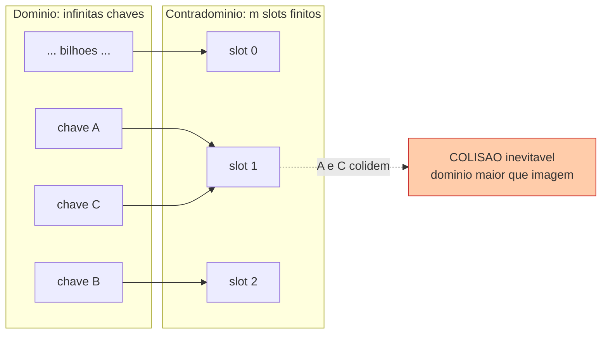
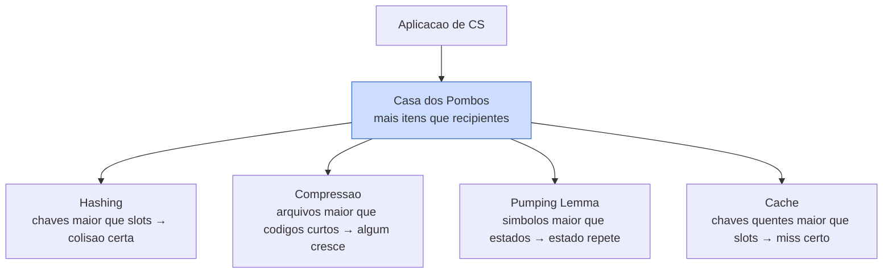
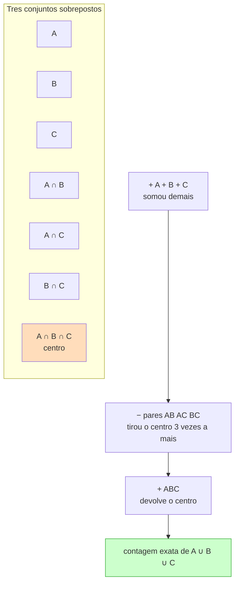
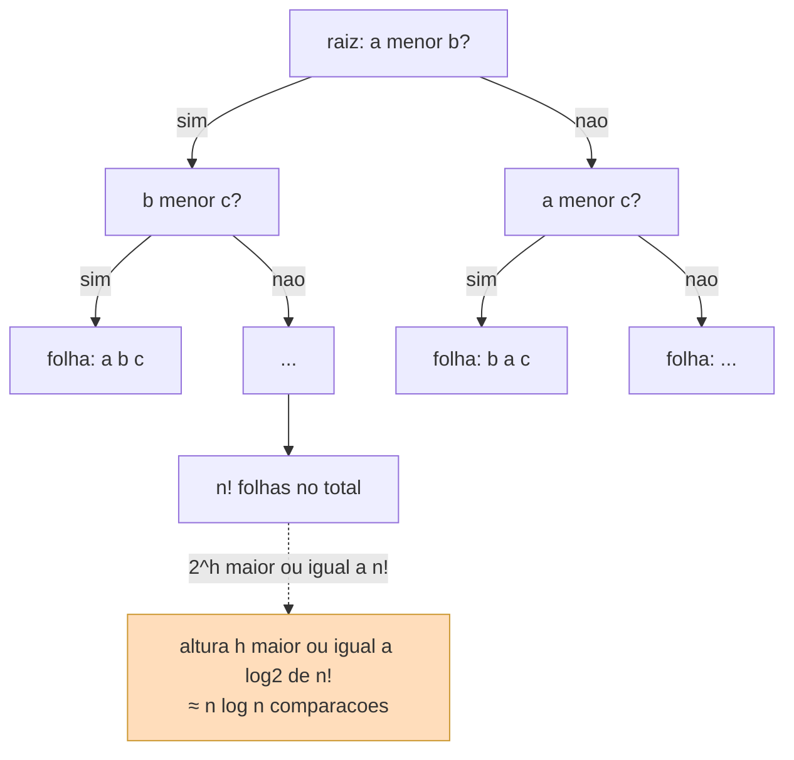

# Princípios combinatórios: casa dos pombos e inclusão-exclusão

> [!abstract] TL;DR
> Dois princípios que parecem bobos e provam coisas profundas.
>
> **Casa dos pombos**: se você tem mais pombos que casas, alguma casa tem pelo menos dois pombos. Óbvio? É. Mas é exatamente esse "óbvio" que **garante** colisão de hash, prova que compressão sem perda não encolhe todo arquivo, e sustenta o pumping lemma.
>
> **Inclusão-exclusão**: para contar a união de conjuntos que se sobrepõem, soma as partes e **desconta a sobreposição** que você contou duas vezes. Daí saem queries com `OR`, a função totiente de Euler e os desarranjos.
>
> Os dois são **argumentos de contagem**. E argumento de contagem é como você prova limites inferiores — por que nenhum algoritmo pode ser melhor que tal coisa.

A combinatória da nota anterior ([[11 - Combinatória - a arte de contar]]) ensinou a **contar**. Esta ensina a **concluir a partir da contagem**. São duas ferramentas, e a graça é que ambas dão resultados que parecem mágica vinda do nada.

---

## Parte 1 — A casa dos pombos

### O princípio, em uma frase

Você tem 10 pombos e 9 casinhas no pombal. Cada pombo precisa entrar em alguma casa.

Não importa como eles se organizem: **alguma casa vai ter pelo menos dois pombos**.

Por quê? Porque se cada casa tivesse no máximo um, caberiam no máximo 9 pombos. Mas são 10. Contradição.

> [!note] O enunciado formal
> Se você coloca **n + 1** objetos em **n** caixas, então **pelo menos uma caixa contém 2 ou mais objetos**.
>
> Em linguagem de funções: se f mapeia um conjunto de tamanho n + 1 num conjunto de tamanho n, então f **não é injetora** — dois elementos diferentes batem no mesmo lugar. Guarde isso. É o coração de tudo aqui. (Veja [[09 - Funções]].)

Repare no que aconteceu. A gente provou a existência de uma colisão **sem saber qual casa** tem o pombo extra. A casa dos pombos é não-construtiva: ela grita "existe!" e te dá as costas quando você pergunta "onde?".

> [!tip] A receita de toda prova por casa dos pombos
> Sempre que você for usar o princípio, a dificuldade não é o princípio — é **modelar**. São três perguntas:
>
> 1. **Quem são os pombos?** (o conjunto grande)
> 2. **Quem são as casas?** (o conjunto pequeno, finito)
> 3. **Quem é a regra que põe cada pombo numa casa?** (a função)
>
> Acerte os três e a conclusão cai sozinha. Os exemplos abaixo são todos a mesma receita com ingredientes diferentes.

### Por que isso não é trivial

A reação natural é "tá, e daí, isso é óbvio demais pra ser útil". Errado. O poder está em **escolher os pombos e as casas certos**. Os enunciados são bobos; as escolhas são engenhosas.

**Duas pessoas na sua cidade têm exatamente o mesmo número de fios de cabelo.**

Soa absurdo? Veja. Uma cabeça humana tem no máximo uns 150 mil fios — digamos, com folga, no máximo 1 milhão. Esses são os **buracos**: as casas numeradas de 0 a 1.000.000.

Uma cidade como São Paulo tem 12 milhões de pessoas. Esses são os **pombos**.

12 milhões de pombos, 1 milhão de casas. Pela casa dos pombos, alguma "quantidade de fios" é compartilhada por pelo menos 12 pessoas. Garantido. Sem contar um fio sequer.

**Em 13 pessoas, duas nasceram no mesmo mês.**

13 pombos (pessoas), 12 casas (meses). 13 > 12, logo colisão. Pronto.

**Em qualquer conjunto de 10 inteiros entre 1 e 99, existem dois subconjuntos diferentes com a mesma soma.**

Esse é o melhor. Um conjunto de 10 números tem 2¹⁰ = 1024 subconjuntos. As somas possíveis vão de 0 (vazio) até 90 + 91 + ... + 99 < 1000. Então temos no máximo ~1000 valores de soma possíveis (casas) e 1024 subconjuntos (pombos). 1024 > 1000 ⟹ dois subconjuntos diferentes somam igual. Você não sabe quais. Você sabe que existem.

### A versão generalizada

Voltamos ao pombal, agora com mais pombos.

Se você tem **n** pombos e **k** casas, e n é bem maior que k, então a casa mais cheia tem **pelo menos ⌈n/k⌉ pombos**.

> [!tip] Por que o teto ⌈ ⌉
> Distribua o mais uniformemente que conseguir: n ÷ k por casa. Se desse exato, todas as casas teriam n/k. Mas n nem sempre é divisível por k, e os pombos que sobram precisam ir pra **algum** lugar — empilham em casas já ocupadas. O teto arredonda pra cima exatamente esse "alguém leva o resto".
>
> Exemplo: 100 pombos, 9 casas. ⌈100/9⌉ = ⌈11,1⌉ = 12. Alguma casa tem ao menos 12.

Note a sutileza: a generalizada com k = n recupera a versão básica, porque n + 1 pombos em n casas dão ⌈(n+1)/n⌉ = 2.

> [!example] Uma aplicação que cai em entrevista
> "Numa gaveta há meias de 3 cores misturadas no escuro. Quantas você precisa pegar para **garantir** um par da mesma cor?"
>
> Cores = casas (3). Meias pegas = pombos. Você quer forçar ⌈n/3⌉ ≥ 2, ou seja, alguma cor com 2 ou mais. Com 3 meias pode dar uma de cada cor (azar). Com **4**, a casa dos pombos garante: 4 pombos em 3 casas ⟹ ⌈4/3⌉ = 2. Resposta: 4. O padrão "quantos para garantir" é casa dos pombos generalizada lida de trás pra frente.

```mermaid
flowchart TD
    P["n + 1 pombos"] --> D{"distribuir em n casas"}
    D --> C1["casa 1"]
    D --> C2["casa 2"]
    D --> C3["..."]
    D --> Cn["casa n"]
    C1 -. "no máximo 1 cada" .-> LIMITE["capacidade total = n"]
    C2 -. .-> LIMITE
    Cn -. .-> LIMITE
    LIMITE --> CONTRA["mas temos n + 1 pombos<br/>n + 1 maior que n"]
    CONTRA --> COL["logo: alguma casa tem 2 ou mais<br/>COLISAO GARANTIDA"]
    style COL fill:#fca,stroke:#c33
    style CONTRA fill:#fee
```

**Leitura do diagrama**: n + 1 pombos entram, mas a capacidade "sem colisão" do pombal é apenas n (uma vaga por casa). Como n + 1 ultrapassa n, o excesso força um empilhamento. A seta vermelha é a conclusão: a colisão não é provável, é **certa**.

---

## Parte 2 — A casa dos pombos em Computação

Aqui o princípio para de ser curiosidade matemática e vira ferramenta de engenharia. Sempre que você mapeia um conjunto grande num conjunto menor, **a casa dos pombos te diz o que é impossível evitar**.

### Colisão de hash é garantida

Uma função de hash pega chaves de um **domínio gigante** (todas as strings possíveis, todos os objetos possíveis) e devolve um valor num **contradomínio finito** (um índice de 0 a m − 1, ou um digest de 256 bits).

Se o domínio é maior que o contradomínio — e sempre é — então a função **não pode ser injetora**. É a casa dos pombos vestida de função (de novo, [[09 - Funções]]): mais entradas que saídas ⟹ duas entradas batem na mesma saída.



**Leitura do diagrama**: as chaves à esquerda são os pombos; os slots à direita são as casas. Como sempre há mais chaves possíveis que slots, duas chaves (A e C) caem no mesmo slot. Nenhuma engenhosidade de função de hash escapa disso — o que uma boa hash faz é **distribuir bem** as colisões, não eliminá-las.

> [!warning] A distinção que separa juniores de seniores
> "Colisão **acontece**" e "colisão é **provável**" são afirmações diferentes.
>
> A casa dos pombos prova que colisão é **possível e, com chaves suficientes, garantida** — é um argumento de contagem, determinístico.
>
> A *probabilidade* de colisão com poucas chaves (o famigerado paradoxo do aniversário: bastam ~23 pessoas pra 50% de chance de aniversário repetido) é outra história, e é probabilística. Veja [[19 - Probabilidade discreta]]. Não confunda as duas: a casa dos pombos é certeza; o aniversário é chance.

Consequência prática: toda hash table precisa de **estratégia de colisão** (encadeamento, open addressing). Não é defeito de implementação — é o teorema dizendo que você não tem escolha.

### Compressão sem perda não encolhe todo arquivo

Existe algoritmo de compressão sem perda que torna **qualquer** arquivo menor?

Não. E a prova é pura contagem.

Considere todos os arquivos de exatamente n bits: são 2ⁿ deles. Um compressor sem perda é uma função **injetora** (precisa ser — senão dois arquivos comprimiriam pro mesmo lugar e a descompressão seria ambígua).

Se ele encolhesse **todos** os arquivos de n bits, mandaria 2ⁿ arquivos para saídas com **menos** que n bits. Mas o total de strings com menos que n bits é 2⁰ + 2¹ + ... + 2ⁿ⁻¹ = 2ⁿ − 1.

2ⁿ pombos, 2ⁿ − 1 casas. Casa dos pombos: dois arquivos comprimiriam pro mesmo lugar. A função não seria injetora. Contradição.

> [!note] A moral
> Todo compressor que encolhe alguns arquivos **necessariamente aumenta outros**. Há menos strings curtas do que longas — não tem onde guardar todo mundo. O ZIP funciona porque os arquivos reais (texto, imagem) têm redundância; o "arquivo aleatório médio" é incompressível.

### A casa dos pombos prova o pumping lemma

Na Teoria da Computação, o pumping lemma diz que toda string longa o bastante de uma linguagem regular tem um pedaço "bombeável" — que se repete sem sair da linguagem.

A prova é... a casa dos pombos. Um autômato finito tem um número **fixo** de estados, digamos p. Se ele processa uma string com **mais de p símbolos**, ele visita mais de p estados ao longo do caminho. Pombos (visitas) > casas (estados) ⟹ **algum estado se repete**. O laço entre as duas visitas a esse estado é exatamente o trecho bombeável.

É a *mesma* ferramenta — só que os pombos são "passos de execução" e as casas são "estados". Quando você reconhecer esse padrão, vai vê-lo em todo lugar.

### Cache: k slots, k + 1 chaves quentes

Você tem um cache totalmente associativo com **k** entradas. Seu workload acessa em loop **k + 1** chaves distintas, todas quentes, em rodízio.

A cada rodada, k + 1 chaves disputam k slots. Casa dos pombos: não cabem todas. Alguma chave **sempre** é despejada antes de ser reusada — e o próximo acesso a ela é um miss garantido.

É o **belady's anomaly** rondando e o motivo de o thrashing existir: quando o working set ultrapassa a capacidade do cache, o miss não é azar, é aritmética.



**Leitura do diagrama**: o nó central é o mesmo princípio; os quatro ramos são disfarces dele. Em todos, "algo maior mapeado em algo menor" força uma repetição/colisão inevitável. Aprenda a enxergar o nó azul por baixo de cada problema.

A tabela abaixo cristaliza o mapeamento "pombo → casa" de cada aplicação. Se você decorar uma coisa desta nota, decore esta tabela — ela é o tradutor universal.

| Aplicação em CS | Pombos | Casas | O que a colisão garante |
|---|---|---|---|
| Hash table | chaves possíveis | slots / buckets | duas chaves no mesmo slot → precisa de estratégia de colisão |
| Compressão sem perda | arquivos de n bits | strings mais curtas que n bits | algum arquivo não encolhe (ou cresce) |
| Pumping lemma | passos da execução | estados do autômato | um estado se repete → existe laço bombeável |
| Cache associativo | chaves quentes | slots do cache | despejo antes do reuso → miss garantido |
| Mesmo nº de fios | habitantes | valores possíveis de fios | duas pessoas com a mesma contagem |

**Leitura da tabela**: cada linha é a mesma frase — "há mais pombos que casas, logo colisão". A coluna da direita é o que isso te **obriga** a aceitar como verdade na engenharia. Repare que a estrutura nunca muda; só os rótulos.

---

## Parte 3 — Inclusão-exclusão

### O problema de contar com sobreposição

Numa turma, 18 alunos jogam futebol e 15 jogam vôlei. Quantos praticam algum dos dois?

A tentação é dizer 18 + 15 = 33. **Errado**, se alguém joga os dois. Esses foram contados **duas vezes** — uma na conta do futebol, outra na do vôlei.

A correção é descontar a interseção.

> [!note] Inclusão-exclusão para dois conjuntos
> |A ∪ B| = |A| + |B| − |A ∩ B|
>
> "Inclua tudo, depois exclua o que incluiu em duplicidade."
>
> Se 7 alunos jogam os dois: |A ∪ B| = 18 + 15 − 7 = 26.

### Três conjuntos: o vai-e-volta

Com três conjuntos a coisa fica mais bonita. Você soma os três, mas agora as **três interseções de pares** foram contadas em excesso — então subtrai. Só que ao subtrair os pares, a **interseção dos três** (que estava em todo par) foi removida demais — então soma de volta.

> [!note] Inclusão-exclusão para três conjuntos
> |A ∪ B ∪ C| = |A| + |B| + |C| − |A ∩ B| − |A ∩ C| − |B ∩ C| + |A ∩ B ∩ C|
>
> Soma simples, **menos** os pares, **mais** a tripla. É um sobe-e-desce de sinais.



**Leitura do diagrama**: a região central (A ∩ B ∩ C) é a vilã. Ao somar A, B, C ela entra 3 vezes; ao subtrair os três pares ela sai 3 vezes — zerando. Por isso o `+ ABC` no fim devolve a única cópia que ela merecia. O ritmo "soma, subtrai, soma" não é arbitrário: cada termo conserta o excesso do anterior.

### A fórmula geral

Com n conjuntos, o padrão de sinais alterna: some os elementos individuais, subtraia as interseções de pares, some as de trios, subtraia as de quartetos, e assim por diante.

> [!abstract] Forma geral
> |A₁ ∪ ... ∪ Aₙ| = ∑|Aᵢ| − ∑|Aᵢ ∩ Aⱼ| + ∑|Aᵢ ∩ Aⱼ ∩ Aₖ| − ...
>
> O sinal de um termo que envolve k conjuntos é (−1)ᵏ⁺¹: ímpar soma, par subtrai. É a mesma dança de correção, agora em escala.

| Conjuntos | Fórmula | Termos |
|---|---|---|
| 2 | \|A\| + \|B\| − \|A ∩ B\| | 2 simples, 1 par |
| 3 | soma simples − pares + tripla | 3 + 3 + 1 |
| n | ∑ simples − ∑ pares + ∑ trios − ... | 2ⁿ − 1 termos no total |

**Leitura da tabela**: cada linha adiciona uma camada de correção. Note o salto no número de termos: com n conjuntos há 2ⁿ − 1 interseções a considerar — por isso inclusão-exclusão fica caro rápido, e na prática só se usa "na mão" pra 2, 3, talvez 4 conjuntos.

---

## Parte 4 — Inclusão-exclusão em ação

### Contar com OR sobreposto

**Quantos inteiros de 1 a 100 são divisíveis por 2, 3 ou 5?**

Essa é uma query `WHERE x % 2 = 0 OR x % 3 = 0 OR x % 5 = 0` disfarçada. Se você somar as três contagens, conta em dobro quem é divisível por 6 (2 e 3), por 10, por 15, e em triplo quem é divisível por 30.

- Divisíveis por 2: ⌊100/2⌋ = 50
- por 3: ⌊100/3⌋ = 33
- por 5: ⌊100/5⌋ = 20
- por 6: ⌊100/6⌋ = 16
- por 10: ⌊100/10⌋ = 10
- por 15: ⌊100/15⌋ = 6
- por 30: ⌊100/30⌋ = 3

Inclusão-exclusão: 50 + 33 + 20 − 16 − 10 − 6 + 3 = **74**.

> [!tip] O olho treinado
> Toda vez que você ouvir "quantos satisfazem **pelo menos uma** dessas condições", e as condições se sobrepõem, pense inclusão-exclusão. É o esqueleto de contar resultados de um `OR` sem contar duplicado.

### A totiente de Euler φ(n)

φ(n) conta quantos inteiros de 1 a n são **coprimos** com n (não compartilham fator). Ela é a estrela da [[15 - Aritmética modular e Fermat-Euler]] — e nasce de inclusão-exclusão.

Tome n = 12 = 2² · 3. Os "não-coprimos" com 12 são os divisíveis por 2 **ou** por 3. Contemos os que **são** coprimos = total − (divisíveis por 2 ou por 3).

- Total: 12
- Divisíveis por 2: 6; por 3: 4; por 6 (ambos): 2
- Não-coprimos = 6 + 4 − 2 = 8 (inclusão-exclusão!)
- φ(12) = 12 − 8 = 4

E de fato os coprimos de 12 são {1, 5, 7, 11} — quatro deles. A fórmula fechada φ(n) = n · ∏(1 − 1/p) sobre os primos p que dividem n **é** a inclusão-exclusão já resolvida algebricamente. Cada fator (1 − 1/p) é o "desconto" de quem é divisível por p.

### Desarranjos (derangements)

Um desarranjo é uma permutação onde **nada** fica no lugar original. Pense no amigo-secreto: ninguém pode tirar a si mesmo.

Contar os "bons" diretamente é difícil — então conte ao contrário. Defina Aᵢ = "permutações em que o elemento i ficou no lugar". Os arranjos **ruins** (com pelo menos um no lugar) são |A₁ ∪ ... ∪ Aₙ| — inclusão-exclusão de novo. Os desarranjos são o complemento.

> [!note] O resultado, de leve
> O número de desarranjos de n elementos é
>
> Dₙ = n! · (1 − 1/1! + 1/2! − 1/3! + ... ± 1/n!)
>
> Repare os sinais alternados: é a assinatura digital da inclusão-exclusão. E aquela série entre parênteses converge para **1/e ≈ 0,368**. Ou seja: num amigo-secreto grande, a chance de um sorteio aleatório ser válido (ninguém em si mesmo) é cerca de 37%. Surpreendente — não cai pra zero como a intuição sugere.

### Contar coprimos num intervalo

Quantos números de 1 a 30 são coprimos com 30 = 2 · 3 · 5? Mesmíssima máquina: total menos os divisíveis por 2, 3 ou 5, corrigindo as sobreposições. φ(30) = 30 · (1 − 1/2)(1 − 1/3)(1 − 1/5) = 30 · ½ · ⅔ · ⅘ = 8. Inclusão-exclusão fatorada em produto.

---

## Parte 5 — O ângulo dev: limites inferiores por contagem

Esta é a parte que vale a entrevista. Argumentos de contagem não só contam — eles **provam que algo é impossível de fazer melhor**.

### Por que ordenação por comparação é Ω(n log n)

Você já ouviu que merge sort é O(n log n) e que "não dá pra ordenar por comparação mais rápido que isso". De onde vem esse **limite inferior**? De contagem pura.

Imagine qualquer algoritmo de ordenação que só compara pares de elementos (`a < b?`). Cada comparação tem dois resultados: sim ou não. O algoritmo é então uma **árvore de decisão binária** — cada nó é uma comparação, cada galho é uma resposta.

Para ordenar n elementos, o algoritmo precisa **distinguir todas as n! ordens possíveis** da entrada. Cada ordem leva a uma folha diferente da árvore. Logo a árvore tem **pelo menos n! folhas**.

Mas uma árvore binária de altura h tem no máximo 2ʰ folhas. Para caber n! folhas:

2ʰ ≥ n! ⟹ h ≥ ⌈log₂(n!)⌉

E por Stirling, log₂(n!) ≈ n log₂ n. A altura da árvore é o **número de comparações no pior caso**. Conclusão: nenhum algoritmo de comparação faz menos que Ω(n log n) comparações. (O detalhe de Stirling e a análise de árvore de decisão moram nas notas de Algoritmos.)



**Leitura do diagrama**: cada caminho da raiz a uma folha é uma execução possível do algoritmo. Como existem n! ordens distintas a separar, a árvore precisa de n! folhas — e uma árvore binária só consegue isso se for alta o bastante. A altura mínima ⌈log₂ n!⌉ é o piso de comparações. É contagem provando impossibilidade.

> [!tip] O padrão mental que você leva
> **Quantas respostas distintas o problema exige?** Esse número (n!, 2ⁿ, ...) é o "número de folhas necessárias". A altura mínima da árvore de decisão que separa todas elas é o limite inferior. Casa dos pombos ao avesso: você não pode separar mais coisas do que a profundidade da árvore permite.

---

> [!summary] Resumo em uma linha
> Casa dos pombos garante colisões quando mapeia muito em pouco (hash, compressão, cache, pumping lemma); inclusão-exclusão conta uniões sobrepostas somando e descontando interseções (OR, totiente, desarranjos); ambos são argumentos de contagem que provam limites inferiores.

## Em entrevista

Esses dois princípios aparecem quando o entrevistador quer ver se você raciocina sobre **garantias** e **contagem**, não só sobre código. Se perguntarem "colisão de hash pode sempre ser evitada?", a resposta certa invoca a casa dos pombos: domínio maior que contradomínio força não-injetividade. Se perguntarem "como contar X ou Y sem duplicar", é inclusão-exclusão. E se desafiarem "prove que ordenação por comparação não passa de n log n", é o argumento de árvore de decisão. Mostre que você reconhece o **mesmo princípio sob disfarces diferentes** — é isso que separa quem decorou de quem entendeu.

*"By the pigeonhole principle, if the domain is larger than the codomain, the function cannot be injective — so hash collisions are guaranteed, not just likely."*

*"Lossless compression can't shrink every file: there are fewer short strings than long ones, so by counting some files must grow."*

*"The pigeonhole principle also proves the pumping lemma — more steps than states means a state must repeat."*

*"To count a union of overlapping sets, inclusion-exclusion adds the parts and subtracts the double-counted intersections."*

*"Euler's totient comes straight out of inclusion-exclusion over the prime factors of n."*

*"The probability of collision — the birthday paradox — is a separate, probabilistic question from the pigeonhole guarantee."*

*"Comparison sort is Omega of n log n because the decision tree needs n factorial leaves, so its height is at least log base 2 of n factorial."*

*"A counting argument doesn't just count — it proves a lower bound, telling you what no algorithm can beat."*

| Português | English |
|---|---|
| Casa dos pombos | Pigeonhole principle |
| Casa dos pombos generalizada | Generalized pigeonhole principle |
| Pombos / casas (buracos) | Pigeons / holes |
| Teto | Ceiling |
| Função injetora | Injective function |
| Não-injetividade forçada | Forced non-injectivity |
| Colisão (de hash) | (Hash) collision |
| Argumento de contagem | Counting argument |
| Limite inferior | Lower bound |
| Inclusão-exclusão | Inclusion-exclusion |
| União / interseção | Union / intersection |
| Sobreposição | Overlap |
| Contagem dupla | Double counting |
| Função totiente de Euler | Euler's totient function |
| Coprimo | Coprime |
| Desarranjo | Derangement |
| Árvore de decisão | Decision tree |
| Paradoxo do aniversário | Birthday paradox |
| Pumping lemma | Pumping lemma |
| Compressão sem perda | Lossless compression |

> [!info] Lastro
> - Rosen, K. H. *Discrete Mathematics and Its Applications* (8ª ed.) — Seção 6.2 "The Pigeonhole Principle" (versão básica e generalizada) e Capítulo 8.5–8.6 "Inclusion–Exclusion" (fórmula geral, desarranjos, totiente).
> - Lehman, E.; Leighton, F. T.; Meyer, A. R. *Mathematics for Computer Science* (MIT) — Seção 14.8 "The Pigeonhole Principle" e 14.9 "Inclusion-Exclusion". Disponível em [MIT OCW 6.042](https://ocw.mit.edu/courses/6-042j-mathematics-for-computer-science-spring-2015/mit6_042js15_session27.pdf) e [Engineering LibreTexts](https://eng.libretexts.org/Bookshelves/Computer_Science/Programming_and_Computation_Fundamentals/Mathematics_for_Computer_Science_(Lehman_Leighton_and_Meyer)/03:_Counting/14:_Cardinality_Rules/14.08:_The_Pigeonhole_Principle).
> - Cormen, Leiserson, Rivest, Stein. *Introduction to Algorithms* — Capítulo 8, "Lower bounds for sorting" (modelo de árvore de decisão, ⌈log₂ n!⌉ = Ω(n log n)).
