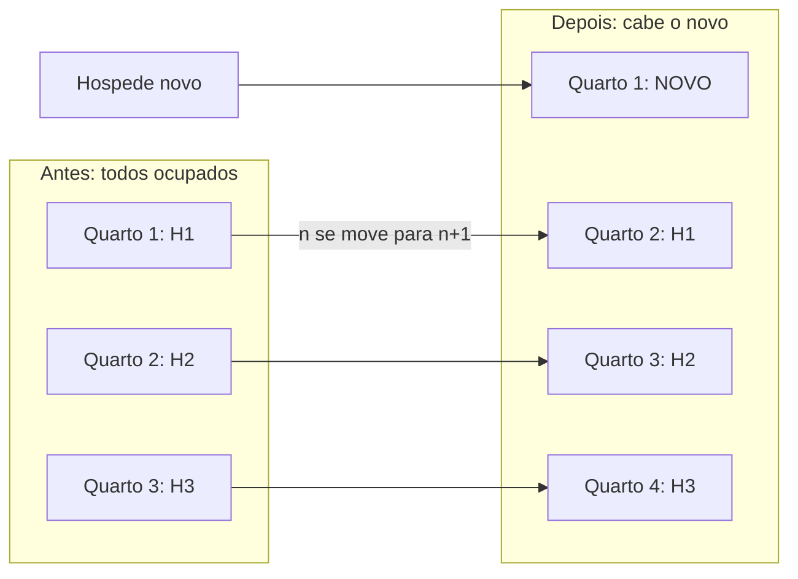
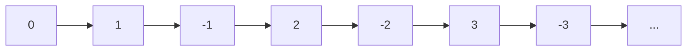
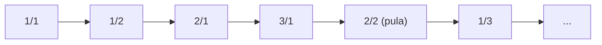
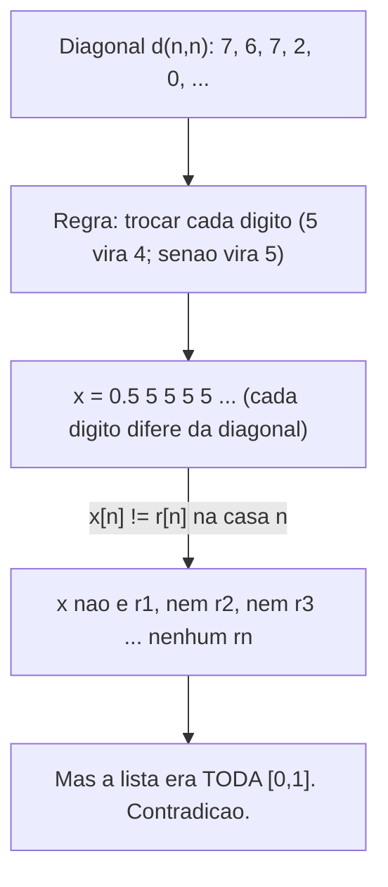
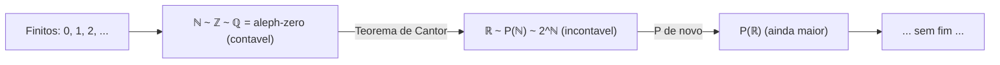
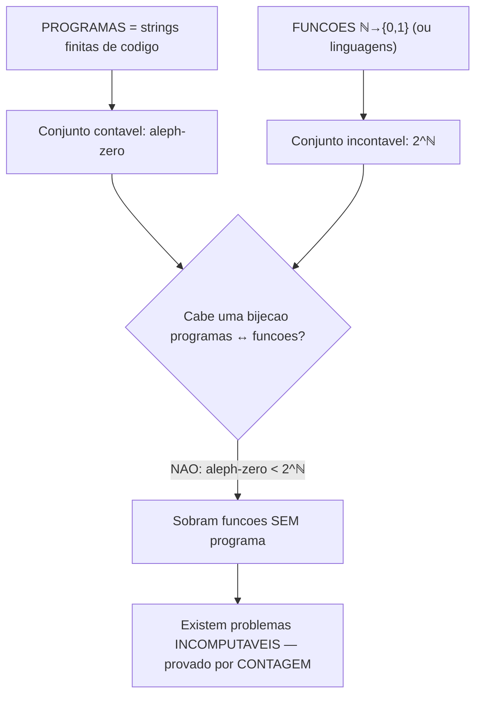

# Cardinalidade: contável e incontável

> [!abstract] TL;DR
> **Cardinalidade** é "quantos elementos". Pra conjuntos finitos, basta contar. Pra infinitos, contar não funciona — você nunca termina. A saída de Cantor: dois conjuntos têm o **mesmo tamanho** se existe uma **bijeção** entre eles. Com essa régua, ℕ, ℤ e ℚ têm todos o mesmo tamanho (são **contáveis**, ℵ₀). Mas ℝ é **maior** — estritamente maior — e a prova é a **diagonalização de Cantor**. A consequência que muda a vida do dev: existem **incontáveis** funções, mas só **contáveis** programas. Logo, **a maioria dos problemas não tem programa**. O incomputável foi provado por contagem, antes de ninguém exibir um exemplo.

---

## O problema: como medir o infinito?

Quantos elementos tem `{🜁, 🜂, 🜃}`? Três. Você apontou, contou, acabou.

Agora: quantos elementos tem ℕ = {0, 1, 2, 3, …}? "Infinitos." Beleza. E ℝ, os reais? Também "infinitos".

Pergunta perigosa: **são o mesmo infinito?**

A intuição grita "infinito é infinito, todos iguais". A intuição está **errada**. E o erro é tão fundo que demorou até o fim do século XIX pra alguém — Georg Cantor — encontrar a régua certa. Quando ele publicou, parte da comunidade matemática reagiu com horror; Kronecker o chamou de "corruptor da juventude". Hoje a hierarquia de infinitos é fundação de tudo — da teoria dos conjuntos à teoria da computação.

O incômodo é legítimo: o infinito não obedece à aritmética que você aprendeu. Tirar metade não diminui. Somar não aumenta. A única coisa que funciona é trocar "contar" por "parear".

> [!question] Por que "contar" não serve?
> Contar é parear com {1, 2, 3, …}: o primeiro, o segundo, o terceiro. Pra um conjunto finito isso termina e o último número é o tamanho. Pra um conjunto infinito, **você nunca chega ao último número**. O processo não tem fim, então não produz resposta. Precisamos de outra coisa.

A "outra coisa" é uma ideia que você já conhece de [[09 - Funções]]: a **bijeção**. É a chave que destranca o infinito — e, mais adiante, a fronteira do computável.

---

## A régua certa: bijeção define "mesmo tamanho"

Esqueça contar. Pense em **parear**.

Se numa festa toda pessoa tem exatamente um par dançando, e todo par tem exatamente uma pessoa, então **há tantas pessoas quanto pares** — sem contar ninguém. Você só precisa da correspondência um-pra-um. Não interessa se são 10 ou 10 milhões; a existência do pareamento perfeito já decreta "mesmo tamanho". E o pulo do gato: esse raciocínio **não depende de os conjuntos serem finitos**. Funciona para infinitos exatamente igual — é por isso que é a régua certa.

Isso é uma **bijeção**: uma função total, injetora (cada saída vem de uma entrada só) e sobrejetora (toda saída é atingida). Releia [[09 - Funções]] se "injetora/sobrejetora" embaçar.

> [!important] A definição que vale para tudo
> Dois conjuntos A e B têm a **mesma cardinalidade** — escrevemos |A| = |B| — **se e somente se existe uma bijeção A ↔ B.**
>
> Essa é a **única** definição que sobrevive ao infinito. Pra finitos ela coincide com "contar e comparar". Pra infinitos, ela é tudo o que temos — e funciona.

E os outros sinais?

- |A| ≤ |B| se existe uma **injeção** A → B (A cabe dentro de B sem colisões; B é pelo menos do tamanho de A).
- |A| < |B| se |A| ≤ |B| **e não existe** bijeção A ↔ B (A cabe, mas é estritamente menor — sobra B mesmo na melhor acomodação).

Repare na assimetria útil: pra mostrar |A| = |B| você precisa de **uma** bijeção (uma testemunha basta). Pra mostrar |A| < |B| você precisa provar que **nenhuma** bijeção existe (um argumento sobre todas as funções possíveis). A primeira é construção; a segunda costuma ser contradição. Guarde isso — é exatamente o formato das duas metades desta nota.

E há um atalho lindo, o **teorema de Cantor–Schröder–Bernstein**: se |A| ≤ |B| **e** |B| ≤ |A| (injeções nos dois sentidos), então |A| = |B|. Ou seja, você nem precisa exibir a bijeção diretamente — basta espremer A dentro de B e B dentro de A, e a igualdade está garantida. É a ferramenta que poupa trabalho braçal em provas de "mesmo tamanho".

Guarde também o |A| < |B|. É ele que vai separar contável de incontável.

---

## Finito × infinito: a parte tem o tamanho do todo

Aqui o infinito mostra a primeira esquisitice.

Considere ℕ = {0, 1, 2, 3, …} e os **pares** P = {0, 2, 4, 6, …}. Os pares são *metade* de ℕ, certo? Intuição diz que P é menor.

Intuição erra de novo. A bijeção `n ↦ 2n` pareia tudo:

| n (em ℕ) | 0 | 1 | 2 | 3 | 4 | … |
|----------|---|---|---|---|---|---|
| 2n (par) | 0 | 2 | 4 | 6 | 8 | … |

Cada natural casa com exatamente um par; cada par vem de exatamente um natural. Bijeção perfeita. Logo **|ℕ| = |Pares|**.

> [!warning] A assinatura do infinito
> Um conjunto é **infinito** exatamente quando tem a mesma cardinalidade de uma **parte própria** dele (um subconjunto que não é o todo). Para conjuntos finitos isso é impossível — tirar um elemento sempre diminui. "A parte tem o tamanho do todo" não é paradoxo: é a *definição operacional* de ser infinito.

### O Hotel de Hilbert

Hilbert popularizou a imagem. Um hotel com **infinitos** quartos (1, 2, 3, …), todos ocupados.

Chega **um** hóspede novo. Lotado? Não. Peça a cada hóspede que ande um quarto: o do quarto *n* vai pro *n+1*. O quarto 1 esvazia. O novo hóspede entra.

**Leitura do diagrama:** cada hóspede H*n* desliza um quarto à frente (a seta `n → n+1`). Ninguém fica sem quarto porque a fila não tem fim. O quarto 1 abre e o recém-chegado entra. Conclusão: **∞ + 1 = ∞**.

E não para por aí. Chega um **ônibus infinito**, com passageiros P₁, P₂, P₃, … Lotado de novo? Não. Peça a cada hóspede atual *n* que vá para o quarto **2n** — todos os quartos pares ficam ocupados, e **todos os ímpares esvaziam**. Sente o passageiro Pₖ no quarto 2k−1. Cabem todos. É a bijeção `n ↦ 2n` outra vez, agora reorganizando hóspedes para abrir espaço a um conjunto infinito inteiro. Moral: **∞ + ∞ = ∞**. E com a enumeração diagonal (que veremos em ℚ) até **infinitos ônibus infinitos** cabem de uma vez. O hotel nunca lota — porque ℵ₀ é robusto a essas operações.

---

## Contável: o primeiro infinito (ℵ₀)

> [!note] Definição
> Um conjunto é **contável** (ou **enumerável**) quando é finito **ou** tem a mesma cardinalidade de ℕ. Quando é infinito-contável, sua cardinalidade é **ℵ₀** ("alef-zero") — o menor infinito.

Contável = "dá pra fazer uma fila completa, primeiro, segundo, terceiro…, sem deixar ninguém de fora". Enumerar **é** exibir essa bijeção com ℕ.

Uma sutileza: contável **não** quer dizer "pequeno". ℚ é contável e tem infinitos elementos densamente espalhados pela reta. Contável quer dizer apenas *enfileirável* — existe uma ordem (não necessariamente a natural) em que você visita todos. A fila pode pular pra frente e pra trás na reta; o que importa é que cada elemento chega em algum passo finito.

### ℤ é contável (zig-zag)

Os inteiros …, −2, −1, 0, 1, 2, … parecem "duas vezes ℕ" mais o zero. Mas dá pra enfileirar todos, costurando positivos e negativos num **zig-zag**:

| Posição (ℕ) | 0 | 1 | 2 | 3 | 4 | 5 | 6 | … |
|-------------|---|----|----|----|----|----|----|---|
| Inteiro     | 0 | 1 | −1 | 2 | −2 | 3 | −3 | … |

Há até uma fórmula fechada para a bijeção: a posição par 2k recebe o inteiro +k, e a posição ímpar 2k−1 recebe −k. Toda posição de ℕ tem destino, todo inteiro tem origem. Nenhum buraco, nenhuma repetição.

**Leitura do diagrama:** alternamos 0, depois +1/−1, depois +2/−2… A regra é uma função: pares da fila viram negativos, ímpares viram positivos. Toda posição de ℕ recebe um inteiro e todo inteiro aparece numa posição. Bijeção ⇒ **|ℤ| = ℵ₀**.

### ℚ é contável (enumeração diagonal)

Agora o choque maior. Os **racionais** são densos — entre quaisquer dois racionais existe outro. Parece "muito mais" que ℕ. Não é.

Arrume as frações positivas *p/q* numa grade infinita: linha = numerador, coluna = denominador. Em vez de varrer linha por linha (você nunca sairia da primeira), percorra as **diagonais** ↗:

| p\q |  1  |  2  |  3  |  4  | … |
|-----|-----|-----|-----|-----|---|
| **1** | 1/1 | 1/2 | 1/3 | 1/4 | … |
| **2** | 2/1 | 2/2 | 2/3 | 2/4 | … |
| **3** | 3/1 | 3/2 | 3/3 | 3/4 | … |
| **4** | 4/1 | 4/2 | 4/3 | 4/4 | … |
| **…** |  …  |  …  |  …  |  …  | … |

Ordem de visita (diagonais): **1/1 → 1/2 → 2/1 → 3/1 → 2/2 → 1/3 → 1/4 → 2/3 → …** (pulando repetições como 2/2 = 1/1). Some os sinais e o zero com o truque do zig-zag e você enfileirou **todo** ℚ.

**Leitura do diagrama:** cada diagonal da grade (onde p+q é constante) é **finita**, então cabe inteira na fila antes da próxima começar. Varrendo diagonal após diagonal, toda fração é alcançada em posição finita. Resultado: **|ℚ| = ℵ₀**. Densidade não aumenta a cardinalidade.

### Os fatos de fechamento (e o que importa pro dev)

> [!tip] Contável é robusto
> - **União contável de conjuntos contáveis é contável.** (Empilhe as filas e re-enfileire na diagonal — mesmíssimo truque de ℚ.)
> - **Produto de dois contáveis é contável.** (A grade de ℚ já provou isso para ℕ × ℕ.)
> - **O conjunto de todas as strings finitas** sobre um alfabeto finito (ou contável) é **contável**.

O fechamento sob união contável merece um exemplo: o conjunto de **todos os números algébricos** (raízes de polinômios com coeficientes inteiros) é contável, porque há contáveis polinômios e cada um tem finitas raízes — uma união contável de conjuntos finitos. Consequência elegante: como ℝ é incontável, **existem (incontáveis) números transcendentes** — números que não são raiz de nenhum polinômio inteiro — provados por contagem, antes de Hermite suar pra mostrar que *e* é um deles. Mesma melodia do payoff que vem a seguir.

Esse último é o **gancho de ouro**. Strings de tamanho 0 (a string vazia), depois tamanho 1, depois 2… Sobre um alfabeto de *k* símbolos há exatamente *kⁿ* strings de tamanho *n* — uma quantidade **finita** para cada *n*. Empilhe os blocos por tamanho crescente e, dentro de cada bloco, ordene alfabeticamente (ordem "shortlex"). Pronto: toda string finita ganha uma posição finita na fila. Guarde firme: **todo texto finito é contável**. Programas são textos finitos. Já dá pra sentir aonde isso vai — e a seção do payoff vai cobrar essa dívida.

---

## Incontável: ℝ rompe a fila

Tudo até aqui foi contável. Você pode começar a achar que **todo** infinito é ℵ₀. Cantor mostrou que não.

> [!danger] Teorema (Cantor, 1891)
> O conjunto dos números reais é **incontável**. Não existe bijeção ℕ ↔ ℝ. Já no intervalo [0, 1] os reais não cabem numa fila: |ℝ| > ℵ₀.

Nota histórica: este é o argumento de **1891**, o da diagonal — elegante e visual. Cantor já tinha provado a incontabilidade de ℝ antes, em 1874, por um método diferente (intervalos encaixados). A versão diagonal pegou porque é reaproveitável: a mesmíssima mecânica reaparece em Gödel (incompletude) e em Turing (a parada). Aprenda a diagonal e você aprende três teoremas pelo preço de um.

A arma é a **diagonalização**. E a estratégia é prova por contradição (revise [[05 - Técnicas de prova]]): supomos que dá pra enfileirar, e construímos um número que **não pode estar** na fila.

A genialidade está em **não** atacar a lista toda de uma vez. Em vez de procurar "qual real faltou?" (impossível examinar infinitos), Cantor constrói um real *sob medida* que é forçado a discordar do *n*-ésimo da lista numa **única** casa — a *n*-ésima. Uma discordância localizada por linha, varrendo a diagonal, é o bastante pra garantir que o número novo não é igual a *nenhum* da lista. É economia pura: uma diferença por linha derruba uma enumeração inteira.

### A prova completa, passo a passo

**1. Suponha o contrário.** Admita que [0, 1] é contável. Então existe uma enumeração — uma lista *r₁, r₂, r₃, …* que contém **todos** os reais de [0, 1], cada um escrito em decimal:

$$r_i = 0.d_{i1}\,d_{i2}\,d_{i3}\,d_{i4}\ldots$$

onde *d_{ij}* é o *j*-ésimo dígito após a vírgula do *i*-ésimo número.

**2. Escreva a grade.** A lista (suposta completa) vira uma matriz infinita. Destaco a **diagonal** *d₁₁, d₂₂, d₃₃, …*:

| Real | dígito 1 | dígito 2 | dígito 3 | dígito 4 | dígito 5 | … |
|------|:--------:|:--------:|:--------:|:--------:|:--------:|---|
| r₁ | **7** | 4 | 1 | 5 | 9 | … |
| r₂ | 2 | **6** | 5 | 3 | 5 | … |
| r₃ | 8 | 9 | **7** | 9 | 3 | … |
| r₄ | 3 | 3 | 8 | **2** | 7 | … |
| r₅ | 1 | 6 | 1 | 8 | **0** | … |
| … | … | … | … | … | … | … |

A diagonal em negrito é **7, 6, 7, 2, 0, …** — o dígito *d_{nn}* do *n*-ésimo real.

**3. Construa o intruso x.** Defina um novo número *x* = 0.*x₁ x₂ x₃ …* trocando **cada** dígito da diagonal por uma regra simples. Por exemplo:

$$x_n = \begin{cases} 5, & \text{se } d_{nn} \neq 5 \\ 4, & \text{se } d_{nn} = 5 \end{cases}$$

(Uso 4 e 5 de propósito: nunca 0 nem 9, pra evitar a ambiguidade 0.4999… = 0.5000…)

Aplicando à diagonal **7, 6, 7, 2, 0, …** obtemos *x* = 0.**5 5 5 5 5 …** Cada dígito de *x* foi escolhido **diferente** do dígito diagonal correspondente.

**Leitura do diagrama:** pego a diagonal da grade, troco cada dígito por algo diferente, e nasce *x*. A seta crucial: *x* difere de *rₙ* **justamente na casa *n*** — por construção, *xₙ ≠ d_{nn}*. Logo *x* não pode ser igual a nenhum *rₙ* da lista. Mas a lista deveria conter *todos* os reais de [0, 1]. *x* está em [0, 1] e não está na lista. Contradição.

**4. Conclua.** *x* ∈ [0, 1], mas *x ≠ rₙ* para **todo** *n* (eles diferem na *n*-ésima casa). Então a lista **não era completa** — o que contradiz a suposição inicial.

Repare na peça-chave do passo 3: *x* foi desenhado para *encarar* a diagonal. A *n*-ésima casa de *x* discorda da *n*-ésima casa do *n*-ésimo número justamente porque mexemos no dígito *d_{nn}* — aquele que fica no cruzamento linha *n* / coluna *n*. É essa varredura pela diagonal que dá nome ao método e que garante uma discordância com **cada** linha, sem exceção.

A suposição "[0, 1] é contável" leva a absurdo. Portanto **[0, 1] é incontável**, e como [0, 1] ⊆ ℝ, segue **|ℝ| > ℵ₀**. ∎

> [!note] Onde a incontabilidade se esconde
> ℝ = ℚ ∪ (irracionais). Sabemos que ℚ é contável. Se os irracionais também fossem, ℝ seria união de dois contáveis — logo contável — contradizendo o que acabamos de provar. Conclusão: **os irracionais são incontáveis**. Toda a "massa" de ℝ está nos irracionais; os racionais, apesar de densos, são um punhado contável perdido num oceano incontável. A reta real é quase inteiramente feita de números que você não consegue escrever como fração.

> [!question] "E se eu só inserir o x na lista?"
> Pode. Mas aí a lista vira *x, r₁, r₂, …* e a diagonalização roda **de novo** sobre essa nova lista, gerando outro intruso *x′* que falta. O argumento não tem como ser remendado: **qualquer** enumeração de [0, 1] deixa de fora algum real. Não é "esqueci um", é estrutural.

> [!tip] Por que 4 e 5, e não 0 e 9?
> Um detalhe que separa a prova correta da furada. Em decimal, alguns números têm **duas** representações: 0.4999… = 0.5000… Se a regra de troca pudesse produzir um 9 ou um 0, o *x* construído poderia "acidentalmente" igualar algum *rₙ* via essa ambiguidade — e a contradição evaporaria. Escolhendo dígitos no miolo seguro (4 e 5, nunca 0 nem 9), o *x* tem representação **única** e a discordância dígito-a-dígito é genuína. É o tipo de cuidado que um entrevistador atento valoriza você mencionar.

### Teorema de Cantor: sempre há um infinito maior

A diagonalização não é só sobre ℝ. É um motor genérico.

> [!important] Teorema de Cantor (forma geral)
> Para **todo** conjunto A: |A| < |P(A)|, onde P(A) é o **conjunto das partes** (todos os subconjuntos de A — veja [[04 - Teoria dos conjuntos]]).
>
> Não existe sobrejeção A → P(A).

A prova é a **diagonalização em estado puro**, sem decimais pra atrapalhar. Dado *qualquer* candidato a sobrejeção *f: A → P(A)*, defina o **conjunto diagonal**:

$$D = \{\, a \in A : a \notin f(a) \,\}$$

D é um subconjunto de A, logo D ∈ P(A). Se *f* fosse sobrejetora, existiria algum *a₀ ∈ A* com *f(a₀) = D*. Pergunte: **a₀ ∈ D?**

- Se *a₀ ∈ D*, então pela definição de D temos *a₀ ∉ f(a₀) = D*. Contradição.
- Se *a₀ ∉ D*, então *a₀ ∉ f(a₀) = D*, e pela definição de D isso coloca *a₀ ∈ D*. Contradição.

Os dois casos explodem. Logo nenhum *a₀* mapeia para D — *f* **não** é sobrejetora. Como *f* era arbitrária, nenhuma função A → P(A) cobre P(A): |A| < |P(A)|. ∎ (Repare: o "a₀ ∈ D ↔ a₀ ∉ D" é exatamente o eco do paradoxo do barbeiro e da auto-referência que reaparece em Gödel e na parada.)

Aplicado a A = ℕ: o conjunto das partes **P(ℕ) é incontável**. E P(ℕ) tem a mesma cardinalidade de **2^ℕ** (as funções ℕ → {0,1}, ou as sequências infinitas de bits), que por sua vez tem a cardinalidade de ℝ. Três faces do mesmo infinito maior.

Por que P(ℕ) ≈ 2^ℕ? Porque escolher um subconjunto de ℕ é o mesmo que, para cada natural, responder "está dentro?" com sim/não — uma sequência infinita de bits. E por que 2^ℕ ≈ ℝ? Porque cada real em [0, 1] tem uma expansão binária (sequência de bits), e a diagonalização que provou a incontabilidade de ℝ é, no fundo, a mesma que prova a de 2^ℕ. A teia toda é o mesmo argumento usando roupas diferentes.

---

## O mapa: contável × incontável de um relance

Antes de subir a torre dos infinitos, fixe a fronteira numa tabela. À esquerda, tudo que cabe numa fila; à direita, tudo que estoura qualquer fila.

| Pergunta | **Contável** (ℵ₀) | **Incontável** (> ℵ₀) |
|----------|-------------------|------------------------|
| Definição operacional | existe bijeção com ℕ | **não** existe bijeção com ℕ |
| Dá pra enumerar (1º, 2º, 3º…)? | sim, lista completa | não — toda lista deixa alguém de fora |
| Exemplos | ℕ, ℤ, ℚ, primos, strings finitas, programas, ℕ × ℕ | ℝ, [0, 1], irracionais, P(ℕ), 2^ℕ, funções ℕ→ℕ, linguagens |
| Fecho sob união contável | continua contável | (já é o maior) |
| Técnica típica de prova | exibir uma bijeção/enumeração | diagonalização (contradição) |
| Papel na computação | os programas vivem aqui | os problemas/funções vivem aqui |

**Leitura da tabela:** as duas colunas não se misturam — um conjunto é exatamente um dos dois. A linha decisiva é a última: **programas** moram à esquerda (contáveis), **problemas** moram à direita (incontáveis). Esse desencontro é o coração do payoff. Note também que a coluna esquerda é "fechada" sob as operações usuais (união, produto), enquanto a direita já é grande demais pra crescer com elas — só o conjunto das partes a faz pular de degrau.

> [!warning] Armadilhas comuns
> - **"Denso ⇒ incontável"** — falso. ℚ é denso (entre dois racionais sempre há outro) e ainda assim contável. Densidade não mede cardinalidade.
> - **"Infinito + algo = mais infinito"** — falso para ℵ₀. ℵ₀ + 1 = ℵ₀, ℵ₀ + ℵ₀ = ℵ₀, ℵ₀ × ℵ₀ = ℵ₀. Só **exponenciar** (2^ℕ, o conjunto das partes) sobe de nível.
> - **"A lista que eu não consegui enumerar prova incontabilidade"** — falso. Sua incapacidade de achar a bijeção não prova que ela não existe. Incontabilidade exige um argumento sobre **todas** as enumerações possíveis (diagonalização), não uma tentativa frustrada.
> - **"Os irracionais são contáveis porque os racionais são"** — falso. ℝ = ℚ ∪ (irracionais). Se os irracionais fossem contáveis, ℝ seria união de dois contáveis, logo contável — contradição. **Os irracionais são incontáveis**; eles é que "carregam" o tamanho de ℝ.

---

## A hierarquia de infinitos

Cantor não achou *um* infinito maior — achou uma **torre** deles.

**Leitura do diagrama:** começamos nos finitos, subimos ao primeiro infinito ℵ₀ (onde moram ℕ, ℤ, ℚ — todos do mesmo tamanho), e o Teorema de Cantor nos lança para |ℝ|, estritamente maior. Repita P(·) e a torre nunca acaba: **não existe o maior infinito**.

> [!info] A hipótese do contínuo (curiosidade)
> Há *algum* infinito **entre** ℵ₀ e |ℝ|? A **hipótese do contínuo** diz que não — |ℝ| seria o próximo degrau. Gödel e Cohen provaram que ela é **independente de ZFC**: não dá pra provar nem refutar com os axiomas usuais da teoria dos conjuntos. Fica como você quiser. Curiosidade de mesa de bar matemática; não bloqueia nada do que vem abaixo.

---

## O payoff: contagem garante o incomputável

Aqui a matemática vira espada. Esta seção é o motivo de a nota existir.

Junte dois fatos que já provamos:

1. **Programas são contáveis.** Todo programa é uma **string finita** sobre um alfabeto finito (o código-fonte). E o conjunto das strings finitas é **contável** (provamos lá em cima). Logo há **ℵ₀** programas — no máximo tantos quanto ℕ.

2. **Funções são incontáveis.** Quantas funções ℕ → {0,1} existem? Exatamente **2^ℕ** — que por Cantor é **incontável**. (Idem para linguagens: uma linguagem é um subconjunto das strings, e P(strings) é incontável.)

**Leitura do diagrama:** de um lado, ℵ₀ programas. Do outro, 2^ℕ funções. Como ℵ₀ < 2^ℕ (estritamente, por Cantor), **não há como parear**: toda tentativa de associar um programa a cada função deixa funções órfãs. Essas órfãs são funções que **nenhum programa calcula**. E não é uma minoria — as órfãs são a **esmagadora maioria**: os programas formam um conjunto contável "de medida zero" dentro do incontável das funções. O computável é a exceção rara; o incomputável é o caso geral.

> [!danger] A fronteira, em uma frase
> **Existem incontáveis funções, mas só contáveis programas — logo a esmagadora maioria das funções não tem programa.** Isso prova que o **incomputável existe** sem exibir um único exemplo. Pura contagem.

Sinta o poder: ninguém precisou construir um problema difícil. O simples descompasso de cardinalidades — ℵ₀ contra 2^ℕ — **garante** que problemas sem solução algorítmica existem, e que são a regra, não a exceção. Os exemplos concretos (problema da parada, linguagens não-reconhecíveis) vêm **depois**, e usam a **mesma** diagonalização de Cantor para apontar um culpado específico.

> [!note] Existência × construção: a diferença filosófica
> Há duas perguntas distintas. "**Existem** problemas incomputáveis?" é respondida por **contagem** — pura, indireta, não exibe ninguém. "**Qual** problema é incomputável?" exige **construção** — e aí entra a diagonalização aplicada a máquinas de Turing, que monta um problema específico (a parada) e prova que ele não tem decisor. A contagem te dá o *quê* (existe); a construção te dá o *quem* (este aqui). Esta nota fecha a primeira pergunta. A segunda é da computação.

Vale insistir num ponto que costuma escapar: o conjunto de **todas as funções** ℕ → {0,1} é literalmente o mesmo objeto que 2^ℕ e que P(ℕ). Uma função que devolve 0 ou 1 para cada natural *é* a escolha de um subconjunto de ℕ (os naturais onde ela vale 1). Logo "incontáveis funções", "incontáveis subconjuntos de ℕ" e "incontáveis sequências de bits" são três modos de dizer a mesma incontabilidade. O argumento de contagem fica imune a como você prefere descrever o lado direito da fronteira.

> [!note] A computação herda esta nota
> O lado de computabilidade — onde a diagonalização reaparece para provar que o **problema da parada** é indecidível e que existem **linguagens não Turing-reconhecíveis** — vive em [[03-Dominios/Ciência/Teoria da Computação/10 - Decidível, reconhecível e a máquina universal]]. **Esta** nota é a dona da régua e da prova; lá ela é *aplicada*. Não duplicamos: linkamos.

---

## Na prática: o que o dev leva pra casa

A cardinalidade não é decoração. Ela impõe limites duros no que o código pode fazer.

**Quase todo real é incomputável (e indefinível).** Há contáveis programas, então só **contáveis** reais são computáveis (têm um algoritmo que cospe seus dígitos). Os computáveis — π, e, √2, todos os que você sabe nomear — formam um **subconjunto contável** dentro de um oceano incontável. Conclusão desconcertante: **quase todo número real não tem nome, fórmula nem programa.** Eles existem, mas você jamais os escreverá. Pior: como há contáveis *frases* em qualquer idioma (frases são strings finitas!), quase todo real também é **indefinível** — não há sequer uma descrição em português ou inglês que o isole. A reta real é majoritariamente feita de números *inomináveis*. Existe um exemplo célebre e cruel, a **constante de Chaitin** Ω: um real perfeitamente bem-definido, entre 0 e 1, cujos dígitos **nenhum programa** consegue computar — ela codifica a probabilidade de um programa aleatório parar.

**Não há bijeção tipos ↔ programas.** Por mais rico que seja o sistema de tipos, há só ℵ₀ programas para cobrir 2^ℕ comportamentos possíveis. Nenhuma linguagem captura "todas as funções" — sempre sobram funções sem termo que as denote.

**Testar todas as entradas é impossível em domínio infinito.** Se sua função aceita ℕ (ou strings de qualquer tamanho), o conjunto de entradas é infinito. Você jamais cobre tudo por enumeração — testes **amostram**, não esgotam. Mesmo que o domínio seja "só" contável (já é demais), rodar para cada caso nunca termina. É por isso que existem **propriedades** (property-based testing), **tipos** e **provas**: são substitutos finitos do impossível "rodar para todo input". Um teste de propriedade não verifica todas as entradas; ele verifica um *invariante* que vale para todas — trocando enumeração infinita por raciocínio.

**Hashing e o princípio da casa dos pombos infinito.** Você mapeia um domínio infinito (strings, objetos) num contradomínio finito (um hash de 64 ou 256 bits). Cardinalidade decreta: **colisões são inevitáveis**, porque você está espremendo um conjunto infinito-contável em um conjunto finito. Não existe função hash perfeita para entradas arbitrárias — a matemática proíbe. O melhor que se faz é tornar colisões raras e difíceis de provocar.

**Serialização e formatos não bastam.** Qualquer formato de dados (JSON, protobuf, o que for) só representa um conjunto **contável** de valores — afinal, cada mensagem é uma string finita. Logo nenhum formato consegue codificar "todos os reais" ou "todas as funções"; o que você serializa é sempre uma fatia contável da realidade. Útil lembrar quando alguém promete um schema que "captura qualquer coisa". Qualquer coisa contável, no máximo.

> [!warning] Floats NÃO são os reais
> O `double` IEEE 754 tem 64 bits. Logo há **no máximo 2⁶⁴** floats distintos — um conjunto **finito**, e portanto contável. Mas os reais em qualquer intervalo são **incontáveis**. A conclusão é brutal: **a maioria esmagadora dos números reais não é representável em ponto flutuante** — nem aproximável distintamente. Toda aritmética de `float`/`double` opera num retículo finito que finge ser ℝ. Erro de arredondamento, `0.1 + 0.2 != 0.3`, perda de precisão: são sintomas de empurrar um contínuo incontável para dentro de uma grade finita. Cardinalidade explica *por que* o vazamento é inevitável, não um bug.

---

> [!summary] Resumo em uma linha
> Mesmo tamanho = existe bijeção; ℕ ≈ ℤ ≈ ℚ são contáveis (ℵ₀) mas ℝ ≈ 2^ℕ é incontável (diagonalização de Cantor), e como há contáveis programas para incontáveis funções, **o incomputável existe por pura contagem**.

---

## Em entrevista

Cardinalidade aparece em entrevistas de duas formas: a pergunta de "matemática discreta" pura (prove que os racionais são contáveis / que os reais não são) e, mais valiosa, como **fundamento** quando você justifica *por que* o problema da parada é indecidível. Saber rodar a diagonalização no quadro — e conectá-la ao argumento de contagem programas-vs-funções — sinaliza maturidade real, não decoreba. Se te pedirem "existe algo que computadores não conseguem fazer?", a resposta forte começa pela contagem, não por um exemplo.

Um aviso de calibragem: em entrevista de produto ou backend, ninguém vai te pedir a diagonalização no quadro branco. O valor prático é **reconhecer a fronteira** — saber, quando alguém propõe "vamos testar todas as combinações" ou "vamos fazer um hash sem colisão para qualquer input", que a cardinalidade já decretou aquilo impossível, e explicar *por quê* em uma frase. É menos sobre exibir a prova e mais sobre ter a régua na cabeça. Quem entende contável × incontável para de prometer o impossível.

*"Two sets have the same cardinality when there's a bijection between them — that's the only definition that survives infinity."*
*"The naturals, integers, and rationals are all countable; you can enumerate each one with a bijection to ℕ."*
*"The rationals are countable via the diagonal enumeration of the grid of fractions — density doesn't increase cardinality."*
*"The reals are uncountable, and Cantor's diagonal argument proves it: assume a complete list, then build a number differing from the n-th entry in its n-th digit."*
*"That constructed number can't be anywhere in the list, which contradicts completeness — so no enumeration of the reals exists."*
*"Cantor's theorem generalizes this: the power set is always strictly larger than the set, so there's no largest infinity."*
*"There are only countably many programs — each is a finite string — but uncountably many functions, so most functions have no program."*
*"That's a counting proof that uncomputable problems exist, before exhibiting a single concrete example like the halting problem."*
*"Floats aren't the reals: there are finitely many IEEE 754 doubles but uncountably many reals, so most reals aren't representable."*

| Português | English |
|-----------|---------|
| Cardinalidade | Cardinality |
| Mesmo tamanho | Same size |
| Bijeção | Bijection / one-to-one correspondence |
| Injeção (injetora) | Injection (one-to-one) |
| Sobrejeção (sobrejetora) | Surjection (onto) |
| Contável / enumerável | Countable / enumerable |
| Incontável | Uncountable |
| Enumeração | Enumeration |
| Conjunto infinito | Infinite set |
| Alef-zero (ℵ₀) | Aleph-null |
| Argumento da diagonal | Diagonal argument |
| Diagonalização | Diagonalization |
| Conjunto das partes | Power set |
| Teorema de Cantor | Cantor's theorem |
| Hierarquia de infinitos | Hierarchy of infinities |
| Hipótese do contínuo | Continuum hypothesis |
| Prova por contradição | Proof by contradiction |
| Incomputável | Uncomputable |
| Ponto flutuante | Floating point |

---

> [!info] Lastro
> - **Rosen, Kenneth H.** *Discrete Mathematics and Its Applications* — seção "The Cardinality of Sets" (cardinalidade via bijeção, contável × incontável, diagonalização e Teorema de Cantor |A| < |P(A)|). [Capítulo (PDF)](https://people.cs.vt.edu/~irchen/4004/pdf/discreteMath/chapt17.pdf)
> - **Cantor, Georg (1891).** *Über eine elementare Frage der Mannigfaltigkeitslehre* — o artigo original do argumento da diagonal. [Cantor's diagonal argument — Wikipedia](https://en.wikipedia.org/wiki/Cantor%27s_diagonal_argument)
> - **Sipser, Michael.** *Introduction to the Theory of Computation*, cap. 4 (Sec. 4.2, "The Diagonalization Method") — contável/incontável aplicados a linguagens e o ponto de partida da indecidibilidade. [Companion notes (PDF)](https://kevinsun.org/files/toc/sipser-companion.pdf)
> - **Lehman, Leighton & Meyer.** *Mathematics for Computer Science* (MIT) — "Infinite Sets / Infinity is different / Power sets are strictly bigger". [PDF oficial (MIT)](https://people.csail.mit.edu/meyer/mcs.pdf)
> - **Cantor's theorem** — formulação geral |A| < |P(A)|. [Wikipedia](https://en.wikipedia.org/wiki/Cantor%27s_theorem)
