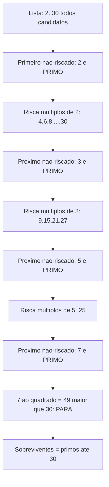
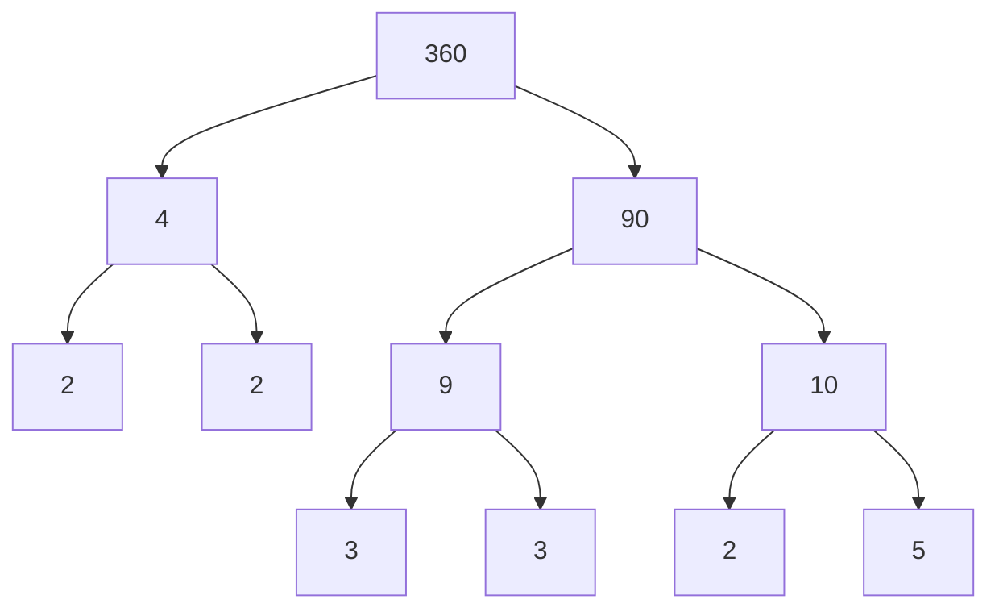
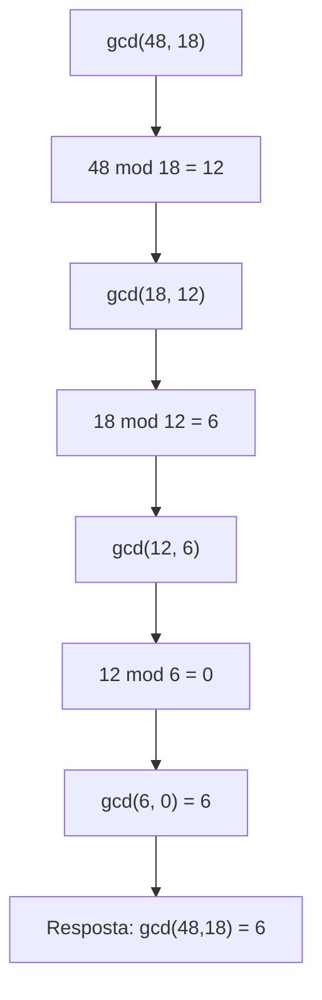

# Teoria dos números: divisibilidade e primos

> [!abstract] TL;DR
> Teoria dos números é a aritmética dos inteiros levada a sério. Tudo começa em uma relação binária bobinha: a ∣ b ("a divide b"). Dela brota o **algoritmo da divisão** (b = qa + r), os **primos** (os átomos da multiplicação), o **Teorema Fundamental da Aritmética** (toda fatoração é única) e o **algoritmo de Euclides** pro gcd — rápido como um relâmpago, O(log min). No fim, isso paga as contas do dev: tabelas hash de tamanho primo, checksums, redução de frações, escalonamento por LCM e a fundação inteira do RSA. Multiplicar primos é fácil; fatorar o produto é o pesadelo que segura a criptografia de pé.

Por que um dev sênior deveria revisitar a matemática do ensino fundamental?

Porque ela nunca foi só do ensino fundamental. O resto da divisão é a engrenagem do `%` que você usa todo dia. O gcd está dentro da biblioteca de frações da sua linguagem. E os primos são o motivo de o seu HTTPS não ser uma piada.

Vamos do átomo até a catedral.

## Divisibilidade: a relação que começa tudo

A definição é seca e precisa. Dados inteiros a e b com a ≠ 0, dizemos que **a divide b** — escrito a ∣ b — quando existe um inteiro k tal que b = a·k.

Repare: não tem resto. Não tem "quase". Ou existe esse k inteiro, ou não existe.

> [!example] Lendo a notação
> - 3 ∣ 12 porque 12 = 3·4 (k = 4). Verdadeiro.
> - 3 ∤ 13 porque não existe inteiro k com 13 = 3·k. Falso.
> - 7 ∣ 0 porque 0 = 7·0 (k = 0). Todo inteiro não-nulo divide 0.
> - 1 ∣ n para todo n. O 1 divide tudo.
> - n ∣ n para todo n ≠ 0. Todo número se divide.

Cuidado com a direção da barra. a ∣ b se lê "a divide b", e nessa leitura **a é o menor** (o divisor), b é o múltiplo. É contraintuitivo: a barra aponta do pequeno pro grande. Muita gente troca isso na pressão da entrevista.

### Propriedades que você vai usar em provas

A divisibilidade carrega três propriedades que aparecem em quase toda demonstração de teoria dos números. Conecte com `[[05 - Técnicas de prova]]` — elas são exercícios canônicos de prova direta.

**Transitividade.** Se a ∣ b e b ∣ c, então a ∣ c.

Por quê? Se b = a·k e c = b·m, então c = a·k·m = a·(km). O produto km é inteiro, logo a ∣ c. Pronto.

**Combinação linear.** Se a ∣ b e a ∣ c, então a ∣ (b·x + c·y) para quaisquer inteiros x, y.

Essa é ouro puro. Se a divide dois números, divide qualquer combinação inteira deles. É o que faz o algoritmo de Euclides funcionar lá na frente — segura essa ideia.

**Aritmética básica.** Se a ∣ b, então a ∣ (b·c) para todo inteiro c. E a soma de múltiplos de a é múltiplo de a.

Aqui está o mapa visual dessas propriedades. Lead-in: pense na divisibilidade como uma rede de setas entre números, onde cada seta "a → b" significa "a ∣ b".

| Propriedade | Hipótese | Conclusão | Exemplo numérico |
|---|---|---|---|
| Reflexiva | — | a ∣ a | 5 ∣ 5 |
| Transitiva | a ∣ b, b ∣ c | a ∣ c | 2 ∣ 6, 6 ∣ 18 ⟹ 2 ∣ 18 |
| Combinação linear | a ∣ b, a ∣ c | a ∣ (bx + cy) | 4 ∣ 8, 4 ∣ 12 ⟹ 4 ∣ (8·3 + 12·2) = 48 |
| Múltiplo | a ∣ b | a ∣ bc | 3 ∣ 9 ⟹ 3 ∣ 9·7 = 63 |
| Divide o zero | a ≠ 0 | a ∣ 0 | 17 ∣ 0 |

Leitura do diagrama: a linha da combinação linear é a estrela. Ela diz que a divisibilidade é "fechada" sob somas e múltiplos — se você tem dois números que a divide, qualquer mistura inteira deles ainda é divisível por a. Guarde isso pro Euclides.

## O algoritmo da divisão: o resto vira protagonista

Nem todo b é divisível por a. Quando não é, sobra um resto. E esse fato simples tem nome pomposo: **algoritmo da divisão** (que, ironicamente, não é bem um algoritmo, e sim um teorema de existência).

> [!note] Teorema da divisão
> Dados inteiros b e a, com a > 0, existem **únicos** inteiros q (quociente) e r (resto) tais que:
> $$b = q \cdot a + r, \quad 0 \le r < a$$ O resto r é sempre não-negativo e estritamente menor que o divisor a.

A condição 0 ≤ r < a é o pulo do gato. Ela amarra q e r de forma única. Sem ela, você teria infinitas formas de escrever b (poderia somar a num lado e subtrair no outro). Com ela, só existe uma.

> [!example] Trabalhando os números
> - b = 17, a = 5: 17 = 3·5 + 2, então q = 3, r = 2.
> - b = 48, a = 18: 48 = 2·18 + 12, então q = 2, r = 12.
> - b = 100, a = 7: 100 = 14·7 + 2, então q = 14, r = 2.

E os negativos? Aqui mora uma armadilha de entrevista. Pela definição matemática, o resto é **sempre não-negativo**:

- b = −17, a = 5: −17 = (−4)·5 + 3, então q = −4, r = 3. (Não é q = −3, r = −2!)

Mas o operador `%` da maioria das linguagens (C, Java, Go) segue o sinal do dividendo: `-17 % 5` devolve `-2`. Python é a exceção honrosa — `-17 % 5` devolve `3`, fiel à matemática. Saber essa diferença já te separa de metade dos candidatos.

O quociente, na matemática, é q = ⌊b / a⌋ — o piso da divisão real. O resto é o que sobra.

## Primos: os átomos da multiplicação

Um inteiro p > 1 é **primo** se seus únicos divisores positivos são 1 e ele mesmo. Caso contrário (e ainda > 1), é **composto**.

O 1 não é primo nem composto — é a unidade. Essa exclusão não é capricho; ela existe pra que a fatoração seja única (já chegamos lá).

Os primeiros primos: 2, 3, 5, 7, 11, 13, 17, 19, 23, 29… O 2 é o único primo par — todos os outros pares têm o 2 como divisor extra.

### O Crivo de Eratóstenes

Como achar todos os primos até n? O algoritmo mais antigo e ainda elegante: o **Crivo de Eratóstenes** (séc. III a.C.).

A ideia é por eliminação. Liste 2 até n. Pegue o primeiro não-riscado (é primo), risque todos os seus múltiplos. Repita. O que sobrar no fim são os primos.

Lead-in pro diagrama: vamos peneirar os números de 2 a 30. Cada passada risca os múltiplos de um primo.



Leitura do diagrama: o passo I é a otimização crucial. Você só precisa riscar até √n — porque se um número composto m ≤ n tem um fator maior que √n, ele obrigatoriamente tem outro **menor** que √n, que já o riscou. Como √30 ≈ 5,48, parar no 7 já é "de sobra" — bastava riscar pelos primos ≤ 5.

A peneira completa até 30, vista como grade:

| | 1 | 2 | 3 | 4 | 5 | 6 | 7 | 8 | 9 | 10 |
|---|---|---|---|---|---|---|---|---|---|---|
| **0+** | · | **2** | **3** | ✗ | **5** | ✗ | **7** | ✗ | ✗ | ✗ |
| **10+** | **11** | ✗ | **13** | ✗ | ✗ | ✗ | **17** | ✗ | **19** | ✗ |
| **20+** | ✗ | ✗ | **23** | ✗ | ✗ | ✗ | ✗ | ✗ | **29** | ✗ |

Leitura do diagrama: os 10 números em negrito (2, 3, 5, 7, 11, 13, 17, 19, 23, 29) sobreviveram à peneira — são os primos ≤ 30. O ✗ marca os compostos riscados. A densidade de primos vai caindo conforme subimos (mais sobre isso na seção de distribuição).

Complexidade do crivo: O(n log log n) pra achar todos os primos até n. Quase linear. É o método padrão quando você precisa de muitos primos pequenos de uma vez.

### O Teorema Fundamental da Aritmética

Aqui está a joia da coroa.

> [!important] Teorema Fundamental da Aritmética (TFA)
> Todo inteiro n > 1 pode ser escrito como produto de primos, e essa fatoração é **única** a menos da ordem dos fatores.

"Fundamental" não é exagero. É o teorema que garante que 12 é *sempre* 2²·3 e nunca outra coisa. Os primos são literalmente os átomos: indivisíveis, e toda matéria (todo inteiro) é uma combinação única deles.

> [!example] Árvore de fatoração
> - 60 = 2²·3·5
> - 360 = 2³·3²·5
> - 1001 = 7·11·13 (surpreendente, né?)

Lead-in pro diagrama: vamos fatorar 360 quebrando em dois fatores repetidamente até só sobrarem primos.



Leitura do diagrama: as folhas da árvore são 2, 2, 3, 3, 2, 5 — ou seja, 2³·3²·5 = 360. E aqui está a mágica do TFA: se você quebrasse 360 por um caminho diferente (digamos, 360 = 8·45 primeiro), as folhas seriam exatamente as mesmas. A unicidade independe do caminho.

**Por que a fatoração é única?** A prova usa **indução forte** — conecte `[[05 - Técnicas de prova]]`.

O esqueleto: suponha, por absurdo, que exista um menor inteiro n > 1 com duas fatorações distintas. Mostra-se (via o lema de Euclides: se p ∣ ab então p ∣ a ou p ∣ b) que um primo comum às duas pode ser cancelado, gerando um número *menor* que n também com fatoração dupla. Isso contradiz n ser o menor. Logo, não existe tal n. A indução forte é essencial porque você precisa assumir a unicidade pra *todos* os valores menores que n, não só pro anterior.

## A infinitude dos primos: a prova de Euclides

Os primos acabam em algum ponto? Não. E a prova é uma das mais belas de toda a matemática — Euclides, ~300 a.C., por contradição.

> [!quote] Prova de Euclides (completa)
> **Suponha**, por absurdo, que exista um número **finito** de primos. Liste todos eles: p₁, p₂, …, pₖ.
>
> Construa o número:
> $$N = (p_1 \cdot p_2 \cdot p_3 \cdots p_k) + 1$$
>
> Ou seja, multiplique *todos* os primos e some 1.
>
> Agora, N > 1, então pelo TFA ele tem algum divisor primo. Chame-o de q. Esse q tem que estar na nossa lista (ela era completa, lembra?). Então q ∣ (p₁·p₂···pₖ).
>
> Mas q também divide N. Pela propriedade da **combinação linear**, q divide a diferença:
> $$N - (p_1 \cdots p_k) = 1$$
>
> Logo q ∣ 1. Impossível! Nenhum primo divide 1 (todo primo é ≥ 2).
>
> A contradição mata a hipótese. **Os primos são infinitos.** ∎

Repare como a propriedade da combinação linear (lá da seção de divisibilidade) foi a chave: q divide os dois termos, então divide a diferença, que dá 1. Beleza pura.

Um cuidado comum: N **não precisa ser primo**. O argumento só diz que N tem um divisor primo fora da lista — N em si pode ser composto. Exemplo: 2·3·5·7·11·13 + 1 = 30031 = 59·509. Nenhum desses está na lista original, e é isso que basta.

## MDC, MMC e o algoritmo de Euclides

O **máximo divisor comum** (mdc, ou gcd) de a e b é o maior inteiro que divide ambos. O **mínimo múltiplo comum** (mmc, ou lcm) é o menor inteiro positivo múltiplo de ambos.

Via fatoração, há uma simetria linda:

- gcd: pegue cada primo comum no **menor** expoente.
- lcm: pegue cada primo (de qualquer um) no **maior** expoente.

> [!example] gcd e lcm via fatoração
> 48 = 2⁴·3 e 18 = 2·3²
> - gcd(48, 18) = 2¹·3¹ = 6 (menores expoentes: 2 entra com 1, 3 entra com 1)
> - lcm(48, 18) = 2⁴·3² = 144 (maiores expoentes)
>
> E a identidade de ouro: **gcd(a,b) · lcm(a,b) = a · b**. Confira: 6 · 144 = 864 = 48 · 18. ✓

Essa identidade significa que, calculado o gcd, o lcm sai de graça: lcm(a,b) = (a·b) / gcd(a,b).

### O algoritmo de Euclides

Fatorar é caro (mais sobre isso na cripto). Felizmente, pra achar o gcd você **não** precisa fatorar. Euclides descobriu um atalho há 2300 anos que ninguém superou.

> [!important] A recorrência de Euclides
> $$\gcd(a, b) = \gcd(b, \; a \bmod b)$$ Repita até o segundo argumento virar 0. Aí o primeiro é o gcd.
> $$\gcd(a, 0) = a$$

Por que funciona? Porque qualquer divisor comum de a e b também divide o resto a mod b (de novo: combinação linear). Então o conjunto de divisores comuns não muda quando trocamos a por a mod b — e os números encolhem rápido.

Lead-in pro diagrama: vamos rodar gcd(48, 18) passo a passo.



Leitura do diagrama: cada caixa substitui o par (a, b) por (b, a mod b). Os números despencam — de 48 pra 18 pra 12 pra 6 — e em três divisões chegamos ao zero. O último não-zero, 6, é o gcd. Compare com a fatoração da seção anterior: deu 6 também, mas sem precisar quebrar 48 e 18 em primos.

> [!tip] Trace em código (Python)
> ```python
> def gcd(a, b):
>     while b:
>         a, b = b, a % b
>     return a
> # gcd(48, 18) -> 6
> ```
> Três linhas. É o algoritmo não-trivial mais antigo ainda em uso diário.

### Por que Euclides é tão rápido

A complexidade é **O(log min(a, b))** — logarítmica. Cada passo, no pior caso, mais que metade o tamanho dos números a cada dois passos. Mas qual é exatamente o pior caso?

**O pior caso são dois números de Fibonacci consecutivos.** Pense: o algoritmo demora mais quando os restos encolhem o *mais devagar possível*. E a sequência de restos que decresce mais lentamente é justamente a de Fibonacci (cada um é a soma dos dois anteriores — o menor "encolhimento" possível a cada passo).

O **Teorema de Lamé** (Gabriel Lamé, 1844) cravou isso: o número de passos do algoritmo de Euclides nunca passa de **5 vezes** o número de dígitos decimais do menor número. Como os Fibonacci crescem como φⁿ (φ = razão áurea ≈ 1,618), o número de passos é proporcional ao logaritmo — daí o O(log min).

Em termos práticos: mesmo pra números de centenas de dígitos (como no RSA), o gcd sai em frações de segundo. Esse é o tipo de eficiência que torna a criptografia moderna viável.

### Euclides estendido e Bézout

Tem mais. O **algoritmo de Euclides estendido** não só calcula gcd(a, b) — ele encontra coeficientes inteiros x e y que satisfazem:

> [!important] Identidade de Bézout
> $$a \cdot x + b \cdot y = \gcd(a, b)$$ Sempre existem inteiros x, y que escrevem o gcd como combinação linear de a e b.

> [!example] Bézout para gcd(48, 18) = 6
> Subindo de volta pelas divisões:
> - 6 = 18 − 12
> - 12 = 48 − 2·18, então 6 = 18 − (48 − 2·18) = 3·18 − 48
> - Logo: 48·(−1) + 18·(3) = 6 ✓
>
> Aqui x = −1, y = 3. Confira: −48 + 54 = 6. ✓

Por que isso importa tanto? Por causa do **inverso modular**.

Quando gcd(a, m) = 1 (a e m são coprimos), Bézout dá ax + my = 1. Reduzindo módulo m, o termo my some, e sobra a·x ≡ 1 (mod m). Esse x é o **inverso de a módulo m** — o número que "desfaz" a multiplicação por a na aritmética modular. Sem ele, não há decifragem no RSA, não há divisão modular, não há resolução de congruências.

Esse é o gancho direto pra `[[15 - Aritmética modular e Fermat-Euler]]`, onde o inverso modular vira ferramenta de trabalho.

## Distribuição dos primos: quão raros eles são?

À medida que você sobe na reta dos inteiros, os primos ficam mais espaçados. Mas *quanto* mais?

A resposta é o **Teorema dos Números Primos** (provado em 1896 por Hadamard e de la Vallée Poussin). Seja π(n) a quantidade de primos ≤ n. Então:

$$\pi(n) \approx \frac{n}{\ln n}$$

Ou seja, perto de um número n, a "densidade" de primos é cerca de 1/ln(n). Quanto maior n, mais raros — mas nunca acabam (Euclides garantiu).

> [!example] Conferindo a aproximação
> - π(100) = 25 (primos reais); 100/ln(100) ≈ 21,7. Erro razoável.
> - π(1.000.000) = 78.498; 10⁶/ln(10⁶) ≈ 72.382. A aproximação melhora em escala.

Para o dev, a consequência prática é animadora: **primos são abundantes o suficiente**. Pra gerar uma chave RSA, você sorteia números grandes e testa primalidade. A densidade ~1/ln(n) garante que, mesmo entre números de 1024 bits, você acha um primo em poucas tentativas. A raridade não atrapalha.

## Prática: onde isso vive no código

Teoria dos números não é decoração de currículo. Está enterrada nas suas bibliotecas. Vamos ao mapa.

Lead-in pra tabela: cada conceito desta nota tem um endereço concreto em sistemas reais.

| Conceito | Uso em Computação |
|---|---|
| Resto / `mod` | Hash, índices circulares (ring buffers), relógios, paginação |
| Tamanho de tabela hash primo | Espalhamento uniforme, evita colisões em padrões |
| gcd | Redução de frações, simplificar razões de aspecto, períodos |
| lcm | Escalonamento de tarefas periódicas, sincronização de ciclos |
| Euclides estendido / Bézout | Inverso modular → decifragem RSA, CRT |
| Fatoração difícil | Segurança do RSA (chave pública) |
| Crivo de Eratóstenes | Pré-cálculo de primos, problemas de competição |
| Aritmética modular | Checksums, dígitos verificadores, hashing |

Leitura da tabela: note que a coluna da direita é puro dia-a-dia de engenharia — não tem nada de "matemática pura abstrata". O resto da divisão sozinho já cobre meia tela de casos de uso.

### Por que tabelas hash gostam de primos

Pergunta clássica de entrevista: por que tamanhos de tabela hash costumam ser primos?

A intuição: o passo final de muitas funções de hash é `índice = chave mod tamanho`. Se o tamanho compartilha fatores com as chaves, você perde dispersão.

Imagine tamanho 12 (= 2²·3) e chaves que são todas múltiplos de 4 (correlacionadas, como ponteiros alinhados ou IDs sequenciais escalados). Todas caem em poucos baldes — colisões em cascata. Com tamanho **primo**, o único fator comum possível entre a chave e o tamanho é 1 (ou o próprio primo). Não há padrão de divisibilidade pra explorar, e as chaves se espalham por todos os baldes.

> [!tip] Resumindo o argumento
> Tamanho primo ⟹ poucos fatores comuns com as chaves ⟹ padrões nas chaves (passos regulares, alinhamento) não viram colisões sistemáticas. É defesa contra entradas correlacionadas, não aleatórias.

### Dígitos verificadores e checksums

CPF, código de barras, IBAN, ISBN — todos terminam com um **dígito verificador** calculado por aritmética modular. A ideia: some os dígitos com pesos, tire o módulo, e o resto vira o dígito de controle. Se alguém digitar errado, a conta não fecha e o erro é detectado.

É teoria dos números pegando erros de digitação no caixa eletrônico. O mecanismo completo (pesos, módulos típicos como 10, 11, 97) mora em `[[15 - Aritmética modular e Fermat-Euler]]`.

### Redução de frações e escalonamento por LCM

**Frações:** pra reduzir a/b à forma irredutível, divida ambos por gcd(a, b). 48/18 → dividir por 6 → 8/3. É exatamente o que a classe `Fraction` do Python faz internamente.

**LCM no escalonamento:** se a tarefa A roda a cada 4 segundos e a tarefa B a cada 6, *quando elas coincidem*? Em lcm(4, 6) = 12 segundos. Esse cálculo aparece em planejamento de cron, em alinhamento de fases de relógio em hardware, em sincronização de animações com taxas de quadro diferentes.

### O gancho da criptografia

Aqui está o clímax. Multiplicar dois primos grandes é trivial — um computador faz p·q = n em microssegundos. Mas o caminho de volta — dado n, recuperar p e q (**fatorar**) — é assustadoramente difícil pra números grandes. Não se conhece algoritmo clássico eficiente.

Essa **assimetria** é a fundação do **RSA**: a chave pública é o produto n (e mais um expoente); a chave privada depende de conhecer p e q. Quem só tem n teria que fatorar — e fatorar um número de 2048 bits levaria mais tempo que a idade do universo com computadores clássicos.

Repare como tudo desta nota converge: você precisa de primos grandes (densidade π(n) garante que existem), de gerá-los (testes de primalidade), do inverso modular via Euclides estendido (pra montar a chave privada), e da dificuldade de fatoração (pra segurança). É teoria dos números do começo ao fim.

Os detalhes do RSA em si — Fermat, Euler, exponenciação modular — ficam em `[[15 - Aritmética modular e Fermat-Euler]]`. A análise de ameaças e o impacto da computação quântica caberão num futuro galho de Segurança Conceitual, ainda por escrever.

> [!summary] Resumo em uma linha
> Da relação a ∣ b nascem o algoritmo da divisão, os primos e o TFA (fatoração única), o algoritmo de Euclides para gcd em O(log min) com Bézout abrindo o inverso modular — e essa cadeia inteira sustenta hashes, checksums, frações, escalonamento e a criptografia RSA.

## Em entrevista

Teoria dos números aparece em entrevistas de duas formas: direta (implemente gcd, teste primalidade, fatore) e indireta (escolha o tamanho da tabela hash, explique por que `%` com negativos diverge entre linguagens). A pegadinha favorita é o resto de números negativos — saber que a matemática exige resto não-negativo, mas que C/Java/Go seguem o sinal do dividendo e Python não, demonstra rigor. Outra é defender por que primos espalham melhor em hashing. E o mais valorizado: conectar a dificuldade de fatoração à segurança do RSA, mostrando que você entende *por que* a cripto funciona, não só *que* funciona.

*"By the division algorithm, every integer b can be uniquely written as b equals q times a plus r, with the remainder r between zero and a."*

*"a divides b — written a vertical-bar b — means there's an integer k such that b equals a times k; there's no remainder."*

*"The Fundamental Theorem of Arithmetic says every integer greater than one factors into primes uniquely, up to ordering — and we prove uniqueness by strong induction."*

*"Euclid's algorithm computes the gcd in logarithmic time because the remainders shrink at least as fast as Fibonacci numbers; that's the worst case, by Lamé's theorem."*

*"The extended Euclidean algorithm gives Bézout coefficients, and when the gcd is one, those coefficients hand you the modular inverse for free."*

*"Hash table sizes are often prime so that correlated keys don't share factors with the table size, which keeps the distribution uniform."*

*"The whole of RSA leans on a simple asymmetry: multiplying two large primes is cheap, but factoring the product back is computationally infeasible."*

*"By the Prime Number Theorem, the count of primes up to n is roughly n over the natural log of n, so large primes are common enough to generate keys quickly."*

| Português | English |
|---|---|
| Divisibilidade | Divisibility |
| a divide b | a divides b |
| Algoritmo da divisão | Division algorithm |
| Quociente | Quotient |
| Resto | Remainder |
| Número primo | Prime number |
| Número composto | Composite number |
| Crivo de Eratóstenes | Sieve of Eratosthenes |
| Teorema Fundamental da Aritmética | Fundamental Theorem of Arithmetic |
| Fatoração | Factorization |
| Indução forte | Strong induction |
| Máximo divisor comum | Greatest common divisor (gcd) |
| Mínimo múltiplo comum | Least common multiple (lcm) |
| Algoritmo de Euclides | Euclidean algorithm |
| Algoritmo de Euclides estendido | Extended Euclidean algorithm |
| Identidade de Bézout | Bézout's identity |
| Coprimos / primos entre si | Coprime / relatively prime |
| Inverso modular | Modular inverse |
| Teorema dos números primos | Prime Number Theorem |
| Dígito verificador | Check digit |

> [!info] Lastro
> - Rosen, Kenneth H. *Discrete Mathematics and Its Applications* (8ª ed.), Cap. 4 "Number Theory and Cryptography" — divisibilidade, algoritmo da divisão, primos, gcd, Euclides, Bézout. [PDF](https://imanulhuq.yolasite.com/resources/Discrete%20Mathematics%20and%20Its%20Applications%20-%208e%20(Kenneth%20Rosen)%20[9781259676512]_compressed-compressed.pdf)
> - Lehman, Leighton & Meyer. *Mathematics for Computer Science* (MIT), Cap. 8 "Number Theory" — divisibilidade, gcd, "prime mysteries", TFA, aritmética modular. [LibreTexts](https://eng.libretexts.org/Bookshelves/Computer_Science/Programming_and_Computation_Fundamentals/Mathematics_for_Computer_Science_(Lehman_Leighton_and_Meyer)/02:_Structures/08:_Number_Theory) · [PDF MIT](https://people.csail.mit.edu/meyer/mcs.pdf)
> - Teorema de Lamé (pior caso de Euclides em Fibonacci, ≤ 5× dígitos decimais). [Mathematics LibreTexts](https://math.libretexts.org/Bookshelves/Combinatorics_and_Discrete_Mathematics/Elementary_Number_Theory_(Raji)/01:_Introduction/1.07:_Lame's_Theorem) · [cut-the-knot](https://www.cut-the-knot.org/blue/LamesTheorem.shtml)
> - Wolfram MathWorld, "Euclidean Algorithm" — complexidade e propriedades. [MathWorld](https://mathworld.wolfram.com/EuclideanAlgorithm.html)
> - Rosen, Kenneth H. *Elementary Number Theory and Its Applications* — referência complementar de teoria dos números pura. [PDF](https://users.fmf.uni-lj.si/lavric/Rosen%20-%20Elementary%20number%20theory%20and%20its%20applications.pdf)
