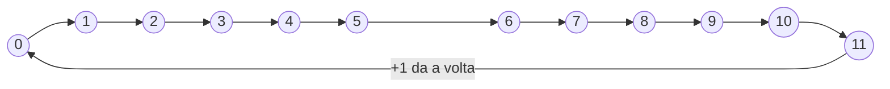
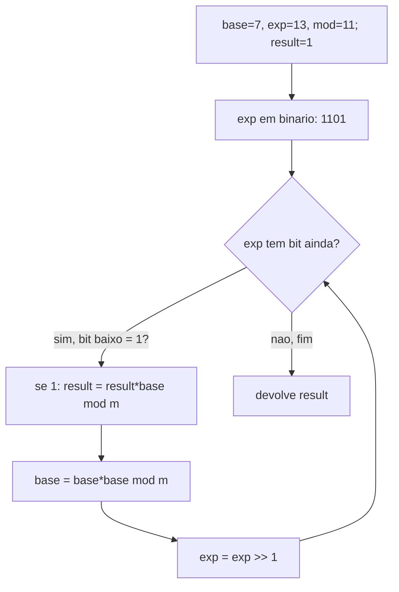
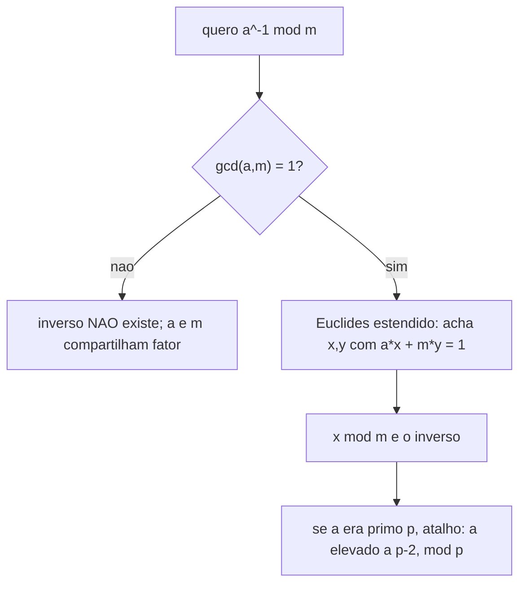
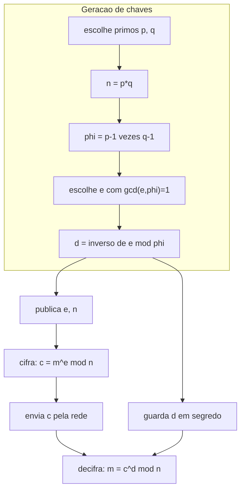

# Aritmética modular e Fermat-Euler

> [!abstract] TL;DR
> Aritmética modular é a matemática do resto: você joga fora o quociente e fica só com o que sobra na divisão por m. A relação a ≡ b (mod m) é uma relação de equivalência que parte ℤ em classes de resíduo, e soma, produto e potência sobrevivem ao corte. Dividir, não — pra isso existe o inverso modular, que só aparece quando gcd(a,m) = 1. Em cima disso, Fermat e Euler dão atalhos para potências gigantes, e é desses atalhos que o RSA é feito: cifrar e decifrar viram exponenciações modulares cuja correção é o teorema de Euler em pessoa. Mod 2³² é o overflow do seu int; mod capacidade é o seu ring buffer; mod primo é a sua tabela hash. Você já vive nesse mundo — esta nota é o mapa dele.

Quando você olha o relógio e são 22h, e alguém pergunta "que horas serão daqui a 5 horas?", você não responde 27h. Responde 3h.

Você acabou de fazer aritmética modular. Mod 24, ou mod 12 se for o ponteiro.

Essa é a ideia inteira: existe um número m, o **módulo**, e tudo que importa é o **resto** da divisão por ele. O quociente — quantas voltas o ponteiro deu — você descarta. 27 e 3 são "a mesma coisa" num relógio de 24 horas porque deixam o mesmo resto.

A matemática inteira desta nota é só levar essa intuição a sério.

## Congruência: a ≡ b (mod m)

A definição formal:

> [!note] Congruência
> a ≡ b (mod m) significa que **m ∣ (a − b)** — ou seja, m divide a diferença. Equivalente: a e b deixam o **mesmo resto** na divisão por m.

Lê-se "a é congruente a b módulo m". Os dois sinais ≡ não são "igual" — são "equivalente nesse mundo onde só o resto conta".

Exemplos concretos, m = 7:

- 17 ≡ 3 (mod 7), porque 17 − 3 = 14 e 7 ∣ 14. (17 dá resto 3; 3 dá resto 3.)
- 100 ≡ 2 (mod 7), porque 100 = 14·7 + 2.
- −1 ≡ 6 (mod 7), porque −1 − 6 = −7 e 7 ∣ −7. Resto negativo "dá a volta".

Esse último ponto é importante para dev: em matemática, o resto é sempre tomado no intervalo 0 a m−1. Em C, Java e JavaScript, `-1 % 7` dá −1, não 6. Guarde isso — morde em código de hash e de ring buffer.

### É uma relação de equivalência

Lembra de [[10 - Relações]]? Congruência mod m é o exemplo canônico de **relação de equivalência**:

- **Reflexiva**: a ≡ a (mod m), porque m ∣ 0.
- **Simétrica**: se a ≡ b então b ≡ a, porque se m ∣ (a−b) então m ∣ (b−a).
- **Transitiva**: se a ≡ b e b ≡ c, então a ≡ c (some as diferenças: m ∣ (a−b)+(b−c) = a−c).

E o que toda relação de equivalência faz? **Particiona** o conjunto. Aqui ela parte ℤ inteiro em m **classes de resíduo**: o conjunto dos números que dão resto 0, o dos que dão resto 1, ..., até resto m−1.

Esse conjunto de classes tem nome: **ℤ/mℤ** (lê-se "ℤ mod m ℤ"). Para m = 12, ℤ/12ℤ tem 12 elementos — exatamente as 12 posições do relógio.

Pense numa classe de resíduo como uma "gaveta". A gaveta do resto 3 mod 7 guarda ..., −11, −4, 3, 10, 17, 24, ... — todos congruentes entre si, infinitos números empacotados num único rótulo. Quando você faz aritmética modular, você não trabalha com os inteiros: trabalha com as **gavetas**. Somar a gaveta do 3 com a do 5 dá a gaveta do 8 ≡ 1 (mod 7), não importa quais representantes você pegou. É essa boa-definição que a próxima seção formaliza.

### O relógio modular

Aqui está o universo de ℤ/12ℤ desenhado como o que ele é: um círculo.

**Leitura do diagrama**: cada nó é uma classe de resíduo de ℤ/12ℤ. Andar +1 é avançar uma posição; chegar em 11 e somar 1 não te leva a 12 — te leva de volta a 0. Não existe "12" aqui: ele *é* o 0. Toda a aritmética modular é caminhar nesse anel fechado, onde somar é girar e o número some na volta. Por isso o nome técnico de ℤ/mℤ é **anel** (ring).

## O que fecha: soma, produto, potência

Aqui está a propriedade que faz tudo funcionar. Congruências se comportam como igualdades para as operações de anel:

> [!tip] Compatibilidade
> Se a ≡ b (mod m) e c ≡ d (mod m), então:
> - a + c ≡ b + d (mod m)
> - a − c ≡ b − d (mod m)
> - a · c ≡ b · d (mod m)
>
> E como corolário direto da última: a^k ≡ b^k (mod m) para todo k ≥ 0.

Tradução prática: **você pode reduzir mod m a qualquer momento** — antes, no meio, ou depois das contas — e o resultado final é o mesmo.

Isso é ouro computacional. Quer calcular 123 · 456 mod 7? Não precisa multiplicar os números cheios:

- 123 ≡ 4 (mod 7) e 456 ≡ 1 (mod 7).
- Então 123 · 456 ≡ 4 · 1 = 4 (mod 7).

Os números nunca cresceram. Esse é o segredo de fazer aritmética com números astronômicos sem nunca sair do tamanho de um `int`: reduza cedo, reduza sempre.

> [!question] Por que potência fecha mas a intuição assusta?
> Porque potência é só multiplicação repetida, e multiplicação fecha. Se a ≡ b, então a·a ≡ b·b, então a·a·a ≡ b·b·b... A indução faz o resto. Não há mágica — só a mesma regra aplicada k vezes.

Um truque clássico que cai disso: **regras de divisibilidade**. Por que um número é divisível por 9 se a soma dos seus dígitos é? Porque 10 ≡ 1 (mod 9), então 10ᵏ ≡ 1ᵏ = 1 (mod 9) para todo k. Um número como 3.471 = 3·10³ + 4·10² + 7·10 + 1 fica ≡ 3 + 4 + 7 + 1 = 15 (mod 9). Cada potência de 10 "colapsa" para 1, e sobra a soma dos dígitos. A regra do 11 sai do mesmo lugar: 10 ≡ −1 (mod 11), então os dígitos alternam de sinal. Essas regras de escola são teoremas de congruência disfarçados.

## O que NÃO fecha: divisão

Aqui o relógio quebra.

Em ℤ você divide cancelando: de 2x = 2y você conclui x = y. Em ℤ/mℤ isso **falha**.

Contraexemplo, mod 6:

- 2 · 1 = 2 e 2 · 4 = 8 ≡ 2 (mod 6).
- Então 2·1 ≡ 2·4 (mod 6), mas 1 ≢ 4.

Cancelar o 2 daria uma mentira. Por quê? Porque gcd(2, 6) = 2 ≠ 1. O 2 e o módulo "compartilham" um fator, e esse fator polui o cancelamento.

A saída não é dividir — é **multiplicar pelo inverso**. Mas inverso modular nem sempre existe. Antes de chegar nele, precisamos de uma ferramenta de potência.

## Exponenciação modular rápida

Suponha que você precise de 7¹³ mod 11.

Ingênuo: calcule 7¹³ = 96.889.010.407, depois tire mod 11. Funciona com números pequenos. Com expoentes de **2048 bits** (tamanho de chave RSA), o número intermediário teria mais dígitos que átomos no universo observável. Inviável.

A saída é **square-and-multiply** (eleva ao quadrado e multiplica), também chamada exponenciação binária. A ideia: olhe o expoente em **binário** e processe bit a bit, sempre reduzindo mod m.

13 em binário é 1101. Isso significa 13 = 8 + 4 + 1, então 7¹³ = 7⁸ · 7⁴ · 7¹.

**Leitura do diagrama**: o algoritmo varre o expoente bit a bit, do menos significativo ao mais. A cada passo ele **eleva a base ao quadrado** (acumulando potências de 2: 7, 7², 7⁴, 7⁸...) e, **se o bit atual for 1**, multiplica esse fator no resultado. Cada operação é seguida de "mod m", então nada nunca cresce além de m². O laço roda uma vez por bit — daí o custo.

Rodando 7¹³ mod 11 (bits de 13 = 1101, lendo da direita):

| bit | valor do bit | base atual | bit=1? multiplica | result |
|---|---|---|---|---|
| 0 | 1 | 7 | sim → 1·7 | 7 |
| 1 | 0 | 7²=49≡5 | não | 7 |
| 2 | 1 | 5²=25≡3 | sim → 7·3=21≡10 | 10 |
| 3 | 1 | 3²=9 | sim → 10·9=90≡2 | 2 |

Resultado: **7¹³ ≡ 2 (mod 11)**. Quatro multiplicações pequenas, nenhum número maior que 90.

> [!info] Custo: O(log e)
> O número de iterações é o número de bits do expoente — ou seja, **O(log e)**, não O(e). Para um expoente de 2048 bits, são ~2048 quadrados em vez de 2²⁰⁴⁸ multiplicações. É a diferença entre "instantâneo" e "fim do universo". Toda criptografia de chave pública depende dessa diferença.

## Inverso modular

Agora a divisão volta — pela porta certa.

> [!note] Inverso modular
> O inverso de a módulo m é o número a⁻¹ tal que **a · a⁻¹ ≡ 1 (mod m)**. Ele existe **se e somente se gcd(a, m) = 1** (a e m são coprimos).

Por que essa condição? Porque achar a⁻¹ é resolver a·x ≡ 1 (mod m), que é o mesmo que achar x, y com a·x + m·y = 1 — e isso, pela **identidade de Bézout**, só tem solução inteira quando gcd(a, m) = 1. Veja [[14 - Teoria dos números - divisibilidade e primos]] para Bézout e o gcd.

A ferramenta para achá-lo é o **Euclides estendido**, que além do gcd devolve os coeficientes de Bézout. Ele roda o algoritmo de Euclides normal (divisões sucessivas até o resto zerar) e depois "volta de marcha à ré" reconstruindo o 1 como combinação de a e m.

Veja o inverso de 7 mod 26 (esse módulo aparece em cifras de César sobre o alfabeto — 26 letras). Quero achar x com 7x ≡ 1 (mod 26).

| passo (descida de Euclides) | conta | resto |
|---|---|---|
| 26 = 3·7 + 5 | tira 7 de 26 | 5 |
| 7 = 1·5 + 2 | tira 5 de 7 | 2 |
| 5 = 2·2 + 1 | tira 2 de 5 | 1 |
| 2 = 2·1 + 0 | tira 1 de 2 | 0 → gcd = 1 |

Subindo (substituindo os restos de baixo para cima):

- 1 = 5 − 2·2
- 1 = 5 − 2·(7 − 5) = 3·5 − 2·7
- 1 = 3·(26 − 3·7) − 2·7 = 3·26 − 11·7

Então −11·7 ≡ 1 (mod 26), ou seja **7⁻¹ ≡ −11 ≡ 15 (mod 26)**. Confere: 7·15 = 105 = 4·26 + 1 ≡ 1. ✓ O coeficiente de a em Bézout *é* o inverso, módulo m. Esse é o algoritmo que toda biblioteca de cripto usa por baixo de `modInverse`.

**Leitura do diagrama**: tudo começa numa pergunta de coprimalidade. Se gcd ≠ 1, pare — não há inverso, e equações com esse a viram zero-ou-muitas soluções. Se gcd = 1, o Euclides estendido entrega os coeficientes de Bézout, e o coeficiente de a (reduzido mod m) é o inverso. O ramo da direita é o atalho de Fermat válido só quando o módulo é primo. Os dois caminhos chegam ao mesmo lugar; a escolha é só de eficiência.

Exemplo simples para fechar: inverso de 3 mod 7.

- Quero 3x ≡ 1 (mod 7). Testando: 3·5 = 15 = 14 + 1 ≡ 1 (mod 7). Pronto: **3⁻¹ ≡ 5 (mod 7)**.
- Euclides estendido daria o mesmo: 3·5 + 7·(−2) = 15 − 14 = 1.

Com isso, **equações lineares** mod m ficam triviais. Resolver 3x ≡ 4 (mod 7):

- Multiplique os dois lados por 3⁻¹ = 5: x ≡ 5·4 = 20 ≡ 6 (mod 7).
- Confere: 3·6 = 18 ≡ 4 (mod 7). ✓

> [!warning] Quando gcd(a,m) ≠ 1
> A equação ax ≡ b (mod m) pode ter **zero ou várias** soluções. 2x ≡ 1 (mod 6) não tem nenhuma (esquerda é sempre par mod 6, nunca 1). 2x ≡ 4 (mod 6) tem duas (x = 2 e x = 5). Coprimalidade é a fronteira entre "única solução" e "caos".

Há também um atalho quando m é primo: pelo teorema de Fermat (próxima seção), a⁻¹ ≡ a^(p−2) (mod p). Você calcula o inverso com uma exponenciação modular rápida. Elegante.

## Fermat e Euler: os atalhos de potência

Agora os dois teoremas que dão nome à nota. Eles respondem: o que acontece quando você eleva algo a uma potência alta mod m e há um padrão escondido?

### Pequeno Teorema de Fermat

> [!note] Pequeno Teorema de Fermat
> Se **p é primo** e gcd(a, p) = 1, então **a^(p−1) ≡ 1 (mod p)**.

(Pequeno para distinguir do Último Teorema de Fermat, que é outra história — muito mais difícil de provar e quase inútil para CS.)

Teste com p = 7, a = 3: 3⁶ = 729 = 104·7 + 1 ≡ 1 (mod 7). ✓

Por que isso acontece? Intuição combinatória: pegue a sequência a, 2a, 3a, ..., (p−1)a mod p. Quando gcd(a,p)=1, esses produtos são **uma permutação** de 1, 2, ..., p−1 (nenhum se repete, nenhum dá zero). Multiplicar todos de um lado e do outro, cancelar o (p−1)! comum, e sobra a^(p−1) ≡ 1. A multiplicação por a só **embaralha** as classes não-nulas — não cria nem destrói. Esse "embaralhar sem perder" é o coração de Fermat.

O poder disso: potências módulo p são **periódicas** com período que divide p−1. Você pode reduzir o expoente mod (p−1) antes de calcular. Quer 3¹⁰⁰ mod 7? Como 100 = 16·6 + 4, então 3¹⁰⁰ ≡ 3⁴ = 81 ≡ 4 (mod 7). O expoente despencou de 100 para 4.

### Generalização de Euler e o totiente φ

Fermat só vale para módulo primo. Euler generaliza para qualquer m, com um preço: troca p−1 por uma função φ.

> [!note] Teorema de Euler
> Se gcd(a, n) = 1, então **a^φ(n) ≡ 1 (mod n)**, onde φ(n) é a **função totiente de Euler**: a quantidade de inteiros em 1..n que são coprimos com n.

A φ conta "quantos vizinhos do anel são invertíveis". Exemplos:

- φ(7) = 6 (todos de 1 a 6 são coprimos com o primo 7). Em geral, **φ(p) = p − 1** para primo — e aí Euler vira Fermat. Fermat é o caso particular.
- φ(10) = 4 (os coprimos são 1, 3, 7, 9).
- φ(12) = 4 (coprimos: 1, 5, 7, 11).

A fórmula que o RSA explora: para n = p·q com p, q primos distintos,

**φ(pq) = (p − 1)(q − 1).**

Por que? Princípio de **inclusão-exclusão** (veja [[12 - Princípios combinatórios - casa dos pombos e inclusão-exclusão]]). Dos pq números em 1..pq, tire os múltiplos de p (são q deles) e os múltiplos de q (são p deles), depois some de volta o múltiplo de ambos que você tirou duas vezes (só o pq, 1 número):

φ(pq) = pq − q − p + 1 = (p−1)(q−1).

Inclusão-exclusão em duas linhas, e cai o número exato. Essa é a ponte combinatória que faz o RSA fechar.

### Teorema Chinês do Resto (CRT)

De passagem, porque o RSA o usa internamente para acelerar a decifração:

> [!note] Teorema Chinês do Resto (leve)
> Se os módulos m₁, m₂, ..., m_k são **coprimos dois a dois**, então um sistema de congruências x ≡ rᵢ (mod mᵢ) tem **solução única** mod (m₁·m₂·...·m_k).

Intuição: se você sabe o resto de x mod 3 e mod 5, você sabe x mod 15 sem ambiguidade. Os restos coprimos "triangulam" um único valor. Implementações de RSA decifram separadamente mod p e mod q e juntam via CRT — ~4× mais rápido.

Aqui o quadro comparativo dos três:

| Teorema | Enunciado | Condição | Caso especial de |
|---|---|---|---|
| Fermat | a^(p−1) ≡ 1 (mod p) | p primo, gcd(a,p)=1 | — (é o particular) |
| Euler | a^φ(n) ≡ 1 (mod n) | gcd(a,n)=1 | generaliza Fermat |
| CRT | sistema x≡rᵢ (mod mᵢ) tem solução única | mᵢ coprimos 2 a 2 | — |

**Leitura da tabela**: Fermat e Euler são teoremas de **periodicidade de potência** — eles te dão o expoente que "zera" a operação (volta a 1). Euler é o caso geral; Fermat é Euler quando n é primo e φ(n) = n−1. O CRT é de natureza diferente: não fala de potência, fala de **reconstruir** um número a partir de seus restos. Juntos, são exatamente o ferramental que o RSA precisa.

## RSA explicado em prosa

Agora juntamos tudo. O RSA (Rivest-Shamir-Adleman, 1978) é criptografia de **chave pública**: você publica uma chave para o mundo cifrar mensagens para você, e guarda uma chave secreta que só você usa para decifrar. O milagre é que conhecer a chave pública não ajuda em nada a achar a secreta.

Toda a engenharia é aritmética modular. Vamos com números brinquedo.

**1. Geração de chaves.**

- Escolha dois primos: p = 5, q = 11.
- n = p·q = **55**. Esse n vai no módulo de tudo.
- φ(n) = (p−1)(q−1) = 4·10 = **40**.
- Escolha um expoente público **e** com gcd(e, φ) = 1. Tome e = 3 (gcd(3, 40) = 1). ✓
- Calcule o expoente privado **d ≡ e⁻¹ (mod φ)**: quero 3d ≡ 1 (mod 40). Como 3·27 = 81 = 80 + 1 ≡ 1 (mod 40), temos **d = 27**.

Chave **pública**: (e, n) = (3, 55). Chave **privada**: (d, n) = (27, 55). p, q e φ são destruídos.

**2. Cifrar.** Mensagem m = 7 (um número menor que n).

c = mᵉ mod n = 7³ mod 55 = 343 mod 55 = 343 − 6·55 = 343 − 330 = **13**.

Manda o 13 pela rede. Qualquer um que intercepte vê só "13".

**3. Decifrar.** Quem tem d:

m = cᵈ mod n = 13²⁷ mod 55.

Com square-and-multiply, isso é rápido. O resultado é **7** — a mensagem de volta.

**Leitura do diagrama**: a coluna de geração roda **uma vez**, produzindo o par (e,n) público e o d privado. Cifrar é uma exponenciação modular com a chave pública; decifrar é outra, com a privada. Os dois caminhos só se encontram no `m = c^d mod n`, e só quem tem d completa a volta. Tudo são potências mod n — nada além desta nota.

### Por que decifrar desfaz cifrar?

Aqui Euler entra em pessoa. Decifrar faz cᵈ = (mᵉ)ᵈ = m^(ed) mod n.

Por construção, ed ≡ 1 (mod φ), ou seja **ed = 1 + k·φ(n)** para algum inteiro k. Então:

m^(ed) = m^(1 + kφ) = m · (m^φ)ᵏ.

Pelo teorema de Euler, m^φ(n) ≡ 1 (mod n) (quando gcd(m,n)=1). Logo (m^φ)ᵏ ≡ 1, e sobra:

m^(ed) ≡ m · 1ᵏ = **m (mod n)**.

A mensagem volta intacta. O RSA é literalmente o teorema de Euler vestido de protocolo. (O caso em que m compartilha fator com n é coberto separadamente via CRT — não estraga nada.)

### Por que é seguro?

Para achar d, o atacante precisa de φ(n) = (p−1)(q−1), e para isso precisa de p e q. Mas ele só conhece n. Recuperar p e q a partir de n é o **problema de fatoração de inteiros** — sem algoritmo clássico eficiente conhecido para n grande. Com primos de centenas de dígitos, fatorar n levaria além da idade do universo nos hardwares de hoje.

> [!danger] A segurança é uma aposta, não uma prova
> Ninguém **provou** que fatorar é difícil — só que ninguém achou um jeito rápido. E computadores quânticos, com o algoritmo de Shor, fatoram em tempo polinomial; é por isso que o mundo migra para criptografia pós-quântica. Aprofundamento fica para um futuro galho de Segurança Conceitual. O ponto matemático aqui: toda a fortaleza repousa numa assimetria — **multiplicar p·q é trivial, desmultiplicar é (presumivelmente) intratável.**

Repare na elegância da assimetria. As duas pontas usam a *mesma* operação — exponenciação modular, O(log e), barata. O que separa quem cifra de quem decifra não é poder computacional; é **posse de um número**: o d, que por sua vez só se calcula sabendo φ(n), que por sua vez só se calcula fatorando n. Toda a criptografia de chave pública vive nesse vão entre "fácil de fazer" e "difícil de desfazer". Aritmética modular fornece a operação fácil; teoria dos números fornece o cadeado.

> [!question] Por que não usar primos pequenos como no exemplo?
> Porque n = 55 se fatora de cabeça (5·11), e aí qualquer um calcula φ = 40 e d = 27. O exemplo é didático; é seguro tanto quanto um cadeado de papel. RSA real usa n de 2048 ou 4096 bits, isto é, p e q com ~300 a 600 dígitos decimais cada. A matemática é idêntica — só os números mudam de escala até a fatoração virar inviável. Esse "só" é a engenharia inteira.

O lado probabilístico — como você *acha* primos grandes rapidamente, via testes de primalidade randomizados como Miller-Rabin — vive em [[19 - Probabilidade discreta]].

## Onde aritmética modular já mora no seu código

RSA é o exemplo glamouroso. Mas você usa mod m o dia inteiro, muitas vezes sem perceber.

| Uso | Como o mod aparece | Por quê |
|---|---|---|
| **Overflow / wrap-around** | inteiros são aritmética mod 2³² ou mod 2⁶⁴ | `int` de 32 bits "dá a volta" exatamente como o relógio; `MAX_INT + 1` vira o menor negativo |
| **Ring buffer** | índice = (índice + 1) mod capacidade | a fila circular reaproveita o array; o ponteiro gira no anel |
| **Hash table** | bucket = hash(chave) mod tamanho_tabela | espalha chaves nos baldes; tamanho **primo** reduz colisões |
| **Hashing consistente** | nós em anel de 0..2³²−1, chave vai ao próximo nó | mod no anel reparticiona pouco quando um nó sai/entra |
| **Dígito verificador (ISBN, Luhn)** | soma ponderada mod 10 ou mod 11 | detecta erro de digitação se o resto não bater |
| **CRC / checksum** | resto da divisão polinomial mod polinômio | acha corrupção de bits em rede/disco |

**Leitura da tabela**: repare no padrão. Sempre que algo precisa **"dar a volta"** (buffers, contadores), ou **espalhar uniformemente** (hash), ou **detectar um erro pequeno** (checksums), a ferramenta é o resto. Modular não é um tópico de criptografia que você visita uma vez — é a aritmética nativa de máquinas finitas.

Detalhando os mais úteis em entrevista:

**Overflow é aritmética mod 2ⁿ.** Quando seu `uint32` passa de 4.294.967.295 e volta a 0, isso não é um bug do hardware — é a definição. CPUs fazem aritmética em ℤ/2³²ℤ. Por isso `a + b` pode dar negativo: você girou o relógio binário e caiu no lado dos negativos do complemento de dois. Entender isso explica overflows silenciosos e por que `(low + high) / 2` pode estourar em busca binária (use `low + (high − low)/2`). É também por que um contador de 64 bits que incrementa a cada nanossegundo só "dá a volta" depois de ~585 anos: 2⁶⁴ nanossegundos. O wrap-around é real, só que o relógio é gigantesco.

> [!example] Wrap-around proposital
> Nem sempre overflow é bug. Hashes como FNV e muitos PRNGs *querem* o wrap-around: eles multiplicam e somam deixando o `uint` transbordar de propósito, porque mod 2⁶⁴ embaralha bem os bits altos. O mesmo fenômeno que causa um bug de overflow é a ferramenta que faz o hash espalhar. Contexto mudou; matemática é a mesma.

**Hash com mod primo.** Um tamanho de tabela primo distribui melhor padrões regulares de chaves do que uma potência de 2, porque chaves com periodicidade comum não "ressoam" com o módulo. É folclore prático com base em teoria dos números: fatores compartilhados entre chave e módulo concentram colisões — exatamente o mesmo fenômeno do cancelamento que quebra a divisão modular.

**Luhn (cartão de crédito) e ISBN.** O último dígito de um cartão é escolhido para que a soma ponderada de todos os dígitos seja ≡ 0 (mod 10). Trocar um dígito por engano quase sempre quebra a congruência, e o sistema rejeita antes de bater no banco. ISBN-10 usa mod 11 (e por isso às vezes precisa do dígito "X" = 10). É detecção de erro barata, puro resto.

**CRC.** Trata os bits da mensagem como coeficientes de um polinômio e tira o **resto** da divisão por um polinômio gerador fixo. É aritmética modular num anel de polinômios (em vez de mod inteiro, mod polinômio). Se um bit vira no caminho, o resto recalculado não bate, e você sabe que o pacote corrompeu. Ethernet, ZIP e discos rígidos usam variantes de CRC justamente porque o resto é barato de calcular em hardware e pega quase todo erro de rajada.

**Hashing consistente.** Quando você espalha chaves por N servidores com `servidor = hash(chave) mod N`, trocar N (adicionar/remover um servidor) **remapeia quase tudo** — quase toda chave muda de dono, e o cache inteiro invalida. O hashing consistente conserta isso colocando servidores e chaves num **anel** de 0 a 2³²−1 (um ℤ/2³²ℤ gigante): cada chave vai ao próximo servidor em sentido horário no anel. Tirar um servidor só reatribui as chaves *dele*, não as do anel inteiro. É o mesmo relógio modular da primeira seção, agora servindo de mapa de distribuição em sistemas distribuídos. O resto, de novo, fazendo o mundo "dar a volta" de forma estável.

> [!tip] O fio condutor
> Pare e veja o padrão que atravessa esta nota inteira. Relógio, overflow, ring buffer, hash, hashing consistente, RSA: todos são **estruturas finitas que dão a volta**. Sempre que um sistema tem um número fixo de estados e precisa reaproveitá-los, a aritmética nativa dele é mod m. Aprender isso uma vez é aprender uma dúzia de coisas de CS de uma vez só.

> [!summary] Resumo em uma linha
> Aritmética modular é a matemática do resto onde soma, produto e potência fecham mas divisão exige inverso (gcd=1); Fermat e Euler dão atalhos de potência que o RSA transforma em cifra cuja segurança é a dificuldade de fatorar n.

## Em entrevista

Aritmética modular cai em entrevista de duas formas: direto, em problemas de teoria dos números e design de hash/checksum; e indireto, quando alguém pergunta "explique RSA" ou "por que tamanho de tabela primo?". O senior que sabe ligar overflow, ring buffer e RSA à *mesma* ideia — o resto — demonstra fundamento, não decoreba. Saiba derivar φ(pq) por inclusão-exclusão e explicar por que decifrar desfaz cifrar via Euler; isso separa quem entende de quem memorizou.

- *Modular arithmetic is the math of remainders: we keep what's left after dividing by the modulus and throw the quotient away.*
- *Congruence modulo m is an equivalence relation; it partitions the integers into residue classes, the ring ℤ/mℤ.*
- *Addition, multiplication, and exponentiation are well-defined on congruences, so I can reduce mod m at any point to keep numbers small.*
- *Division isn't free — I need a modular inverse, which exists only when the element is coprime to the modulus.*
- *Fast modular exponentiation by square-and-multiply runs in O(log e), which is what makes public-key crypto tractable.*
- *Fermat's little theorem is the prime case of Euler's theorem; both say a power eventually cycles back to 1.*
- *RSA is just two modular exponentiations whose correctness is Euler's theorem, and whose security rests on integer factoring being hard.*
- *Integer overflow is arithmetic mod 2³²; a ring buffer index is mod capacity; a hash bucket is mod table size — same idea everywhere.*
- *I'd pick a prime table size because shared factors between key and modulus concentrate collisions, the same reason cancellation fails modularly.*

| PT | EN |
|---|---|
| aritmética modular | modular arithmetic |
| módulo | modulus |
| congruência | congruence |
| resto | remainder |
| classe de resíduo | residue class |
| relação de equivalência | equivalence relation |
| coprimo | coprime / relatively prime |
| inverso modular | modular inverse |
| exponenciação modular | modular exponentiation |
| eleva-ao-quadrado-e-multiplica | square-and-multiply |
| máximo divisor comum | greatest common divisor (gcd) |
| identidade de Bézout | Bézout's identity |
| Euclides estendido | extended Euclidean algorithm |
| Pequeno Teorema de Fermat | Fermat's little theorem |
| teorema de Euler | Euler's theorem |
| função totiente | Euler's totient function |
| Teorema Chinês do Resto | Chinese Remainder Theorem |
| chave pública | public key |
| estouro de inteiro | integer overflow |
| dígito verificador | check digit |

> [!info] Lastro
> - Rivest, Shamir, Adleman. *A Method for Obtaining Digital Signatures and Public-Key Cryptosystems*. Communications of the ACM, 21(2):120–126, 1978. O artigo original do RSA.
> - Rosen, Kenneth H. *Discrete Mathematics and Its Applications*. Capítulo "Number Theory and Cryptography" — congruências, Fermat, Euler, totiente e RSA.
> - Lehman, Leighton, Meyer. *Mathematics for Computer Science* (MIT 6.042). Capítulo de teoria dos números: aritmética modular, inversos, Euler e a derivação do RSA.
> - Rosen, Kenneth H. *Elementary Number Theory and Its Applications*. Teoremas de Fermat e Euler e o Teorema Chinês do Resto em profundidade.
