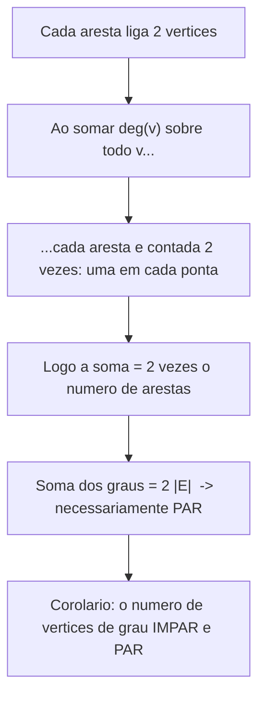
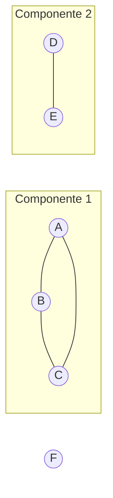
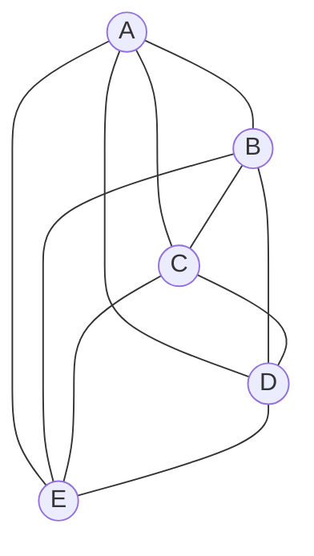
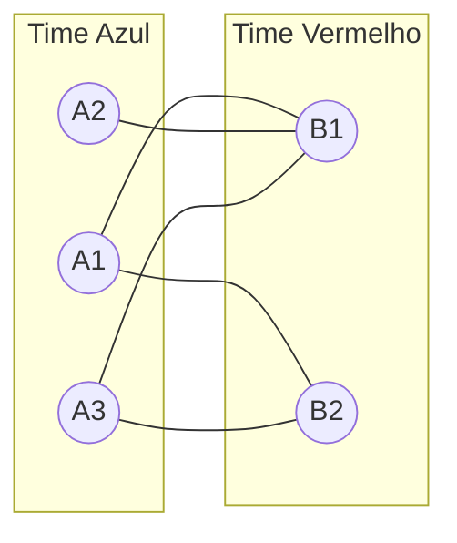
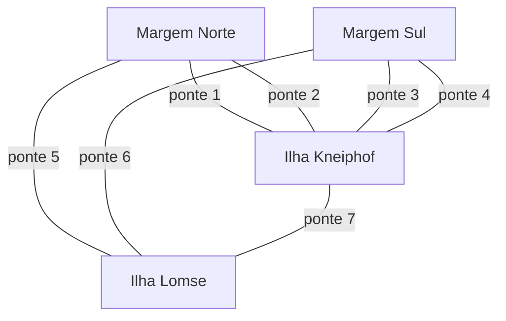
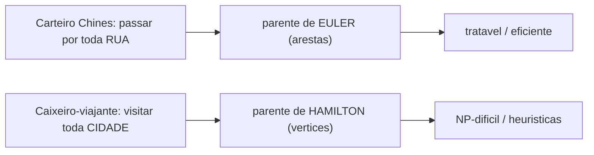

# Teoria dos grafos: o lado matemático

> [!abstract] TL;DR
> Um grafo é só um par G = (V, E): um conjunto de vértices e um conjunto de arestas ligando pares deles. Dessa definição minúscula sai metade da ciência da computação. Esta nota é o **lado matemático**: o que é um grafo como objeto, o handshaking lemma (∑ deg(v) = 2|E|), conexidade, grafos especiais (Kₙ, bipartido, ciclo), e a grande lição — Euler é fácil (caracterização simples, algoritmo linear), Hamilton é intratável (NP-difícil, sem caracterização). As estruturas de dados e os algoritmos de travessia (BFS/DFS/Dijkstra) ficam em [[03-Dominios/Ciência/Estruturas de Dados/11 - Grafos - travessia e algoritmos]]. Aqui a gente cuida da teoria que diz *por que* aqueles algoritmos funcionam e *quais* problemas são impossíveis de resolver rápido.

---

## A fronteira: matemática × estrutura de dados

Tem dois jeitos de olhar pra um grafo, e eles não competem — eles se completam.

Um é o jeito **estrutura de dados**: como guardo isso na memória? Lista de adjacência ou matriz? Como faço BFS? Como o Dijkstra acha o caminho mais curto? Isso é engenharia. Está todo em [[03-Dominios/Ciência/Estruturas de Dados/11 - Grafos - travessia e algoritmos]], e esta nota **não** vai reimplementar nada disso.

O outro é o jeito **matemático**: o que é um grafo *como objeto*? Que propriedades ele tem antes de eu escrever uma linha de código? Quantas arestas no máximo? Quando dois grafos são "o mesmo"? Quais problemas têm solução elegante e quais são uma parede?

Por que separar? Porque a matemática te diz **quando vale a pena escrever o algoritmo**. Saber que o ciclo de Euler tem um teste em tempo linear, e que o ciclo de Hamilton é NP-difícil, muda a decisão de engenharia antes de você abrir o editor. A teoria é o mapa; a estrutura de dados é o veículo.

> [!tip] A regra desta nota
> Se a frase começa com "como eu *implemento*", é da outra nota. Se começa com "*é verdade que*" ou "*existe um*", é desta aqui.

---

## O objeto: G = (V, E)

Um **grafo** é um par G = (V, E). O V é um conjunto de **vértices** (nós). O E é um conjunto de **arestas** — cada aresta liga um par de vértices.

É só isso. Pessoas e amizades. Cidades e estradas. Funções e quem-chama-quem. Módulos e imports. Tudo que tem "coisas" e "ligações entre coisas" é um grafo.

### Dirigido × não-dirigido

A primeira bifurcação: a aresta tem **direção**?

Num grafo **não-dirigido**, a aresta {u, v} é uma rua de mão dupla. "Ana é amiga de Bia" implica "Bia é amiga de Ana". A aresta é um *conjunto* de dois vértices — sem ordem.

Num grafo **dirigido** (dígrafo), a aresta (u, v) é uma flecha, mão única. "Ana segue Bia" no Twitter **não** implica "Bia segue Ana". A aresta é um *par ordenado* — a ordem importa.

> [!question] Por que isso é mais que pedantismo?
> Porque a estrutura matemática muda. Num dígrafo, cada vértice tem **dois** graus: o de entrada (in-degree, quantas flechas chegam) e o de saída (out-degree, quantas saem). Conexidade vira dois conceitos diferentes. E — pulo de gato — toda **relação** binária sobre um conjunto *é* um dígrafo. Isso conecta direto com [[10 - Relações]]: reflexividade vira laço em todo vértice, simetria vira "toda flecha tem a reversa", transitividade vira "atalho fechado".

### Os parentes do grafo simples

O grafo "limpo" — uma aresta no máximo por par, sem aresta de um vértice nele mesmo — chama-se **grafo simples**. Mas o mundo é sujo:

- **Multigrafo**: aceita **arestas paralelas** — dois vértices ligados por mais de uma aresta. (Königsberg, daqui a pouco, é um multigrafo: tinha duas pontes para a mesma ilha.)
- **Laço** (self-loop): uma aresta de um vértice para ele mesmo. Um nó que aponta pra si.
- **Ponderado**: cada aresta carrega um **peso** (distância, custo, capacidade, latência). Sem peso, o grafo só sabe "ligado ou não". Com peso, ele vira mapa de estradas — e é aí que Dijkstra entra (lá na outra nota).

### Vocabulário de vizinhança

Dois conceitos que vão aparecer o tempo todo:

- **Vizinhança** de v: o conjunto de vértices ligados a v por uma aresta. Os "amigos diretos".
- **Adjacência**: u e v são **adjacentes** se existe a aresta {u, v}. É a relação "tem ligação direta".

Guarde esses dois — toda a representação computacional (lista vs. matriz) é só um jeito de responder rápido "quem é vizinho de quem".

---

## Grau e o handshaking lemma

O **grau** de um vértice v, escrito deg(v), é o número de arestas que tocam v. (Num laço, conta-se 2 — a aresta toca o vértice nas duas pontas.)

Agora o primeiro teorema bonito da teoria, e ele cabe numa frase.

> [!important] Handshaking Lemma (lema do aperto de mão)
> Em qualquer grafo não-dirigido finito:
> $$\sum_{v \in V} \deg(v) = 2|E|$$
> A soma dos graus de todos os vértices é igual ao **dobro** do número de arestas.

### Por que "aperto de mão"?

Imagine uma festa. Cada aperto de mão envolve **duas** pessoas. Se você somar quantos apertos cada pessoa deu, vai contar cada aperto duas vezes — uma por cada mão envolvida. Logo, a soma total é par, igual a 2× o número de apertos.

Troque "pessoa" por vértice e "aperto" por aresta. Está provado.

**Leitura do diagrama**: a prova inteira é uma cadeia de quatro passos. A virada está no terceiro — "cada aresta é contada duas vezes". Não tem álgebra pesada; é contagem honesta. O retângulo final é o corolário que cai de graça.

### O corolário que parece mágica

> [!note] O número de vértices de grau ímpar é sempre par
> Por quê? A soma total dos graus é par (é 2|E|). Os vértices de grau **par** já somam um número par. Para o total continuar par, os vértices de grau **ímpar** têm que se equilibrar — e a única forma de uma soma de números ímpares dar par é haver uma quantidade **par** deles.

Isso não é curiosidade de prova. É a chave que mata o problema de Königsberg em uma linha — você vai ver.

E há a versão dirigida: num dígrafo, ∑ in-degree = ∑ out-degree = |E|. Toda flecha sai de algum lugar e chega em algum lugar; as duas contagens dão o número de arestas.

---

## Andando pelo grafo: passeio, trilha, caminho, ciclo

Quatro palavras que parecem sinônimos e não são. A diferença é o que você pode repetir.

| Termo | Pode repetir vértice? | Pode repetir aresta? | Fecha (volta ao início)? |
|---|---|---|---|
| **Passeio** (walk) | sim | sim | indiferente |
| **Trilha** (trail) | sim | **não** | indiferente |
| **Caminho** (path) | **não** | não | não |
| **Ciclo** (cycle) | só o de partida/chegada | não | **sim** |

**Leitura da tabela**: a restrição vai apertando de cima pra baixo. Passeio é o turista bêbado — anda à toa. Trilha proíbe repetir aresta (mas pode repetir cruzamento). Caminho não repete nada. Ciclo é um caminho que morde a própria cauda. Guarde esta tabela: Euler é sobre **trilha/ciclo** (não repetir aresta), Hamilton é sobre **caminho/ciclo** (não repetir vértice). A escolha da palavra é a diferença entre fácil e impossível.

---

## Conexidade

Um grafo é **conexo** se existe um caminho entre qualquer par de vértices. Não importa onde você começa, dá pra chegar em qualquer outro. Se isso falha — se o grafo se parte em ilhas — cada ilha é uma **componente conexa**.

**Leitura do diagrama**: três componentes conexas. A primeira é um triângulo bem ligado. A segunda é um par. O F é uma componente sozinho — um vértice isolado *também* é uma componente (de tamanho 1). "Quantas componentes tem?" é uma das primeiras perguntas que uma travessia (BFS/DFS) responde — daí o link com a [[03-Dominios/Ciência/Estruturas de Dados/11 - Grafos - travessia e algoritmos|outra nota]].

### Conexidade em dígrafos: forte × fraca

Direção complica. Num dígrafo, ir de A pra B não garante voltar de B pra A.

- **Fortemente conexo**: existe caminho dirigido (respeitando as flechas) entre **todo** par, nos dois sentidos. De qualquer nó você alcança qualquer outro *e* volta.
- **Fracamente conexo**: o grafo é conexo se você **ignorar** as direções, mas seguindo as flechas pode ficar preso.

> [!example] Onde isso aparece no seu trabalho
> Num grafo de chamadas (call graph), um ciclo fortemente conexo é um conjunto de funções em **recursão mútua**. Detectar componentes fortemente conexas é como você acha dependências circulares entre módulos — aquele erro de import que estoura em runtime.

---

## Grafos especiais (o bestiário)

Alguns grafos aparecem tanto que ganharam nome. Saber o número de arestas de cada um — de cabeça — é o tipo de coisa que separa quem estudou de quem chutou numa entrevista.

| Nome | Notação | Nº de arestas | Propriedade-chave |
|---|---|---|---|
| **Completo** | Kₙ | C(n,2) = n(n−1)/2 | todo par ligado |
| **Ciclo** | Cₙ | n | um anel, todo vértice grau 2 |
| **Roda** | Wₙ | 2n | um Cₙ + 1 centro ligado a todos |
| **Bipartido completo** | K_{m,n} | m·n | dois lados, só arestas cruzadas |
| **r-regular** | — | n·r/2 | todo vértice tem grau r |
| **Complemento** | Ḡ | C(n,2) − \|E\| | inverte: liga o que não estava ligado |

**Leitura da tabela**: cada linha é uma fórmula que você deveria conseguir derivar, não decorar. Kₙ tem C(n,2) arestas porque **toda aresta é uma escolha de 2 vértices dentre n** — combinação pura. (Daí a ponte direta com contagem: o grafo completo *é* a combinatória virada desenho.) O r-regular usa o handshaking: n vértices × grau r dá ∑ deg = n·r, e isso é 2|E|, logo |E| = n·r/2 — e note que n·r tem que ser par, senão o grafo nem existe.

### Kₙ — o completo

**Leitura do diagrama**: este é K₅ — cinco vértices, todo mundo ligado a todo mundo. Conta: C(5,2) = 10 arestas. É o grafo "máximo" com 5 nós; qualquer grafo de 5 vértices é um subconjunto deste. Quando alguém fala "o pior caso é O(n²)", muitas vezes está pensando no Kₙ — a densidade máxima.

### Bipartido — e a caracterização que é puro ouro

Um grafo é **bipartido** se você consegue partir V em dois times (digamos, Azul e Vermelho) tal que **toda aresta cruza** os times — nenhuma aresta liga dois do mesmo time.

**Leitura do diagrama**: toda aresta sai de um vértice azul e chega num vermelho — nunca azul-azul nem vermelho-vermelho. Tarefas atribuídas a pessoas, alunos matriculados em turmas, produtos comprados por clientes: relações "entre duas categorias" são bipartidas por natureza.

> [!important] A caracterização: bipartido ⟺ sem ciclo ímpar
> Um grafo é bipartido **se e somente se** não tem nenhum **ciclo de comprimento ímpar**.
> Intuição: para fazer um ciclo num grafo bipartido, você tem que alternar Azul–Vermelho–Azul–Vermelho... e voltar ao ponto de partida na cor certa. Isso só fecha se você deu um número **par** de passos. Um ciclo ímpar quebraria a alternância — chegaria ao início na cor errada.

Isso é caracterização de verdade: um teste limpo, verificável, e — bônus — testável em tempo linear com uma travessia que vai pintando. Guarde o contraste: aqui *existe* um teste simples. Em Hamilton, daqui a pouco, não existe. Essa é a tensão central da nota.

E a **árvore** — o grafo conexo sem ciclo nenhum, com exatamente n−1 arestas — é um caso especial tão importante que tem nota própria: [[18 - Árvores como objeto matemático]].

---

## Euler: andar por toda aresta

Pergunta de Euler (1736): dá pra fazer uma trilha que cruza **cada aresta exatamente uma vez**?

- **Trilha de Euler**: passa por toda aresta uma vez (pode começar e terminar em vértices diferentes).
- **Ciclo de Euler** (circuito euleriano): a trilha fecha — termina onde começou.

A beleza é que Euler deu uma caracterização **completa e simples**:

> [!important] Teorema de Euler
> Num grafo conexo:
> - Existe **ciclo** de Euler ⟺ **todo** vértice tem grau **par**.
> - Existe **trilha** de Euler ⟺ exatamente **0 ou 2** vértices têm grau ímpar.

A intuição é de novo o aperto de mão. Para passar *por* um vértice no meio do trajeto, você **entra** por uma aresta e **sai** por outra — gasta as arestas em pares. Se o vértice tem grau par, cada chegada tem uma saída livre. Se o grau é ímpar, em algum momento você entra e fica preso. Os dois vértices de grau ímpar permitidos são exatamente o **começo** e o **fim** da trilha (que não precisam de par).

### As pontes de Königsberg — a certidão de nascimento

A cidade de Königsberg tinha quatro pedaços de terra (duas margens, duas ilhas) ligados por **sete pontes**. A pergunta da cidade: dá pra fazer um passeio que cruza cada ponte **exatamente uma vez**?

Euler modelou cada pedaço de terra como **vértice** e cada ponte como **aresta**:

**Leitura do diagrama**: quatro vértices, sete arestas (é um multigrafo — note as duas pontes paralelas Norte–Ilha e Sul–Ilha). Conte os graus: a Ilha Kneiphof tem grau 5, e os outros três pedaços têm grau 3 cada. Resultado: **quatro** vértices de grau ímpar.

O teorema de Euler exige **no máximo dois** vértices de grau ímpar para existir uma trilha. Königsberg tem quatro. **Logo é impossível** — não existe passeio que cruze cada ponte uma única vez. Fim da discussão, sem testar passeio nenhum.

> [!info] Por que isso é o marco zero
> Em 1736 Euler não "achou um caminho melhor" — ele provou que **nenhum** caminho existe, e fez isso abstraindo o mapa para vértices e arestas. Esse ato de jogar fora a geometria e ficar só com a *conectividade* é o nascimento da teoria dos grafos (e um precursor da topologia). O handshaking lemma, que a gente viu lá em cima, sai literalmente deste mesmo artigo.

---

## Hamilton: passar por todo vértice — e a parede

Agora troque uma palavra. Em vez de "toda aresta", pergunte por "todo **vértice**".

- **Caminho hamiltoniano**: visita **cada vértice exatamente uma vez**.
- **Ciclo hamiltoniano**: visita cada vértice uma vez e volta ao início.

Parece o problema gêmeo do de Euler. *Soa* igual de fácil. E é aqui que a matemática prega a peça mais educativa da nota inteira.

> [!warning] Hamilton não tem caracterização simples — e é NP-difícil
> Não existe nenhum teorema do tipo "olhe os graus e responda sim/não" para ciclo hamiltoniano. Decidir se um grafo tem um é um problema **NP-completo**. No estado atual do conhecimento, o melhor que se sabe fazer em geral é, na essência, **tentar**: explorar a árvore exponencial de possibilidades.

### O contraste é a lição

| | **Euler** | **Hamilton** |
|---|---|---|
| **Objeto** | passa por toda **aresta** uma vez | passa por todo **vértice** uma vez |
| **Caracterização** | simples: grau dos vértices | **nenhuma** conhecida |
| **Como testar** | conte graus ímpares (0 ou 2) | sem atalho — busca exponencial |
| **Custo** | **linear**, O(V + E) | **NP-difícil** (exponencial no pior caso) |
| **Sabor** | resolvido em 1736 | aberto/intratável |

**Leitura da tabela**: leia as duas colunas linha a linha. A pergunta muda **uma palavra** — "aresta" vira "vértice" — e o problema salta de trivial para um dos mais duros que existem. Essa é a moral: **problemas que parecem irmãos podem morar em universos de dificuldade opostos.** A intuição "se um é fácil, o parecido também é" mente.

> [!note] O gancho de intratabilidade
> Hamilton é o exemplo canônico de problema intratável: fácil de *verificar* uma solução (te dou uma ordem dos vértices, você confere em tempo linear), mas — aparentemente — difícil de *encontrá-la*. Esse abismo entre "verificar" e "encontrar" é o coração do "P vs NP". Se você ouvir alguém dizer que vai "achar o ciclo hamiltoniano ótimo em segundos num grafo enorme", desconfie: ou o grafo é pequeno, ou tem estrutura especial, ou é heurística que pode errar.

---

## Isomorfismo: "é o mesmo grafo?"

Dois grafos são **isomorfos** se você consegue renomear os vértices de um para virar exatamente o outro — mesma estrutura de ligações, rótulos diferentes. O desenho pode ser totalmente distinto; o esqueleto é o mesmo.

Testes rápidos de "**não** são isomorfos": número diferente de vértices, de arestas, ou de graus (a *sequência de graus* tem que bater). Esses testes refutam, mas não confirmam — dois grafos podem passar em todos e ainda assim diferir.

> [!info] Um problema de status estranho
> O **isomorfismo de grafos** é famoso por ocupar uma zona cinzenta da complexidade: não se sabe se está em P, e fortemente se acredita que **não** seja NP-completo — é um raro candidato a "intermediário". Em 2015, László Babai anunciou um algoritmo em tempo **quase-polinomial**, o maior avanço em mais de três décadas, o que reforça a intuição de que o problema é "quase fácil" sem ser fácil de provar. Você não precisa do algoritmo; precisa saber que "esses dois grafos são iguais?" é matematicamente mais sutil do que parece.

---

## Representação (a ponte com a estrutura de dados)

A matemática define o objeto; a estrutura de dados o guarda. Duas escolhas clássicas, e o trade-off é puro:

| | **Matriz de adjacência** | **Lista de adjacência** |
|---|---|---|
| Memória | Θ(V²) | Θ(V + E) |
| "u e v são vizinhos?" | O(1) | O(grau de u) |
| Iterar vizinhos de u | O(V) | O(grau de u) |
| Bom para | grafo **denso** (≈ Kₙ) | grafo **esparso** (a maioria real) |

**Leitura da tabela**: a matriz responde "tem aresta?" instantaneamente, mas paga V² de memória mesmo se o grafo for quase vazio. A lista gasta memória proporcional ao que existe de fato — e quase todo grafo do mundo real é esparso (poucas arestas por vértice). Os detalhes de implementação, com código, estão em [[03-Dominios/Ciência/Estruturas de Dados/11 - Grafos - travessia e algoritmos]]. Aqui só registramos: a **densidade** do grafo (|E| perto de V² ou perto de V) é o que decide — e densidade é um conceito matemático.

---

## Prática: por que um dev sênior carrega isso

Teoria dos grafos não é enfeite acadêmico. É lente de modelagem e bússola de viabilidade.

### Modelar é metade do trabalho

Boa parte de "resolver um problema" é perceber que ele é um grafo:

- **Rede social**: pessoas (V), amizades/follows (E). Não-dirigido para amizade, dirigido para follow.
- **Rede de computadores**: máquinas e links; roteamento vira caminho mais curto.
- **Grafo de dependências**: pacotes/tarefas e "precisa-de". Dirigido e **acíclico** (DAG) — se tiver ciclo, é deadlock de dependência.
- **Grafo de chamadas / imports**: funções ou módulos e quem-referencia-quem. Ciclo forte = recursão mútua ou import circular.
- **Relações como dígrafos**: toda relação binária *é* um dígrafo — exatamente a ponte com [[10 - Relações]].

### A lição de complexidade — quando reconhecer cada bicho

Esta é a entrega prática número um. Antes de codar, pergunte: **isso é um problema tipo Euler ou tipo Hamilton?**

- **Tipo Euler** (percorrer todas as *arestas*): tem caracterização, resolve em tempo linear. Se o seu problema cai aqui, relaxe — tem algoritmo bom.
- **Tipo Hamilton** (visitar todos os *vértices* otimizando): NP-difícil. Se cai aqui, **pare de procurar a solução exata perfeita** — vá para heurística, aproximação, ou aceite grafos pequenos.

Reconhecer a forma do problema te poupa de semanas tentando "otimizar" algo que é provadamente intratável.

### Roteamento: os dois primos do mundo real

**Leitura do diagrama**: dois problemas de roteamento que a indústria realmente enfrenta. O **carteiro chinês** (cobrir toda rua de um bairro, mínima distância) é parente de Euler — cobrir arestas — e é tratável. O **caixeiro-viajante** (TSP: visitar todas as cidades, menor rota) é parente de Hamilton — cobrir vértices — e é NP-difícil. Roteamento de coleta de lixo, leitura de medidores, varredura de ruas: Euler. Logística de entregas, ordem de visitas, sequenciamento: Hamilton. **Saber o primo certo decide se você busca o ótimo ou aceita o "bom o bastante".**

---

> [!summary] Resumo em uma linha
> Grafo é G = (V, E); o handshaking lemma (∑ deg = 2|E|) garante que vértices de grau ímpar vêm em pares — o que mata Königsberg em uma linha; e a grande lição é o abismo Euler (arestas, linear, caracterizado) × Hamilton (vértices, NP-difícil, sem caracterização), enquanto algoritmos e estruturas ficam em [[03-Dominios/Ciência/Estruturas de Dados/11 - Grafos - travessia e algoritmos]].

---

## Em entrevista

Em entrevista, grafos aparecem em dois registros. O **algorítmico** (faça BFS, ache o caminho mais curto) é da outra nota. O **conceitual** — este aqui — aparece quando o entrevistador quer saber se você *entende* o que está manipulando: "esse problema é tratável?", "isso é bipartido?", "por que essa rota é impossível?". A jogada de mestre é reconhecer a **forma** do problema (Euler vs. Hamilton) antes de escrever código, e justificar a viabilidade com teoria. Quando você diz "isso é parente de Hamilton, então vou de heurística", você sinaliza maturidade de engenharia, não só de codificação.

*A graph is just a pair G = (V, E): a set of vertices and a set of edges connecting them.*
*The handshaking lemma says the sum of all degrees equals twice the number of edges, so the count of odd-degree vertices is always even.*
*An Eulerian circuit — crossing every edge once — exists iff the graph is connected and every vertex has even degree.*
*That's exactly why the Seven Bridges of Königsberg has no solution: all four landmasses have odd degree.*
*A Hamiltonian cycle visits every vertex once, and unlike the Euler case it has no simple characterization — deciding it is NP-complete.*
*The lesson is that two nearly identical questions — "every edge" versus "every vertex" — can sit on opposite sides of tractability.*
*A graph is bipartite if and only if it has no odd cycle, which gives us a clean linear-time test.*
*Graph isomorphism is a famous problem of uncertain status — believed not NP-complete, and Babai found a quasipolynomial algorithm.*
*I'd model this as a graph first, then ask whether it's Euler-shaped or Hamilton-shaped before writing a single line.*

| Português | English |
|---|---|
| Grafo | Graph |
| Vértice / nó | Vertex / node |
| Aresta | Edge |
| Dirigido / dígrafo | Directed / digraph |
| Não-dirigido | Undirected |
| Grau | Degree |
| Grau de entrada / saída | In-degree / out-degree |
| Lema do aperto de mão | Handshaking lemma |
| Caminho | Path |
| Ciclo | Cycle |
| Trilha | Trail |
| Passeio | Walk |
| Conexo | Connected |
| Fortemente conexo | Strongly connected |
| Componente conexa | Connected component |
| Grafo completo | Complete graph |
| Bipartido | Bipartite |
| Ciclo de Euler | Eulerian circuit |
| Ciclo hamiltoniano | Hamiltonian cycle |
| Isomorfismo de grafos | Graph isomorphism |
| Lista / matriz de adjacência | Adjacency list / matrix |

---

> [!info] Lastro
> - Kenneth H. Rosen, *Discrete Mathematics and Its Applications* — capítulos de Graphs (representações, grau, conexidade, caminhos de Euler e Hamilton, grafos bipartidos).
> - Douglas B. West, *Introduction to Graph Theory* — tratamento formal de trilhas eulerianas, ciclos hamiltonianos e caracterizações.
> - Leonhard Euler (1736), *Solutio problematis ad geometriam situs pertinentis* — as Sete Pontes de Königsberg; nascimento da teoria dos grafos e origem do handshaking lemma. ([MAA — Euler's Solution](https://old.maa.org/press/periodicals/convergence/leonard-eulers-solution-to-the-konigsberg-bridge-problem), [Wikipedia — Seven Bridges of Königsberg](https://en.wikipedia.org/wiki/Seven_Bridges_of_K%C3%B6nigsberg))
> - Lehman, Leighton & Meyer, *Mathematics for Computer Science* (MIT 6.042) — grafos, graus, conexidade e a perspectiva CS.
> - Handshaking lemma e o corolário do número par de vértices ímpares ([Wikipedia — Handshaking lemma](https://en.wikipedia.org/wiki/Handshaking_lemma)); isomorfismo de grafos e o algoritmo quase-polinomial de Babai ([Quanta Magazine](https://www.quantamagazine.org/algorithm-solves-graph-isomorphism-in-record-time-20151214/)).
