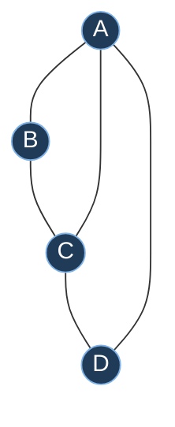
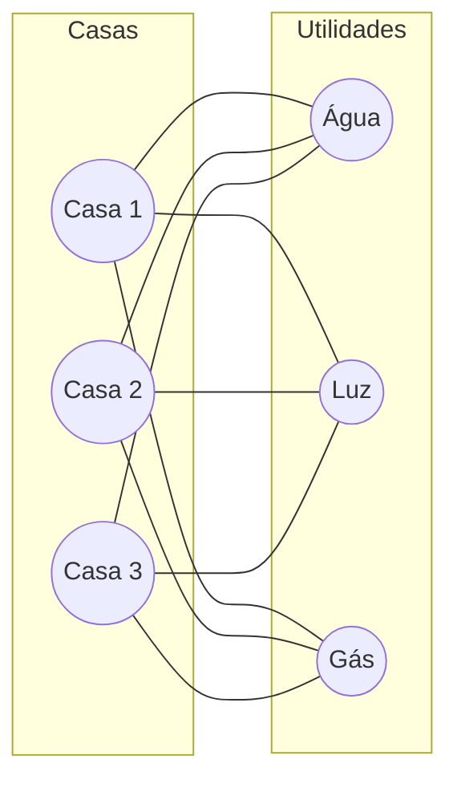
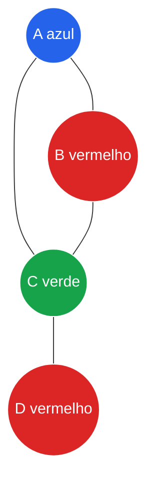
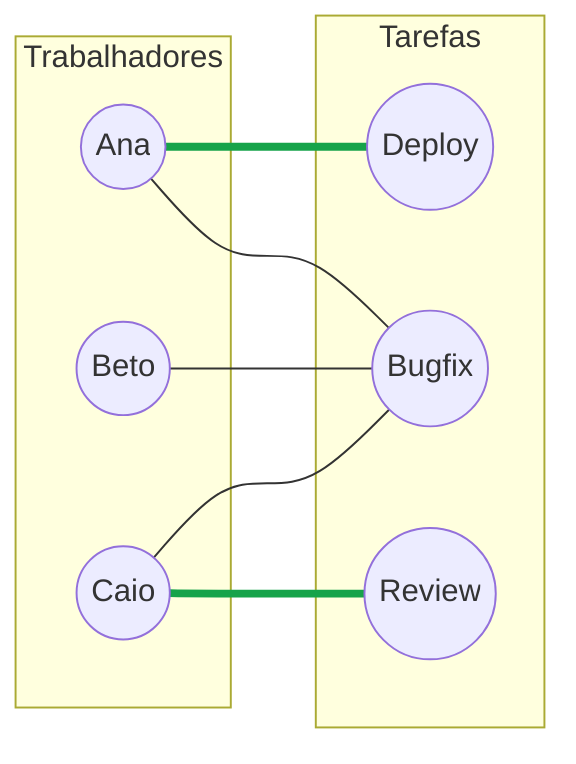
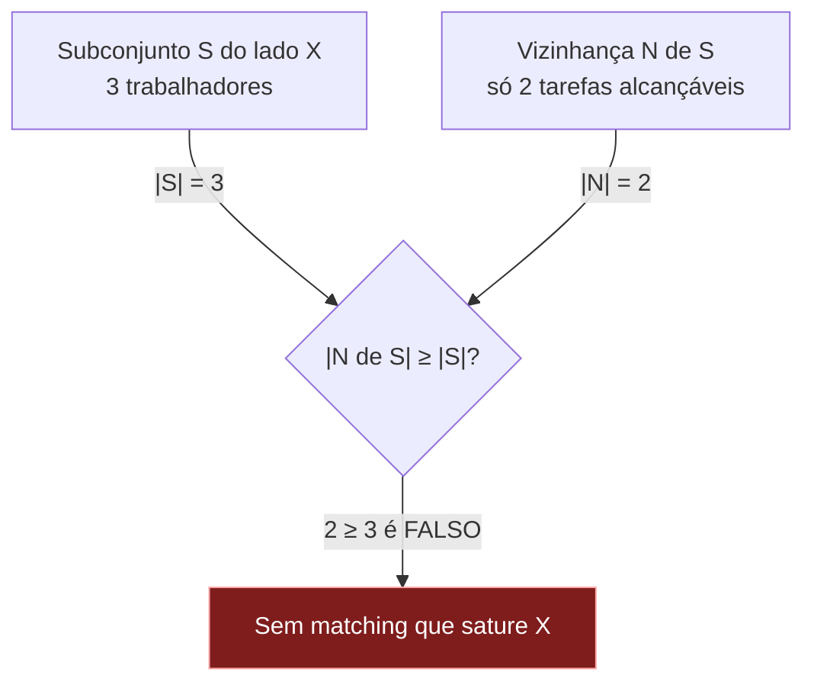
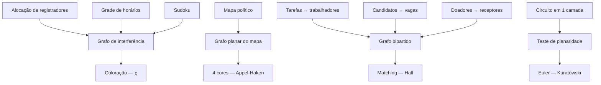

# Grafos avançados: planaridade, coloração e matching

> [!abstract] TL;DR
> Três famílias de problemas que aparecem disfarçadas no seu dia a dia de dev. **Planaridade**: dá pra desenhar o grafo sem cruzar arestas? A fórmula de Euler V − E + F = 2 governa isso, e dois grafos — K₅ e K₃,₃ — são os "pecados originais" que tornam qualquer grafo não-planar (Kuratowski). **Coloração**: pintar vértices vizinhos com cores diferentes usando o mínimo de cores (o número cromático χ). É alocação de registrador, é Sudoku, é grade de horário. Todo grafo planar precisa de no máximo 4 cores (teorema das 4 cores, Appel-Haken 1976), mas no caso geral colorir é NP-difícil. **Matching**: parear elementos sem conflito. Trabalhadores↔tarefas, candidatos↔vagas, doadores↔receptores. O teorema de Hall te diz exatamente quando um pareamento completo é possível.
>
> Em uma frase: estes três temas são a ponte entre [[16 - Teoria dos grafos - o lado matemático]] e os problemas de otimização que você resolve (ou aproxima) na prática.

Antes de começar, fixe a notação de [[16 - Teoria dos grafos - o lado matemático]]: um grafo G tem um conjunto de **vértices** V (os pontos) e um conjunto de **arestas** E (as conexões). Aqui vamos usar |V| e |E| para os tamanhos desses conjuntos.

Pronto. Agora vamos atravessar os três rios.

---

## Parte 1 — Planaridade: desenhar sem cruzar fios

Imagine que você precisa desenhar um circuito numa placa de uma camada só. Cada fio que cruza outro é um curto-circuito. Pergunta: dá pra dispor tudo de modo que nenhum fio cruze nenhum outro?

Esse é o problema da **planaridade**.

> [!info] Definição
> Um grafo é **planar** se existe alguma forma de desenhá-lo no plano de modo que as arestas só se encontrem nos vértices — nunca se cruzando no meio do caminho.

A palavra-chave é *alguma forma*. Um grafo pode parecer cheio de cruzamentos do jeito que você desenhou, e ainda assim ser planar — basta que **exista** um desenho limpo.

Pense no grafo K₄ (quatro vértices, todos conectados entre si). Se você desenha um quadrado com as duas diagonais, as diagonais se cruzam. Parece não-planar. Mas é só puxar uma diagonal "por fora": K₄ é planar. O cruzamento era preguiça do desenho, não propriedade do grafo.

### Faces: as regiões que o desenho cria

Quando você desenha um grafo planar, as arestas cortam o plano em **regiões**. Cada região fechada é uma **face**. E não esqueça da região infinita lá fora — a **face externa** também conta.

Esse desenho é um quadrado A-B-C-D com a diagonal A-C.

**Leitura do diagrama.** Conte: |V| = 4 vértices (A, B, C, D). |E| = 5 arestas (os 4 lados mais a diagonal A-C). Quantas faces? O triângulo A-B-C, o triângulo A-C-D, e a face externa que envolve tudo. Logo F = 3. Guarde esses números — vamos somá-los já já.

### A fórmula de Euler: o coração da planaridade

Aqui entra um dos resultados mais bonitos da matemática discreta. Para **todo grafo planar conexo**:

> [!tip] Fórmula de Euler
> **V − E + F = 2**
>
> onde V é o número de vértices, E o de arestas, F o de faces (contando a externa).

Vamos testar com o desenho de cima: V − E + F = 4 − 5 + 3 = 2. Bate.

Por que isso é mágico? Porque o número de **faces não depende de como você desenha** o grafo planar — só de quantos vértices e arestas ele tem. Você pode esticar, torcer, mover vértices: o saldo V − E + F é sempre 2. É um invariante topológico.

A intuição da prova é construtiva. Comece com um único vértice: V = 1, E = 0, F = 1 (só a face externa). Saldo = 1 − 0 + 1 = 2. Agora adicione o grafo aresta por aresta:

- Adicionar uma aresta que **cria um vértice novo**: +1 em V, +1 em E. O saldo não muda.
- Adicionar uma aresta entre dois vértices **já existentes**: +1 em E, e ela **fecha uma região nova** → +1 em F. O saldo não muda.

Como o saldo começa em 2 e nunca muda, ele termina em 2. Elegante, né?

### O corolário que mata grafos

Da fórmula de Euler sai um limite poderoso. Para um grafo planar simples conexo com V ≥ 3:

> [!important] Corolário de densidade
> **E ≤ 3V − 6**

De onde vem? Cada face é cercada por **pelo menos 3 arestas** (num grafo simples, não há laços nem arestas duplas, então a menor face é um triângulo). E cada aresta faz fronteira com **no máximo 2 faces**. Conte os pares (face, aresta-de-fronteira) por dois lados:

$$2E \geq 3F$$

Substitua F = 2 − V + E (da fórmula de Euler) e resolva: você chega em E ≤ 3V − 6.

Esse corolário é uma **arma de rejeição rápida**. Se um grafo tem arestas demais para seus vértices, ele *não pode* ser planar — sem precisar nem tentar desenhar.

> [!example] Aplicando a K₅
> K₅ é o grafo completo com 5 vértices: todos ligados a todos. Então V = 5 e E = 10 (são C(5,2) = 10 pares). O limite diz: E ≤ 3·5 − 6 = 9. Mas E = 10 > 9. **Contradição.** Logo K₅ **não é planar.** Provado em duas linhas.

### K₅ e K₃,₃: os dois vilões

Há dois grafos pequenos que são os arquétipos da não-planaridade:

- **K₅** — cinco vértices, todos conectados. O exemplo acima já o condenou.
- **K₃,₃** — o grafo bipartido completo entre dois grupos de 3 (cada vértice de um lado ligado aos 3 do outro). É o clássico "três casas, três utilidades": ligue cada casa à água, luz e gás sem cruzar tubos. **Impossível.**

**Leitura do diagrama.** Este é K₃,₃: V = 6, E = 9. Note que o corolário E ≤ 3V − 6 daria E ≤ 12 — não pega K₃,₃! Por quê? Porque K₃,₃ é **bipartido**, e grafos bipartidos não têm triângulos. Suas faces têm pelo menos 4 arestas, então o limite mais apertado é E ≤ 2V − 4 = 8. E 9 > 8 → não-planar. (Moral: o corolário tem uma versão mais forte para grafos sem triângulos.)

### Kuratowski/Wagner: o teorema da impureza

E se um grafo não for K₅ nem K₃,₃, mas for grandão? Como saber se é planar? O teorema de **Kuratowski** dá a resposta definitiva, e é de uma simplicidade chocante:

> [!quote] Teorema de Kuratowski (versão em prosa)
> Um grafo é planar **se e somente se** não contém uma **subdivisão** de K₅ ou de K₃,₃ como subgrafo.

"Subdivisão" significa: pegar K₅ ou K₃,₃ e colocar vértices extras no meio de suas arestas (como esticar um elástico e marcar pontos nele). Isso não muda a essência topológica.

Traduzindo: **todo** grafo não-planar esconde, em algum lugar, uma cópia esticada de K₅ ou de K₃,₃. Esses dois são os únicos "pecados originais". Não existe um terceiro vilão.

A variante de **Wagner** diz o mesmo com "menor" (minor) no lugar de "subdivisão" — uma formulação ligeiramente diferente, mas equivalente em espírito.

### Grafo dual (de leve)

Para um grafo planar desenhado, você pode construir seu **grafo dual**: coloque um vértice dentro de cada face, e ligue dois desses vértices-de-face sempre que as faces correspondentes compartilham uma aresta.

Por que isso importa? Porque colorir um **mapa** (regiões) é o mesmo que colorir os **vértices do dual**. O mapa político vira um grafo, e o teorema das 4 cores (a seguir) fala justamente sobre ele. Segura essa ponte — ela conecta a Parte 1 com a Parte 2.

---

## Parte 2 — Coloração: pintar sem brigas

Mude de problema. Agora você tem vértices que **não podem ter a mesma cor que seus vizinhos**. Quantas cores você precisa, no mínimo?

> [!info] Coloração própria e número cromático
> Uma **coloração própria** atribui uma cor a cada vértice de modo que vértices adjacentes (ligados por aresta) tenham cores **diferentes**. O **número cromático** χ(G) (lê-se "chi de G") é o menor número de cores que torna isso possível.

A palavra "vizinho" aqui é a fonte de todo o poder prático. Vizinhos = coisas em conflito. Cores = recursos ou slots. Vamos ver isso explodir em aplicações na Parte 4.

**Leitura do diagrama.** Veja o triângulo A-B-C: três vértices, todos vizinhos entre si. Eles **exigem** três cores diferentes (azul, vermelho, verde) — não dá pra fazer com menos. O vértice D só toca C (verde), então pode reaproveitar vermelho. Resultado: χ = 3. Regra de bolso: um triângulo já força χ ≥ 3, e qualquer **clique** de tamanho k força χ ≥ k.

### Bipartido = 2-colorível = sem ciclo ímpar

Há um caso lindo e totalmente caracterizado: quando bastam **2 cores**.

> [!tip] Tríplice equivalência
> Para qualquer grafo, estas três afirmações são a mesma coisa:
> 1. O grafo é **bipartido** (os vértices se dividem em dois grupos, e arestas só vão de um grupo ao outro).
> 2. O grafo é **2-colorível** (χ ≤ 2).
> 3. O grafo **não tem ciclo de comprimento ímpar**.

A intuição do "sem ciclo ímpar": pinte um vértice de azul, os vizinhos de vermelho, os vizinhos deles de azul de novo, alternando. Se você nunca der de cara com um conflito, é bipartido. Você só dá de cara com conflito se houver um ciclo de tamanho ímpar — aí a alternância "fecha errado" (azul encosta em azul).

Isso é **detectável em tempo linear** com um BFS/DFS. Decidir 2-coloração é *fácil*. Guarde esse contraste.

### O teorema das 4 cores

Agora o astro. Pegue qualquer mapa político — países, estados, províncias. Quantas cores você precisa para que países vizinhos nunca tenham a mesma cor?

> [!important] Teorema das 4 cores
> **Todo grafo planar é 4-colorível** (χ ≤ 4).
>
> Equivalente: todo mapa no plano pode ser colorido com no máximo 4 cores sem que regiões vizinhas compartilhem cor.

Conjecturado em 1852, ficou aberto por mais de um século. Em **1976**, Kenneth **Appel** e Wolfgang **Haken** finalmente provaram. E a prova entrou para a história por um motivo polêmico:

> [!quote] A primeira prova assistida por computador
> Appel e Haken reduziram a infinitude de mapas possíveis a um conjunto **finito** de configurações inevitáveis (1.936 casos, depois reduzidos a 1.476). Cada caso foi verificado **por computador** — mais de mil horas de processamento. Foi a **primeira vez** que um grande teorema matemático foi provado com auxílio computacional.

Isso gerou um debate filosófico que reverbera até hoje: uma prova que **nenhum humano consegue verificar à mão** ainda é uma prova? A comunidade aceitou, mas o desconforto ajudou a impulsionar os **provadores de teoremas formais** (uma verificação em Coq veio em 2005). Para você, dev, há um eco familiar: confiamos em código que verifica código.

> [!warning] Cuidado com a confusão
> "4 cores" vale só para grafos **planares**. Um grafo qualquer (não-planar) pode precisar de muito mais. K₅, por exemplo, precisa de 5 cores. As 4 cores não são um limite universal — são um presente da planaridade.

### Coloração de arestas (de leve)

Há uma variante: colorir **arestas** de modo que arestas que compartilham um vértice tenham cores diferentes. O mínimo de cores é o **índice cromático** χ'(G).

Onde isso aparece? Em **escalonamento de torneios** (cada rodada = uma cor; jogos do mesmo time não podem estar na mesma rodada) e em **alocação de slots de tempo**. O teorema de Vizing garante que χ' é sempre o grau máximo Δ ou Δ+1 — surpreendentemente apertado.

### O muro: coloração geral é NP-difícil

Aqui está o cerne pragmático desta nota.

> [!danger] A fronteira da dificuldade
> - Decidir se um grafo é **2-colorível**: **fácil** (tempo linear).
> - Decidir se um grafo é **3-colorível**: **NP-completo**. Difícil.
> - Encontrar o **número cromático** χ(G) exato: **NP-difícil** no caso geral.

Esse salto de 2 para 3 é dramático e profundo (conecta com [[11 - Combinatória - a arte de contar]] e com a teoria de NP-completude). Na prática significa: **não existe** (até onde sabemos) algoritmo eficiente que colore qualquer grafo com o mínimo de cores.

E daí? Daí que compiladores, escalonadores e otimizadores usam **heurísticas** — colorir por ordem de grau (greedy), reduções, backtracking podado. Boa o bastante, rápido o bastante, raramente ótima.

---

## Parte 3 — Matching: parear sem conflito

Terceiro rio. Agora você quer **emparelhar** elementos: cada um casa com no máximo um parceiro, e os pares não compartilham elementos.

> [!info] Matching (emparelhamento)
> Um **matching** M é um conjunto de arestas sem vértices em comum — cada vértice é tocado por **no máximo uma** aresta de M.

Três adjetivos que confundem todo mundo (e caem em entrevista):

| Termo | O que é | Cuidado |
| --- | --- | --- |
| **Maximal** | Não dá pra adicionar mais nenhuma aresta sem quebrar a regra | Pode estar **longe** do maior possível |
| **Máximo** | O matching com o **maior número** de arestas possível | É o ótimo global |
| **Perfeito** | Cobre (satura) **todos** os vértices | Só existe se |V| for par e tudo der certo |

> [!warning] Maximal ≠ Máximo
> Um matching **maximal** é só um beco sem saída local: você não consegue mais adicionar arestas, mas talvez existisse um arranjo totalmente diferente com mais pares. Um matching **máximo** é o campeão global. Confundir os dois é o erro clássico.

### Matching em grafos bipartidos

O caso mais útil na prática é o **bipartido**: dois grupos, e pares só cruzam de um lado ao outro. Trabalhadores de um lado, tarefas do outro. Candidatos de um lado, vagas do outro.

**Leitura do diagrama.** As arestas finas são as compatibilidades possíveis (quem **pode** fazer o quê). As arestas grossas verdes são um matching escolhido: Ana→Deploy, Caio→Review. Sobrou Beto, que só sabe Bugfix — mas alguém poderia ter pegado Bugfix antes. Achar o matching **máximo** (atender o máximo de gente) é um problema clássico, resolvido em tempo polinomial por algoritmos de **caminho aumentante** (Hopcroft-Karp).

### O teorema de Hall: quando o casamento é possível

A pergunta de ouro: existe um matching que **satura todo um lado** (todo trabalhador recebe uma tarefa)? O teorema de **Hall** — também chamado **teorema do casamento** — dá a condição exata.

> [!important] Teorema de Hall (condição do casamento)
> Num grafo bipartido com lados X e Y, existe um matching que **satura X** se e somente se, para **todo** subconjunto S ⊆ X, a vizinhança de S satisfaz:
>
> **|N(S)| ≥ |S|**
>
> onde N(S) é o conjunto de todos os vértices de Y adjacentes a algum vértice de S.

Em português: **nenhum grupo de pessoas pode estar disputando menos opções do que o tamanho do grupo.** Se 3 trabalhadores juntos só sabem fazer 2 tarefas, alguém vai ficar de fora — não tem jeito. Hall diz que esse é o **único** tipo de obstáculo. Se essa condição vale para todo subconjunto, o pareamento completo existe, garantido.

**Leitura do diagrama.** A condição de Hall é um teste sobre **todos** os subconjuntos. Basta **um** subconjunto S violar |N(S)| ≥ |S| para o casamento completo ser impossível — esse S é chamado de "conjunto gargalo". Aqui 3 trabalhadores alcançam só 2 tarefas: 2 ≥ 3 é falso, então não há como saturar X. Achar esse gargalo é o que algoritmos de matching fazem de fato.

### König (de leve)

Para grafos bipartidos, o teorema de **König** fecha o ciclo com uma dualidade linda:

> [!tip] Teorema de König
> Num grafo bipartido, o tamanho do **matching máximo** = tamanho da **cobertura mínima por vértices** (o menor conjunto de vértices que toca todas as arestas).

Isso conecta matching (achar pares) com cobertura (achar "vigias"), e é um caso particular do teorema **max-flow min-cut**. Hall, König e fluxo máximo são, no fundo, a mesma verdade vista de ângulos diferentes — uma das conexões mais bonitas da teoria dos grafos.

---

## Parte 4 — O ângulo dev: onde isso vive no seu código

Tudo bonito, mas cadê o `git push`? Aqui. Estes três temas são **máquinas de modelagem**: você traduz um problema sujo do mundo real para grafo, e a teoria te dá vocabulário e algoritmos.

### Coloração no mundo real

> [!example] Alocação de registradores (o exemplo rei)
> Num compilador, cada variável "viva" num trecho de código é um **vértice**. Duas variáveis vivas **ao mesmo tempo** não podem ocupar o mesmo registrador físico — então traçamos uma **aresta** entre elas. Esse é o **grafo de interferência**. Colorir esse grafo = atribuir registradores. As **cores** são os registradores da CPU. χ = número de registradores necessários. Se χ > registradores disponíveis, falta cor → o compilador faz **spill**: joga a variável pra memória (lento, mas necessário). Como colorir é NP-difícil, compiladores usam **heurísticas** (o clássico Chaitin-Briggs).

Outros mapeamentos diretos:

- **Grade de horários / escalonamento**: aulas que compartilham professor ou sala são vizinhas; cores = faixas de horário. Coloração mínima = menos slots.
- **Atribuição de frequências de rádio**: torres próximas interferem → vizinhas no grafo; cores = frequências. Evita conflito de espectro.
- **Sudoku**: cada célula é um vértice; células na mesma linha, coluna ou bloco são vizinhas; as 9 cores são os dígitos 1–9. Resolver Sudoku **é** colorir um grafo. (E por isso Sudoku é genuinamente difícil no caso geral.)
- **Detecção de conflito de recursos**: qualquer "estes dois não podem coexistir no mesmo slot" vira coloração.
- **O mapa político**: o caso histórico — 4 cores bastam, porque mapas são planares.

### Matching no mundo real

> [!example] Pareamento bipartido por toda parte
> - **Atribuição de tarefas**: trabalhadores ↔ jobs. Quem faz o quê, sem sobrecarga.
> - **Admissões / vagas**: candidatos ↔ posições (o famoso "matching" de residência médica é uma variante estável disso).
> - **Transplantes**: doadores ↔ receptores compatíveis — literalmente vidas dependendo de um matching.
> - **Anúncios ↔ slots**, **motoristas ↔ corridas**, **pedidos ↔ entregadores**. Toda economia de plataforma roda em matching.

A boa notícia: matching bipartido **máximo** é **polinomial** (Hopcroft-Karp, fluxo). Diferente de coloração, aqui a teoria te dá um algoritmo eficiente de bandeja.

### O mapa-mestre: problema → grafo → matemática

**Leitura do diagrama.** Esta é a tese da nota inteira em uma figura. Problemas de CS distintos (coluna esquerda) colapsam em poucos **modelos de grafo** (meio), cada um resolvido por um **conceito matemático** (direita). Aprender os três conceitos te dá um canivete que abre dezenas de problemas. E note o tema recorrente: coloração geral é NP-difícil → heurísticas; matching bipartido é polinomial → algoritmo exato. Saber **de que lado** seu problema cai vale mais que qualquer otimização prematura.

### A tabela de tradução

| Problema de CS | Conceito de grafo | Conceito matemático | Tratável? |
| --- | --- | --- | --- |
| Alocação de registradores | Grafo de interferência | Número cromático χ | NP-difícil → heurística (spill) |
| Grade de horários / salas | Grafo de conflitos | Coloração de vértices | NP-difícil → heurística |
| Frequências de rádio | Grafo de interferência | Coloração de vértices | NP-difícil → heurística |
| Sudoku | Grafo de restrições | Coloração com 9 cores | NP-difícil → backtracking |
| Coloração de mapa | Grafo planar (dual) | 4 cores (Appel-Haken) | Garantido ≤ 4 |
| Tarefas ↔ trabalhadores | Grafo bipartido | Matching máximo / Hall | Polinomial (Hopcroft-Karp) |
| Candidatos ↔ vagas | Grafo bipartido | Matching / König | Polinomial |
| Circuito em camada única | Grafo planar | Euler / Kuratowski | Polinomial (teste de planaridade) |

**Leitura da tabela.** A coluna "tratável?" é a que mais importa numa entrevista de sistemas. Reconhecer um problema como coloração geral é admitir que você precisará aproximar; reconhecê-lo como matching bipartido ou teste de planaridade é saber que há solução exata e rápida. A modelagem **revela** a dificuldade antes de você escrever uma linha de código.

---

> [!summary] Resumo em uma linha
> Planaridade (Euler V − E + F = 2, Kuratowski via K₅/K₃,₃), coloração (número cromático χ, 4 cores para planares, NP-difícil em geral) e matching (máximo vs. maximal vs. perfeito, condição de Hall no bipartido) são três lentes que transformam problemas reais — alocação de registradores, escalonamento, Sudoku, atribuição de tarefas — em grafos resolúveis ou aproximáveis.

## Em entrevista

Em entrevistas de design e de algoritmos, o valor não está em recitar teoremas, e sim em **reconhecer o padrão**: "isto é coloração de grafo, e coloração geral é NP-difícil, então vou usar uma heurística greedy" ou "isto é matching bipartido, que é polinomial — uso fluxo máximo". Quando a conversa virar para compiladores, mencione alocação de registradores como coloração do grafo de interferência: é um dos exemplos mais elegantes de teoria virando prática. Se perguntarem sobre o teorema das 4 cores, lembre que ele só vale para grafos planares e que foi a primeira prova assistida por computador — um gancho rico sobre confiança em verificação automatizada.

*"A planar graph can always be drawn without crossing edges, and Euler's formula V minus E plus F equals 2 governs its structure."* *"By Kuratowski's theorem, a graph is planar exactly when it has no subdivision of K-five or K-three-three."* *"The chromatic number is the minimum colors for a proper coloring where no two adjacent vertices share a color."* *"Deciding two-colorability is easy and linear, but three-colorability is NP-complete — that jump is the heart of the difficulty."* *"The four color theorem says every planar graph is four-colorable; it was the first major result proved with computer assistance, by Appel and Haken in 1976."* *"Register allocation maps directly to graph coloring: variables are vertices, interferences are edges, registers are colors, and a spill happens when we run out of colors."* *"A maximum matching is the globally largest one, while a maximal matching just can't be extended — they're often confused."* *"Hall's theorem tells us a bipartite graph has a matching saturating one side if and only if every subset S satisfies neighbor-of-S at least the size of S."* *"Bipartite maximum matching is solvable in polynomial time via augmenting paths, unlike general graph coloring."*

| Português | English |
| --- | --- |
| Grafo planar | Planar graph |
| Fórmula de Euler | Euler's formula |
| Face | Face |
| Grafo dual | Dual graph |
| Subdivisão | Subdivision |
| Teorema de Kuratowski | Kuratowski's theorem |
| Coloração própria | Proper coloring |
| Número cromático | Chromatic number |
| Grafo bipartido | Bipartite graph |
| Ciclo ímpar | Odd cycle |
| Teorema das 4 cores | Four color theorem |
| Coloração de arestas | Edge coloring |
| NP-difícil | NP-hard |
| Emparelhamento / matching | Matching |
| Matching máximo | Maximum matching |
| Matching maximal | Maximal matching |
| Matching perfeito | Perfect matching |
| Saturar (um lado) | Saturate (a side) |
| Vizinhança | Neighborhood |
| Teorema de Hall | Hall's theorem |
| Cobertura por vértices | Vertex cover |
| Alocação de registradores | Register allocation |
| Grafo de interferência | Interference graph |
| Spill (de registrador) | Register spill |

> [!info] Lastro
> - **Rosen, K.** *Discrete Mathematics and Its Applications* — capítulos "Graph Coloring" e "Planar Graphs" (fórmula de Euler, corolário E ≤ 3V − 6, número cromático, teorema das 4 cores).
> - **West, D.** *Introduction to Graph Theory* — tratamento canônico de planaridade (Kuratowski/Wagner), coloração e matching (Hall, König).
> - **Teorema das 4 cores** — Appel, K. & Haken, W. (1976), *Every Planar Map is Four Colorable*; ver [Quanta Magazine](https://www.quantamagazine.org/only-computers-can-solve-this-map-coloring-problem-from-the-1800s-20230329/) e [Illinois Distributed Museum](https://distributedmuseum.illinois.edu/exhibit/four-color-theorem/) sobre a primeira prova assistida por computador.
> - **Teorema de Hall (casamento)** — [Hall's marriage theorem (Wikipedia)](https://en.wikipedia.org/wiki/Hall%27s_marriage_theorem); condição |N(S)| ≥ |S| e conexão com König.
> - **Alocação de registradores como coloração** — [Register Allocation by Graph Coloring (Lighterra)](https://www.lighterra.com/papers/graphcoloring/); k-coloração para k > 2 é NP-completo, daí as heurísticas.

## Notas relacionadas

- [[16 - Teoria dos grafos - o lado matemático]] — os fundamentos (vértices, arestas, bipartido) que esta nota assume.
- [[18 - Árvores como objeto matemático]] — árvores são grafos planares acíclicos e sempre 2-coloríveis; o caso mais dócil de tudo aqui.
- [[11 - Combinatória - a arte de contar]] — contar colorações e pareamentos, e a fronteira de NP que coloração toca.
