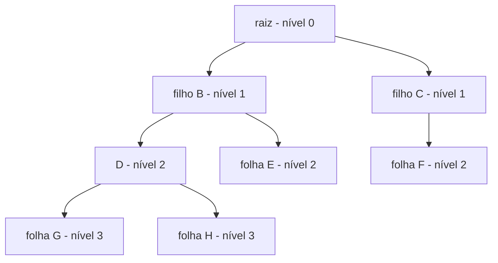
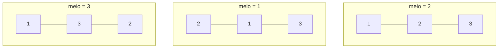
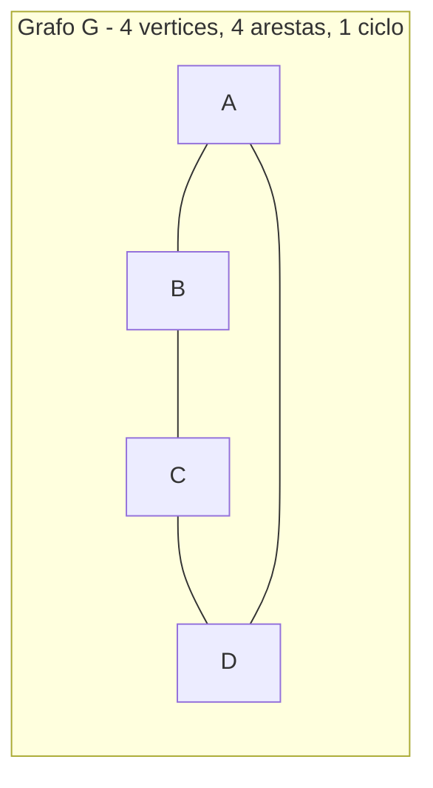
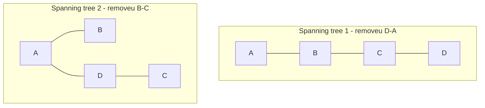
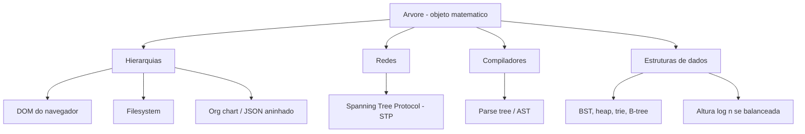

# Árvores como objeto matemático

> [!abstract] TL;DR
> Uma árvore é um grafo **conexo e acíclico**. Só isso. Dessa frase de quatro palavras caem, como dominós, seis caracterizações equivalentes — caminho único entre pares, exatamente n−1 arestas, acíclico maximal, conexo minimal. A mais útil para o dev é a contagem de arestas: **toda árvore com n nós tem exatamente n−1 arestas**, e isso vira a base de incontáveis provas por indução sobre estruturas. Aqui falamos do **objeto matemático**: definição, caracterizações, contagem (Cayley nⁿ⁻², Catalan Cₙ), e spanning trees. A árvore como **estrutura de dados** (BST, heap, trie, B-tree) e seus algoritmos moram em Estruturas de Dados — vamos linkar, não reimplementar.

Você usa árvores todo dia: o DOM, a árvore de diretórios, o JSON aninhado, a AST que o compilador cospe. Mas todas essas são *instâncias* de um objeto que a matemática define com precisão cirúrgica.

E a definição é desarmante de simples.

Esta nota mora no mesmo bairro de [[16 - Teoria dos grafos - o lado matemático]] e [[17 - Grafos avançados - planaridade, coloração e matching]]: a árvore é só um **tipo especial de grafo**. Tão especial que merece capítulo próprio.

## A definição: conexo e acíclico

Pegue um grafo. Ele é uma **árvore** se, e somente se, satisfaz duas condições:

1. É **conexo** — existe caminho entre quaisquer dois vértices.
2. É **acíclico** — não tem ciclos.

Pronto. Não tem letra miúda.

Por que essas duas condições, juntas, são tão mágicas? Pense no que cada uma faz sozinha.

**Conexo sozinho** permite ciclos — você pode ter um grafo onde todo mundo se alcança, mas com caminhos redundantes (vários jeitos de ir de A a B).

**Acíclico sozinho** permite desconexão — você pode ter pedaços soltos, cada um sem ciclos, mas sem ponte entre eles (isso é uma **floresta**, já chegamos lá).

A interseção das duas é o ponto de equilíbrio perfeito: conectividade **mínima** sem nenhum desperdício. Tire uma aresta e desconecta. Adicione uma e cria ciclo. A árvore vive no fio da navalha.

> [!note] Por que "acíclico" e não "sem ciclos simples"?
> Em grafo não-direcionado, ciclo já significa ciclo simples de comprimento ≥ 3 (uma aresta de ida e volta não conta como ciclo, nem laço se proibirmos multigrafos). A definição clássica de Rosen assume grafo simples não-direcionado. Cuidado: se o grafo for **direcionado**, "acíclico" vira DAG — e DAG não é árvore. Voltamos a isso quando falarmos do git.

## As seis caracterizações equivalentes

Aqui está a beleza estrutural. A definição "conexo e acíclico" não é a única. Há **seis afirmações** que são todas equivalentes — qualquer uma delas, sozinha, define uma árvore. Se uma é verdadeira, todas são.

Seja G um grafo com n vértices. As seguintes são equivalentes:

| # | Caracterização | Em palavras |
|---|----------------|-------------|
| (a) | Conexo **e** acíclico | A definição clássica |
| (b) | Caminho **único** entre todo par de vértices | Sem ambiguidade de rota |
| (c) | Conexo **e** tem exatamente n−1 arestas | Conectividade no orçamento mínimo |
| (d) | Acíclico **e** tem exatamente n−1 arestas | Floresta que por acaso é conexa |
| (e) | Acíclico **maximal** | Adicionar qualquer aresta cria um ciclo |
| (f) | Conexo **minimal** | Remover qualquer aresta desconecta |

**Lead-in para a tabela:** as seis linhas são lentes diferentes para o mesmo objeto. Você escolhe a lente conforme a prova que precisa fazer.

**Leitura do diagrama:** repare no padrão. As linhas (c) e (d) mostram que, fixando "n−1 arestas", basta *uma* das propriedades (conexo OU acíclico) que a outra vem de graça. Esse é o truque mais explorado em entrevistas: dado n−1 arestas, conexo ⟹ acíclico e vice-versa. As linhas (e) e (f) são duais — "maximal sem ciclo" e "minimal conexo" descrevem o mesmo equilíbrio por lados opostos.

### Provando duas equivalências (porque "equivalente" não é fé)

Vamos provar **(a) ⟹ (b)** e **(b) ⟹ (a)**, e depois **(a) ⟹ (c)**. Em entrevista, saber *uma* prova vale mais que recitar as seis linhas.

**(a) ⟹ (b): conexo e acíclico ⟹ caminho único.**

Suponha que entre dois vértices u e v existam **dois** caminhos distintos, P₁ e P₂. Como são distintos, eles divergem em algum ponto e voltam a se encontrar. Junte o trecho de P₁ onde diferem com o trecho de P₂: você fechou um **ciclo**. Mas G é acíclico — contradição. Logo o caminho é único. (Que exista *pelo menos* um caminho vem da conexidade.)

**(b) ⟹ (a): caminho único ⟹ conexo e acíclico.**

Caminho único entre todo par já implica que existe caminho — logo G é conexo. E se houvesse um ciclo, dois vértices do ciclo teriam **dois** caminhos (os dois arcos do ciclo) — contradizendo a unicidade. Logo acíclico.

> [!tip] A equivalência (a) ⇔ (b) é a "alma" da árvore
> "Existe exatamente uma rota" é o que você sente quando navega num filesystem: do `/` até `/home/user/foo.txt` há **um** caminho de pastas, nunca dois. Essa unicidade é o que faz a hierarquia ser navegável sem ambiguidade.

**(a) ⟹ (c): conexo e acíclico ⟹ exatamente n−1 arestas.**

Indução sobre n. Base: n = 1, zero arestas, e n−1 = 0. ✓

Passo: suponha verdadeiro para árvores com menos de n vértices. Toda árvore com n ≥ 2 vértices tem **pelo menos uma folha** (um vértice de grau 1 — prove pensando no caminho mais longo: suas pontas têm de ter grau 1). Remova essa folha e sua única aresta. Sobra uma árvore com n−1 vértices, que por hipótese tem (n−1)−1 = n−2 arestas. Devolva a folha: +1 aresta. Total: n−2 + 1 = **n−1**. ∎

Essa prova é o protótipo de **dezenas** de provas por indução sobre estruturas em árvore. Decore o esqueleto: "remova uma folha, aplique a hipótese, devolva".

**(e) e (f): os duais.** Vale provar a intuição das duas últimas linhas, que confundem todo mundo na primeira leitura.

*Acíclico maximal* (e): a árvore é acíclica, mas no **limite** — ela tem o máximo de arestas possível sem fechar ciclo. Adicione qualquer aresta nova entre dois vértices u e v: como já existia um caminho único entre eles (caracterização (b)), a nova aresta fecha exatamente **um** ciclo. Nem um ciclo a mais, nem a menos. Por isso "maximal".

*Conexo minimal* (f): a árvore é conexa, mas no **mínimo** — ela tem o mínimo de arestas possível para manter tudo conectado. Remova qualquer aresta: como aquela aresta era o único caminho entre os dois lados (de novo (b)), removê-la **desconecta** o grafo em duas componentes. Toda aresta de uma árvore é uma **ponte** (cut-edge). Por isso "minimal".

> [!note] (e) e (f) são a mesma moeda, lados opostos
> "Não posso adicionar sem criar ciclo" e "não posso remover sem desconectar" descrevem o mesmo equilíbrio perfeito. Por isso a árvore é o ponto onde conectividade e aciclicidade se tocam: o **máximo** de aciclicidade encontra o **mínimo** de conectividade. Qualquer movimento para qualquer lado quebra uma das duas propriedades.

## Árvore enraizada × árvore livre

A definição acima dá uma **árvore livre** (free tree): vértices e arestas, sem ninguém no comando. Não há "topo".

Eleja um vértice como **raiz** e tudo muda. Agora há direção: a raiz no topo, e a partir dela um vocabulário inteiro de parentesco.

**Lead-in:** a mesma árvore livre vira esta árvore enraizada ao pendurarmos tudo a partir de A.

**Leitura do diagrama:** A é a **raiz** (profundidade 0). B e C são **filhos** de A; A é **pai** deles. E, F, G, H são **folhas** (grau de saída zero). B, C, D são **nós internos**. A **profundidade** de um nó é a distância até a raiz (G está na profundidade 3). A **altura** da árvore é a maior profundidade — aqui, **3** (caminho A→B→D→G). **Nível** k é o conjunto de nós na profundidade k.

O vocabulário, destilado:

| Termo | Definição |
|-------|-----------|
| Raiz | O vértice eleito como topo |
| Pai | O vizinho de um nó na direção da raiz (único!) |
| Filho | Vizinho na direção oposta à raiz |
| Ancestral | Qualquer nó no caminho até a raiz |
| Descendente | Qualquer nó "abaixo" na hierarquia |
| Folha | Nó sem filhos (grau 1 na árvore livre, se não for a raiz) |
| Nó interno | Nó com pelo menos um filho |
| Profundidade | Distância da raiz até o nó |
| Altura | Maior profundidade na árvore |
| Nível | Conjunto de nós a uma mesma profundidade |
| Grau | Número de filhos de um nó (na versão enraizada) |

**Leitura da tabela:** repare que "pai é único" é consequência direta da caracterização (b) — caminho único garante que só há um vizinho rumo à raiz. A estrutura matemática paga o vocabulário.

**Árvore ordenada:** se a ordem dos filhos importa (o "filho da esquerda" é diferente do "filho da direita"), a árvore é **ordenada**. Toda árvore binária em código é ordenada — `left` e `right` não são intercambiáveis. Matematicamente, isso muda a *contagem* (vamos ver em Catalan).

**Floresta:** uma **união disjunta de árvores**. Remova a raiz de uma árvore com k filhos e você obtém uma floresta de k árvores (cada subárvore vira independente). Um grafo acíclico qualquer é, por definição, uma floresta — uma árvore é o caso conexo de uma floresta.

E há uma versão da contagem de arestas para florestas: uma floresta com n vértices e c componentes (c árvores) tem exatamente **n − c** arestas. Faz sentido — cada árvore individual tem (seus nós) − 1 arestas, e somando sobre as c árvores some-se −1 c vezes. Quando c = 1, recaímos em n − 1. Essa generalização é útil quando você processa um grafo desconexo e quer saber quantas pontes faltam para conectá-lo: precisa de **c − 1** novas arestas.

> [!tip] Livre × enraizada não muda a matemática de contagem de arestas
> Enraizar uma árvore é só uma *decoração* — você escolheu um topo, mas o conjunto de vértices e arestas é o mesmo. Por isso n − 1 arestas vale igual para árvore livre e enraizada. O que a raiz adiciona é **direção e parentesco**, conceitos de navegação, não de estrutura. Estruturas de dados sempre trabalham com a versão enraizada (precisam de um ponto de entrada); a matemática de grafos prefere a livre (mais simétrica).

## Contagem: quantas árvores existem?

Agora a parte que conecta tudo a [[11 - Combinatória - a arte de contar]]. Árvores não são só objetos a definir — são objetos a **contar**. E os números que saem são lindos.

### Fórmula de Cayley: nⁿ⁻² árvores rotuladas

Pergunta: dados n vértices **rotulados** (distinguíveis: vértice 1, vértice 2, …, vértice n), quantas árvores diferentes posso formar?

**Fórmula de Cayley:** existem exatamente **nⁿ⁻²** árvores rotuladas sobre n vértices.

Vamos sentir os pequenos casos:

| n | nⁿ⁻² | Quantas árvores | Sanidade |
|---|------|-----------------|----------|
| 1 | 1⁻¹ → 1 | 1 | A árvore trivial (um nó) |
| 2 | 2⁰ = 1 | 1 | Uma única aresta entre 1 e 2 |
| 3 | 3¹ = 3 | 3 | Os 3 "caminhos" 1-2-3, 1-3-2, 2-1-3 (qual fica no meio) |
| 4 | 4² = 16 | 16 | 12 caminhos + 4 estrelas |
| 5 | 5³ = 125 | 125 | Já explode |

**Leitura da tabela:** para n=3 há só 3 árvores porque uma árvore de 3 nós é sempre um caminho, e o que distingue é **quem está no meio** (3 escolhas). Para n=4, as 16 se quebram em 12 caminhos (qual ordem linear) mais 4 estrelas (qual nó é o centro). O crescimento é **super-exponencial** — nⁿ⁻² esmaga até o fatorial para n grande.

Vamos ver, com os olhos, as 3 árvores rotuladas de n=3:

**Lead-in:** as três árvores acima são *todas* as árvores possíveis sobre os vértices rotulados 1, 2, 3 — exatamente 3¹ = 3.

**Leitura do diagrama:** as três têm a mesma *forma* (um caminho de comprimento 2), mas são **distintas como árvores rotuladas** porque o rótulo do nó central muda. Cayley conta *rótulos*, não formas — por isso 3 e não 1. Se contássemos só formas, a resposta seria 1 (todo mundo é "um caminho"). A distinção rotulado × não-rotulado é a fonte número um de confusão na contagem de árvores.

> [!note] A prova clássica: códigos de Prüfer
> A demonstração mais elegante de Cayley constrói uma **bijeção** entre árvores rotuladas e sequências de n−2 rótulos (a *sequência de Prüfer*). Cada sequência é um número de 1 a n repetido n−2 vezes ⟹ nⁿ⁻² sequências ⟹ nⁿ⁻² árvores. A bijeção remove folhas pela menor etiqueta, anotando o vizinho. Bijeção é a técnica-mãe da combinatória: para contar A, ache um B fácil de contar e prove A ⇔ B.

### Números de Catalan: árvores binárias e BSTs

Mude a pergunta. Quantas **árvores binárias** distintas (ordenadas, estrutura importa) existem com n nós?

Resposta: o **n-ésimo número de Catalan**.

$$C_n = \frac{1}{n+1}\binom{2n}{n} = \frac{(2n)!}{(n+1)!\,n!}$$

| n | Cₙ | Conta |
|---|-----|-------|
| 0 | 1 | A árvore vazia |
| 1 | 1 | Um nó |
| 2 | 2 | Raiz com filho à esquerda, ou à direita |
| 3 | 5 | Cinco formas |
| 4 | 14 | Quatorze formas |
| 5 | 42 | |

**Leitura da tabela:** Cₙ conta uma quantidade absurda de coisas que parecem não ter relação. O mesmo Cₙ que conta árvores binárias com n nós também conta: o número de **BSTs** distintas com n chaves; o número de **triangulações** de um polígono de n+2 lados; o número de sequências de parênteses balanceados com n pares; o número de caminhos de Dyck. Quando estruturas diferentes geram a mesma sequência de números, há uma **bijeção escondida** entre elas — e descobrir essas bijeções é metade da diversão da combinatória.

> [!tip] Por que BSTs também dão Catalan?
> Uma BST é determinada pela **forma** da árvore (a ordem das chaves é forçada pela propriedade de busca). Logo "quantas BSTs com n chaves distintas" = "quantas formas de árvore binária com n nós" = Cₙ. É por isso que essa pergunta aparece tanto em entrevista — ela é Catalan disfarçado. A *implementação* da BST mora em [[03-Dominios/Ciência/Estruturas de Dados/11 - Grafos - travessia e algoritmos]] e nas notas de árvores de busca; aqui só contamos.

A recorrência por trás de Catalan também é instrutiva e cai em prova:

$$C_{n+1} = \sum_{i=0}^{n} C_i \, C_{n-i}$$

A leitura combinatória: para montar uma árvore binária com n+1 nós, fixe a raiz e escolha **quantos nós** vão para a subárvore esquerda (digamos i) — o resto, n−i, vai para a direita. Multiplique as contagens dos dois lados (Cᵢ × C_{n−i}) e some sobre todas as repartições. Essa decomposição "raiz + esquerda + direita" é exatamente como você implementa recursão em árvore binária — a estrutura do código **é** a estrutura da recorrência. Belo exemplo de como combinatória e algoritmo são o mesmo objeto visto de dois ângulos.

### Contando folhas e internos numa árvore binária cheia

Uma **árvore binária cheia** (full binary tree) é aquela em que todo nó tem 0 ou 2 filhos — nunca exatamente 1.

Fato: numa árvore binária cheia com **i nós internos**, há exatamente **i + 1 folhas**.

Por quê? Cada nó interno tem 2 filhos ⟹ há 2i arestas-filho ⟹ 2i nós que são filhos de alguém. O único nó que não é filho de ninguém é a raiz. Total de nós = 2i + 1 (os filhos mais a raiz). Folhas = total − internos = (2i + 1) − i = **i + 1**. ∎

Esse i+1 aparece em compiladores (folhas = operandos, internos = operadores numa expressão) e em árvores de decisão.

> [!example] Aplicação direta: codificação de Huffman
> Numa árvore de Huffman (compressão), os símbolos do alfabeto são as **folhas** e cada nó interno é uma fusão de frequências. Se você tem L símbolos a codificar, precisa de exatamente L − 1 nós internos (operações de fusão). Essa contagem vem direto do "i + 1 folhas para i internos" — saber isso de cabeça permite dimensionar o algoritmo antes de rodá-lo. A implementação mora em Estruturas de Dados; o *porquê do número* mora aqui.

## Spanning trees: a árvore escondida dentro de todo grafo conexo

Aqui a árvore deixa de ser o grafo inteiro e vira um **esqueleto** dentro de um grafo maior.

Uma **árvore geradora** (spanning tree) de um grafo conexo G é um subgrafo que: (1) inclui **todos** os vértices de G, e (2) é uma árvore (conexo e acíclico).

**Fato fundamental:** todo grafo conexo tem **pelo menos uma** spanning tree. Intuição: enquanto houver ciclo, remova uma aresta do ciclo — você não desconecta nada (a aresta do ciclo era redundante). Pare quando não houver mais ciclos. Sobrou uma árvore que ainda toca todos os vértices.

**Lead-in:** o grafo G acima é um quadrado — tem um ciclo A-B-C-D-A. Para virar árvore, precisamos quebrar o ciclo removendo uma aresta. Mas qual?

**Leitura do diagrama:** o mesmo grafo G de 4 vértices tem **várias** spanning trees diferentes — aqui mostramos duas (removendo arestas distintas do ciclo). Cada uma tem exatamente n−1 = 3 arestas (caracterização (c) em ação). Quantas spanning trees no total tem esse quadrado? Quatro — uma para cada aresta que você pode remover do ciclo.

### Quantas spanning trees? Teorema de Kirchhoff (Matrix-Tree)

Para contar **todas** as spanning trees de um grafo, existe um resultado de álgebra linear bonito de chocar:

**Teorema de Kirchhoff (Matrix-Tree):** o número de spanning trees de G é igual a **qualquer cofator** da **matriz Laplaciana** L = D − A, onde D é a matriz diagonal de graus e A é a matriz de adjacência. Na prática: apague uma linha e a coluna correspondente de L, calcule o determinante — esse é o número de spanning trees.

Repare na conexão: a **fórmula de Cayley** é o **caso particular** do Teorema de Kirchhoff aplicado ao **grafo completo Kₙ**. Contar árvores rotuladas sobre n vértices = contar spanning trees de Kₙ = nⁿ⁻². Os dois teoremas são o mesmo teorema vistos de longe e de perto.

> [!info] MST mora em Algoritmos, não aqui
> Quando as arestas têm **peso** e você quer a spanning tree de peso mínimo, isso é a **MST** (Minimum Spanning Tree), resolvida por **Prim** e **Kruskal**. Esses algoritmos e suas provas de corretude vivem nas notas de Estruturas de Dados / Algoritmos — veja [[03-Dominios/Ciência/Estruturas de Dados/11 - Grafos - travessia e algoritmos]]. Aqui o objeto matemático é "spanning tree existe e há um número exato delas"; lá é "como achar a melhor eficientemente".

## O ângulo do dev: onde a matemática te paga

Tudo isso é lindo, mas por que um senior deveria se importar? Porque a estrutura de árvore está em todo lugar — e saber a matemática evita bugs e dá vocabulário.

**Lead-in:** o mesmo objeto matemático se ramifica em quatro famílias de uso prático em CS.

**Leitura do diagrama:** cada folha desse diagrama é uma árvore concreta com a qual você lida. A raiz comum é a definição "conexo e acíclico". Quando você entende a raiz, todas as folhas ficam mais claras — e os erros mais óbvios.

### Por que n−1 arestas é a propriedade mais útil

Volte à caracterização (c). **Toda árvore com n nós tem exatamente n−1 arestas.** Isso parece trivial e é a coisa mais usada de todas:

- **Provas por indução** sobre qualquer recursão em árvore usam isso como invariante. "Tenho n nós ⟹ tenho n−1 arestas/ponteiros" fecha contagens o tempo todo.
- **Detecção de erro:** se você serializa uma árvore e conta n nós mas n arestas (não n−1), você tem um ciclo — não é mais árvore. Validar `arestas == nós − 1 && conexo` é o teste mais barato de "isto é uma árvore?".
- **Spanning tree em redes:** uma rede com n switches precisa de exatamente n−1 links ativos para ser conexa sem loop.
- **Dimensionar ponteiros:** uma árvore com n nós tem n−1 arestas, logo n−1 ponteiros pai→filho (ou child→parent). Útil para estimar memória de uma estrutura antes de alocá-la.

E há um corolário que economiza linhas de teste: **um grafo é uma árvore se, e somente se, é acíclico com n−1 arestas** (caracterização (d)). Você nem precisa checar conexidade separadamente — se contou n−1 arestas e não há ciclo, conexidade vem de brinde. Em código de validação, isso reduz duas verificações a uma contagem mais uma checagem de ciclo (que um DFS já dá).

### Hierarquias: DOM, filesystem, org chart, JSON

O DOM é uma árvore enraizada (no `<html>`). O filesystem é uma árvore (a raiz `/`). Um JSON aninhado é uma árvore (objetos e arrays como nós internos, valores como folhas). Um org chart é uma árvore (CEO na raiz).

O que todos compartilham: **caminho único** (caracterização (b)). Há *um* caminho do `<html>` até aquele ``; *um* caminho de `/` até `foo.txt`. Por isso XPath, paths de arquivo e JSON pointers funcionam — a unicidade do caminho é o que permite endereçar um nó sem ambiguidade.

> [!warning] Symlinks quebram a arvoredade
> Um filesystem com **symlinks** ou **hard links** não é mais uma árvore pura — pode criar ciclos ou múltiplos caminhos para o mesmo inode. É por isso que `find` pode entrar em loop infinito seguindo symlinks. A matemática avisa: você saiu do mundo das árvores e entrou no dos grafos gerais.

### Spanning Tree em redes: o protocolo STP

Aqui a teoria vira protocolo de produção. Numa rede Ethernet com switches redundantes, há **ciclos** físicos (links de backup). Mas frames de broadcast num ciclo circulam para sempre — um **broadcast storm** que derruba a rede.

A solução é o **Spanning Tree Protocol (STP, IEEE 802.1D)**: os switches calculam, em conjunto, uma **spanning tree** da topologia física e **desativam logicamente** as arestas que não fazem parte dela. Sobra uma árvore — sem ciclos, sem storms — mantendo os links físicos prontos para reativar se algo cair.

Literalmente o algoritmo "remova arestas de ciclos até virar árvore" rodando em silício de rede. A matemática da spanning tree não é abstração; é o que mantém sua LAN de pé.

E note a tensão de design que a teoria expõe: a árvore é **conexa minimal** (caracterização (f)), o que significa que cada link é uma ponte — remova um e a rede se parte. É robustez zero contra falhas de link. Por isso o STP mantém os links extras *fisicamente conectados mas logicamente desligados*: se uma ponte cai, ele recalcula uma nova spanning tree promovendo um link de backup. A redundância física (grafo com ciclos) coexiste com a operação sem loop (árvore). Variantes modernas como RSTP e SPB/TRILL otimizam o tempo de reconvergência, mas o objeto matemático no centro continua sendo uma spanning tree.

### Parse trees e ASTs

Todo compilador e interpretador transforma texto em **parse tree** e depois em **AST** (Abstract Syntax Tree). A expressão `2 * (3 + 4)` vira uma árvore com `*` na raiz, `2` numa folha e `+` num nó interno com folhas `3` e `4`. Avaliar a expressão é um percurso pós-ordem da árvore.

A estrutura é uma árvore binária (ou n-ária) ordenada — a **ordem importa** (`a - b` ≠ `b - a`), o que conecta de volta à árvore ordenada e a Catalan (quantas formas de parentizar). Os detalhes de parsing moram nas notas de compiladores/linguagens.

### Git é um DAG, não uma árvore

Cuidado com a armadilha de vocabulário mais comum. O **commit graph do git NÃO é uma árvore**.

Por quê? Um **merge commit tem dois pais**. Numa árvore enraizada, todo nó (exceto a raiz) tem **exatamente um pai** — é consequência do caminho único. Dois pais quebram isso.

O commit graph é um **DAG** (grafo acíclico direcionado): direcionado (cada commit aponta para os pais), acíclico (não dá para voltar no tempo), mas **não** tem a restrição de pai único. Um DAG admite que dois caminhos convirjam — exatamente o que um merge faz.

> [!tip] "Tree" no git é outra coisa
> Confusão extra: o git *também* usa a palavra "tree" para o objeto que representa um **diretório** (snapshot de arquivos). *Esse* tree é uma árvore de verdade (hierarquia de arquivos). Mas o **histórico de commits** é DAG. Dois usos da palavra, dois objetos matemáticos diferentes. Em entrevista, distinguir DAG de árvore por causa do merge é um sinal de senioridade.

### Por que árvores balanceadas dão O(log n)

A última peça. Numa árvore binária com n nós, qual a menor altura possível? Se cada nível dobra (1, 2, 4, 8, …), então um nível h comporta até 2ʰ⁺¹ − 1 nós. Inverter: para n nós, a altura mínima é ⌊log₂ n⌋.

É **puramente um fato sobre a estrutura da árvore** — não sobre o algoritmo. Por isso uma busca que desce um caminho da raiz à folha faz O(altura) = O(log n) passos **se a árvore estiver balanceada**. Se degenerar numa "lista" (cada nó com um filho só), a altura vira n−1 e a busca vira O(n).

Manter o balanceamento (AVL, rubro-negra, B-tree) é trabalho de algoritmo e mora em Estruturas de Dados. Mas a *razão* pela qual log n é possível é geometria de árvore: profundidade cresce logaritmicamente quando a largura cresce exponencialmente.

> [!summary] Resumo em uma linha
> Árvore = grafo conexo e acíclico; dessa frase caem seis caracterizações equivalentes (a mais útil: n−1 arestas), e a contagem dá Cayley (nⁿ⁻² rotuladas) e Catalan (Cₙ binárias) — a árvore como objeto matemático, com a estrutura de dados e os algoritmos morando em ED.

## Em entrevista

Quando a árvore aparece numa entrevista, raramente é só "implemente uma BST". O entrevistador testa se você enxerga a **estrutura matemática** por trás: por que n−1 arestas, por que um merge faz do git um DAG, por que BSTs são contadas por Catalan. Saber recitar uma prova curta (remova-uma-folha-por-indução) ou justificar log n pela altura separa o candidato que decorou da estrutura de dados do que entende o objeto. Conecte sempre o conceito matemático ao impacto prático — STP, filesystem, AST — e você soa como alguém que opera nas duas camadas.

*A tree is just a connected, acyclic graph — that single definition implies six equivalent characterizations.*

*The most useful one for engineers: every tree with n nodes has exactly n−1 edges, which anchors countless inductive proofs.*

*There's exactly one path between any two vertices, which is why filesystem and DOM addressing is unambiguous.*

*Cayley's formula counts labeled trees on n vertices as n to the power of n minus 2.*

*Catalan numbers count binary trees and distinct BSTs with n nodes — that's why "how many BSTs" is a Catalan question in disguise.*

*Every connected graph has at least one spanning tree, and Kirchhoff's theorem counts them all via the Laplacian.*

*A git commit history is a DAG, not a tree, because a merge commit has two parents — and trees forbid that.*

*Balanced trees give logarithmic operations purely because height grows like log n when each level doubles.*

| PT | EN |
|----|----|
| Árvore | Tree |
| Conexo | Connected |
| Acíclico | Acyclic |
| Caracterizações equivalentes | Equivalent characterizations |
| Caminho único | Unique path |
| Árvore livre | Free tree |
| Árvore enraizada | Rooted tree |
| Raiz | Root |
| Folha | Leaf |
| Nó interno | Internal node |
| Altura | Height |
| Profundidade | Depth |
| Floresta | Forest |
| Árvore geradora | Spanning tree |
| Fórmula de Cayley | Cayley's formula |
| Número de Catalan | Catalan number |
| Teorema de Kirchhoff | Kirchhoff's theorem (Matrix-Tree) |
| Grafo acíclico direcionado | Directed acyclic graph (DAG) |
| Árvore binária cheia | Full binary tree |

> [!info] Lastro
> - Kenneth H. Rosen, *Discrete Mathematics and Its Applications* — capítulo 11 (Trees), seções 11.1 (Introduction to Trees) e teorema das caracterizações equivalentes.
> - Lehman, Leighton & Meyer, *Mathematics for Computer Science* (MIT 6.042) — capítulo de Trees (definição, n−1 arestas, spanning trees).
> - [Cayley's formula — GeeksforGeeks](https://www.geeksforgeeks.org/engineering-mathematics/cayleys-formula/) e [prova via códigos de Prüfer (ETSU notes)](https://faculty.etsu.edu/gardnerr/5347/Notes/Pearls-GT-5-2.pdf).
> - [Kirchhoff's theorem — Wikipedia](https://en.wikipedia.org/wiki/Kirchhoff%27s_theorem) (Matrix-Tree, Laplacian, Cayley como caso de Kₙ).
> - [Total number of BSTs via Catalan — GeeksforGeeks](https://www.geeksforgeeks.org/dsa/total-number-of-possible-binary-search-trees-using-catalan-number/) e [Catalan numbers and triangulations (Cornell, K. Borys)](https://pi.math.cornell.edu/~karola/dimex/catalan.pdf).
