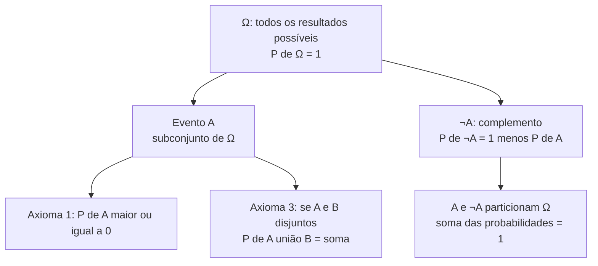
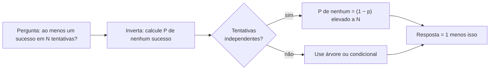
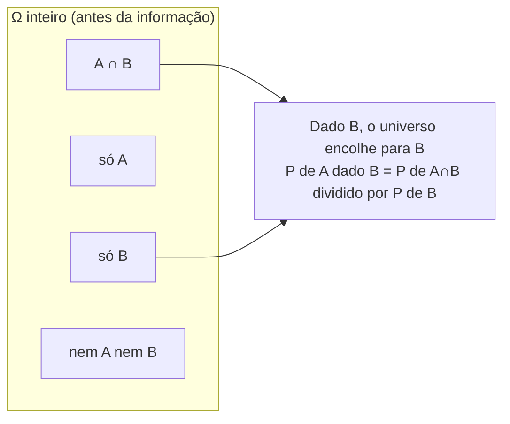
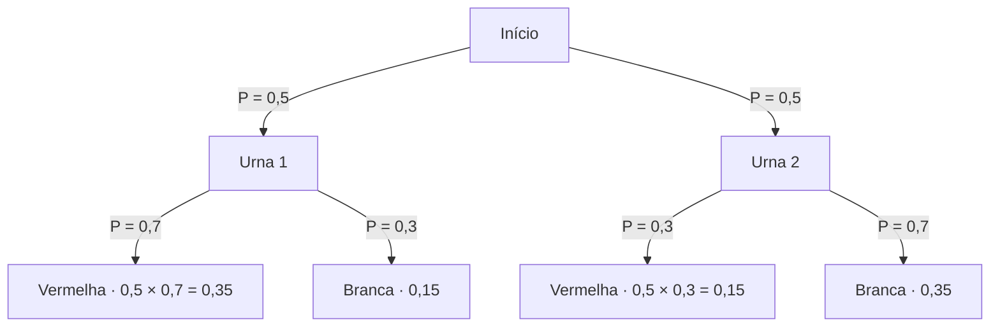
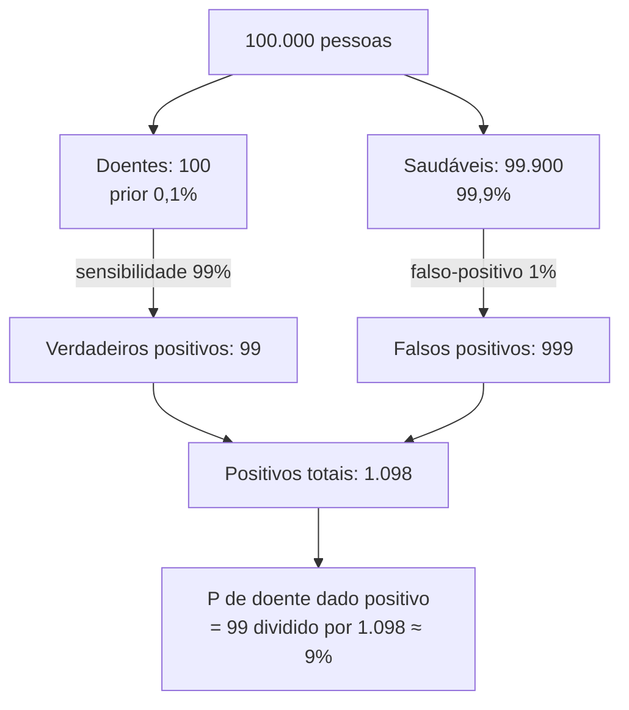
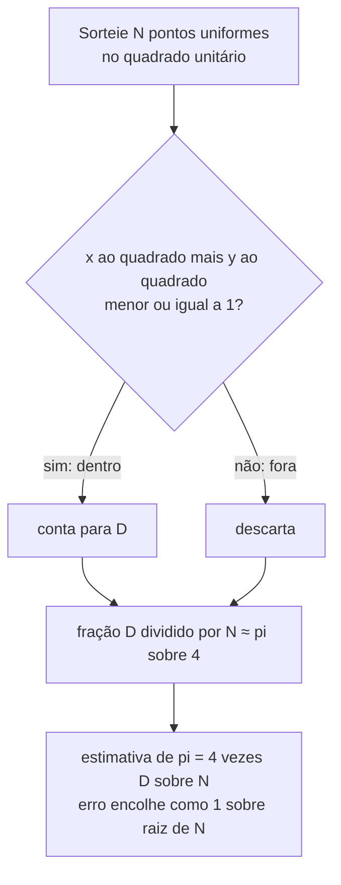

# Probabilidade discreta

> [!abstract] TL;DR
> Probabilidade discreta é **contagem com normalização**: um espaço amostral finito Ω, eventos que são subconjuntos de Ω, e uma medida P que obedece três axiomas de Kolmogorov. No caso uniforme, P(A) = (casos favoráveis) / (casos totais) — pura [[11 - Combinatória - a arte de contar|combinatória]]. Em cima disso se constrói tudo: união por inclusão-exclusão, complemento (a arma secreta do "ao menos um"), probabilidade condicional, independência, e o **Teorema de Bayes**, que inverte condicionais e explica por que um teste 99% preciso para uma doença rara produz uma enxurrada de falsos positivos. Para o dev, isso não é folclore: é colisão de hash (o √N do paradoxo do aniversário), falso-positivo de Bloom filter, cache hit ratio, testes A/B, SLA de "ao menos uma falha", filtros de spam e a base do Monte Carlo.

Você joga uma moeda. Cara ou coroa. Qual a chance de cara?

Metade. Você nem pensou. Mas por que metade? Porque há **dois resultados igualmente possíveis** e **um deles** é favorável. Você acabou de contar. Probabilidade discreta, no fundo, é isso: contar com cuidado e dividir.

A parte difícil nunca é a divisão. É a contagem — e é por isso que esta nota é irmã de sangue da [[11 - Combinatória - a arte de contar]].

---

## O cenário: espaço amostral, eventos, axiomas

Toda história de probabilidade começa desenhando o palco.

O **espaço amostral** Ω é o conjunto de todos os resultados possíveis de um experimento. Um dado de seis faces? Ω = {1, 2, 3, 4, 5, 6}. Duas moedas? Ω = {CC, CK, KC, KK}. Discreto significa: Ω é finito (ou contável). Dá para listar.

Um **evento** é um subconjunto de Ω — uma coleção de resultados que nos interessa. "Sair par" no dado é o evento A = {2, 4, 6}. "Sair ao menos uma cara" nas moedas é {CC, CK, KC}. Evento é conjunto. Guarde isso: tudo que você sabe de teoria dos conjuntos (∪, ∩, ¬) volta agora vestido de probabilidade.

A **probabilidade** P é uma função que pega um evento e devolve um número entre 0 e 1. Mas não pode ser qualquer função. Andrei Kolmogorov, em 1933, fixou três regras — os **axiomas** — das quais todo o resto deriva:

1. **Não-negatividade**: P(A) ≥ 0 para todo evento A. Probabilidade negativa não existe.
2. **Normalização**: P(Ω) = 1. Algum resultado *vai* acontecer. A certeza total vale 1.
3. **Aditividade**: se A e B são **disjuntos** (A ∩ B = ∅), então P(A ∪ B) = P(A) + P(B).

> [!note] Por que só três?
> Toda a teoria — Bayes, aniversário, lei dos grandes números — é teorema derivado desses três axiomas. É o mesmo espírito de um sistema de tipos: poucas regras na base, consequências infinitas em cima. Se algo viola um axioma, não é probabilidade. Ponto.

Da aditividade sai um corolário imediato e útil: como A e ¬A são disjuntos e cobrem todo o Ω, P(A) + P(¬A) = P(Ω) = 1. Segura essa — ela vai resolver metade dos seus problemas.

**Leitura do diagrama**: o universo Ω tem probabilidade total 1. Qualquer evento A é uma fatia desse universo; seu complemento ¬A é o resto. Os axiomas amarram tudo: probabilidades nunca negativas, eventos disjuntos somam, e a partição A / ¬A divide a certeza total em dois pedaços que somam 1.

---

## Probabilidade uniforme é só contar

O caso mais comum — e o que cai em entrevista — é o **uniforme**: todos os resultados de Ω são igualmente prováveis. Dado honesto, moeda honesta, baralho bem embaralhado.

Aí a fórmula é deliciosa:

P(A) = |A| / |Ω| = (casos favoráveis) / (casos totais)

Isso é **literalmente combinatória**. Para calcular a probabilidade, você conta dois conjuntos. O numerador é quantos resultados satisfazem o evento; o denominador é o tamanho de Ω. Toda a artilharia da [[11 - Combinatória - a arte de contar]] — permutações, combinações, regra do produto — está aqui a serviço da probabilidade.

> [!example] Mão de pôquer
> Qual a chance de uma mão de 5 cartas ser um flush (5 do mesmo naipe)?
> - **Total**: C(52, 5) = 2.598.960 mãos possíveis.
> - **Favoráveis**: 4 naipes × C(13, 5) = 4 × 1.287 = 5.148 mãos.
> - P(flush) = 5.148 / 2.598.960 ≈ 0,00198 ≈ 0,2%.
>
> Você não calculou nenhuma "probabilidade" — você contou duas coisas e dividiu. É sempre assim no caso uniforme.

A moral: se você travar num problema de probabilidade uniforme, o problema é de contagem. Volte para a combinatória.

> [!danger] Cuidado: nem tudo é uniforme
> A fórmula favoráveis/total **só vale quando todos os resultados são igualmente prováveis**. Erro clássico de entrevista: "qual a chance da soma de dois dados ser 7?". Tentar `1/11` (porque a soma vai de 2 a 12, são 11 valores) está errado — as somas não são equiprováveis! O espaço correto são os 36 pares ordenados (esses sim equiprováveis). A soma 7 ocorre em 6 pares {(1,6),(2,5),(3,4),(4,3),(5,2),(6,1)}, logo P = 6/36 = 1/6. Sempre confira: o Ω que você escolheu é mesmo uniforme? Se não, troque de Ω até que seja.

### A distribuição completa da soma de dois dados

Vale ver a tabela inteira, porque ela mata a intuição errada de uma vez. O Ω uniforme certo são os **36 pares ordenados** (o primeiro dado × o segundo); cada par vale 1/36. As **somas** herdam probabilidades desiguais, contando quantos pares produzem cada valor:

| Soma | Pares que a produzem | Nº de pares | Probabilidade |
|---|---|---|---|
| 2 | (1,1) | 1 | 1/36 ≈ 2,8% |
| 3 | (1,2),(2,1) | 2 | 2/36 ≈ 5,6% |
| 4 | (1,3),(2,2),(3,1) | 3 | 3/36 ≈ 8,3% |
| 5 | (1,4)…(4,1) | 4 | 4/36 ≈ 11,1% |
| 6 | (1,5)…(5,1) | 5 | 5/36 ≈ 13,9% |
| **7** | (1,6)…(6,1) | **6** | **6/36 ≈ 16,7%** |
| 8 | (2,6)…(6,2) | 5 | 5/36 ≈ 13,9% |
| 9 | (3,6)…(6,3) | 4 | 4/36 ≈ 11,1% |
| 10 | (4,6),(5,5),(6,4) | 3 | 3/36 ≈ 8,3% |
| 11 | (5,6),(6,5) | 2 | 2/36 ≈ 5,6% |
| 12 | (6,6) | 1 | 1/36 ≈ 2,8% |

**Leitura da tabela**: a contagem desenha um triângulo — 1, 2, 3, 4, 5, **6**, 5, 4, 3, 2, 1 — que soma exatamente 36 (todos os pares). O pico está no 7, e não por mágica: 7 é a única soma que admite as seis combinações de faces. As pontas (2 e 12) só nascem de um par cada. Se você tivesse tratado as 11 somas como uniformes, teria atribuído ≈ 9% a cada uma — e errado em **todas**. A lição: escolha o Ω uniforme certo (os pares) e deixe os eventos compostos (as somas) herdarem suas probabilidades por contagem.

---

## União, complemento e o truque do "ao menos um"

E quando os eventos **não** são disjuntos? A aditividade simples falha, porque a interseção é contada duas vezes. A correção é a **inclusão-exclusão** (a mesma da [[12 - Princípios combinatórios - casa dos pombos e inclusão-exclusão]]):

P(A ∪ B) = P(A) + P(B) − P(A ∩ B)

Você soma as duas e subtrai a sobreposição. Se os eventos forem disjuntos, P(A ∩ B) = 0 e a fórmula colapsa de volta na aditividade. Tudo encaixa.

Agora o truque que vale ouro. Considere problemas do tipo "**ao menos um**": ao menos um seis em 4 lançamentos de dado, ao menos uma colisão, ao menos uma falha em N requisições. O cálculo direto é um inferno de inclusão-exclusão com dezenas de termos.

O complemento resolve em uma linha. O oposto de "ao menos um" é "**nenhum**":

P(ao menos um) = 1 − P(nenhum)

> [!tip] A regra de bolso do dev
> Quando o enunciado disser "ao menos um", "pelo menos uma", "alguma" — pare. Calcule o complemento (P de "nenhum") e subtraia de 1. "Nenhum" costuma ser um produto simples de eventos independentes; "ao menos um" é um pesadelo combinatório. Esse único truque resolve o paradoxo do aniversário, o SLA de falhas e o falso-positivo de Bloom.

**Conta concreta**: chance de ao menos um seis em 4 lançamentos. P(nenhum seis num lançamento) = 5/6. Os lançamentos são independentes, então P(nenhum seis em 4) = (5/6)⁴ ≈ 0,482. Logo P(ao menos um seis) = 1 − 0,482 ≈ **0,518**. Pouco mais de meio a meio. Tente fazer isso sem o complemento e você vai chorar.

**Leitura do diagrama**: este é o fluxograma mental para todo problema de "ao menos um". Você nunca ataca de frente; inverte para "nenhum", checa se as tentativas são independentes (se forem, vira o produto `(1 − p)^N`), e subtrai de 1. O mesmo caminho serve para dados, falhas de rede e aniversários.

---

## Probabilidade condicional: atualizar a crença com informação

Até aqui, probabilidades "absolutas". Mas a vida nos dá pistas. Você descobre algo, e isso muda as chances.

A **probabilidade condicional** P(A | B) — lê-se "probabilidade de A dado B" — é a chance de A *sabendo* que B aconteceu:

P(A | B) = P(A ∩ B) / P(B), com P(B) > 0

A intuição geométrica: ao saber que B ocorreu, você **encolheu o universo**. Ω inteiro não importa mais — só o pedaço B é o novo "tudo". A pergunta vira: dentro de B, que fração também é A? Por isso dividimos por P(B): estamos renormalizando para o novo universo.

**Leitura do diagrama**: à esquerda, Ω se divide em quatro regiões pela combinação de A e B. Quando descobrimos que B ocorreu, jogamos fora tudo que está fora de B (o "só A" e o "nem A nem B" deixam de importar). O novo universo é B inteiro (as regiões A∩B e "só B"), e P(A | B) é a fração de B que também é A.

Reorganizando, sai a **regra do produto**:

P(A ∩ B) = P(A | B) · P(B) = P(B | A) · P(A)

Útil para decompor probabilidades de eventos em sequência (árvores de probabilidade, logo abaixo).

### Independência: o caso em que a informação não muda nada

Dois eventos são **independentes** quando saber de um não diz nada sobre o outro: P(A | B) = P(A). Substituindo na definição de condicional, isso vira a forma canônica:

P(A ∩ B) = P(A) · P(B)

Independência é o que faz `(5/6)⁴` ser legítimo: cada lançamento ignora os outros, então as probabilidades multiplicam.

> [!warning] Independente ≠ mutuamente exclusivo (o erro clássico)
> Esses dois conceitos são **opostos**, e quase todo mundo confunde.
> - **Mutuamente exclusivos** (disjuntos): A ∩ B = ∅. Se um acontece, o outro *não pode* acontecer. P(A ∩ B) = 0.
> - **Independentes**: P(A ∩ B) = P(A) · P(B). Um não influencia o outro.
>
> Note: se A e B têm probabilidade positiva e são mutuamente exclusivos, então eles são **fortemente dependentes** — saber que A ocorreu te dá certeza de que B não ocorreu! O exclusivo é o auge da dependência, não da independência. Não troque as bolas numa entrevista.

---

## Árvore de probabilidade: o mapa dos eventos em sequência

Quando os eventos acontecem em etapas, a ferramenta certa é a **árvore de probabilidade**. Cada galho carrega uma probabilidade condicional; você **multiplica ao longo de um caminho** e **soma entre caminhos** que levam ao mesmo desfecho.

Exemplo: duas urnas. A urna 1 (escolhida com prob. 0,5) tem 70% de bolas vermelhas; a urna 2 (0,5) tem 30% vermelhas. Qual a chance de tirar vermelha?

**Leitura do diagrama**: cada caminho da raiz até uma folha é uma sequência de escolhas; multiplicamos as probabilidades dos galhos (0,5 × 0,7 = 0,35 para "urna 1 e vermelha"). Para a probabilidade total de vermelha, somamos os dois caminhos que chegam em vermelha: 0,35 + 0,15 = **0,50**. Isso é a **lei da probabilidade total** desenhada — particionar pelo primeiro passo e somar.

A árvore também prepara o terreno para Bayes: se você observou "vermelha" e quer saber de qual urna veio, está **subindo** a árvore — invertendo a condicional.

### Lei da probabilidade total: somar entre os caminhos, formalmente

Aquele "0,35 + 0,15 = 0,50" não foi truque de aritmética — foi a **lei da probabilidade total** em ação. Ela diz: se você tem uma **partição** de Ω, isto é, uma coleção de eventos {B₁, B₂, …, Bₙ} que são disjuntos dois a dois e cobrem todo o Ω, então a probabilidade de qualquer evento A pode ser fatiada por essa partição:

P(A) = ∑ᵢ P(A | Bᵢ) · P(Bᵢ)

Lê-se assim: para achar a chance total de A, percorra cada pedaço Bᵢ do universo, calcule a chance de A *dentro* daquele pedaço (a condicional P(A | Bᵢ)), pese pelo tamanho do pedaço (P(Bᵢ)), e some tudo. Na árvore das urnas, a partição é {urna 1, urna 2}; A é "vermelha"; cada termo P(A | Bᵢ)·P(Bᵢ) é um caminho da raiz à folha "vermelha"; e somar entre os caminhos É a lei.

> [!note] Por que a partição tem que cobrir tudo
> A lei só funciona se os Bᵢ forem mutuamente exclusivos **e** exaustivos (juntos formam Ω). Senão você conta um pedaço duas vezes ou esquece um. O exemplo mínimo de partição é {B, ¬B}, e aí a lei vira P(A) = P(A | B)·P(B) + P(A | ¬B)·P(¬B) — exatamente o denominador escondido do Teorema de Bayes, logo abaixo. Bayes precisa da lei da probabilidade total para calcular P(B), a evidência total.

---

## Teorema de Bayes: invertendo a seta

Bayes é a peça mais poderosa — e a mais contraintuitiva — da probabilidade discreta. Ele responde: dado que observei B, qual a probabilidade da causa A?

P(A | B) = [ P(B | A) · P(A) ] / P(B)

Os nomes importam:
- **P(A)** é o **prior**: sua crença em A *antes* de observar nada.
- **P(B | A)** é a **verossimilhança**: quão provável é a evidência B se A for verdade.
- **P(A | B)** é o **posterior**: sua crença atualizada *depois* de ver B.

Bayes é a máquina de **aprender com evidência**. Prior entra, evidência chega, posterior sai. É literalmente o ciclo de um filtro de spam ou de um classificador.

### O falso-positivo médico, com a conta

Aqui está o exemplo que derruba a intuição de quase todo mundo. Doença rara: 1 pessoa em 1.000 tem (prevalência 0,1%). Teste 99% preciso: detecta 99% dos doentes (sensibilidade) e dá negativo em 99% dos sãos (especificidade — ou seja, 1% de falso-positivo).

**Você testou positivo. Qual a chance de você estar realmente doente?**

A intuição grita "99%". Está errada. Vamos contar, com uma população de 100.000:

| População de 100.000 | Doente (0,1% = 100) | Saudável (99,9% = 99.900) | Total |
|---|---|---|---|
| **Teste positivo** | 99 (verdadeiros pos.) | 999 (falsos pos.) | **1.098** |
| **Teste negativo** | 1 (falso neg.) | 98.901 (verdadeiros neg.) | 98.902 |

**Leitura da matriz de confusão**: de 100 doentes, o teste pega 99. Mas de 99.900 saudáveis, 1% — quase 1.000 pessoas — dá falso-positivo. Resultado: entre os 1.098 positivos, só 99 estão de fato doentes.

P(doente | positivo) = 99 / 1.098 ≈ **0,09 ≈ 9%**

Nove por cento. Um teste "99% preciso" deixa você com 91% de chance de estar saudável após um positivo. Por quê? Porque os **saudáveis são esmagadoramente mais numerosos**, e mesmo um errinho de 1% sobre uma multidão gigante gera mais falsos positivos do que existem verdadeiros positivos. Isso se chama **falácia da taxa-base** (base rate fallacy): ignorar o prior (a raridade) destrói a leitura.

**Leitura do diagrama**: a população se parte pelo prior (doentes vs. saudáveis). Cada ramo gera positivos — os doentes via sensibilidade, os saudáveis via taxa de falso-positivo. O posterior é a fatia de verdadeiros positivos sobre o total de positivos. O ramo saudável, por ser imenso, domina e arrasta o resultado para baixo.

> [!quote] A lição que fica
> Bayes diz: a evidência não substitui o prior, ela o **atualiza**. Um teste forte sobre um evento raríssimo ainda produz, na maioria das vezes, alarmes falsos. Guarde isso para detecção de fraude, alertas de segurança e monitoramento — todo classificador de evento raro vive nesse dilema.

---

## Paradoxo do aniversário: o √N que assombra o hashing

Pergunta de festa: numa sala com **23 pessoas**, qual a chance de duas fazerem aniversário no mesmo dia?

A intuição diz "baixíssima — são 365 dias!". A intuição erra feio. A resposta é **mais de 50%**.

O segredo é o complemento de novo. Calcular "ao menos uma coincidência" direto é horrível. Calcule o oposto: "**todos os aniversários diferentes**".

Pessoa 1: qualquer dia (365/365). Pessoa 2: tem que evitar 1 dia (364/365). Pessoa 3: evitar 2 dias (363/365). E assim por diante:

P(todos diferentes) = (365/365) · (364/365) · (363/365) · … · ((365 − n + 1)/365)

P(ao menos uma coincidência) = 1 − P(todos diferentes)

| n (pessoas) | P(todos diferentes) | P(ao menos uma coincidência) |
|---|---|---|
| 10 | ≈ 0,883 | ≈ **11,7%** |
| 23 | ≈ 0,493 | ≈ **50,7%** |
| 30 | ≈ 0,294 | ≈ **70,6%** |
| 50 | ≈ 0,030 | ≈ **97,0%** |
| 70 | ≈ 0,0008 | ≈ **99,9%** |

**Leitura da tabela**: a probabilidade de coincidência sobe muito mais rápido do que a intuição prevê. Aos 23 ela cruza 50%; aos 50 já é praticamente certeza. O motivo: o número de **pares** de pessoas cresce com C(n, 2) ≈ n²/2 — com 23 pessoas há 253 pares disputando 365 dias. Não é "pessoa vs. ano", é "par vs. ano".

### Por que o dev se importa: colisão de hash

Troque "pessoas" por "chaves" e "365 dias" por "N posições da tabela hash". O paradoxo do aniversário vira uma lei de engenharia:

> [!important] A regra do √N
> Espera-se a **primeira colisão** após inserir aproximadamente **√N** itens numa tabela (ou função) de hash com N saídas possíveis. Não N. **Raiz de N.**

Isso é demolidor. Um hash de 64 bits tem N = 2⁶⁴ saídas — parece imenso. Mas você espera colisão após ~2³² ≈ 4 bilhões de itens, não 2⁶⁴. Por isso **ataques de aniversário** quebram funções de hash na metade dos bits: para forçar colisão num hash de b bits, bastam ~2^(b/2) tentativas. É exatamente por isso que assinaturas digitais precisam de hashes longos (SHA-256 e não SHA-128): a segurança efetiva contra colisão é metade do tamanho.

A conta é a mesma da festa, só com rótulos trocados. Probabilidade discreta não muda; só o domínio.

---

## Na prática: o acaso na vida do dev

A probabilidade discreta não é decoração de currículo. Ela está embutida em estruturas e decisões que você toma toda semana.

| Conceito de probabilidade | Onde aparece em CS |
|---|---|
| Uniforme = contagem | Geração de IDs, sorteio justo, shuffle de Fisher-Yates |
| Paradoxo do aniversário (√N) | Colisão de hash, ataque de aniversário, escolha de tamanho de UUID |
| Complemento ("ao menos um") | SLA de falhas, retry, "alguma request falha?" |
| Probabilidade condicional | Cache hit ratio dependente de localidade, sequências de eventos |
| Independência | Réplicas independentes, multiplicar taxas de falha |
| Bayes (prior × posterior) | Filtro de spam, classificação ML, detecção de fraude |
| Falso-positivo controlado | Bloom filter, sketches probabilísticos |
| Amostragem / lei dos grandes números | Monte Carlo, profiling por sampling, testes A/B |

**Leitura da tabela**: cada linha é uma ponte entre um teorema desta nota e uma decisão de engenharia. Probabilidade é a matemática operacional de sistemas que lidam com escala, incerteza e dados.

Vamos nos quatro mais afiados.

### "Ao menos uma falha em N requisições" — o complemento operacional

Cada chamada a um serviço falha com probabilidade independente p = 0,1% (0,001). Você faz N = 1.000 chamadas. Qual a chance de **ao menos uma** falhar?

Complemento. P(nenhuma falha) = (1 − 0,001)¹⁰⁰⁰ = 0,999¹⁰⁰⁰ ≈ 0,368. Logo:

P(ao menos uma falha) = 1 − 0,368 ≈ **0,632 ≈ 63%**

Mesmo com 99,9% de confiabilidade por chamada, mil chamadas quase garantem uma falha. É por isso que sistemas distribuídos *precisam* de retry, idempotência e graceful degradation: em escala, o raro vira rotina. (Aqui mora a regra `(1 − p)^N`, prima direta do paradoxo do aniversário.)

### Bloom filter: o falso-positivo de propósito

Um [[21 - O acaso na computação - estruturas e algoritmos aleatorizados|Bloom filter]] é uma estrutura probabilística que responde "este item já foi visto?" gastando memória ridícula. O preço: ele tem **falsos positivos** — às vezes diz "sim" para algo que nunca viu (mas *nunca* dá falso-negativo). A taxa de falso-positivo é uma fórmula de probabilidade direta: ≈ (1 − e^(−kn/m))^k, função do número de bits m, de hashes k e de itens n. Você **escolhe** a taxa de erro ajustando m e k. Probabilidade como dial de design.

### Testes A/B: o acaso que decide produto

Você mostra a versão A para metade dos usuários, B para a outra. B teve mais cliques. Foi a versão B que é melhor, ou foi **sorte amostral**? Probabilidade discreta é a base do **teste de significância**: qual a chance de ver essa diferença *se as versões fossem idênticas*? Se for baixíssima (o famoso p-valor), você credita a B. Sem o raciocínio probabilístico, você toma decisão em cima de ruído.

### Monte Carlo: quando contar é impossível, sorteie

Quando o espaço é grande demais para enumerar (a contagem direta seria astronômica), você **amostra**: gera muitos casos aleatórios e estima a probabilidade pela frequência observada. Estimar π jogando pontos num quadrado, precificar opções financeiras, renderizar luz em path tracing — tudo Monte Carlo. A garantia de que a média amostral converge para a probabilidade verdadeira vem da **lei dos grandes números**, e a velocidade dessa convergência é assunto de [[20 - Variáveis aleatórias e esperança|esperança e variância]]. Detalhes em [[21 - O acaso na computação - estruturas e algoritmos aleatorizados]].

#### Estimando π com pontos aleatórios — a conta

Vale fazer o exemplo até o fim, porque ele é o "olá mundo" do Monte Carlo e amarra tudo desta nota. Pegue o quadrado unitário [0,1] × [0,1] e, dentro dele, o quarto de círculo de raio 1 centrado na origem (os pontos com x² + y² ≤ 1). Áreas: o quadrado tem área 1; o quarto de círculo tem área (π · 1²)/4 = π/4.

Agora sorteie um ponto **uniforme** no quadrado — x e y independentes em [0,1]. A probabilidade de ele cair dentro do quarto de círculo é razão de áreas:

P(dentro) = (π/4) / 1 = π/4 ≈ 0,785

Inverta para isolar π: se você jogar N pontos e D deles caírem dentro (x² + y² ≤ 1), a fração D/N estima P(dentro) ≈ π/4. Logo:

π ≈ 4 · (D / N)

> [!example] O experimento em palavras
> Jogue 1.000 dardos no quadrado. Conte quantos ficaram dentro do quarto de círculo — digamos 786. Estimativa: π ≈ 4 × 786/1000 = 3,144. Jogue 1.000.000 e a estimativa gruda em ~3,1416. Nenhuma fórmula de geometria foi usada; só contagem de acertos e divisão — a mesma "favoráveis/total" do começo da nota, agora com o Ω amostrado em vez de enumerado.

**Por que converge?** Cada dardo é um experimento de Bernoulli: "dentro" com probabilidade p = π/4, "fora" com 1 − p, e os dardos são independentes. A **lei dos grandes números** garante que a frequência observada D/N tende a p quando N cresce. O preço é a velocidade: o erro encolhe como ≈ 1/√N, então cada dígito decimal extra de precisão custa **100 vezes mais** pontos. Monte Carlo é honesto mas lento — convergência √N é o tema que [[20 - Variáveis aleatórias e esperança|variância]] e [[21 - O acaso na computação - estruturas e algoritmos aleatorizados]] aprofundam.

**Leitura do diagrama**: o laço de Monte Carlo é trivial — sorteia, testa o pertencimento, conta o acerto. A inteligência está na razão de áreas que transforma uma contagem de acertos numa estimativa de π, e na lei dos grandes números que garante a convergência conforme N cresce.

> [!summary] Resumo em uma linha
> Probabilidade discreta é contagem normalizada sob três axiomas, da qual saem condicional, independência e Bayes — e cujo √N do aniversário, falso-positivo de Bayes e regra do complemento são ferramentas diárias de quem projeta hashing, Bloom filters, SLAs e classificadores.

---

## Em entrevista

Probabilidade aparece em entrevistas de duas formas: o quebra-cabeça clássico (aniversário, dois dados, moedas) e a pergunta de sistema disfarçada ("qual o tamanho de UUID seguro?", "por que esse alerta tem tantos falsos positivos?"). O entrevistador quer ver se você reconhece o **truque do complemento**, se sabe separar **independente de mutuamente exclusivo**, e se entende por que Bayes humilha a intuição com eventos raros. Conecte sempre a probabilidade ao domínio de CS — colisão de hash, Bloom filter, SLA — porque é isso que separa quem decorou de quem entende.

*The probability of an event in a uniform space is just favorable outcomes over total outcomes — it's counting.*
*Whenever I see "at least one", I compute one minus the probability of "none", because the complement is almost always easier.*
*Independent and mutually exclusive are opposites: disjoint events with positive probability are strongly dependent.*
*Bayes' theorem inverts the conditional: posterior is likelihood times prior, divided by the evidence.*
*For a rare disease, even a 99%-accurate test yields mostly false positives — that's the base rate fallacy.*
*The birthday paradox says 23 people give over a 50% chance of a shared birthday.*
*In hashing terms, you expect the first collision after roughly the square root of N insertions.*
*That's why a birthday attack breaks a b-bit hash in about 2 to the b-over-2 operations.*
*Bloom filters trade a tunable false-positive rate for tiny memory, with zero false negatives.*

| Português | English |
|---|---|
| Espaço amostral | Sample space |
| Evento | Event |
| Axiomas de Kolmogorov | Kolmogorov axioms |
| Probabilidade uniforme | Uniform probability |
| Casos favoráveis / totais | Favorable / total outcomes |
| União / interseção | Union / intersection |
| Complemento | Complement |
| Inclusão-exclusão | Inclusion-exclusion |
| Mutuamente exclusivos / disjuntos | Mutually exclusive / disjoint |
| Probabilidade condicional | Conditional probability |
| Regra do produto | Product rule / chain rule |
| Independência | Independence |
| Teorema de Bayes | Bayes' theorem |
| Verossimilhança | Likelihood |
| Prior / posterior | Prior / posterior |
| Falácia da taxa-base | Base rate fallacy |
| Falso positivo / negativo | False positive / negative |
| Paradoxo do aniversário | Birthday paradox / birthday problem |
| Colisão de hash | Hash collision |
| Lei dos grandes números | Law of large numbers |

> [!info] Lastro
> - Rosen, *Discrete Mathematics and Its Applications*, capítulo Discrete Probability — espaço amostral, eventos, probabilidade uniforme, condicional, independência e Teorema de Bayes.
> - Lehman, Leighton & Meyer, *Mathematics for Computer Science* (MIT, CC BY-SA) — parte de probabilidade: independência, probabilidade condicional, Teorema de Bayes e a falácia da taxa-base. Disponível em [people.csail.mit.edu/meyer/mcs.pdf](https://people.csail.mit.edu/meyer/mcs.pdf).
> - Mitzenmacher & Upfal, *Probability and Computing*, 2ª ed. (Cambridge, 2017), capítulo 5 "Balls, Bins, and Random Graphs" — paradoxo do aniversário, bolas em urnas e aplicações a hashing e load balancing. [cambridge.org](https://www.cambridge.org/core/books/abs/probability-and-computing/balls-bins-and-random-graphs/8993F4AC2C643BF31A466EC1588EEB53).
> - MIT 6.042 / *Mathematics for Computer Science* lecture notes — tratamento do problema do aniversário e da colisão de hash via complemento.
