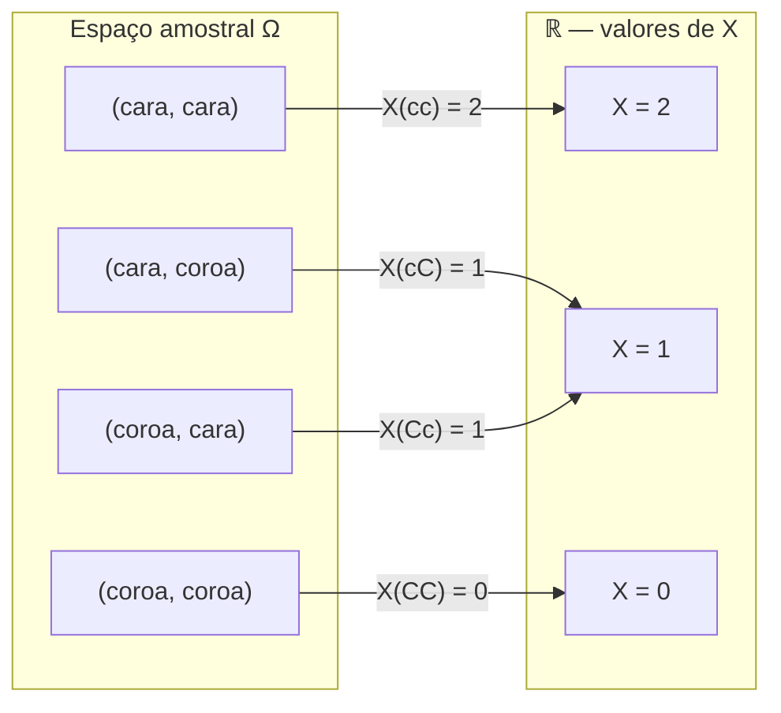
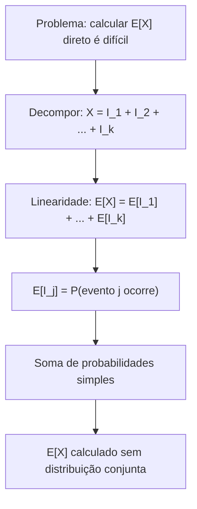
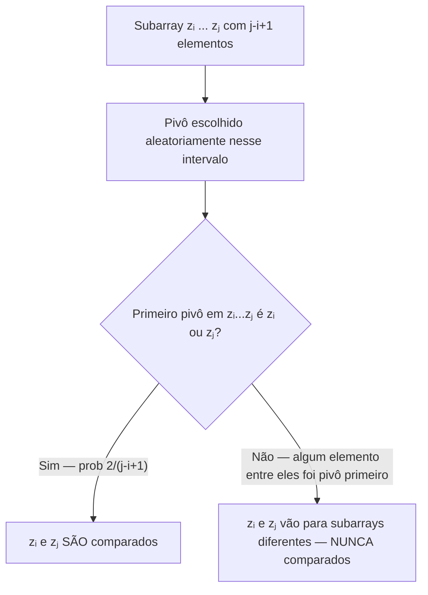
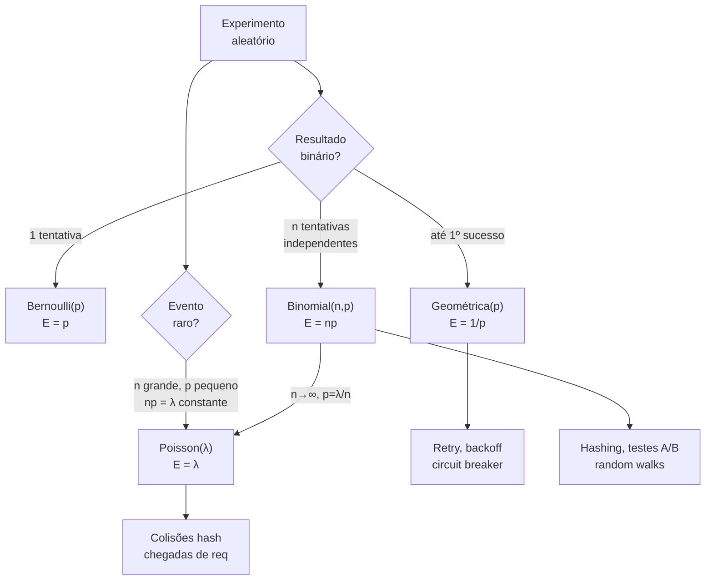

# Variáveis aleatórias e esperança

> [!abstract] TL;DR
> Uma variável aleatória é **uma função** do espaço amostral para os reais — transforma eventos em números. A **esperança** E[X] é a média ponderada pela probabilidade: o valor que o jogo "vale" no longo prazo. A **linearidade da esperança** (E[X + Y] = E[X] + E[Y], mesmo com X e Y dependentes) é a ferramenta mais poderosa da análise probabilística: permite decompor problemas complexos em somas de indicadores simples e obter O(n log n) para o Quicksort randomizado, n·Hₙ para o Coupon Collector, e muito mais.

---

## O que é uma variável aleatória?

Você já estudou o espaço amostral Ω em [[19 - Probabilidade discreta]]. Mas às vezes você não quer saber "qual resultado ocorreu" — quer saber **quanto**.

Ao jogar dois dados, Ω contém 36 pares ordenados. Você provavelmente não liga para (3, 4) versus (4, 3) em si; liga para **7**, a soma. Essa soma é uma variável aleatória.

> **Definição formal.** Uma variável aleatória (VA) é uma [[09 - Funções|função]] X : Ω → ℝ que atribui um número real a cada resultado do espaço amostral.

O nome é enganoso: X não é uma variável, é uma **função**. Ela "resume" o resultado aleatório em um número mensurável.

*Leitura do diagrama:* X conta o número de caras em dois lançamentos. Dois eventos distintos (cara-coroa e coroa-cara) mapeiam para o mesmo valor 1 — isso é normal. A VA colapsa a granularidade de Ω no que realmente interessa.

### Distribuição e PMF

A **função de massa de probabilidade** (PMF) de X é:

P(X = x) = ∑ P(ω), para todo ω ∈ Ω tal que X(ω) = x

Ela responde: qual a chance de X assumir o valor x? A PMF deve satisfazer ∑ₓ P(X = x) = 1.

No exemplo acima: P(X = 0) = 1/4, P(X = 1) = 1/2, P(X = 2) = 1/4.

### Variável aleatória indicadora

A VA mais simples é a **indicadora**: uma função 0/1 que "detecta" se um evento A ocorreu.

Iₐ(ω) = 1 se ω ∈ A, e Iₐ(ω) = 0 caso contrário.

Propriedade chave: **E[Iₐ] = P(A)**. Essa identidade trivial é o motor por trás de análises sofisticadas — você vai ver isso repetidamente nesta nota.

---

## Esperança: o valor justo do jogo

A **esperança** (ou valor esperado) de X é a média ponderada de todos os valores possíveis:

E[X] = ∑ₓ x · P(X = x)

Imagine jogar um jogo 1.000.000 de vezes e tirar a média dos resultados. Esse limite é E[X]. É por isso que E[X] é chamado de "aposta justa": um jogo é justo quando você paga exatamente E[X] para jogar.

**Exemplo.** Um dado honesto: E[X] = 1·(1/6) + 2·(1/6) + 3·(1/6) + 4·(1/6) + 5·(1/6) + 6·(1/6) = 21/6 = 3,5. Nunca cai 3,5 — mas é isso que "vale" o dado no longo prazo.

### Esperança de uma função g(X)

Não precisa primeiro derivar a distribuição de g(X). Pelo **Lei do estatístico inconsciente**:

E[g(X)] = ∑ₓ g(x) · P(X = x)

**Exemplo.** Para o dado: E[X²] = 1·(1/6) + 4·(1/6) + 9·(1/6) + 16·(1/6) + 25·(1/6) + 36·(1/6) = 91/6 ≈ 15,17.

---

## Linearidade da esperança — a ferramenta mais poderosa

> [!important] Lei da Linearidade
> Para **quaisquer** variáveis aleatórias X e Y (independentes OU dependentes):
>
> **E[X + Y] = E[X] + E[Y]**
>
> E para constantes a, b ∈ ℝ:
>
> **E[aX + b] = aE[X] + b**

Por que isso é contraintuitivo? Porque funciona **mesmo quando X e Y são dependentes**. Variância não tem essa propriedade — Var(X + Y) = Var(X) + Var(Y) só quando X e Y são independentes. Esperança é mais gentil.

**Prova em duas linhas.** Pela definição:

E[X + Y] = ∑ω (X(ω) + Y(ω)) · P(ω) = ∑ω X(ω) · P(ω) + ∑ω Y(ω) · P(ω) = E[X] + E[Y]

Não precisa de independência em lugar nenhum.

A linearidade se estende para qualquer soma finita: E[X₁ + X₂ + ... + Xₙ] = E[X₁] + E[X₂] + ... + E[Xₙ].

### A técnica dos indicadores

A combinação da linearidade com VAs indicadoras é incrivelmente poderosa. O método:

1. Identificar o que você quer contar (número de eventos que ocorrem).
2. Definir um indicador Iᵢ para cada evento de interesse.
3. Escrever X = I₁ + I₂ + ... + Iₙ.
4. Aplicar linearidade: E[X] = E[I₁] + E[I₂] + ... + E[Iₙ] = P(A₁) + P(A₂) + ... + P(Aₙ).

Você soma probabilidades simples em vez de calcular uma distribuição conjunta complexa.

*Leitura do diagrama:* A técnica transforma um problema de esperança difícil (distribuição conjunta) em uma soma de probabilidades individuais. A magia está no passo de linearidade — que dispensa independência.

---

## Variância e desvio padrão

A esperança diz onde X "mora" em média. A **variância** diz o quanto X se afasta dessa média:

Var(X) = E[(X − E[X])²] = E[X²] − E[X]²

A segunda forma (fórmula de Steiner) é mais fácil de calcular na prática.

**Interpretação.** Se E[X] = 5 e Var(X) = 0, X é sempre 5. Se Var(X) = 100, os valores de X ficam bastante espalhados ao redor de 5.

O **desvio padrão** σ = √Var(X) tem a mesma unidade que X — mais fácil de interpretar que a variância, que tem unidade ao quadrado.

### Propriedades da variância

- Var(aX) = a² · Var(X) — escalar multiplica a variância pelo quadrado.
- Var(X + b) = Var(X) — deslocar não muda a dispersão.
- Var(X + Y) = Var(X) + Var(Y) **somente se X e Y são independentes** (ao contrário da esperança!).

**Exemplo (dado honesto).** E[X] = 3,5 e E[X²] = 91/6 ≈ 15,17. Então Var(X) = 91/6 − (7/2)² = 91/6 − 49/4 = (182 − 147)/12 = 35/12 ≈ 2,92. σ ≈ 1,71.

### Prova da fórmula de Steiner

A forma Var(X) = E[X²] − E[X]² não é óbvia. Expanda a definição:

Var(X) = E[(X − μ)²] = E[X² − 2μX + μ²]

Por linearidade da esperança:

= E[X²] − 2μ·E[X] + μ²

= E[X²] − 2μ² + μ² (pois E[X] = μ)

= E[X²] − μ² = E[X²] − E[X]²

A linearidade da esperança aparece de novo — desta vez dentro da própria derivação da variância.

> [!warning] Esperança ≠ Variância em termos de dependência
> A linearidade da esperança vale para VAs dependentes. A aditividade da variância só vale para VAs **independentes**. Confundir os dois é um erro clássico em entrevistas de sistemas e em provas de confiabilidade de sistemas distribuídos.

---

## Distribuições discretas clássicas

As quatro distribuições abaixo aparecem constantemente em análise de algoritmos. Aprenda PMF, E e Var de cor.

| Distribuição | PMF P(X = k) | E[X] | Var(X) | Uso típico em CS |
|---|---|---|---|---|
| **Bernoulli(p)** | P(1) = p, P(0) = 1−p | p | p(1−p) | Sucesso/falha de uma operação |
| **Binomial(n, p)** | C(n,k) · pᵏ · (1−p)ⁿ⁻ᵏ | np | np(1−p) | k sucessos em n tentativas independentes |
| **Geométrica(p)** | (1−p)ᵏ⁻¹ · p, k ≥ 1 | 1/p | (1−p)/p² | Número de tentativas até o 1º sucesso |
| **Poisson(λ)** | e⁻λ · λᵏ / k!, k ≥ 0 | λ | λ | Chegadas raras; aproximação Binomial com n grande, p pequeno |

**Intuição para a Binomial.** X = I₁ + I₂ + ... + Iₙ, onde Iᵢ indica sucesso na i-ésima tentativa. Por linearidade, E[X] = np. Simples assim — sem derivar a PMF.

**Intuição para a Geométrica.** "Quantas tentativas até o primeiro sucesso?" Se cada tentativa tem chance p, você espera 1/p tentativas. Probabilidade 0,5 de acertar? Espere 2 tentativas. Probabilidade 0,01? Espere 100 tentativas. É o modelo correto para qualquer **retry com probabilidade de sucesso constante**.

**Sobre a Poisson.** É o limite da Binomial(n, λ/n) quando n → ∞. Modela chegadas de eventos raros: requisições HTTP por segundo, erros de bit em transmissão, colisões numa tabela hash (mais sobre isso adiante).

**Derivando E[Binomial] via indicadores.** Suponha X ~ Binomial(n, p). Escreva X = I₁ + ... + Iₙ. Cada Iᵢ ~ Bernoulli(p), então E[Iᵢ] = p. Por linearidade: E[X] = n · p. Agora Var(X): como as Iᵢ são **independentes**, Var(X) = ∑ Var(Iᵢ) = n · p(1−p). Note como independência é necessária para somar variâncias — mas não era necessária para somar esperanças.

**Derivando E[Geométrica] direto.** Seja X ~ Geom(p). Na primeira tentativa você sucede com prob p (X = 1) ou falha com prob 1−p e "recomeça" (X = 1 + X'). Logo:

E[X] = p · 1 + (1−p) · (1 + E[X])

E[X] = p + (1−p) + (1−p)·E[X]

E[X] − (1−p)·E[X] = 1

p · E[X] = 1, portanto **E[X] = 1/p**.

O argumento usa a **propriedade de falta de memória** da Geométrica: dado que você falhou, a distribuição do número de tentativas restantes é idêntica à distribuição original.

**Tabela de valores geométricos (intuição para retry):**

| Prob de sucesso p | E[tentativas] = 1/p | Exemplo |
|---|---|---|
| 0,99 | ≈ 1,01 | Operação quase sempre OK |
| 0,90 | ≈ 1,11 | Latência ocasional |
| 0,50 | 2 | Serviço degradado |
| 0,10 | 10 | Serviço instável |
| 0,01 | 100 | Serviço quebrado |

*Leitura da tabela:* Com p = 0,1 você espera 10 tentativas — circuit breakers existem exatamente para cortar esse ciclo antes que o cliente esgote seu orçamento de latência.

---

## Desigualdades de concentração

A esperança diz onde X está em média. Às vezes queremos saber: qual a chance de X se desviar muito da média? As desigualdades de concentração respondem isso com garantias probabilísticas.

### Desigualdade de Markov

Para qualquer VA não negativa X e a > 0:

**P(X ≥ a) ≤ E[X] / a**

É a desigualdade mais fraca — usa apenas a esperança — mas é universalmente aplicável. Se você sabe que E[X] = 10, então P(X ≥ 100) ≤ 1/10. Não é impressionante, mas é sempre verdadeiro.

**Prova em uma linha.** E[X] = ∑ₓ x · P(X = x) ≥ ∑_{x ≥ a} x · P(X = x) ≥ a · P(X ≥ a). Divida por a.

### Desigualdade de Chebyshev

Para qualquer VA com esperança μ e variância σ² finita, e k > 0:

**P(|X − μ| ≥ k) ≤ σ² / k²**

Mais forte que Markov porque usa a variância. Tradução: para X ficar a mais de k da média, a probabilidade cai como 1/k². Chebyshev é a base formal da lei dos grandes números.

**Exemplo.** Se σ² = 4 e k = 10, então P(|X − μ| ≥ 10) ≤ 4/100 = 0,04. Só 4% de chance de X se desviar mais que 10 unidades da média.

### Desigualdade de Chernoff (ideia)

Chebyshev usa o segundo momento. Chernoff usa a função geradora de momentos e produz limites **exponencialmente mais fortes** para somas de VAs independentes. Em vez de 1/k², você obtém e⁻Ω(k). É a base formal para provar que algoritmos randomizados falham com probabilidade negligenciável — e o fundamento matemático do Monte Carlo.

**Por que médias convergem.** Seja X̄ₙ = (X₁ + ... + Xₙ)/n a média amostral, com E[Xᵢ] = μ e Var(Xᵢ) = σ². Então E[X̄ₙ] = μ e Var(X̄ₙ) = σ²/n. A variância cai com n — por Chebyshev, P(|X̄ₙ − μ| ≥ ε) → 0 conforme n → ∞. É a lei dos grandes números. É por isso que Monte Carlo funciona: amostras suficientes e a média converge para a integral.

---

## Prática: ângulo dev (profundidade máxima)

### 1. Análise do Quicksort randomizado — E[comparações] = O(n log n)

Esse é o resultado mais elegante da análise probabilística de algoritmos. A ideia: não analise a estrutura recursiva. Use indicadores.

**Setup.** Seja z₁ < z₂ < ... < zₙ os elementos do array em ordem. Defina o indicador:

Xᵢⱼ = 1 se zᵢ e zⱼ são comparados durante a execução, e 0 caso contrário.

O número total de comparações é X = ∑_{i<j} Xᵢⱼ.

**Linearidade.** E[X] = ∑_{i<j} E[Xᵢⱼ] = ∑_{i<j} P(zᵢ e zⱼ são comparados).

**A probabilidade chave.** Dois elementos zᵢ e zⱼ são comparados se e somente se um deles é o primeiro pivô escolhido dentre {zᵢ, zᵢ₊₁, ..., zⱼ}. O pivô é escolhido uniformemente ao acaso no subarray — portanto qualquer elemento em {zᵢ, ..., zⱼ} é igualmente provável de ser o primeiro escolhido. A probabilidade de zᵢ ou zⱼ ser o primeiro é:

**P(Xᵢⱼ = 1) = 2 / (j − i + 1)**

*Leitura do diagrama:* O insight crucial é que, uma vez que um elemento entre zᵢ e zⱼ é escolhido como pivô antes de ambos, eles são separados em partições diferentes e jamais se encontram. A comparação só ocorre se um dos dois é pivô primeiro.

**Somando.** Fazendo d = j − i (o "gap"):

E[X] = ∑_{i<j} 2/(j−i+1) = ∑_{d=1}^{n−1} (n−d) · 2/(d+1)

Aproximando por cima: ≤ ∑_{d=1}^{n−1} n · 2/(d+1) = 2n · ∑_{d=1}^{n−1} 1/(d+1) ≈ 2n · Hₙ ≈ 2n ln n

Logo **E[X] = O(n log n)** — sem resolver recorrências, sem análise de casos. Pura linearidade da esperança + indicadores.

> [!tip] Por que isso importa
> O argumento acima mostra que o Quicksort randomizado é bom **em média para qualquer entrada** (não só entradas aleatórias). O adversário não consegue forçar o pior caso porque a randomização é do algoritmo, não dos dados.

### 2. Tabela hash — número esperado de colisões e custo de busca

Uma tabela hash com n chaves e m slots usa uma função hash uniformemente aleatória.

**Colisões.** Defina Cᵢⱼ = 1 se as chaves i e j vão para o mesmo slot. P(Cᵢⱼ = 1) = 1/m. O número esperado de pares em colisão:

E[C] = C(n, 2) · (1/m) = n(n−1) / (2m)

Com load factor α = n/m, isso é ≈ α·n/2. Mantendo α constante, o número de colisões é O(n).

**Custo de busca (endereçamento por encadeamento).** Cada slot tem uma lista encadeada. O comprimento esperado de cada lista é n/m = α. Uma busca sem sucesso percorre toda a lista: O(1 + α). Com α = O(1), buscas custam O(1) esperado.

**Quando α cresce.** Se a tabela não faz rehashing, O(α) por operação. Com α = 10, buscas ficam 10× mais lentas — por isso tabelas modernas mantêm α ≤ 0,75 (Java HashMap) ou ≤ 0,5 (open addressing).

### 3. Retry com falha — distribuição Geométrica

Uma requisição falha com probabilidade q = 1 − p. Você tenta repetidamente até o primeiro sucesso. Pelo modelo geométrico:

E[tentativas] = 1/p

**Exemplo.** Um deploy falha com probabilidade 0,1 por causa de flakiness de rede. Espere 1/0,9 ≈ 1,11 tentativas — quase sempre uma basta. Mas se a probabilidade de falha é 0,5 (serviço instável), espere 2 tentativas. Se é 0,99 (serviço quebrado), espere 100 tentativas.

**Circuit breaker.** Se cada tentativa custa T segundos e você tem deadline D, o número de tentativas viáveis é D/T. A probabilidade de o sistema terminar antes de sucesso é (1−p)^{D/T} — exponencialmente pequena se p é razoável. Isso justifica a política de exponential backoff: cada retry aumenta a chance de sucesso de outros clientes (menos contenção).

### 4. Coupon Collector — esperar por cobertura completa

Você quer coletar todos os n cupons distintos, um por vez, com reposição, cada um igualmente provável. Qual o número esperado de compras?

**Análise por fases.** Defina a fase k como o período em que você já tem k−1 cupons distintos e está esperando o k-ésimo novo. Nessa fase, a probabilidade de sucesso em cada tentativa é (n − (k−1))/n = (n − k + 1)/n. O tempo esperado na fase k é distribuição Geométrica com parâmetro pₖ = (n−k+1)/n, portanto E[tempo na fase k] = n/(n−k+1).

O tempo total esperado é:

E[T] = ∑_{k=1}^{n} n/(n−k+1) = n · ∑_{j=1}^{n} 1/j = n · Hₙ

Como Hₙ ≈ ln n + γ (γ ≈ 0,577, constante de Euler-Mascheroni):

**E[T] = n·Hₙ ≈ n ln n + 0,577·n**

Isso conecta diretamente com a série harmônica de [[08 - Somatórios, logaritmos e crescimento]].

**Tabela de valores numéricos:**

| n (cupons) | n · Hₙ (esperado) | n ln n (aprox.) |
|---|---|---|
| 10 | 29,3 | 23,0 |
| 50 | 224,7 | 195,6 |
| 100 | 518,7 | 460,5 |
| 1.000 | 7.485,5 | 6.907,8 |
| 10.000 | 97.876,7 | 92.103,4 |

*Leitura da tabela:* O custo real n·Hₙ supera n ln n por um fator de 0,577n — a constante de Euler. Para n = 100, você precisará de ~519 tentativas para ver todos os 100 cupons, não 100.

> [!example] Onde isso aparece em CS
> - **Cache warming.** Quantas requisições para "aquecer" um cache de n chaves distintas com distribuição uniforme? ≈ n ln n. Isso é por que cache warming com tráfego orgânico dura muito mais do que você esperaria.
> - **Cobertura de testes.** Gerando casos aleatórios: quantos casos para cobrir n branches distintos? n ln n — e o último branch sempre custa disproportionalmente caro.
> - **Load balancing.** O "birthday paradox" é o inverso: qual n para ter ≈50% de chance de colisão? ≈ √m. Coupon Collector é o outro extremo: cobertura total.
> - **Bloom filters e sketches.** Análise de false positives usa Poisson como aproximação da Binomial — o nexo entre as distribuições.

### 5. Resumo: fluxo de análise probabilística de algoritmos

Sempre que enfrentar a análise de um algoritmo randomizado, esse é o fluxo canônico:

*Leitura do diagrama:* O fluxo substitui um cálculo de distribuição conjunta complexa por uma soma de probabilidades simples. Funciona para Quicksort, Coupon Collector, hashing, skip lists — qualquer análise de algoritmo randomizado.

---

## Mapa das distribuições por uso

*Leitura do diagrama:* Use Bernoulli para uma tentativa, Binomial para n tentativas, Geométrica quando o critério de parada é o primeiro sucesso, e Poisson quando eventos são raros e independentes numa janela de tempo ou espaço.

---

> [!summary] Resumo em uma linha
> Variável aleatória = função que quantifica o acaso; esperança = média ponderada; linearidade da esperança + indicadores = O(n log n) para Quicksort, n·Hₙ para Coupon Collector, e a base de toda análise probabilística de algoritmos.

---

## Em entrevista

Em entrevistas de nível senior+ (especialmente FAANG/META/MAANG), você pode ser questionado sobre análise de algoritmos randomizados. O vocabulário correto em inglês é esperado.

A resposta que diferencia um candidato: ao invés de "Quicksort aleatorizado é O(n log n) no caso médio", dizer "The expected number of comparisons is O(n log n) by linearity of expectation applied to indicator random variables — no independence assumption required".

*A random variable is a function from the sample space to the reals, not a variable in the algebraic sense.*

*The expectation E[X] is the probability-weighted average of all possible values — the long-run mean.*

*Linearity of expectation holds even for dependent random variables, which is what makes it so powerful.*

*An indicator random variable for event A is a 0/1 function; its expectation equals P(A).*

*The expected number of comparisons in randomized quicksort is 2n ln n via indicator variables and linearity.*

*The geometric distribution with parameter p models the number of trials until the first success, with E = 1/p.*

*The coupon collector problem has expected cost n·Hₙ ≈ n ln n, directly tied to the harmonic series.*

*Markov's inequality gives P(X ≥ a) ≤ E[X]/a using only the mean; Chebyshev uses the variance for tighter bounds.*

*Chernoff bounds give exponentially tight concentration for sums of independent random variables.*

| Português | English |
|---|---|
| Variável aleatória | Random variable |
| Espaço amostral | Sample space |
| Função de massa de probabilidade | Probability mass function (PMF) |
| Esperança / Valor esperado | Expectation / Expected value |
| Linearidade da esperança | Linearity of expectation |
| Variável aleatória indicadora | Indicator random variable |
| Variância | Variance |
| Desvio padrão | Standard deviation |
| Distribuição Bernoulli | Bernoulli distribution |
| Distribuição Binomial | Binomial distribution |
| Distribuição Geométrica | Geometric distribution |
| Distribuição de Poisson | Poisson distribution |
| Desigualdade de Markov | Markov's inequality |
| Desigualdade de Chebyshev | Chebyshev's inequality |
| Limite de Chernoff | Chernoff bound |
| Número Harmônico | Harmonic number |
| Fator de carga | Load factor |
| Problema do colecionador de cupons | Coupon collector's problem |

---

> [!info] Lastro
>
> - **Mitzenmacher, M. & Upfal, E.** — *Probability and Computing: Randomized Algorithms and Probabilistic Analysis* (2ª ed., Cambridge University Press, 2017). Capítulos 2–4 cobrem VAs discretas, esperança, linearidade e hashing. ISBN 978-0-521-83540-4. [Cambridge UP](https://www.cambridge.org/9780521835404)
> - **Lehman, E., Leighton, F.T. & Meyer, A.R.** — *Mathematics for Computer Science* (MIT, 2018). Capítulos 19–20 cobrem VAs, esperança e variância com foco em CS. Disponível em licença Creative Commons. [MIT CSAIL](https://people.csail.mit.edu/meyer/mcs.pdf)
> - **Rosen, K.H.** — *Discrete Mathematics and Its Applications* (8ª ed., McGraw-Hill, 2019). Seção 7.4 ("Expected Value and Variance") cobre PMF, E, Var e distribuições clássicas com exemplos aplicados.
> - **Cormen, T.H. et al.** — *Introduction to Algorithms* (4ª ed., MIT Press, 2022). Capítulo 5 (probabilistic analysis) e seção 7.4 (Randomized Quicksort) apresentam a análise via indicadores que aparece nesta nota.
> - **Continuação:** [[21 - O acaso na computação - estruturas e algoritmos aleatorizados]] — skip lists, treaps, hashing universal, e algoritmos de Monte Carlo como aplicação direta deste ferramental.
