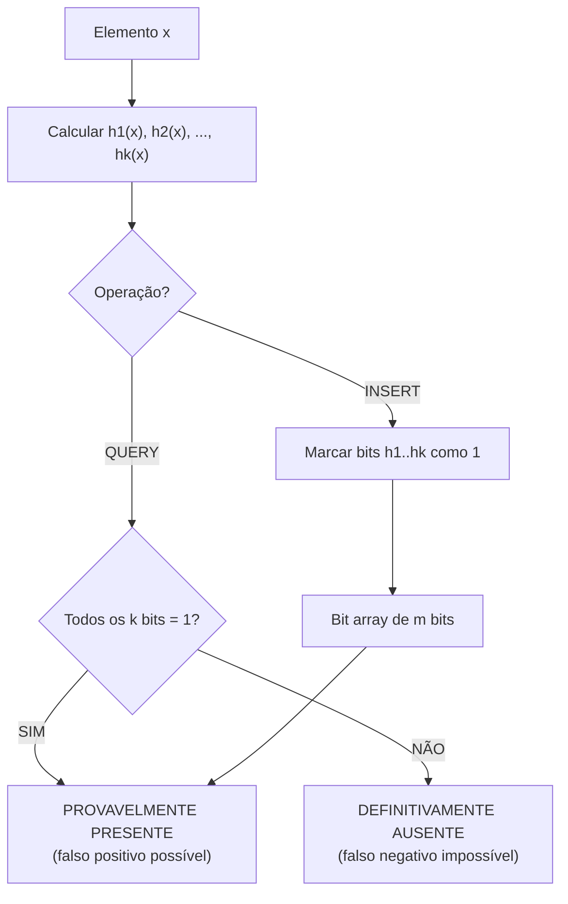
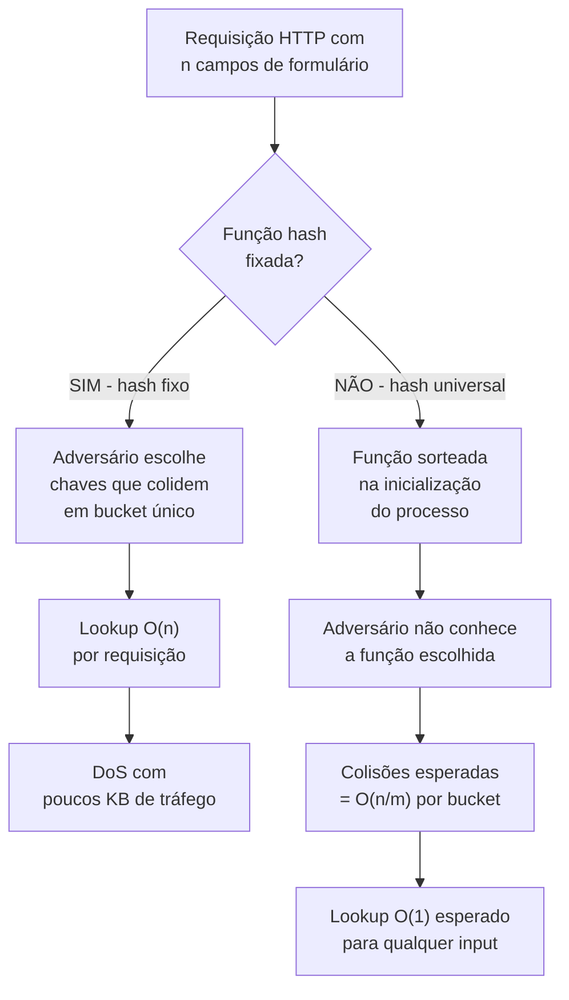
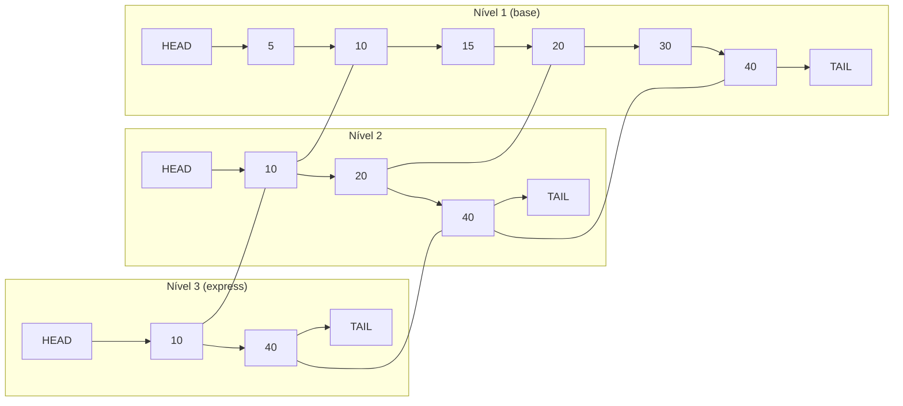
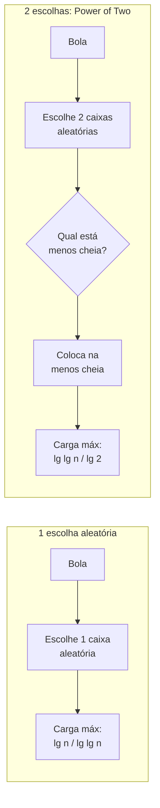
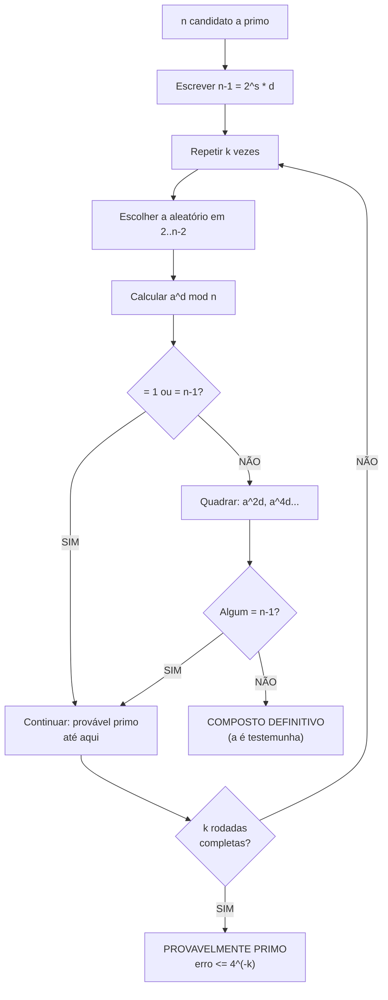
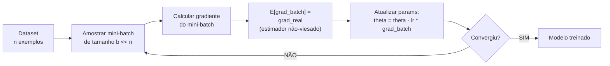

# O acaso na computação: estruturas e algoritmos aleatorizados

> [!abstract] TL;DR
> Jogar uma moeda no meio de um algoritmo parece loucura — mas é uma das ferramentas mais poderosas da computação. Aleatoriedade quebra o pior caso do adversário, produz estruturas de dados sublineares impossíveis de construir deterministicamente, e fundamenta desde filtros de banco de dados até geração de chaves RSA. Esta nota é o payoff aplicado de [[19 - Probabilidade discreta]] e [[20 - Variáveis aleatórias e esperança]]: cada estrutura aqui é um teorema probabilístico disfarçado de código.

---

## Por que randomizar?

Imagine um adversário que conhece o seu algoritmo. Se você usa quicksort com pivô sempre no primeiro elemento, ele constrói um array já ordenado e seu O(n²) está garantido. Se você usa uma tabela hash com função fixa, ele descobre quais chaves colidem e força O(n) em todas as buscas.

A solução é tirar o adversário do jogo: se o algoritmo toma decisões aleatórias, o adversário não consegue prever o pior caso — porque o pior caso muda a cada execução.

Há três motivações centrais para randomizar:

**1. Quebrar o pior caso determinístico.** Pivô aleatório no quicksort garante O(n log n) esperado mesmo com input adversarial. Função hash escolhida aleatoriamente de uma família universal garante O(1) esperado independente das chaves.

**2. Sublinearidade: fazer mais com menos.** Um Bloom filter com 10 bits por elemento verifica pertinência em O(k) — com falso positivo raro, mas sem usar memória proporcional ao dado real. Isso é impossível com estruturas determinísticas perfeitas.

**3. Simplicidade.** Uma skip list com níveis aleatórios substitui uma árvore AVL ou rubro-negra com implementação radicalmente mais simples — e mesma complexidade esperada.

> [!tip] O preço da aleatoriedade
> A aleatoriedade não é gratuita: você troca certeza por probabilidade. O contrato muda: em vez de "sempre correto em O(f(n))", você recebe "correto com prob ≥ 1 − ε" ou "O(f(n)) esperado". Saber quando cada garantia é aceitável é habilidade de engenheiro sênior.

---

## Quicksort randomizado: o pai de tudo

Antes de entrar nas estruturas especializadas, vale entender o exemplo mais famoso de aleatorização — que demonstra o argumento fundamental de maneira limpa.

O quicksort determinístico com pivô fixo tem pior caso O(n²) em arrays ordenados (ou quase-ordenados). Um adversário que sabe que você usa o primeiro elemento como pivô pode explorar isso trivialmente.

A correção é trivial: **escolha o pivô uniformemente ao acaso** entre os elementos do subarray atual.

### A análise: número esperado de comparações

Numere os elementos em ordem crescente como x₁ < x₂ < … < xₙ. Defina a variável aleatória Xᵢⱼ = 1 se xᵢ e xⱼ são comparados durante a execução, e 0 caso contrário.

O número total de comparações é C = ∑∑ Xᵢⱼ (somando sobre todos os pares i < j).

Pela linearidade da esperança (de [[20 - Variáveis aleatórias e esperança]]):

$$E[C] = \sum_{i < j} E[X_{ij}] = \sum_{i < j} \Pr[x_i \text{ e } x_j \text{ são comparados}]$$

Agora o argumento chave: xᵢ e xⱼ são comparados se e somente se um deles é escolhido como pivô **antes** que qualquer elemento em {xᵢ, xᵢ₊₁, …, xⱼ} seja escolhido como pivô. Quando um elemento fora desse conjunto é pivô primeiro, xᵢ e xⱼ vão para subproblemas separados e nunca se comparam.

Há j − i + 1 elementos no conjunto {xᵢ, …, xⱼ}, e cada um tem igual probabilidade de ser o primeiro pivô escolhido. Então:

$$\Pr[x_i \text{ e } x_j \text{ são comparados}] = \frac{2}{j - i + 1}$$

Portanto:

$$E[C] = \sum_{i=1}^{n} \sum_{j=i+1}^{n} \frac{2}{j-i+1} = 2 \sum_{i=1}^{n} \sum_{k=2}^{n-i+1} \frac{1}{k} \leq 2n \sum_{k=1}^{n} \frac{1}{k} = 2n H_n \approx 2n \ln n$$

onde H_n ≈ ln n é o n-ésimo número harmônico — de [[19 - Probabilidade discreta]].

O resultado: **E[comparações] ≈ 2n ln n ≈ 1,386 · n log₂n**. O quicksort randomizado é O(n log n) esperado para qualquer input, mesmo adversarial.

> [!tip] Por que isso é Las Vegas, não Monte Carlo?
> O quicksort randomizado **sempre** produz o array ordenado corretamente. A aleatoriedade afeta apenas o tempo, não o resultado. Tempo aleatório + resultado sempre correto = Las Vegas.

---

## Monte Carlo × Las Vegas

Existem dois "sabores" de algoritmos aleatorizados, com contratos fundamentalmente diferentes.

| Dimensão | Monte Carlo | Las Vegas |
|---|---|---|
| **Resultado** | Pode errar com prob pequena ε | Sempre correto |
| **Tempo** | Determinístico (fixo ou limitado) | Aleatório (esperado bom) |
| **Reduzir erro** | Repetir k vezes → erro cai para εᵏ | Não há erro a reduzir |
| **Exemplo clássico** | Miller-Rabin (primalidade) | Quicksort randomizado |
| **Outro exemplo** | Teste de identidade de polinômios (Schwartz-Zippel) | Hashing universal (sem erro, só tempo) |
| **Uso típico** | Quando verificação é cara e erro raro é OK | Quando corretude é obrigatória |

A ideia de "repetir e votar" é central nos algoritmos Monte Carlo. Se cada rodada erra com prob ε ≤ 1/2, após k rodadas independentes a probabilidade de todas errarem é ε^k. Com k = 40 e ε = 1/4 (Miller-Rabin), o erro é menor que 4^(−40) ≈ 10^(−24) — abaixo da taxa de falha do hardware.

> [!example] Intuição da votação
> Pense em k testemunhas independentes. Cada uma mente com prob ε. A chance de todas mentirem na mesma direção cai exponencialmente com k. Por isso repetição transforma "provavelmente correto" em "praticamente certo".

---

## Bloom Filter: pertinência sublinear

O Bloom filter é a estrutura de dados que melhor ilustra a beleza da troca probabilística. Ele responde "este elemento está no conjunto?" usando memória muito menor que o dado real, ao custo de aceitar falsos positivos com probabilidade controlada.

### Como funciona

Um Bloom filter é um array de **m bits** inicializado em zero, mais **k funções hash independentes** h₁, h₂, …, hₖ, cada uma mapeando qualquer elemento para um índice em {0, …, m−1}.

**Inserção de um elemento x:**
- Para cada função hᵢ, calcule hᵢ(x) e marque o bit naquela posição como 1.

**Consulta de um elemento x:**
- Para cada função hᵢ, verifique o bit em hᵢ(x).
- Se TODOS os k bits estão em 1 → responde "pode estar presente".
- Se QUALQUER bit está em 0 → responde "definitivamente ausente".

O diagrama abaixo mostra o fluxo completo:

**Leitura do diagrama:** O caminho de INSERT sempre marca bits; nunca os apaga. Por isso um falso negativo é impossível — se x foi inserido, seus k bits estão marcados. Mas outro elemento y pode ter acidentalmente marcado os mesmos k bits → falso positivo.

### A matemática do falso positivo

Após inserir n elementos com k funções hash num array de m bits, a probabilidade de falso positivo é aproximadamente:

$$P_{FP} \approx \left(1 - e^{-kn/m}\right)^k$$

O valor ótimo de k que minimiza essa probabilidade é:

$$k_{ótimo} = \frac{m}{n} \ln 2 \approx 0{,}693 \cdot \frac{m}{n}$$

Com k ótimo, a probabilidade de falso positivo fica:

$$P_{FP} \approx \left(\frac{1}{2}\right)^k \approx 0{,}6185^{m/n}$$

Isso fecha diretamente com [[20 - Variáveis aleatórias e esperança]]: o número esperado de bits setados após n inserções é m · (1 − e^(−kn/m)), e a derivação usa a aproximação (1 − 1/m)^(kn) ≈ e^(−kn/m) da definição de e.

### Trade-off prático: m, k, n

| Bits por elemento (m/n) | k ótimo | P(falso positivo) |
|---|---|---|
| 5 | 3 | ≈ 9,2% |
| 10 | 7 | ≈ 0,82% |
| 15 | 10 | ≈ 0,07% |
| 20 | 14 | ≈ 0,006% |

Com 10 bits por elemento você tem menos de 1% de falso positivo — armazenando apenas 10 bits em vez de dezenas ou centenas de bytes por entrada.

### Usos reais

- **Apache Cassandra e Google Bigtable**: antes de ler um SSTable do disco, consultam um Bloom filter para saber se a chave pode estar lá. Evita I/O caro para a maioria das chaves ausentes.
- **Navegadores (Chrome Safe Browsing)**: mantém um Bloom filter local de URLs maliciosas. Só consulta o servidor quando o filtro diz "pode ser malicioso" — falso positivo raro gera uma consulta extra desnecessária; falso negativo seria catastrófico.
- **Deduplicação de streams**: sistemas de streaming verificam se um evento já foi processado sem guardar todo o histórico.

Para mais contexto de implementação, veja [[03-Dominios/Ciência/Estruturas de Dados/12 - Estruturas especializadas]].

---

## Hashing Universal: neutralizando o adversário

Por que uma função hash fixa é perigosa? Porque um adversário que conhece sua função pode construir um conjunto de chaves que todas caem no mesmo bucket — transformando O(1) em O(n).

Isso não é teórico. Em 2003 e 2011 foram divulgados ataques **Hash-DoS** contra servidores web (PHP, Java, Python, Ruby, ASP.NET): um atacante enviava formulários com campos cuidadosamente escolhidos para colidir na tabela hash do servidor, causando DoS com poucos kilobytes de tráfego.

### A solução: famílias universais de hash

Uma família H de funções hash h: U → {0, …, m−1} é **universal** se para quaisquer chaves distintas x, y ∈ U:

$$\Pr_{h \in H}[h(x) = h(y)] \leq \frac{1}{m}$$

Ou seja: escolhendo h aleatoriamente de H, a probabilidade de colisão entre quaisquer duas chaves fixas é no máximo 1/m — o mesmo que hashing perfeito.

A construção clássica usa aritmética modular com primo p > |U|: escolha a, b aleatoriamente em {0, …, p−1} com a ≠ 0, e defina:

$$h_{a,b}(x) = ((ax + b) \bmod p) \bmod m$$

Essa família é universal. A prova usa o fato de que para x ≠ y, o par (ax + b mod p, ay + b mod p) é uniformemente distribuído — conexão direta com [[15 - Aritmética modular e Fermat-Euler]] e a estrutura de grupo de Z_p.

Com hashing universal, o número esperado de colisões para qualquer conjunto de n chaves é O(n/m). Se m = Θ(n), o tempo esperado por operação é O(1) — e isso vale para qualquer conjunto de chaves, mesmo adversarial.

O fluxo de defesa é assim:

**Leitura do diagrama:** O hash fixo cria uma superfície de ataque determinística. O hash universal fecha essa superfície ao tornar a função imprevisível — o adversário precisaria quebrar o gerador de números pseudoaleatórios do processo para explorar a estrutura.

> [!warning] Hash-DoS ainda acontece
> Python adicionou hash randomization por padrão em 3.3 (PYTHONHASHSEED). Java usa randomização desde 2012. Ruby e Perl também corrigiram. Se você usa uma linguagem sem essa proteção — ou desabilita por "desempenho" — está vulnerável.

---

## Skip List: árvore de busca com moedas

Uma skip list é uma lista encadeada com "express lanes" adicionadas probabilisticamente. A ideia é simples: ao inserir um elemento, jogue uma moeda; se der cara, promova o elemento para o nível acima. Repita até dar coroa ou atingir o nível máximo.

O resultado é uma estrutura com múltiplas camadas: a camada mais baixa tem todos os elementos; camadas superiores são subconjuntos cada vez mais esparsos que permitem "pular" pedaços da lista.

**Leitura do diagrama:** Para buscar 30, começa no nível 3: pula de HEAD para 10, depois para 40 (40 > 30, então desce). No nível 2: avança de 10 para 20, tenta 40 (40 > 30, desce). No nível 1: avança de 20 para 30. Encontrado em O(log n) passos esperados.

### A análise probabilística

A altura esperada de um nó é geométrica com parâmetro 1/2: o nó está no nível i com prob (1/2)^i. O número esperado de níveis é E[altura] = O(log n) — diretamente de [[20 - Variáveis aleatórias e esperança]].

A análise de busca usa o argumento inverso: contando quantos "subidas" acontecem ao rastrear o caminho de busca de trás para frente. O número esperado de passos no nível i antes de subir é ≤ 2 (geométrica com p = 1/2). Com O(log n) níveis, o custo total de busca é O(log n) esperado.

Para inserção: encontre a posição em O(log n), insira na base, lance moedas para promover. Sem rotações. Sem rebalanceamento. Sem casos especiais.

**Por que isso é melhor na prática do que AVL/rubro-negra?**

| Critério | Árvore AVL / Rubro-Negra | Skip List |
|---|---|---|
| Busca | O(log n) pior caso | O(log n) esperado |
| Inserção | O(log n) + rotações | O(log n) + promoções |
| Implementação | Dezenas de casos | ~50 linhas |
| Concorrência | Difícil (rotações são não-locais) | Mais fácil (locks por nó) |
| Cache locality | Razoável | Boa (lista contígua na base) |

O **sorted set do Redis** usa skip list como estrutura primária. A escolha foi documentada por Salvatore Sanfilippo: skip lists são mais fáceis de implementar corretamente em C, têm comportamento de cache comparável e o overhead de memória é aceitável. Para implementação de estruturas similares, veja [[03-Dominios/Ciência/Estruturas de Dados/12 - Estruturas especializadas]].

---

## Power of Two Choices: load balancing com mágica logarítmica

Suponha que você tem n bolas e n caixas, e joga cada bola em uma caixa uniformemente ao acaso. Qual é a carga máxima esperada?

Com **uma escolha aleatória**: a caixa mais cheia terá ≈ ln n / ln ln n bolas — resultado clássico de [[19 - Probabilidade discreta]]. Para n = 10.000, isso é cerca de 3,3.

Agora mude a regra: para cada bola, escolha **2 caixas aleatórias** e coloque na menos cheia das duas.

Com **duas escolhas aleatórias**: a carga máxima esperada cai para ≈ ln ln n / ln 2 — uma redução exponencial.

Para n = 10.000: ln ln 10.000 / ln 2 ≈ 4,16 / 0,693 ≈ 6. A carga máxima caiu de ~3.3 para ~6? Espera — na verdade a comparação é com n muito maior onde a diferença fica dramática, e o ponto é a escala assintótica: de Θ(log n / log log n) para Θ(log log n).

**Leitura do diagrama:** A única diferença é escolher 2 candidatos e tomar o mínimo. O ganho assintótico é exponencial: de log n para log log n.

### Por que isso funciona?

A intuição é que o segundo candidato quebra a concentração: é muito improvável que ambos os candidatos sejam sobrecarregados ao mesmo tempo. A análise formal usa uma técnica de potential function que mostra que a distribuição de carga se torna exponencialmente concentrada perto da média.

### Onde aparece na prática

- **Nginx e HAProxy** usam variantes da heurística "escolha o menos ocupado de 2" em alguns modos de balanceamento.
- **Apache Cassandra**: ao escolher réplicas para write, considera carga dos candidatos, não apenas posição no token ring.
- **NGINX Plus least_conn**: aproximação prática do power of two choices para conexões HTTP.
- **Sistemas de filas distribuídas**: usado em designs de consistent hashing com lookup de load.

> [!info] Por que não 3 ou 4 escolhas?
> Porque o ganho de 2 para 3 escolhas é pequeno comparado ao custo extra de comunicação. De 1 para 2 é onde acontece o "magic leap" — o ganho é exponencial. De 2 para 3 é apenas constante. O princípio geral: a segunda amostra é onde mora a mágica.

---

## Miller-Rabin: primeiros números sob suspeita

Como você prova que um número de 2048 bits é primo? Verificar todos os divisores até √n levaria tempo astronômico. O algoritmo de Miller-Rabin resolve isso com aleatoriedade.

A base teórica vem de [[14 - Teoria dos números - divisibilidade e primos]] e [[15 - Aritmética modular e Fermat-Euler]]: pelo Pequeno Teorema de Fermat, se p é primo e gcd(a, p) = 1, então:

$$a^{p-1} \equiv 1 \pmod{p}$$

Se n não satisfaz essa congruência para algum a, n é composto. Mas o contrário não é garantido — existem os números de Carmichael que passam no teste de Fermat mas são compostos.

Miller-Rabin refina isso. Escreva n − 1 = 2^s · d com d ímpar. Para uma testemunha aleatória a, n é **provavelmente primo** se:

$$a^d \equiv 1 \pmod{n} \quad \text{ou} \quad a^{2^r d} \equiv -1 \pmod{n} \text{ para algum } 0 \leq r < s$$

Se nenhuma das condições vale, a é uma **testemunha de composição** — prova que n é composto.

A propriedade crucial: se n é composto, pelo menos 3/4 dos valores de a em {2, …, n−2} são testemunhas de composição. Então:

- Com k testemunhas aleatórias, a probabilidade de n ser composto e passar em todas as k rodadas é ≤ (1/4)^k = 4^(−k).
- Com k = 40: prob de erro ≤ 4^(−40) ≈ 10^(−24).

Esse é um algoritmo **Monte Carlo** clássico: tempo O(k · log²n) fixo, resposta pode errar mas com probabilidade exponencialmente pequena.

**Leitura do diagrama:** Cada rodada independente reduz o erro por fator 1/4. Após k rodadas, o erro é 4^(−k). Um resultado "composto definitivo" em qualquer rodada é irrevogável.

**Na prática:** OpenSSL usa Miller-Rabin para gerar primos RSA. Python `sympy.isprime` usa uma versão determinística com testemunhas fixas até certos limites, e Miller-Rabin probabilístico para números maiores. O protocolo TLS depende disso toda vez que uma conexão HTTPS é estabelecida.

---

## Reservoir Sampling: amostra uniforme do infinito

Você tem um stream de elementos chegando um a um. Não sabe quantos elementos virão. Quer manter uma amostra de exatamente k elementos tal que, ao fim, qualquer subconjunto de k elementos tenha igual probabilidade de ser a amostra. Como fazer isso com memória O(k)?

O algoritmo de reservoir sampling de Vitter resolve isso:

1. Armazene os primeiros k elementos diretamente (o "reservoir").
2. Para o i-ésimo elemento (i > k): gere r uniformemente em {1, …, i}. Se r ≤ k, substitua o r-ésimo elemento do reservoir pelo novo elemento; caso contrário, descarte.

**Prova de uniformidade:** Por indução. Após processar i elementos, cada um dos i elementos tem prob k/i de estar no reservoir.

Caso base (i = k): todos estão no reservoir, prob = k/k = 1. ✓

Passo indutivo: suponha que após i−1 elementos, cada um tem prob k/(i−1). O i-ésimo elemento é incluído com prob k/i. Um elemento já no reservoir sobrevive se: o novo elemento é incluído E não é escolhido para substituí-lo, ou o novo não é incluído:

$$P(\text{sobrevive}) = \frac{k}{i} \cdot \frac{k-1}{k} + \frac{i-k}{i} = \frac{k-1}{i} + \frac{i-k}{i} = \frac{i-1}{i}$$

Então a prob de um elemento antigo estar no reservoir após i passos é:

$$\frac{k}{i-1} \cdot \frac{i-1}{i} = \frac{k}{i} \quad \checkmark$$

> [!example] Onde isso aparece
> Sistemas de log sampling como o do Apache Spark e Flink usam reservoir sampling para amostrar eventos de um stream infinito sem guardar todo o histórico. É também a base de algoritmos de amostragem em bancos de dados colunar (DuckDB, BigQuery internamente).

---

## Aleatoriedade como fundamento do ML

Não seria justo encerrar sem mencionar o elefante na sala: o aprendizado de máquina moderno é, em grande parte, estatística aleatorizada aplicada.

**Gradiente descendente estocástico (SGD):** em vez de calcular o gradiente sobre todos os n exemplos (caro), escolha um mini-batch aleatório. O gradiente do mini-batch é um estimador não-viesado do gradiente real — resultado direto de [[20 - Variáveis aleatórias e esperança]]. A convergência depende de E[gradiente_stoc] = gradiente_real.

**Máxima verossimilhança:** encontrar os parâmetros θ que maximizam P(dados | θ). O processo é determinístico matematicamente, mas os dados de treinamento são vistos como amostras aleatórias de uma distribuição desconhecida.

**Dropout em redes neurais:** durante o treinamento, cada neurônio é desativado com prob p. Isso é equivalente a treinar um ensemble exponencial de redes menores — aleatoriedade como regularização.

**Inferência Bayesiana e MCMC:** amostrar da posterior P(θ | dados) ∝ P(dados | θ) · P(θ) quando ela não tem forma fechada. Metropolis-Hastings é um caminho aleatório convergindo para a distribuição alvo — probabilidade discreta e cadeias de Markov (conecta com [[19 - Probabilidade discreta]]).

O diagrama abaixo mostra como a aleatoriedade do SGD flui no treinamento:

**Leitura do diagrama:** O loop interno reamostral — cada iteração vê um subconjunto aleatório diferente. O fato de E[gradiente_batch] = gradiente_real (da teoria de amostragem) garante que o processo converge para um mínimo, com a variância do estimador controlando a oscilação em torno dele.

> [!note] A unificação
> Estruturas aleatorizadas (Bloom, skip list, hashing universal) usam aleatoriedade para garantias de desempenho. ML usa aleatoriedade para aprender de dados. Em ambos, o teorema central é o mesmo: esperança, variância e concentração de medida determinam o comportamento do sistema.

---

## A tabela-mestra: estruturas e algoritmos aleatorizados

Esta tabela sintetiza o mapa completo do tema:

| Estrutura / Algoritmo | Ideia probabilística central | Garantia | Uso real |
|---|---|---|---|
| Quicksort randomizado | Pivô uniforme → E[comparações] = 2n ln n | O(n log n) esperado | Arrays em quase toda linguagem |
| Hashing universal | Família universal → P[colisão] ≤ 1/m | O(1) esperado, adversarial-safe | Python dicts (PYTHONHASHSEED), Java HashMap |
| Bloom filter | Bits independentes → P[FP] = (1−e^(−kn/m))^k | Sem FN; FP controlado | Cassandra, Bigtable, Chrome Safe Browsing |
| Skip list | Promoção geométrica → altura O(log n) | O(log n) esperado busca/inserção | Redis sorted set |
| Power of Two Choices | Min de 2 amostras → carga ln ln n / ln 2 | Balanceamento exponencialmente melhor | Balanceadores de carga |
| Miller-Rabin | 3/4 testemunhas de composição → erro ≤ 4^(−k) | Monte Carlo; k=40 → erro ≈ 10^(−24) | OpenSSL (geração de primos RSA) |
| Reservoir sampling | P[elemento i no reservoir] = k/i | Amostra k-uniforme de stream | Spark, Flink, DuckDB sampling |
| SGD (ML) | Mini-batch = estimador não-viesado do gradiente | Convergência probabilística | PyTorch, TensorFlow, todo treinamento de redes |

---

> [!summary] Resumo em uma linha
> Aleatoriedade transforma problemas com pior caso patológico em problemas com esperança ótima — e o segredo está em escolher o momento certo de jogar a moeda: no pivô, na função hash, na promoção de nível, na escolha do servidor.

---

## Em entrevista

Em entrevistas de nível sênior, o tema de aleatoriedade aparece em perguntas de system design ("como você evitaria que um hash table fosse atacado?"), em discussões de estruturas de dados ("por que o Redis usa skip list em vez de árvore AVL?") e em perguntas de probabilidade aplicada ("como você amostraria uniformemente de um stream?").

Os pontos mais cobrados: saber a diferença Monte Carlo × Las Vegas; explicar o trade-off do Bloom filter (m, k, n e a fórmula); descrever reservoir sampling com a prova de uniformidade; e conectar hashing universal com segurança de sistemas.

*Monte Carlo algorithm: fixed time, may err with small probability; repeat to reduce error exponentially.*
*Las Vegas algorithm: always correct, randomized running time; expected performance is the guarantee.*
*Universal hash family: a set of hash functions where any two keys collide with probability at most 1/m under a randomly chosen function.*
*Bloom filter: a space-efficient probabilistic data structure using k hash functions and m bits; no false negatives, controlled false positive rate.*
*False positive rate: the probability that a Bloom filter incorrectly reports an element as present.*
*Skip list: a probabilistic data structure with multiple linked layers; O(log n) expected search without rotations.*
*Power of two choices: a load balancing strategy that picks the least-loaded of two random candidates; reduces max load from log n to log log n.*
*Miller-Rabin primality test: a Monte Carlo test where each round eliminates at least 3/4 of composite witnesses.*
*Reservoir sampling: an algorithm to maintain a uniform k-sample from a stream of unknown size in O(k) memory.*
*Hash-DoS: a denial-of-service attack exploiting deterministic hash functions by crafting keys that all collide.*

| Termo PT | Termo EN |
|---|---|
| Algoritmo Monte Carlo | Monte Carlo algorithm |
| Algoritmo Las Vegas | Las Vegas algorithm |
| Família hash universal | Universal hash family |
| Filtro de Bloom | Bloom filter |
| Taxa de falso positivo | False positive rate |
| Falso negativo | False negative |
| Skip list / lista com saltos | Skip list |
| Poder de duas escolhas | Power of two choices |
| Teste de primalidade Miller-Rabin | Miller-Rabin primality test |
| Amostragem por reservatório | Reservoir sampling |
| Testemunha de composição | Compositeness witness |
| Hashing adversarial / Hash-DoS | Hash-DoS / algorithmic complexity attack |
| Número esperado de colisões | Expected number of collisions |
| Gradiente descendente estocástico | Stochastic gradient descent (SGD) |
| Nível de promoção (skip list) | Promotion level (skip list) |
| Array de bits | Bit array |
| Balanceamento de carga | Load balancing |
| Carga máxima esperada | Expected maximum load |
| Prova por indução probabilística | Probabilistic induction proof |
| Concentração de medida | Measure concentration |

---

> [!info] Lastro
> 1. **Mitzenmacher, M. e Upfal, E.** *Probability and Computing: Randomization and Probabilistic Techniques in Algorithms and Data Analysis* (2ª ed.). Cambridge University Press, 2017. ISBN 9781107154889. Referência principal para Bloom filters (cap. 5), power of two choices (cap. 5), e análise de skip lists.
> 2. **Motwani, R. e Raghavan, P.** *Randomized Algorithms*. Cambridge University Press, 1995. ISBN 9780521474658. Texto fundacional; cobre Las Vegas × Monte Carlo, hashing universal, e análise de quicksort randomizado.
> 3. **Bloom, B. H.** "Space/Time Trade-offs in Hash Coding with Allowable Errors." *Communications of the ACM*, v. 13, n. 7, pp. 422–426, 1970. O artigo original do Bloom filter. DOI: 10.1145/362686.362692.
> 4. **Pugh, W.** "Skip Lists: A Probabilistic Alternative to Balanced Trees." *Communications of the ACM*, v. 33, n. 6, pp. 668–676, jun. 1990. O artigo original da skip list. DOI: 10.1145/78973.78977.
> 5. **Carter, J. L. e Wegman, M. N.** "Universal Classes of Hash Functions." *Journal of Computer and System Sciences*, v. 18, n. 2, pp. 143–154, 1979. Artigo fundacional de hashing universal; base teórica da defesa contra Hash-DoS.
