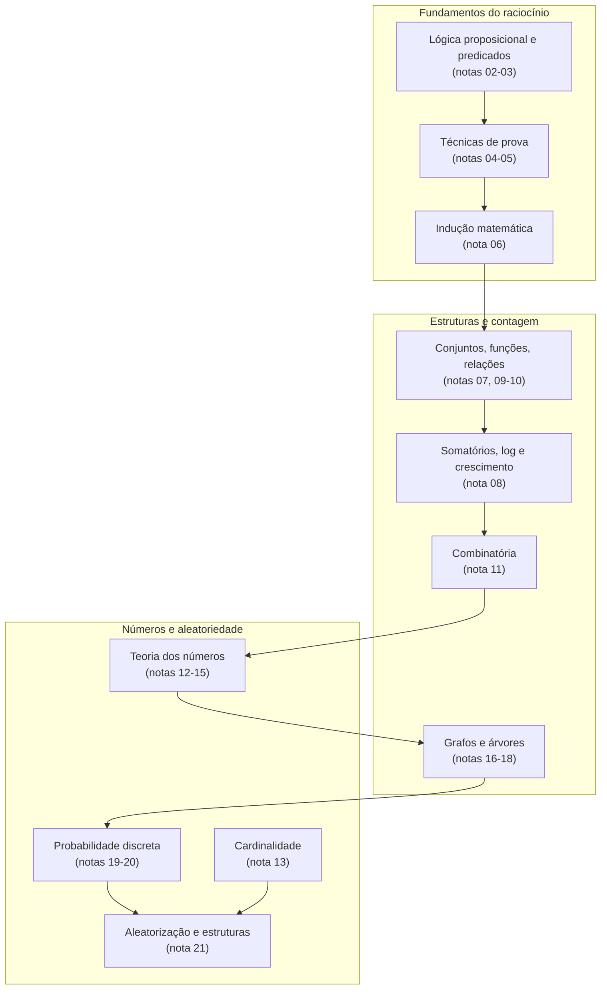
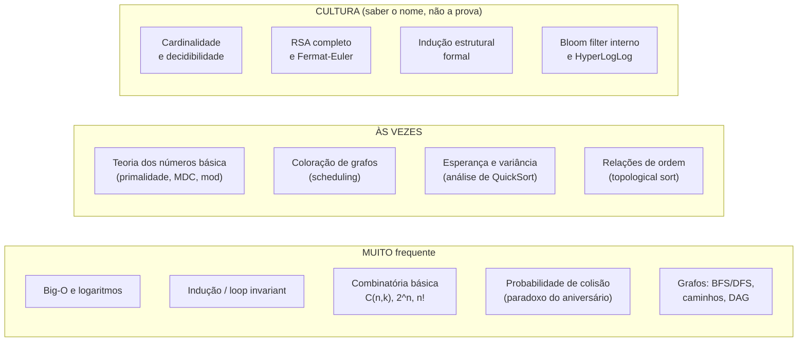
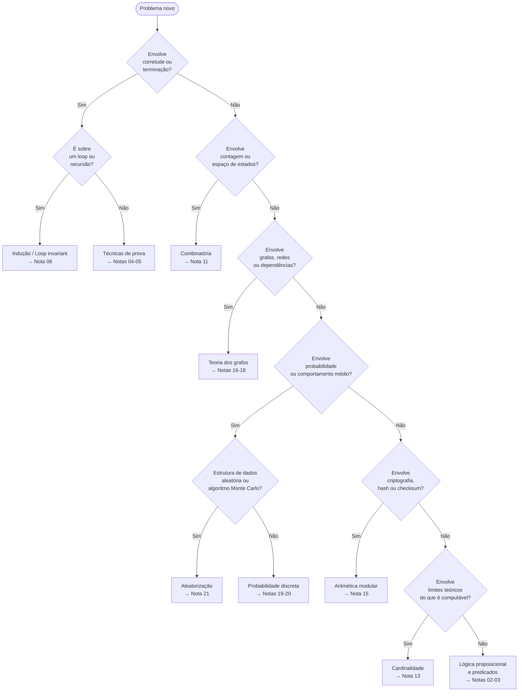

# A matemática na vida do dev

> [!abstract] TL;DR
> Matemática para computação não é decoreba de fórmulas. É a linguagem que permite **raciocinar sobre corretude, eficiência e possibilidade**. Lógica molda condições. Indução prova loops. Combinatória dimensiona o espaço de estados. Probabilidade estima comportamento médio. Teoria dos grafos mapeia dependências. Cada bloco deste galho te dá uma ferramenta que você já usa — só não sabia o nome.

---

## Por que matemática importa para quem escreve código

Existe uma falácia popular: "na prática, ninguém usa matemática".

A frase é errada pela metade. Ninguém escreve prova formal no dia a dia. Mas todo dev que raciocina sobre por que um loop termina, por que um hash distribui bem, por que uma query lenta fica lenta — está aplicando matemática. A diferença é se você faz isso com ou sem vocabulário.

Vocabulário importa porque **permite comunicar com precisão e raciocinar sem ambiguidade**. Um dev sem vocabulário matemático diz "parece que dá certo". Um dev com vocabulário diz "a invariante de loop garante que isso converge em O(n log n)". O segundo convence o time e passa na code review.

---

## A torre completa: o que cada bloco te dá

Percorra o galho como um mapa de ferramentas. Cada nó entrega algo concreto.

*Leitura do diagrama*: os blocos fluem de baixo para cima em abstração. Lógica é o solo. Provas são a técnica de construção. Indução conecta provas a algoritmos. A partir daí, os três ramos — estruturas/contagem, números, grafos/probabilidade — se desenvolvem em paralelo e convergem em aleatorização.

---

### Bloco 1 — Lógica (notas 02-03)

**O que te dá**: linguagem exata para escrever condições, pré/pós-condições e invariantes.

Toda instrução `if`, toda cláusula `WHERE` de SQL, toda assertion em teste unitário é lógica proposicional disfarçada de código.

Lógica de predicados vai além: ∀ e ∃ aparecem explicitamente em SQL (`FOR ALL`, `EXISTS`) e em especificações de sistemas. Sem saber o que ∀x P(x) significa, você não consegue distinguir um bug de uma spec ambígua.

### Bloco 2 — Técnicas de prova (notas 04-05)

**O que te dá**: estratégia para convencer você mesmo (e outros) de que algo é correto.

Prova direta → seguir o caminho feliz.
Contrapositiva → "se o output é errado, o input era inválido".
Contradição → "se esse bug não existisse, chegaríamos a um absurdo".
Contraexemplo → uma única entrada que destrói uma afirmação universal.

Você usa isso em revisão de código e em debugging. Formalizá-lo só torna o processo mais rápido.

### Bloco 3 — Indução matemática (nota 06)

**O que te dá**: a ferramenta canônica para provar corretude de loops e recursão.

Loop invariant é indução com roupa de engenheiro. A base é o estado antes da primeira iteração. O passo indutivo é a manutenção a cada volta. A conclusão é o que o loop garante quando termina.

Veja [[06 - Indução matemática]] para a formalização e os exemplos clássicos.

### Bloco 4 — Somatórios, logaritmos e crescimento (nota 08)

**O que te dá**: capacidade de calcular e comparar a complexidade de algoritmos de verdade.

Sem entender que ∑ i de 1 a n = n(n+1)/2, você não sabe por que bubble sort é O(n²). Sem entender que log₂(n) é o inverso de 2ⁿ, você não sabe por que busca binária é "rápida" e busca exaustiva é "lenta" em qualquer sentido rigoroso.

Veja [[08 - Somatórios, logaritmos e crescimento]] para as séries fundamentais e as regras de Big-O derivadas delas.

### Bloco 5 — Conjuntos, funções e relações (notas 07, 09-10)

**O que te dá**: o vocabulário de tipos, estruturas de dados e ordenação.

Conjuntos → sets, dicionários, deduplicação.
Funções injetoras/sobrejetoras/bijetoras → qual hash pode ter colisão, qual mapeamento é reversível.
Relações de equivalência → classes de equivalência, partição de casos de teste, tabelas de banco normalizadas.
Ordem parcial → ordenação topológica de dependências (o `topo sort` que roda em todo sistema de build).

### Bloco 6 — Combinatória (nota 11)

**O que te dá**: dimensionar espaços de possibilidades antes de escolher um algoritmo.

Quantos casos de teste cobrem todas as combinações de n flags booleanos? 2ⁿ. Por que backtracking explode? Porque o espaço de estados é n! ou nᵏ. Por que probabilistic testing funciona? Porque um espaço de 10⁶⁰ possibilidades torna busca exaustiva impossível.

Veja [[11 - Combinatória - a arte de contar]] para regra do produto, permutação, combinação e o princípio da inclusão-exclusão.

### Bloco 7 — Cardinalidade (nota 13)

**O que te dá**: entender o que é infinito contável versus incontável — e por que isso importa para decidibilidade.

Cardinalidade é a ponte entre este galho e a [[03-Dominios/Ciência/Teoria da Computação/index|Teoria da Computação]]. O argumento diagonal de Cantor aparece na prova de que o problema da parada é indecidível. Não é cultura geral: é a base filosófica de por que existem problemas que nenhum software pode resolver.

Veja [[13 - Cardinalidade - contável e incontável]].

### Bloco 8 — Aritmética modular e teoria dos números (notas 12-15)

**O que te dá**: os fundamentos de criptografia, hashing, checksums e deteção de erros.

Aritmética modular é o coração de RSA, Diffie-Hellman e de qualquer função de hash que distribui bem. O Pequeno Teorema de Fermat fundamenta o teste de primalidade de Miller-Rabin. CRC e checksum de cartão de crédito são aritmética em corpos finitos GF(2ⁿ).

Veja [[15 - Aritmética modular e Fermat-Euler]].

### Bloco 9 — Grafos e árvores (notas 16-18)

**O que te dá**: modelagem de qualquer sistema de relacionamentos e dependências.

Redes sociais, mapas, sistemas de build, schemas de banco, pipelines de dados — todos são grafos. BFS/DFS, caminhos mínimos, árvores geradoras mínimas e coloração emergem de um único modelo matemático. Saber o modelo te diz qual algoritmo aplicar antes de abrir o editor.

Veja [[16 - Teoria dos grafos - o lado matemático]].

### Bloco 10 — Probabilidade e aleatorização (notas 19-21)

**O que te dá**: raciocinar sobre comportamento médio, colisões, filtros e algoritmos que "quase sempre" funcionam.

O paradoxo do aniversário explica por que colisões de hash aparecem mais cedo do que você espera. Esperança linear justifica o QuickSort randomizado. Bloom filters e HyperLogLog são probabilidade aplicada a estruturas de dados com garantias formais de erro.

Veja [[19 - Probabilidade discreta]] e [[21 - O acaso na computação - estruturas e algoritmos aleatorizados]].

---

## Cheat-sheet mestre 1 — técnicas de prova

Quando você precisa convencer alguém (ou a si mesmo) de que algo é verdade, qual arma usar?

| Técnica | Quando usar | Gatilho de reconhecimento |
|---|---|---|
| **Prova direta** | Demonstrar que P → Q seguindo os axiomas | "Se X tem propriedade A, então tem B" |
| **Contrapositiva** | Mais fácil negar o consequente do que afirmar o antecedente | "Se não tem B, então não pode ter A" |
| **Contradição** | Provar que algo não existe ou não pode ser | "Assuma que X existe — derivamos um absurdo" |
| **Indução simples** | Propriedade vale para todo n ≥ base | "Para todos os n naturais, P(n)" |
| **Indução forte** | Passo indutivo precisa de todas as hipóteses anteriores, não só de P(n) | Recursão com múltiplos casos base (Fibonacci, árvores) |
| **Indução estrutural** | Estrutura recursivamente definida (listas, árvores, expressões) | "Para toda árvore T..." |
| **Contraexemplo** | Refutar uma afirmação universal | "Para todo X, P(X) é verdade?" — achar um X onde não é |

*Leitura da tabela*: a coluna "gatilho" é o que você lê na afirmação e que aponta para a técnica certa. Memorize os gatilhos, não as definições.

---

## Cheat-sheet mestre 2 — ramo → conceito → CS → nota

O mapa completo do galho numa única tabela. Use como índice de revisão.

| Ramo | Conceito-chave | Onde aparece em CS | Nota do galho |
|---|---|---|---|
| **Lógica proposicional** | Conectivos, tabela-verdade, tautologia | Condições, SQL, assertions, SAT solvers | Notas 02-03 |
| **Lógica de predicados** | ∀ ∃, quantificadores aninhados | SQL EXISTS/FOR ALL, especificação formal, Prolog | Nota 03 |
| **Prova / dedução** | Prova direta, contradição, contrapositiva | Code review, corretude de algoritmos, invariantes | Notas 04-05 |
| **Indução matemática** | Base + passo + loop invariant | Prova de loops, recursão, corretude de sorts | [[06 - Indução matemática]] |
| **Somatórios e log** | Séries aritméticas/geométricas, log₂ | Big-O, análise de complexidade, altura de árvores | [[08 - Somatórios, logaritmos e crescimento]] |
| **Conjuntos e funções** | Injetora, sobrejetora, bijetora, relação | Tipos, hash, classes de equivalência, OOP | Notas 07, 09-10 |
| **Relações de ordem** | Parcial, total, ordem topológica | Topological sort, DAGs, normalização de banco | Nota 10 |
| **Combinatória** | Regra do produto, C(n,k), inclusão-exclusão | Análise de casos, espaço de estados, testing | [[11 - Combinatória - a arte de contar]] |
| **Cardinalidade** | Contável vs. incontável, diagonal de Cantor | Decidibilidade, o que software não pode resolver | [[13 - Cardinalidade - contável e incontável]] |
| **Teoria dos números** | Divisibilidade, MDC, congruência mod n, Fermat-Euler | RSA, hashing, CRC, checksum | [[15 - Aritmética modular e Fermat-Euler]] |
| **Grafos** | BFS/DFS, caminhos mínimos, árvores, coloração | Redes, build systems, mapas, scheduling | [[16 - Teoria dos grafos - o lado matemático]] |
| **Probabilidade discreta** | Esperança, variância, paradoxo do aniversário | QuickSort médio, hashing, testes A/B, ML | [[19 - Probabilidade discreta]] |
| **Aleatorização** | Bloom filter, HyperLogLog, skip list, Monte Carlo | Sistemas de alta escala, streaming, algoritmos randomizados | [[21 - O acaso na computação - estruturas e algoritmos aleatorizados]] |

*Leitura da tabela*: percorra por coluna. "Onde aparece em CS" é a ponte entre a teoria e o que você já encontrou no código. Se um conceito aparecer no seu trabalho e você não souber de onde vem, essa coluna te diz em qual nota buscar.

---

## O que realmente cai em entrevista

Vamos ser honestos sobre frequência.

*Leitura do diagrama*: a coluna "MUITO frequente" cobre ≥80% do que aparece em entrevistas de empresas top. "ÀS VEZES" aparece em empresas que gostam de sistemas distribuídos ou ML. "CULTURA" é o que te dá respeitabilidade em discussão técnica — saber o nome e o impacto, sem precisar reproduzir a prova completa de cabeça.

### A distinção que importa

Big-O sem saber log é como tentar escalar montanha sem saber que existe inclinação. Você recita O(n log n) mas não sabe por que é assim.

Grafos aparecem em quase toda entrevista de sistemas — de "desenhe a dependência de serviços" a "encontre o ciclo nesse grafo de chamadas".

Probabilidade é o diferencial. Poucas pessoas chegam em entrevista sabendo explicar por que um hash table com load factor 0.75 tem O(1) amortizado, ou por que birthday attack quebra MD5 com 2³² tentativas ao invés de 2⁶⁴.

---

## Armadilhas comuns

> [!warning] Os erros que derrotam devs bons
>
> **1. Confundir correlação com causalidade em análise de dados.**
> Dois eventos co-ocorrem não implica que um causa o outro. Isso vicia decisões de produto e destrói experimentos A/B.
>
> **2. Esquecer a base da indução.**
> A prova de que P(n) vale para todo n ≥ 1 é inválida se P(1) não foi verificado. É o bug mais sutil de provas de corretude de loops.
>
> **3. Achar que teste prova corretude.**
> Dijkstra: "Program testing can be used to show the presence of bugs, but never to show their absence." Testes encontram bugs; indução e verificação formal provam ausência.
>
> **4. Confundir independência com exclusão mútua.**
> Eventos independentes podem co-ocorrer. Eventos mutuamente exclusivos não podem co-ocorrer mas não são necessariamente independentes. Essa confusão gera probabilidades erradas em sistemas de monitoramento e alertas.
>
> **5. Reescrever Big-O sem base em somatórios.**
> "Esse loop é O(n²) porque tem dois fors aninhados" está errado quando os loops não iteram até n de forma independente. O raciocínio correto vem de contar o número de operações via somatório.
>
> **6. Tratar ∞ como um número.**
> Cardinalidade mostra que existem infinitos de tamanhos diferentes. Isso importa quando você raciocina sobre completude de conjuntos de dados ou sobre o que streams infinitos podem computar.

---

## Flowchart de diagnóstico: que matemática esse problema pede?

Quando você encontra um problema novo, use este fluxo para apontar o arsenal certo.

*Leitura do diagrama*: cada bifurcação é uma pergunta sobre a natureza do problema, não sobre a solução. O objetivo é chegar ao ramo antes de escrever código. Quando você chega a um nó terminal, sabe qual nota do galho revisar e qual ferramenta matemática mobilizar.

---

## Como discutir matemática em entrevista internacional

> [!tip] Registro técnico em inglês
> Em entrevistas de empresas internacionais, o vocabulário matemático em inglês é esperado — especialmente em System Design e Algorithm Design rounds.

Não é necessário saber fazer prova formal em inglês. É necessário nomear o conceito correto e articular a intuição.

Algumas situações frequentes:

- Ao analisar complexidade: *"The recurrence resolves to O(n log n) because each level of recursion does O(n) work and there are log n levels."*
- Ao justificar uma estrutura aleatória: *"A Bloom filter gives us O(1) lookups with a tunable false positive rate — no false negatives are possible by design."*
- Ao falar de hashing: *"Birthday paradox tells us we expect a collision after roughly √n insertions, so with a 32-bit hash space that's around 65,000 elements — which is why we need a 64-bit hash for large-scale systems."*
- Ao descrever grafos: *"This dependency graph is a DAG — we can topologically sort it to get a valid build order."*
- Ao defender corretude: *"The loop invariant here is that at the start of iteration k, the first k elements are sorted. Base case holds trivially, and the inductive step follows from the swap logic."*
- Ao falar de probabilidade: *"The expected number of comparisons in randomized QuickSort is O(n log n) — we can show this by linearity of expectation over indicator random variables."*

---

## Tabela de vocabulário PT/EN para entrevistas

| Português | English |
|---|---|
| Lógica proposicional | Propositional logic |
| Quantificador universal / existencial | Universal / existential quantifier |
| Prova por contradição | Proof by contradiction |
| Prova por contrapositiva | Proof by contrapositive |
| Indução matemática | Mathematical induction |
| Invariante de loop | Loop invariant |
| Somatório | Summation / series |
| Ordem de crescimento | Asymptotic growth / Big-O notation |
| Combinatória | Combinatorics |
| Permutação / Combinação | Permutation / Combination |
| Inclusão-exclusão | Inclusion-exclusion principle |
| Cardinalidade | Cardinality |
| Conjunto contável | Countable set |
| Aritmética modular | Modular arithmetic |
| Máximo divisor comum | Greatest common divisor (GCD) |
| Grafo dirigido acíclico | Directed acyclic graph (DAG) |
| Ordenação topológica | Topological sort |
| Coloração de grafos | Graph coloring |
| Esperança / Valor esperado | Expected value |
| Variância | Variance |
| Paradoxo do aniversário | Birthday paradox |
| Filtro de Bloom | Bloom filter |
| Algoritmo aleatorizado | Randomized algorithm |

---

## Rotas de estudo: por onde retomar

Este capstone fecha o galho, mas o galho não é um fim. É um pré-requisito para outros domínios.

**Se você quer ir para Teoria da Computação**: a porta de entrada é [[13 - Cardinalidade - contável e incontável]]. Cardinalidade → diagonal de Cantor → indecidibilidade → problema da parada.

**Se você quer aprofundar algoritmos**: a porta de entrada é [[08 - Somatórios, logaritmos e crescimento]] + [[06 - Indução matemática]]. Você precisa das duas para analisar algoritmos de dividir-e-conquistar.

**Se você quer entender criptografia moderna**: a porta de entrada é [[15 - Aritmética modular e Fermat-Euler]]. RSA, curvas elípticas e protocolos de acordo de chave dependem desse bloco.

**Se você quer entender sistemas de alta escala**: a porta de entrada é [[21 - O acaso na computação - estruturas e algoritmos aleatorizados]] + [[19 - Probabilidade discreta]]. Bloom filters, HyperLogLog, skip lists e consistent hashing todos emergem dali.

**Se você quer modelar sistemas complexos**: a porta de entrada é [[16 - Teoria dos grafos - o lado matemático]]. Dependências, redes, mapas e pipelines são instâncias de grafos.

---

## O que mudou depois de estudar este galho

Matemática para computação não muda o que você digita. Muda **como você pensa antes de digitar**.

Antes: "parece que funciona, vou testar".
Depois: "o invariante garante que funciona, o teste vai confirmar".

Antes: "esse algoritmo é lento, vou otimizar no olho".
Depois: "a análise diz que o gargalo é o somatório quadrático no inner loop; preciso reduzir a estrutura".

Antes: "colisões de hash são raras".
Depois: "colisões esperadas aparecem com √(|espaço|) elementos; para uma tabela de 2³²  entradas, isso é 65 mil — preciso de hash de 64 bits se minha base vai além disso".

A matemática deste galho não é um conjunto de truques. É um jeito de ver. E uma vez que você vê assim, é difícil voltar a não ver.

---

> [!summary] Resumo em uma linha
> Este galho te entrega a gramática do raciocínio computacional — lógica, prova, contagem, números, grafos e aleatoriedade — na forma da linguagem universal que conecta código, corretude e eficiência.

---

## Em entrevista

Matemática pura raramente é cobrada diretamente. O que aparece são os **efeitos colaterais**: saber analisar complexidade, justificar corretude, estimar probabilidades de colisão, modelar problemas como grafos.

Frases para usar:

- *"The time complexity follows from the recurrence relation — by the Master Theorem, this resolves to O(n log n)."*
- *"I can prove correctness here using a loop invariant: before each iteration, the prefix of length k is sorted."*
- *"Birthday paradox applies here — with n items in a space of size m, we expect a collision at roughly √m insertions."*
- *"This is a classic DAG scheduling problem — topological sort gives us a valid execution order in O(V + E)."*
- *"The expected number of comparisons in randomized QuickSort is O(n log n) — we can show that by linearity of expectation."*
- *"A Bloom filter is the right structure here: O(1) lookup, tunable false positive rate, zero false negatives."*
- *"We can model this dependency graph as a DAG and detect cycles in O(V + E) with DFS."*
- *"Modular exponentiation is the key — RSA encryption runs in O(k³) where k is the key size in bits."*
- *"The induction hypothesis here is that the recursive call returns the correct answer for inputs of size n-1."*
- *"This is an NP-complete problem — we can reduce 3-SAT to it, so we should look for approximation or heuristic approaches."*

| Português | English |
|---|---|
| Relação de recorrência | Recurrence relation |
| Teorema mestre | Master Theorem |
| Invariante de loop | Loop invariant |
| Paradoxo do aniversário | Birthday paradox |
| Espaço de estados | State space |
| Grafo acíclico dirigido | Directed acyclic graph |
| Ordenação topológica | Topological sort |
| Valor esperado | Expected value |
| Linearidade da esperança | Linearity of expectation |
| Filtro de Bloom | Bloom filter |
| Taxa de falso positivo | False positive rate |
| Expoenciação modular | Modular exponentiation |
| Hipótese de indução | Induction hypothesis |
| NP-completo | NP-complete |
| Redução polinomial | Polynomial-time reduction |
| Aproximação | Approximation algorithm |
| Variável aleatória indicadora | Indicator random variable |
| Função de hash perfeita | Perfect hash function |
| Espaço amostral | Sample space |
| Distribuição uniforme | Uniform distribution |
| Prova por contradição | Proof by contradiction |
| Corretude parcial / total | Partial / total correctness |

---

> [!info] Lastro — fontes verificadas
>
> **Kenneth H. Rosen** — *Discrete Mathematics and Its Applications*, 8ª ed., McGraw-Hill Education, 2019. ISBN 978-1-260-09199-1. O livro-texto canônico, cobrindo lógica, prova, combinatória, grafos e teoria dos números com exercícios extensos.
>
> **Eric Lehman, F. Thomson Leighton, Albert R. Meyer** — *Mathematics for Computer Science*, MIT 6.042J/6.1200J. Disponível gratuitamente em [https://people.csail.mit.edu/meyer/mcs.pdf](https://people.csail.mit.edu/meyer/mcs.pdf) e no MIT OpenCourseWare. A referência usada como espinha dorsal deste galho — rigorosa e orientada a CS.
>
> **Ronald L. Graham, Donald E. Knuth, Oren Patashnik** — *Concrete Mathematics: A Foundation for Computer Science*, 2ª ed., Addison-Wesley, 1994. ISBN 978-0-201-55802-9. Referência avançada para somatórios, funções geradoras e análise combinatória fina; base matemática do TAOCP de Knuth. Página do autor em [https://www-cs-faculty.stanford.edu/~knuth/gkp.html](https://www-cs-faculty.stanford.edu/~knuth/gkp.html).
>
> **MIT OpenCourseWare 6.042J** — curso completo com notas, exercícios e provas: [https://ocw.mit.edu/courses/6-042j-mathematics-for-computer-science-fall-2010/](https://ocw.mit.edu/courses/6-042j-mathematics-for-computer-science-fall-2010/). Versão 2024: [https://live.ocw.mit.edu/courses/6-1200j-mathematics-for-computer-science-spring-2024/](https://live.ocw.mit.edu/courses/6-1200j-mathematics-for-computer-science-spring-2024/).

---

*Linhas físicas: 536 | Diagramas: 5*
