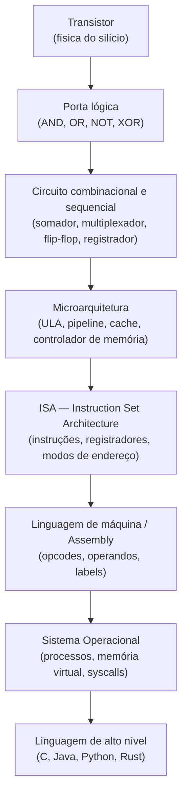
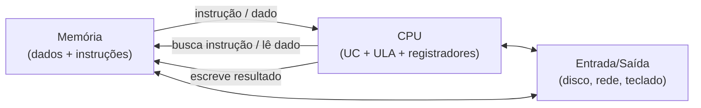
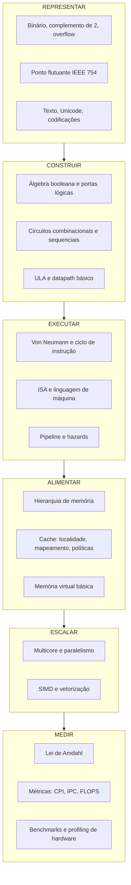
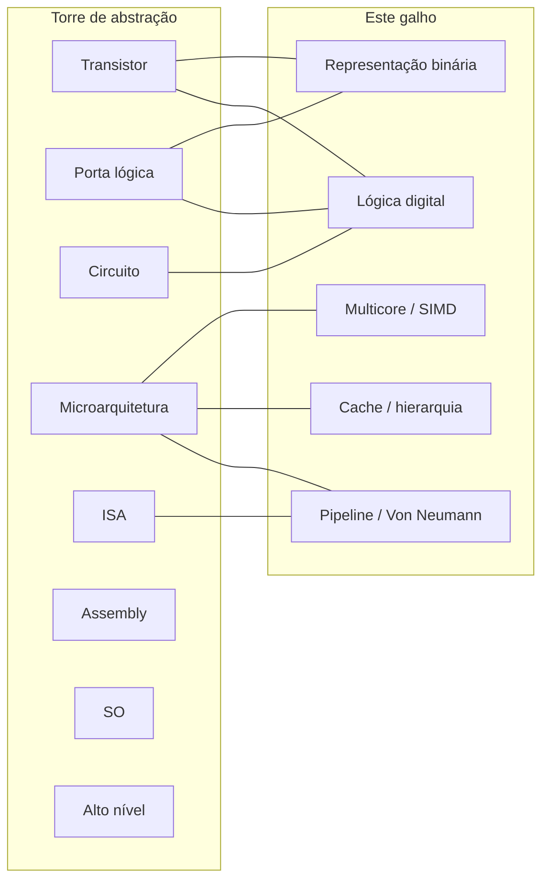

# O que é organização de computadores

> [!abstract] TL;DR
> Organização de computadores estuda COMO o hardware executa instruções — pipeline, cache, ULA, registradores. Arquitetura (ISA) é o CONTRATO; organização é a IMPLEMENTAÇÃO. Entender isso é o que separa o dev que escreve código de quem sabe POR QUÊ o código é rápido ou lento.

---

## O problema da caixa-preta

Você escreve `int x = a + b;` e o computador faz a soma. Pronto. Mas o que acontece entre aspas lá dentro?

Se a resposta é "não importa, o compilador cuida disso" — você está certo para 90% dos dias. No décimo dia, você vai depurar um código que roda 10× mais lento sem razão aparente, ou vai encontrar um overflow onde nenhum deveria existir, ou vai ouvir numa entrevista: *"por que iterar uma matriz por linhas é mais rápido que por colunas?"*

Organização de computadores é a disciplina que abre essa caixa-preta.

Ela não estuda o que o computador PODE fazer (isso é arquitetura). Ela estuda COMO o computador FAZ o que faz — os circuitos, o pipeline, a hierarquia de memória, o fluxo de bits do transistor à instrução executada.

---

## Arquitetura × Organização: o contrato e a implementação

Essa distinção é fundamental. Confundir os dois é como confundir a especificação de uma API com o código que a implementa.

**Arquitetura** (ou ISA — *Instruction Set Architecture*) é o contrato público. É o que o programador e o compilador enxergam: quais instruções existem, quantos registradores há, qual o tamanho de palavra, como os modos de endereçamento funcionam. A ISA x86-64, por exemplo, define que existe uma instrução `ADD`, que há registradores `RAX`, `RBX`, e assim por diante.

**Organização** (ou microarquitetura) é a implementação desse contrato. É o "como" que fica escondido do programador: o pipeline tem quantos estágios? A cache L1 é unificada ou separada? A unidade de ponto flutuante opera em quantos ciclos? Há execução fora de ordem?

O ponto crucial: **a mesma ISA pode ter organizações completamente diferentes**.

Um Intel Core i9 e um AMD Ryzen 9 executam o mesmo código x86-64. Mas internamente são microarquiteturas distintas — pipelines diferentes, caches diferentes, preditores de desvio diferentes — resultando em desempenhos diferentes para cargas de trabalho distintas.

A tabela abaixo torna isso concreto:

| Dimensão | Arquitetura (ISA) | Organização (microarquitetura) |
|---|---|---|
| O que define | Instruções, registradores, modos de endereçamento | Pipeline, caches, ULA, unidades de execução |
| Quem vê | Programador, compilador, SO | Apenas o chip |
| Muda entre gerações? | Raramente (compatibilidade binária) | A cada geração |
| Exemplo x86 | `MOV`, `ADD`, registradores `RAX`..`R15` | Intel Golden Cove vs. AMD Zen 4 |
| Exemplo ARM | ARMv8-A ISA | Apple M4 core vs. Cortex-A78 |

> [!tip] A compatibilidade binária depende da ISA, não da organização
> É por isso que um executável compilado para x86-64 nos anos 2000 ainda roda num processador moderno. A ISA é o que garante esse contrato. A organização pode mudar — e muda — sem quebrar nenhum programa.

---

## A torre de abstração

Computadores são construídos em camadas. Cada camada esconde a complexidade da camada abaixo e oferece uma interface mais limpa para a camada acima. Essa é a ideia central da computação estruturada.

Tanenbaum chama isso de "multilevel machine": o computador não é uma coisa só, é uma pilha de máquinas virtuais empilhadas.

O diagrama abaixo mostra a torre completa, do transistor físico à linguagem de alto nível:

**Leitura do diagrama:** suba pela seta e você vê abstração crescendo — cada nível ESCONDE o anterior. Desça e você vê como uma linha de Python se transforma em elétrons comutar em silício. O movimento de subida é o que os programadores fazem todo dia. O movimento de descida é o que esse galho ensina.

> [!note] A abstração que vaza
> Cada nível esconde o de baixo, mas **não perfeitamente**. Quando a performance importa, os detalhes do nível inferior vazam para cima. Um loop que parece O(n) na análise assintótica pode rodar 8× mais devagar que outro O(n) dependendo de como você acessa a memória — por causa do cache, que vive quatro níveis abaixo no seu modelo mental.

---

## Onde vive a organização na torre

Organização de computadores abrange principalmente as **três camadas do meio**: circuitos, microarquitetura e ISA.

- **Transistor → porta lógica → circuito**: você aprende em [[05 - Lógica digital - portas e circuitos combinacionais]]. Ali a álgebra booleana vira silício.
- **Microarquitetura**: o coração do galho — pipeline, ULA, controle, cache.
- **ISA**: o contrato que amarra tudo — estudado em [[07 - Arquitetura de von Neumann e o ciclo de instrução]].

As camadas acima (SO, linguagens) são território do [[03-Dominios/Ciência/Sistemas Operacionais/index|Sistemas Operacionais]] e de compiladores. Elas dependem da organização, mas não a definem.

---

## A fronteira hardware/software

Há um limite bem definido na torre: abaixo da ISA é hardware puro. Acima da ISA é software — código que o processador executa.

O Sistema Operacional vive logo acima da ISA. Ele gerencia os recursos de hardware — CPU, memória, dispositivos — e os disponibiliza para os processos via chamadas de sistema (syscalls). O SO é o software que conversa diretamente com a organização do hardware.

Veja [[03-Dominios/Ciência/Sistemas Operacionais/index|Sistemas Operacionais]] para aprofundar esse lado da moeda.

Por que um desenvolvedor de alto nível deveria se importar com o que há abaixo da ISA?

**Mechanical sympathy.** O termo foi cunhado por Martin Thompson, que pegou emprestado do piloto de F1 Jackie Stewart: o piloto que entende como o carro funciona dirige melhor do que o que apenas toca o volante. Da mesma forma, o dev que entende cache, pipeline e representação binária escreve código que coopera com o hardware em vez de lutar contra ele.

Três exemplos concretos aparecem mais abaixo. Mas antes, o modelo mental central.

---

## Von Neumann como tema-âncora

Toda a organização de computadores moderna gira em torno de uma ideia de 1945: o **programa armazenado**.

Antes de Von Neumann (e Turing, e Eckert, e Mauchly — a história é coletiva), computadores eram hardwired: você mudava o programa reconectando fios. A genialidade do modelo de Von Neumann foi perceber que **instruções são dados**.

Se instruções são dados, podem morar na mesma memória que os dados. E se estão na memória, a CPU pode buscá-las, decodificá-las e executá-las em ciclo contínuo — o famoso ciclo **Fetch → Decode → Execute**.

**Leitura do diagrama:** a CPU e a memória são o coração do modelo. A CPU lê instruções da memória, executa, escreve resultados de volta. I/O entra na lateral. Tudo que existe num computador moderno — mesmo um servidor de 512 cores — é, no fundo, uma refinação desse modelo.

O gargalo clássico do modelo Von Neumann é o **barramento único** entre CPU e memória: a CPU frequentemente espera pela memória. É esse gargalo que motivou a criação da hierarquia de cache — que você vai estudar em [[11 - Hierarquia de memória e localidade]].

Para o ciclo de instrução em detalhes e como a CPU implementa isso com registradores de controle, veja [[07 - Arquitetura de von Neumann e o ciclo de instrução]].

---

## O mapa do galho

Este galho percorre a torre de baixo para cima, em seis blocos temáticos. O diagrama abaixo é o mapa da jornada:

**Leitura do diagrama:** os blocos são dependentes em sequência — você precisa entender representação antes de construir circuitos, circuitos antes de executar instruções, e assim por diante. Dentro de cada bloco, as notas do galho aprofundam cada tema em três fases (Iniciado → Adepto → Magus).

---

## Por que importa pro dev: três abstrações que vazam

Teoria é bonita. Mas o que muda no dia a dia?

A tabela abaixo mapeia três casos concretos onde a abstração de alto nível vaza e o hardware determina o comportamento:

| Abstração que vaza | Consequência no código | Nota do galho |
|---|---|---|
| `int` tem 32 bits em complemento de 2 | `Integer.MAX_VALUE + 1` retorna um número negativo — overflow silencioso | [[02 - Representação binária de inteiros]] |
| Cache lê blocos contíguos da memória | Iterar matriz C por colunas em vez de linhas causa cache miss × 10 na latência | [[11 - Hierarquia de memória e localidade]] |
| Circuitos são booleanos, não decimais | `0.1 + 0.2 ≠ 0.3` em ponto flutuante — não é bug do Python, é IEEE 754 | [[05 - Lógica digital - portas e circuitos combinacionais]] |

### Detalhe 1: o overflow de inteiro

Em Java, `int` é sempre 32 bits em complemento de dois. O maior valor positivo é 2³¹ − 1 = 2.147.483.647. Some 1 a isso e o bit de sinal vira 1 — o número "vira negativo" instantaneamente. Não há exceção, não há aviso. O hardware fez exatamente o que a ISA manda — a abstração de alto nível simplesmente não expõe o limite.

Entender representação binária elimina esse tipo de surpresa para sempre. Veja [[02 - Representação binária de inteiros]].

### Detalhe 2: a matriz e o cache

Imagine uma matriz 1000 × 1000 de inteiros. Acesso por linha percorre a memória sequencialmente — cada linha está contígua. A cache busca blocos de 64 bytes por vez; ao carregar `matriz[i][0]`, já traz `matriz[i][1]` ... `matriz[i][15]` de graça.

Acesso por coluna pula de 4000 bytes em 4000 bytes (1000 × 4 bytes por linha). Cada acesso é um cache miss. O resultado prático: o loop por coluna pode ser 5× a 10× mais lento na mesma máquina, no mesmo compilador, com a mesma complexidade assintótica.

Isso é *mechanical sympathy* aplicado. Veja [[11 - Hierarquia de memória e localidade]].

### Detalhe 3: ponto flutuante não é decimal

`0.1` não existe em binário. Assim como `1/3` não existe em decimal finito, `0.1` é uma dízima periódica em base 2. O padrão IEEE 754 representa a aproximação mais próxima possível em 32 ou 64 bits. Quando você soma `0.1 + 0.2`, está somando duas aproximações — o resultado é `0.30000000000000004`.

A raiz está na lógica digital: circuitos operam em base 2 por construção. Veja [[05 - Lógica digital - portas e circuitos combinacionais]].

---

## A Lei de Moore e o fim do free lunch

Durante décadas, a vida foi fácil para os programadores: a cada 18-24 meses, os transistores dobravam de densidade (Lei de Moore) e os chips ficavam mais rápidos. Você podia escrever código medíocre e esperar 2 anos — o hardware resolveria.

Isso acabou.

O clock dos processadores parou de crescer por volta de 2004. O motivo é físico: transistores menores dissipam mais calor por unidade de área, e o resfriamento tem limite. Subir o clock além de ≈4 GHz consome energia desproporcionalmente e aquece o chip a ponto de danificá-lo. Esse fenômeno recebeu o nome de **power wall** — o muro da potência.

Há ainda dois outros muros que reforçam o problema:

- **Memory wall**: a memória principal (DRAM) ficou mais barata mas não acompanhou o ritmo de crescimento de velocidade da CPU. A diferença de latência entre CPU e RAM cresceu de ≈10× nos anos 1980 para mais de 100× hoje. O cache existe para mascarar esse abismo.
- **ILP wall** (*Instruction-Level Parallelism*): durante anos, os chips extraíam mais desempenho executando múltiplas instruções de um único programa em paralelo (superescalar, execução fora de ordem). Mas há um limite de quanto paralelismo implícito existe num código serial. Esse limite foi atingido.

A resposta da indústria foi o **multicore**: em vez de um núcleo mais rápido, coloque 4, 8, 32, 128 núcleos no mesmo chip. O desempenho agregado cresce, mas o desempenho de uma única thread não.

O que isso significa para o dev?

- Código serial não fica mais rápido automaticamente.
- Paralelismo precisa ser explícito — threads, processos, SIMD.
- A hierarquia de cache fica mais complexa (cada core tem L1/L2 próprios; L3 é compartilhado).
- Bugs de concorrência — race conditions, deadlocks — emergem de onde antes não havia paralelismo.
- A Lei de Amdahl passa a ser limitação real: se 5% do código é serial, o speedup máximo teórico é 20× independentemente de quantos cores você adicione.

> [!warning] O free lunch acabou em 2004
> Herb Sutter publicou o ensaio "The Free Lunch Is Over" em 2005, antecipando exatamente esse movimento. Hoje, um processador moderno tem mais de 50 bilhões de transistores. Eles não estão todos no mesmo núcleo — estão distribuídos em caches, controladores, unidades especializadas e múltiplos cores. Escrever software que aproveita isso exige entender a organização do hardware.

O galho cobre multicore e SIMD no bloco ESCALAR. O bloco MEDIR fecha com as ferramentas para quantificar tudo isso.

---

## O papel da organização de computadores na carreira

Não é exagero dizer que organização de computadores é o "chão" de toda a engenharia de software de alto desempenho. As subáreas que dependem diretamente dela:

**Performance engineering**: otimizar um sistema começa por entender onde o tempo vai. O profiler vai dizer que a função X é lenta, mas só quem entende cache vai perceber que o problema não é o algoritmo — é o padrão de acesso à memória.

**Sistemas embarcados**: microcontroladores expõem a ISA e a organização diretamente ao programador. Não há SO para abstrair interrupções, timers ou DMA. Você programa o hardware.

**Compiladores**: um compilador que não entende pipeline vai gerar código que trava em data hazards desnecessários. Transformações como loop unrolling, software pipelining e auto-vectorização são todas otimizações guiadas pela organização do hardware.

**Segurança de sistemas**: ataques como Spectre e Meltdown (2018) exploram diretamente a microarquitetura — execução especulativa e cache side-channels. Defender-se exige entender como o hardware funciona.

> [!question] Mas eu escrevo React. Isso é relevante pra mim?
> Provavelmente menos do que para um dev de sistemas. Mas "entrevista para empresa de produto" frequentemente inclui perguntas sobre o que acontece quando você abre uma URL — e o caminho passa pelo SO, que passa pela organização do hardware. Além disso, qualquer código que processa volume alto de dados (analytics, parsing, serialização) se beneficia de pensar em termos de cache e representação de dados.

---

## Uma última pergunta

Por que a maioria dos cursos de ciência da computação ainda ensina organização de computadores, décadas depois da criação das linguagens de alto nível?

Porque a abstração é poderosa mas não é completa. Toda abstração tem custo e toda abstração vaza em alguma condição. O desenvolvedor que entende os fundamentos sabe quando confiar na abstração e quando olhar para baixo.

Como resume Patterson e Hennessy: *"the hardware/software interface is where the action is."*

---

## Onde cada tema deste galho se encaixa na torre

**Leitura do diagrama:** as linhas conectam os temas deste galho aos níveis da torre que eles cobrem. Representação binária começa no transistor. Lógica digital constrói portas e circuitos. Pipeline e Von Neumann vivem na microarquitetura e ISA. Cache e multicore também são microarquitetura.

---

> [!summary] Resumo em uma linha
> Organização de computadores é a camada entre o silício e a ISA: ela explica POR QUÊ o hardware faz o que faz e, portanto, POR QUÊ o seu código tem a performance que tem.

---

## Em entrevista

Organização de computadores aparece em entrevistas de performance engineering, sistemas distribuídos de baixa latência, embedded, e qualquer posição senior que exige raciocínio sobre tradeoffs de hardware. Saber falar sobre isso em inglês é diferencial real.

Estude a tabela de vocabulário abaixo e pratique as frases em voz alta — entrevista técnica em inglês exige fluência oral, não apenas leitura.

*"The ISA defines the contract between hardware and software — it's what the compiler sees. The microarchitecture is the implementation of that contract, invisible to the programmer but critical for performance."*

*"Von Neumann's stored-program concept means instructions are just data in memory. The CPU fetches them, decodes them, and executes them in a loop — that's still how every modern processor works at its core."*

*"Moore's Law gave us free performance for decades. When clock speeds plateaued around 2004, the industry shifted to multicores. That's why parallelism is no longer optional."*

*"Cache miss is one of the most expensive things a program can do — it can cost hundreds of clock cycles waiting for main memory. That's why data locality matters even when big-O complexity is the same."*

*"Integer overflow is silent in most languages because the hardware just wraps around in two's complement. If you don't know that, you'll spend hours debugging what looks like random negative numbers."*

*"The abstraction leak is real: even if you write Python, what you're really doing is telling billions of transistors to switch states. When performance matters, you need to think about what's happening two or three layers below your code."*

*"Mechanical sympathy means writing code that cooperates with the hardware — keeping hot data in cache-friendly layouts, avoiding branch mispredictions in tight loops, using SIMD when the data is vectorizable."*

| Português | English |
|---|---|
| Organização de computadores | Computer organization |
| Arquitetura (ISA) | Instruction Set Architecture (ISA) |
| Microarquitetura | Microarchitecture |
| Contrato hardware/software | Hardware/software interface |
| Programa armazenado | Stored-program concept |
| Ciclo busca-decodifica-executa | Fetch-decode-execute cycle |
| Registrador | Register |
| Unidade lógica e aritmética | Arithmetic Logic Unit (ALU) |
| Pipeline | Pipeline |
| Hazard de dados | Data hazard |
| Hierarquia de memória | Memory hierarchy |
| Acerto de cache | Cache hit |
| Falha de cache | Cache miss |
| Localidade de referência | Locality of reference |
| Overflow de inteiro | Integer overflow |
| Ponto flutuante | Floating point |
| Multicore | Multicore |
| Lei de Amdahl | Amdahl's Law |

---

> [!info] Lastro
> - Patterson, David A.; Hennessy, John L. **Computer Organization and Design RISC-V Edition: The Hardware Software Interface**. 2ª ed. Morgan Kaufmann, 2020. ISBN 978-0-12-820331-6. O texto de referência do campo — conecta ISA, microarquitetura, compiladores e sistemas com exemplos na ISA RISC-V open source.
> - Bryant, Randal E.; O'Hallaron, David R. **Computer Systems: A Programmer's Perspective** (CS:APP). 3ª ed. Pearson, 2015. ISBN 978-0-13-409266-9. Abordagem "do ponto de vista do programador" — cobre como hardware, SO, compilador e rede afetam a corretude e performance dos programas. Site oficial: [csapp.cs.cmu.edu](https://csapp.cs.cmu.edu/).
> - Tanenbaum, Andrew S. **Structured Computer Organization**. 6ª ed. Pearson, 2012. ISBN 978-0-13-291652-3. Define o modelo de máquinas em níveis (transistor → porta → circuito → microarquitetura → ISA → SO → linguagem), base conceitual da torre de abstração desta nota.
> - Sutter, Herb. **"The Free Lunch Is Over: A Fundamental Turn Toward Concurrency in Software"**. Dr. Dobb's Journal, vol. 30, nº 3, março 2005. Disponível em [gotw.ca/publications/concurrency-ddj.htm](http://www.gotw.ca/publications/concurrency-ddj.htm). O ensaio que anunciou o fim da escalabilidade serial gratuita e a virada para o multicore.
> - Hennessy, John L.; Patterson, David A. **Computer Architecture: A Quantitative Approach**. 6ª ed. Morgan Kaufmann, 2017. ISBN 978-0-12-811905-1. Aprofundamento quantitativo — métricas, benchmarks, análise de tradeoffs de microarquitetura. Leitura Magus do galho.

---

*Próxima nota:* [[02 - Representação binária de inteiros]] — como o hardware representa números e por que isso importa.

*Ver também:* [[03-Dominios/Ciência/index|Ciência da Computação]] · [[07 - Arquitetura de von Neumann e o ciclo de instrução]] · [[11 - Hierarquia de memória e localidade]] · [[05 - Lógica digital - portas e circuitos combinacionais]]
