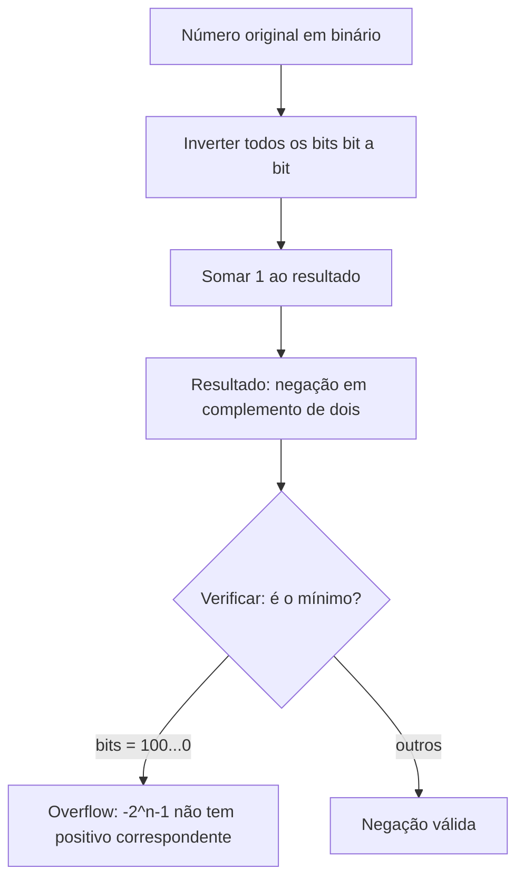

# Representação binária de inteiros

> [!abstract] TL;DR
> Todo inteiro que o computador manipula vive numa sequência de bits. A forma como esses bits são interpretados determina se você tem um número sem sinal (0 a 2ⁿ−1) ou um número com sinal — e o complemento de dois é o esquema vencedor porque zero é único, a soma funciona com o mesmo hardware, e negação é trivial (inverter + somar 1). Entender isso evita bugs clássicos: overflow silencioso, loop infinito com `size_t`, divisão inteira enviesada.

---

## Bases numéricas e taquigrafia

Seres humanos contam em base 10 porque temos dez dedos. Computadores contam em base 2 porque transistores têm dois estados: ligado (1) e desligado (0). Simples assim.

A questão é que binário fica longo demais para ler à mão. `11001010` já começa a doer nos olhos. É aí que entra o **hexadecimal** (base 16): cada dígito hex representa exatamente 4 bits (um nibble). É pura taquigrafia — nenhuma informação se perde.

| Base | Nome        | Dígitos                       | Exemplo        |
|------|-------------|-------------------------------|----------------|
| 2    | Binário     | 0, 1                          | `0b11001010`   |
| 8    | Octal       | 0–7                           | `0312`         |
| 16   | Hexadecimal | 0–9, A–F                      | `0xCA`         |
| 10   | Decimal     | 0–9                           | `202`          |

> [!tip] Por que hex e não octal?
> Octal usa 3 bits por dígito, o que não divide limpo em bytes de 8 bits. Hex usa 4 bits — dois dígitos hex = um byte exato. Por isso o octal sumiu e o hex domina dumps de memória, cores CSS e endereços de rede.

Converter binário → hex é trivial: agrupe os bits de 4 em 4 da direita para a esquerda.

```
1100 1010
  C    A   →  0xCA
```

Converter hex → binário: expanda cada dígito em 4 bits.

```
0xF3  →  1111 0011
```

---

## Vocabulário fundamental

Antes de ir a fundo, fixe os termos. Eles aparecem em toda literatura e em toda entrevista.

| Termo  | Tamanho   | Observação                                          |
|--------|-----------|-----------------------------------------------------|
| Bit    | 1 bit     | Unidade atômica; 0 ou 1                             |
| Nibble | 4 bits    | Um dígito hexadecimal                               |
| Byte   | 8 bits    | Menor unidade endereçável na memória (quase sempre) |
| Word   | arquitetura-dependente | 16 bits (x86 legacy), 32 bits (IA-32), 64 bits (x86-64) |

> [!warning] "Word" é ambíguo
> Em x86 histórico, word = 16 bits. Na literatura de arquitetura moderna, word muitas vezes significa o tamanho nativo do registrador (64 bits num x86-64). Sempre pergunte: word de quantos bits?

---

## Peso posicional: como um byte vira um número

Cada bit tem um **peso** que é uma potência de 2. O bit mais à direita (posição 0) vale 2⁰ = 1. O bit mais à esquerda de um byte (posição 7) vale 2⁷ = 128.

**Tabela de pesos de um byte (unsigned):**

| Posição | 7   | 6  | 5  | 4  | 3 | 2 | 1 | 0 |
|---------|-----|----|----|----|----|---|---|---|
| Peso    | 128 | 64 | 32 | 16 | 8 | 4 | 2 | 1 |
| Bit     | 1   | 1  | 0  | 0  | 1 | 0 | 1 | 0 |
| Valor   | 128 | 64 | 0  | 0  | 8 | 0 | 2 | 0 |

128 + 64 + 8 + 2 = **202**. Logo `0b11001010` = 202 = `0xCA`.

> [!info] Leitura do diagrama
> Cada coluna é uma posição de bit. O bit mais significativo (MSB — *most significant bit*) fica à esquerda, o menos significativo (LSB — *least significant bit*) à direita. Para calcular o valor: multiplique cada bit pelo seu peso e some tudo.

---

## Inteiros sem sinal (unsigned)

Com n bits, você representa 2ⁿ valores distintos: de **0 a 2ⁿ−1**.

- 8 bits: 0 a 255
- 16 bits: 0 a 65.535
- 32 bits: 0 a 4.294.967.295 (≈ 4 bilhões)
- 64 bits: 0 a 18.446.744.073.709.551.615 (≈ 1,8 × 10¹⁹)

Não tem truque: todos os bits são de magnitude. A fórmula exata é:

```
valor = b_{n-1} × 2^{n-1} + b_{n-2} × 2^{n-2} + ... + b_1 × 2 + b_0
```

---

## Inteiros com sinal: as três abordagens

Aqui mora a história interessante. Como representar números negativos?

Três esquemas foram inventados. Dois foram descartados. Um dominou.

### Sinal-magnitude

A ideia mais óbvia: reserve o bit mais significativo como **bit de sinal** (0 = positivo, 1 = negativo) e use os demais bits como magnitude.

```
+5  em 4 bits  →  0 101
-5  em 4 bits  →  1 101
```

**Problema 1 — zero duplo:** `0000` = +0 e `1000` = −0. Dois zeros distintos. Isso complica comparações.

**Problema 2 — soma não funciona:** tente somar +3 e −5 com esse esquema usando hardware de soma normal. Não vai dar certo. O hardware precisa detectar o sinal e decidir se soma ou subtrai — circuito mais complexo.

### Complemento de um

Negue todos os bits.

```
+5  em 4 bits  →  0101
-5  em 4 bits  →  1010  (todos os bits invertidos)
```

Melhorou: a soma quase funciona. Mas ainda tem o **zero duplo**: `0000` = +0 e `1111` = −0.

E a soma precisa de um "end-around carry" (o carry do bit mais alto precisa ser somado de volta ao resultado). Hardware ainda feio.

### Complemento de dois — o vencedor

Negue todos os bits e some 1.

```
+5  em 4 bits  →  0101
~5             →  1010   (inverter todos os bits)
-5             →  1011   (somar 1)
```

> [!success] Por que complemento de dois ganhou?
> 1. **Zero é único.** `0000` + inverter = `1111` + 1 = `10000` → os 4 bits baixos são `0000`. Um único zero.
> 2. **Soma/subtração usa o mesmo hardware do unsigned.** O processador não precisa saber se os números são signed ou unsigned para somar — os bits funcionam do mesmo jeito.
> 3. **Negar é O(n) trivial:** inverter + somar 1.

**Tabela comparativa — representações em 4 bits:**

| Bits | Unsigned | Sinal-magnitude | Compl. de 1 | Compl. de 2 |
|------|----------|-----------------|-------------|-------------|
| 0000 | 0        | +0              | +0          | 0           |
| 0001 | 1        | +1              | +1          | +1          |
| 0010 | 2        | +2              | +2          | +2          |
| 0011 | 3        | +3              | +3          | +3          |
| 0100 | 4        | +4              | +4          | +4          |
| 0101 | 5        | +5              | +5          | +5          |
| 0110 | 6        | +6              | +6          | +6          |
| 0111 | 7        | +7              | +7          | +7          |
| 1000 | 8        | −0              | −7          | **−8**      |
| 1001 | 9        | −1              | −6          | −7          |
| 1010 | 10       | −2              | −5          | −6          |
| 1011 | 11       | −3              | −4          | −5          |
| 1100 | 12       | −4              | −3          | −4          |
| 1101 | 13       | −5              | −2          | −3          |
| 1110 | 14       | −6              | −1          | −2          |
| 1111 | 15       | −7              | −0          | −1          |

> [!info] Leitura da tabela
> Compare a coluna "Compl. de 2" com as outras. Zero único: só um `0`. Faixa assimétrica: vai de −8 a +7 (não de −7 a +7) — porque o bit de sinal "cabe" um negativo a mais. Esse extra é o −2ⁿ⁻¹.

### O bit mais significativo "vale" −2ⁿ⁻¹

Em complemento de dois com n bits, a fórmula exata do valor é:

```
valor = −b_{n-1} × 2^{n-1} + b_{n-2} × 2^{n-2} + ... + b_0
```

O MSB tem peso **negativo**. Em 4 bits: `1000` = −1 × 2³ + 0 = **−8**.

---

## Como negar em complemento de dois

Negar um número em complemento de dois é um algoritmo de dois passos. O flowchart abaixo mostra o processo:



> [!info] Leitura do diagrama
> O único caso problemático é o número mínimo (−2ⁿ⁻¹): tentar negá-lo devolve ele mesmo, porque +2ⁿ⁻¹ não existe na faixa de n bits. Em C: `INT_MIN` negado ainda é `INT_MIN`.

**Exemplo com 8 bits:**

```
+43  =  0010 1011
~43  =  1101 0100   (inverter)
-43  =  1101 0101   (somar 1)

Verificação: 1101 0101
= -128 + 64 + 16 + 4 + 1
= -128 + 85
= -43  ✓
```

---

## Overflow e wrap-around: aritmética modular

Com n bits, a aritmética é feita **módulo 2ⁿ**. O resultado sempre cabe nos n bits — o que sobra simplesmente desaparece (o carry é descartado).

Isso é [[03-Dominios/Ciência/Matemática para Computação/15 - Aritmética modular e Fermat-Euler]] na prática: o anel ℤ/2ⁿℤ. A base teórica de por que complemento de dois funciona é exatamente a aritmética modular.

**Tabela: overflow em ação (8 bits, signed):**

| Operação           | Bits antes       | Bits depois      | Decimal esperado | Decimal obtido |
|--------------------|------------------|------------------|------------------|----------------|
| `127 + 1`          | `0111 1111`      | `1000 0000`      | +128             | **−128**       |
| `-128 - 1`         | `1000 0000`      | `0111 1111`      | −129             | **+127**       |
| `255 + 1` (u8)     | `1111 1111`      | `0000 0000`      | 256              | **0** (wrap)   |

> [!info] Leitura da tabela
> `INT_MAX + 1` produz `INT_MIN` — o bit de sinal vira 1 e o número parece enorme e negativo. Para unsigned, o wrap é **definido** pela especificação C/C++ (é módulo 2ⁿ). Para signed, o wrap é **undefined behavior** em C — o compilador pode otimizar assumindo que nunca acontece.

> [!warning] Signed overflow é UB em C
> O compilador GCC com `-O2` pode eliminar código assumindo que `x + 1 > x` é sempre verdadeiro para `int x`. Se `x == INT_MAX`, o overflow não existe no modelo do compilador — e o comportamento da sua aplicação fica indefinido. Use `-fwrapv` se precisar de wrap definido.

### O bug clássico da busca binária

```c
// ERRADO: low + high pode estourar se ambos forem grandes
int mid = (low + high) / 2;

// CORRETO: diferença nunca estoura (high >= low)
int mid = low + (high - low) / 2;
```

Josh Bloch reportou esse bug na implementação original do `java.util.Arrays.binarySearch` — estava em produção por uma década antes de ser descoberto.

---

## Extensão de sinal (sign extension)

O que acontece quando você pega um número de 8 bits e precisa colocá-lo num registrador de 32 bits?

- **Unsigned (zero-extension):** preencha os bits novos com `0`. `0b1010` (10 unsigned) → `0b00000000000000000000000000001010` (10).
- **Signed (sign extension):** preencha os bits novos com o valor do **MSB**. Se o número era negativo (MSB = 1), os novos bits são todos 1.

```
 8 bits: 1111 0110  =  -10 em complemento de dois
32 bits: 1111 1111 1111 1111 1111 1111 1111 0110  =  -10
```

O valor é preservado. Os bits extras são "cópias do sinal" — por isso o nome.

> [!example] Exemplo: `(int8_t)(-10)` promovido para `int32_t`
> Em C, quando você escreve `int32_t x = (int8_t)(-10);`, o compilador faz sign extension automaticamente. O valor −10 é mantido. Se você fizesse zero-extension, teria 246 — número completamente errado.

---

## Operações de bit

Processadores têm instruções dedicadas para manipular bits individuais. Em C e na maioria das linguagens, os operadores são:

**Tabela de operações bitwise:**

| Operador | Nome              | Efeito sobre cada bit      | Uso típico                         |
|----------|-------------------|----------------------------|------------------------------------|
| `&`      | AND               | 1 se ambos são 1           | Mascarar bits, testar bit          |
| `\|`     | OR                | 1 se pelo menos um é 1     | Setar bit, combinar flags          |
| `^`      | XOR               | 1 se os bits são diferentes| Inverter bit, detectar diferença   |
| `~`      | NOT (complemento) | Inverte todos os bits      | Complemento de um; montar máscaras |
| `<<`     | Shift left        | Move bits para a esquerda  | Multiplicar por potência de 2      |
| `>>`     | Shift right       | Move bits para a direita   | Dividir por potência de 2          |

> [!info] Leitura da tabela
> `&`, `|`, `^` e `~` operam bit a bit — cada par de bits produz um resultado independente. `<<` e `>>` movem todos os bits juntos, preenchendo com 0 (ou, para `>>` aritmético em números negativos, com o bit de sinal).

### Shift e multiplicação/divisão

`x << 1` multiplica por 2. `x << k` multiplica por 2ᵏ. Por quê? Cada posição para a esquerda dobra o peso posicional.

```
0b00000101  =  5
0b00001010  =  10  (shift left 1 = ×2)
0b00010100  =  20  (shift left 2 = ×4)
```

`x >> 1` para unsigned é divisão por 2 com truncamento para baixo. Para signed em C, `>>` é **aritmético** (preenche com o bit de sinal) nos compiladores modernos, mas formalmente é implementation-defined.

> [!warning] Shift aritmético vs lógico
> Shift **lógico** (`>>` em unsigned): sempre preenche com 0. Shift **aritmético** (`>>` em signed na maioria das arquiteturas): preenche com o MSB (preserva sinal). `(-8) >> 1` = −4 com shift aritmético, não +124. Cuidado ao usar `>>` em números negativos para "dividir por 2".

### Máscaras: set, clear, test

```c
uint8_t flags = 0b00000000;

// Setar bit 3 (contar da direita, base 0)
flags = flags | (1 << 3);   // flags = 0b00001000

// Testar bit 3
int bit3 = (flags >> 3) & 1;   // 1 se está setado, 0 se não

// Limpar bit 3
flags = flags & ~(1 << 3);  // ~(1<<3) = 0b11110111 → AND zera só o bit 3
```

### Bit flags em APIs reais

Flags empacotados em inteiros aparecem em toda API de sistema. No Linux: `open(path, O_RDONLY | O_NONBLOCK)`. Cada constante `O_*` é uma potência de 2 — um único bit.

```c
#define O_RDONLY    0
#define O_WRONLY    1
#define O_RDWR      2
#define O_NONBLOCK  2048   // bit 11
```

`|` combina flags. `&` testa um flag individual. `~flag & all_flags` remove um flag.

### Cores RGBA empacotadas em int

Em jogos e gráficos, uma cor RGBA é frequentemente um único `uint32_t`:

```
0xFF8040CC
  ^^  =  R = 0xFF = 255
    ^^  =  G = 0x80 = 128
      ^^  =  B = 0x40 = 64
        ^^  =  A = 0xCC = 204
```

Extrair o canal verde: `(color >> 16) & 0xFF`. Setar o canal alfa: `(color & 0x00FFFFFF) | (alpha << 24)`.

### Truque: tirar o bit mais baixo

`x & (x - 1)` zera o bit 1 mais à direita de `x`. Por quê? Subtrair 1 de `x` apaga o bit mais baixo e seta todos os bits abaixo dele. O AND resultante apaga exatamente esse bit.

```
x     = 0b10110100
x - 1 = 0b10110011
AND   = 0b10110000   (bit mais baixo (posição 2) zerado)
```

Isso é a base de contar bits setados em O(número de bits setados) — o algoritmo de Kernighan:

```c
int count_bits(uint32_t x) {
    int count = 0;
    while (x) {
        x = x & (x - 1);
        count++;
    }
    return count;
}
```

### Hashing com máscara de potência de 2

Quando o tamanho de uma hash table é potência de 2, calcular o bucket é só:

```c
index = hash & (n - 1);   // equivalente a: hash % n
```

`n - 1` cria uma máscara de bits com todos os 1s nas posições baixas. `&` descarta os bits altos, ficando com o resto. Isso troca uma divisão (cara) por um AND (barato).

Mas atenção: isso **só funciona quando n é potência de 2**.

---

## Bug clássico: loop infinito com `size_t`

`size_t` é unsigned. Um loop decrescente que testa `>= 0` nunca termina:

```c
// ERRADO: size_t nunca é negativo; quando i == 0, i-- wraps para SIZE_MAX
for (size_t i = n - 1; i >= 0; i--) {
    // loop infinito!
}

// CORRETO: use int, ou inverta o sentido do loop
for (size_t i = n; i > 0; i--) {
    size_t idx = i - 1;
    // ...
}
```

O wrap-around unsigned é definido — o compilador não vai avisar. É um bug silencioso clássico em C.

---

## Conexões

- Nota anterior: [[01 - O que é organização de computadores]] — contexto de por que o hardware precisa de uma convenção de representação.
- Próxima nota: [[03 - Ponto flutuante - IEEE 754]] — como o mesmo hardware de bits representa frações (com sinal, expoente e mantissa).
- Portas lógicas que implementam as operações de bit: [[05 - Lógica digital - portas e circuitos combinacionais]].
- A base matemática do wrap-around: [[03-Dominios/Ciência/Matemática para Computação/15 - Aritmética modular e Fermat-Euler]].

---

> [!summary] Resumo em uma linha
> Inteiros vivem em bits; complemento de dois ganhou porque zero é único, a soma é grátis, e negar é só inverter + 1 — mas a aritmética modular cobra seu preço em overflow, loops unsigned e extensão de sinal errada.

---

## Em entrevista

Representação binária aparece diretamente em perguntas de bit manipulation e indiretamente em quase toda pergunta de algoritmo. O entrevistador quer ver que você sabe o que acontece **abaixo** do `int`.

*Binary representation is the foundation; you can't reason about bit manipulation without knowing how integers are stored.*

*Two's complement gives us a single zero, overflow-consistent addition, and trivial negation — that's why every modern CPU uses it.*

*The range of an n-bit signed integer is −2ⁿ⁻¹ to 2ⁿ⁻¹−1: one extra negative because the MSB contributes −2ⁿ⁻¹.*

*Sign extension fills new high-order bits with the sign bit; zero extension fills them with zeros — mix them up and you silently corrupt signed values.*

*Signed integer overflow is undefined behavior in C; the compiler may optimize assuming it never happens.*

*Unsigned wrap-around is defined: it's arithmetic modulo 2ⁿ — and that's exactly why `size_t` loops decrementing past zero spin forever.*

*`x & (x-1)` clears the lowest set bit; it's the building block of Kernighan's popcount algorithm.*

*`hash & (n-1)` replaces `hash % n` when n is a power of two — bitwise AND is one clock cycle, division can be dozens.*

*The binary search midpoint bug — `(low+high)/2` overflows — was in Java's standard library for a decade.*

**Vocabulário PT → EN:**

| Português                  | Inglês                         |
|----------------------------|--------------------------------|
| Bit mais significativo     | Most significant bit (MSB)     |
| Bit menos significativo    | Least significant bit (LSB)    |
| Complemento de dois        | Two's complement               |
| Sinal-magnitude            | Sign-magnitude                 |
| Extensão de sinal          | Sign extension                 |
| Extensão com zero          | Zero extension                 |
| Overflow (signed)          | Signed overflow / integer overflow |
| Estouro de inteiro         | Integer overflow               |
| Comportamento indefinido   | Undefined behavior (UB)        |
| Aritmética modular         | Modular arithmetic             |
| Máscara de bits            | Bitmask                        |
| Operação bit a bit         | Bitwise operation              |
| Deslocamento lógico        | Logical shift                  |
| Deslocamento aritmético    | Arithmetic shift               |
| Nibble (4 bits)            | Nibble                         |
| Wrap-around (unsigned)     | Unsigned wrap-around           |
| Bit de sinal               | Sign bit                       |
| Potência de dois           | Power of two                   |

---

> [!info] Lastro
>
> - **Patterson, D. A.; Hennessy, J. L.** *Computer Organization and Design: The Hardware/Software Interface*. 5ª ed. Morgan Kaufmann, 2014. — Capítulo 2 (MIPS) e Apêndice B: trata representação de inteiros, complemento de dois e aritmética no contexto de instruções reais de hardware.
>
> - **Bryant, R. E.; O'Hallaron, D. R.** *Computer Systems: A Programmer's Perspective* (CS:APP). 3ª ed. Pearson, 2015. — Capítulo 2 "Representing and Manipulating Information": a referência mais detalhada sobre complemento de dois, sign extension, overflow como UB em C, e operações de bit na perspectiva do programador. [csapp.cs.cmu.edu](https://csapp.cs.cmu.edu/3e/perspective.html)
>
> - **Tanenbaum, A. S.; Austin, T.** *Structured Computer Organization*. 6ª ed. Pearson, 2013. — Capítulo sobre representação de dados: aborda binário, hexadecimal, sinal-magnitude, complemento de um e dois no contexto de organização estruturada de computadores.
>
> - **Bloch, J.** *"Extra, Extra — Read All About It: Nearly All Binary Searches and Mergesorts are Broken"*. Google AI Blog, 2006. — Fonte original do bug `(low+high)/2` na busca binária do Java. Disponível em: [ai.googleblog.com](https://ai.googleblog.com/2006/06/extra-extra-read-all-about-it-nearly.html)
>
> - **ISO/IEC 9899:2018** (C18 Standard), §6.5 — Define overflow de inteiro com sinal como undefined behavior e wrap-around de unsigned como comportamento definido (módulo 2ⁿ).
