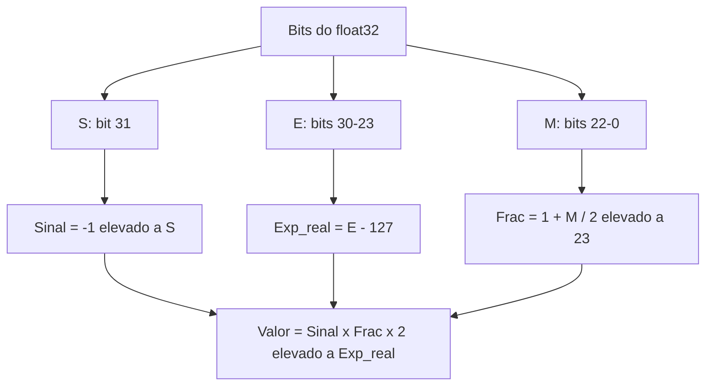
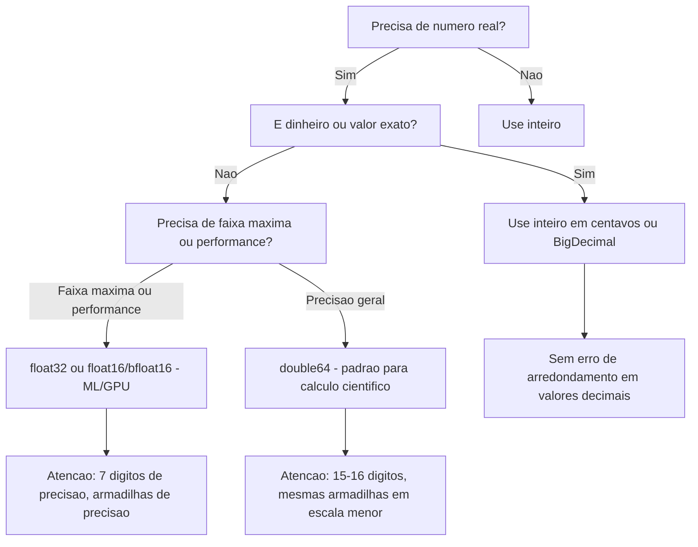
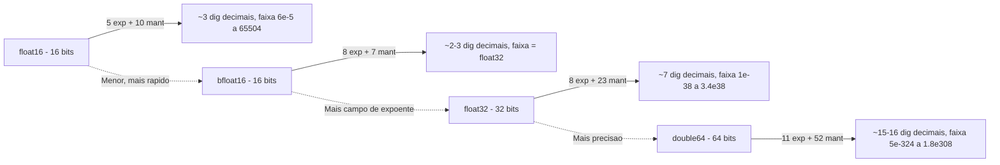

# Ponto flutuante: IEEE 754

> [!abstract] TL;DR
> Números reais são infinitos e contínuos; bits são finitos e discretos. O padrão IEEE 754 resolve isso com notação científica binária — sinal · expoente com viés · mantissa com "1" implícito — criando dois formatos principais (float32 e double64) e um conjunto de casos especiais (±∞, NaN, subnormais). A consequência inevitável: quase todos os reais são aproximados, erros de arredondamento se acumulam, e `0.1 + 0.2 != 0.3` não é um bug, é física.

---

## O problema: infinito dentro do finito

Pensa num termômetro analógico. Entre 20 °C e 21 °C existem infinitos valores — 20,1; 20,01; 20,001; ... até o infinito. Agora tenta guardar isso num campo de 32 bits. Com inteiros você representa 2³² valores distintos — ponto final. Como mapear o contínuo ao discreto?

A primeira ideia é a **vírgula fixa** (*fixed-point*). Você reserva, digamos, 16 bits para a parte inteira e 16 bits para a fração. Simples, previsível, mas rígido: o maior número representável fica pequeno e a precisão perto do zero desperdiça metade dos bits longe do zero.

A segunda ideia — e a que o IEEE 754 adotou — é a **vírgula flutuante** (*floating-point*): notação científica em binário.

Na notação científica decimal você escreve 6.022 × 10²³. Em binário fica:

```
valor = ±1.mantissa × 2^expoente
```

A "vírgula" (ponto binário) **flutua** conforme o expoente muda. Você pode representar tanto 0,0000001 quanto 1.000.000.000 com o mesmo número de bits, só ajustando o expoente. A precisão relativa fica razoavelmente uniforme em toda a faixa — ao custo de não ser exata em quase nenhum ponto.

> [!info] Conexão com a Matemática
> Por que a inexatidão é inevitável? Porque os floats são **contáveis** — há exatamente 2³² floats de 32 bits — enquanto os reais entre 0 e 1 são **incontáveis** (veja [[03-Dominios/Ciência/Matemática para Computação/13 - Cardinalidade - contável e incontável]]). Quase todo número real não tem representação exata. O IEEE 754 apenas escolhe **qual vizinho** usar.

---

## O formato IEEE 754

### Três campos, uma fórmula

Todo número IEEE 754 é dividido em três campos de bits concatenados:

```
valor = (-1)^S × 1.M × 2^(E - bias)
```

Onde S é o bit de sinal, M é a mantissa (fração), E é o expoente armazenado e *bias* é uma constante que desloca E para o range positivo.

### Tabela 1 — Layout de bits do float32 e double64

| Campo | float32 (single) | double64 (double) |
|---|---|---|
| Sinal (S) | 1 bit | 1 bit |
| Expoente (E) | 8 bits | 11 bits |
| Mantissa (M) | 23 bits | 52 bits |
| **Total** | **32 bits** | **64 bits** |
| Bias do expoente | 127 | 1023 |
| Faixa de expoente | −126 a +127 | −1022 a +1023 |
| Precisão decimal aproximada | ~7 dígitos | ~15–16 dígitos |
| Menor positivo normal | ~1.18 × 10⁻³⁸ | ~2.23 × 10⁻³⁰⁸ |
| Maior finito | ~3.40 × 10³⁸ | ~1.80 × 10³⁰⁸ |

**Leitura da tabela:** float32 usa 8 bits para o expoente com bias 127, o que significa que o valor 127 armazenado representa expoente 0 (2⁰ = 1). O double64 usa 11 bits com bias 1023 — mesma lógica, faixa muito maior.

### Diagrama 1 — Bit layout visual do float32

| Pos. 31 | Pos. 30–23 | Pos. 22–0 |
|---|---|---|
| S (1 bit) | EEEEEEEE (8 bits) | MMMMMMMMMMMMMMMMMMMMMMM (23 bits) |
| Sinal | Expoente com bias 127 | Fração (mantissa; o "1." fica implícito) |

**Leitura:** os bits vão do mais significativo (31) ao menos significativo (0). O sinal ocupa só 1 bit; o expoente ocupa os 8 seguintes; a fração ocupa os 23 restantes. Na memória real, o byte mais significativo contém S + os 7 bits de expoente de maior peso.

### Por que o expoente tem viés (*bias*)?

Sem viés, você precisaria de um bit extra para o sinal do expoente, complicando comparações. Com o bias, expoentes são armazenados como inteiros sem sinal. Para float32, bias = 127: um expoente armazenado como `01111111` (= 127) representa 2⁰ = 1. Um expoente armazenado como `00000001` (= 1) representa 2⁻¹²⁶. Isso permite comparar dois floats com um simples inteiro de 32 bits — o hardware fica mais simples.

### O "1" implícito da mantissa

Todo número normalizado começa com "1." antes da vírgula binária. Como esse bit é sempre 1, o IEEE 754 não o armazena — é o **1 implícito** ou *hidden bit*. Você ganha 1 bit de precisão de graça. Os 23 bits da mantissa do float32 guardam só a parte após o "1.", dando 24 bits efetivos de precisão.

---

## Exemplo completo de codificação: −6,5 em float32

Vamos decompor −6,5 passo a passo.

### Tabela 2 — Codificação de −6,5 em float32

| Passo | Operação | Resultado |
|---|---|---|
| 1. Sinal | Negativo | S = 1 |
| 2. Valor absoluto | 6,5 | 6,5 |
| 3. Converter para binário | 6 = 110₂; 0,5 = 0,1₂ | 110,1₂ |
| 4. Normalizar | 1,101 × 2² | Expoente real = 2 |
| 5. Expoente com bias | 2 + 127 = 129 | E = 10000001₂ |
| 6. Mantissa (sem o 1 implícito) | .101 + zeros à dir. | M = 10100000000000000000000₂ |
| 7. Montar os 32 bits | S=1, E=10000001, M=10100000000000000000000 | `1 10000001 10100000000000000000000` |
| 8. Em hex | Agrupar em nibbles | `0xC0D00000` |

**Leitura:** normalizar significa escrever na forma 1.xxx × 2ⁿ; o "1." some (implícito) e os bits restantes (.101) completam a mantissa com zeros. O expoente 2 vira 129 com o bias. O resultado final em 32 bits é `0xC0D00000`.

---

## Exemplo 2: como 0,15625 vira bits

0,15625 = 1/8 + 1/32 = 0,00101₂.

Normalizando: 1,01 × 2⁻³.

- S = 0 (positivo)
- E armazenado = −3 + 127 = 124 = `01111100₂`
- M = `01000000000000000000000₂`
- Resultado: `0 01111100 01000000000000000000000` = `0x3E200000`

Esse é um dos poucos decimais com representação **exata** em binário, porque é potência de 1/2.

---

## Diagrama 2 — Fórmula do valor de um float normal



**Leitura:** os três campos são extraídos independentemente e combinados na fórmula final. Note que a fração soma 1 ao campo M normalizado — esse é o "1 implícito". O resultado é o valor real (aproximado) representado pelo padrão de bits.

---

## Casos especiais

O IEEE 754 reserva padrões de bits para situações que não são números normais. A chave é o expoente armazenado E.

### Tabela 3 — Casos especiais do IEEE 754

| Caso | Expoente (E) | Mantissa (M) | Sinal (S) | Significado |
|---|---|---|---|---|
| Zero positivo | 00000000 (todos 0) | 000...0 (tudo 0) | 0 | +0 |
| Zero negativo | 00000000 (todos 0) | 000...0 (tudo 0) | 1 | −0 (igual a +0 em comparações) |
| Infinito positivo | 11111111 (todos 1) | 000...0 (tudo 0) | 0 | +∞ |
| Infinito negativo | 11111111 (todos 1) | 000...0 (tudo 0) | 1 | −∞ |
| NaN quiet (qNaN) | 11111111 (todos 1) | ≠ 0, bit alto = 1 | qualquer | Not a Number, silencioso |
| NaN signaling (sNaN) | 11111111 (todos 1) | ≠ 0, bit alto = 0 | qualquer | NaN que dispara exceção |
| Subnormal (denormal) | 00000000 (todos 0) | ≠ 0 | qualquer | Muito pequeno, sem "1" implícito |
| Normal | 1 a 254 | qualquer | qualquer | Número representável comum |

**Leitura:** pense nos dois extremos do expoente (tudo 0, tudo 1) como "reservados para casos especiais". O miolo (1–254 em float32) é onde vivem os números normais. Subnormais usam o expoente todo-zero mas mantissa não-zero — eles não têm o "1 implícito", então perdem precisão gradualmente (*gradual underflow*).

### ±∞: aritmética fechada

1.0 / 0.0 = +∞. Isso não lança exceção por padrão — retorna o valor especial. Operações com infinito seguem regras matemáticas intuitivas: ∞ + qualquer_finito = ∞, ∞ − ∞ = NaN.

### NaN: o vírus silencioso

NaN (*Not a Number*) resulta de operações inválidas: 0.0/0.0, √−1, ∞ − ∞. A propriedade mais perigosa:

> **NaN ≠ NaN** — um NaN não é igual nem a si mesmo.

Em Java/C: `float x = 0.0f / 0.0f; x == x` retorna **false**. O único jeito confiável de detectar NaN é `Float.isNaN(x)` ou `std::isnan(x)`. E NaN **propaga**: qualquer operação aritmética com NaN retorna NaN. Um único NaN contamina toda a cadeia de cálculos — silenciosamente.

A diferença entre qNaN e sNaN: o qNaN ("quiet") apenas propaga; o sNaN ("signaling") dispara uma exceção de ponto flutuante quando operado. Na prática, a maioria das linguagens de alto nível usa qNaN e engole a exceção.

### Subnormais: underflow gradual

Se o expoente mínimo normal é 2⁻¹²⁶, o que acontece com números menores? Sem subnormais, você teria um "buraco" entre 0 e o menor número normal — um underflow abrupto. O IEEE 754 resolve com os subnormais: quando E = 0 e M ≠ 0, o "1 implícito" vira "0 implícito", e o número é interpretado como:

```
valor = (-1)^S × 0.M × 2^(-126)
```

Você perde bits de precisão progressivamente ao se aproximar de zero, mas evita o salto brusco. O preço: operações com subnormais são muito mais lentas em hardware (precisam de tratamento especial).

---

## Precisão e arredondamento

### Quantos dígitos você realmente tem?

Float32 tem 24 bits de mantissa efetiva (23 + 1 implícito). 2²⁴ = 16.777.216, logo você tem precisão para ~7 dígitos decimais. Double64 tem 53 bits efetivos → ~15–16 dígitos.

Isso significa: se você tiver `int x = 16777217` (que é 2²⁴ + 1) e converter para float, o valor retornado será **16777216** — o 1 ao final simplesmente desaparece.

### Modos de arredondamento

Quando o resultado exato não é representável, o IEEE 754 define 4 modos:

| Modo | Descrição | Uso típico |
|---|---|---|
| Round-to-nearest-even (padrão) | Arredonda para o mais próximo; empate → par | Uso geral |
| Round toward +∞ | Sempre para cima | Intervalos, análise numérica |
| Round toward −∞ | Sempre para baixo | Intervalos, análise numérica |
| Round toward zero | Trunca | Conversão para inteiro |

O modo padrão é **round-to-nearest-even** (ou "banker's rounding"). O "even" evita viés estatístico em acumulações longas: em caso de empate exato entre dois representáveis, escolhe o par.

### Espaçamento não-uniforme

Floats não são uniformemente espaçados. Perto de 1, a distância entre um float e o próximo é ε ≈ 1.19 × 10⁻⁷ (float32). Perto de 10⁶, a distância sobe para ~0,0625. Perto de 10⁸, você mal consegue representar inteiros consecutivos.

Essa distância entre um float e o próximo representável é chamada de **ULP** (*unit in the last place*). O **épsilon de máquina** (machine epsilon, ε_m ≈ 1.19 × 10⁻⁷ para float32) é o menor número tal que 1.0 + ε_m ≠ 1.0. É o "grão" da aritmética de ponto flutuante.

> [!tip] Regra prática
> Nunca assuma que você pode adicionar qualquer número a um float grande e ver diferença. Se `a` é 10⁸ e você soma 0,1, o resultado pode ser exatamente `a` de volta — o 0,1 está abaixo do ULP de `a`.

---

## Por que `0.1 + 0.2 != 0.3`

Esta é a pergunta mais comum sobre floats em entrevistas. A resposta tem duas partes.

**Parte 1: 0,1 não existe em binário.**

Assim como 1/3 = 0,333... é dízima periódica em base 10, 0,1 é dízima periódica em base 2:

```
0.1 em binário = 0.0001100110011001100110011001100... (infinito)
```

O float32 trunca isso em 23 bits. O valor armazenado é **0.100000001490116119...**, não 0,1 exato. O mesmo vale para 0,2.

**Parte 2: os erros se somam.**

```
0.1 armazenado ≈ 0.1000000014901...
0.2 armazenado ≈ 0.2000000029802...
soma            ≈ 0.3000000044703...
0.3 armazenado  ≈ 0.2999999821186...
```

A soma de 0,1 + 0,2 não coincide com o float mais próximo de 0,3. São dois floats distintos, portanto `0.1 + 0.2 != 0.3` é verdadeiro.

> [!warning] Isso não é bug de linguagem
> Python, Java, JavaScript, C, Rust — todos mostram o mesmo comportamento porque todos usam IEEE 754. É uma consequência matemática inevitável de representar reais com bits finitos, não uma falha de implementação.

A conexão profunda: os reais são **incontáveis** (veja [[03-Dominios/Ciência/Matemática para Computação/13 - Cardinalidade - contável e incontável]]), os floats são **contáveis**. A esmagadora maioria dos reais não tem representação exata — o IEEE 754 apenas escolhe o vizinho mais próximo.

---

## Armadilhas de precisão

### Diagrama 3 — Armadilhas, exemplos e correções

| Armadilha | Exemplo problemático | Consequência | Fix |
|---|---|---|---|
| Comparar com `==` | `if (x == 0.1)` | Raramente true mesmo sendo "0.1" | Usar `Math.abs(x - 0.1) < 1e-9` |
| Cancelamento catastrófico | `(a - b)` quando a ≈ b | Perda de dígitos significativos | Reformular algebricamente |
| Associatividade quebrada | `(a + b) + c ≠ a + (b + c)` | Resultados não-determinísticos | Fixar ordem; Kahan summation |
| Somar pequeno a grande | `1e8 + 0.1` | 0,1 desaparece | Somar do menor para o maior |
| Float para dinheiro | `0.1 * 3 ≠ 0.3` | Erros de centavos se acumulam | Usar inteiros (centavos) ou BigDecimal |
| NaN silencioso | `sqrt(-1.0)` silencioso | NaN propaga e contamina tudo | Checar `isNaN()` em pontos críticos |
| Overflow para ∞ | Multiplicar floats grandes | Resulta em +∞, não em erro | Checar faixa de entrada |

**Leitura:** cada linha é uma categoria de erro. A coluna "Fix" dá o remédio padrão. Note que cancelamento catastrófico e somar pequeno a grande frequentemente coexistem no mesmo código de acumulação numérica.

### Cancelamento catastrófico em detalhe

Suponha a = 1.0000001 e b = 1.0000000. A subtração a − b = 0.0000001. Mas os 7 dígitos que tinham informação nos dois números agora se cancelaram — você ficou com 1 dígito de precisão no resultado. Se a e b eram calculados com erro de arredondamento, o resultado pode não ter dígitos confiáveis nenhum.

Exemplo clássico: a fórmula quadrática quando b² >> 4ac. Use a forma alternativa racionalizada.

### Kahan summation

Se você soma N floats pequenos a um acumulador grande com um loop simples, cada adição perde bits. A **soma de Kahan** mantém uma variável de "compensação" que captura o erro de arredondamento de cada passo e o adiciona na próxima iteração. O custo é ~2× o tempo de uma soma simples, mas a precisão passa de O(N·ε) para O(ε) independente de N.

---

## Diagrama 4 — Fluxo de decisão: qual tipo de número usar?



**Leitura:** o ponto de decisão mais importante é o primeiro — dinheiro ou exatidão decimal exige inteiros ou decimal; nunca float. Para o resto, double64 é o padrão seguro; float32 e float16 são otimizações para casos onde você sabe o que está fazendo.

---

## Float16 e bfloat16: por que ML/IA usa precisão menor?

GPUs treinam redes neurais com float16 (1 bit sinal, 5 expoente, 10 mantissa) ou bfloat16 (1 bit sinal, 8 expoente, 7 mantissa). Por quê?

- **Velocidade:** operações float16 em hardware de tensor são 2–8× mais rápidas que float32.
- **Memória:** um modelo em float16 ocupa metade da memória de float32 — você cabe em mais camadas na GPU.
- **O trade-off:** apenas ~3–4 dígitos de precisão decimal e faixa menor (overflow mais fácil).

O bfloat16 tem expoente de 8 bits igual ao float32 — mesma faixa, muito menos precisão. Foi criado pela Google Brain especificamente para que modelos treinados em float32 possam ser convertidos sem overflow. O float16 padrão tem expoente de 5 bits e faixa menor — precisa de técnicas como *loss scaling* para evitar underflow/overflow durante treino.

Em inferência, quantização vai ainda mais longe: int8 e int4 — não é mais ponto flutuante, mas o princípio de tradeoff precisão × velocidade × memória é o mesmo.

---

## Diagrama 5 — Comparação dos formatos de ponto flutuante



**Leitura:** o eixo horizontal vai de formatos compactos/rápidos/imprecisos (esquerda) para formatos lentos/precisos (direita). bfloat16 é uma variante lateral do float16 com expoente maior emprestado do float32.

---

## Prática: o que isso significa no código

**Nunca compare floats com `==`.**

```java
// ERRADO
if (preco == 0.1) { ... }

// CERTO — tolerância absoluta
if (Math.abs(preco - 0.1) < 1e-9) { ... }

// CERTO — tolerância relativa (melhor para escalas variáveis)
double rel = Math.abs(a - b) / Math.max(Math.abs(a), Math.abs(b));
if (rel < 1e-9) { ... }
```

**Nunca use float para dinheiro.**

```java
// ERRADO — pode resultar em R$ 0.30000000000000004
double total = 0.1 + 0.2;

// CERTO — trabalhe em centavos (inteiros)
long centavos = 10 + 20; // = 30 centavos

// CERTO — use BigDecimal quando precisar de decimal
BigDecimal total = new BigDecimal("0.10").add(new BigDecimal("0.20"));
```

**Cuidado com a ordem de operações.**

Somar uma lista de números do menor para o maior reduz o erro acumulado. Multiplicar antes de dividir quando possível. Em acumuladores de alta precisão, considere Kahan summation.

**NaN propaga silenciosamente.**

Se qualquer entrada for NaN, o resultado será NaN. Em cadeias longas de cálculo, o NaN aparece só no final e você não sabe onde começou. Valide entradas em pontos críticos.

---

> [!summary] Resumo em uma linha
> IEEE 754 representa reais com notação científica binária (sinal + expoente com viés + mantissa com "1" implícito), dando float32 (~7 dígitos) e double64 (~15 dígitos), com casos especiais para ±∞ e NaN — e a consequência inevitável de que quase todo real é uma aproximação.

---

## Em entrevista

O ponto flutuante aparece em duas situações: "explique por que floats são imprecisos" (teoria) e "encontre o bug" (prática, geralmente um `==` ou uso de float para dinheiro). Ser capaz de conectar a causa (representação binária finita de reais infinitos) ao efeito (`0.1 + 0.2 != 0.3`) demonstra compreensão genuína — não decoreba.

*"IEEE 754 is the standard that defines how floating-point numbers are stored in binary — sign, biased exponent, and implicit-1 mantissa."*

*"A float32 has 1 sign bit, 8 exponent bits with bias 127, and 23 mantissa bits — giving about 7 significant decimal digits."*

*"The bias on the exponent lets hardware compare two floats as if they were unsigned integers — no sign bit needed for the exponent field."*

*"0.1 has no exact binary representation — it's a repeating fraction in base 2, just like 1/3 in base 10."*

*"NaN is not equal to itself — that's by design, so you must use isNaN() to detect it."*

*"Catastrophic cancellation happens when you subtract two nearly equal numbers — significant digits cancel and you lose precision."*

*"Never use float or double for money — use integer cents or BigDecimal."*

*"Subnormal numbers enable gradual underflow — they sacrifice precision to avoid a sudden jump to zero."*

*"Double has about 15–16 significant decimal digits; float has about 7 — know which one your language defaults to."*

### Tabela de termos PT/EN

| Português | English |
|---|---|
| Ponto flutuante | Floating point |
| Vírgula flutuante / notação científica binária | Floating-point / binary scientific notation |
| Sinal | Sign |
| Expoente | Exponent |
| Mantissa / fração / significando | Mantissa / fraction / significand |
| Viés / bias do expoente | Exponent bias |
| Um implícito | Hidden bit / implicit leading 1 |
| Precisão simples | Single precision (float32) |
| Precisão dupla | Double precision (double64) |
| Infinito | Infinity (±Inf) |
| Não é número | Not a Number (NaN) |
| Subnormal / denormal | Subnormal / denormal |
| Arredondamento para o par mais próximo | Round-to-nearest-even |
| Cancelamento catastrófico | Catastrophic cancellation |
| Épsilon de máquina | Machine epsilon |
| Unidade no último lugar | ULP (unit in the last place) |
| Soma de Kahan | Kahan summation |
| Overflow / underflow | Overflow / underflow |

---

> [!info] Lastro
>
> - **IEEE 754-2019** — *IEEE Standard for Floating-Point Arithmetic*. IEEE Xplore, 2019. Publicação original: [https://ieeexplore.ieee.org/document/8766229](https://ieeexplore.ieee.org/document/8766229). Padrão normativo completo; define formatos, operações, modos de arredondamento e casos especiais.
>
> - **Goldberg, David** — *"What Every Computer Scientist Should Know About Floating-Point Arithmetic"*. ACM Computing Surveys, Vol. 23, No. 1, pp. 5–47, Março 1991. DOI: [https://dl.acm.org/doi/10.1145/103162.103163](https://dl.acm.org/doi/10.1145/103162.103163). PDF livre: [https://pages.cs.wisc.edu/~david/courses/cs552/S12/handouts/goldberg-floating-point.pdf](https://pages.cs.wisc.edu/~david/courses/cs552/S12/handouts/goldberg-floating-point.pdf). Referência clássica definitiva sobre erros de ponto flutuante.
>
> - **Bryant, Randal E. & O'Hallaron, David R.** — *Computer Systems: A Programmer's Perspective (CS:APP)*, 3ª ed., Pearson, 2015. Capítulo 2 (Representing and Manipulating Information), Seção 2.4 (Floating Point). Site oficial: [https://csapp.cs.cmu.edu/3e/perspective.html](https://csapp.cs.cmu.edu/3e/perspective.html). Abordagem centrada no programador — exatamente o ângulo desta nota.
>
> - **Patterson, David A. & Hennessy, John L.** — *Computer Organization and Design*, 6ª ed., Elsevier/Morgan Kaufmann, 2021. Apêndice sobre aritmética de computadores. Visão do ponto de vista do hardware, complementar ao CS:APP.

---

*Veja também: [[02 - Representação binária de inteiros]] · [[04 - Texto, endianness e alinhamento]]*
