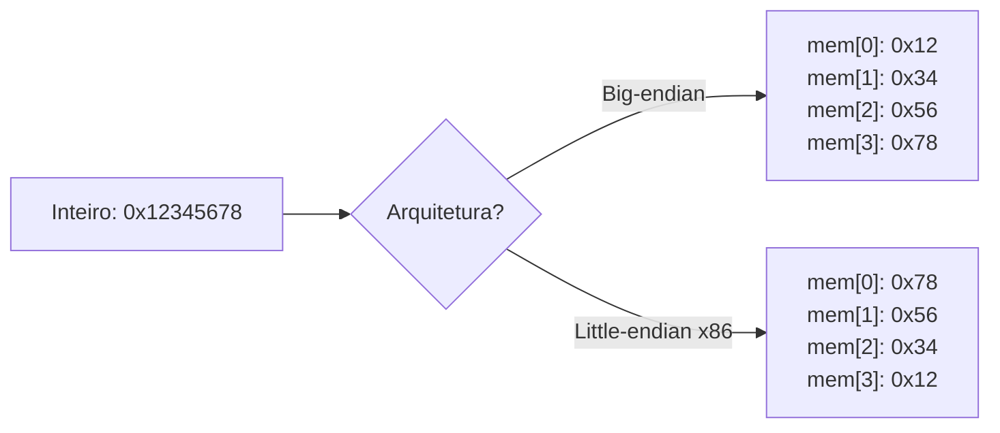
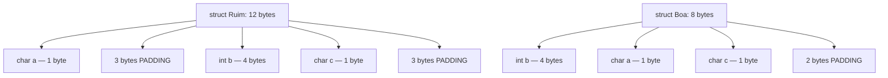
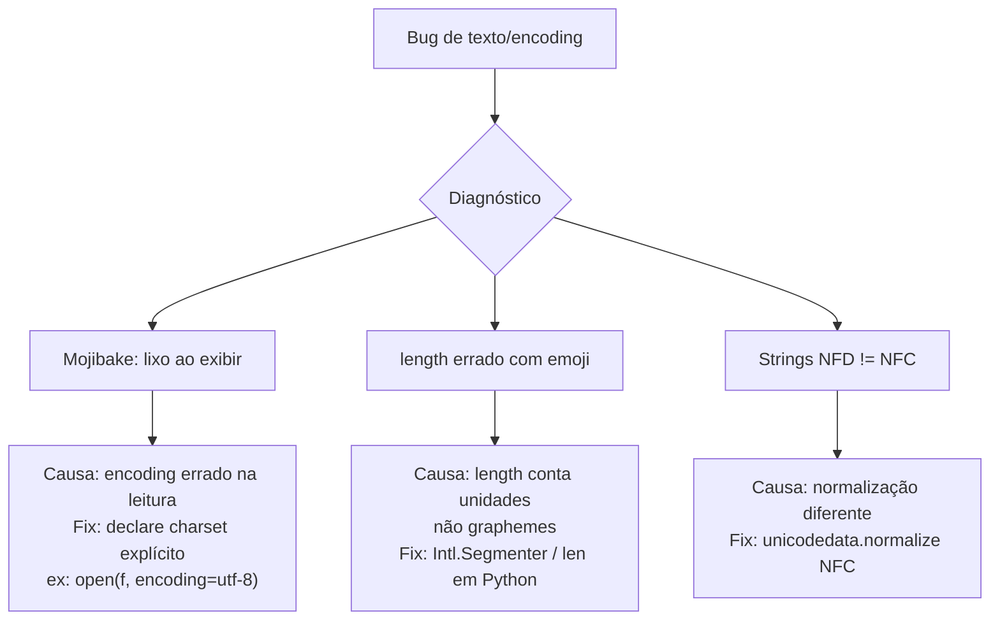

# Texto, endianness e alinhamento

> [!abstract] TL;DR
> Texto é número disfarçado: ASCII mapeou 128 caracteres em 7 bits, Unicode mapeou 1,1 milhão de pontos de código — mas mapa não é codificação. UTF-8 venceu por ser ASCII-compatível e compacto. Endianness decide qual byte de um inteiro vai para o endereço mais baixo: x86/ARM são little-endian, a rede é big-endian. Alinhamento de memória obriga o compilador a inserir padding em structs; reordenar campos na ordem "maior para menor" elimina bytes desperdiçados e melhora uso de cache.

---

## 1. Por que texto é número

O hardware só entende bits. Para armazenar a letra `A`, alguém precisou decidir: "vou usar o número 65 para representar `A`." Essa convenção — tabela que mapeia caracteres a números — é chamada **codificação de caracteres**.

Sem um acordo sobre essa tabela, dois computadores trocando bytes lêem coisas diferentes. "Plain text" não existe; todo arquivo de texto traz implícita uma codificação.

---

## 2. ASCII — o ponto de partida

O **ASCII** (American Standard Code for Information Interchange, 1963) usa 7 bits por caractere → 128 posições possíveis (`0`–`127`).

| Faixa decimal | Conteúdo |
|---|---|
| 0–31 e 127 | Controle (tab, newline, null…) |
| 32–47 | Pontuação e espaço |
| 48–57 | Dígitos `0`–`9` |
| 65–90 | Letras maiúsculas `A`–`Z` |
| 97–122 | Letras minúsculas `a`–`z` |

128 caracteres bastam para o inglês. Mas e o `ç`, o `é`, o `ñ`, o `Ö`?

A solução provisória foi usar o 8º bit extra: **Latin-1 / ISO 8859-1** mapeia 256 posições, cobrindo boa parte das línguas ocidentais. Mas 256 posições não comportam árabe, chinês, japonês, emojis — e cada região inventou sua própria extensão de 8 bits. Resultado: **mojibake** — caracteres corrompidos porque dois sistemas usam tabelas incompatíveis.

---

## 3. Unicode — o mapa universal

O **Unicode** é um **mapa de caracteres**, não uma codificação. Ele define um espaço de 1,1 milhão de **code points**, escritos como `U+XXXX` (hex).

Alguns exemplos:

| Code point | Caractere | Nome |
|---|---|---|
| U+0041 | A | LATIN CAPITAL LETTER A |
| U+00E9 | é | LATIN SMALL LETTER E WITH ACUTE |
| U+4E2D | 中 | CJK UNIFIED IDEOGRAPH |
| U+1F600 | 😀 | GRINNING FACE |

O Unicode diz *o que* é cada caractere. **Não diz como armazená-lo em bytes** — isso é função da codificação (UTF-8, UTF-16, UTF-32).

> [!note] Code point ≠ caractere visível (grapheme)
> O `é` pode ser U+00E9 (1 code point) **ou** `e` (U+0065) + combining acute (U+0301) = 2 code points. Ambos produzem o mesmo glyph. Isso se chama **normalização Unicode** (NFC vs NFD).

---

## 4. UTF-8, UTF-16 e UTF-32

A tabela abaixo resume as três principais codificações:

| Codificação | Tamanho por char | ASCII-compat? | Uso típico |
|---|---|---|---|
| UTF-8 | 1–4 bytes | ✓ | Web, Linux, maioria do mundo |
| UTF-16 | 2 ou 4 bytes | ✗ | Windows interno, Java, JS |
| UTF-32 | 4 bytes fixos | ✗ | Processamento interno raro |

### Como UTF-8 codifica um code point

UTF-8 usa prefixos de bits para indicar quantos bytes o caractere ocupa.

```
1 byte  → 0xxxxxxx           (U+0000..U+007F, ASCII puro)
2 bytes → 110xxxxx 10xxxxxx  (U+0080..U+07FF)
3 bytes → 1110xxxx 10xxxxxx 10xxxxxx       (U+0800..U+FFFF)
4 bytes → 11110xxx 10xxxxxx 10xxxxxx 10xxxxxx  (U+10000..U+10FFFF)
```

Os bytes de continuação sempre começam com `10`, o que torna qualquer byte isolado auto-identificável: você nunca confunde o início de um caractere com o meio de outro.

**Leitura do diagrama:** os `x` marcam onde os bits do code point são encaixados. Para U+00E9 (`é`), o valor decimal é 233 = `11101001b`. Cabe em 2 bytes: `11000011 10101001` = `0xC3 0xA9`.

| Bytes na memória (hex) | Significado |
|---|---|
| `41` | A (U+0041, ASCII) |
| `C3 A9` | é (U+00E9, 2 bytes UTF-8) |
| `E4 B8 AD` | 中 (U+4E2D, 3 bytes) |
| `F0 9F 98 80` | 😀 (U+1F600, 4 bytes) |

### Por que UTF-8 ganhou

1. **ASCII-compatível**: qualquer texto ASCII puro é UTF-8 válido sem alteração.
2. **Compacto**: texto em inglês/código fonte usa 1 byte por caractere.
3. **Auto-sincronizável**: se você perder o início de um caractere, pode reposicionar sem ambiguidade.
4. **Sem BOM obrigatório**: evita a confusão do Byte Order Mark (que o UTF-16 exige).

UTF-16 domina ambientes Windows e Java por razões históricas — foi adotado quando se acreditava que 2 bytes seriam suficientes para todo o Unicode. Quando o Unicode expandiu além de U+FFFF, UTF-16 precisou de **surrogate pairs** (dois `u16` encadeados para representar um code point acima de U+FFFF), complexificando o processamento.

### Surrogate pairs em detalhe

Code points de U+10000 a U+10FFFF (Supplementary Planes, onde ficam muitos emojis) não cabem em 16 bits. UTF-16 usa dois valores especiais:

- **High surrogate**: U+D800 a U+DBFF (1.024 valores)
- **Low surrogate**: U+DC00 a U+DFFF (1.024 valores)

Juntos, representam 1.024 × 1.024 = 1.048.576 code points suplementares. O emoji 😀 (U+1F600) vira o par `0xD83D 0xDE00` em UTF-16.

O problema: se você indexar uma string UTF-16 pelo índice (`str[i]`), pode cair no meio de um surrogate pair e extrair lixo. É a mesma armadilha do byte de continuação no UTF-8, só que em unidades de 16 bits.

UTF-32 resolve esse problema: cada code point ocupa exatamente 4 bytes, então `str[i]` sempre aponta para um code point válido — mas o custo de memória é 4× o do UTF-8 para texto ASCII.

### NFC vs NFD — normalização importa em comparações

O `é` pode chegar como:
- **NFC** (Canonical Decomposition followed by Canonical Composition): U+00E9 — 1 code point.
- **NFD** (Canonical Decomposition): U+0065 + U+0301 — 2 code points.

Ambos parecem idênticos na tela, mas `"é" == "é"` retorna `False` em Python quando um é NFC e o outro é NFD. Bancos de dados, índices de busca e comparações de senha podem falhar silenciosamente por isso.

Fix: normalize para NFC antes de armazenar ou comparar.

```python
import unicodedata
s_nfc = unicodedata.normalize("NFC", s)
```

---

## 5. Camadas: byte → code point → grapheme → string

Uma confusão clássica: `"😀".length` retorna `2` em JavaScript, não `1`. Por quê?

```
Camada        Significado                         Exemplo: "é😀"
-------       --------------------------------    ------------------
Byte          Unidade de armazenamento físico     C3 A9 F0 9F 98 80
Code point    Posição no mapa Unicode             U+00E9, U+1F600
Grapheme      Caractere visível (cluster)         é, 😀
```

**Leitura da tabela:** a string `"é😀"` tem 6 bytes em UTF-8, 2 code points, e 2 graphemes. Em JavaScript (UTF-16 interno), `length` conta **unidades UTF-16**: `é` = 1 unidade, `😀` = 2 unidades (surrogate pair) → `length = 3`. Para contar graphemes corretamente em JS, use `Intl.Segmenter`.

> [!warning] Armadilha do `.length` com emojis
> Em Python 3, `len("😀")` = 1 (conta code points). Em JavaScript, `"😀".length` = 2 (conta unidades UTF-16). Em Ruby, depende do encoding. **Nunca assuma que `.length` = número de caracteres visíveis.**

---

## 6. Endianness — qual byte vem primeiro?

Um inteiro de 32 bits como `0x12345678` ocupa 4 bytes na memória. Mas em qual ordem?

Depende da **arquitetura**:

- **Big-endian**: o byte mais significativo (MSB) vai para o endereço mais baixo.
- **Little-endian**: o byte menos significativo (LSB) vai para o endereço mais baixo.

### `0x12345678` em memória (4 bytes, endereços crescendo →)

| Endereço | Big-endian | Little-endian |
|---|---|---|
| `0x1000` | `0x12` | `0x78` |
| `0x1001` | `0x34` | `0x56` |
| `0x1002` | `0x56` | `0x34` |
| `0x1003` | `0x78` | `0x12` |

**Leitura da tabela:** em big-endian, leia da esquerda para a direita e você vê o número "natural" (`12 34 56 78`). Em little-endian, o byte de menor peso fica primeiro, então você lê "de trás para frente" (`78 56 34 12`). O valor inteiro é o mesmo; só a ordem dos bytes em memória difere.

x86 e ARM (modo padrão) são **little-endian**. Processadores MIPS/SPARC tradicionais e a rede TCP/IP usam **big-endian** (chamado de *network byte order*).



**Leitura do diagrama:** o mesmo inteiro produz layouts de bytes opostos. Quando você serializa dados binários e lê em outra máquina sem conversão, o valor inteiro aparece completamente diferente.

### Network byte order e as funções hton/ntoh

Protocolos de rede (IP, TCP, UDP) adotaram big-endian como padrão. Em C, as funções `htonl`/`htons` (*host to network long/short*) convertem um valor do endian da sua máquina para big-endian antes de enviar; `ntohl`/`ntohs` fazem o caminho inverso ao receber.

```c
uint32_t valor = 0x12345678;
uint32_t para_rede = htonl(valor); // big-endian, pronto pra send()
```

Em plataformas little-endian, `htonl` inverte os bytes. Em big-endian, é um no-op.

> [!tip] Endianness em arquivos binários
> Formatos como PNG, TIFF, WAV e BMP especificam explicitamente o byte order no cabeçalho. PNG usa big-endian. WAV usa little-endian. Se você ler um `uint32_t` de um arquivo WAV num processador big-endian sem converter, o valor será nonsense.

---

## 7. Alinhamento de memória

O hardware lê memória em blocos do tamanho da word (4 bytes em 32-bit, 8 bytes em 64-bit). Para que isso funcione com eficiência máxima, o compilador **alinha** cada variável no endereço múltiplo de seu tamanho.

| Tipo | Tamanho | Alinhamento típico |
|---|---|---|
| `char` | 1 byte | 1 byte (qualquer endereço) |
| `short` | 2 bytes | múltiplo de 2 |
| `int` | 4 bytes | múltiplo de 4 |
| `double` | 8 bytes | múltiplo de 8 |
| ponteiro 64-bit | 8 bytes | múltiplo de 8 |

Se um `int` estiver no endereço `0x1001` (desalinhado), o hardware precisa de **duas** leituras de 4 bytes e uma operação de recombinação. Algumas arquiteturas (ARM v6 e anteriores, MIPS) simplesmente **lançam uma exceção** em acesso desalinhado.

### Padding em structs

O compilador insere bytes de padding entre (e depois dos) campos para manter o alinhamento de cada membro.

**Struct "descuidada" — ordem char, int, char:**

```
struct Ruim {
    char  a;      // 1 byte  → endereço 0
    // 3 bytes padding
    int   b;      // 4 bytes → endereço 4
    char  c;      // 1 byte  → endereço 8
    // 3 bytes padding (para alinhar próxima instância)
};
// sizeof = 12 bytes
```

**Struct "otimizada" — maior para menor:**

```
struct Boa {
    int   b;      // 4 bytes → endereço 0
    char  a;      // 1 byte  → endereço 4
    char  c;      // 1 byte  → endereço 5
    // 2 bytes padding (alinha o final)
};
// sizeof = 8 bytes
```

A tabela abaixo ilustra o layout byte a byte das duas structs:

| Offset | `struct Ruim` | `struct Boa` |
|---|---|---|
| 0 | `a` (char) | `b` (int byte 0) |
| 1 | padding | `b` (int byte 1) |
| 2 | padding | `b` (int byte 2) |
| 3 | padding | `b` (int byte 3) |
| 4 | `b` (int byte 0) | `a` (char) |
| 5 | `b` (int byte 1) | `c` (char) |
| 6 | `b` (int byte 2) | padding |
| 7 | `b` (int byte 3) | padding |
| 8 | `c` (char) | — |
| 9–11 | padding | — |

**Leitura da tabela:** a `struct Ruim` desperdiça 6 bytes em padding; a `struct Boa` apenas 2. A regra prática: **ordene campos do maior para o menor tipo** e agrupe campos do mesmo tamanho.



**Leitura do diagrama:** os blocos de padding aparecem onde o compilador precisou "pular" bytes para alinhar o próximo campo. A versão otimizada empilha os chars menores depois do int, reduzindo o desperdício.

### Verificando alinhamento em código real

Em C/C++, use `offsetof(struct, campo)` para inspecionar onde cada campo começa:

```c
#include <stddef.h>
#include <stdio.h>

struct Ruim { char a; int b; char c; };
struct Boa  { int b; char a; char c; };

int main(void) {
    printf("Ruim: sizeof=%zu, offsetof b=%zu\n",
           sizeof(struct Ruim), offsetof(struct Ruim, b));
    printf("Boa:  sizeof=%zu, offsetof b=%zu\n",
           sizeof(struct Boa),  offsetof(struct Boa,  b));
}
// Saída típica (x86-64):
// Ruim: sizeof=12, offsetof b=4
// Boa:  sizeof=8,  offsetof b=0
```

Em Rust, o compilador reordena campos automaticamente (por padrão) para minimizar padding. Para layout exato compatível com C, use `#[repr(C)]`.

Em Go, o `unsafe.Sizeof` e `unsafe.Offsetof` expõem o mesmo. A ferramenta `fieldalignment` do `golang.org/x/tools` aponta structs subótimas automaticamente.

### Packing forçado

`#pragma pack(1)` (GCC: `__attribute__((packed))`) elimina padding. O `sizeof` diminui, mas acessos a campos desalinhados ficam lentos (ou geram exceção em algumas arquiteturas). Use apenas quando o layout binário precisa ser exato (protocolos, arquivos de formato fixo).

> [!warning] Packing e undefined behavior
> Em C, acessar um campo desalinhado por um ponteiro (`int *p = &packed.b`) é **undefined behavior** na maioria das arquiteturas. Use `memcpy` para mover os bytes explicitamente quando precisar de structs packed em código crítico.

---

## 8. Conexão com cache e localidade

Structs compactas cabem em menos cache lines. Se você tem um array de `struct Ruim` (12 bytes cada), 5 elementos ocupam 60 bytes → 1 cache line de 64 bytes quase cheia. Com `struct Boa` (8 bytes), 8 elementos cabem em 64 bytes → 37% mais elementos por cache line.

No **data-oriented design**, quando precisa iterar apenas sobre o campo `b`, cria um array separado de `int b[]` em vez de um array de structs. Assim, 16 valores de `b` cabem em uma única cache line de 64 bytes — versus 5 com a struct original.

Veja [[11 - Hierarquia de memória e localidade]] para a análise completa de cache lines e localidade espacial.

---

## 9. Prática: bugs comuns e como evitar



**Leitura do diagrama:** cada caminho representa uma classe de bug de encoding, sua causa raiz e o fix canônico. Todos têm uma causa comum: confundir as camadas (byte, code point, grapheme).

A tabela abaixo consolida as armadilhas mais frequentes em produção:

| Armadilha | Causa | Fix |
|---|---|---|
| Mojibake ao ler arquivo | Encoding errado (ex: Latin-1 em vez de UTF-8) | Declare `encoding='utf-8'` explicitamente |
| `"é".length == 2` em JS | JS usa UTF-16; `é` composto = 2 code units | Use `[...str].length` ou `Intl.Segmenter` |
| BOM inesperado no início | UTF-8 com BOM gerado pelo Windows | Abra como `utf-8-sig` no Python; strip `` |
| Campo de BD truncado | VARCHAR(10) conta bytes, não caracteres em algumas DBs | Use `NVARCHAR` ou charset utf8mb4 |
| Ordenação estranha | Normalização mista NFC/NFD | Normalize antes de comparar/indexar |
| Inteiro corrompido via rede | Endian do host ≠ network byte order | Use `htonl`/`ntohl` ou protocolo com byte order explícito |
| `sizeof(struct)` inesperado | Padding implícito do compilador | Reordene campos; use `static_assert` |
| Arquivo binário lixo | Ler WAV com lógica PNG (byte order invertido) | Leia a spec do formato; converta se necessário |

---

## 10. Base64 — texto ASCII-safe para dados binários

Às vezes você precisa transportar bytes arbitrários por um canal que só aceita ASCII (email, JSON, URLs). **Base64** codifica 3 bytes de entrada em 4 caracteres ASCII (A–Z, a–z, 0–9, +, /), expandindo o tamanho em ~33%.

Não é criptografia — é apenas transporte. Veja [[02 - Representação binária de inteiros]] para entender a aritmética de bits por trás.

---

## 11. IEEE 754 e o paralelo com texto

Assim como texto precisou de um padrão universal (Unicode), ponto flutuante precisou do [[03 - Ponto flutuante - IEEE 754]]. Em ambos os casos, a ausência de padrão gera resultados diferentes para os mesmos bytes em máquinas diferentes.

---

> [!summary] Resumo em uma linha
> Texto é número (UTF-8 ganhou); inteiros têm ordem de bytes (x86 = little-endian, rede = big-endian); structs têm padding que você pode eliminar reordenando campos do maior para o menor.

---

## Em entrevista

Esses três tópicos aparecem regularmente em telas de sistemas, entrevistas de backend e qualquer posição que lide com protocolos binários, internacionalização ou otimização de memória.

Reforce que você sabe a diferença entre Unicode (mapa) e UTF-8 (codificação). Se mencionar endianness, conecte com `htonl`/`ntohl` e com serialização binária. Para alinhamento, mostre que sabe reordenar structs e cite `sizeof`.

| Termo PT | Termo EN |
|---|---|
| Codificação de caracteres | Character encoding |
| Ponto de código | Code point |
| Grafema / cluster de grafema | Grapheme / grapheme cluster |
| Sequência de escape Unicode | Unicode escape sequence |
| Byte mais significativo | Most Significant Byte (MSB) |
| Byte menos significativo | Least Significant Byte (LSB) |
| Ordem de bytes da rede | Network byte order |
| Byte de preenchimento / padding | Padding byte |
| Estrutura empacotada | Packed struct |
| Normalização Unicode | Unicode normalization |
| Par substituto | Surrogate pair |
| Indicador de ordem de bytes | Byte Order Mark (BOM) |
| Codificação compatível com ASCII | ASCII-compatible encoding |
| Alinhamento de memória | Memory alignment |
| Mojibake | Mojibake (termo universal) |
| Ordem de bytes | Byte order / Endianness |
| Formato de transformação | Transformation format (UTF) |
| Tamanho de estrutura | `sizeof` |

*"UTF-8 is ASCII-compatible because any byte below 0x80 is a valid ASCII character and a complete UTF-8 sequence."*

*"In a little-endian system, the least significant byte is stored at the lowest memory address."*

*"Network byte order is big-endian; use `htonl` before sending integers over a socket."*

*"Unicode is a character map, not an encoding. UTF-8 is the encoding that stores Unicode code points as 1 to 4 bytes."*

*"Struct padding is inserted by the compiler to align each field to its natural alignment requirement."*

*"Reordering struct fields from largest to smallest type minimizes padding and reduces `sizeof`."*

*"A grapheme cluster is what a user perceives as a single character; it may span multiple code points."*

*"BOM in UTF-8 is unnecessary and can cause parsing issues; prefer UTF-8 without BOM."*

*"Base64 encodes arbitrary binary data as ASCII-safe text, at a cost of ~33% size increase."*

---

> [!info] Lastro
> - **Bryant, R. E. & O'Hallaron, D. R.** — *Computer Systems: A Programmer's Perspective* (CS:APP), 3rd ed. Pearson, 2015. Cap. 2 (representação de dados, endianness, alinhamento). [csapp.cs.cmu.edu](https://csapp.cs.cmu.edu/)
> - **Spolsky, J.** — "The Absolute Minimum Every Software Developer Absolutely, Positively Must Know About Unicode and Character Sets (No Excuses!)", Joel on Software, 2003. [joelonsoftware.com](https://www.joelonsoftware.com/2003/10/08/the-absolute-minimum-every-software-developer-absolutely-positively-must-know-about-unicode-and-character-sets-no-excuses/)
> - **Yergeau, F.** — RFC 3629: *UTF-8, a Transformation Format of ISO 10646*. IETF, novembro 2003. [rfc-editor.org/rfc/rfc3629](https://www.rfc-editor.org/rfc/rfc3629.html)
> - **The Unicode Consortium** — *The Unicode Standard*, versão 15.0+. [unicode.org](https://www.unicode.org/standard/standard.html) — referência canônica para code points, normalização e grapheme clusters.
> - **Patterson, D. A. & Hennessy, J. L.** — *Computer Organization and Design*, 5th ed. Morgan Kaufmann, 2014. Apêndice B (representação de números, alinhamento e byte order em RISC/x86).
