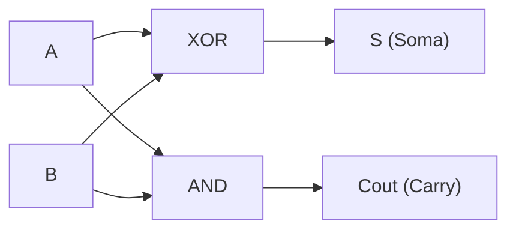
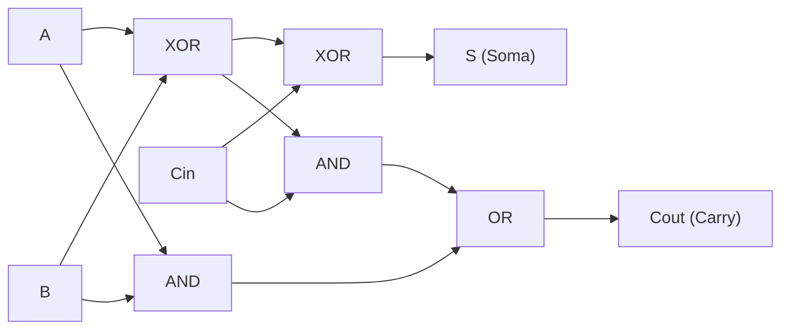
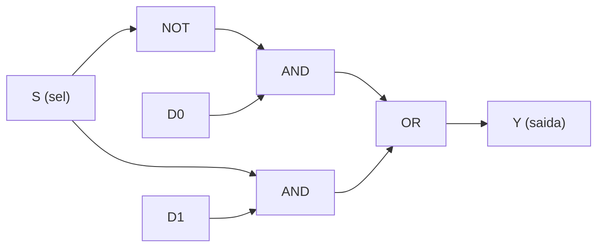
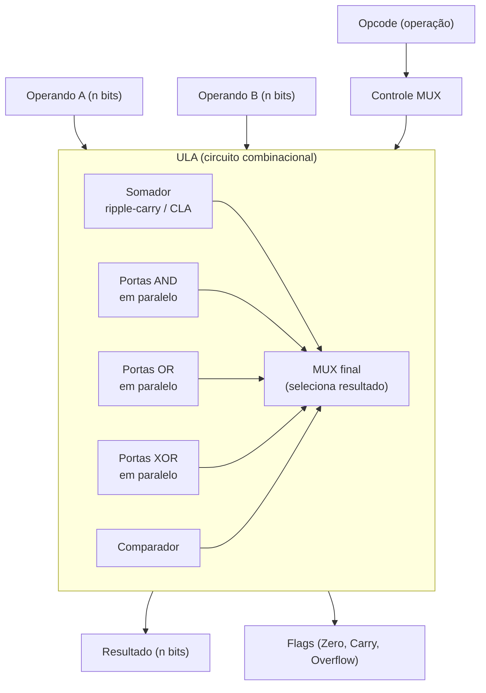
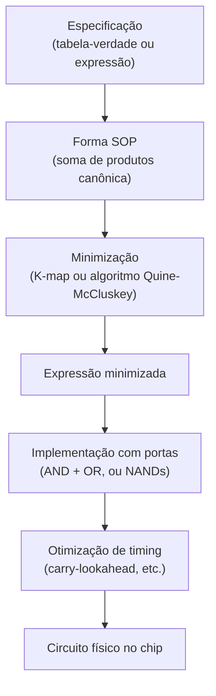

# Lógica digital: portas e circuitos combinacionais

> [!abstract] TL;DR
> A álgebra booleana — que você conhece de [[03-Dominios/Ciência/Matemática para Computação/02 - Lógica proposicional]] — ganha corpo físico aqui. Transístores viram chaves, chaves viram portas lógicas, portas viram somadores, multiplexadores e a ULA inteira. Circuito combinacional = saída é função pura das entradas, sem memória. Tudo o que seu processador faz ao executar uma instrução começa nesse nível.

---

## Do transístor à porta

O transístor MOSFET é uma chave controlada eletricamente. Quando a tensão na entrada (gate) ultrapassa um limiar, a chave fecha e corrente flui entre dreno e fonte; abaixo do limiar, a chave abre e bloqueia a corrente.

O truque da lógica digital é parar de se preocupar com a tensão exata e só perguntar: a tensão está alta ou baixa? Chamamos de **1** (HIGH) qualquer tensão acima de certo limiar e de **0** (LOW) qualquer tensão abaixo. Isso é a **abstração de dois níveis** — e é ela que transforma física analógica em matemática discreta.

A partir daí, dois transístores complementares (um PMOS + um NMOS) formam uma porta CMOS. Quando a entrada é 0, o PMOS fecha e o NMOS abre: saída 1. Quando a entrada é 1, o PMOS abre e o NMOS fecha: saída 0. Esse par é a porta NOT — a mais simples de todas.

Não vamos descer mais fundo na eletrônica. O que importa aqui é o **nível lógico**: a partir de agora, a porta é uma caixa-preta com entradas e saída, e só nos interessa a função booleana que ela computa.

---

## As sete portas fundamentais

Cada porta implementa uma função booleana. A **tabela-verdade** lista todas as combinações de entrada e a saída correspondente. É o contrato da porta.

### Tabela-verdade das portas lógicas

Leia assim: cada linha é um cenário. As colunas da esquerda são entradas; as da direita, saídas de cada porta.

| A | B | NOT A | AND | OR | NAND | NOR | XOR | XNOR |
|---|---|-------|-----|----|------|-----|-----|------|
| 0 | 0 |   1   |  0  |  0 |   1  |  1  |  0  |   1  |
| 0 | 1 |   1   |  0  |  1 |   1  |  0  |  1  |   0  |
| 1 | 0 |   0   |  0  |  1 |   1  |  0  |  1  |   0  |
| 1 | 1 |   0   |  1  |  1 |   0  |  0  |  0  |   1  |

> [!note] Leitura da tabela
> NOT só depende de A (coluna B é contexto). NAND é o inverso de AND: devolve 0 apenas quando ambas as entradas são 1. NOR é o inverso de OR: devolve 1 apenas quando ambas as entradas são 0. XOR (exclusive-or) retorna 1 quando as entradas **diferem** — perceba que é exatamente o padrão da soma binária sem carry.

### Referência rápida: porta → expressão → uso

A tabela abaixo é um atalho de consulta. Os símbolos Unicode na coluna de expressão são os mesmos da [[03-Dominios/Ciência/Matemática para Computação/02 - Lógica proposicional]].

| Porta | Expressão booleana | Uso típico |
|-------|--------------------|------------|
| NOT   | ¬A                 | inversão de sinal, complemento |
| AND   | A ∧ B              | máscara de bits, detecção de condição |
| OR    | A ∨ B              | combinar flags, união de bits |
| NAND  | ¬(A ∧ B)           | porta universal; base física CMOS |
| NOR   | ¬(A ∨ B)           | porta universal; base física NOR lógica |
| XOR   | A ⊕ B              | soma binária, paridade, swap, criptografia |
| XNOR  | ¬(A ⊕ B) = A ≡ B   | comparador de igualdade bit a bit |

---

## NAND e NOR são universais — e isso importa de verdade

Uma porta é **universal** quando você consegue construir qualquer outra porta — e portanto qualquer função booleana — usando só aquele tipo de porta.

NAND é universal. Veja:

- NOT A = NAND(A, A)
- AND(A,B) = NAND(NAND(A,B), NAND(A,B))
- OR(A,B) = NAND(NAND(A,A), NAND(B,B))

Por que isso importa para hardware? Porque o fabricante de chips só precisa implementar **um tipo de célula** na silício. Toda a lógica de um processador pode ser construída com NANDs. Isso simplifica o processo de fabricação, reduz área, padroniza timing. Na prática, CPUs modernas usam uma biblioteca de células que inclui vários tipos — mas o conceito de universalidade explica por que é fisicamente viável colocar bilhões de portas num único chip.

> [!tip] Regra de ouro
> Se você vê NAND em qualquer entrevista de sistemas ou arquitetura, a resposta esperada é: "NAND é universal — qualquer função booleana pode ser expressa só com NANDs". NOR também é universal, mas NAND domina na prática CMOS.

---

## Álgebra booleana aplicada a circuitos

A [[03-Dominios/Ciência/Matemática para Computação/02 - Lógica proposicional]] define as leis que governam expressões booleanas. No contexto de circuitos, essas leis têm consequências práticas diretas: **simplificar a expressão = remover portas = circuito mais rápido e barato**.

As leis mais usadas na simplificação de circuitos:

- **Identidade**: A ∧ 1 = A ; A ∨ 0 = A
- **Nulidade**: A ∧ 0 = 0 ; A ∨ 1 = 1
- **Idempotência**: A ∧ A = A ; A ∨ A = A
- **Complemento**: A ∧ ¬A = 0 ; A ∨ ¬A = 1
- **Dupla negação**: ¬(¬A) = A
- **Comutativa**: A ∧ B = B ∧ A ; A ∨ B = B ∨ A
- **Associativa**: (A ∧ B) ∧ C = A ∧ (B ∧ C)
- **Distributiva**: A ∧ (B ∨ C) = (A ∧ B) ∨ (A ∧ C)
- **Absorção**: A ∧ (A ∨ B) = A ; A ∨ (A ∧ B) = A
- **De Morgan**: ¬(A ∧ B) = ¬A ∨ ¬B ; ¬(A ∨ B) = ¬A ∧ ¬B

De Morgan merece destaque. Ela diz que negar AND vira OR com entradas negadas — e vice-versa. Em circuitos: uma porta NAND é equivalente a uma porta OR com entradas invertidas. Esse par de transformações é o que permite trocar portas entre si durante otimização.

### Minimização e mapas de Karnaugh

Dada uma função booleana qualquer, existe sempre uma expressão **mínima** com o menor número de literais e termos. Encontrar essa expressão é o problema de **minimização**.

O **mapa de Karnaugh (K-map)** é uma grade bidimensional em que cada célula representa uma linha da tabela-verdade. As células estão organizadas em código Gray (só um bit muda entre vizinhos). Agrupar células adjacentes com valor 1 em blocos de tamanho 2ⁿ elimina variáveis: um bloco de 2 elimina 1 variável, de 4 elimina 2, de 8 elimina 3.

O resultado de agrupar os blocos é uma expressão na forma **soma de produtos (SOP)**: cada grupo vira um termo AND (produto), os grupos se somam com OR (soma). SOP é a forma canônica mais comum para implementar combinacionais, pois mapeie direto em dois andares de portas: primeiro um nível de ANDs, depois um OR.

> [!example] Exemplo rápido de minimização
> Função F(A,B,C) = ¬A·¬B·C + ¬A·B·C + A·B·C + A·B·¬C
>
> No K-map, os quatro mintérios formam dois grupos: {¬A·¬B·C, ¬A·B·C} → reduz a ¬A·C; e {¬A·B·C, A·B·C, A·B·¬C} → o par {A·B·C, A·B·¬C} reduz a A·B; o par {¬A·B·C, A·B·C} reduz a B·C. Resultado final: F = ¬A·C ∨ A·B. De 4 termos com 3 literais cada → 2 termos com 2 literais. Menos portas, menor latência.

---

## Circuitos combinacionais

Um circuito **combinacional** (ou combinatório) é aquele em que a saída depende **apenas e somente** das entradas atuais. Não há memória, não há estado, não há feedback. Você coloca as entradas, espera o sinal se propagar pelas portas (propagation delay), e a saída aparece.

Isso contrasta com circuitos **sequenciais**, que têm estado interno e dependem de entradas passadas. Sequenciais são o próximo passo — veja [[06 - Circuitos sequenciais e memória]].

### O half adder

Pergunta: como você soma dois bits A e B com portas lógicas?

A soma bit a bit segue exatamente a tabela do XOR: 0+0=0, 0+1=1, 1+0=1, 1+1=0 (com carry). O carry gerado é o AND dos dois bits.

Então: **Soma (S) = A ⊕ B** e **Carry-out (Cout) = A ∧ B**.

O **half adder** é exatamente essa dupla de portas: um XOR e um AND.



> [!note] Leitura do diagrama
> A e B entram tanto no XOR quanto no AND. O XOR gera o bit de soma (o resultado "baixo"); o AND gera o carry (o "transporte" para a próxima coluna). É chamado de *half* adder porque ele só soma dois bits — não aceita um carry vindo de uma coluna anterior.

### O full adder

Para somar colunas internas de um número multi-bit, você precisa aceitar um **carry de entrada (Cin)** vindo da coluna anterior. Isso é o **full adder**.

A lógica: S = A ⊕ B ⊕ Cin e Cout = (A ∧ B) ∨ (Cin ∧ (A ⊕ B)).



> [!note] Leitura do diagrama
> O primeiro XOR combina A e B; o segundo XOR adiciona Cin ao resultado intermediário, produzindo S. O carry de saída Cout é 1 se pelo menos dois dos três bits de entrada forem 1 — por isso temos dois ANDs verificando pares possíveis e um OR que une os casos.

### Somador ripple-carry de n bits

Para somar números de n bits, encadeie n full adders: o Cout de cada posição alimenta o Cin da posição seguinte. Isso se chama **somador ripple-carry** (o carry "ripple" — propaga em ondas da coluna menos significativa para a mais significativa).

O problema do ripple é a latência: para calcular o carry da posição 63, o circuito precisa esperar o carry se propagar pelas 63 colunas anteriores. Para n=64 bits, o caminho crítico tem 64 × (delay de um full adder). CPUs modernas usam **carry-lookahead** (CLA): um circuito extra calcula antecipadamente se um grupo de bits vai gerar ou propagar carry, cortando o caminho crítico de O(n) para O(log n). Mas a ideia base do full adder encadeado é o mesmo em ambos os casos.

### Multiplexador (MUX)

O **multiplexador** (MUX) é o circuito "seletor de canal". Ele tem 2ⁿ entradas de dados, n entradas de seleção (sel), e uma saída. Dependendo do valor de sel, a saída copia a entrada correspondente.

O MUX 2-para-1 é o mais básico: uma entrada de seleção S, duas entradas de dados D0 e D1, e a saída Y.

- Se S=0 → Y = D0
- Se S=1 → Y = D1

Expressão booleana: Y = (¬S ∧ D0) ∨ (S ∧ D1)



> [!note] Leitura do diagrama
> NOT inverte S para habilitar o caminho de D0 quando S=0. Os dois ANDs são os "interruptores" de cada canal; o OR final combina os dois caminhos (só um estará ativo em cada momento). MUXes são usados em registradores de propósito geral para selecionar qual entrada alimenta um registrador, em unidades de controle, e como blocos básicos para implementar qualquer função booleana (MUX de 2ⁿ entradas pode implementar qualquer função de n variáveis direto na tabela-verdade).

### Decoder

O **decoder** (decodificador) faz o inverso: recebe n bits de entrada e ativa exatamente uma das 2ⁿ saídas. Um decoder 2-para-4 com entradas A e B ativa uma das 4 linhas de saída:

- Y0 = ¬A ∧ ¬B (ativo quando A=0, B=0)
- Y1 = ¬A ∧ B  (ativo quando A=0, B=1)
- Y2 = A ∧ ¬B  (ativo quando A=1, B=0)
- Y3 = A ∧ B   (ativo quando A=1, B=1)

Decoders aparecem em bancos de memória (selecionar qual linha ou coluna acessar) e em unidades de controle de processadores (decodificar o opcode de uma instrução e ativar o caminho de controle correto).

### Comparador

O **comparador** verifica igualdade entre dois valores. Para um comparador de 1 bit: A = B quando A ≡ B, ou seja, quando XNOR(A,B) = 1. Para n bits: A = B quando todos os pares de bits correspondentes são iguais, o que é um AND de n XNORs. Comparadores estão em todo lugar: branches em código (`if a == b`) passam por hardware de comparação na ULA.

---

## Como a ULA é construída com esses blocos

A **Unidade Lógica e Aritmética (ULA)** — o coração computacional da CPU — é um circuito combinacional. Ela recebe dois operandos A e B, um sinal de controle que codifica a operação desejada, e produz um resultado.

Internamente, a ULA contém:
- Um somador ripple-carry (ou carry-lookahead) para ADD/SUB
- Portas AND, OR, XOR em paralelo para operações bit a bit
- Um comparador para SLT (set less than)
- Um MUX final que, controlado pelo opcode, seleciona qual resultado enviar para a saída

Tudo isso é combinacional — não há memória, não há clock dentro da ULA. O clock entra nos registradores que alimentam e absorvem os resultados da ULA, que são circuitos sequenciais. Mais sobre isso em [[06 - Circuitos sequenciais e memória]] e a visão de alto nível em [[01 - O que é organização de computadores]].



> [!note] Leitura do diagrama
> Todos os subcircuitos (somador, ANDs, ORs, XORs, comparador) computam em **paralelo** a partir de A e B. O MUX final — controlado pelo opcode — escolhe qual resultado sai. Flags são bits extras produzidos pelo somador (carry de saída = Cout, resultado zero = NOR de todos os bits do resultado).

---

## Combinacional × Sequencial: a linha divisória

> [!info] Diferença fundamental
> **Combinacional**: saída = f(entradas atuais). Sem memória. Sem clock.
> **Sequencial**: saída = f(entradas atuais, estado atual). Com memória. Clock necessário.
>
> Todo circuito útil em um computador usa os dois: combinacional para **computar**, sequencial para **lembrar**. Registradores, flip-flops e memórias são sequenciais — veja [[06 - Circuitos sequenciais e memória]].

A linha divisória é o **elemento de estado** (flip-flop ou latch). Enquanto não há nenhum, o circuito é combinacional por definição. Basta introduzir um flip-flop ativado por clock e você tem estado — e portanto sequência.

---

## Prática para devs: isso aparece no seu código

Por que um desenvolvedor de software deve saber lógica digital?

Porque as **operações de bit** da sua linguagem de programação (`&`, `|`, `^`, `~`, `<<`, `>>`) são literalmente essas portas aplicadas em **paralelo** em todos os 32 ou 64 bits de uma palavra de uma só vez. Quando você escreve `a & b` em C ou Java, a CPU executa 64 AND gates simultaneamente, um por bit.

Isso conecta diretamente com [[02 - Representação binária de inteiros]]: os bits que representam inteiros na memória são exatamente os fios que entram nessas portas.

> [!example] Usos práticos de portas no código
>
> **XOR para swap sem variável temporária** (funciona porque A ⊕ A = 0 e A ⊕ 0 = A):
> ```
> a = a ^ b
> b = a ^ b
> a = a ^ b
> ```
>
> **XOR para paridade** (paridade de um conjunto de bits é XOR de todos — resultado 0 = número par de 1s):
> Usado em memória ECC, RAID, checksums.
>
> **XOR em criptografia** (cifra de Vernam / OTP): F ⊕ K = C e C ⊕ K = F. Porta XOR é reversível quando você conhece um dos operandos.
>
> **AND para máscara de bits**: `flags & 0x01` testa se o bit 0 está ligado. `flags & MASK` isola um grupo de bits.
>
> **OR para setar bits**: `flags | BIT3` liga o bit 3 sem alterar os demais.

### HDL: descrever circuitos como código

**Hardware Description Languages (HDL)** como Verilog e VHDL permitem descrever circuitos digitais em texto, da mesma forma que você escreveria software — mas o compilador (síntese) gera um circuito físico, não bytecode.

Um full adder em Verilog é apenas:
```verilog
module full_adder(input A, B, Cin, output S, Cout);
  assign S    = A ^ B ^ Cin;
  assign Cout = (A & B) | (Cin & (A ^ B));
endmodule
```

A síntese mapeia as expressões booleanas para a biblioteca de células da fábrica (que pode usar só NANDs, ou uma mistura). Isso fecha o círculo: código → expressão booleana → minimização → portas físicas.

Entender lógica digital é entender o que o compilador de hardware está fazendo por baixo.

---

## Fluxo completo: da função booleana ao circuito



> [!note] Leitura do diagrama
> O fluxo mostra o pipeline de design digital: começa com o que o circuito deve fazer (spec), normaliza em SOP, minimiza com K-map, implementa com portas, otimiza para timing e área, e entrega um netlist que a fundição transforma em silício. Ferramentas EDA (Electronic Design Automation) como Synopsys Design Compiler automatizam os passos de minimização e otimização.

---

> [!summary] Resumo em uma linha
> Transístores viram portas lógicas, portas implementam álgebra booleana, e circuitos combinacionais — especialmente somadores e MUXes — constroem a ULA: o núcleo de todo cálculo que seu processador realiza.

---

## Em entrevista

Lógica digital aparece em entrevistas de sistemas (arquitetura de computadores, low-level programming, hardware engineering, embedded) e como contexto de resposta para questões sobre operações de bit.

Quando perguntarem sobre bitwise operators, mencione que são as mesmas operações das portas lógicas aplicadas em paralelo a n bits. Quando perguntarem sobre soma inteira, o full adder é o ponto de partida certo.

Frases de efeito em inglês:

- *"A transistor is just a voltage-controlled switch — logic gates are built by composing PMOS and NMOS transistors."*
- *"NAND is functionally complete: any Boolean function can be implemented using only NAND gates."*
- *"A combinational circuit's output is a pure function of its current inputs — no state, no clock."*
- *"A half adder is XOR for sum and AND for carry; a full adder chains two half adders to accept a carry-in."*
- *"Ripple-carry addition has O(n) latency; carry-lookahead cuts it to O(log n) by computing carries in parallel."*
- *"A multiplexer selects one of 2ⁿ inputs based on n select lines — it's the hardware if-else."*
- *"De Morgan's law lets you swap AND and OR gates, which is how synthesis tools optimize circuits."*
- *"XOR is reversible: A ⊕ B ⊕ B = A — that's why it appears in swap tricks and stream ciphers."*
- *"Bitwise operators in code (&, |, ^, ~) map directly to AND, OR, XOR, NOT gates operating in parallel on all bits of a word."*

### Glossário PT → EN

| Português | English |
|-----------|---------|
| Porta lógica | Logic gate |
| Transístor | Transistor |
| Tabela-verdade | Truth table |
| Álgebra booleana | Boolean algebra |
| Porta universal | Functionally complete gate |
| Circuito combinacional | Combinational circuit |
| Meio somador | Half adder |
| Somador completo | Full adder |
| Carry de propagação | Ripple carry |
| Carry antecipado | Carry-lookahead (CLA) |
| Multiplexador | Multiplexer (MUX) |
| Decodificador | Decoder |
| Comparador | Comparator |
| Soma de produtos | Sum of products (SOP) |
| Minimização | Logic minimization |
| Mapa de Karnaugh | Karnaugh map (K-map) |
| Linguagem de descrição de hardware | Hardware Description Language (HDL) |
| Unidade Lógica e Aritmética | Arithmetic Logic Unit (ALU) |

---

> [!info] Lastro
>
> - Patterson, D. A. & Hennessy, J. L. *Computer Organization and Design: The Hardware/Software Interface* (5ª ed., RISC-V ed.). Morgan Kaufmann. **Appendix B: The Basics of Logic Design** — cobre gates, tabelas-verdade, álgebra booleana, somadores, MUXes e PLAs. ISBN 978-0-12-374150-1.
>
> - Tanenbaum, A. S. *Structured Computer Organization* (6ª ed.). Pearson. **Capítulo 3: The Digital Logic Level** — apresenta a abstração de níveis, gates como objetos fundamentais do nível digital, e combina gates em flip-flops e memória de 1 bit. ISBN 978-0-13-291652-3.
>
> - Harris, D. & Harris, S. L. *Digital Design and Computer Architecture* (2ª ed., RISC-V ed.). Morgan Kaufmann / Elsevier. **Capítulos 1–2** — lógica booleana, portas, tabelas-verdade, K-maps, SOP, circuitos combinacionais (adders, MUX, decoder), e introdução a HDL (SystemVerilog e VHDL). ISBN 978-0-12-820064-3.
>
> - Mano, M. M. & Ciletti, M. D. *Digital Design* (5ª ed.). Pearson. Referência clássica para minimização e K-maps — cobre redução de soma de produtos e mapa de Karnaugh até 6 variáveis.
>
> - IEEE Standard 1364-2005 (Verilog HDL) / IEEE Standard 1076-2008 (VHDL) — padrões que definem as linguagens usadas para descrever e sintetizar circuitos digitais.

---

*Próxima nota: [[06 - Circuitos sequenciais e memória]] — flip-flops, latches, registradores e o papel do clock.*
*Nota anterior: [[01 - O que é organização de computadores]]*
*Contexto de representação binária: [[02 - Representação binária de inteiros]]*
