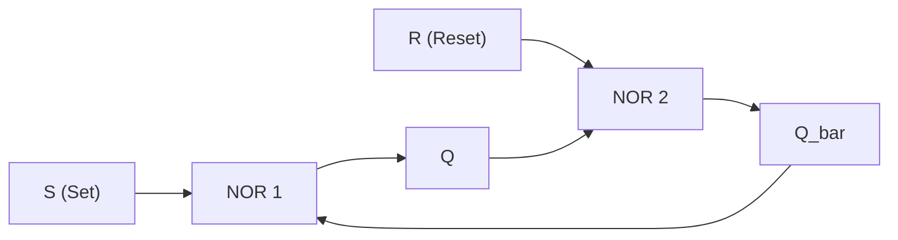
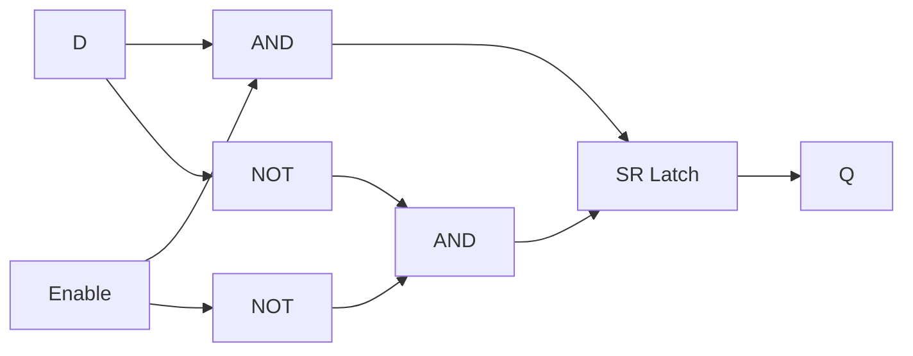
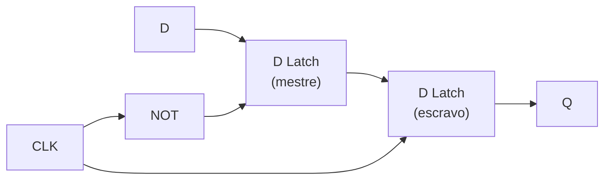
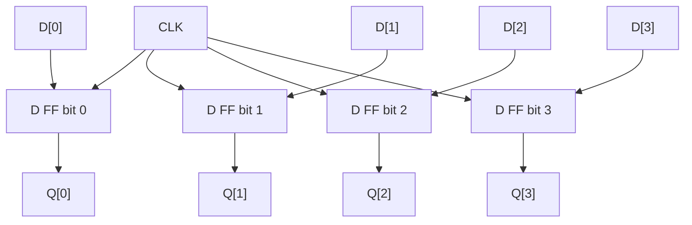
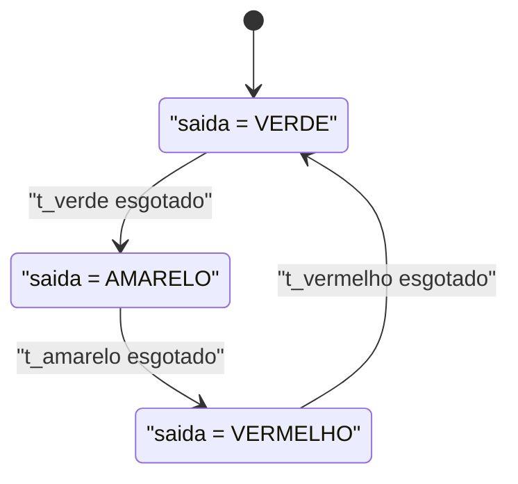
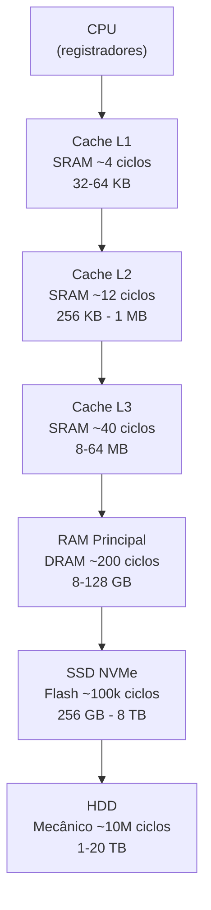

# Circuitos sequenciais e memória

> [!abstract] TL;DR
> Circuitos combinacionais calculam; circuitos sequenciais **lembram**. A diferença é o estado: um flip-flop guarda 1 bit usando realimentação entre portas lógicas. O clock sincroniza quando esse estado muda. Latches, registradores, contadores e FSMs são construídos em cima desse bloco mínimo. SRAM (flip-flops) e DRAM (capacitores) são as duas famílias de memória semicondutora — cada uma ocupa um andar diferente da hierarquia por velocidade, custo e densidade.

---

## 1. Combinacional × sequencial: o salto que permite lembrar

Em [[05 - Lógica digital - portas e circuitos combinacionais]] você viu que circuitos combinacionais são funções puras: dada uma entrada, a saída é imediatamente determinada. Sem história. Sem memória. Uma porta AND não sabe o que aconteceu 1 nanosegundo atrás.

Mas computadores precisam **lembrar**.

Precisam saber que o botão foi pressionado, que a instrução anterior produziu carry, que o processo A já entrou na região crítica. Isso exige **estado** — a capacidade de guardar um valor entre dois instantes de tempo.

Circuitos **sequenciais** introduzem essa dimensão: a saída depende não só das entradas atuais, mas também do **estado interno armazenado**. Matematicamente:

```
saída = f(entradas, estado)
próximo_estado = g(entradas, estado)
```

A diferença parece abstrata. Na prática, é concreta: você precisa de **realimentação** — a saída de uma porta voltando como entrada de outra. Esse loop estabiliza em 0 ou 1 e **persiste** mesmo que a entrada original suma.

Pense em termos de programação: circuitos combinacionais são funções puras — `f(x) = y`, sem efeitos colaterais, sem variáveis globais. Circuitos sequenciais são como objetos com estado interno — a mesma chamada de método pode retornar resultados diferentes dependendo do histórico de chamadas anteriores. O "objeto" aqui é o flip-flop; o "estado" é o bit armazenado.

Essa analogia não é superficial. Máquinas de estados finitas em software (autômatos de protocolo HTTP, parsers, gerenciadores de conexão) são implementadas em silício da mesma forma: um registrador de estado e lógica combinacional de transição. A abstração é a mesma nos dois níveis.

> [!tip] Analogia
> Um interruptor de luz é combinacional: você segura, acende; solta, apaga. Um **interruptor de travamento** (como os de salas de servidor) é sequencial: você pressiona uma vez para ligar, pressiona de novo para desligar. O estado (ligado/desligado) persiste independentemente da entrada. Toda vez que você "toggle" um boolean em código, está modelando a mesma lógica que um SR latch implementa em hardware.

---

## 2. O clock: quem diz "agora"

Imagine que vários flip-flops atualizam seu estado em momentos ligeiramente diferentes. Os sinais chegam fora de ordem. O sistema fica incoerente — exatamente como uma condição de corrida em software, onde duas threads leem e escrevem uma variável sem sincronização.

O **clock** resolve isso com pulsos periódicos. Em design **síncrono**, todos os elementos de memória do chip são conectados ao mesmo sinal de clock. Eles atualizam seu estado apenas na **borda de subida** (ou descida, dependendo do projeto) desse pulso.

```
clock:   __|‾|__|‾|__|‾|__
                ↑   ↑   ↑
           aqui os flip-flops capturam novo valor
```

Essa coordenação global garante que quando um flip-flop lê a saída de outro, o dado já estabilizou do ciclo anterior. Sem o clock, circuitos de qualquer complexidade razoável seriam impossíveis de construir corretamente.

O clock não é apenas um sinal elétrico — é uma **convenção de tempo compartilhada** entre todos os elementos do chip. É como se houvesse um maestro batendo o compasso: enquanto a batuta está no ar (clock=0), os músicos se preparam; quando ela cai (borda de subida), todos tocam juntos. Nenhum viola o tempo do outro.

Distribuir esse sinal pelo chip de forma uniforme é um dos problemas mais difíceis do design de hardware. Processadores modernos têm redes de distribuição de clock que garantem que o sinal chegue a bilhões de transistores com diferenças de chegada na casa dos picossegundos.

> [!info] Frequência e throughput
> A frequência do clock (em GHz) é o teto de operações por segundo. Se o clock bate a 3 GHz, o processador tem ≈ 333 ps para estabilizar cada operação. Um ciclo de clock a 3 GHz é menor que 1 milímetro de distância que a luz percorre no vácuo. Isso é uma fronteira física dura — voltaremos ao tema no timing.

---

## 3. SR Latch: a malha que guarda 1 bit

O elemento mais primitivo de memória é o **SR latch** (Set-Reset). Ele usa duas portas NOR (ou NAND) com as saídas realimentadas cruzadas nas entradas.

O diagrama abaixo mostra a versão com NOR:



**Leitura do diagrama:** S entra na NOR 1 junto com a saída Q̄ (complemento de Q). A saída Q entra na NOR 2 junto com R. As saídas Q e Q̄ se realimentam mutuamente. Esse loop cria dois estados estáveis.

Tabela de operação (NOR):

| S | R | Q (próximo) | Observação             |
|---|---|-------------|------------------------|
| 0 | 0 | Q (mantém)  | Estado de memória      |
| 1 | 0 | 1           | Set — força Q=1        |
| 0 | 1 | 0           | Reset — força Q=0      |
| 1 | 1 | indefinido  | Estado proibido        |

Por que funciona? Quando S=1 e R=0: a NOR 1 vê S=1, logo sua saída Q=0. A NOR 2 vê R=0 e Q=0, logo Q̄=1. Agora S volta a 0: a NOR 1 vê S=0 e Q̄=1, portanto Q continua 0. **O estado se autoestabiliza.** Esse é o mecanismo de memória: o feedback evita que o circuito "esqueça" quando a entrada some.

> [!warning] Estado proibido
> S=R=1 força Q=Q̄=0 simultaneamente, violando a invariante Q ≠ Q̄. Quando ambas voltam a 0, o estado final depende de qual NOR responde primeiro — comportamento não-determinístico. Latches NAND têm o estado proibido em S=R=0.

---

## 4. D Latch: transparente por nível

O SR latch tem o problema do estado proibido. O **D latch** elimina isso com uma única entrada de dado (D) e uma entrada de habilitação (Enable/WE).

Quando Enable=1: Q segue D imediatamente (transparente).
Quando Enable=0: Q congela no último valor capturado.



**Leitura do diagrama:** o D latch é basicamente um SR latch com a entrada D convertida em S e ¬D em R, ambos habilitados pela entrada Enable. Quando Enable=0, S=R=0 e o latch mantém o estado.

O problema do D latch transparente: se Enable ficar alto por muito tempo, ruído em D propaga direto para Q. Isso complica o timing em sistemas com múltiplos estágios.

---

## 5. D Flip-Flop: captura no flanco

O **D flip-flop** (edge-triggered) resolve o problema do D latch. Em vez de ser transparente por nível, ele captura D **somente na borda de subida do clock**. Entre dois flancos, Q fica congelado independente do que D faça.

A implementação clássica usa dois D latches em série ("mestre-escravo"):



**Leitura do diagrama:** quando CLK=0, o latch mestre é transparente e captura D; o escravo está travado. Quando CLK sobe para 1, o mestre trava (congela o valor) e o escravo torna-se transparente, propagando o valor para Q. Resultado: Q muda apenas na borda de subida do CLK.

**Latch × flip-flop — a diferença fundamental:**

| Característica  | Latch              | Flip-flop                 |
|-----------------|--------------------|---------------------------|
| Sensível a      | Nível (0 ou 1)     | Flanco (borda)            |
| Transparência   | Sim, quando EN=1   | Nunca (captura pontual)   |
| Uso típico      | Estágio de captura | Registradores, pipelines  |
| Previsibilidade | Mais delicada      | Alta (timing controlado)  |

> [!note] Por que o flip-flop domina o design síncrono
> Em um pipeline de CPU, você precisa que o valor de um estágio não "vaze" para o próximo no mesmo ciclo. O flip-flop garante isso: cada estágio lê a saída do anterior no flanco, processa durante o ciclo, e o resultado só avança no flanco seguinte.

---

## 6. Registradores, register files e contadores

Um único flip-flop guarda 1 bit. Coloque **n flip-flops em paralelo**, todos compartilhando o mesmo clock, e você tem um **registrador de n bits**.



**Leitura do diagrama:** quatro flip-flops D em paralelo, com clock compartilhado. Todos capturam seus bits de entrada simultaneamente na borda. Isso é um registrador de 4 bits.

**Register file** é um array de registradores com lógica de seleção: você endereça qual registrador ler ou escrever por meio de sinais de seleção. Na arquitetura RISC-V, o register file tem 32 registradores de 64 bits. Eles são construídos inteiramente de flip-flops — são os elementos de armazenamento mais rápidos da hierarquia, e por isso há tão poucos (caros em área de silício).

**Contador** é um registrador especial cuja entrada é a saída somada de 1 a cada ciclo:

```
Q_próximo = Q_atual + 1
```

O Program Counter (PC) da CPU é um contador que avança de instrução em instrução.

**Shift register** desloca os bits a cada ciclo: o bit n passa para n+1. Útil para serialização e interfaces como SPI e UART. Um shift register de 8 bits pode converter dados paralelos (8 fios simultâneos) em dados seriais (1 fio, 8 ciclos) — o que acontece dentro de praticamente todo periférico de comunicação.

**Contador de programa (PC)** é o registrador mais importante da CPU. Ele aponta para o endereço da próxima instrução a ser buscada. A cada ciclo, ou incrementa (instrução sequencial) ou é carregado com um novo endereço (salto, chamada de função). Toda vez que você escreve `return` em uma função, o compilador gera código que restaura o PC para o endereço salvo na pilha — mecanismo inteiramente implementado em registradores e memória sequencial. O stack pointer (SP) é outro registrador que aponta para o topo da pilha de chamadas — cada `push` decrementa SP, cada `pop` incrementa.

> [!question] Por que registradores são tão poucos?
> Cada flip-flop ocupa área de silício e consome energia de leakage continuamente. Um register file de 32 registradores de 64 bits são 32 × 64 = 2.048 flip-flops, mais a lógica de multiplexação e endereçamento. Duplicar o número de registradores quase dobraria a área do register file e aumentaria o consumo — além de tornar a decodificação de instrução mais complexa (mais bits por campo de registrador na instrução). A escassez de registradores é uma razão pela qual compiladores têm algoritmos sofisticados de alocação de registradores.

---

## 7. Máquinas de estado finitas em hardware (FSM)

Todo sistema digital com comportamento que depende da história pode ser modelado como uma **máquina de estados finita** (FSM). O hardware implementa isso com:

- Um **registrador de estado** (flip-flops que guardam o estado atual)
- **Lógica combinacional de próximo estado** (calcula para onde ir)
- **Lógica combinacional de saída** (calcula o que produzir)

**Moore** vs **Mealy:**

- **Moore**: saída depende só do estado atual. A saída muda apenas quando o estado muda, portanto somente nas bordas de clock. Mais simples de raciocinar e de sincronizar com o resto do sistema.
- **Mealy**: saída depende do estado **e** das entradas atuais. A saída pode mudar dentro do mesmo ciclo, sem esperar o próximo flanco. Isso permite responder mais rápido em 1 ciclo a menos, mas cria caminhos combinacionais entre entrada e saída que complicam o timing.

Na prática, a maioria das implementações de controle em hardware usa Moore por ser mais segura. Mealy aparece quando a latência de 1 ciclo importa muito, como em alguns protocolos de handshake.

Exemplo: FSM de um semáforo simplificado (Moore).



**Leitura do diagrama:** três estados (Verde, Amarelo, Vermelho). A saída é determinada pelo estado, não pela entrada — característico de Moore. As transições ocorrem quando o temporizador de cada fase esgota. O registrador de estado é atualizado a cada ciclo de clock.

A **unidade de controle de uma CPU é uma FSM**. Ela percorre estados como "buscar instrução", "decodificar", "executar", "escrever resultado" — o famoso ciclo de instrução que veremos em [[07 - Arquitetura de von Neumann e o ciclo de instrução]]. Cada estado da FSM de controle produz os sinais que ativam a ALU, o register file, a memória. Em CPUs modernas com pipeline, a FSM de controle gerencia também os hazards: stalls de dado (esperar um resultado que ainda está sendo calculado), stalls de controle (aguardar o destino de um salto), e flushes de pipeline (descartar instruções erradas após uma predição de salto incorreta).

> [!example] FSM de controle de cache
> Quando a CPU solicita um dado e ele não está na cache (cache miss), a FSM de controle percorre estados: "detectar miss" → "requisitar bloco à DRAM" → "aguardar resposta" → "escrever na cache" → "entregar dado". Cada estado é um conjunto de sinais de controle. Conecta diretamente com [[11 - Hierarquia de memória e localidade]].

---

## 8. Tecnologias de memória: SRAM, DRAM e flash

Todos os flip-flops que você viu até agora são a base da **SRAM**. Mas há outras formas de armazenar bits. A tabela abaixo sintetiza as três principais famílias:

| Tecnologia | Princípio      | Velocidade     | Densidade | Volátil | Uso típico              |
|------------|----------------|----------------|-----------|---------|-------------------------|
| SRAM       | 6 transistores (cross-coupled) | ~0,5–2 ns    | Baixa     | Sim     | Cache L1/L2/L3, register file |
| DRAM       | 1 transistor + 1 capacitor     | ~50–100 ns   | Alta      | Sim     | RAM principal (DDR4/5)  |
| Flash NAND | Floating-gate transistor       | ~100 µs (escrita) | Altíssima | Não  | SSD, cartão SD, firmware |

**SRAM em detalhe.** Cada bit usa 6 transistores formando dois inversores cruzados — essencialmente um flip-flop estático. Enquanto houver energia, o estado se mantém sozinho sem nenhuma operação extra. Responde em frações de nanosegundo. O problema: 6 transistores por bit é caro em área e em consumo de energia de leakage. Um chip de cache L3 de 32 MB ocupa dezenas de mm² de silício; a mesma capacidade em DRAM caberia em uma fração do espaço e com muito menos custo de fabricação. Por isso CPUs modernas têm caches na casa dos MBs, não GBs — e a RAM principal, em GBs, é DRAM.

**DRAM em detalhe.** Cada bit usa apenas 1 transistor e 1 capacitor minúsculo. Isso permite densidade altíssima — bilhões de bits por centímetro quadrado. O custo: o capacitor vaza carga naturalmente. Em milissegundos, o bit "some". Por isso a DRAM precisa de **refresh periódico**: o controlador de memória lê e reescreve cada linha centenas de vezes por segundo para preservar os dados. Esse refresh consome energia e introduz latência.

Como o refresh funciona na prática: a DRAM é organizada em linhas e colunas (uma matriz). O controlador percorre todas as linhas em ciclos de 64 ms (padrão DDR4), lendo e reescrevendo cada uma. Durante o refresh de uma linha, ela fica inacessível — é uma das fontes de latência não-determinística que sistemas de tempo real precisam considerar.

A evolução do DRAM passou por SDR → DDR → DDR2 → DDR3 → DDR4 → DDR5. DDR (Double Data Rate) significa que a transferência acontece tanto na borda de subida quanto na de descida do clock — dobrando o throughput sem dobrar a frequência.

> [!warning] Volatilidade e ECC
> Tanto SRAM quanto DRAM são **voláteis**: desligou a energia, perdeu tudo. Se o servidor cair no meio de uma transação, os dados em RAM somem instantaneamente. Bancos de dados usam WAL (Write-Ahead Log) em armazenamento não-volátil exatamente por isso. ECC RAM (Error-Correcting Code) adiciona bits extras para detectar e corrigir erros de bit-flip causados por raios cósmicos — sim, isso acontece em produção, especialmente em memórias grandes. Servidores de banco de dados quase sempre usam ECC.

**Flash NAND.** Um transistor com uma "porta flutuante" (floating gate) isolada eletricamente que retém carga mesmo sem energia. Não-volátil. Densidade impressionante. Mas: a escrita é lenta (microsegundos a milissegundos), e cada célula suporta um número finito de ciclos de escrita (10k–100k para TLC, 1k–3k para QLC). Por isso SSDs têm firmware sofisticado de wear leveling — distribuição inteligente de escritas para que nenhuma célula esgote antes das outras.

Flash NAND moderno usa células multi-level: SLC (1 bit/célula), MLC (2 bits), TLC (3 bits), QLC (4 bits). Mais bits por célula = mais densidade e menor custo, mas maior latência de escrita e menor durabilidade. SSDs de datacenter preferem SLC/MLC; SSDs de consumidor usam TLC/QLC.

**ROM/EEPROM** (apenas menção): memórias de leitura programadas na fabricação ou poucas vezes. Usadas para firmware, bootloader. O BIOS/UEFI da sua máquina vive em flash NOR (diferente da NAND: NOR permite execução direta de código, XIP — execute in place).

---

## 9. A hierarquia de memória emerge das diferenças

Por que existe uma hierarquia complexa de cache L1/L2/L3/RAM/SSD? Porque nenhuma tecnologia é ótima em todos os eixos:

- SRAM: rápida, cara, pouca densidade → pequena, perto do processador.
- DRAM: média velocidade, barata, alta densidade → grande, main memory.
- Flash: lenta para escrita, não-volátil, altíssima densidade → armazenamento persistente.

O diagrama abaixo mostra como as tecnologias se posicionam na hierarquia e como elas se conectam:



**Leitura do diagrama:** cada seta representa um nível de indireção com latência crescente e capacidade crescente. O dado "sobe" da hierarquia quando é acessado (caching) e "desce" quando não cabe mais (eviction). A CPU nunca acessa a RAM diretamente — passa sempre pela cadeia de caches. Essa indireção é invisível ao programa mas decisiva para performance.

Essa cascata é o tema central de [[11 - Hierarquia de memória e localidade]]. O princípio de localidade (temporal e espacial) é o que torna a hierarquia eficiente na prática.

A lógica de controle que decide o que guardar em cache, quando fazer eviction e qual política de substituição usar é — ela mesma — implementada com flip-flops e FSMs. A cache não é magia: é circuito sequencial de estado, tags, bits de validade e bits de "dirty" (modificado mas não escrito na DRAM ainda).

> [!tip] Regra prática para entrevistas
> Registradores: ~0 latência (dentro da CPU). Cache L1: ~1–4 ciclos. Cache L3: ~30–40 ciclos. DRAM: ~100–200 ciclos. SSD NVMe: ~50.000–200.000 ciclos. HDD: ~10.000.000 ciclos. Conhecer essas ordens de grandeza diferencia devs sênior em discussões de performance — quando alguém propõe cachear um dado "para ficar mais rápido", a pergunta certa é: mais rápido do que qual nível atual da hierarquia?

---

## 10. Timing: setup, hold e o caminho crítico

Flip-flops têm restrições temporais que determinam a **frequência máxima do clock**.

**Setup time (t_su):** o dado D deve estar estável **antes** do flanco de subida do clock. Se D ainda está transitando quando o clock sobe, o flip-flop pode capturar um valor intermediário (metaestabilidade).

**Hold time (t_h):** D deve permanecer estável **depois** do flanco por um tempo mínimo. Sinal que muda rápido demais após o clock pode corromper a captura.

**Caminho crítico:** o caminho lógico mais lento entre dois flip-flops consecutivos. Se esse caminho demora 5 ns para estabilizar, você não pode ter um clock mais rápido que ≈ 200 MHz (assumindo margens de setup/hold). Aumentar a frequência exige reduzir o caminho crítico — o que os designers fazem inserindo mais estágios de pipeline (mais flip-flops no meio) para quebrar caminhos longos em segmentos menores.

**Clock skew** é a diferença de chegada do sinal de clock em diferentes flip-flops do chip. Mesmo viajando pela mesma rede de distribuição, variações de comprimento de fio e capacitância fazem o clock chegar com leve atraso em pontos distintos. Skew grande pode violar o hold time e causar falhas silenciosas — o flip-flop captura o valor "errado" do ciclo atual ao invés do que foi calculado no ciclo anterior.

**Metaestabilidade** é o estado temido: o flip-flop entra em uma região de equilíbrio instável entre 0 e 1. Fisicamente, o circuito oscila antes de resolver para um valor definido. Em sistemas síncronos com um único domínio de clock, isso raramente ocorre — mas em interfaces entre domínios de clock diferentes (ex.: comunicação entre duas ICs com clocks independentes), é um problema real que exige sincronizadores cuidadosos.

O **Slack** é a folga de timing: quanto tempo sobra entre a estabilização do sinal e o próximo flanco de clock. Ferramentas de EDA (Electronic Design Automation) como Synopsys Design Compiler realizam **Static Timing Analysis (STA)** para calcular o slack em todos os caminhos do chip. Caminhos com slack negativo violam timing e precisam ser reprojetados.

> [!note] Por que não dá para acelerar o clock infinitamente
> O gargalo não é a velocidade da porta lógica isolada — é o **caminho crítico combinacional** entre flip-flops e as violações de setup/hold que decorrem dele. Reduzir o tamanho dos transistores (processo de fabricação menor, ex: 3 nm) diminui a capacitância e acelera a propagação, permitindo clocks mais altos. Mas dissipação de calor e efeitos quânticos impõem novos limites. A lei de Dennard (escalonamento de voltagem junto com transistores) quebrou por volta de 2006 — daí a proliferação de múltiplos cores em vez de frequências sempre crescentes.

---

## 11. Ângulo do desenvolvedor

**Registradores são caros em silício.** Não é coincidência que RISC-V tem 32 registradores e x86 tem 16 (arquiteturalmente). Cada registrador são flip-flops que ocupam área e consomem energia. Por isso compiladores trabalham duro para manter variáveis "quentes" em registradores — é a memória mais rápida existente.

**A frequência do clock é um teto duro.** A afirmação "meu processador é 3 GHz" significa que ele executa no máximo 3 × 10⁹ transições de estado por segundo. Operações que exigem múltiplos ciclos (divisão inteira, acesso à cache L3) custam mais do que esse número bruto sugere.

**Volatilidade é um contrato, não um bug.** DRAM precisa de energia contínua. Quando você escreve em um buffer in-memory e o processo morre, esses dados somem. Isso é por design. Bancos de dados, message brokers e sistemas de arquivo entendem que o único storage durável é não-volátil (flash, HDD) — e modelam seus protocolos de confirmação em torno disso (fsync, WAL, durability settings do Kafka).

**Race condition em hardware é exatamente isso.** Quando dois sinais chegam a uma porta fora de ordem esperada (violando setup/hold), o circuito produz resultado incorreto — análogo à race condition em software onde duas threads lêem e escrevem sem sincronização. O clock é o "mutex" do hardware: garante que todos os sinais estejam estáveis antes de qualquer leitura. A lição que migra para software: sincronização não é opcional quando há estado compartilhado e múltiplas fontes de mudança. Não por coincidência, linguagens concorrentes como Go e Rust modelam acesso a estado como problema de coordenação temporal — a mesma intuição do designer de hardware.

**Entender a hierarquia muda como você escreve código.** Quando você faz um loop que itera sobre uma matriz em ordem de linha (row-major), você aproveita a localidade espacial: a DRAM carrega um bloco inteiro na cache de uma vez, e as próximas posições já estão disponíveis sem ir à memória principal. Iteração em ordem de coluna quebra isso, causando um cache miss a cada acesso — podendo ser 50–100× mais lento. Isso não é teoria: é a diferença entre um algoritmo O(n²) que termina em 2 segundos e outro O(n²) que demora 3 minutos com os mesmos dados.

**O modelo de memória do Java e do C é uma abstração sobre DRAM.** Quando você usa `volatile` em Java ou `_Atomic` em C, você está instruindo o compilador e a CPU a não reordenar leituras/escritas e a sincronizar com a memória principal em vez de depender de cópias em cache (que são, fisicamente, SRAM). A visibilidade de memória entre threads é diretamente sobre quando um core "enxerga" o que outro core escreveu na cache — um problema de hardware que o modelo de memória do Java formalize em software.

> [!example] Na prática — Redis e durabilidade
> Um servidor Redis com `appendfsync always` chama `fsync()` a cada write, garantindo que o dado vai do buffer DRAM para o SSD antes de confirmar. Caro, mas durável. `appendfsync everysec` sacrifica até 1 segundo de dados por muito mais throughput. `appendfsync no` deixa o SO decidir — máximo throughput, mínima durabilidade. A escolha é diretamente sobre a posição na hierarquia: DRAM (rápido, volátil) × flash (lento, durável). Conhecer o custo de cada nível torna essas decisões de configuração menos arbitrárias.

---

> [!summary] Resumo em uma linha
> Circuitos sequenciais adicionam **estado** via realimentação entre portas; o clock sincroniza quando esse estado muda; flip-flops constroem registradores e FSMs; SRAM (rápida, cara) e DRAM (densa, lenta, precisa de refresh) ocupam andares diferentes da hierarquia por uma razão física inevitável.

---

## Em entrevista

Circuitos sequenciais raramente caem em entrevistas de backend, mas **os conceitos emergem** quando o entrevistador explora memória, cache, concorrência e performance. Saber o vocabulário e a intuição distingue devs que "usam" a hierarquia de memória de devs que a **entendem**.

Framing sugerido: "Sequential circuits are what make memory possible in hardware. The same principle behind a flip-flop — stabilizing state through feedback — is what makes registers, cache, and RAM exist. When I reason about data persistence or race conditions in software, I'm reasoning about the same phenomenon at a higher level of abstraction."

Frases de entrevista em inglês (itálico):

- *"A combinational circuit computes output from inputs alone; a sequential circuit adds state — the output depends on history."*
- *"A D flip-flop captures its input only on the rising clock edge, which is why synchronous design is predictable."*
- *"SRAM uses cross-coupled inverters — essentially flip-flops — so it's fast but area-expensive. That's why cache is small."*
- *"DRAM stores a bit as charge in a capacitor. It leaks, so it needs periodic refresh — that's one source of memory latency."*
- *"The clock frequency is a hard ceiling: you can't go faster than the critical path allows."*
- *"A finite state machine in hardware is exactly what a CPU control unit is — states, transitions, and output signals."*
- *"Setup and hold time violations cause metastability — the flip-flop captures an undefined intermediate value."*
- *"Flash is non-volatile because the floating gate retains charge without power — unlike SRAM and DRAM."*
- *"A register file is an array of flip-flops with addressing logic — that's why registers are the fastest storage a CPU has."*

**Glossário PT/EN:**

| Português                        | English                          |
|----------------------------------|----------------------------------|
| Circuito sequencial              | Sequential circuit               |
| Estado                           | State                            |
| Realimentação                    | Feedback                         |
| Latch SR                         | SR latch                         |
| Latch D                          | D latch                          |
| Flip-flop D                      | D flip-flop                      |
| Borda de subida                  | Rising edge                      |
| Registrador                      | Register                         |
| Banco de registradores           | Register file                    |
| Máquina de estados finita        | Finite state machine (FSM)       |
| Memória estática (SRAM)          | Static RAM (SRAM)                |
| Memória dinâmica (DRAM)          | Dynamic RAM (DRAM)               |
| Refresh (atualização periódica)  | Memory refresh                   |
| Volátil / não-volátil            | Volatile / non-volatile          |
| Caminho crítico                  | Critical path                    |
| Tempo de setup                   | Setup time                       |
| Tempo de hold                    | Hold time                        |
| Desvio de clock                  | Clock skew                       |

---

> [!info] Lastro
> - Patterson, D. A. & Hennessy, J. L. **Computer Organization and Design: ARM Edition** (Morgan Kaufmann, 2016). Apêndice B cobre latches, flip-flops, registradores e FSMs com rigor de projeto.
> - Harris, D. M. & Harris, S. L. **Digital Design and Computer Architecture**, 2ª ed. (Morgan Kaufmann, 2012). Capítulo 3 (Sequential Logic Design) e Capítulo 5 (Digital Building Blocks) são referências canônicas para este tópico.
> - Tanenbaum, A. S. & Austin, T. **Structured Computer Organization**, 6ª ed. (Pearson, 2012). Capítulo 2 trata de organização de processadores e tecnologias de memória na perspectiva de camadas de abstração.
> - Kent State University — "Topic 8: Sequential Circuits" (notas de aula referenciando Patterson & Hennessy, Appendix B.4–B.6): https://www.cs.kent.edu/~walker/classes/vlsi.s06/lectures/L07.pdf
> - Harris & Harris, Capítulo 3 (DDCArv_Ch3.pdf, Harvey Mudd College): https://pages.hmc.edu/harris/class/e85/DDCArv_Ch3.pdf
