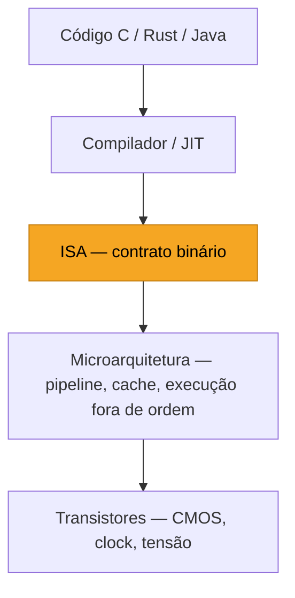
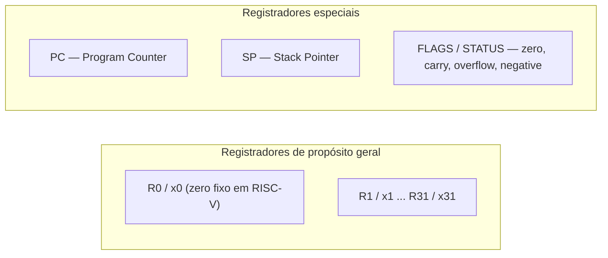
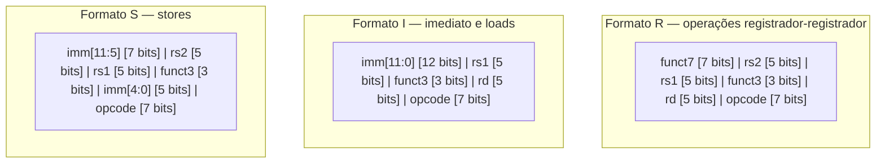
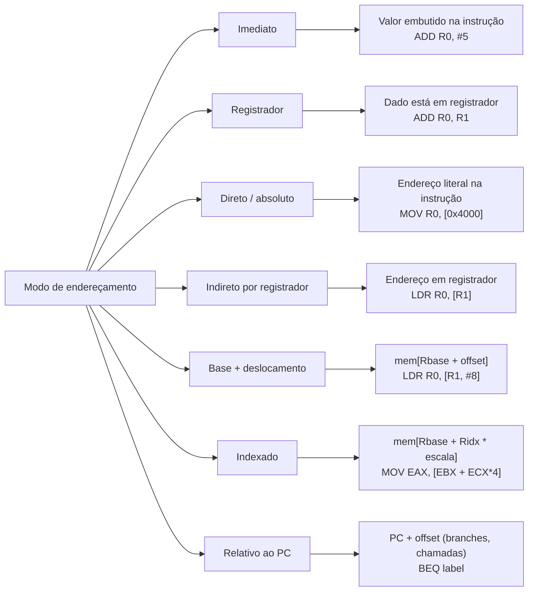

# ISA: a interface hardware-software

> [!abstract] TL;DR
> ISA (Instruction Set Architecture) é o contrato formal entre hardware e software: define quais instruções existem, quantos registradores há, como a memória é endereçada e como o processador se comporta. O compilador mira nessa interface — não no chip. Por isso, o mesmo binário roda em chips completamente diferentes; e por isso a ISA dura décadas enquanto a microarquitetura muda a cada geração.

---

## O que é uma ISA, afinal?

Imagine que você quer construir uma nova versão de um motor de carro. Você pode redesenhar tudo — injeção eletrônica, bloco de alumínio, sobrealimentação a turbo. Mas o painel do carro vai continuar funcionando do mesmo jeito, porque a interface entre o motorista e o motor é padronizada: volante, pedais, câmbio.

A ISA é exatamente esse painel. É a interface entre o software (compilador, sistema operacional, programador) e o hardware (o silício de verdade).

Tecnicamente, a ISA especifica:

- Quais **instruções** o processador entende (e o que cada uma faz).
- Quantos **registradores** existem, seus nomes e largura.
- Como a **memória** é endereçada (tamanho de palavra, endianness, alinhamento).
- Os **modos de endereçamento** disponíveis.
- Os **modos de operação** do processador (usuário, supervisor/kernel).
- O comportamento de **exceções e interrupções**.

Quem não entra nessa definição? A **microarquitetura** — o circuito de verdade que implementa a ISA. Como vimos em [[01 - O que é organização de computadores]], a mesma ISA pode ser implementada por dezenas de microarquiteturas radicalmente diferentes: uma simples e barata, outra com pipeline de 20 estágios, outra com execução fora de ordem e branch prediction sofisticado. O contrato (ISA) é um; as implementações são muitas.

> [!tip] Separação de contratos
> ISA = **o quê** o hardware faz.
> Microarquitetura = **como** o hardware faz.
> Essa separação é o que permite a Intel lançar uma nova geração de chips todo ano sem quebrar nenhum programa escrito em 1995.

---

## A ISA como camada de separação

O diagrama abaixo mostra onde a ISA se encaixa na pilha de abstrações de um sistema computacional moderno.



**Leitura do diagrama:** o compilador traduz código de alto nível para instruções da ISA. Abaixo da linha laranja, o hardware pode ser redesenhado livremente — o compilador nunca precisa saber. Acima dela, o software escreve para a ISA e só para ela.

Essa camada é o que torna possível **cross-compilation**: você compila para uma ISA diferente da sua máquina host. O compilador (GCC, Clang, javac) simplesmente mira num alvo diferente. Falaremos mais sobre esse mecanismo quando chegarmos ao galho de Compiladores.

---

## RISC × CISC: duas filosofias de design

A pergunta central do design de ISA é: quem faz o trabalho pesado — o hardware ou o software?

**CISC** (Complex Instruction Set Computer) apostou no hardware. Mais instruções, mais complexas, capazes de fazer em uma instrução o que RISC faz em três. O programador (e o compilador da época) fica feliz: menos código para escrever. O chip fica infeliz: precisa de um decodificador enorme.

**RISC** (Reduced Instruction Set Computer) apostou no software. Poucas instruções, simples, de **tamanho fixo**. O compilador precisa emitir mais instruções, mas cada instrução é fácil de decodificar, fácil de colocar num pipeline, fácil de escalar.

A tabela abaixo captura as diferenças fundamentais:

| Característica | CISC | RISC |
|---|---|---|
| Nº de instruções | Centenas | Dezenas a ~200 |
| Tamanho da instrução | Variável (x86: 1–15 bytes) | Fixo (tipicamente 32 bits) |
| Operações em memória | Instruções podem ler/escrever diretamente | Apenas `load` e `store` tocam memória |
| Decodificador | Complexo, caro em área e energia | Simples, facilita pipeline |
| Exemplos | x86, x86-64, VAX, 68k | ARM, RISC-V, MIPS, SPARC |
| Pipelining | Difícil (instruções têm duração variável) | Natural (instruções com duração uniforme) |
| Densidade de código | Alta (um opcode faz muito) | Mais baixa (mais opcodes para mesma tarefa) |

> [!warning] O paradoxo do x86
> O x86 é CISC em papel, mas internamente RISC na prática. Desde o Pentium Pro (1995), processadores Intel e AMD **quebram as instruções x86 em micro-ops** (µops) antes de executar. Essas µops são instruções simples, de tamanho fixo — praticamente RISC. O decodificador CISC está lá, mas o *core* de execução é RISC. O custo: o decodificador consome área de silício e energia. A vantagem: 45+ anos de compatibilidade binária.

---

## Arquitetura load-store

RISC adota uma restrição importante que simplifica muito o hardware: **apenas instruções `load` e `store` tocam a memória**. Todas as outras operações (soma, comparação, deslocamento de bits) trabalham **exclusivamente em registradores**.

Por quê isso importa? Porque acessar memória é lento e imprevisível (pode causar um cache miss, que leva centenas de ciclos). Se qualquer instrução pudesse acessar memória a qualquer momento, o pipeline ficaria cheio de bolhas esperando a memória responder. Separar os acessos em instruções dedicadas permite que o hardware gerencie latências de forma muito mais previsível.

Em x86 (CISC), você pode fazer:
```asm
ADD EAX, [EBX + 8]   ; soma EAX com o valor na memória em EBX+8
```

Em ARM ou RISC-V (load-store), você primeiro carrega:
```asm
LDR R1, [R2, #8]     ; carrega memória[R2+8] em R1
ADD R0, R0, R1       ; soma R0 e R1, resultado em R0
```

Mais instruções, mas o pipeline respira melhor.

---

## Registradores: o armazenamento mais rápido que existe

Registradores ficam dentro do próprio processador — são a memória mais rápida de toda a hierarquia (zero latência em relação ao pipeline). A ISA define quantos existem e o que cada um faz.



**Leitura do diagrama:** os registradores de propósito geral (GPRs) guardam dados temporários durante o cálculo. Os especiais controlam o fluxo de execução: o PC sempre aponta para a próxima instrução; o SP aponta para o topo da pilha; FLAGS registram o resultado da última operação aritmética e guiam as instruções de desvio condicional.

Quantidade e largura variam por ISA:

| ISA | GPRs | Largura | Obs. |
|---|---|---|---|
| x86 (32-bit) | 8 (EAX–EDI) | 32 bits | Poucos registradores → pressão de registrador alta |
| x86-64 | 16 (RAX–R15) | 64 bits | AMD64 expandiu o conjunto |
| ARM64 (AArch64) | 31 (X0–X30) + XZR | 64 bits | X0–X7: argumentos e retorno |
| RISC-V (RV64I) | 32 (x0–x31) | 64 bits | x0 é hardwired para zero |
| MIPS | 32 ($0–$31) | 32 ou 64 bits | $0 também fixo em zero |

> [!info] Por que ter um registrador sempre zero?
> RISC-V e MIPS fixam um registrador em 0 no hardware. Isso elimina a necessidade de instrução `MOV reg, #0` e simplifica pseudo-instruções. `ADD x1, x0, x2` equivale a `MOV x1, x2`. Elegante e barato.

---

## Tipos de instrução: o vocabulário da ISA

Toda ISA fala a mesma língua em nível conceitual, mas com sotaque diferente. As classes de instrução são universais:

| Classe | Exemplos | Função |
|---|---|---|
| Aritmética/lógica | `ADD`, `SUB`, `MUL`, `AND`, `OR`, `XOR`, `SHL` | Computação sobre registradores |
| Movimentação | `MOV`, `LDR/STR`, `LOAD/STORE` | Copiar dados entre registradores e memória |
| Controle de fluxo | `JMP`, `BEQ`, `BNE`, `CALL`, `RET` | Mudar o PC (desvio, chamada, retorno) |
| Sistema | `SYSCALL`, `INT`, `ECALL` | Transição para modo privilegiado (kernel) |
| Ponto flutuante | `FADD`, `FMUL`, `FCVT` | Operações em registradores FP (geralmente extensão separada) |
| SIMD/vetorial | `VADDPS`, `NEON VADD` | Opera em múltiplos dados em paralelo |

> [!example] RISC-V: instruções de controle de fluxo
> `BEQ rs1, rs2, offset` — branch se `rs1 == rs2`, desvia para `PC + offset`.
> `JAL rd, offset` — salta para `PC + offset`, salva `PC+4` em `rd` (o endereço de retorno).
> `JALR rd, rs1, offset` — salta para `rs1 + offset` (retorno de função: `JALR x0, ra, 0`).

---

## Formato de instrução: como os bits se organizam

Cada instrução é uma sequência de bits. A ISA define como esses bits se dividem em campos com significados diferentes.

**RISC-V RV32I** tem formato fixo de 32 bits com 6 tipos de formato:



**Leitura do diagrama:** cada linha representa 32 bits particionados em campos. `opcode` diz ao decodificador qual família de instrução é; `funct3`/`funct7` refinam qual operação dentro da família; `rd` é o registrador de destino; `rs1`/`rs2` são as fontes; `imm` é o valor imediato codificado na própria instrução.

Contraste com x86: uma instrução x86 pode ter de 1 a 15 bytes, com prefixos opcionais, campos de escala/índice/base (SIB byte), deslocamentos e imediatos de tamanho variável. Por isso o decodificador x86 é um dos componentes mais complexos do chip.

---

## Modos de endereçamento: como a ISA localiza dados

Modos de endereçamento são as formas diferentes de especificar **de onde vem o dado** para uma instrução. Pense neles como as diferentes formas de dar um endereço: "o apartamento 42", "três portas depois do mercado", "onde o ponteiro aponta".



**Leitura do diagrama:** cada modo resolve para um endereço (ou valor) de forma diferente. O modo mais importante para você, como dev, é **base + deslocamento** — é como o compilador acessa campos de structs (`base = ponteiro`, `deslocamento = offset do campo`) e elementos de arrays (`base = endereço do array`, `deslocamento = índice × tamanho`). Conecta diretamente com endianness e alinhamento que vimos em [[04 - Texto, endianness e alinhamento]].

O modo **relativo ao PC** é especial: branches e jumps calculam o destino como `PC + offset`. Isso torna o código **position-independent** — você pode carregar o executável em qualquer endereço de memória e os saltos continuam corretos. É a base do PIC (Position-Independent Code) usado em bibliotecas compartilhadas.

---

## ABI: o contrato acima do contrato

A ISA define as instruções. Mas quem decide **como usar os registradores numa chamada de função**? Quem define qual registrador guarda o valor de retorno? Quais registradores o chamado pode destruir? Isso é a **ABI** (Application Binary Interface) — especificamente a **calling convention**.

A ABI complementa a ISA:

- **Quais registradores** são de argumento (ex.: ARM64: X0–X7 para os 8 primeiros args).
- **Qual registrador** traz o valor de retorno (ex.: RISC-V: `a0` e `a1`).
- **Quais registradores** devem ser preservados pelo chamado (*callee-saved*).
- **Como a pilha cresce** (para baixo em praticamente todas as ISAs modernas).
- **Como o stack frame** é organizado.

A ABI é estável tanto quanto a ISA — quebrar a ABI quebra todos os binários compilados. Exploraremos isso a fundo em [[09 - Assembly e o modelo de execução]].

> [!note] Endianness e word size como propriedades da ISA
> A ISA também define se o processador é **little-endian** ou **big-endian** (ou ambos, como ARM em modo biendian). x86 e RISC-V são little-endian; ARM no modo padrão também. A largura da palavra (32 vs 64 bits) determina o tamanho máximo do espaço de endereçamento: 32 bits → 4 GB; 64 bits → 16 exabytes teoricamente.

---

## Por que a ISA dura décadas?

A ISA x86 foi introduzida com o Intel 8086 em **1978**. Quarenta e oito anos depois, em 2026, um binário compilado para 8086 ainda pode rodar num Core Ultra moderno (em modo de compatibilidade). Nenhuma outra abstração em software tem essa longevidade.

O motivo é simples e brutal: **compatibilidade binária é dinheiro**. Cada empresa, governo e usuário tem software compilado para x86. Quebrar a ISA significa jogar fora décadas de software testado, certificado e pago. Intel e AMD nunca fizeram isso.

A extensão foi sempre aditiva:

- 8086 (1978): 16 bits, ~80 instruções.
- 80386 (1985): modo protegido de 32 bits (IA-32).
- MMX/SSE/AVX: extensões SIMD adicionadas sem remover nada.
- AMD64 (2003): modo de 64 bits; IA-32 continua funcionando.

Hoje um processador x86-64 precisa entender instruções de seis décadas de história. Esse legado tem custo: o front-end do chip gasta energia e área decodificando um ISA barroca. É o preço da longevidade.

---

## RISC-V: a ISA aberta que veio mudar o jogo

RISC-V (pronuncia-se "risk five") nasceu em Berkeley em 2010, liderado por Krste Asanović e David Patterson (sim, o mesmo do livro). A proposta era radical: uma ISA **aberta**, **modular** e **sem royalties**.

Toda ISA anterior tem dono: ARM cobra licenciamento por chip; x86 pertence à Intel/AMD (licença cruzada). Qualquer empresa que quisesse fabricar chips precisava pagar.

RISC-V mudou isso. Qualquer pessoa pode implementar um chip RISC-V e distribuir sem pagar um centavo. O resultado:

- SiFive, Espressif, StarFive: chips comerciais RISC-V.
- Google, NVIDIA, Western Digital: adotaram internamente.
- India, Europa, China: programas governamentais de chips soberanos baseados em RISC-V.
- Microcontroladores embarcados (ESP32-C3/C6) até servidores.

> [!tip] Modularidade do RISC-V
> A base é RV32I ou RV64I (inteiros). Extensões são adicionadas com letras:
> - `M` — multiplicação/divisão
> - `A` — operações atômicas
> - `F`/`D` — ponto flutuante simples/duplo
> - `C` — instruções comprimidas de 16 bits (densidade de código)
> - `V` — vetorial
> O conjunto `IMAFD` + extensão de compressão `C` forma o perfil `G` (general purpose).

---

## ARM: eficiência energética ganhou o mundo

ARM não foi criado para servidores nem desktops. Nasceu na Acorn Computers britânica nos anos 80 pensando em chips baratos e econômicos. Essa herança moldou tudo.

A arquitetura load-store, o conjunto de instruções regular e o pipeline eficiente resultam em chips que fazem muito trabalho por watt. Quando o iPhone chegou em 2007, o critério não era velocidade bruta — era *performance por mW de bateria*. ARM ganhou sem competição.

Em 2020, Apple anunciou a transição do Mac de x86 para ARM (Apple Silicon). O desafio: como rodar o catálogo inteiro de software x86 existente num chip ARM?

A resposta foi **Rosetta 2**: um sistema de tradução binária que converte executáveis x86-64 para ARM64 na primeira execução e armazena o resultado em cache. O processo é transparente — o usuário abre um app x86 e ele roda. A performance de código traduzido chega a ~80% do nativo, segundo benchmarks publicados. Apple completou a transição em menos de 2 anos.

> [!example] O que Rosetta 2 revela sobre ISA
> Rosetta 2 é prova viva de que a ISA é uma convenção, não uma lei da física. Com software suficientemente inteligente, você pode traduzir de uma ISA para outra. O custo é overhead no primeiro run e alguns casos-limite de compatibilidade (especialmente em torno de memory ordering, onde o M1 emula a semântica x86 mais forte por thread).

---

## Por que o MESMO código C roda em x86 e ARM?

Porque o compilador faz a ponte. C é uma linguagem de alto nível que abstrai a ISA. Quando você escreve `a + b`, não está dizendo qual instrução usar — está dizendo qual operação quer. O compilador (GCC com `-march=x86-64` ou `-march=armv8-a`) traduz isso para as instruções certas da ISA alvo.

Um exemplo concreto. O mesmo código C:
```c
int soma(int a, int b) { return a + b; }
```

Compilado para x86-64:
```asm
lea eax, [rdi + rsi]
ret
```

Compilado para ARM64:
```asm
add w0, w0, w1
ret
```

Compilado para RISC-V:
```asm
addw a0, a0, a1
ret
```

Três ISAs, três binários completamente diferentes, mesma semântica. O compilador é o tradutor universal entre a intenção do programador e o contrato da ISA.

---

## Intrinsics e inline assembly: descendo até a ISA

Às vezes você precisa de uma instrução específica que o compilador não vai emitir sozinho — uma instrução SIMD para processar 8 floats em paralelo, ou uma instrução de hardware para calcular CRC. Para isso existem duas saídas:

**Intrinsics**: funções C/C++ que mapeiam diretamente para instruções específicas. O compilador sabe que `_mm256_add_ps(a, b)` se traduz em `VADDPS` (AVX). Você escreve C, o binário tem a instrução exata.

```c
#include <immintrin.h>
__m256 resultado = _mm256_add_ps(vetor_a, vetor_b); // emite VADDPS
```

**Inline assembly**: você escreve assembly diretamente dentro do código C, usando a sintaxe do compilador (GCC AT&T ou Intel). Última saída, mas às vezes necessária para instruções sem intrinsic ou para controle exato de timing.

Ambas revelam a ISA pela janela: você está escolhendo instruções de uma ISA específica. O código vira não-portável — compila apenas para aquela ISA. Por isso são usadas seletivamente, em hot paths específicos.

---

## A ISA sob o olhar do dev sênior

> [!question] Por que isso importa no dia a dia?

**Performance profiling**: quando você lê um relatório de profiling que diz "muitos cache misses em load/store", você precisa entender que load e store são a única forma de acessar memória — e que cada miss pode custar 200+ ciclos de pipeline parado.

**Cross-compilation**: se você já fez deploy de software embarcado (ESP32, Raspberry Pi, MCU industrial), você compilou para outra ISA. Entender a diferença entre ISA do host e ISA do target evita horas de debug.

**Flags de compilador**: `-march=native` diz ao compilador "usa todas as extensões da ISA desta máquina". `-march=x86-64-v3` instrui a usar AVX2. Você está escolhendo quais instruções da ISA o compilador pode emitir.

**Debugging de segurança**: exploits como buffer overflows, ROP (Return-Oriented Programming) e Spectre/Meltdown são ataques que manipulam a ISA. Gadgets ROP são sequências de instruções ISA terminadas em `RET`. Spectre abusa do comportamento especulativo da microarquitetura — mas o contrato de observabilidade que vaza é o da ISA.

**Containers e Docker**: imagens Docker são ISA-específicas. Uma imagem `linux/amd64` não roda num Apple M1 sem emulação (QEMU). Quando você vê `linux/arm64` e `linux/amd64` como platforms, está vendo ISA.

---

> [!summary] Resumo em uma linha
> ISA é o contrato estável entre compilador e hardware — define instruções, registradores e endereçamento; RISC simplifica (tamanho fixo, load-store); CISC complexifica (x86, mas internamente RISC); ARM dominou o mobile por eficiência; RISC-V abriu o jogo sem royalties; o compilador é quem cruza esse contrato.

---

## Em entrevista

Quando cair ISA numa entrevista técnica internacional, o entrevistador quer ver se você entende **por que** as abstrações existem, não apenas o que são.

O contrato central é que the ISA is the stable boundary between compilers and hardware — what the compiler targets, not what the silicon implements. The same ISA can have dozens of microarchitecture implementations. *RISC keeps instructions simple and fixed-size to make pipelines efficient, while CISC packs complex operations into single instructions at the cost of decoder complexity.* The x86 ISA has been binary-compatible since 1978 — that's forty-eight years of the same contract, survived by never removing instructions, only adding them. *ARM won mobile by delivering the best performance per milliwatt, a consequence of its RISC heritage and lean decoder.* RISC-V disrupted the market by being open-source and royalty-free, enabling sovereign chip programs and embedded designs without licensing fees. *The load-store architecture means only load and store instructions touch memory — all other operations work on registers — which makes memory latency predictable and pipelines clean.* Rosetta 2 proved that ISAs are translatable: Apple migrated an entire user base from x86 to ARM via dynamic binary translation with roughly 80% native performance for translated code. *Addressing modes exist because real programs need to navigate structs, arrays, and pointer chains — base-plus-displacement maps directly to struct field access.* The ABI layers on top of the ISA to define calling conventions, which is why mixing binaries compiled with different compilers for the same ISA still works.

| Termo PT | Termo EN |
|---|---|
| Conjunto de instruções | Instruction Set Architecture (ISA) |
| Microarquitetura | Microarchitecture |
| Instrução | Instruction |
| Registrador | Register |
| Contador de programa | Program Counter (PC) |
| Ponteiro de pilha | Stack Pointer (SP) |
| Arquitetura load-store | Load-store architecture |
| Modo de endereçamento | Addressing mode |
| Endereçamento base+deslocamento | Base-plus-displacement addressing |
| Formato de instrução | Instruction format |
| Compatibilidade binária | Binary compatibility |
| Tradução binária | Binary translation |
| Compilação cruzada | Cross-compilation |
| Interface binária de aplicação | Application Binary Interface (ABI) |
| Convenção de chamada | Calling convention |
| Instrução composta (CISC) | Complex instruction |
| Micro-operação | Micro-op (µop) |
| Código independente de posição | Position-Independent Code (PIC) |

---

> [!info] Lastro
> - Patterson, David A.; Hennessy, John L. **Computer Organization and Design: RISC-V Edition — The Hardware Software Interface** (2nd ed.). Morgan Kaufmann, 2020. ISBN 978-0-12-820331-6. Referência canônica de ISA com foco em RISC-V; capítulos 2–3 cobrem o conjunto de instruções e formatos. [Elsevier](https://shop.elsevier.com/books/computer-organization-and-design-risc-v-edition/patterson/978-0-12-820331-6)
> - Hennessy, John L.; Patterson, David A. **Computer Architecture: A Quantitative Approach** (6th ed.). Morgan Kaufmann, 2017. ISBN 978-0-12-811905-1. Apêndice A e B: ISA design, RISC vs CISC em profundidade quantitativa. [Elsevier](https://shop.elsevier.com/books/computer-architecture/hennessy/978-0-12-811905-1)
> - RISC-V International. **The RISC-V Instruction Set Manual, Volume I: Unprivileged Architecture** (versão 20250508). Especificação oficial e aberta da ISA RISC-V. [docs.riscv.org](https://docs.riscv.org/reference/isa/unpriv/unpriv-index.html) · [GitHub](https://github.com/riscv/riscv-isa-manual)
> - Arm Limited. **Arm Architecture Reference Manual for A-profile architecture** (ARMv8/ARMv9). Documentação oficial da ISA ARM, incluindo load-store e modos de endereçamento. [developer.arm.com](https://developer.arm.com/documentation/ddi0487/latest)
> - Apple Inc. **About the Rosetta Translation Environment** (2021). Documentação oficial do mecanismo de tradução binária x86→ARM64. [developer.apple.com](https://developer.apple.com/documentation/apple-silicon/about-the-rosetta-translation-environment)
