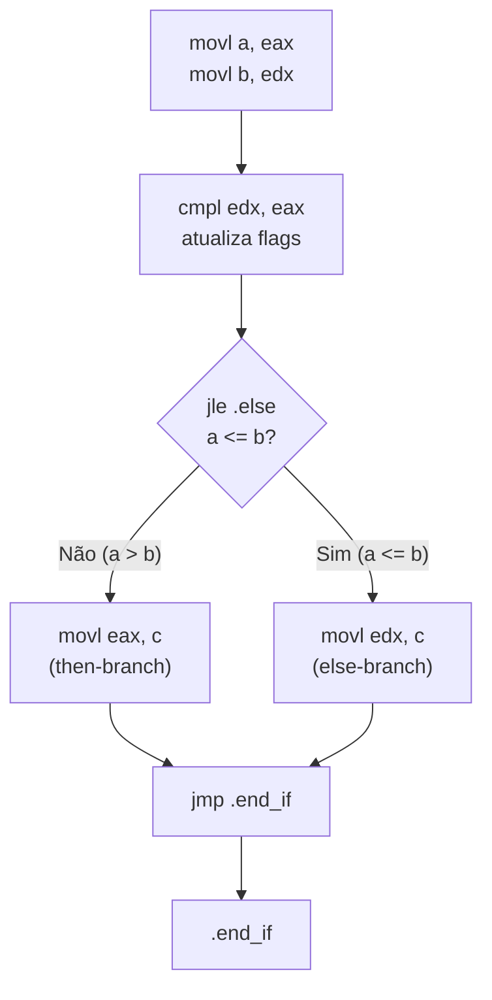
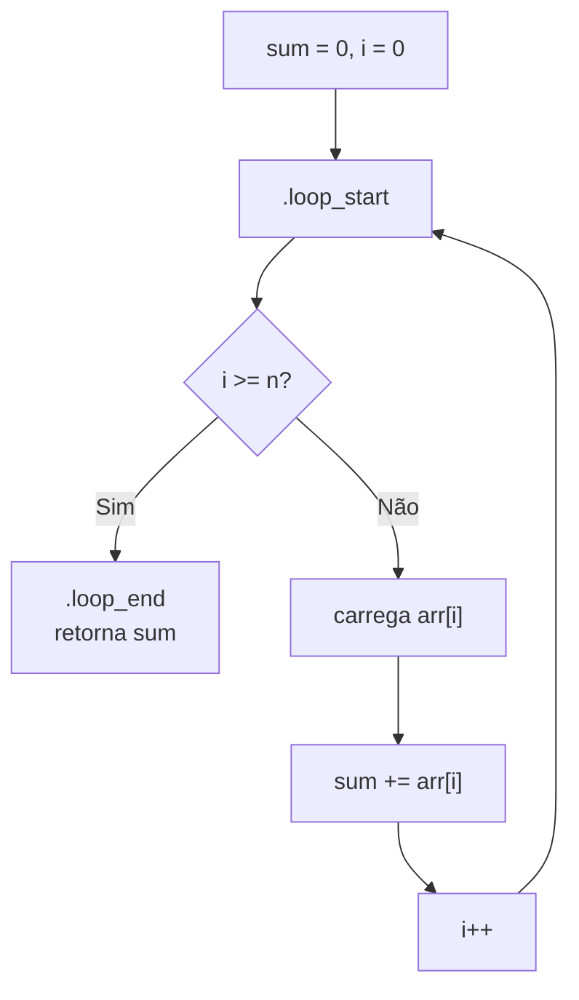
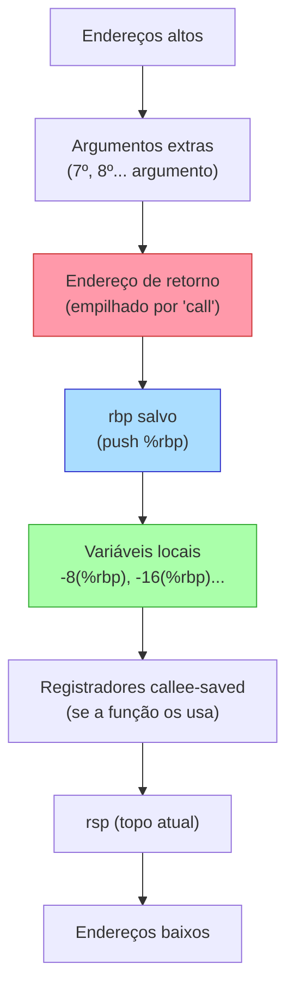
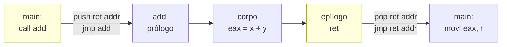

# Assembly e o modelo de execução

> [!abstract] TL;DR
> Assembly é a ISA em forma legível: cada mnemônico corresponde quase 1:1 a uma instrução de máquina. O modelo de execução é simples — registradores guardam valores de trabalho, a memória guarda o resto, e o processador repete *load → compute → store*. A pilha dá suporte a chamadas de função via convenção (ABI), e entender isso é a diferença entre ler um stack trace e adivinhar o que deu errado.

---

## Assembly = a ISA legível por humanos

Você viu em [[08 - ISA - a interface hardware-software]] que a ISA define o contrato entre software e hardware: quais instruções existem, quais registradores há, como a memória é endereçada.

Assembly é a camada que traduz esse contrato para texto que humanos conseguem ler — e escrever.

Cada instrução assembly corresponde (quase) 1:1 a uma instrução de máquina. O assembler converte esse texto em bytes. Não há salto de abstração enorme: `add rax, rbx` vira um punhado de bits que a ULA sabe executar.

> [!tip] Mnemônico = apelido da instrução
> `mov`, `add`, `cmp`, `jmp` são apenas apelidos legíveis para os opcodes binários. O assembler substitui cada apelido pelo opcode correspondente, resolve os endereços dos labels e cospe o binário.

### Dois sabores de sintaxe: AT&T × Intel

Você vai encontrar os dois, e eles parecem idiomas diferentes:

- **Intel** (NASM, MASM, saída do Visual Studio): `mov rax, rbx` — destino primeiro.
- **AT&T** (GAS, saída padrão do GCC/GDB no Linux): `movq %rbx, %rax` — fonte primeiro, sufixo de tamanho (`b/w/l/q`), `%` em registradores, `$` em imediatos.

Este texto usa sintaxe AT&T quando necessário (o GCC cospe AT&T por padrão), mas os exemplos de RISC-V são neutros.

**Tabela 1 — mesmo código nos dois sabores**

| Operação | AT&T (GCC/GDB) | Intel (NASM/objdump -M intel) |
|---|---|---|
| Mover `rbx` para `rax` | `movq %rbx, %rax` | `mov rax, rbx` |
| Somar imediato 1 a `rax` | `addq $1, %rax` | `add rax, 1` |
| Comparar `rax` com 0 | `cmpq $0, %rax` | `cmp rax, 0` |
| Desvio se igual | `je .label` | `je label` |
| Carregar da memória | `movq (%rbp), %rax` | `mov rax, [rbp]` |

*Leitura do diagrama:* a coluna central é a tradição Unix/Linux que você vai ver no GDB; a coluna direita é o que o `objdump -M intel` e o Compiler Explorer mostram por padrão. O significado é idêntico, só a ordem e os símbolos mudam.

---

## O modelo de execução: load → compute → store

O processador vive num loop:

```
busca instrução → decodifica → executa → guarda resultado → próxima instrução
```

Você viu o ciclo completo em [[07 - Arquitetura de von Neumann e o ciclo de instrução]]. Do ponto de vista do código assembly, o modelo mental é ainda mais simples:

1. **Registradores** guardam os valores em que você está trabalhando *agora*.
2. **Memória** guarda todo o resto (variáveis, arrays, structs).
3. Você carrega da memória para registrador, opera nos registradores, salva de volta na memória.

É um ciclo de três passos: **load → compute → store**.

> [!info] Por que não operar direto na memória?
> A CPU consegue operar direto na memória em muitos casos (x86 permite), mas o gargalo é a latência: registradores ficam dentro do chip, leitura em ~1 ciclo. RAM leva dezenas a centenas de ciclos. Por isso o compilador tenta manter variáveis "quentes" em registradores o máximo possível.

### Exemplo trabalhado: `c = a + b`

Em C:

```c
int a = 10, b = 20;
int c = a + b;
```

O compilador não tem como somar dois valores que estão na memória sem carregar pelo menos um deles. O que acontece em assembly (x86-64 simplificado):

```asm
; Suponha que 'a' está em -4(%rbp) e 'b' em -8(%rbp)
; Resultado vai para -12(%rbp)

movl   -4(%rbp), %eax     ; LOAD: carrega 'a' em eax
movl   -8(%rbp), %edx     ; LOAD: carrega 'b' em edx
addl   %edx, %eax         ; COMPUTE: eax = eax + edx  (a + b)
movl   %eax, -12(%rbp)    ; STORE: salva resultado em 'c'
```

Três passos, quatro instruções. O padrão load-compute-store aparece em todo cálculo.

> [!example] Somar um array inteiro
> Para somar N inteiros num array, o loop faz exatamente isso por elemento: carrega o próximo elemento, acumula no registrador acumulador, avança o ponteiro. O valor parcial fica no registrador; a memória só é lida uma vez por elemento.

---

## Controle de fluxo: `if` e loops em assembly

### Como um `if` vira compare + branch

Em C:

```c
if (a > b) {
    c = a;
} else {
    c = b;
}
```

O processador não entende "se". Ele entende: *compare dois valores e modifique flags; depois desvie baseado nas flags*.

```asm
movl   -4(%rbp), %eax     ; carrega a
movl   -8(%rbp), %edx     ; carrega b
cmpl   %edx, %eax         ; compara a e b → atualiza flags (ZF, SF, OF...)
jle    .else_branch        ; se a <= b, pula para else
                            ; (then-branch)
movl   %eax, -12(%rbp)    ; c = a
jmp    .end_if
.else_branch:
movl   %edx, -12(%rbp)    ; c = b
.end_if:
```

**Diagrama 2 — `if`/`else` → compare + branch**



*Leitura do diagrama:* `cmp` não move nada — só atualiza os bits de flag no registrador de status. `jle` lê esses flags e decide o próximo PC. O compilador inverte a condição do C (C diz "se maior, then" → asm diz "se menor-ou-igual, pula pra else").

### Como um `for` vira label + branch

```c
int sum = 0;
for (int i = 0; i < n; i++) {
    sum += arr[i];
}
```

```asm
    movl   $0, %eax          ; sum = 0
    movl   $0, %ecx          ; i = 0
.loop_start:
    cmpl   %edi, %ecx        ; compara i com n (n em edi)
    jge    .loop_end          ; se i >= n, sai
    movslq %ecx, %rdx
    movl   (%rsi,%rdx,4), %edx  ; carrega arr[i] (rsi = base do array)
    addl   %edx, %eax        ; sum += arr[i]
    incl   %ecx              ; i++
    jmp    .loop_start
.loop_end:
```

**Diagrama 3 — `for` → label + branch condicional**



*Leitura do diagrama:* o loop é apenas uma instrução de comparação + salto condicional. Tudo o que parece "estrutura de controle" em C são, na verdade, gotos condicionais disfarçados.

---

## A pilha e a calling convention

### Por que existe a pilha?

Registradores são escassos — x86-64 tem 16 de uso geral, RISC-V tem 32. Uma função precisa de espaço para variáveis locais, para argumentos que não cabem em registradores, e para guardar o endereço de retorno.

A solução é a **pilha de execução** (*call stack*): uma região de memória que cresce para baixo (endereços decrescentes) gerenciada pelo registrador `rsp` (stack pointer). É literalmente a estrutura de dados pilha que você conhece de [[03-Dominios/Ciência/Estruturas de Dados/04 - Pilhas, filas e deques]] — LIFO, push e pop — só que implementada no hardware.

> [!tip] A pilha de hardware é a estrutura de dados pilha
> Quando você estudou pilhas como estrutura abstrata — LIFO, push/pop, topo — estava estudando exatamente o mecanismo que a CPU usa para gerenciar chamadas de função. Não é metáfora: é a mesma coisa.

### Stack pointer e frame pointer

- **`rsp`** (stack pointer): aponta sempre para o topo atual da pilha. `push` decrementa `rsp` em 8 e escreve. `pop` lê e incrementa.
- **`rbp`** (frame pointer / base pointer): opcional, mas muito comum em debug. Aponta para a base do frame da função atual, que não muda durante a execução da função (ao contrário de `rsp`, que pode variar com `push`/`pop` internos).

### Stack frame

Cada função tem seu **stack frame** (quadro de pilha): uma fatia da pilha com tudo que a função precisa — variáveis locais, cópias de argumentos que não couberam em registradores, registradores salvos, e o endereço de retorno.

**Diagrama 4 — layout do stack frame (crescendo para baixo)**



*Leitura do diagrama:* a pilha cresce de cima para baixo. `rbp` fica no meio como âncora estável. Variáveis locais ficam abaixo de `rbp` (offsets negativos). O endereço de retorno fica logo acima de `rbp` (empilhado pelo `call` antes do prólogo).

### Caller-saved × callee-saved (ABI)

A **ABI** (Application Binary Interface) — no Linux x86-64, a System V AMD64 ABI — define um contrato entre caller (quem chama) e callee (quem é chamado):

**Tabela 5 — registradores e convenção System V AMD64**

| Registrador | Papel | Quem preserva? | Notas |
|---|---|---|---|
| `rax` | Valor de retorno | Caller-saved | Clobbered livremente |
| `rdi rsi rdx rcx r8 r9` | 1º–6º argumento inteiro | Caller-saved | Caller salva se precisar |
| `r10 r11` | Temporários | Caller-saved | Clobbered livremente |
| `rbx r12 r13 r14 r15` | Temporários preservados | Callee-saved | Callee deve restaurar antes de retornar |
| `rbp` | Frame pointer (opcional) | Callee-saved | Se usado, deve ser restaurado |
| `rsp` | Stack pointer | Callee-saved | Deve estar alinhado em 16 bytes no `call` |

*Leitura da tabela:* **caller-saved** significa "se você é o caller e precisa desse valor depois da chamada, salve antes de chamar". **Callee-saved** significa "se você é a função chamada e vai usar esse registrador, salve no prólogo e restaure no epílogo".

> [!warning] Por que isso importa?
> Se você depura um crash e vê `rax` com valor inesperado após uma chamada, não estranha — é caller-saved, pode ter sido usado pela função chamada. Se `rbx` mudou sem explicação após uma chamada, é bug: o callee devia restaurá-lo.

---

## Walkthrough: chamada de função completa

```c
int add(int x, int y) {
    return x + y;
}

int main() {
    int r = add(3, 7);
}
```

### No caller (`main`):

```asm
; --- caller prepara argumentos ---
movl   $3, %edi            ; 1º argumento em edi (x = 3)
movl   $7, %esi            ; 2º argumento em esi (y = 7)
call   add                 ; PUSH endereço de retorno; JMP para add
; execução retorna aqui depois do 'ret'
movl   %eax, -4(%rbp)     ; salva retorno (r = resultado)
```

### Na callee (`add`) — prólogo + corpo + epílogo:

```asm
add:
; --- PRÓLOGO ---
pushq  %rbp               ; salva frame pointer do caller
movq   %rsp, %rbp         ; estabelece frame pointer da função

; --- CORPO ---
movl   %edi, -4(%rbp)     ; salva x na pilha (opcional com otimização)
movl   %esi, -8(%rbp)     ; salva y na pilha
movl   -4(%rbp), %edx
movl   -8(%rbp), %eax
addl   %edx, %eax         ; eax = x + y  (eax = registrador de retorno)

; --- EPÍLOGO ---
popq   %rbp               ; restaura frame pointer do caller
ret                        ; POP endereço de retorno; JMP para lá
```

**Diagrama 6 — fluxo `call`/`ret`**



*Leitura do diagrama:* `call` faz duas coisas atomicamente — empilha o PC da próxima instrução e pula para a função. `ret` faz o inverso — desempilha e pula para lá. O mecanismo inteiro depende da pilha ser LIFO.

---

## Prática: por que um dev sênior precisa saber isso

### Ler um stack trace / disassembly ao depurar

Quando o GDB para num crash e você digita `backtrace` (ou `bt`), vê algo como:

```
#0  0x00007f3c4a1b2345 in add (x=3, y=7) at main.c:2
#1  0x00007f3c4a1b2380 in main () at main.c:7
```

Cada frame na lista é literalmente um stack frame empilhado. O GDB percorre a pilha, lendo o `rbp` salvo de cada frame para encontrar o próximo. Se a pilha estiver corrompida, o backtrace para no meio — agora você sabe por quê.

Com `disassemble` você vê o assembly gerado. Entender prólogo/epílogo é o que separa "o crash aconteceu em algum lugar aqui" de "o crash aconteceu porque esse ponteiro estava zerado antes de ser carregado em `rdi`".

### Recursão e stack overflow

Recursão usa a pilha mecanicamente: cada chamada empilha um novo frame. Se a recursão não tem caso base ou é profunda demais, a pilha esgota o espaço alocado (tipicamente 1–8 MB no Linux) e o SO lança `SIGSEGV` — é o famoso **stack overflow**.

```c
// Cada chamada empilha um frame de ~16 bytes.
// 1 MB de stack / 16 bytes = ~65.000 chamadas antes do crash.
int fatorial(int n) {
    return n == 0 ? 1 : n * fatorial(n - 1);
}
```

> [!warning] Stack overflow não é bug exótico
> É a pilha literalmente acabando. Tail call optimization (quando o compilador otimiza a recursão em loop) evita isso — mas só funciona se a chamada recursiva for a *última* operação da função.

### Buffer overflow e segurança

O endereço de retorno fica na pilha, logo acima das variáveis locais. Se uma função copia dados para um buffer local sem verificar o tamanho (o famoso `strcpy` sem limite), os bytes extras sobrescrevem o endereço de retorno.

```c
void vuln(char *input) {
    char buf[64];      // variável local: fica abaixo do endereço de retorno
    strcpy(buf, input); // sem limite: se input > 64 bytes, estoura pra cima
}
```

Se um atacante controla `input`, ele controla o endereço de retorno — e portanto o próximo PC. É assim que exploits clássicos de stack smashing funcionam. Proteções modernas (ASLR, stack canaries, NX) tentam impedir isso, mas o mecanismo fundamental é a estrutura do stack frame.

> [!danger] Por que entender assembly importa para segurança
> CVEs de buffer overflow de heap são diferentes (sobrescrevem metadados do alocador), mas o princípio de "dados de atacante sobrescrevem dados de controle" é o mesmo. Entender assembly torna esses ataques compreensíveis, não mágicos.

### Ver o que o compilador gerou: Compiler Explorer

O [Compiler Explorer (godbolt.org)](https://godbolt.org) é a ferramenta mais útil para entender performance e comportamento. Você escreve C/C++/Rust à esquerda, vê o assembly à direita, com as linhas linkadas.

O que você encontra com frequência:

- O compilador eliminou sua variável intermediária — ela vive só em registrador.
- Um loop foi **vetorizado** (SIMD): onde você via um `addl`, agora há `vpaddd ymm0, ymm1, ymm2` operando em 8 inteiros de uma vez.
- A função foi **inlined**: o `call` sumiu, o corpo da função foi copiado no caller.

Isso não é magia — é o compilador aplicando transformações que você pode entender lendo o assembly.

### Inline assembly e intrinsics

Quando o compilador não gera o código ideal, você pode usar **intrinsics** — funções C que mapeiam diretamente para instruções SIMD — ou **inline assembly** (bloco `asm volatile(...)` em GCC/Clang).

```c
// Intrinsic: soma 4 floats de uma vez (SSE)
#include <xmmintrin.h>
__m128 a = _mm_load_ps(ptr_a);
__m128 b = _mm_load_ps(ptr_b);
__m128 c = _mm_add_ps(a, b);  // vira addps xmm0, xmm1 no asm
```

Isso é relevante em código de alta performance (processamento de imagem, ML, codecs de áudio/vídeo).

---

> [!summary] Resumo em uma linha
> Assembly expõe a ISA como texto: registradores guardam o trabalho corrente, a pilha LIFO gerencia chamadas de função via ABI, e todo fluxo de controle é *compare + branch* — saber isso transforma um stack trace confuso em um mapa legível.

---

## Em entrevista

Em entrevista técnica internacional, assembly aparece principalmente em perguntas de sistemas, segurança, debugging e performance. Você não precisa escrever assembly de cor — precisa *ler* e *raciocinar* sobre o modelo de execução.

*Assembly is a human-readable representation of machine code; each mnemonic maps almost 1:1 to a machine instruction.*

*The execution model is: load values from memory into registers, compute in registers, store results back to memory.*

*Every conditional in C compiles to a compare instruction followed by a conditional branch.*

*The call stack is a LIFO data structure managed by the stack pointer register.*

*Each function invocation creates a stack frame holding local variables, saved registers, and the return address.*

*The `call` instruction pushes the return address and jumps; `ret` pops and jumps back.*

*The ABI defines caller-saved and callee-saved registers — the contract between caller and callee.*

*A stack overflow is the call stack exhausting its allocated memory, typically from unbounded recursion.*

*A stack-based buffer overflow overwrites the return address on the stack, allowing an attacker to redirect execution.*

**Tabela de termos — EN/PT**

| Inglês | Português |
|---|---|
| Assembly language | Linguagem assembly |
| Assembler | Montador |
| Instruction mnemonic | Mnemônico de instrução |
| Register | Registrador |
| Stack pointer | Ponteiro de pilha |
| Frame pointer | Ponteiro de frame / base de frame |
| Stack frame | Quadro de pilha |
| Return address | Endereço de retorno |
| Calling convention | Convenção de chamada |
| ABI (Application Binary Interface) | ABI (Interface Binária de Aplicação) |
| Caller-saved register | Registrador salvo pelo chamador |
| Callee-saved register | Registrador salvo pelo chamado |
| Prologue / Epilogue | Prólogo / Epílogo |
| Conditional branch | Desvio condicional |
| Stack overflow | Estouro de pilha |
| Buffer overflow | Estouro de buffer |
| Inline assembly | Assembly embutido |
| Disassembly | Desmontagem / Disassembly |

---

> [!info] Lastro
> 1. **Bryant, R. E. & O'Hallaron, D. R.** — *Computer Systems: A Programmer's Perspective*, 3ª ed. (CS:APP), Capítulo 3 — Machine-Level Representation of Programs. Carnegie Mellon / Pearson. [csapp.cs.cmu.edu](https://csapp.cs.cmu.edu/)
> 2. **Patterson, D. A. & Hennessy, J. L.** — *Computer Organization and Design: RISC-V Edition*, 2ª ed. Elsevier / Morgan Kaufmann, 2021. Capítulos 2–3 (Instructions: Language of the Computer). [shop.elsevier.com](https://shop.elsevier.com/books/computer-organization-and-design-risc-v-edition/patterson/978-0-12-820331-6)
> 3. **System V Application Binary Interface — AMD64 Architecture Processor Supplement**. Grupo de trabalho ABI do Linux. Versão canônica em [refspecs.linuxbase.org/elf/x86_64-abi-0.99.pdf](https://refspecs.linuxbase.org/elf/x86_64-abi-0.99.pdf) e [uclibc.org/docs/psABI-x86_64.pdf](https://www.uclibc.org/docs/psABI-x86_64.pdf).
> 4. **OSDev Wiki** — System V ABI, seção de convenção de chamada x86-64. [wiki.osdev.org/System_V_ABI](https://wiki.osdev.org/System_V_ABI)
> 5. **Compiler Explorer (Godbolt)** — ferramenta interativa de visualização C → assembly, por Matt Godbolt. [godbolt.org](https://godbolt.org)
