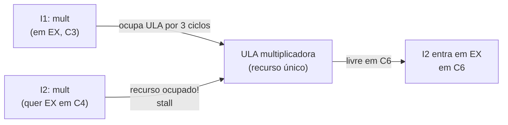
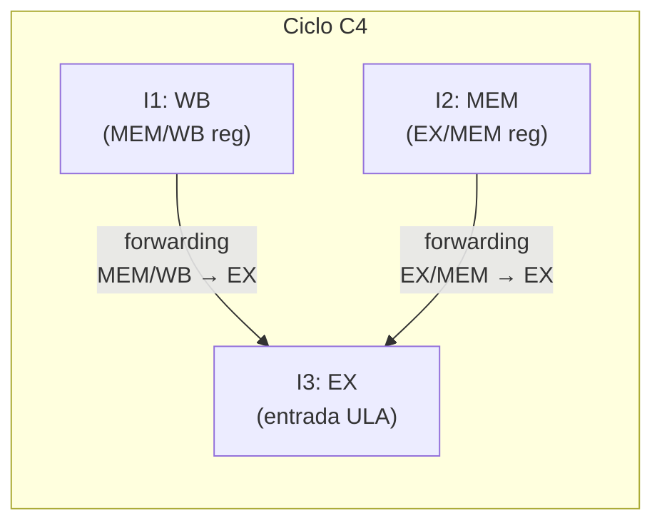
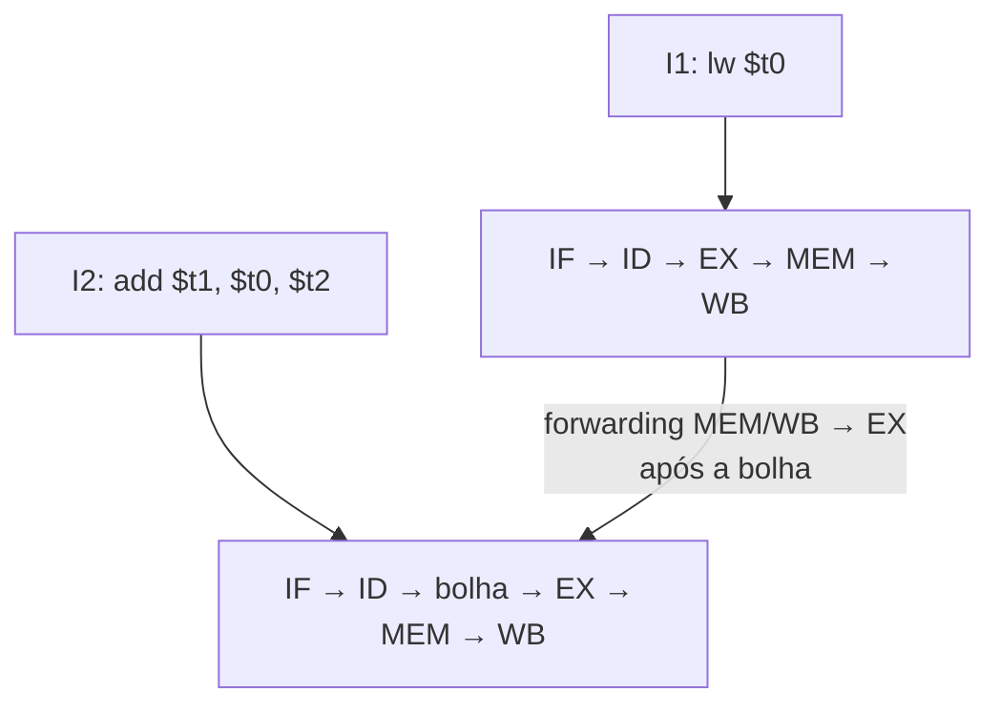
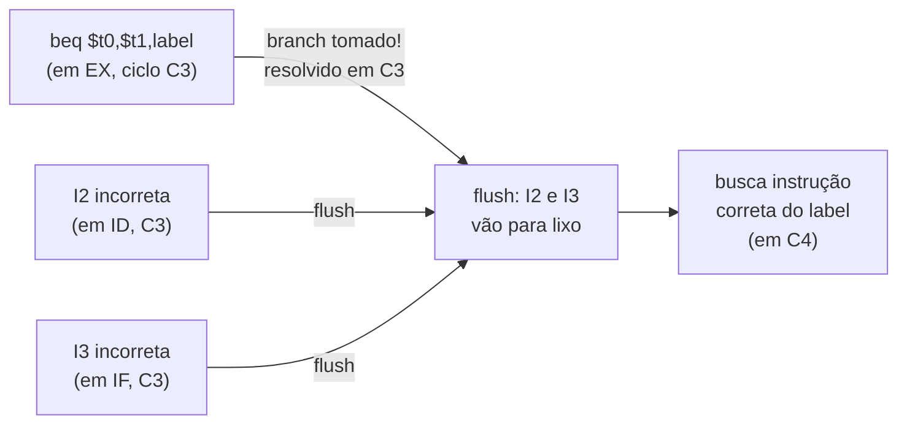
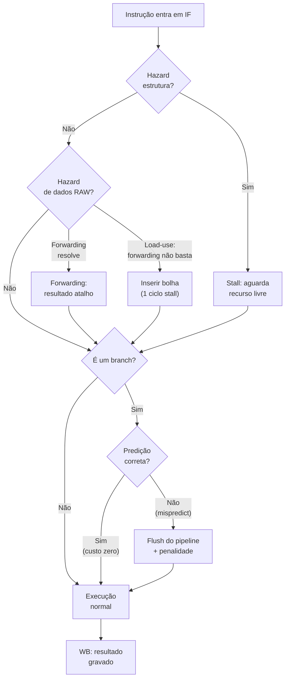

# Pipeline e hazards

> [!abstract] TL;DR
> Pipeline é a técnica de sobrepor a execução de múltiplas instruções, como uma linha de montagem. O throughput chega a ~1 instrução por ciclo, mas três tipos de hazard podem interromper esse fluxo: estrutural (recurso compartilhado), de dados (dependência RAW) e de controle (branch). As soluções — forwarding, stall e predição — mantêm o pipeline cheio ao custo de complexidade crescente. Quanto mais fundo o pipeline, maior o clock e maior a penalidade quando algo dá errado.

---

## A ideia central: linha de montagem de instruções

Imagine uma lavanderia com três máquinas em sequência: lavar, secar, dobrar. Sem pipeline, você espera a primeira roupa passar por tudo antes de colocar a segunda. Com pipeline, enquanto a segunda roupa está secando, a primeira está sendo dobrada — e uma terceira entra na lavagem. O tempo de cada roupa individual não mudou (latência), mas a vazão (throughput) triplicou.

O processador faz exatamente isso com instruções.

Sem pipeline, cada instrução ocupa o processador inteiro por N ciclos. Com pipeline de N estágios, você sobrepõe N instruções diferentes em fases diferentes. **A latência de cada instrução não cai** — ela ainda percorre todos os estágios. Mas o **throughput** se aproxima de 1 instrução terminada por ciclo, em vez de 1 a cada N ciclos.

Por que "se aproxima" e não "igual"? Porque hazards interrompem o fluxo. Mas esse é o problema central desta nota.

---

## O pipeline clássico de 5 estágios (MIPS)

O MIPS ISA é o exemplo canônico do livro de Patterson e Hennessy. Cinco estágios, cada um ocupando exatamente 1 ciclo de clock:

| Sigla | Nome completo | O que faz |
|-------|---------------|-----------|
| **IF** | Instruction Fetch | Busca a instrução na memória de instruções; incrementa PC |
| **ID** | Instruction Decode / Register Read | Decodifica o opcode; lê os registradores fonte |
| **EX** | Execute | Executa na ULA: aritmética, cálculo de endereço, comparação |
| **MEM** | Memory Access | Lê ou escreve na memória de dados (load/store) |
| **WB** | Write Back | Grava o resultado no banco de registradores |

Entre cada par de estágios há um **registrador de pipeline** (IF/ID, ID/EX, EX/MEM, MEM/WB) que armazena o estado parcial da instrução — como bandejas que carregam peças entre as estações da linha de montagem.

### Diagrama em escada: 5 instruções × 9 ciclos

A tabela abaixo mostra como 5 instruções se sobrepõem. Cada célula indica em qual estágio está a instrução naquele ciclo.

| Instrução | C1 | C2 | C3 | C4 | C5 | C6 | C7 | C8 | C9 |
|-----------|----|----|----|----|----|----|----|----|-----|
| I1        | IF | ID | EX | MEM | WB |    |    |    |    |
| I2        |    | IF | ID | EX | MEM | WB |    |    |    |
| I3        |    |    | IF | ID | EX | MEM | WB |    |    |
| I4        |    |    |    | IF | ID | EX | MEM | WB |    |
| I5        |    |    |    |    | IF | ID | EX | MEM | WB |

**Leitura do diagrama:** no ciclo C5, as 5 instruções estão todas em voo simultaneamente — cada uma em um estágio diferente. A partir do ciclo C5 até o C9, uma instrução termina a cada ciclo (WB aparece em cada coluna). Isso é o throughput de pipeline em regime estacionário.

Sem pipeline, as mesmas 5 instruções levariam 5 × 5 = 25 ciclos. Com pipeline, levam 9. O **speedup ideal** é igual ao número de estágios — mas apenas se o pipeline nunca travar.

---

## Throughput × latência: a distinção que confunde

> [!warning] Não confunda throughput com latência
> Pipeline aumenta throughput, não latência. Uma instrução individual ainda leva 5 ciclos do IF ao WB. O que muda é quantas instruções terminam por unidade de tempo.

Uma analogia: um chef que faz um prato em 20 minutos. Com 4 assistentes trabalhando em paralelo em fases diferentes do mesmo prato, ainda leva 20 minutos por prato — mas sai um prato a cada 5 minutos em vez de um a cada 20. O fluxo quadruplica; a receita não ficou mais rápida.

| Métrica | Sem pipeline | Com pipeline (N estágios) |
|---------|-------------|--------------------------|
| Latência (1 instrução) | N × T_ciclo | N × T_ciclo (igual) |
| Throughput (regime) | 1 / (N × T_ciclo) | ≈ 1 / T_ciclo |
| CPI ideal | N | 1 |
| CPI real | N | 1 + penalidades de hazard |

**Leitura da tabela:** o CPI de 1 só existe em regime estacionário sem hazards. Na prática, hazards inserem ciclos desperdiçados e empurram o CPI para cima. A nota [[18 - Performance - CPI, benchmarks e Amdahl]] aprofunda como o CPI medido reflete essas penalidades.

---

## Hazards: os três inimigos do pipeline

Hazard é qualquer situação que impeça a próxima instrução de entrar no estágio seguinte no ciclo esperado. Existem três famílias.

### Tabela dos 3 tipos de hazard

| Tipo | Causa raiz | Exemplo clássico | Solução principal | Custo |
|------|-----------|-----------------|-------------------|-------|
| **Estrutural** | Dois estágios precisam do mesmo recurso no mesmo ciclo | Uma memória única para IF (busca) e MEM (load/store) | Separar memórias (Harvard) ou alternar ciclos | 0–1 bolha |
| **De dados (RAW)** | Instrução lê registrador que instrução anterior ainda não escreveu | `add $t0, $t1, $t2` seguido de `sub $t3, $t0, $t4` | Forwarding; stall quando forwarding não basta | 0–2 bolhas |
| **De controle** | Branch — não se sabe qual instrução vem depois até o branch ser resolvido | `beq $t0, $t1, label` | Predição de branch; stall; delay slot | 1–N bolhas (N = profundidade) |

**Leitura da tabela:** RAW (Read After Write) é o hazard de dados mais frequente e importante. WAR (Write After Read) e WAW (Write After Write) não ocorrem no pipeline MIPS de 5 estágios clássico porque leituras ocorrem sempre no estágio 2 e escritas sempre no estágio 5 — mas aparecem em pipelines fora de ordem ([[13 - Execução fora de ordem e superescalar]]).

---

## Hazard estrutural

O hazard estrutural surge quando o hardware não tem recursos suficientes para suportar todas as combinações de instruções em paralelo.

O exemplo mais claro: um processador com **memória unificada** (dados e instruções no mesmo banco). No ciclo C5 do diagrama acima, I1 está em MEM (acessando memória de dados) e I5 está em IF (acessando memória de instruções). Conflito de acesso.

A solução adotada na maioria dos designs modernos é arquitetura **Harvard modificada**: cache de instruções e cache de dados separadas no L1, permitindo ambos os acessos simultâneos. O conflito some.

Outro exemplo clássico de hazard estrutural envolve a **unidade de multiplicação**. Se o MIPS clássico tiver apenas uma ULA multiplicadora e duas instruções `mult` consecutivas chegarem ao estágio EX com diferença de 1 ciclo, a segunda precisa esperar. O hardware resolve isso com stall automático ou proibindo o compilador de gerar sequências assim.



**Leitura do diagrama:** I2 queria entrar em EX no ciclo C4, mas a ULA ainda está ocupada com I1. A solução é travar o pipeline: I2 fica estacionada em ID até o recurso ficar livre. O pipeline "para de crescer" por cima enquanto o trabalho em andamento continua descendo.

A detecção de hazards estruturais é feita por uma **unidade de detecção de hazard** que monitora quais recursos estão ocupados em cada ciclo. Se o recurso necessário pela instrução entrante já está em uso, ela insere stalls automaticamente.

---

## Hazard de dados: RAW e forwarding

Considere este par de instruções:

```
add  $t0, $t1, $t2    # I1: $t0 = $t1 + $t2
sub  $t3, $t0, $t4    # I2: $t3 = $t0 - $t4
```

I2 precisa do valor de `$t0`. No pipeline sem intervenção, quando I2 chega ao estágio EX (ciclo C4), I1 ainda está em MEM — o resultado de `$t0` só será gravado no banco de registradores em WB (ciclo C5). I2 lerá um valor **desatualizado** no ciclo C3 (ID).

Isso é um **RAW hazard** (Read After Write): I2 lê um registrador que I1 ainda está escrevendo.

### Forwarding (bypassing)

A solução elegante é o **forwarding**: em vez de esperar o resultado ir até o banco de registradores, conecta-se o registrador de pipeline EX/MEM diretamente à entrada da ULA no ciclo seguinte. O resultado "viaja pelo atalho".

Existem **dois caminhos de forwarding** principais no pipeline MIPS de 5 estágios:

- **EX/MEM → entrada EX** (forwarding de 1 ciclo de distância): I1 acabou de sair de EX e está em MEM; I2 está entrando em EX. O resultado de I1 é encaminhado diretamente para a entrada da ULA de I2.
- **MEM/WB → entrada EX** (forwarding de 2 ciclos de distância): I1 acabou de sair de MEM e está em WB; I2 está entrando em EX. O resultado de I1 já passou pelo acesso à memória e pode ser encaminhado.



**Leitura do diagrama:** no ciclo C4, I3 está em EX e pode receber forwarding de dois lugares simultaneamente — de I2 (que acabou de sair de EX, via EX/MEM) e de I1 (que acabou de sair de MEM, via MEM/WB). Se ambos forem necessários, o forwarding de EX/MEM tem prioridade (é mais recente).

O hardware de forwarding precisa comparar o registrador destino das instruções em MEM e WB com os registradores fonte da instrução em EX. Esses comparadores operam em paralelo a cada ciclo. O CS:APP identifica até **7 caminhos de forwarding** no pipeline Y86-64, que é mais complexo que o MIPS.

Forwarding resolve a maioria dos hazards de dados entre instruções aritméticas. O hardware adicional é significativo (multiplexadores, comparadores de registrador), mas o custo em ciclos é zero.

### O load-use hazard: forwarding não basta

Existe um caso onde nem forwarding resolve: o **load-use hazard**.

```
lw   $t0, 0($s0)    # I1: carrega $t0 da memória
add  $t1, $t0, $t2  # I2: usa $t0 imediatamente
```

O valor de `$t0` só estará disponível **após** o estágio MEM de I1 — que ocorre no mesmo ciclo em que I2 precisa do valor em EX. Não há ciclo sobrando para o forwarding trabalhar: os dois eventos são simultâneos.

A única saída é inserir uma **bolha** (stall de 1 ciclo): I2 fica parada em ID por um ciclo extra, criando um NOP que avança pelo pipeline sem fazer nada. Depois do MEM de I1, o forwarding MEM/WB → EX funciona normalmente.



**Leitura do diagrama:** a bolha é representada como um ciclo extra no estágio ID de I2. O compilador pode reordenar instruções independentes entre o `lw` e o `add` para preencher essa bolha com trabalho útil — técnica chamada **load scheduling**.

### Load-use em tabela de ciclos

A tabela abaixo mostra exatamente o que acontece com e sem a bolha:

| Instrução | C1 | C2 | C3 | C4 | C5 | C6 | C7 |
|-----------|----|----|----|----|----|----|-----|
| lw $t0 (I1)         | IF | ID | EX | MEM | WB  |     |    |
| add $t1,$t0 (I2)    |    | IF | ID | **ID** | EX | MEM | WB |
| I3 (independente)   |    |    | IF | **stall** | ID | EX | MEM |

**Leitura da tabela:** I2 repete o estágio ID no ciclo C4 (stall) em vez de avançar para EX — ela "fica parada". I3 também fica parada em IF. No ciclo C5, quando lw termina MEM e o valor de `$t0` está disponível, o forwarding MEM/WB → EX funciona normalmente e I2 avança para EX com o dado correto.

O compilador GCC com `-O2` tenta agendar uma instrução independente entre o `lw` e seu uso para preencher essa bolha. Se não houver instrução independente disponível, um `nop` é emitido — mas isso é raro em código otimizado.

---

## Hazard de controle: o problema dos branches

Quando o processador encontra um `beq` ou `bne`, precisa saber qual instrução buscar em seguida. Mas o resultado do branch só é conhecido no estágio EX (ou MEM, dependendo da implementação). Enquanto isso, o IF já foi buscar a instrução seguinte no fluxo linear — que pode ser a instrução **errada**.



**Leitura do diagrama:** no ciclo C3, quando o branch é resolvido, duas instruções incorretas já entraram no pipeline (I2 em ID, I3 em IF). Essas instruções precisam ser descartadas — operação chamada **flush**. Os ciclos gastos com elas são desperdiçados. A penalidade de branch é igual ao número de estágios entre IF e a resolução do branch.

### As três estratégias para controle

**1. Stall puro:** parar o pipeline enquanto o branch não é resolvido. Simples, mas desperdiça 1–2 ciclos em todo branch tomado ou não. Em código com 20% de branches, isso já representa perda de throughput significativa.

**2. Delay slot (MIPS histórico):** a instrução imediatamente após o branch **sempre** executa, independentemente do desvio. O compilador é responsável por colocar aí uma instrução útil (ou um NOP se não houver). A arquitetura define explicitamente que o "slot de delay" é sempre executado. Solução de época — hoje considerada arcaísmo. ARM abandonou o delay slot na transição para AArch64.

**3. Predição de branch:** o hardware tenta **adivinhar** o destino antes de resolver o branch. Se acertar, zero custo. Se errar, faz flush das instruções buscadas incorretamente (**mispredict penalty**). Esta é a solução dominante nos designs modernos. O tema aprofundado está em [[14 - Branch prediction e execução especulativa]].

A penalidade de mispredict em um pipeline de 5 estágios é de ~2 ciclos. Em um pipeline de 20 estágios (Pentium 4 NetBurst), a penalidade sobe para ~20 ciclos — o custo de uma previsão errada se multiplica com a profundidade.

> [!tip] A predição de "branch não tomado"
> A forma mais simples de predição é assumir que **todo branch não é tomado** (a execução continua em sequência). Para loops `for`, essa suposição está correta na maioria das iterações (o branch do loop é tomado N-1 vezes e não tomado apenas na última). Para `if/else` com padrão aleatório, acerta ~50% — péssimo. Designs modernos usam tabelas de histórico (Branch History Table) para adaptar a predição ao comportamento real. Ver [[14 - Branch prediction e execução especulativa]].

### Controle de hazard: custo em números

| Estratégia | Custo se branch não tomado | Custo se branch tomado | Complexidade |
|------------|--------------------------|------------------------|-------------|
| Stall puro | 2 ciclos (sempre) | 2 ciclos (sempre) | Baixa |
| Delay slot | 0 (instrução útil no slot) | 0 (instrução útil no slot) | Compilador |
| Predição estática "not taken" | 0 | 2 ciclos (flush) | Baixa |
| Predição dinâmica moderna | 0 (acerto) | ~20 ciclos (mispredict) | Alta |

**Leitura da tabela:** a predição dinâmica parece custosa — e é, quando erra. Mas processadores modernos acertam >95% dos branches em código real. Com taxa de mispredict de 5% e penalidade de 15 ciclos, o custo médio é 0,75 ciclos por branch, bem melhor que o stall puro de 2 ciclos sempre.

---

## Pipelines mais profundos: mais clock, mais risco

Por que aumentar o número de estágios? Porque cada estágio mais curto permite um **clock mais rápido**. Se você dividir um estágio de 2 ns em dois estágios de 1 ns cada, o clock dobra.

O problema: a penalidade de branch e de mispredict também dobra (em ciclos absolutos). E o hardware de forwarding, hazard detection e controle fica exponencialmente mais complexo.

O Pentium 4 (NetBurst, 2000–2006) chegou a pipelines de **31 estágios** para atingir clocks acima de 3 GHz. O resultado foi uma penalidade de branch de ~20 ciclos e CPI real muito pior que o esperado em código com muitos branches. A Intel migrou para o design Pentium Pro / Core (menor profundidade, IPC maior) exatamente por esse motivo.

| Característica | Pipeline raso | Pipeline profundo |
|----------------|--------------|-------------------|
| Frequência de clock | Menor | Maior |
| CPI ideal | 1 | 1 |
| Penalidade de mispredict | Baixa | Alta |
| Complexidade de controle | Baixa | Alta |
| Throughput real (código com branches) | Melhor | Pior |

**Leitura da tabela:** o trade-off é claro. Designs modernos (ARM Cortex-A, Intel Golden Cove) ficam na faixa de 12–20 estágios — profundidade suficiente para clocks altos, sem a penalidade catastrófica do NetBurst.

Para ir além do CPI de 1, é preciso executar **mais de uma instrução por ciclo** — o território superescalar de [[13 - Execução fora de ordem e superescalar]].

---

## Por que isso importa para o dev

O pipeline é invisível na maior parte do tempo. Mas em código de **hot path** — loops internos, processamento de imagem, parsing, criptografia — as escolhas estruturais do código determinam se o pipeline permanece cheio ou fica travado em hazards.

Entender pipeline não é curiosidade acadêmica. É a base para compreender por que o profiler acusa custo alto em certas operações que parecem simples, por que `sort()` antes de `filter()` pode ser mais rápido em alguns cenários, e por que o compilador com `-O2` muda a ordem das suas operações.

### Branches em hot loops são caros

Cada `if` dentro de um loop é um branch potencial. Se o padrão for imprevisível (por exemplo, `if (array[i] > threshold)` com dados aleatórios), o branch predictor erra com frequência e o pipeline dá flush a cada iteração. O custo real é a **mispredict penalty × taxa de erro**.

A solução clássica é eliminar o branch com aritmética: em vez de `if (x > 0) sum += x`, usar `sum += (x > 0) * x` — a multiplicação não é um branch, não há penalidade. Compiladores modernos com `-O2` fazem isso automaticamente via instruções `cmov` (conditional move sem branch). Ver [[14 - Branch prediction e execução especulativa]].

O exemplo famoso de Agner Fog mostra que ordenar um array antes de somá-lo com condição pode ser **até 6× mais rápido** — porque o branch predictor passa a ter um padrão previsível (todos os false no começo, todos os true no fim).

### Dependências de dados limitam o paralelismo

Se cada instrução depende do resultado da anterior, o pipeline não pode sobrepor nada — cada instrução precisa esperar a anterior terminar. Isso limita o **ILP** (Instruction-Level Parallelism).

O processador tenta contornar isso com execução fora de ordem ([[13 - Execução fora de ordem e superescalar]]): se I3 não depende de I1 nem de I2, ela pode ser executada antes de I2 terminar. Mas dependências em cadeia bloqueiam esse mecanismo.

A **latência de instrução** — quantos ciclos uma instrução demora para produzir seu resultado — determina o tamanho máximo de uma cadeia de dependências. Uma multiplicação de inteiros em x86 tem latência de 3 ciclos; uma divisão, de 20–90 ciclos. Se você tiver um loop que divide a cada iteração e cada iteração depende do resultado anterior, o CPI real será 20–90, não 1.

### Loop unrolling: preenchendo o pipeline com trabalho

**Loop unrolling** é a técnica de replicar o corpo do loop N vezes antes de fechar:

```c
// Loop original (1x)
for (int i = 0; i < n; i++) a[i] *= 2;

// Loop desenrolado 4x
for (int i = 0; i < n; i += 4) {
    a[i]   *= 2;
    a[i+1] *= 2;
    a[i+2] *= 2;
    a[i+3] *= 2;
}
```

O benefício é triplo: (1) reduz o overhead de branch de controle do loop (menos `cmp`/`jne`); (2) as 4 multiplicações são independentes entre si — o pipeline pode executar todas em paralelo; (3) dá ao compilador mais instruções para reordenar e preencher delay slots ou load slots.

O compilador GCC e LLVM fazem unrolling automático com `-O3`. Em Java, a JVM com JIT (HotSpot) faz unrolling nos loops quentes detectados pelo profiler embutido. Em Rust, o LLVM backend faz a mesma coisa.

O limite do unrolling é o tamanho do **instruction cache (I$)**. Unrolling excessivo pode expulsar outras instruções do cache e causar misses de I$, que também travam o pipeline — só que por razão diferente.

### O custo das dependências de dados no CPI medido

Quando o CPI medido é 1,8 em vez do CPI de 1 previsto, o overhead vem principalmente de:

- Mispredictions de branch (ciclos de flush)
- Stalls por load-use hazard (1 bolha cada)
- Cache misses que mantêm o pipeline em stall por dezenas de ciclos
- Dependências em cadeia que criam gargalos de latência

> [!note] Cache miss como mega-stall
> Um miss no L1 (hit no L2) custa ~5–10 ciclos de stall. Um miss até o DRAM custa ~200–300 ciclos. Durante todo esse tempo, o pipeline está parado esperando o dado. É por isso que localidade de dados (cache-friendly access patterns) frequentemente importa mais que qualquer otimização algorítmica de baixo nível.

A análise de CPI por componente, Amdahl e benchmarks está em [[18 - Performance - CPI, benchmarks e Amdahl]].

---

## Visão integrada: o pipeline sob pressão



**Leitura do diagrama:** o caminho feliz é A → B(não) → D(não) → G(não) → H → K. Qualquer desvio introduz ciclos desperdiçados. O hardware moderno investe uma fração enorme do transistor budget para manter o caminho feliz como o caso mais frequente.

---

## Conexões com outras notas

- [[07 - Arquitetura de von Neumann e o ciclo de instrução]] — o ciclo fetch-decode-execute que o pipeline divide em estágios
- [[09 - Assembly e o modelo de execução]] — como instruções MIPS/x86 se encaixam nos estágios IF/ID/EX/MEM/WB
- [[13 - Execução fora de ordem e superescalar]] — quando um CPI abaixo de 1 se torna possível: múltiplos pipelines em paralelo
- [[14 - Branch prediction e execução especulativa]] — a solução moderna para o hazard de controle; BTB, BHT, mispredict recovery
- [[18 - Performance - CPI, benchmarks e Amdahl]] — como hazards, stalls e mispredictions aparecem no CPI medido e nos benchmarks

---

> [!summary] Resumo em uma linha
> Pipeline sobrepõe instruções para throughput de ~1/ciclo; hazards estrutural, de dados (RAW) e de controle interrompem esse fluxo — forwarding, stalls e predição são as armas para combatê-los.

---

## Em entrevista

O tema de pipeline aparece em entrevistas de sistemas, embedded, compiladores e até em perguntas de "como o CPU funciona" em entrevistas de backend de alto nível. A chave é conseguir narrar a escada de 5 estágios, nomear os 3 hazards e explicar forwarding vs. stall sem gaguejar.

Quando te pedirem "explique pipeline", comece pela analogia da lavanderia, depois mostre a tabela de escada, introduza os hazards em ordem de complexidade crescente (estrutural → dados → controle), e feche com o trade-off profundidade × penalidade de mispredict.

*Pipeline* is the technique of overlapping multiple instructions in execution, analogous to an assembly line, aiming for a throughput of ~1 instruction per cycle.

*The classic 5-stage MIPS pipeline* consists of IF (Instruction Fetch), ID (Instruction Decode), EX (Execute), MEM (Memory Access), and WB (Write Back).

*Pipeline hazards* are conditions that prevent the next instruction from executing in the expected cycle; there are three types: structural, data, and control.

*A structural hazard* occurs when two pipeline stages require the same hardware resource simultaneously, such as a unified memory accessed by both IF and MEM.

*A data hazard* (specifically RAW, Read After Write) occurs when an instruction reads a register that a previous instruction has not yet finished writing.

*Forwarding* (or bypassing) is the hardware technique that routes a result directly from a pipeline register to the input of the ALU, resolving most RAW hazards with zero cycle penalty.

*A load-use hazard* is a specific RAW hazard caused by a load instruction immediately followed by an instruction that uses the loaded value; it requires inserting one stall bubble because forwarding alone cannot bridge the timing gap.

*A control hazard* arises at branch instructions because the correct next-instruction address is unknown until the branch is resolved in the EX stage.

*A pipeline flush* discards instructions that entered the pipeline after a branch that was predicted incorrectly; the flush penalty equals the number of pipeline stages between IF and branch resolution.

*Branch prediction* is the hardware mechanism that guesses the branch outcome before it is resolved; a correct prediction has zero cost, while a misprediction incurs the full flush penalty.

*Loop unrolling* is a compiler or programmer technique that replicates the loop body multiple times to reduce branch overhead and expose independent instructions that can fill pipeline stalls.

### Vocabulário PT/EN

| Português | English |
|-----------|---------|
| Pipeline / linha de montagem | Pipeline |
| Estágio de pipeline | Pipeline stage |
| Busca de instrução | Instruction Fetch (IF) |
| Decodificação | Instruction Decode (ID) |
| Execução / ULA | Execute / ALU (EX) |
| Acesso à memória | Memory Access (MEM) |
| Escrita de retorno | Write Back (WB) |
| Vazão | Throughput |
| Latência | Latency |
| Hazard (risco de pipeline) | Pipeline hazard |
| Hazard estrutural | Structural hazard |
| Hazard de dados | Data hazard |
| Leitura após escrita | Read After Write (RAW) |
| Encaminhamento / desvio curto | Forwarding / Bypassing |
| Bolha / parada | Bubble / Stall |
| Hazard de carga-uso | Load-use hazard |
| Hazard de controle | Control hazard |
| Descarte de pipeline | Pipeline flush |
| Previsão de desvio | Branch prediction |
| Desenrolamento de laço | Loop unrolling |

---

> [!info] Lastro
> - **Patterson, D. A. & Hennessy, J. L.** — *Computer Organization and Design: The Hardware/Software Interface*, 5ª ed. (Morgan Kaufmann / Elsevier, 2014). Cap. 4: "The Processor" — pipeline MIPS de 5 estágios, forwarding, stall, hazard de controle. ISBN 978-0-12-407726-3. Disponível via [Elsevier](https://www.educate.elsevier.com/book/details/9780124077263).
> - **Hennessy, J. L. & Patterson, D. A.** — *Computer Architecture: A Quantitative Approach*, 6ª ed. (Morgan Kaufmann / Elsevier, 2019). Apêndice C: "Pipelining — Basic and Intermediate Concepts" — pipeline profundo, penalidade de mispredict, trade-off clock × stall. Disponível via [Google Books](https://books.google.com/books/about/Computer_Architecture.html?id=v3-1hVwHnHwC).
> - **Bryant, R. E. & O'Hallaron, D. R.** — *Computer Systems: A Programmer's Perspective* (CS:APP), 3ª ed. (Pearson, 2016). Cap. 4: "Processor Architecture" — pipeline Y86-64, data forwarding (7 caminhos de forwarding), load/use hazard, control hazard e flush. Simuladores em [csapp.cs.cmu.edu](https://csapp.cs.cmu.edu/3e/simguide.pdf).
> - **University of Maryland — Computer Architecture course** — "Pipeline Hazards" e "Handling Data Hazards". Notas de aula online: [cs.umd.edu/~meesh/411](https://www.cs.umd.edu/~meesh/411/CA-online/chapter/pipeline-hazards/index.html).
> - **Chipmunk Logic** — "Designing RISC-V CPU from scratch – Part 3: Dealing with Pipeline Hazards" (2024). Implementação prática de forwarding e stall em RISC-V: [chipmunklogic.com](https://chipmunklogic.com/digital-logic-design/designing-pequeno-risc-v-cpu-from-scratch-part-3-dealing-with-pipeline-hazards/).
