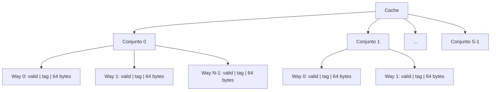
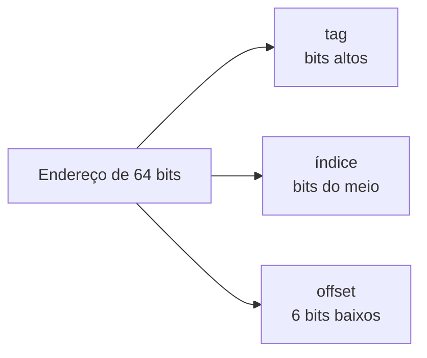

# Cache a fundo

> [!abstract] TL;DR
> Cache é uma memória intermediária minúscula e ultra-rápida que fica entre a CPU e a RAM. O hardware busca dados em blocos de 64 bytes — nunca um byte só — explorando localidade espacial. O endereço é dividido em **tag | índice | offset** para localizar o bloco no cache. Miss custa dezenas a centenas de ciclos; o segredo do código performático é minimizar misses escrevendo acesso sequencial, preferindo arrays a listas encadeadas, e entendendo os 3 C's.

---

## O problema que o cache resolve

A CPU moderna executa uma instrução em ≈ 0,3 ns (3 GHz, pipeline cheio).

A RAM principal responde em ≈ 60–100 ns.

Isso é uma lacuna de **200× a 300×**. Sem cache, a CPU ficaria parada esperando memória quase o tempo todo. O processador seria como um chef cinco estrelas esperando ingredientes chegar de outro continente por SEDEX.

O cache é o sous-vide na bancada: você pré-busca o que vai precisar, mantém perto, e serve em nanossegundos.

Veja [[11 - Hierarquia de memória e localidade]] para o contexto completo da hierarquia e do princípio de localidade que torna o cache possível.

---

## Onde o cache fica — e o que ele guarda

O cache fica **fisicamente dentro do chip da CPU**, entre os registradores e a RAM. É transparente: o programa não sabe que ele existe. O hardware intercepta cada acesso à memória e verifica o cache primeiro.

Mas o cache não guarda bytes avulsos. Ele guarda **linhas de cache** (cache lines), também chamadas de blocos.

> [!important] Linha de cache = 64 bytes
> Em x86-64 moderno (Intel desde Pentium 4, AMD desde K8), uma linha de cache tem **64 bytes**. Você nunca busca 1 byte — o hardware sempre busca os 64 bytes da linha inteira.

Por que 64 bytes? Porque a RAM tem alta **latência** (tempo até o primeiro byte) mas alta **largura de banda** (bytes por segundo após o primeiro). Buscar 64 bytes de uma vez amortiza a latência.

A consequência imediata: quando você acessa `a[0]`, o hardware busca a linha que contém `a[0]`, trazendo de brinde `a[1]`, `a[2]`, ..., `a[15]` (se `a` for `int32_t`, 16 inteiros cabem em 64 bytes). Os próximos 15 acessos são **hits gratuitos**.

Isso é localidade espacial sendo explorada automaticamente pelo hardware.

---

## Estrutura interna do cache — como ele é organizado

Um cache é organizado em **conjuntos** (sets), e cada conjunto tem **S linhas** (ways). Cada linha tem:

- Um **bit de validade** (valid bit): indica se a linha contém dados reais
- Uma **tag**: parte do endereço original, usada para verificar se é o dado certo
- Os **dados**: 64 bytes do bloco



**Leitura do diagrama:** O cache é uma grade de S conjuntos × N ways. Para localizar um bloco, o hardware usa parte do endereço para escolher o conjunto (índice), depois verifica as N tags em paralelo para encontrar o way certo.

---

## Como um endereço vira um slot — a divisão tag | índice | offset

Todo endereço de memória (64 bits em x86-64) é partido em três campos pelo hardware:



**Leitura do diagrama:** Os bits baixos identificam o byte dentro da linha (offset). Os bits do meio escolhem o conjunto (índice). Os bits altos distinguem qual bloco está no conjunto (tag).

| Campo | Tamanho | Papel |
|-------|---------|-------|
| **offset** | log₂(64) = **6 bits** | Qual byte dentro da linha de 64 bytes |
| **índice** | log₂(S) bits | Qual dos S conjuntos verificar |
| **tag** | bits restantes | Distingue blocos que mapeiam no mesmo conjunto |

### Exemplo trabalhado com números

Suponha um cache com as seguintes especificações:

- Tamanho total: **16 KB** (16.384 bytes)
- Associatividade: **4-way** (N = 4)
- Linha: **64 bytes** (b = 6 bits de offset)

Calculando:

- Total de linhas: 16.384 ÷ 64 = **256 linhas**
- Número de conjuntos: 256 ÷ 4 = **64 conjuntos** → s = log₂(64) = **6 bits de índice**
- Tag: 64 − 6 − 6 = **52 bits**

Agora, para o endereço `0x00403A80`:

Em binário (bits 11..0): `1010_0000_1000_0000`

| Campo | Bits | Valor |
|-------|------|-------|
| offset | [5:0] = `00_0000` | byte 0 da linha |
| índice | [11:6] = `10_1000` = 40 decimal | conjunto 40 |
| tag | [63:12] = `0x00403` | identifica o bloco |

O hardware vai ao **conjunto 40**, compara a tag `0x00403` com as 4 tags armazenadas lá (em paralelo) e, se alguma bater com valid=1, é um **hit**. Caso contrário, **miss**.

---

## Tipos de mapeamento — o espectro de design

Existem três estratégias para mapear blocos de memória em slots do cache:

| Tipo | Associatividade | Como funciona | Vantagem | Desvantagem |
|------|-----------------|---------------|----------|-------------|
| **Mapeamento direto** | 1-way | Cada bloco → exatamente 1 slot | Simples, barato, rápido | Conflito: dois blocos populares que mapeiam no mesmo slot brigam (thrash) |
| **Totalmente associativo** | N-way, N = total de linhas | Qualquer bloco → qualquer slot | Sem conflito | Comparar tags em paralelo em todos os slots é caro demais; só usado em TLBs pequenas |
| **Associativo por conjuntos** | N-way, N típico 2–16 | Bloco → um conjunto; dentro do conjunto, qualquer way | Equilíbrio real | Ainda pode haver conflito dentro do conjunto |

Na prática, os caches modernos usam **4-way a 16-way** associativo por conjuntos. O L1 é frequentemente 8-way, o L3 pode ser 16-way ou mais.

---

## Política de substituição — o que sai quando o cache está cheio

Quando todos os ways de um conjunto estão ocupados e chega um novo bloco, qual sai?

**LRU (Least Recently Used):** Remove o bloco que foi acessado há mais tempo. Ótimo em teoria; caro em hardware para caches muito associativos (precisa rastrear ordem de acesso).

**Pseudo-LRU:** Aproximação de LRU com bits de estado reduzidos. Usado em muitos processadores modernos porque é barato o suficiente e bom o suficiente.

**Aleatório (Random):** Escolhe aleatoriamente. Surpreendentemente bom na prática; simples de implementar; sem patologias de thrash determinístico.

> [!tip] Conexão com SO
> Eviction de linha de cache é exatamente o mesmo problema de [[03-Dominios/Ciência/Sistemas Operacionais/08 - Substituição de páginas e thrashing|substituição de páginas]]. LRU aparece nos dois contextos pelo mesmo motivo: localidade temporal sugere que o que foi usado recentemente será usado de novo.

---

## Política de escrita — o que acontece quando você escreve

Quando a CPU escreve em um endereço que está no cache (write hit), existem duas estratégias:

**Write-through:** Escreve no cache E na RAM ao mesmo tempo. RAM sempre está atualizada (coerente). Gera tráfego desnecessário na maioria dos acessos.

**Write-back:** Escreve só no cache. Marca a linha com um **dirty bit**. A RAM só é atualizada quando a linha é despejada (evicted). Muito mais eficiente; usado em quase todos os caches modernos.

| Dimensão | Write-through | Write-back |
|----------|--------------|------------|
| Escrita vai para a RAM? | Imediatamente | Só no evict |
| Dirty bit necessário? | Não | Sim |
| Tráfego de barramento | Alto | Baixo |
| Complexidade | Baixa | Maior |
| Uso prático | Raro (L1 alguns casos) | Predominante |

Quando a CPU escreve em um endereço que **não está no cache** (write miss):

- **Write-allocate:** Traz a linha para o cache, depois faz a escrita. Combina naturalmente com write-back.
- **No-write-allocate:** Escreve direto na RAM, não traz para o cache. Combina com write-through.

A combinação padrão dos processadores modernos é **write-back + write-allocate**.

---

## Os 3 C's dos misses

Todo miss de cache pertence a uma de três categorias:

| Miss | Nome comum | Causa | Remédio |
|------|-----------|-------|---------|
| **Compulsório** | Cold miss | Primeira vez que o bloco é acessado — ele nunca esteve no cache | Prefetching; streaming sequencial |
| **Capacidade** | Capacity miss | O conjunto de trabalho (working set) é maior que o cache inteiro | Cache maior; reduzir o working set (blocking/tiling) |
| **Conflito** | Conflict miss | Muitos blocos populares mapeiam no mesmo conjunto; thrash | Maior associatividade; mudar layout de dados (padding) |

> [!note] 4º C (opcional)
> Alguns autores adicionam **Coherence miss** (ou communication miss) em contexto multiprocessador: um processador invalida uma linha do cache de outro. Fica para [[15 - Multicore, coerência de cache e consistência]].

---

## AMAT — quanto custa realmente um acesso à memória?

**AMAT** = Average Memory Access Time (Tempo Médio de Acesso à Memória).

A fórmula para um cache de dois níveis (L1 + RAM):

```
AMAT = HitTime_L1 + MissRate_L1 × MisspenaltyL1
```

E com L1 + L2:

```
AMAT = HitTime_L1 + MissRate_L1 × (HitTime_L2 + MissRate_L2 × MisspenaltyL2)
```

### Exemplo numérico completo

Dados típicos de um sistema moderno:

| Parâmetro | Valor |
|-----------|-------|
| HitTime L1 | 4 ciclos |
| MissRate L1 | 5% |
| HitTime L2 | 12 ciclos |
| MissRate L2 (local) | 20% |
| Miss penalty até RAM | 200 ciclos |

**Calculando o AMAT:**

```
AMAT = 4 + 0,05 × (12 + 0,20 × 200)
     = 4 + 0,05 × (12 + 40)
     = 4 + 0,05 × 52
     = 4 + 2,6
     = 6,6 ciclos
```

Agora suponha que um código ruim eleva o MissRate L1 de 5% para 25%:

```
AMAT = 4 + 0,25 × (12 + 0,20 × 200)
     = 4 + 0,25 × 52
     = 4 + 13,0
     = 17,0 ciclos
```

A diferença: **6,6 vs 17,0 ciclos** — quase **3× mais lento** só por escrever código com padrão de acesso ruim. E isso com miss rate L2 fixo; um working set grande eleva ambos.

---

## O showcase central — percorrer matriz por linha vs. por coluna

Esta é a demonstração mais didática de cache na prática.

Considere uma matriz `int32_t A[1024][1024]` armazenada em row-major order (C/Java): os elementos de cada linha são contíguos na memória.

```
Memória: A[0][0] A[0][1] A[0][2] ... A[0][1023] | A[1][0] A[1][1] ...
          linha 0 →→→→→→→→→→→→→→→→→→→→→→→→→→→  | linha 1 →→→→→→→
```

Uma linha de cache de 64 bytes guarda 16 `int32_t`s consecutivos.

### Percurso por linha (row-major) — o caminho certo

```c
long sum = 0;
for (int i = 0; i < 1024; i++)
    for (int j = 0; j < 1024; j++)
        sum += A[i][j];
```

**Stride = 1 elemento = 4 bytes.** O acesso avança sequencialmente na memória.

- `A[0][0]`: MISS → busca linha de 64 bytes, traz `A[0][0..15]` de graça
- `A[0][1]` a `A[0][15]`: HIT (já na linha)
- `A[0][16]`: MISS → busca próxima linha
- 1 miss a cada 16 acessos

### Percurso por coluna (column-major) — o caminho errado

```c
long sum = 0;
for (int j = 0; j < 1024; j++)
    for (int i = 0; i < 1024; i++)
        sum += A[i][j];
```

**Stride = 1 linha = 4.096 bytes.** Cada acesso pula 4.096 bytes na memória.

- `A[0][0]`: MISS → busca linha de 64 bytes, traz `A[0][0..15]` — que **nunca serão usados** neste percurso
- `A[1][0]`: MISS (4.096 bytes adiante — outra linha de cache)
- `A[2][0]`: MISS
- ... 1 miss a cada acesso

### Comparação com números

Matriz `int32_t A[1024][1024]` = 4 MB. Cache L2 típico = 256 KB.

O working set (4 MB) é maior que o cache (256 KB), então capacidade é limitante.

| Métrica | Por linha | Por coluna |
|---------|-----------|------------|
| Stride | 4 bytes | 4.096 bytes |
| Miss rate aproximada | ≈ 6% (1/16) | ≈ 100% (1/1) |
| Linhas de cache úteis por miss | 16 elementos usados | 1 elemento usado |
| Ciclos extras por acesso (miss × penalty) | ≈ 0,06 × 52 ≈ 3 | ≈ 1,00 × 52 = 52 |
| **AMAT aproximado** | **≈ 7 ciclos** | **≈ 56 ciclos** |
| **Speedup relativo** | **1× (base)** | **≈ 8× mais lento** |

Na prática, medições reais em sistemas modernos mostram diferença de **5× a 12×** dependendo do tamanho da matriz, do cache e do prefetcher.

> [!warning] Prefetcher ajuda — mas não salva
> Processadores modernos têm prefetcher de hardware que detecta stride regular e busca linhas antecipadamente. Ele funciona bem para stride 1. Para stride 1024 (column-major), o prefetcher não consegue ajudar: os endereços são irregulares o suficiente para frustrá-lo.

---

## AoS vs. SoA — o padrão que todo dev sênior conhece

O mesmo princípio de stride se aplica a structs.

**AoS (Array of Structs)** — layout intuitivo:

```c
struct Particle {
    float x, y, z;    // 12 bytes
    float vx, vy, vz; // 12 bytes
    float mass;        // 4 bytes
    // total: 28 bytes (+ 4 padding = 32)
};
Particle particles[100000];
```

Se um loop processa só as posições `x, y, z`, o stride efetivo é 32 bytes. Cada linha de cache de 64 bytes carrega 2 partículas — mas você usa apenas `x, y, z` (12 bytes) de cada, desperdiçando 20 bytes de largura de banda.

**SoA (Struct of Arrays)** — layout orientado a dados:

```c
struct Particles {
    float x[100000];
    float y[100000];
    float z[100000];
    float vx[100000];
    float vy[100000];
    float vz[100000];
    float mass[100000];
};
```

Agora o loop sobre `x` tem stride 4 bytes — cada linha de cache carrega 16 valores de `x`, todos usados. **Utilização de 100% da linha.**

SoA é o coração do **data-oriented design** (DOD) que domina engines de jogos (ECS — Entity Component System) e simulações de física.

---

## Blocking/tiling — dominando o working set

Para operações em matrizes grandes (multiplicação de matrizes, convolução, transposta), o working set inteiro não cabe no cache. A solução é **dividir a matriz em blocos** (tiles) que cabem no cache L2.

A ideia em prosa: em vez de percorrer a linha inteira de A e a coluna inteira de B para multiplicação, você processa submatrizes de tamanho B×B que cabem no cache. Cada submatriz é carregada uma vez e usada completamente antes de ser descartada.

O resultado típico é **3× a 5× de speedup** em multiplicação de matrizes grande (acima de L3 cache size) comparado com a versão ingênua.

---

## Cache multi-nível — L1, L2, L3

Processadores modernos têm hierarquia de caches:

| Nível | Tamanho típico | Latência | Associatividade | Nota |
|-------|---------------|----------|-----------------|------|
| **L1** | 32–64 KB | 4–5 ciclos | 8-way | Split: L1-I (instruções) + L1-D (dados) separados |
| **L2** | 256 KB–1 MB | 12–15 ciclos | 4–8-way | Unificado (dados + instruções) |
| **L3** | 8–64 MB | 30–50 ciclos | 16-way+ | Compartilhado entre todos os cores |
| **RAM** | GB–TB | 200–300 ciclos | — | DRAM |

**L1 split I/D:** Instruções e dados têm padrões de acesso muito diferentes. Separar L1-I de L1-D permite otimizar cada um de forma independente e evita que dados expulsem instruções (e vice-versa).

**Inclusivo vs. exclusivo:**

- **Inclusivo:** Todo bloco presente no L1 também está no L2. Simplifica a coerência de cache em multicore (basta verificar L3 para garantir coerência). Custo: duplicação de dados entre níveis.
- **Exclusivo:** Um bloco existe em apenas um nível por vez. Melhor utilização da capacidade total. Mais complexo.

Intel usa L3 inclusivo (historicamente). AMD Zen usa L3 vítico (victim cache — bloco vai para L3 ao ser despejado do L2).

---

## Por que array bate lista encadeada com o mesmo O(n)

Suponha uma busca linear em 1 milhão de elementos.

**Array:**

```
[0][1][2][3][4]...[999999]  ← contíguos na memória
```

Cada linha de cache carrega 16 `int32_t`s. Para percorrer 1M elementos, são 62.500 cache misses. Sequencial, prefetcher funciona perfeitamente.

**Lista encadeada:**

```
[node0] → [node1] → [node2] → ...
 (em posições aleatórias na heap)
```

Cada nó tem um ponteiro `next` para uma posição arbitrária na heap. Cada acesso a `next` é um novo endereço aleatório → quase sempre um miss.

Para 1M nós: **≈ 1M cache misses** (pointer chasing).

Isso é o mesmo O(n), mas:

- Array: 62.500 misses × 52 ciclos = ≈ 3,25M ciclos extras
- Lista: 1.000.000 misses × 200 ciclos (vai para RAM na maioria) = **≈ 200M ciclos extras**

**Razão de ≈ 60× em favor do array** para busca linear em datasets que não cabem no cache.

Esse é o argumento cache-consciente central para preferir vetores a listas encadeadas em [[03-Dominios/Ciência/Estruturas de Dados/index|Estruturas de Dados]].

> [!tip] Implicação prática
> `std::vector` bate `std::list` na maioria dos casos reais não porque O(1) insere são raros, mas porque list nodes são alocados em posições aleatórias na heap, destruindo a localidade espacial. Mesmo inserção no meio de um vector (O(n) memmove) pode ser mais rápida que inserção em lista por causa do cache.

---

## False sharing — o teaser multicore

Em sistemas multicore, cada core tem seu próprio L1 e L2. Se dois cores escrevem em **variáveis diferentes mas que estão na mesma linha de cache de 64 bytes**, o hardware força invalidação da linha no outro core a cada escrita.

```c
// False sharing: x e y na mesma linha de cache
struct SharedData {
    int64_t x;  // core 0 escreve aqui
    int64_t y;  // core 1 escreve aqui
};
```

Apesar de não haver compartilhamento lógico de dados, os dois cores brigam pela mesma linha física — performance cai dramaticamente.

O remédio: **padding** para forçar variáveis a ficarem em linhas separadas (`alignas(64)` em C++17).

Detalhes completos em [[15 - Multicore, coerência de cache e consistência]].

---

## Prefetching — o cache lendo o futuro

O hardware tem prefetchers que detectam padrões de acesso e buscam linhas antecipadamente:

- **Prefetcher de stride:** detecta acesso a endereços com distância constante (stride 1, 2, 4...)
- **Prefetcher de stream:** detecta sequências longas de acessos crescentes/decrescentes

Para código sequencial (stride 1), o prefetcher praticamente elimina a latência de miss. É por isso que benchmarks de bandwidth de memória mostram performance muito maior que a latência simples sugeriria.

O prefetcher falha em:
- Acessos aleatórios (hash tables, ponteiros)
- Strides muito grandes (> algumas centenas de bytes)
- Padrões irregulares

Você também pode emitir prefetch manual: `__builtin_prefetch(addr, 0, 3)` em GCC/Clang.

---

## Cache como o fator #1 escondido de performance

> [!quote] Regra de ouro
> Antes de otimizar algoritmos, cheque se o problema é cache. Um O(n²) cache-friendly frequentemente vence um O(n log n) cache-unfriendly para tamanhos práticos.

Os padrões que um dev sênior internaliza:

1. **Acesso sequencial > acesso aleatório**, sempre, para datasets maiores que L1.
2. **Structs pequenas > structs grandes**: quanto menor a struct, mais cabem por linha de cache.
3. **SoA > AoS** quando você processa um único campo de muitos objetos (típico em simulações, ECS).
4. **Pré-alocar e reúsar > alocar/liberar frequentemente**: alocador fragmenta a heap; objetos de mesma classe ficam dispersos.
5. **Medir com perf/cachegrind** antes de assumir: o prefetcher pode surpreender você.

```bash
# Ver miss rate no Linux com perf
perf stat -e cache-references,cache-misses ./meu_programa

# Cachegrind (Valgrind) para análise detalhada
valgrind --tool=cachegrind ./meu_programa
cg_annotate cachegrind.out.<pid>
```

---

## Struct packing e alinhamento — impacto no cache

(Recap da nota 04 deste galho em contexto de cache)

Uma struct mal empacotada tem mais padding → ocupa mais bytes → menos objetos por linha de cache → mais misses.

```c
// Mal alinhada: 24 bytes com padding
struct Bad {
    char   a;    // 1 byte + 7 padding
    double b;    // 8 bytes
    char   c;    // 1 byte + 7 padding
    double d;    // 8 bytes — total: 32 bytes
};

// Bem alinhada: 24 bytes sem padding
struct Good {
    double b;    // 8 bytes
    double d;    // 8 bytes
    char   a;    // 1 byte
    char   c;    // 1 byte + 6 padding — total: 24 bytes
};
```

Diferença: `Bad` cabe 2 objetos por linha de 64 bytes; `Good` cabe 2,67 (arredondando: 3 a cada 2 linhas). Em arrays de milhões de objetos, isso importa.

A regra: **declare membros do maior para o menor** para minimizar padding.

---

> [!summary] Resumo em uma linha
> Cache é o hardware que explora localidade buscando linhas de 64 bytes; escrever código que respeita essa granularidade — acesso sequencial, structs compactas, SoA — pode fazer a diferença entre um programa rápido e um programa 10× mais lento com o mesmo Big-O.

---

## Em entrevista

Quando perguntarem sobre performance ou sobre por que uma solução é lenta, pense em cache antes de pensar em algoritmo. Explique a divisão tag|índice|offset, o custo do miss, e dê o exemplo de matriz linha vs. coluna — isso diferencia candidatos sênior.

*Cache is a small, ultra-fast memory between the CPU and RAM that stores 64-byte blocks called cache lines.*
*The CPU never fetches a single byte — it always fetches the entire cache line, exploiting spatial locality.*
*A cache miss occurs when the requested data is not in the cache, forcing a trip to RAM at ≈200 cycle penalty.*
*AMAT (Average Memory Access Time) = hit time + miss rate × miss penalty.*
*The three C's of cache misses are compulsory, capacity, and conflict misses.*
*Row-major traversal of a matrix has stride 1 and near-zero miss rate; column-major has stride N and near-100% miss rate.*
*Write-back caches use a dirty bit to defer writing to RAM until eviction, reducing bus traffic.*
*False sharing occurs when two cores write to different variables that share a cache line, causing unnecessary invalidations.*
*Array of Structs (AoS) wastes bandwidth when processing a single field; Struct of Arrays (SoA) achieves 100% cache line utilization.*

| Português | English |
|-----------|---------|
| Linha de cache | Cache line |
| Bloco de cache | Cache block |
| Acerto | Hit |
| Falta / Miss | Miss |
| Penalidade de miss | Miss penalty |
| Mapeamento direto | Direct-mapped |
| Totalmente associativo | Fully associative |
| Associativo por conjuntos | Set-associative |
| Conjunto | Set |
| Via / Caminho | Way |
| Tag | Tag |
| Índice | Index |
| Deslocamento / Offset | Offset |
| Bit de validade | Valid bit |
| Bit sujo | Dirty bit |
| Substituição LRU | LRU replacement |
| Escrita imediata | Write-through |
| Escrita adiada | Write-back |
| Falso compartilhamento | False sharing |
| Pré-busca | Prefetching |
| Divisão do endereço | Address decomposition |

---

> [!info] Lastro
> - Bryant, R. E.; O'Hallaron, D. R. **Computer Systems: A Programmer's Perspective** (CS:APP), 3ª ed. Pearson, 2016. Cap. 6 — The Memory Hierarchy. [csapp.cs.cmu.edu](https://csapp.cs.cmu.edu/3e/perspective.html)
> - Patterson, D. A.; Hennessy, J. L. **Computer Organization and Design: The Hardware/Software Interface** (ARM Edition). Morgan Kaufmann, 2016. Cap. 5 — Large and Fast: Exploiting Memory Hierarchy.
> - Drepper, U. **What Every Programmer Should Know About Memory**. Red Hat, Inc., 2007. Texto completo em [lwn.net/Articles/250967](https://lwn.net/Articles/250967/) e PDF em [people.freebsd.org/~lstewart/articles/cpumemory.pdf](https://people.freebsd.org/~lstewart/articles/cpumemory.pdf)
> - Hennessy, J. L.; Patterson, D. A. **Computer Architecture: A Quantitative Approach**, 6ª ed. Morgan Kaufmann, 2017. App. B — Review of Memory Hierarchy.
