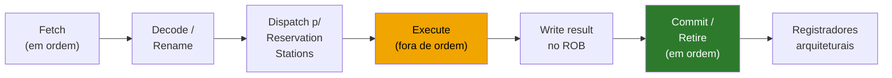
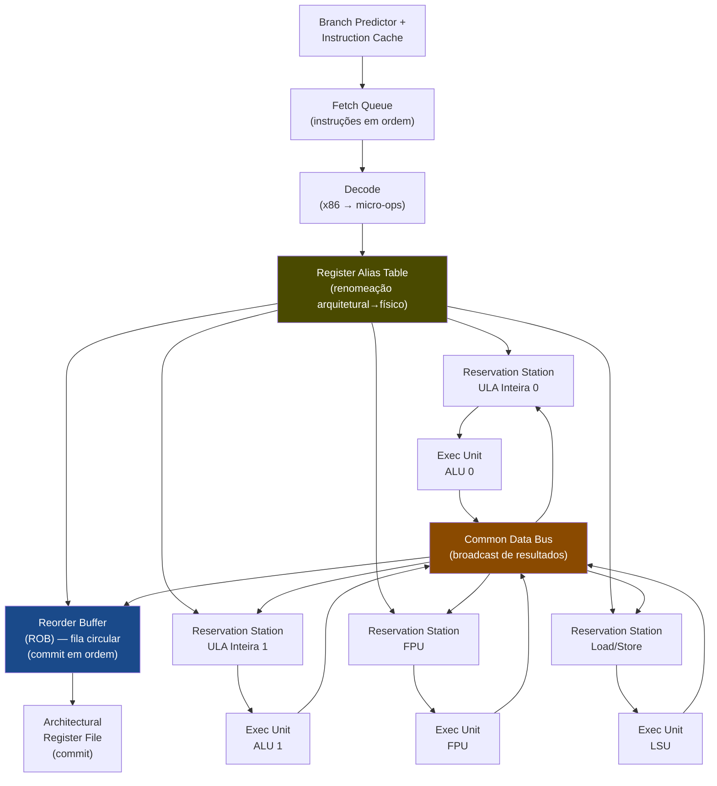
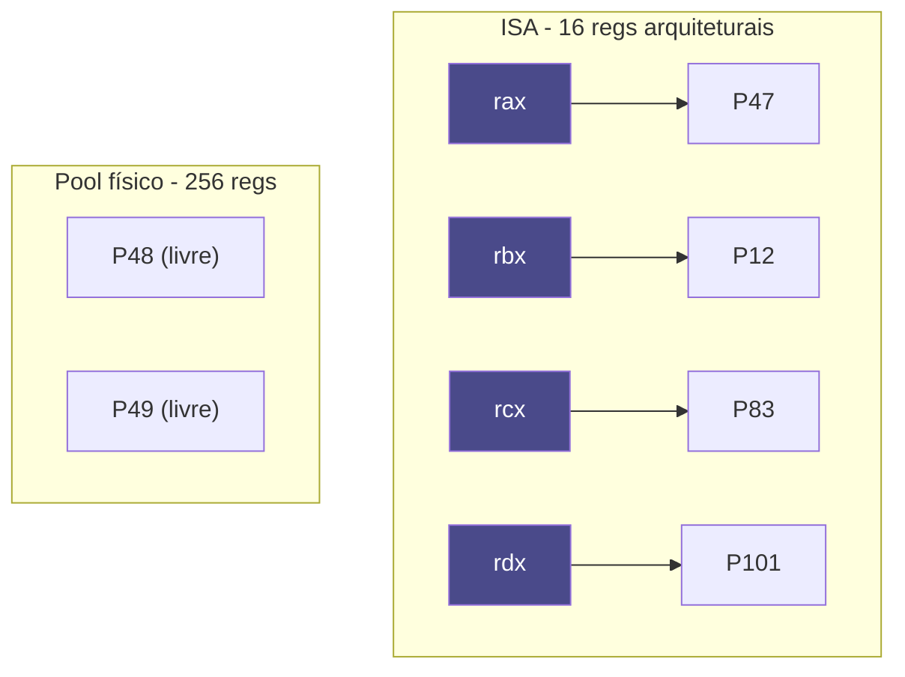

# Execução fora de ordem e superescalar

> [!abstract] TL;DR
> O pipeline clássico chega no teto de CPI = 1: uma instrução por ciclo. Para ir além, a CPU precisa emitir **várias instruções por ciclo** (superescalar, IPC > 1) e **executar instruções fora da ordem do programa** quando os operandos ficam prontos antes. O truque que permite isso sem quebrar a semântica correta é o **Reorder Buffer (ROB)**: executa desordenado, mas sempre **commita em ordem**. A **renomeação de registradores** elimina as dependências falsas (WAR e WAW), deixando apenas as verdadeiras (RAW). Todo esse maquinário — reservation stations, ROB, múltiplas ALUs — faz da CPU um **escalonador dinâmico em hardware**, muito mais sofisticado do que a ISA sugere.

---

## O teto do pipeline clássico

Em [[10 - Pipeline e hazards]] vimos que um pipeline de 5 estágios bem executado chega a **CPI ≈ 1**: idealmente uma instrução completa a cada ciclo de clock. Isso já é um ganho enorme sobre a execução sequencial, mas é um teto.

Por quê? Porque existe **apenas um caminho de dados**. Uma instrução entra, passa pelos estágios, sai. A próxima espera a vez. Mesmo com forwarding e branch prediction, o máximo teórico é *uma instrução por ciclo*.

Se o programa tiver instruções independentes — e a maioria tem — esse hardware está deixando trabalho na mesa.

A resposta é **ILP: Instruction-Level Parallelism**. O programa é uma sequência, mas muitas instruções são **logicamente independentes** e podem ser executadas ao mesmo tempo, desde que o hardware seja capaz de identificar isso e agir.

---

## Superescalar: múltiplas fábricas de resultado

Um processador **superescalar** tem **múltiplas unidades de execução** rodando em paralelo:

- Duas ou mais ALUs (Arithmetic Logic Units) inteiras
- Uma ou mais unidades de ponto flutuante (FPU)
- Múltiplas unidades de load/store
- Uma ou mais unidades de cálculo de endereço (AGU)

A CPU pode então **emitir (issue) mais de uma instrução por ciclo**. O número de instruções que ela consegue despachar por ciclo é chamado de **issue width** (largura de emissão). Um processador de emissão 4× pode, em condições ideais, emitir 4 instruções simultâneas.

Quando IPC > 1, dizemos que o CPI efetivo é < 1. Em vez de "ciclos por instrução", começamos a pensar em **IPC** (instructions per cycle) — mais natural no regime superescalar. Ver [[18 - Performance - CPI, benchmarks e Amdahl]] para a contabilidade completa.

```
Diagrama 1 — Largura de emissão: pipeline simples vs. superescalar 4×
```

| Ciclo | Pipeline simples (1×) | Superescalar 4× (ideal) |
|-------|----------------------|------------------------|
| 1     | I1 no Fetch          | I1 I2 I3 I4 no Fetch   |
| 2     | I2 no Fetch / I1 no Decode | I5 I6 I7 I8 no Fetch / I1-I4 no Decode |
| 3     | I3 / I2 / I1 no EX  | I9-I12 / I5-I8 / I1-I4 no EX |
| ...   | ...                  | ...                    |
| N     | IPC ≈ 1              | IPC ≈ 4 (sem deps)     |

**Leitura do diagrama:** a coluna da direita mostra que, com 4 unidades paralelas, a CPU alimenta 4 instruções por ciclo. O "≈ 4" é teórico; dependências e conflitos de recursos reduzem o IPC real. Em chips modernos (Intel Golden Cove, AMD Zen 4) a issue width chega a 6–8, mas o IPC sustentado em código real fica na faixa de 3–5.

---

## O problema: execução em ordem trava tudo

Ter múltiplas unidades de execução não basta se a CPU ainda emite instruções **em ordem**. Por quê?

Imagine a sequência:

```
I1: LOAD  R1 ← [endereço de memória]   ; latência de 100+ ciclos se cache miss
I2: ADD   R2 ← R1 + R3                ; depende de R1 → tem que esperar I1
I3: ADD   R4 ← R5 + R6                ; INDEPENDENTE de R1 e R2
I4: MUL   R7 ← R8 × R9                ; INDEPENDENTE
```

Num processador **in-order** (em ordem), mesmo que I3 e I4 não dependam de nada que está esperando, elas ficam **bloqueadas atrás de I2**, que está bloqueada atrás de I1.

O diagrama de bolha fica assim:

```
Diagrama 2 — In-order vs. Out-of-Order: o efeito da bolha
```

| Ciclo | In-order                  | Out-of-Order              |
|-------|---------------------------|---------------------------|
| 1     | I1: LOAD (emitida)        | I1: LOAD (emitida)        |
| 2     | bolha — esperando cache   | I2: stall (deps R1)       |
| 3     | bolha                     | **I3 e I4 emitidas!**     |
| 4     | bolha                     | I3, I4 executando         |
| ...   | bolha                     | ...                       |
| 101   | I1 completa, I2 emitida   | I1 completa, I2 emitida   |
| 102   | I3 emitida                | commit I1, I2, I3, I4 (em ordem) |

**Leitura do diagrama:** no in-order, ~100 ciclos desperdiçados. No OoO, I3 e I4 executaram enquanto I1 carregava da memória — trabalho útil no mesmo slot de tempo. O ganho é enorme.

---

## Execução fora de ordem (Out-of-Order Execution)

A ideia central da **OoO execution**: execute instruções quando seus **operandos estiverem prontos**, independentemente da posição delas no fluxo do programa.

Mas há um problema sério. Se a CPU executa em ordem aleatória e ocorre uma **exceção** no meio do caminho — ou uma instrução que veio "depois" já escreveu resultado antes da que deveria vir antes — o estado do programa fica inconsistente.

A solução é separar dois conceitos:

- **Execução** pode ser fora de ordem.
- **Commit (retire)** é sempre **em ordem**.

> [!tip] A regra de ouro
> **Execute desordenado, commita ordenado.** Essa regra garante que o estado arquitetural visível (o que o SO, o debugger, o handler de exceção veem) é sempre coerente com a ordem do programa.

---

## O Reorder Buffer (ROB)

O mecanismo que implementa a regra de ouro é o **Reorder Buffer**.

Funciona assim:

1. Instruções chegam do fetch **em ordem** e entram no ROB mantendo sua posição relativa.
2. Cada instrução é despachada para uma **reservation station** quando uma unidade de execução compatível estiver livre.
3. A instrução executa assim que seus operandos chegam — possivelmente fora de ordem.
4. O resultado vai para um **buffer temporário** no ROB (não para o registrador arquitetural ainda).
5. O ROB **só escreve o resultado no banco de registradores** (commit) quando a instrução chega à **cabeça da fila** — ou seja, quando todas as anteriores já commitaram.

Se uma exceção ocorre, o ROB descarta tudo que está além da instrução faltante — o estado é o de um processador que executou perfeitamente em ordem até aquele ponto. Isso é chamado de **exceção precisa**.

```
Diagrama 3 — Pipeline OoO com ROB (fluxo completo)
```



**Leitura do diagrama:** o estágio amarelo (Execute) é onde a ordem do programa é quebrada. O estágio verde (Commit) restaura a ordem. Entre os dois, o ROB serve de "sala de espera" onde resultados aguardam sua vez de serem tornados permanentes.

---

## Anatomia de um processador superescalar OoO

Antes de entrar nos detalhes do Tomasulo, ajuda ver a estrutura completa de uma CPU OoO superescalar. Cada bloco tem um papel específico na ilusão de "execução sequencial com desempenho paralelo".

```
Diagrama 4 — Estrutura interna de um processador superescalar OoO
```



**Leitura do diagrama:** as instruções entram pelo topo (fetch), passam pela decodificação e renomeação (RAT), e são inseridas no ROB e nas reservation stations. Cada RS monitora o CDB: quando o resultado que ela espera aparecer no barramento, ela captura o valor e fica pronta para executar. As unidades de execução são paralelas — ALU 0 e ALU 1 podem rodar operações diferentes ao mesmo tempo. O ROB (fila circular azul) mantém a ordem de commit. O ARF (banco de registradores arquiteturais) só é atualizado quando a instrução chega ao commit.

Numa CPU moderna como o Intel Core (Golden Cove), esse diagrama se expande para algo como:
- 6 slots de decodificação por ciclo (decodifica até 6 micro-ops)
- 5 portas de execução para operações inteiras (portas 0, 1, 5, 6, plus uma para shifts)
- 3 portas para load/store
- ROB com ~512 entradas
- Pool de 280+ registradores físicos inteiros

O AMD Zen 5 vai ainda mais longe com decodificação de até 8 macro-ops por ciclo.

---

## Reservation Stations e o algoritmo de Tomasulo

Como a CPU sabe quando os operandos de uma instrução estão prontos para executar?

A resposta é o **algoritmo de Tomasulo**, publicado por Robert Tomasulo em 1967 enquanto trabalhava na IBM para o mainframe System/360 Model 91 — um dos algoritmos mais elegantes da arquitetura de computadores.

O mecanismo funciona assim:

Cada instrução despachada vai para uma **reservation station** (RS) associada à sua unidade de execução. A RS guarda:

- O **opcode** da instrução
- Os **operandos** que já estão disponíveis (valores reais)
- Para operandos ainda não prontos: o **tag** da instrução que vai produzi-los (não o registrador em si)

Quando uma instrução completa, ela **broadcast** seu resultado num barramento chamado **Common Data Bus (CDB)**. Todas as reservation stations "escutam" o CDB. Se uma RS estiver esperando o resultado com aquele tag, ela captura o valor imediatamente.

Assim que todos os campos de uma RS estão preenchidos com valores reais, a instrução está pronta para executar. A CPU a despacha para a unidade de execução assim que uma unidade compatível estiver livre.

> [!info] Por que isso é brilhante
> Nunca tem acesso a registradores arquiteturais durante a execução OoO — trabalha-se com **tags de dependência**. Isso elimina o gargalo de "esperar o banco de registradores atualizar" e permite que o hardware rastreie dependências automaticamente sem intervenção do compilador.

---

## Renomeação de registradores

Existe uma categoria inteira de dependências que são **falsas** — não representam um fluxo de dado real, mas apenas uma reutilização do mesmo nome de registrador:

```
Diagrama 5 — Tabela de tipos de dependência
```

| Tipo | Nome formal         | Exemplo                      | Real ou Falsa? | Elimina com renomeação? |
|------|---------------------|------------------------------|----------------|------------------------|
| RAW  | Read After Write    | I1: R1 ← R2+R3 / I2: R4 ← R1+R5 | **Real** — dado flui de I1 para I2 | Não — precisa esperar |
| WAR  | Write After Read    | I1: R4 ← R1+R5 / I2: R1 ← R2+R3 | **Falsa** — só conflito de nome | **Sim** |
| WAW  | Write After Write   | I1: R1 ← R2+R3 / I2: R1 ← R4+R5 | **Falsa** — só conflito de nome | **Sim** |

**Leitura da tabela:** RAW é a única dependência verdadeira — há um dado que precisa fluir de uma instrução para outra. WAR e WAW são conflitos de nome: duas instruções querem usar o mesmo registrador, mas não porque uma precisa do valor da outra.

Como resolver WAR e WAW? Com **renomeação de registradores**.

A CPU mantém um **pool de registradores físicos** muito maior que os registradores arquiteturais expostos pela ISA. No x86-64, a ISA expõe 16 registradores de propósito geral. Internamente, um processador moderno tem 200–300+ registradores físicos.

Sempre que uma instrução escreve num registrador arquitetural (digamos, `rax`), a CPU aloca um **registrador físico novo** para ela e atualiza a **tabela de mapeamento** (Register Alias Table, RAT):

```
Diagrama 6 — Renomeação arquitetural → físico
```



**Leitura do diagrama:** `rax` aponta para `P47` no ciclo atual. Quando uma nova instrução escreve `rax`, ela recebe `P48` — e o RAT é atualizado para `rax → P48`. A instrução anterior que leu de `P47` não é afetada. WAR resolvido.

Após a renomeação, **apenas RAW permanece** como dependência real. E RAW não pode ser eliminado — se I2 genuinamente precisa do resultado de I1, ela tem que esperar. Mas agora o hardware consegue agendar tudo o mais enquanto essa dependência se resolve.

---

## Os limites do ILP

ILP existe, mas não é infinito. Programas têm:

- **Cadeias de dependência longas**: I2 depende de I1, I3 depende de I2 — execução serializada por RAW, janela grande não ajuda.
- **Branches**: interrompem o fluxo; sem especulação (→ [[14 - Branch prediction e execução especulativa]]) a CPU trava esperando saber qual instrução vem depois.
- **Cache misses**: uma instrução de load esperando dado da memória pode bloquear uma cadeia inteira de dependentes, mesmo com OoO.

Pesquisas dos anos 1990 e 2000 mostraram que, mesmo com janelas de instruções enormes, o **IPC médio** de código real raramente passa de 3–4 — e frequentemente fica em 1–2 em loops com dependências.

Esse teto do ILP foi um dos principais motivadores para o **multicore** (→ [[15 - Multicore, coerência de cache e consistência]]): ao invés de extrair mais paralelismo dentro de um único thread, colocar múltiplos núcleos para executar threads distintos.

> [!warning] O paradoxo do ILP
> Mais complexidade de OoO (janela maior, mais reservation stations) traz retornos decrescentes em código real. Um núcleo com janela de 256 instruções não é 4× mais rápido que um com janela de 64. É por isso que Apple (Firestorm, Avalanche, Everest) e AMD (Zen) investem em pipelines **mais largos mas pragmáticos**, não infinitos.

---

## Como a CPU esconde a latência da memória

Um cache miss de L1 custa ~4 ciclos. L2: ~12. L3: ~40. DRAM: ~200+ ciclos.

Com execução em ordem, um cache miss é uma **bolha massiva**. Com OoO, a CPU pode:

1. Emitir o load que vai falhar no cache.
2. **Continuar executando** instruções independentes enquanto o dado vem da memória.
3. Quando o dado chega, completar as instruções que dependiam do load.

Se houver **múltiplos loads independentes em voo** ao mesmo tempo, o hardware pode ter várias requisições de memória em andamento simultaneamente — isso é o **MLP: Memory-Level Parallelism**.

Com uma janela de 200 instruções em voo, a CPU pode "ver adiante" e emitir um segundo, terceiro, quarto load antes que o primeiro complete. Em benchmarks de acesso a arrays grandes, isso pode reduzir o tempo de execução em 3–5× comparado com um processador sequencial.

---

## A CPU como escalonador dinâmico

Aqui está o insight fundamental que a maioria dos devs não tem:

**A ISA (como x86-64) é uma abstração.** O que você escreve em assembly ou o que o compilador gera é uma sequência de instruções ordenadas para uma CPU sequencial fictícia. O processador real é completamente diferente:

- Ele **quebra instruções** x86-64 em micro-ops internas (µops) — até 4 µops por instrução em alguns casos.
- Ele **renomeia registradores** para um pool físico 10–15× maior.
- Ele **mantém uma janela** de 300–500 µops em voo simultaneamente (Intel Alder Lake, AMD Zen 4).
- Ele **escalona dinamicamente** cada µop para a primeira unidade de execução disponível.
- Ele **commita em ordem** para manter a ilusão de execução sequencial.

> [!example] Implicação prática para otimização
> **Código latency-bound** tem uma cadeia longa de dependências RAW:
> ```
> x = a + b;
> y = x * c;   // depende de x
> z = y - d;   // depende de y
> ```
> A CPU não pode paralelizar isso. Cada operação espera a anterior.
>
> **Código throughput-bound** tem operações independentes:
> ```
> x1 = a1 + b1;
> x2 = a2 + b2;   // independente
> x3 = a3 + b3;   // independente
> ```
> A CPU sobrepõe as três. O tempo real ≈ latência de uma adição, não de três.

---

## Por que micro-benchmarks enganam

Você escreve um benchmark que soma 8 números em loop. Mede: 0.5 ns por operação. "Mas uma adição FP leva 4 ciclos a 3 GHz = 1.3 ns!"

A CPU estava sobrepondo as somas independentes — throughput de 1/ciclo, latência de 4 ciclos, mas várias em voo. O benchmark mediu **throughput**, não latência.

Ou o oposto: você escreve um benchmark com uma cadeia de dependências e fica decepcionado com a "performance". A CPU é limitada pelo caminho crítico de dependências RAW, não pela capacidade bruta de cálculo.

Sem entender OoO, superescalar e dependências, micro-benchmarks são armadilhas.

> [!danger] Armadilha clássica
> Nunca interprete "latência de instrução" e "throughput de instrução" como a mesma coisa. Consulte tabelas de instruções (Agner Fog's instruction tables) para separar os dois. Uma instrução pode ter latência 10 e throughput 1/ciclo — elas só não podem ser encadeadas rapidamente, mas múltiplas independentes se sobrepõem.

---

## A conexão com especulação

Um problema grave de OoO: **branches**.

A CPU está executando N instruções à frente. Chega um branch condicional. Ela não sabe quais instruções virão depois até calcular a condição.

Solução: **especulação**. A CPU aposta num caminho, começa a executar instruções especulativas, e as coloca no ROB como "tentativas". Se o branch foi previsto certo, o ROB commita normalmente. Se errou, o ROB **descarta** tudo especulativo e recomeça.

O mecanismo do ROB é fundamental aqui — sem a separação entre execução e commit, não seria possível "desfazer" instruções especulativas sem corromper o estado arquitetural. Ver [[14 - Branch prediction e execução especulativa]] para a mecânica de predição e o custo do mispredict.

---

> [!summary] Resumo em uma linha
> Superescalar emite múltiplas instruções por ciclo com várias unidades de execução; OoO execution garante que instruções executem quando os operandos ficam prontos (não na ordem do programa), usando o ROB para commitar em ordem e renomeação de registradores para eliminar dependências falsas — transformando a CPU num escalonador dinâmico em hardware.

---

## Em entrevista

Superescalar e OoO aparecem em entrevistas de sistemas, performance engineering e embedded quando o entrevistador quer saber se você entende **por que o hardware age diferente do que o código sugere**.

Diga que o pipeline clássico tem teto CPI=1; superescalar quebra esse teto com issue width > 1; OoO execution resolve o problema de instruções que travam o pipeline ao executar as independentes adiantadas; o ROB garante commit em ordem para manter semântica correta e exceções precisas; renomeação de registradores elimina dependências falsas WAR e WAW; e os limites do ILP foram um dos motivos do multicore.

*The classic pipeline has a ceiling of CPI = 1; superscalar breaks that ceiling by issuing multiple instructions per cycle.* *Out-of-order execution lets the CPU execute ready instructions before stalled ones, hiding latency.* *The Reorder Buffer is the mechanism that allows OoO execution while committing results in program order.* *Register renaming maps architectural registers to a larger pool of physical registers.* *WAR and WAW are false dependencies — they are eliminated by renaming; only true RAW dependencies remain.* *The instruction window defines how many in-flight instructions the CPU can track and schedule simultaneously.* *Latency-bound code has long RAW chains; throughput-bound code has independent operations that the CPU can overlap.* *Memory-level parallelism is the CPU's ability to have multiple cache-miss loads in flight simultaneously.* *ILP has diminishing returns in real code — this is why multi-core became the dominant scaling strategy.*

| Português | English |
|-----------|---------|
| Paralelismo em nível de instrução | Instruction-Level Parallelism (ILP) |
| Execução fora de ordem | Out-of-Order Execution (OoO) |
| Execução em ordem | In-order execution |
| Emissão de instrução | Instruction issue |
| Largura de emissão | Issue width |
| Janela de instruções | Instruction window |
| Buffer de reordenação | Reorder Buffer (ROB) |
| Renomeação de registradores | Register renaming |
| Registrador arquitetural | Architectural register |
| Registrador físico | Physical register |
| Tabela de alias de registradores | Register Alias Table (RAT) |
| Estação de reserva | Reservation station |
| Barramento de dados comum | Common Data Bus (CDB) |
| Commit / retirada | Commit / retire |
| Dependência verdadeira | True dependence (RAW) |
| Dependência falsa | False dependence (WAR, WAW) |
| Paralelismo em nível de memória | Memory-Level Parallelism (MLP) |
| Código limitado por latência | Latency-bound code |

---

> [!info] Lastro
> - Hennessy, J. L. & Patterson, D. A. *Computer Architecture: A Quantitative Approach*, 6ª ed. (2017). Cap. 3: "Instruction-Level Parallelism and Its Exploitation" — cobre dynamic scheduling, Tomasulo, ROB, especulação e limites do ILP.
> - Patterson, D. A. & Hennessy, J. L. *Computer Organization and Design: The Hardware/Software Interface* (RISC-V Edition, 2020). Cap. 4 e Apêndice C — pipeline, hazards e introdução ao OoO.
> - Tomasulo, R. M. "An Efficient Algorithm for Exploiting Multiple Arithmetic Units." *IBM Journal of Research and Development*, 11(1), pp. 25–33, Jan. 1967. DOI: 10.1147/rd.111.0025 — o artigo original, recebido em 1965, publicado em 1967.
> - Bryant, R. E. & O'Hallaron, D. R. *Computer Systems: A Programmer's Perspective (CS:APP)*, 3ª ed. (2016). Cap. 4 e 5 — arquitetura do processador Y86-64, pipeline e otimização de performance do ponto de vista do programador.
> - Stonybrook University, CSE 502 — *Out-of-Order Execution & Register Renaming* (slides Nahmsuk Honarmand, 2018): https://compas.cs.stonybrook.edu/~nhonarmand/courses/sp18/cse502/slides/08-superscalar_ooo.pdf — material acadêmico verificado, alinhado com H&P.
