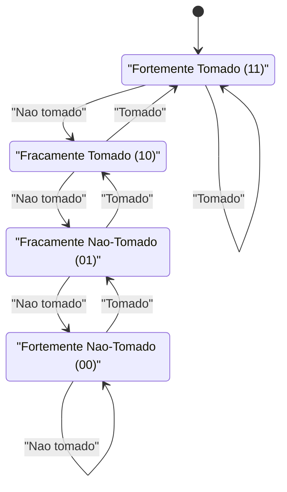
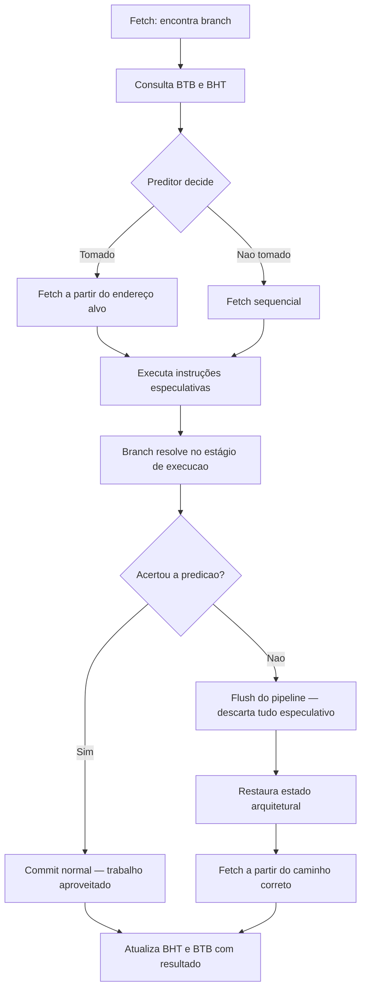
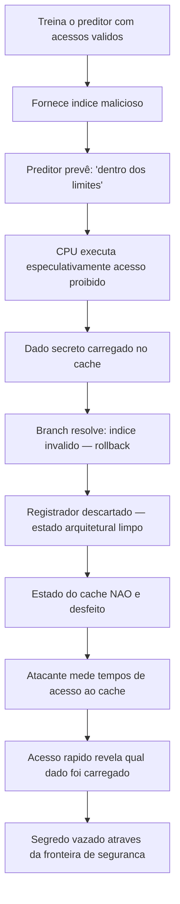

# Branch prediction e execução especulativa

> [!abstract] TL;DR
> Branches são onipresentes (~15–20% de todas as instruções) e travam o pipeline se o processador esperar para saber o destino. A solução é **adivinhar antes** (branch prediction) e **executar o palpite** (execução especulativa). Se acertou, ganhou ciclos de graça. Se errou, descarta tudo e paga a penalidade: até 20 ciclos jogados fora. Preditores modernos acertam 95–99% das vezes — e essa magia deixou um rastro de segurança que virou as vulnerabilidades Spectre e Meltdown.

---

## O problema: hazards de controle travam tudo

Você já viu em [[10 - Pipeline e hazards]] que o pipeline precisa buscar a próxima instrução enquanto ainda está executando a atual. Para instruções sequenciais, isso é fácil: a próxima instrução está no endereço atual + tamanho.

Mas o que acontece quando o processador encontra um `if`, um `for`, um `switch`?

Ele simplesmente **não sabe** qual instrução vem a seguir. O branch pode ser tomado (ir para outro endereço) ou não tomado (continuar sequencialmente). E a decisão só é conhecida lá no estágio de execução — vários ciclos depois do fetch.

O que um pipeline ingênuo faz? Para. Espera. Esvazia os estágios.

Isso se chama **bubble**: um bolsão de NOPs que percorre o pipeline enquanto aguarda a resolução do branch. Em pipelines rasos (5 estágios), o custo é de 1–3 ciclos por branch. Em pipelines modernos com 10–20 estágios, pode ser 15–20 ciclos de desperdício **por branch errado**.

Agora pense: ~15–20% das instruções em código típico são branches. Em um loop apertado com comparações, essa taxa pode passar de 30%. Em um pipeline de 15 estágios, esperar por cada branch tornaria o processador imensamente mais lento do que parece no papel.

A solução não é eliminar os branches. É **aprender a adivinhar**.

---

## Branch prediction estática: o palpite sem histórico

A forma mais simples de prediction não precisa de nenhuma informação de runtime.

**Sempre não tomado (predict-not-taken):** o processador assume que o branch não será tomado e continua buscando instruções sequencialmente. Funciona bem para branches de saída de loop (que na maioria das iterações não são tomados) mas erra sistematicamente no branch de retorno ao início do loop.

**Sempre tomado (predict-taken):** o oposto. Assume que o branch sempre salta. Funciona melhor para loops que iteram muitas vezes (o branch de volta ao início é tomado ~N-1 vezes, não tomado só na última).

**Heurística de direção:** branches para trás (endereço destino < endereço atual) geralmente são loops → predict taken. Branches para frente geralmente são saídas de condições raras → predict not taken. Compiladores modernos usam isso como hint para o linker.

A precisão típica da predição estática fica em torno de 65–75%. Melhor do que nada, mas longe do ideal.

> [!tip] Dica prática
> Quando você usa `__attribute__((cold))` em uma função ou marca um bloco como improvável, você está dando ao compilador informação para que ele organize o código de forma que a predição estática funcione melhor — mantendo o caminho quente sequencial e o caminho frio em um salto para frente.

---

## Branch prediction dinâmica: aprender com o histórico

A ideia central é simples: **o comportamento passado de um branch prevê bem o comportamento futuro**. Loops executam centenas ou milhares de vezes. Condições de erro raramente são verdadeiras. Ponteiros de função em loops de eventos quase sempre chamam a mesma função.

A predição dinâmica mantém uma tabela com histórico de branches passados e usa esse histórico para prever o próximo.

### Contador saturante de 1 bit

O hardware mais simples: uma tabela indexada pelo endereço do branch (os bits menos significativos do PC), onde cada entrada é um único bit.

- Bit = 1 → "da última vez foi tomado, prevejo tomado"
- Bit = 0 → "da última vez não foi tomado, prevejo não tomado"

O problema é óbvio: um loop que itera 100 vezes vai errar **duas vezes** — uma quando começa (muda de não-tomado para tomado) e uma quando termina (muda de tomado para não-tomado). Mas loops aninhados são piores: o branch interno troca de direção a cada iteração do loop externo, causando erro toda vez.

### Contador saturante de 2 bits: o clássico

A solução elegante: em vez de 1 bit, use 2 bits como um **contador saturante** com 4 estados.

O diagrama abaixo mostra os 4 estados e as transições:



**Leitura do diagrama:** os dois estados "fortes" (ST e SN) exigem dois erros consecutivos para mudar a previsão. Isso torna o preditor robusto contra oscilações ocasionais. Um loop que itera 100 vezes ainda erra duas vezes, mas loops aninhados agora erram muito menos — o estado "fortemente tomado" absorve a transição de um erro sem mudar a previsão.

A precisão do contador de 2 bits em benchmarks clássicos fica em torno de 80–90% — uma melhoria significativa sobre 1 bit com custo hardware mínimo.

### Branch History Table e Branch Target Buffer

A **BHT (Branch History Table)** é a tabela de contadores saturantes. Ela é indexada por bits do PC do branch e armazena o estado atual do preditor para cada branch recentemente visto.

Mas há um segundo problema: mesmo que você saiba que o branch **será tomado**, para onde ele vai? O processador precisa do endereço destino para buscar as instruções certas.

O **BTB (Branch Target Buffer)** resolve isso. É uma tabela cache que associa o PC do branch ao endereço destino da última vez que foi executado. Se o branch está no BTB e o preditor diz "tomado", o processador imediatamente começa a buscar a partir do endereço em cache.

Juntos, BHT + BTB permitem que o processador comece a buscar instruções do caminho previsto **no mesmo ciclo** em que detecta o branch — sem nenhuma bolha, no caso feliz de acerto.

### Preditores correlacionados e de dois níveis

O problema do contador de 2 bits é que ele olha para cada branch isoladamente. Mas branches interagem: o resultado de um `if` frequentemente depende de um `if` anterior na mesma função.

Os **preditores correlacionados** (também chamados de dois níveis) mantêm um **shift register global** que registra o histórico dos últimos N branches (tomado/não-tomado como bits). Esse histórico é concatenado ou XOR'd com bits do PC para indexar a BHT. O resultado é que a tabela de contadores agora está indexada por "qual foi o padrão de branches recente + qual é este branch" — capturando correlações entre branches diferentes.

O preditor **(2,2)** usa 2 bits de histórico global para selecionar entre 4 tabelas de contadores de 2 bits. Apesar da simplicidade, supera consistentemente o contador de 2 bits com o mesmo tamanho de tabela.

### TAGE: o estado da arte

O **TAGE (TAgged GEometric history length predictor)** é a família de preditores dominante em CPUs modernas (Intel desde Nehalem, AMD Zen). A ideia central: manter múltiplas tabelas de predição, cada uma indexada com comprimentos de histórico **geometricamente crescentes** (4, 8, 16, 32, 64, 128 bits de histórico...) mais bits do PC. A tabela com o maior comprimento de histórico que tem uma entrada válida (tag match) para o branch atual vence.

O efeito: branches simples e periódicos são capturados pelas tabelas de histórico curto. Padrões complexos e raros são capturados pelas tabelas de histórico longo. O preditor automaticamente usa o grau de correlação certo para cada branch.

Preditores modernos baseados em TAGE atingem **95–99% de acerto** em cargas de trabalho típicas. Uma melhoria aparentemente pequena de 95% para 99% significa reduzir as mispredictions por um fator de 5 — impacto enorme em performance.

---

## Tipos de preditor: comparação

A tabela abaixo resume as abordagens em ordem de sofisticação:

| Tipo | Mecanismo | Precisão típica | Custo hardware |
|---|---|---|---|
| Estático always-not-taken | Nenhum estado | 55–65% | Zero |
| Estático + heurística direcional | Zero estado, decisão no assembly | 65–75% | Zero |
| Contador saturante 1 bit | 1 bit por branch | 70–80% | Mínimo |
| Contador saturante 2 bits | 2 bits por branch (4 estados) | 80–90% | Baixo |
| Correlacionado / dois níveis | Histórico global + tabela de contadores | 88–95% | Moderado |
| TAGE e variantes modernas | Múltiplas tabelas com históricos geométricos | 95–99% | Alto |

---

## Execução especulativa: agir antes de saber

Prever é metade da solução. A outra metade é **agir sobre a previsão imediatamente**.

A **execução especulativa** significa que o processador não apenas busca (fetch) as instruções do caminho previsto — ele decodifica, despacha, executa e até escreve em registradores de renaming, tudo **antes de saber se o branch será realmente tomado**.

Isso casa perfeitamente com a execução fora de ordem (OoO) que você viu em [[13 - Execução fora de ordem e superescalar]]. A janela de instruções do OoO precisa ser alimentada continuamente para manter as unidades de execução ocupadas. Sem especulação, a janela para no branch. Com especulação, ela avança pelo caminho previsto, podendo acumular dezenas ou centenas de instruções especulativas em voo ao mesmo tempo.

O fluxo completo de uma predição é este:



**Leitura do diagrama:** o caminho feliz (acerto) vai direto de F para I — o trabalho especulativo se torna trabalho real sem custo adicional. O caminho triste (erro) vai para J, K, L — todo o trabalho especulativo é descartado, o estado é restaurado ao ponto anterior ao branch, e o fetch recomeça do zero pelo caminho correto. Por isso a misprediction custa tantos ciclos.

### O custo da misprediction

Em um pipeline de profundidade D, uma misprediction desperdiça aproximadamente D ciclos: os estágios que estavam processando instruções do caminho errado precisam ser esvaziados.

Pipelines Intel modernos têm ~14-20 estágios em operação normal. Isso significa que uma misprediction custa entre **10 e 20 ciclos** de latência. Em uma CPU rodando a 4 GHz com IPC de 4 (superescalar), 20 ciclos de bolha representam a perda de ~80 instruções que poderiam ter sido executadas.

Compare isso com uma operação de soma (1 ciclo), uma multiplicação (3-5 ciclos), ou até uma divisão de inteiros (20-40 ciclos). A misprediction rivaliza com as operações mais caras do processador — e acontece em branches, que são comuns.

### O timeline de acerto versus erro

A tabela abaixo ilustra o que acontece nos ciclos em cada cenário:

| Ciclo | Acerto de predição | Erro de predição |
|---|---|---|
| 1 | Fetch branch | Fetch branch |
| 2 | Decode branch + fetch I1 especulativo | Decode branch + fetch I1 errado |
| 3–N | Executa N instruções especulativas | Executa N instruções erradas |
| N+1 | Branch resolve: acertou | Branch resolve: errou |
| N+2 | Commit especulativo normalmente | Flush: descarta I1..IN |
| N+3 | Continua pipeline cheio | Fetch do caminho correto (do zero) |
| N+4 a N+D | Throughput normal | Pipeline vazio enchendo de novo |

O custo real é a diferença entre N+2 (acerto) e N+D (erro após flush). Para pipelines modernos, essa diferença pode ser facilmente 15 ciclos.

---

## Spectre e Meltdown: quando a especulação vaza

> [!danger] Vulnerabilidade arquitetural fundamental
> As vulnerabilidades Spectre (Kocher et al., 2018) e Meltdown (Lipp et al., 2018) expuseram que a execução especulativa deixa rastros microarquiteturais mensuráveis mesmo após um rollback. O processador pode executar código que "não deveria existir" — e essa execução deixa marcas.

O mecanismo central do Spectre, em prosa:

**Passo 1:** um atacante treina o preditor de branches para esperar que uma checagem de segurança seja verdadeira (por exemplo, `if (index < array_size)`). Isso é feito executando o código legítimo muitas vezes com um índice válido, até o preditor ficar convicto que o branch é "sempre tomado".

**Passo 2:** o atacante então fornece um índice fora dos limites, mas antes que o preditor possa ser corrigido. O preditor, treinado, prevê "tomado" (dentro dos limites). O processador começa a executar especulativamente o acesso `array[index]` — um acesso a memória que **o código jamais deveria fazer**.

**Passo 3:** embora o branch finalmente resolva como "não tomado" (índice inválido) e o rollback ocorra, já é tarde demais. O acesso especulativo à memória proibida carregou dados no cache. O rollback descarta o valor do registrador, mas **não desfaz o estado do cache** — o dado lido (mesmo que "ilegalmente") deixou um rastro na hierarquia de cache que vimos em [[12 - Cache a fundo]].

**Passo 4:** o atacante mede o tempo de acesso a vários endereços de memória legítimos. Acessos rápidos (< ~100 ns) indicam que aquele endereço está no cache. Acessos lentos indicam que não está. Esse ataque de temporização — **Flush+Reload** ou **Prime+Probe** — permite ao atacante inferir quais bytes foram carregados pelo acesso especulativo, reconstruindo dados que jamais deveriam ser visíveis.

O fluxo do ataque:



**Leitura do diagrama:** o rollback limpa os registradores (estado arquitetural) mas não o cache (estado microarquitetural). Essa assimetria é a raiz da vulnerabilidade. O Meltdown usa um mecanismo similar mas explora a execução especulativa de acessos a memória do kernel antes que a proteção de privilégio seja verificada.

### Mitigações e seu custo

As mitigações desenvolvidas após 2018 foram cirúrgicas mas custosas:

**Retpoline (return trampoline):** para branches indiretos (chamadas via ponteiro de função), substitui o `jmp [rax]` por uma sequência que "engana" o BTB para não especular no destino. Isso elimina um vetor de Spectre mas adiciona instruções ao caminho crítico.

**IBRS/IBPB/STIBP:** barreiras de especulação em nível de hardware — instruções que invalidam o estado do preditor em pontos estratégicos (troca de processo, entrada no kernel). Custo: dezenas de ciclos por chamada de sistema.

**KPTI (Kernel Page Table Isolation):** remove o mapeamento do kernel do espaço de endereçamento do usuário, impedindo que código especulativo do usuário acesse memória do kernel. Custo: cada syscall requer uma troca de page table — 200-800 ciclos de overhead em cargas com muitas syscalls.

O custo total em performance medido logo após os patches em 2018 ficou entre **5% e 30%** dependendo da carga de trabalho, com cargas intensivas em I/O (bancos de dados, servidores web com muitas syscalls) sendo as mais afetadas. Em cargas de processamento puro (cálculo numérico), o impacto foi menor.

> [!warning] Canal lateral de cache
> O que Spectre explorou — medir tempos de cache para inferir dados — se chama **side channel attack via cache timing**. A execução especulativa transformou uma técnica conhecida de ataque em um vetor que atravessa fronteiras de segurança do hardware. Nenhum software podia se proteger sem mudanças no sistema operacional e no próprio processador.

---

## O ângulo do desenvolvedor: branches no código real

Entender branch prediction não é só teoria de hardware. Tem impacto direto em como você escreve código de alta performance.

### O caso clássico: array ordenado versus desordenado

Esse é o exemplo mais famoso sobre branch prediction — popularizado em uma resposta icônica no StackOverflow (Mysticial, 2012) que acumula mais de 30 mil upvotes.

Considere este loop em C++:

```cpp
int data[32768];
// ... preenche com valores aleatórios 0-255 ...

long long sum = 0;
for (int i = 0; i < 100000; i++) {
    for (int j = 0; j < 32768; j++) {
        if (data[j] >= 128)  // ← este branch
            sum += data[j];
    }
}
```

**Com array desordenado (valores aleatórios):** o branch `data[j] >= 128` é aleatório — ora verdadeiro, ora falso, sem padrão. O preditor fica perdido, errando ~50% das vezes. Cada erro custa ~15 ciclos. Tempo total: ~11 segundos (medição clássica).

**Com array ordenado (mesmos dados, mas em ordem crescente):** os primeiros ~16K elementos têm valores < 128 (branch falso, padrão FFFFFFFFFFF...). Depois de certo ponto, os valores >= 128 (branch verdadeiro, padrão TTTTTTTTT...). O preditor aprende o padrão e acerta quase 100% das vezes. Tempo total: ~1.9 segundos — **quase 6× mais rápido**.

Mesmo dado. Mesmo algoritmo. A diferença é puramente o comportamento do preditor.

### Código branchless: eliminar o branch em vez de prevê-lo

Às vezes, a melhor resposta não é torcer para que o preditor acerte — é **eliminar o branch completamente**.

O exemplo acima pode ser reescrito:

```cpp
// Com branch (pode causar misprediction)
if (data[j] >= 128)
    sum += data[j];

// Branchless (sem branch, sem misprediction)
sum += data[j] & -(data[j] >= 128);
// ou, mais legível:
int mask = -(int)(data[j] >= 128);  // 0xFFFFFFFF se true, 0x0 se false
sum += data[j] & mask;
```

A versão branchless usa aritmética bit a bit para calcular o mesmo resultado sem nenhum salto condicional. O processador não precisa prever nada — executa sempre as mesmas instruções. Para dados aleatórios, isso elimina o overhead de misprediction.

> [!note] Quando branchless NÃO é melhor
> Se os dados têm um padrão previsível (como no array ordenado), o preditor vai acertar quase 100% das vezes. O branch com predição bem-sucedida é **mais rápido** que o branchless porque permite que o OoO execute mais coisas em paralelo. Branchless é a arma certa para dados imprevisíveis em hot loops.

### Hints de predição para o compilador

C e C++ modernos oferecem mecanismos para comunicar ao compilador qual caminho é mais provável:

```cpp
// GCC/Clang built-in
if (__builtin_expect(condicao_rara, 0)) {  // 0 = espera false
    // caminho frio
}

// C++20 atributos padrão
[[likely]]   if (condicao_comum) { ... }
[[unlikely]] if (condicao_rara)  { ... }
```

Esses hints não forçam nenhum comportamento no preditor dinâmico em runtime — o preditor aprende sozinho. O que eles fazem é guiar o compilador a:

1. Organizar o código de forma que o caminho provável seja o sequencial (sem salto) — favorecendo a predição estática e melhorando localidade do instruction cache.
2. Posicionar código "frio" longe do caminho quente, melhorando a utilização do instruction cache.
3. Influenciar decisões de inline e de ordering de blocos básicos.

### Profile-Guided Optimization (PGO)

O passo seguinte é coletar dados reais de quais branches são tomados com que frequência e alimentar esses dados de volta ao compilador:

```bash
# GCC/Clang: compilar com instrumentação
gcc -fprofile-generate -O2 -o meu_programa meu_programa.c

# Executar com carga representativa
./meu_programa < dados_reais.txt

# Recompilar usando os dados coletados
gcc -fprofile-use -O2 -o meu_programa_otimizado meu_programa.c
```

O compilador usa os dados de profiling para tomar decisões muito mais informadas: quais funções inlinar, como ordenar blocos básicos, onde usar predição estática agressiva. PGO tipicamente melhora performance em 10–20% em aplicações reais — e parte significativa dessa melhora vem de branches mais bem otimizados.

### Branches dependentes de dados em hot loops

Um padrão especialmente problemático são branches cujo resultado depende de dados que variam de forma imprevisível:

```cpp
// Branch dependente de dado — imprevisível se types[] for variado
for (int i = 0; i < N; i++) {
    switch (types[i]) {
        case TYPE_A: processA(data[i]); break;
        case TYPE_B: processB(data[i]); break;
        case TYPE_C: processC(data[i]); break;
    }
}
```

Soluções comuns em código de alta performance:

- **Tabela de ponteiros de função:** troca branch por indirect call (que tem seu próprio preditor — o BTB).
- **Agrupamento por tipo:** processar todos os TYPE_A juntos, depois TYPE_B, etc. — torna o branch altamente previsível dentro de cada grupo.
- **Virtual dispatch com despacho polimórfico:** o JIT do Java e o V8 do JavaScript usam preditores de tipo (inline caches) para tornar chamadas virtuais baratas quando o tipo real é sempre o mesmo.

> [!example] Exemplo concreto
> Parsers de bytecode de VMs (Python, JVM, V8) são historicamente limitados por branch misprediction no loop de dispatch. Técnicas como "direct threading" e "computed goto" em C são usadas exatamente para melhorar a previsibilidade do branch de despacho de instruções.

---

## Conexões no vault

- **Antes:** [[10 - Pipeline e hazards]] — onde os hazards de controle são introduzidos; sem entender o problema, a solução não faz sentido.
- **Paralelo:** [[13 - Execução fora de ordem e superescalar]] — execução especulativa e OoO são inseparáveis; a especulação alimenta a janela de instruções do OoO.
- **Rastro do ataque:** [[12 - Cache a fundo]] — Spectre/Meltdown só funcionam porque o cache é o canal lateral; o mecanismo de hit/miss e a medição de latência são o meio do vazamento.
- **Próximo:** [[15 - Multicore, coerência de cache e consistência]] — em sistemas com múltiplos cores, a predição e a especulação interagem com coerência de cache de formas ainda mais complexas.

---

> [!summary] Resumo em uma linha
> Branch prediction adivinha o destino do salto antes de conhecê-lo; execução especulativa age sobre esse palpite imediatamente — e o custo do erro (flush de 10–20 ciclos) moldou tanto a microarquitetura moderna quanto as maiores vulnerabilidades de segurança de hardware da história.

---

## Em entrevista

Em entrevistas de sistemas e performance, branch prediction aparece em contextos de otimização de código (por que este loop é lento?), design de processadores, e segurança (Spectre/Meltdown). O candidato sênior diferencia predição estática de dinâmica, explica o custo de misprediction em ciclos concretos, e conecta o mecanismo de especulação ao vazamento de canal lateral.

*Branch prediction is the CPU's mechanism for guessing the outcome of a conditional jump before the processor has evaluated it, allowing the pipeline to keep fetching and executing instructions without stalling.*

*A saturating 2-bit counter uses four states — strongly taken, weakly taken, weakly not-taken, strongly not-taken — requiring two consecutive mispredictions before changing the prediction direction, making it robust against occasional deviations.*

*A branch misprediction on a modern deep pipeline costs 10 to 20 cycles because the processor must flush all speculatively fetched and executed instructions and restart fetch from the correct path.*

*Speculative execution means the processor not only fetches but also decodes, dispatches, executes, and writes to rename registers along the predicted path, before knowing whether the branch was correctly predicted.*

*Spectre works by training the branch predictor to speculate across a security boundary, causing the CPU to transiently access forbidden memory, which leaves a trace in the cache state even after the rollback.*

*Cache state is not rolled back during a misprediction flush — only architectural register state is restored — and this asymmetry is precisely what Spectre and Meltdown exploit as a side channel.*

*Branchless code eliminates the conditional jump entirely using arithmetic and bit manipulation, avoiding misprediction overhead at the cost of always executing both paths — optimal when branch outcomes are unpredictable.*

*Profile-guided optimization feeds real execution data back into the compiler, enabling better branch layout, inlining decisions, and static prediction hints based on observed runtime behavior.*

*The famous sorted vs unsorted array example demonstrates that sorting alone — with identical data and algorithm — can yield a 5 to 6× speedup because sorted data creates a predictable branch pattern while random data causes near-50% misprediction rates.*

| Português | English |
|---|---|
| Predição de desvio | Branch prediction |
| Desvio condicional | Conditional branch |
| Execução especulativa | Speculative execution |
| Descarte especulativo | Speculative flush / rollback |
| Contador saturante | Saturating counter |
| Tabela de histórico de branches | Branch History Table (BHT) |
| Buffer de endereço-alvo | Branch Target Buffer (BTB) |
| Preditor de dois níveis | Two-level / correlating predictor |
| Histórico global de branches | Global branch history |
| Custo de erro de predição | Misprediction penalty |
| Canal lateral de cache | Cache side channel |
| Código sem branches | Branchless code |
| Otimização guiada por perfil | Profile-guided optimization (PGO) |
| Barreira de especulação | Speculation barrier |
| Isolamento de tabela de páginas do kernel | Kernel Page Table Isolation (KPTI) |
| Estado microarquitetural | Microarchitectural state |
| Preditor correlacionado | Correlating predictor |
| Comprimento de histórico geométrico | Geometric history length (TAGE) |

---

> [!info] Lastro
>
> - **Hennessy, J. L. & Patterson, D. A.** — *Computer Architecture: A Quantitative Approach*, 6ª ed. (2019), Capítulo 3 "Instruction-Level Parallelism and Its Exploitation" — seção 3.3 (Reducing Branch Costs with Advanced Branch Prediction) cobre contadores saturantes, BHT, BTB, preditores correlacionados e TAGE com análise quantitativa de precisão.
>
> - **Kocher, P., Horn, J., Fogh, A., et al.** — *Spectre Attacks: Exploiting Speculative Execution* (2018). Disponível em [https://arxiv.org/abs/1801.01203](https://arxiv.org/abs/1801.01203). Publicado também em Communications of the ACM, Vol. 63, No. 7 (2020). O paper original descrevendo o mecanismo de treinamento do preditor, execução especulativa transiente e extração via cache timing.
>
> - **Lipp, M., Schwarz, M., Gruss, D., et al.** — *Meltdown: Reading Kernel Memory from User Space* (2018). Disponível em [https://meltdownattack.com/meltdown.pdf](https://meltdownattack.com/meltdown.pdf). Descreve como a execução especulativa permite acesso transiente à memória do kernel antes da verificação de privilégio, com extração via Flush+Reload.
>
> - **Bryant, R. E. & O'Hallaron, D. R.** — *Computer Systems: A Programmer's Perspective* (CS:APP), 3ª ed. (2015), Capítulo 4 "Processor Architecture" e Capítulo 5 "Optimizing Program Performance" — seção 5.11 sobre "Understanding Modern Processors" cobre predição de desvio do ponto de vista do programador, com o exemplo do código branchless.
>
> - **Mittal, S.** — *A Survey of Techniques for Dynamic Branch Prediction* (2018). Disponível em [https://arxiv.org/abs/1804.00261](https://arxiv.org/abs/1804.00261). Survey abrangente de técnicas de predição dinâmica incluindo preditores correlacionados, TAGE e variantes, com análise comparativa de precisão.
